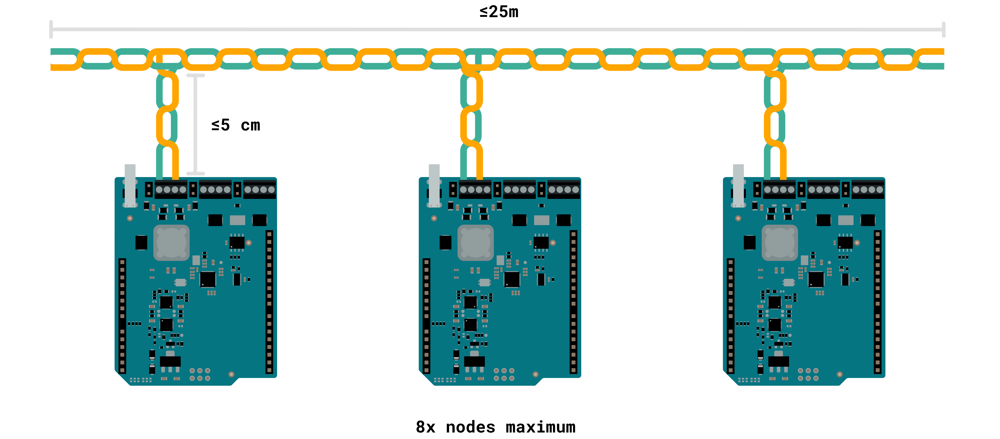
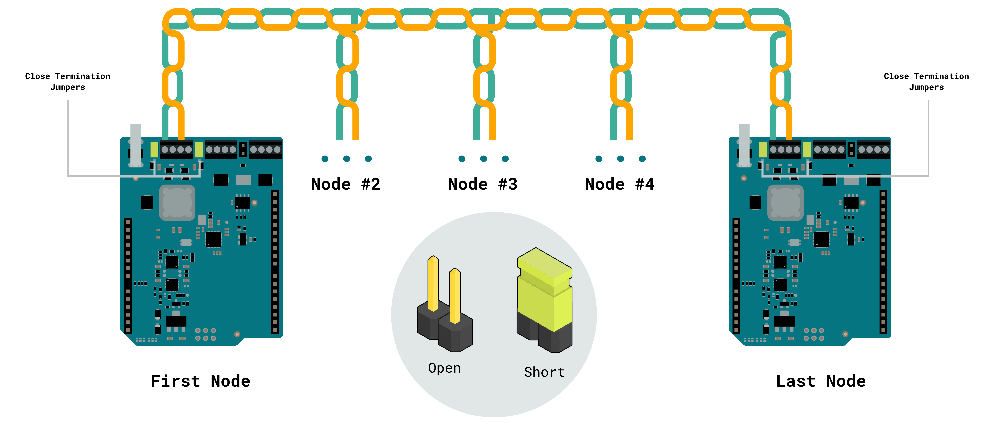
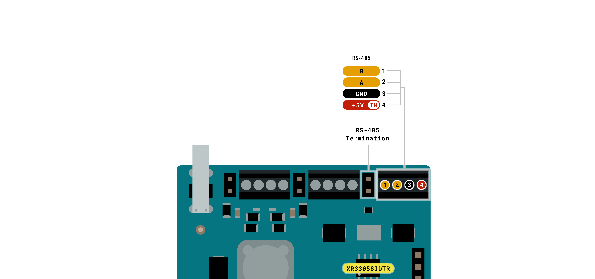

# Description

The Arduino UNO SPE Shield is a versatile solution for industrial communication, IoT, and automation, combining Single Pair Ethernet (10BASE-T1S) and RS-485. It enables integration into low-power Ethernet networks and robust serial communication systems, ensuring efficient connectivity in embedded environments.

Compatible with the Arduino UNO form factor, it supports SPI, UART, and I2C, facilitating interoperability with various devices. Additionally, it features screw terminals for additional connectivity and power options. 

Its robust design and advanced protection makes it ideal for applications in industrial environments for remote monitoring and automated control.

# Target Areas:

Industrial automation, building automation, factory automation, automotive networks

# CONTENTS

## Application Examples

The Arduino UNO SPE Shield expands industrial and IoT communication capabilities, offering a seamless interface for Single Pair Ethernet (10BASE-T1S) and RS-485 networks. Its versatility makes it ideal for applications requiring low-power Ethernet, robust serial communication and industrial automation.  Below are some examples demonstrating its potential across various applications:  

- **Industrial Automation and Networking:** Enable reliable communication and data exchange.
  - **Industrial IoT Gateways:** Bridge RS-485 devices with modern Ethernet (10BASE-T1S) networks to enable real-time data collection, remote monitoring, and Cloud integration for predictive analytics.
  - **Factory Automation and Control Systems:** Integrate RS-485-based PLCs and sensors into a unified Ethernet infrastructure, allowing for centralized control and efficient machine-to-machine communication.
  - **Energy and Smart Grid Monitoring:** Use RS-485 metering devices and Ethernet communication to collect, transmit, and analyze energy data, contributing to smart grid management and optimized energy use.
  
- **Building Automation and Smart Infrastructure:** Connect industrial controllers, smart sensors, and Ethernet-based networks for enhanced automation and monitoring.
  - **HVAC and Environmental Monitoring:** Integrate temperature, humidity, and air quality sensors via RS-485 and transmit data via Ethernet (10BASE-T1S) for effective climate control in buildings.
  - **Access Control and Security Systems:** Link RS-485 door controllers and biometric scanners to networked security systems for real-time authentication and access logging.
  - **Industrial Asset Tracking:** Combine RS-485-connected RFID readers with Ethernet-based asset management systems to monitor equipment and inventory in large facilities.
  - **Remote Monitoring and Edge Computing:** With support for multiple communication protocols, the UNO SPE Shield provides powerful remote monitoring and edge processing for remote equipment diagnostics, real-time data logging and smart agriculture solutions.

The Arduino UNO SPE Shield offers a scalable, open-source platform for developers, enabling rapid prototyping and seamless integration with industrial and IoT networks. Its support for SPI, UART and I2C, alongside RS-485 and Ethernet capabilities; makes it a versatile solution for building resilient and connected systems across industrial, smart infrastructure and automation applications.

## Features
### General Specifications Overview

The main features of the Arduino UNO SPE shield are detailed in the table shown below.

| **Feature**                    | **Description**                                                                                                                                                                                                     |
|--------------------------------|---------------------------------------------------------------------------------------------------------------------------------------------------------------------------------------------------------------------|
| T1S SPE Controller             | LAN8651B1 from Microchip®                                                                                                                                                                                           |
| SPE Data Rate                  | 10 Mbit/s                                                                                                                                                                                                           |
| RS-485 Transceiver             | XR33058IDTR-F from MaxLinear®                                                                                                                                                                                       |
| RS-485 Communication Method    | Half-duplex                                                                                                                                                                                                         |
| RS-485 Data Rate               | 20 Mbit/s                                                                                                                                                                                                           |
| Connectors                     | T1S SPE screws terminal (x1)   T1S SPE dedicated connector (x1)   RS-485 screws terminal (x1)                                                                                                         |
| Arduino UNO Headers Interfaces | UART  SPI  I2C                                                                                                                                                                      |
| Power Options                  | +5 VDC from the USB connector of the connected UNO board  +7-24 VDC from T1SP on screw terminal block, enabling Power over Data Line (PoDL) functionality  +7-24 VDC from VIN on screw terminal block |
| Dimensions                     | 68.85 mm x 53.34 mm                                                                                                                                                                                                 |
| Operating Temperatures         | -40 °C to +85 °C                                                                                                                                                                                                    |

<strong>Note:</strong> The UNO SPE Shield can safely operate with a 24 VDC power supply. While the Arduino UNO R4 is designed to handle this voltage without issue, caution is advised, 24 V can potentially damage UNO R3 boards or any third-party UNO-compatible board.

### Single Pair Ethernet (SPE)
  
Single Pair Ethernet (SPE) enables Ethernet communication over a single twisted pair of wires, reducing cabling complexity without sacrificing performance in IoT and industrial applications.

**Key Features**  
- **Speed:** Operates at **10 Mbps** under the 10BASE-T1S standard.  
- **Maximum Distance:** Supports up to **25 meters** in multidrop topology (multiple nodes on a single segment).  
- **Topology:** Allows up to eight nodes in a multidrop network.  
- **Applications:** IoT devices, sensors, and controllers for industrial automation.  

**SPE Implementation in the Arduino UNO SPE Shield**  
- **Ethernet PHY IC:** The shield uses a 10BASE-T1S PHY, which supports multidrop communication and noise suppression.
  - Includes onboard common-mode chokes to filter high-frequency interference.
- **Connection Points:**
  - **Screw Terminals** for single pair wiring.
  - **Dedicated SPE Connector** for robust direct connections to compatible devices.  

- **Jumper Configuration:** Termination resistors are configurable:
  - **Point-to-Point Setup:** Use jumpers to enable the termination at endpoints for proper signal integrity.
  
  - **Multidrop Setup:** Terminations are disabled internally; only the furthest nodes in the network should be terminated. 
  
  - **Detailed Setup:** For nodes at the **start or end of the network**, activate the onboard termination closing by jumpers, ensuring proper impedance matching. Intermediate nodes should leave the jumper unconnected.
- **PoDL (Power over Data Line):** Capable of transmitting power (+7-24 VDC) along with data on the same pair of wires.

  <strong>Node Distance:</strong> Each node should maintain a maximum distance of <strong>5 cm</strong> from the bus to ensure stable communication and signal integrity.

#### Connection Recommendations

When using the UNO SPE Shield screw terminals to wire the 10BASE‑T1S network you must meet the following recommendations:

- The cable used must be a twisted pair and the maximum length of the bus must be ≤ 25 m.
- The multidrop mode can support up to eight nodes on one mixing segment.
- On a multidrop configuration, the stub distance must be ≤ 5 cm.

- Short the termination jumpers on the first and last nodes of the SPE bus. This ensures proper impedance matching and avoids signal reflextions maintaining the data integrity. Intermediate nodes should leave the jumper unconnected.

#### Interoperability Between RS-485 and SPE

The shield supports simultaneous operation of RS-485 and SPE protocols.  
- **Electrical Isolation:** Both systems are decoupled via onboard filters and protection circuits, preventing interference.  
- **Practical Design Considerations:** To maximize performance, use short, high-quality cables for both protocols, adhering to recommended lengths and shielding practices.

### RS-485

RS-485 is a robust communication protocol designed for industrial settings. It features differential signaling that ensures noise immunity and reliability over long distances. 

- **Key Features**  
  - **Speed:** Up to **20 Mbps** for short distances (<15 m).  
  - **Maximum Distance:** Supports up to 1,200 m with reduced speeds.  
  - **Topology:** Works in a bus topology, supporting up to 80 nodes.  
  - **Applications:** Commonly used in industrial automation (PLCs, HVAC systems, motor controllers).  

- **RS-485 Implementation in the Arduino UNO SPE Shield**  
  - **RS-485 Driver IC:** The shield uses an XR33058IDTR-F transceiver, which manages signal transmission and reception with high noise tolerance.
    - Includes support for fail-safe biasing (ensuring stable idle-state signals).
  - **Connection Points:** RS-485 screw terminals allow direct wiring of RS-485 devices.
      
  - **Termination:** Includes a 120 Ω termination jumper to match the bus impedance.  
    - Proper termination minimizes signal reflections, critical for long-distance communication stability.
  
### Communication Interfaces
The UNO SPE Shield exposes all the UNO host board connections and communication interfaces through the header pins.  

| Interfaces   | Connector                                                  |
| ------------ | ---------------------------------------------------------- |
| T1S SPE (x1) | - Screws terminal   - Dedicated connector           |
| RS-485 (x1)  | - Screws terminal                                          |
| UART (x1)    | - UNO header connector (pin D0, D1)                        |
| SPI (x1)     | - UNO header connector (pin D10-D13)  - ICSP header |
| I2C (x1)     | - UNO header connector (pin A4, A5, SDA, SCL)              |

### Related Accessories

- T1S SPE dedicated connector (built-in)
- SPE IEC 63171-2 cable (not included)

### Related Products

- Arduino UNO R4 WiFi (SKU: ABX00087)
  
## Power and Ratings
### Recommended Operating Conditions

The Arduino UNO SPE Shield is designed for reliable operation across diverse environments, integrating advanced protection mechanisms and flexible power options.

|          **Parameter**          |   **Symbol**    | **Min** | **Typ** | **Max** | **Unit** |
| :-----------------------------: | :-------------: | :-----: | :-----: | :-----: | :------: |
| USB Supply Voltage (Host board) | VUSB |    -    |   5.0   |    -    |    V     |
|      Supply Input Voltage       | VIN  |   7.0   |    -    |  24.0   |    V     |
|      Power over Data Line       |      PoDL       |   7.0   |    -    |  24.0   |    V     |
|      Operating Temperature      | TOP  |   -40   |    -    |   85    |    °C    |
|        Operating Current        | IMAX |    -    |    -    |   2.0   |    A     |

### Power Options

The **Arduino UNO SPE Shield** is designed with a robust and efficient power management system to ensure reliable operation in industrial and noisy environments. It supports multiple power input sources and incorporates advanced protection mechanisms.

- **+5 VDC** from the **USB** connector of the connected Arduino UNO board.
- **+7-24 VDC** from **T1SP** screw terminal block, enabling **Power over Data Line (PoDL)** functionality.
- **+7-24 VDC** from **VIN** screw terminal block, allowing external DC power input.

### Power Tree

The following diagram illustrates the UNO SPE Shield main system power architecture.

#### Power Management and Protection Features

To ensure a stable and secure power system, the shield includes several protection mechanisms:

- **Under-Voltage Lockout (UVLO):** Prevents operation below **4.2 V**, avoiding instability.
- **Over-Voltage Lockout (OVLO):** Limits voltage to **29.9 V**, protecting against excessive input.
- **Over-Current Protection:** Restricts power draw to **2 A**, preventing circuit damage.
- **Transient Voltage Suppression (TVS):** Absorbs sudden voltage spikes (24 V rated diodes).
- **Electrostatic Discharge (ESD) Protection:** Shields critical components from electrical surges on the SPE connection.

#### Switching System

The shield includes an intelligent **switching system** to control power distribution efficiently:

| **Switch**    | **Function**                                                                            |
| ------------- | --------------------------------------------------------------------------------------- |
| LOCAL_ENABLE  | Activates internal power from VIN for shield operation. Disabled by default.            |
| T1S_DISABLE   | Disables Single Pair Ethernet (PoDL) power. Power over Data Line is enabled by default. |

<strong>Note:</strong> By default, the board is set to be powered by SPE (PoDL), but you can activate local power through software.

#### Startup and Recovery Mechanisms
To ensure safe operation, the system includes:
- Startup Delay (TSTART): Default 100 ms delay before power activation.
- Automatic Retry Mode: Enables recovery after transient faults for continuous stability.

## Functional Overview

The core of the UNO SPE Shield is the LAN8651B1 Single Pair Ethernet controller from Microchip® and the XR33058IDTR-F RS-485 transceiver. The shield also exposes the access to several host board peripherals.

### Pinout

The UNO SPE Shield pinout is shown in the following figure:

### Block Diagram

An overview of the UNO SPE Shield high-level architecture is illustrated in the figure below:

## Shield Topology

### Overall View

| Reference   | Description                                            |
| ----------- | ------------------------------------------------------ |
| U1          | Level Shifter IC (P/N: TXB0108DQSR)                    |
| U2          | 10BASE-T1S MAC-PHY Ethernet Controller                 |
| U3_1, U3_2  | High-Side Power Switch                                 |
| J1          | Header Connector 2.54 mm, 2x3 positions                |
| J2, J5, J7  | Screw Terminal Connector, 4x positions, pitch 2.54 mm  |
| J3, J4, J12 | Male Vertical Pin Header, 2x positions, pitch 2.54 mm  |
| J6          | Connector 10BASE-T1S, Category B, Single Pair Ethernet |
| JANALOG     | ANALOG UNO SHIELDS Header, 2.54 mm, 8+6 pins           |
| JDIGITAL    | DIGITAL UNO SHIELDS Header, 2.54 mm, 8+10 pins         |

## Device Operation

### Getting Started - IDE

To program your Arduino UNO SPE Shield with an Arduino UNO R4 WiFi board, install the Arduino Desktop IDE **[1]**. You will need a compatible USB cable to connect the board to your computer which can also provide power to the board.

### Getting Started - Arduino Cloud

All Arduino IoT-enabled products are supported on Arduino Cloud, which allows you to log, graph, and analyze sensor data, trigger events, and automate your home or business. Refer to the official documentation for more details.

### Online Resources

Now that you have gone through the basics of what you can do with the device, you can explore the endless possibilities it provides by checking exciting projects on Arduino Project Hub **[4]**, the Arduino Library Reference **[5]**, and the online store **[6]** where you will be able to complement your Arduino UNO SPE Shield board with additional extensions, sensors, and actuators.

## Mechanical Information

The UNO SPE Shield is a double-sided 53.34 mm x 68.58 mm board with an array of terminal blocks and a dedicated SPE connector on the top edge, Arduino UNO standard shield headers around the two long edges and a ICSP connector on the bottom edge.

### Shield Dimensions

The outline of the Arduino UNO SPE Shield is shown in the figure below, with all dimensions provided in millimeters (mm).

The UNO SPE Shield was designed to be usable as a stackable shield on top of Arduino UNO form factor boards.

## Certifications

### Certifications Summary

|  **Certification**  | **Status** |
| :-----------------: | :--------: |
| CE (European Union) |    Yes     |
|      FCC (USA)      |    Yes     |
|     IC (Canada)     |    Yes     |
|      UKCA (UK)      |    Yes     |
|        RoHS         |    Yes     |
|        REACH        |    Yes     |
|        WEEE         |    Yes     |

### Declaration of Conformity CE DoC (EU)

We declare under our sole responsibility that the products above are in conformity with the essential requirements of the following EU Directives and therefore qualify for free movement within markets comprising the European Union (EU) and European Economic Area (EEA).

### Declaration of Conformity to EU RoHS & REACH 211 01/19/2021

Arduino boards are in compliance with RoHS 2 Directive 2011/65/EU of the European Parliament and RoHS 3 Directive 2015/863/EU of the Council of 4 June 2015 on the restriction of the use of certain hazardous substances in electrical and electronic equipment.

| **Substance**                          | **Maximum Limit (ppm)** |
| -------------------------------------- | ----------------------- |
| Lead (Pb)                              | 1000                    |
| Cadmium (Cd)                           | 100                     |
| Mercury (Hg)                           | 1000                    |
| Hexavalent Chromium (Cr6+)             | 1000                    |
| Poly Brominated Biphenyls (PBB)        | 1000                    |
| Poly Brominated Diphenyl ethers (PBDE) | 1000                    |
| Bis(2-Ethylhexyl) phthalate (DEHP)     | 1000                    |
| Benzyl butyl phthalate (BBP)           | 1000                    |
| Dibutyl phthalate (DBP)                | 1000                    |
| Diisobutyl phthalate (DIBP)            | 1000                    |

Exemptions: No exemptions are claimed.

Arduino Boards are fully compliant with the related requirements of European Union Regulation (EC) 1907 /2006 concerning the Registration, Evaluation, Authorization and Restriction of Chemicals (REACH). We declare none of the SVHCs (https://echa.europa.eu/web/guest/candidate-list-table), the Candidate List of Substances of Very High Concern for authorization currently released by ECHA, is present in all products (and also package) in quantities totaling in a concentration equal or above 0.1%. To the best of our knowledge, we also declare that our products do not contain any of the substances listed on the "Authorization List" (Annex XIV of the REACH regulations) and Substances of Very High Concern (SVHC) in any significant amounts as specified by the Annex XVII of Candidate list published by ECHA (European Chemical Agency) 1907 /2006/EC.

### Conflict Minerals Declaration

As a global supplier of electronic and electrical components, Arduino is aware of our obligations concerning laws and regulations regarding Conflict Minerals, specifically the Dodd-Frank Wall Street Reform and Consumer Protection Act, Section 1502. Arduino does not directly source or process conflict minerals such as Tin, Tantalum, Tungsten, or Gold. Conflict minerals are contained in our products in the form of solder, or as a component in metal alloys. As part of our reasonable due diligence, Arduino has contacted component suppliers within our supply chain to verify their continued compliance with the regulations. Based on the information received thus far we declare that our products contain Conflict Minerals sourced from conflict-free areas.

### FCC Caution

Any Changes or modifications not expressly approved by the party responsible for compliance could void the user’s authority to operate the equipment.

This device complies with part 15 of the FCC Rules. Operation is subject to the following two conditions:

1. This device may not cause harmful interference

2. This device must accept any interference received, including interference that may cause undesired operation.

**FCC RF Radiation Exposure Statement:**

1. This Transmitter must not be co-located or operating in conjunction with any other antenna or transmitter

2. This equipment complies with RF radiation exposure limits set forth for an uncontrolled environment

3. This equipment should be installed and operated with a minimum distance of 20 cm between the radiator and your body.

**Note:** This equipment has been tested and found to comply with the limits for a Class B digital
device, pursuant to part 15 of the FCC Rules. These limits are designed to provide
reasonable protection against harmful interference in a residential installation. This equipment
generates, uses and can radiate radio frequency energy and, if not installed and used in
accordance with the instructions, may cause harmful interference to radio communications.
However, there is no guarantee that interference will not occur in a particular installation. If
this equipment does cause harmful interference to radio or television reception, which can be
determined by turning the equipment off and on, the user is encouraged to try to correct the
interference by one or more of the following measures:
- Reorient or relocate the receiving antenna.
- Increase the separation between the equipment and receiver.
- Connect the equipment into an outlet on a circuit different from that to which the
receiver is connected.
- Consult the dealer or an experienced radio/TV technician for help.

English:
User manuals for license-exempt radio apparatus shall contain the following or equivalent notice in a conspicuous location in the user manual or alternatively on the device or both. This device complies with Industry Canada license-exempt RSS standard(s). Operation is subject to the following two conditions:

1. This device may not cause interference

2. This device must accept any interference, including interference that may cause undesired operation of the device.

French:
Le présent appareil est conforme aux CNR d’Industrie Canada applicables aux appareils radio exempts de licence. L’exploitation est autorisée aux deux conditions suivantes:

1. L’ appareil nedoit pas produire de brouillage

2. L’utilisateur de l’appareil doit accepter tout brouillage radioélectrique subi, même si le brouillage est susceptible d’en compromettre le fonctionnement.

**IC SAR Warning:**

English:
This equipment should be installed and operated with a minimum distance of 20 cm between the radiator and your body.

French:
Lors de l’ installation et de l’ exploitation de ce dispositif, la distance entre le radiateur et le corps est d ’au moins 20 cm.

**Important:** The operating temperature of the EUT can’t exceed 85 °C and shouldn’t be lower than -40 °C.

Hereby, Arduino S.r.l. declares that this product is in compliance with essential requirements and other relevant provisions of Directive 2014/53/EU. This product is allowed to be used in all EU member states.

## Company Information

| **Company Information** | **Details**                                |
| ----------------------- | ------------------------------------------ |
| **Company Name**        | Arduino S.r.l.                             |
| **Company Address**     | Via Andrea Appiani, 25-20900 Monza (Italy) |

## Reference Documentation

| **No.** | **Reference**                   | **Link**                                               |
| :-----: | ------------------------------- | ------------------------------------------------------ |
|    1    | Arduino IDE (Desktop)           | https://www.arduino.cc/en/Main/Software                |
|    2    | Arduino IDE (Cloud)             | https://app.arduino.cc/sketches                       |
|    3    | Arduino Cloud - Getting Started | https://docs.arduino.cc/arduino-cloud/guides/overview/ |
|    4    | Project Hub                     | https://create.arduino.cc/projecthub                   |
|    5    | Library Reference               | https://www.arduino.cc/reference/en/                   |
|    6    | Online Store                    | https://store.arduino.cc/                              |

## Document Revision History

|  **Date**  | **Revision** |  **Changes**  |
| :--------: | :----------: | :-----------: |
| 21/04/2025 |      1       | First release |