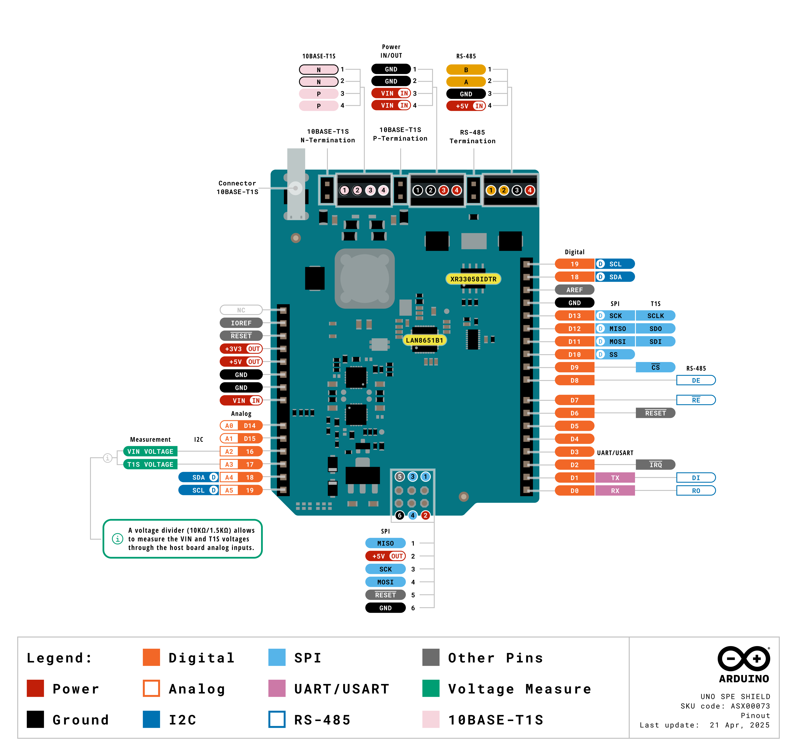
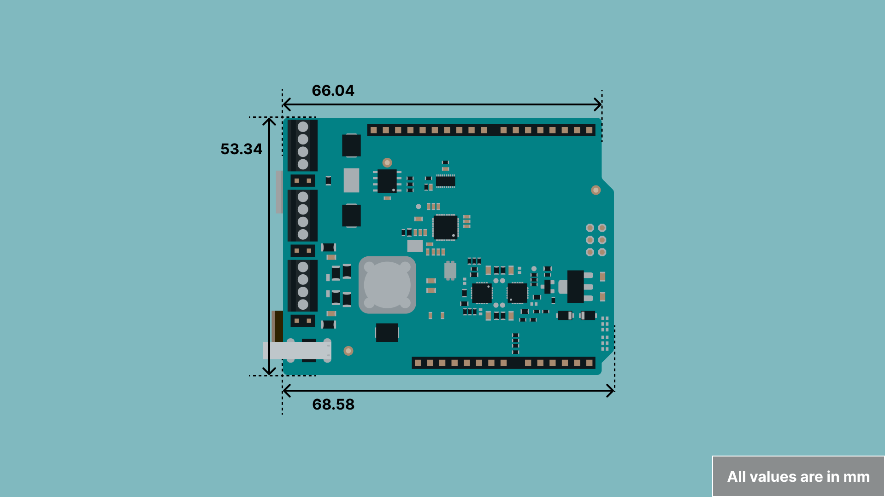
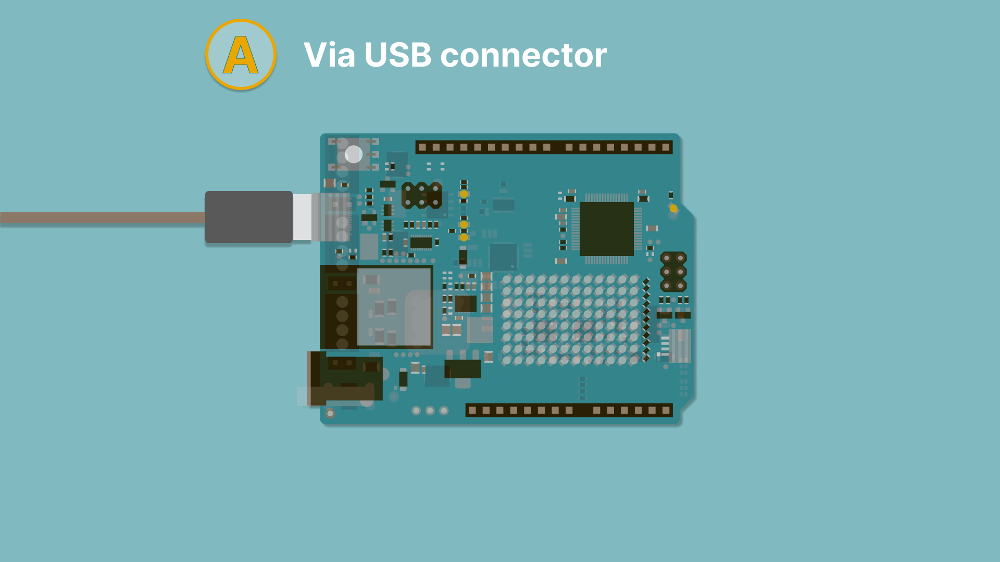
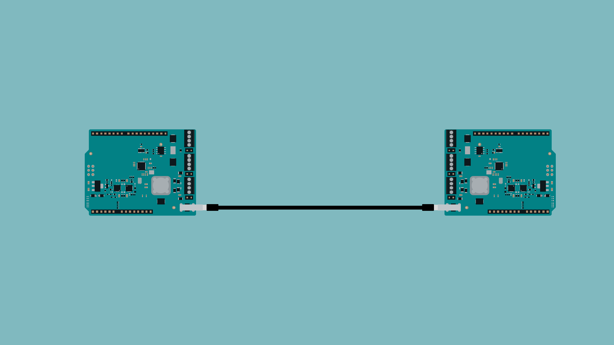
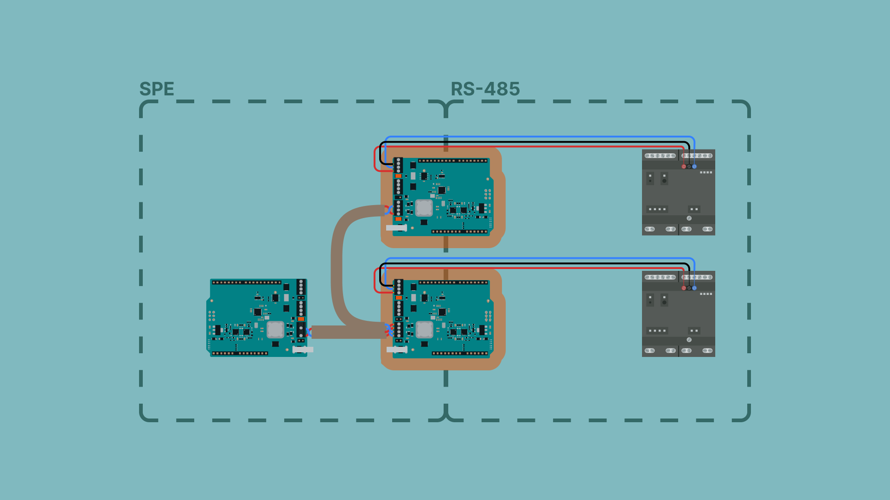
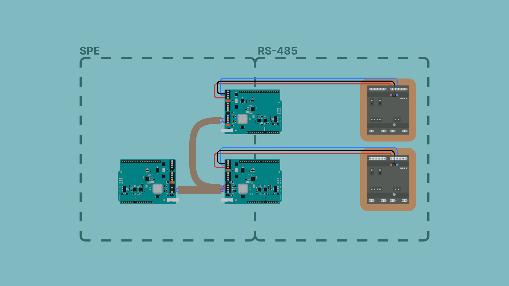

Learn how to establish Single Pair Ethernet (SPE) communication using the Arduino® UNO SPE Shield, enabling industrial IoT connectivity with minimal wiring complexity.

## Overview

The Arduino® UNO SPE Shield brings industrial-grade Single Pair Ethernet (10BASE-T1S) connectivity to Arduino boards, revolutionizing how we connect devices in industrial and IoT applications. This shield combines the simplicity of Ethernet communication with the efficiency of using just a single twisted pair of wires, making it ideal for environments where cable reduction and reliable communication are crucial.

In this guide, you'll learn how to set up your first SPE network, understand the fundamentals of 10BASE-T1S communication, and implement both point-to-point and multidrop network configurations.


## Hardware and Software Requirements

### Hardware Requirements

- Arduino® UNO SPE Shield
- Compatible Arduino board:
  - Arduino® UNO R4 WiFi (recommended)
  - Arduino® UNO R4 Minima
  - Arduino® UNO R3
- USB cables for programming
- Twisted pair cable for SPE connection

### Software Requirements

- [Arduino IDE 2.0](https://www.arduino.cc/en/software) or [Arduino Web Editor](https://create.arduino.cc/editor)
- [Arduino_10BASE_T1S library](https://github.com/arduino-libraries/Arduino_10BASE_T1S) (available through Library Manager)
- [ArduinoModbus library](https://github.com/arduino-libraries/ArduinoModbus) (for industrial protocols)

## Product Overview

The Arduino UNO SPE Shield is a versatile solution for industrial communication, IoT, and automation, combining Single Pair Ethernet (10BASE-T1S) and RS-485. It enables integration into low-power Ethernet networks and robust serial communication systems, ensuring efficient connectivity in embedded environments.

Compatible with the Arduino UNO form factor, it supports SPI, UART, and I2C, facilitating interoperability with various devices. Additionally, it features screw terminals for additional connectivity and power options. Its robust design and advanced protection makes it ideal for applications in industrial environments for remote monitoring and automated control.


### Key Features

- **Single Pair Ethernet**: 10BASE-T1S standard with 10 Mbps data rate, supporting up to 25 meters in multidrop topology with up to 8 nodes
- **RS-485 Communication**: Half-duplex operation at 20 Mbps with 120Ω termination jumper and fail-safe biasing
- **Multiple Interfaces**: UART, SPI, and I2C connectivity through Arduino UNO headers
- **Robust Design**: Operating temperature range -40°C to +85°C with advanced protection features
- **Dimensions**: Standard Arduino shield form factor at 68.58 mm x 53.34 mm

### Pinout

The full pinout is available below:



### Datasheet

The complete datasheet is available and downloadable as PDF from the link below:
- [Arduino UNO SPE Shield datasheet](https://docs.arduino.cc/resources/datasheets/ASX00073-datasheet.pdf)

### Schematics

The complete schematics are available and downloadable as PDF from the link below:

- [Arduino UNO SPE Shield schematics](https://docs.arduino.cc/resources/schematics/ASX00073-schematics.pdf)

### STEP Files

The complete STEP files are available and downloadable from the link below:

- [Arduino UNO SPE Shield STEP files](../../downloads/ASX00073-step.zip)

### Form Factor

The Arduino UNO SPE Shield follows the standard Arduino UNO shield form factor, ensuring compatibility with all Arduino UNO boards and enabling stackable designs. With dimensions of 68.58 mm x 53.34 mm, the shield maintains the familiar Arduino ecosystem layout while adding industrial-grade communication capabilities.
The shield features the standard Arduino UNO header arrangement with digital and analog pin access, ICSP connector placement, and proper mounting hole alignment.



This standardized form factor allows seamless integration into existing Arduino UNO projects and ensures that the shield can be easily incorporated into enclosures and mounting systems designed for the Arduino UNO ecosystem.

## First Use of Your Arduino UNO SPE Shield

### Stack the Shield

1. Align the Arduino UNO SPE Shield with your Arduino board
2. Carefully press down on the headers to ensure proper connection
3. Verify all pins are properly seated

### Power the Board

The shield can be powered through multiple sources:

- **USB Power**: Via the board's USB connection.
- **Power Jack**: Via the board's power jack.
- **External Power**: Through the VIN terminal.
- **Power over Data Line (PoDL)**: 7-24V DC through the T1SP terminal.



## Simple broadcast Example 

This example demonstrates a simple broadcast communication system between multiple nodes on an SPE network. Each node can broadcast messages to all other nodes, and automatically responds with "pong" when it receives a "ping" message. This creates an interactive network where you can test connectivity and response times between different devices.



### Hardware Setup

1. **Configure Termination Jumpers**: For point-to-point connections, close the termination jumpers on both shields
2. **Connect the SPE Cable**: Wire the twisted pair between the two shields' SPE terminals (N and P pins)
3. **Apply terminator caps**: On edge nodes (first and last) in the bus
4. **Power Both Systems**: Ensure both Arduino boards are powered

### Sketch

The system uses UDP broadcasting to send messages to all nodes simultaneously, making it perfect for testing your SPE network setup and verifying that all nodes are communicating properly. Each node operates independently, listening for incoming messages while also being able to send its own broadcasts.

**Important**: Before uploading this code to each board, you must change the `NODE_ID` constant to a unique value between 0 and 7. Each node on the network must have a different ID to ensure proper communication and avoid conflicts. For example:
- First board: `MY_NODE_NUMBER = 0;`
- Second board: `MY_NODE_NUMBER = 1;`
- Third board(optional): `MY_NODE_NUMBER = 2;`

Remember that any termination nodes should have the termination headers properly closed, more info on the [Arduino UNO SPE Shield datasheet](https://docs.arduino.cc/resources/datasheets/ASX00073-datasheet.pdf).

The node ID determines the device's IP address (192.168.42.100 + NODE_ID) and its position in the PLCA (Physical Layer Collision Avoidance) cycle. When you type a message in the Serial Monitor and press Enter, it's broadcast to all nodes on the network. If any node receives the word "ping", it automatically responds with "pong" to the sender.

```arduino
// Simple 10BASE-T1S Ping-Pong Network
// Each board can send messages to all others
// Automatically replies "pong" when it receives "ping"

#include <Arduino_10BASE_T1S.h>
#include <SPI.h>

// CHANGE THIS NUMBER FOR EACH BOARD (0, 1, 2, 3, etc.)
const int MY_NODE_NUMBER = 0;

// Network addresses (like house addresses on a street)
const IPAddress MY_IP_ADDRESS(192, 168, 42, 100 + MY_NODE_NUMBER);
const IPAddress SUBNET_MASK(255, 255, 255, 0);
const IPAddress GATEWAY_ADDRESS(192, 168, 42, 100);
const IPAddress BROADCAST_ADDRESS(192, 168, 42, 255);  // Sends to everyone
const int NETWORK_PORT = 8888;

// Hardware objects (think of these as your network components)
TC6::TC6_Io* networkIO = nullptr;
TC6::TC6_Arduino_10BASE_T1S* networkController = nullptr;
Arduino_10BASE_T1S_UDP* messageService = nullptr;

// For reading typed messages
char typedMessage[128];
int messageLength = 0;

void setup() {
  // Start serial communication
  Serial.begin(115200);
  delay(1000);
  
  // Show which node this is
  Serial.print("\n=== Network Node #");
  Serial.print(MY_NODE_NUMBER);
  Serial.println(" ===");
  Serial.print("My IP address: ");
  Serial.println(MY_IP_ADDRESS);
  
  // Set up the network hardware
  if (!setupNetwork()) {
    Serial.println("ERROR: Network setup failed!");
    while(1) {
      delay(1000);  // Stop here if network won't start
    }
  }
  
  Serial.println("\n✓ Ready to communicate!");
  Serial.println("Type a message and press Enter to send to everyone");
  Serial.println("I'll automatically reply 'pong' if someone sends 'ping'\n");
}

void loop() {
  // Keep the network running (like keeping your phone connected to WiFi)
  (*networkController).service();
  
  // Check if user typed something
  checkForTypedMessages();
  
  // Check if someone sent us a message
  checkForIncomingMessages();
  
  // Show we're still alive every 10 seconds
  showHeartbeat();
}

bool setupNetwork() {
  Serial.println("Setting up network hardware...");
  
  // Create the network components
  networkIO = new TC6::TC6_Io(SPI, CS_PIN, RESET_PIN, IRQ_PIN);
  networkController = new TC6::TC6_Arduino_10BASE_T1S(networkIO);
  messageService = new Arduino_10BASE_T1S_UDP();
  
  // Set up interrupt (this lets the network chip tell us when data arrives)
  pinMode(IRQ_PIN, INPUT_PULLUP);
  attachInterrupt(digitalPinToInterrupt(IRQ_PIN), []() {
    if (networkIO) (*networkIO).onInterrupt();
  }, FALLING);
  
  // Start the low-level network interface
  if (!(*networkIO).begin()) {
    Serial.println("Failed to start network interface");
    return false;
  }
  
  // Create unique network identity
  MacAddress myMacAddress = MacAddress::create_from_uid();
  T1SPlcaSettings plcaSettings(MY_NODE_NUMBER);
  T1SMacSettings macSettings;
  
  // Connect to the network with our address
  if (!(*networkController).begin(MY_IP_ADDRESS, SUBNET_MASK, GATEWAY_ADDRESS, 
                                myMacAddress, plcaSettings, macSettings)) {
    Serial.println("Failed to join network");
    return false;
  }
  
  // Configure output pins (not used in this simple example)
  (*networkController).digitalWrite(TC6::DIO::A0, false);
  (*networkController).digitalWrite(TC6::DIO::A1, false);
  
  // Start the message service
  if (!(*messageService).begin(NETWORK_PORT)) {
    Serial.println("Failed to start message service");
    return false;
  }
  
  Serial.print("Network ID (MAC): ");
  Serial.println(myMacAddress);
  Serial.println("✓ Network setup complete");
  
  return true;
}

void checkForTypedMessages() {
  // Read characters as user types
  while (Serial.available()) {
    char newChar = Serial.read();
    
    // If user pressed Enter, send the message
    if (newChar == '\n' || newChar == '\r') {
      if (messageLength > 0) {
        typedMessage[messageLength] = '\0';  // End the string
        sendMessageToEveryone(typedMessage);
        messageLength = 0;  // Reset for next message
      }
    }
    // Add character to our message (if there's room)
    else if (messageLength < sizeof(typedMessage) - 1) {
      typedMessage[messageLength] = newChar;
      messageLength++;
    }
  }
}

void sendMessageToEveryone(const char* message) {
  // Don't send empty messages
  if (!messageService || strlen(message) == 0) {
    return;
  }
  
  // Send to broadcast address (everyone on network gets it)
  (*messageService).beginPacket(BROADCAST_ADDRESS, NETWORK_PORT);
  (*messageService).write((const uint8_t*)message, strlen(message));
  (*messageService).endPacket();
  
  Serial.print("📤 Sent to all: ");
  Serial.println(message);
}

void checkForIncomingMessages() {
  // See if a message arrived
  int messageSize = (*messageService).parsePacket();
  
  // No message or message too big
  if (messageSize <= 0 || messageSize >= 256) {
    return;
  }
  
  // Read the message
  char receivedMessage[256] = {0};
  IPAddress senderAddress = (*messageService).remoteIP();
  
  int bytesRead = (*messageService).read((uint8_t*)receivedMessage, 
                                       min(messageSize, 255));
  if (bytesRead <= 0) {
    return;
  }
  
  receivedMessage[bytesRead] = '\0';  // End the string properly
  
  // Show who sent what
  Serial.print("📥 From ");
  Serial.print(senderAddress);
  Serial.print(": ");
  Serial.println(receivedMessage);
  
  // If someone sent "ping", automatically reply "pong"
  if (strcmp(receivedMessage, "ping") == 0) {
    // Small delay to avoid message collisions (each node waits different time)
    delay(10 + (MY_NODE_NUMBER * 5));
    replyPongTo(senderAddress);
  }
}

void replyPongTo(IPAddress targetAddress) {
  // Send "pong" back to whoever sent "ping"
  (*messageService).beginPacket(targetAddress, NETWORK_PORT);
  (*messageService).write((const uint8_t*)"pong", 4);
  (*messageService).endPacket();
  
  Serial.println("🏓 Auto-replied: pong");
}

void showHeartbeat() {
  static unsigned long lastHeartbeat = 0;
  
  // Every 10 seconds, show we're still running
  if (millis() - lastHeartbeat > 10000) {
    lastHeartbeat = millis();
    Serial.println("💓 [System running normally]");
  }
}
```

### Transducer Node SPE/RS-485

The gateway nodes serve as protocol translators between the SPE network and RS-485 devices. Each gateway consists of an Arduino board with an SPE shield, where the board's hardware serial port (Serial1) connects to the RS-485 transceiver on the shield. These nodes receive UDP packets from the SPE network, extract the command data, and forward it to the RS-485 bus.



When an Opta board responds via RS-485, the gateway captures the response and sends it back to the central controller as a UDP packet. This bidirectional translation allows transparent communication between the SPE-based control system and RS-485 devices, making it possible to control multiple Opta boards from a single point on the network.

```arduino
// SPE/RS-485 Gateway - Bridges between SPE network and RS-485
#include <Arduino_10BASE_T1S.h>
#include <SPI.h>

const uint8_t NODE_ID = 0;  // Gateway node ID
const uint16_t UDP_PORT = 8888;

// Network setup
const IPAddress IP(192, 168, 42, 100 + NODE_ID);
const IPAddress NETMASK(255, 255, 255, 0);
const IPAddress GATEWAY_IP(192, 168, 42, 100);
const IPAddress SERVER_IP(192, 168, 42, 107);  // Server at node 7

TC6::TC6_Io* tc6_io = nullptr;
TC6::TC6_Arduino_10BASE_T1S* tc6_inst = nullptr;
Arduino_10BASE_T1S_UDP* udp = nullptr;

void setup() {
  Serial.begin(115200);  // Debug
  Serial1.begin(9600);   // RS-485
  delay(1000);
  
  Serial.println("\n=== SPE/RS-485 Gateway ===");
  
  if (!initNetwork()) {
    Serial.println("Network init failed!");
    while(1);
  }
  
  Serial.println("Gateway ready!");
}

void loop() {
  tc6_inst->service();
  
  // SPE -> RS-485
  int packetSize = udp->parsePacket();
  if (packetSize > 0) {
    char buffer[256] = {0};
    udp->read((uint8_t*)buffer, min(packetSize, 255));
    
    // Forward to RS-485
    Serial1.println(buffer);
    Serial.print("SPE->RS485: ");
    Serial.println(buffer);
  }
  
  // RS-485 -> SPE
  if (Serial1.available()) {
    String response = Serial1.readStringUntil('\n');
    response.trim();
    
    if (response.length() > 0) {
      // Forward to server
      udp->beginPacket(SERVER_IP, UDP_PORT);
      udp->write((uint8_t*)response.c_str(), response.length());
      udp->endPacket();
      
      Serial.print("RS485->SPE: ");
      Serial.println(response);
    }
  }
}

bool initNetwork() {
  tc6_io = new TC6::TC6_Io(SPI, CS_PIN, RESET_PIN, IRQ_PIN);
  tc6_inst = new TC6::TC6_Arduino_10BASE_T1S(tc6_io);
  udp = new Arduino_10BASE_T1S_UDP();
  
  pinMode(IRQ_PIN, INPUT_PULLUP);
  attachInterrupt(digitalPinToInterrupt(IRQ_PIN), []() {
    if (tc6_io) tc6_io->onInterrupt();
  }, FALLING);
  
  if (!tc6_io->begin()) return false;
  
  MacAddress mac = MacAddress::create_from_uid();
  T1SPlcaSettings plca(NODE_ID);
  T1SMacSettings mac_settings;
  
  if (!tc6_inst->begin(IP, NETMASK, GATEWAY_IP, mac, plca, mac_settings)) 
    return false;
  
  tc6_inst->digitalWrite(TC6::DIO::A0, false);
  tc6_inst->digitalWrite(TC6::DIO::A1, false);
  
  return udp->begin(UDP_PORT);
}
```

### Opta RS-485 interface

The Arduino Opta boards represent the end devices in this system, receiving commands via RS-485 and executing the requested actions. Each Opta configures pins 2-13 as digital outputs and listens for specific command formats on its serial interface. The boards can process three types of commands: reading individual pin states, writing to specific pins, or reading all pin states at once.



When an Opta receives a command, it parses the instruction, performs the requested operation, and sends back a formatted response. This simple protocol allows the central SPE controller to remotely monitor and control multiple Opta boards across the RS-485 network, creating a flexible and scalable industrial control system.

```arduino
// Arduino Opta - Receives commands via RS-485 and controls pins
void setup() {
  Serial.begin(9600);  // RS-485 communication
  
  // Setup pins 2-13 as outputs
  for (int pin = 2; pin <= 13; pin++) {
    pinMode(pin, OUTPUT);
    digitalWrite(pin, LOW);
  }
}

void loop() {
  if (Serial.available()) {
    String cmd = Serial.readStringUntil('\n');
    cmd.trim();
    processCommand(cmd);
  }
}

void processCommand(String cmd) {
  if (cmd.startsWith("READ:")) {
    int pin = cmd.substring(5).toInt();
    if (pin >= 2 && pin <= 13) {
      int state = digitalRead(pin);
      Serial.print("PIN:");
      Serial.print(pin);
      Serial.print(":");
      Serial.println(state);
    }
  }
  else if (cmd.startsWith("WRITE:")) {
    int colonPos = cmd.indexOf(':', 6);
    if (colonPos > 0) {
      int pin = cmd.substring(6, colonPos).toInt();
      int value = cmd.substring(colonPos + 1).toInt();
      
      if (pin >= 2 && pin <= 13) {
        digitalWrite(pin, value);
        Serial.print("OK:PIN:");
        Serial.print(pin);
        Serial.print(":");
        Serial.println(value);
      }
    }
  }
  else if (cmd == "READALL") {
    Serial.print("PINS:");
    for (int pin = 2; pin <= 13; pin++) {
      Serial.print(digitalRead(pin));
      if (pin < 13) Serial.print(",");
    }
    Serial.println();
  }
}
```

## Troubleshooting

### Common Issues and Solutions

1. **No Communication**
   - Verify termination jumpers are correctly set (closed for P2P, only endpoints for multidrop)
   - Check cable connections and polarity
   - Ensure twisted pair cable is used

2. **Intermittent Communication**
   - Reduce cable length (maximum 25m)
   - Check for proper grounding
   - Verify stub lengths in multidrop (< 5cm)

3. **Power Issues**
   - When using PoDL, ensure power supply can provide sufficient current
   - Check voltage levels are within specification (7-24V)
   - Verify Arduino board voltage compatibility

### LED Indicators

The shield provides status LEDs for diagnostics:
- **PWR**: Power status
- **SPE**: Link activity
- **TX/RX**: Data transmission indicators

## Summary

In this guide, you've learned how to:
- Set up the Arduino UNO SPE Shield for Single Pair Ethernet communication
- Implement point-to-point and multidrop network configurations
- Use Power over Data Line for remote device powering
- Integrate industrial protocols like Modbus over SPE
- Troubleshoot common connectivity issues

The Arduino UNO SPE Shield opens up new possibilities for industrial IoT applications, providing reliable, cost-effective communication with minimal wiring requirements.

## Next Steps

- Explore the [Arduino_10BASE_T1S library documentation](https://github.com/arduino-libraries/Arduino_10BASE_T1S)
- Learn about [RS-485 communication](link-to-rs485-guide) with the same shield
- Build industrial IoT projects with [Arduino Cloud](https://app.arduino.cc)
- Implement advanced protocols like [Modbus](https://github.com/arduino-libraries/ArduinoModbus) over SPE