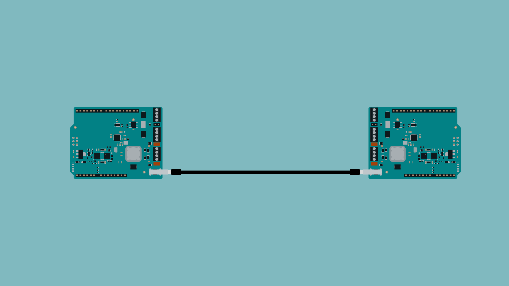

Learn how to establish Single Pair Ethernet (SPE) communication using the Arduino® UNO SPE Shield, enabling industrial IoT connectivity with minimal wiring complexity.

## Overview

The Arduino® UNO SPE Shield brings industrial-grade Single Pair Ethernet (10BASE-T1S) connectivity to Arduino boards, revolutionizing how we connect devices in industrial and IoT applications. This shield combines the simplicity of Ethernet communication with the efficiency of using just a single twisted pair of wires, making it ideal for environments where cable reduction and reliable communication are crucial.

In this guide, you'll learn how to set up your first SPE network, understand the fundamentals of 10BASE-T1S communication, and implement both point-to-point and multidrop network configurations.


## Hardware and Software Requirements

### Hardware Requirements

- Arduino® UNO SPE Shield (x2 minimum for network communication)
- Compatible Arduino boards (x2):
  - Arduino® UNO R4 WiFi (recommended)
  - Arduino® UNO R4 Minima
  - Arduino® UNO R3
- USB cables for programming
- Twisted pair cable for SPE connection

### Software Requirements

- [Arduino IDE 2.0+](https://www.arduino.cc/en/software) or [Arduino Web Editor](https://create.arduino.cc/editor)
- [Arduino_10BASE_T1S library](https://github.com/arduino-libraries/Arduino_10BASE_T1S) (available through Library Manager)
- [ArduinoModbus library](https://github.com/arduino-libraries/ArduinoModbus) (for industrial protocols)

## Product Overview

The Arduino UNO SPE Shield is a versatile communication solution that integrates:

- **10BASE-T1S Single Pair Ethernet**: Enables up to 10 Mbps communication over a single twisted pair
- **RS-485 Transceiver**: For legacy industrial device integration
- **Multiple Power Options**: USB power, external VIN (7-24V), or Power over Data Line (PoDL)
- **Industrial-Grade Protection**: Including under-voltage lockout, over-voltage protection, and ESD protection

### Carrier Architecture Overview

The shield features the Microchip® LAN8651B1 controller for SPE communication, providing:

- Support for up to 8 nodes in multidrop configuration
- Maximum 25 meters cable length
- Built-in termination resistors (configurable via jumpers)
- Common-mode chokes for noise suppression

## First Use of Your Arduino UNO SPE Shield

### Stack the Shield

1. Align the Arduino UNO SPE Shield with your Arduino board
2. Carefully press down on the headers to ensure proper connection
3. Verify all pins are properly seated

### Power the Board

The shield can be powered through multiple sources:

- **USB Power**: Via the board's USB connection.
- **Power Jack**: Via the board's power jack.
- **External Power**: Through the VIN terminal.
- **Power over Data Line (PoDL)**: 7-24V DC through the T1SP terminal.




### Recommended Operating Conditions

| Parameter | Min | Typical | Max | Unit |
|-----------|-----|---------|-----|------|
| USB Supply Voltage | - | 5.0 | - | V |
| External Supply Voltage | 7.0 | 12.0 | 24.0 | V |
| Operating Temperature | -40 | 25 | 85 | °C |

## Check Board/Shield Connection


## Hello World Example

### Setting Up a Point-to-Point SPE Connection

Let's create a simple point-to-point connection between two Arduino boards with SPE shields.

### Hardware Setup

1. **Configure Termination Jumpers**: For point-to-point connections, close the termination jumpers on both shields
2. **Connect the SPE Cable**: Wire the twisted pair between the two shields' SPE terminals (N and P pins)
3. **Power Both Systems**: Ensure both Arduino boards are powered


### Ping/Pong

This example demonstrates a simple ping-pong communication system between multiple nodes on an SPE network. Each node can broadcast messages to all other nodes, and automatically responds with "pong" when it receives a "ping" message. This creates an interactive network where you can test connectivity and response times between different devices.

The system uses UDP broadcasting to send messages to all nodes simultaneously, making it perfect for testing your SPE network setup and verifying that all nodes are communicating properly. Each node operates independently, listening for incoming messages while also being able to send its own broadcasts.


**Important**: Before uploading this code to each board, you must change the `NODE_ID` constant to a unique value between 0 and 7. Each node on the network must have a different ID to ensure proper communication and avoid conflicts. For example:
- First board: `const uint8_t NODE_ID = 0;`
- Second board: `const uint8_t NODE_ID = 1;`
- Third board: `const uint8_t NODE_ID = 2;`

Remember that any termination nodes should have the termination headers properly closed.

The node ID determines the device's IP address (192.168.42.100 + NODE_ID) and its position in the PLCA (Physical Layer Collision Avoidance) cycle. When you type a message in the Serial Monitor and press Enter, it's broadcast to all nodes on the network. If any node receives the word "ping", it automatically responds with "pong" to the sender.

```arduino
// 10BASE-T1S Ping-Pong Communication
// Broadcasts messages between nodes, auto-responds "pong" to "ping"

#include <Arduino_10BASE_T1S.h>

#include <SPI.h>

// Set unique ID for each board (0-7)
const uint8_t NODE_ID = 1;  // <-- Change this for each board!

// Network setup
const IPAddress IP(192, 168, 42, 100 + NODE_ID);
const IPAddress NETMASK(255, 255, 255, 0);
const IPAddress GATEWAY(192, 168, 42, 100);
const IPAddress BROADCAST(192, 168, 42, 255);
const uint16_t UDP_PORT = 8888;

// Hardware instances
TC6::TC6_Io* tc6_io = nullptr;
TC6::TC6_Arduino_10BASE_T1S* tc6_inst = nullptr;
Arduino_10BASE_T1S_UDP* udp = nullptr;

// Serial input buffer
char inputBuffer[128];
int bufferIndex = 0;

void setup() {
  Serial.begin(115200);
  delay(1000);
  
  Serial.print("\n10BASE-T1S Node ");
  Serial.println(NODE_ID);
  Serial.print("IP: ");
  Serial.println(IP);
  
  if (!initializeHardware()) {
    Serial.println("Hardware init failed!");
    while(1) delay(1000);
  }
  
  Serial.println("\nReady! Type messages to broadcast.");
  Serial.println("Sends automatic 'pong' reply to any 'ping'\n");
}

void loop() {
  tc6_inst->service();
  
  handleSerialInput();
  handleIncomingPackets();
  
  // Status heartbeat every 10 seconds
  static unsigned long lastBeat = 0;
  if (millis() - lastBeat > 10000) {
    lastBeat = millis();
    Serial.println("[Running]");
  }
}

bool initializeHardware() {
  // Create hardware objects
  tc6_io = new TC6::TC6_Io(SPI, CS_PIN, RESET_PIN, IRQ_PIN);
  tc6_inst = new TC6::TC6_Arduino_10BASE_T1S(tc6_io);
  udp = new Arduino_10BASE_T1S_UDP();
  
  // Setup interrupt pin
  pinMode(IRQ_PIN, INPUT_PULLUP);
  attachInterrupt(digitalPinToInterrupt(IRQ_PIN), []() {
    if (tc6_io) tc6_io->onInterrupt();
  }, FALLING);
  
  // Initialize IO
  if (!tc6_io->begin()) {
    Serial.println("TC6_Io init failed");
    return false;

  }
  
  // Setup network with unique MAC
  MacAddress mac = MacAddress::create_from_uid();
  T1SPlcaSettings plca_settings(NODE_ID);
  T1SMacSettings mac_settings;
  
  if (!tc6_inst->begin(IP, NETMASK, GATEWAY, mac, plca_settings, mac_settings)) {
    Serial.println("Network init failed");
    return false;
  }
  
  // Configure pins
  tc6_inst->digitalWrite(TC6::DIO::A0, false);
  tc6_inst->digitalWrite(TC6::DIO::A1, false);
  
  // Start UDP
  if (!udp->begin(UDP_PORT)) {
    Serial.println("UDP init failed");
    return false;
  }
  
  Serial.print("MAC: ");
  Serial.println(mac);
  return true;
}

void handleSerialInput() {
  while (Serial.available()) {
    char c = Serial.read();
    
    if (c == '\n' || c == '\r') {
      if (bufferIndex > 0) {
        inputBuffer[bufferIndex] = '\0';
        broadcast(inputBuffer);
        bufferIndex = 0;
      }
    } 
    else if (bufferIndex < sizeof(inputBuffer) - 1) {
      inputBuffer[bufferIndex++] = c;
    }
  }
}

void broadcast(const char* message) {
  if (!udp || strlen(message) == 0) return;
  
  udp->beginPacket(BROADCAST, UDP_PORT);
  udp->write((const uint8_t*)message, strlen(message));
  udp->endPacket();
  
  Serial.print("Sent: ");
  Serial.println(message);
}

void handleIncomingPackets() {
  int packetSize = udp->parsePacket();
  if (packetSize <= 0 || packetSize >= 256) return;
  
  char buffer[256] = {0};
  IPAddress sender = udp->remoteIP();
  
  int bytesRead = udp->read((uint8_t*)buffer, min(packetSize, 255));
  if (bytesRead <= 0) return;
  
  buffer[bytesRead] = '\0';
  
  Serial.print("From ");
  Serial.print(sender);
  Serial.print(" -> ");
  Serial.println(buffer);
  
  // Auto-respond to ping
  if (strcmp(buffer, "ping") == 0) {
    delay(10 + (NODE_ID * 5));  // Avoid collision
    sendPong(sender);
  }
}

void sendPong(IPAddress target) {
  udp->beginPacket(target, UDP_PORT);
  udp->write((const uint8_t*)"pong", 4);
  udp->endPacket();
  Serial.println("Auto-replied: pong");
}
```

### Setting Up a Multidrop Network

For connecting multiple devices on a single SPE bus:

#### Hardware Configuration

1. **Termination Setup**: Only terminate the first and last nodes on the bus
2. **Stub Length**: Keep connections to the main bus under 5 cm
3. **Total Bus Length**: Maximum 25 meters


#### Multidrop Node Code

```arduino
#include <Arduino_10BASE_T1S.h>

// Create SPE instance
Arduino_10BASE_T1S spe;

// Unique node ID (change for each device)
const uint8_t NODE_ID = 1;

void setup() {
  Serial.begin(115200);
  while (!Serial) {
    ; // Wait for serial port to connect
  }
  
  Serial.print("SPE Node ");
  Serial.print(NODE_ID);
  Serial.println(" Starting...");
  
  // Initialize SPE with node ID for multidrop
  if (!spe.begin(NODE_ID)) {
    Serial.println("Failed to initialize SPE!");
    while (1);
  }
  
  Serial.println("SPE initialized in multidrop mode!");
}

void loop() {
  // Send a message with node ID
  String message = "Node " + String(NODE_ID) + " data: " + String(analogRead(A0));
  
  if (spe.send(message, 0xFF)) { // 0xFF = broadcast to all nodes
    Serial.println("Broadcast: " + message);
  }
  
  // Check for incoming messages
  if (spe.available()) {
    String received = spe.receive();
    Serial.println("Received: " + received);
  }
  
  delay(2000); // Avoid bus congestion
}
```

## SPE Shield as an RS-485 transceiver

The Arduino UNO SPE Shield's dual communication capabilities make it an ideal bridge between SPE networks and RS-485 industrial systems. In this section, we'll create a distributed control system where Arduino Opta boards connected via RS-485 are managed through a central SPE network. This architecture demonstrates how to integrate different communication standards, combining the benefits of SPE's simplified wiring with RS-485.
The system consists of three components:

- A central SPE control node that sends commands across the network
- Gateway nodes with SPE shields that bridge between SPE and RS-485 protocols
- Arduino Opta boards that receive commands via RS-485 and control their I/O pins

This setup demonstrates how the SPE shield can act as a protocol translator, enabling seamless integration of different communication standards in a single industrial network.

### SPE Main Controller Node

The central control board acts as the command center of your distributed system. It runs on an Arduino board with an SPE shield and sends UDP packets containing control commands to specific nodes on the SPE network. The controller provides a simple serial interface where you can type commands to read or write pin states on remote Opta boards.

This node operates as node 7 on the SPE network and listens for responses from the gateway nodes. When you send a command, it's packaged as a UDP packet and transmitted to the target node's IP address. The controller then waits for and displays any responses received from the remote devices.

```arduino
// SPE Server Node - Sends commands to control remote Opta boards
#include <Arduino_10BASE_T1S.h>
#include <SPI.h>

const uint8_t NODE_ID = 7;  // Server is node 7
const uint16_t UDP_PORT = 8888;

// Network setup
const IPAddress IP(192, 168, 42, 100 + NODE_ID);
const IPAddress NETMASK(255, 255, 255, 0);
const IPAddress GATEWAY_IP(192, 168, 42, 100);

TC6::TC6_Io* tc6_io = nullptr;
TC6::TC6_Arduino_10BASE_T1S* tc6_inst = nullptr;
Arduino_10BASE_T1S_UDP* udp = nullptr;

void setup() {
  Serial.begin(115200);
  delay(1000);
  
  Serial.println("\n=== SPE Server Node ===");
  Serial.println("Commands:");
  Serial.println("  read <node> <pin>  - Read pin state");
  Serial.println("  write <node> <pin> <0/1> - Set pin state");
  Serial.println("  readall <node> - Read all pins\n");
  
  if (!initNetwork()) {
    Serial.println("Network init failed!");
    while(1);
  }
}

void loop() {
  tc6_inst->service();
  
  // Handle serial commands
  if (Serial.available()) {
    String cmd = Serial.readStringUntil('\n');
    cmd.trim();
    processCommand(cmd);
  }
  
  // Handle responses
  int packetSize = udp->parsePacket();
  if (packetSize > 0) {
    char buffer[256] = {0};
    udp->read((uint8_t*)buffer, min(packetSize, 255));
    Serial.print("Response: ");
    Serial.println(buffer);
  }
}

void processCommand(String cmd) {
  // Parse command
  char cmdType[10];
  int targetNode, pin, value;
  
  if (sscanf(cmd.c_str(), "%s %d %d %d", cmdType, &targetNode, &pin, &value) >= 2) {
    IPAddress targetIP(192, 168, 42, 100 + targetNode);
    char message[64];
    
    if (strcmp(cmdType, "read") == 0) {
      snprintf(message, sizeof(message), "READ:%d", pin);
    }
    else if (strcmp(cmdType, "write") == 0) {
      snprintf(message, sizeof(message), "WRITE:%d:%d", pin, value);
    }
    else if (strcmp(cmdType, "readall") == 0) {
      snprintf(message, sizeof(message), "READALL");
    }
    else {
      Serial.println("Unknown command");
      return;
    }
    
    udp->beginPacket(targetIP, UDP_PORT);
    udp->write((uint8_t*)message, strlen(message));
    udp->endPacket();
    
    Serial.print("Sent to node ");
    Serial.print(targetNode);
    Serial.print(": ");
    Serial.println(message);
  }
}

bool initNetwork() {
  tc6_io = new TC6::TC6_Io(SPI, CS_PIN, RESET_PIN, IRQ_PIN);
  tc6_inst = new TC6::TC6_Arduino_10BASE_T1S(tc6_io);
  udp = new Arduino_10BASE_T1S_UDP();
  
  pinMode(IRQ_PIN, INPUT_PULLUP);
  attachInterrupt(digitalPinToInterrupt(IRQ_PIN), []() {
    if (tc6_io) tc6_io->onInterrupt();
  }, FALLING);
  
  if (!tc6_io->begin()) return false;
  
  MacAddress mac = MacAddress::create_from_uid();
  T1SPlcaSettings plca(NODE_ID);
  T1SMacSettings mac_settings;
  
  if (!tc6_inst->begin(IP, NETMASK, GATEWAY_IP, mac, plca, mac_settings)) 
    return false;
  
  tc6_inst->digitalWrite(TC6::DIO::A0, false);
  tc6_inst->digitalWrite(TC6::DIO::A1, false);
  
  return udp->begin(UDP_PORT);
}
```

### Transducer Node SPE/RS-485

The gateway nodes serve as protocol translators between the SPE network and RS-485 devices. Each gateway consists of an Arduino board with an SPE shield, where the board's hardware serial port (Serial1) connects to the RS-485 transceiver on the shield. These nodes receive UDP packets from the SPE network, extract the command data, and forward it to the RS-485 bus.
When an Opta board responds via RS-485, the gateway captures the response and sends it back to the central controller as a UDP packet. This bidirectional translation allows transparent communication between the SPE-based control system and RS-485 devices, making it possible to control multiple Opta boards from a single point on the network.

```arduino
// SPE/RS-485 Gateway - Bridges between SPE network and RS-485
#include <Arduino_10BASE_T1S.h>
#include <SPI.h>

const uint8_t NODE_ID = 0;  // Gateway node ID
const uint16_t UDP_PORT = 8888;

// Network setup
const IPAddress IP(192, 168, 42, 100 + NODE_ID);
const IPAddress NETMASK(255, 255, 255, 0);
const IPAddress GATEWAY_IP(192, 168, 42, 100);
const IPAddress SERVER_IP(192, 168, 42, 107);  // Server at node 7

TC6::TC6_Io* tc6_io = nullptr;
TC6::TC6_Arduino_10BASE_T1S* tc6_inst = nullptr;
Arduino_10BASE_T1S_UDP* udp = nullptr;

void setup() {
  Serial.begin(115200);  // Debug
  Serial1.begin(9600);   // RS-485
  delay(1000);
  
  Serial.println("\n=== SPE/RS-485 Gateway ===");
  
  if (!initNetwork()) {
    Serial.println("Network init failed!");
    while(1);
  }
  
  Serial.println("Gateway ready!");
}

void loop() {
  tc6_inst->service();
  
  // SPE -> RS-485
  int packetSize = udp->parsePacket();
  if (packetSize > 0) {
    char buffer[256] = {0};
    udp->read((uint8_t*)buffer, min(packetSize, 255));
    
    // Forward to RS-485
    Serial1.println(buffer);
    Serial.print("SPE->RS485: ");
    Serial.println(buffer);
  }
  
  // RS-485 -> SPE
  if (Serial1.available()) {
    String response = Serial1.readStringUntil('\n');
    response.trim();
    
    if (response.length() > 0) {
      // Forward to server
      udp->beginPacket(SERVER_IP, UDP_PORT);
      udp->write((uint8_t*)response.c_str(), response.length());
      udp->endPacket();
      
      Serial.print("RS485->SPE: ");
      Serial.println(response);
    }
  }
}

bool initNetwork() {
  tc6_io = new TC6::TC6_Io(SPI, CS_PIN, RESET_PIN, IRQ_PIN);
  tc6_inst = new TC6::TC6_Arduino_10BASE_T1S(tc6_io);
  udp = new Arduino_10BASE_T1S_UDP();
  
  pinMode(IRQ_PIN, INPUT_PULLUP);
  attachInterrupt(digitalPinToInterrupt(IRQ_PIN), []() {
    if (tc6_io) tc6_io->onInterrupt();
  }, FALLING);
  
  if (!tc6_io->begin()) return false;
  
  MacAddress mac = MacAddress::create_from_uid();
  T1SPlcaSettings plca(NODE_ID);
  T1SMacSettings mac_settings;
  
  if (!tc6_inst->begin(IP, NETMASK, GATEWAY_IP, mac, plca, mac_settings)) 
    return false;
  
  tc6_inst->digitalWrite(TC6::DIO::A0, false);
  tc6_inst->digitalWrite(TC6::DIO::A1, false);
  
  return udp->begin(UDP_PORT);
}
```

### Opta RS-485 interface

The Arduino Opta boards represent the end devices in this system, receiving commands via RS-485 and executing the requested actions. Each Opta configures pins 2-13 as digital outputs and listens for specific command formats on its serial interface. The boards can process three types of commands: reading individual pin states, writing to specific pins, or reading all pin states at once.

When an Opta receives a command, it parses the instruction, performs the requested operation, and sends back a formatted response. This simple protocol allows the central SPE controller to remotely monitor and control multiple Opta boards across the RS-485 network, creating a flexible and scalable industrial control system.

```arduino
// Arduino Opta - Receives commands via RS-485 and controls pins
void setup() {
  Serial.begin(9600);  // RS-485 communication
  
  // Setup pins 2-13 as outputs
  for (int pin = 2; pin <= 13; pin++) {
    pinMode(pin, OUTPUT);
    digitalWrite(pin, LOW);
  }
}

void loop() {
  if (Serial.available()) {
    String cmd = Serial.readStringUntil('\n');
    cmd.trim();
    processCommand(cmd);
  }
}

void processCommand(String cmd) {
  if (cmd.startsWith("READ:")) {
    int pin = cmd.substring(5).toInt();
    if (pin >= 2 && pin <= 13) {
      int state = digitalRead(pin);
      Serial.print("PIN:");
      Serial.print(pin);
      Serial.print(":");
      Serial.println(state);
    }
  }
  else if (cmd.startsWith("WRITE:")) {
    int colonPos = cmd.indexOf(':', 6);
    if (colonPos > 0) {
      int pin = cmd.substring(6, colonPos).toInt();
      int value = cmd.substring(colonPos + 1).toInt();
      
      if (pin >= 2 && pin <= 13) {
        digitalWrite(pin, value);
        Serial.print("OK:PIN:");
        Serial.print(pin);
        Serial.print(":");
        Serial.println(value);
      }
    }
  }
  else if (cmd == "READALL") {
    Serial.print("PINS:");
    for (int pin = 2; pin <= 13; pin++) {
      Serial.print(digitalRead(pin));
      if (pin < 13) Serial.print(",");
    }
    Serial.println();
  }
}
```

## Troubleshooting

### Common Issues and Solutions

1. **No Communication**
   - Verify termination jumpers are correctly set (closed for P2P, only endpoints for multidrop)
   - Check cable connections and polarity
   - Ensure twisted pair cable is used

2. **Intermittent Communication**
   - Reduce cable length (maximum 25m)
   - Check for proper grounding
   - Verify stub lengths in multidrop (< 5cm)

3. **Power Issues**
   - When using PoDL, ensure power supply can provide sufficient current
   - Check voltage levels are within specification (7-24V)
   - Verify Arduino board voltage compatibility

### LED Indicators

The shield provides status LEDs for diagnostics:
- **PWR**: Power status
- **SPE**: Link activity
- **TX/RX**: Data transmission indicators

## Summary

In this guide, you've learned how to:
- Set up the Arduino UNO SPE Shield for Single Pair Ethernet communication
- Implement point-to-point and multidrop network configurations
- Use Power over Data Line for remote device powering
- Integrate industrial protocols like Modbus over SPE
- Troubleshoot common connectivity issues

The Arduino UNO SPE Shield opens up new possibilities for industrial IoT applications, providing reliable, cost-effective communication with minimal wiring requirements.

## Next Steps

- Explore the [Arduino_10BASE_T1S library documentation](https://github.com/arduino-libraries/Arduino_10BASE_T1S)
- Learn about [RS-485 communication](link-to-rs485-guide) with the same shield
- Build industrial IoT projects with [Arduino Cloud](https://app.arduino.cc)
- Implement advanced protocols like [Modbus](https://github.com/arduino-libraries/ArduinoModbus) over SPE