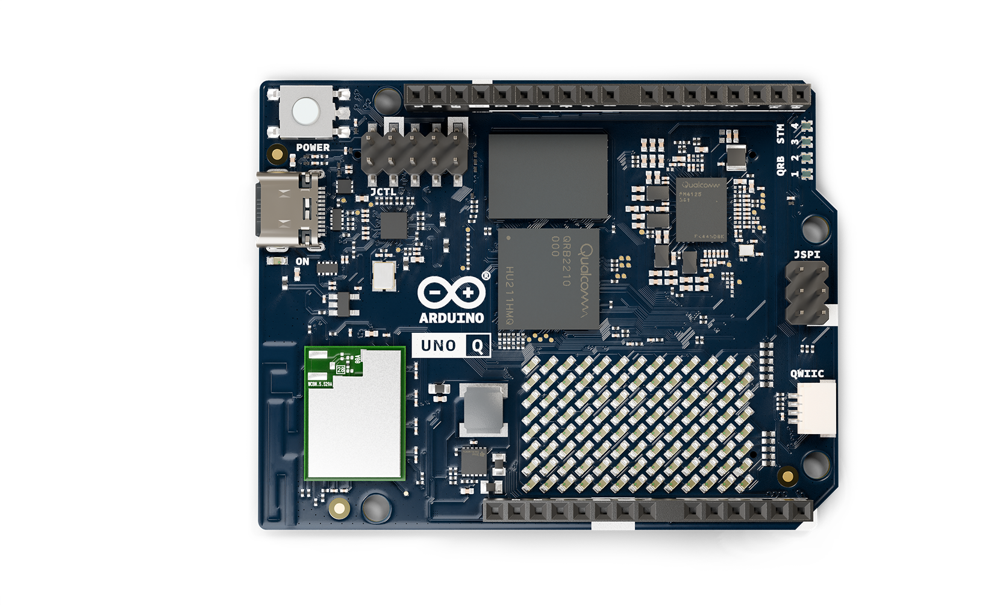
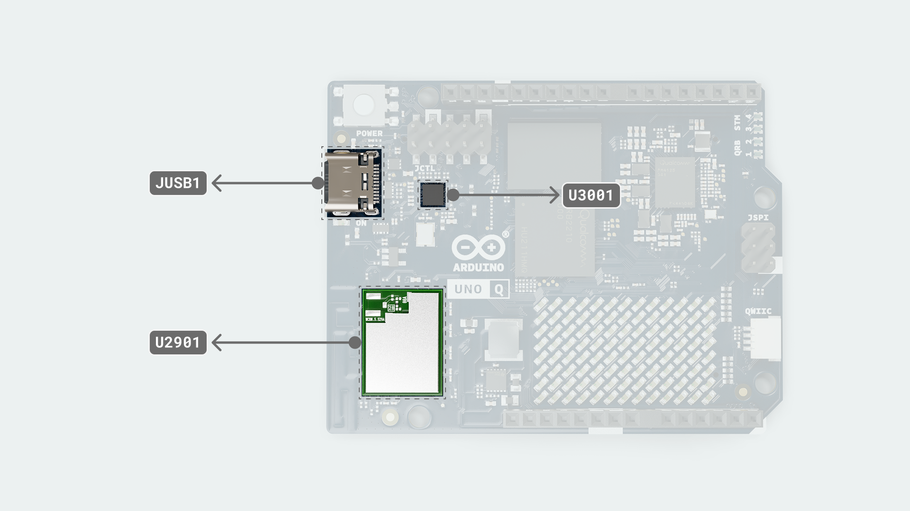
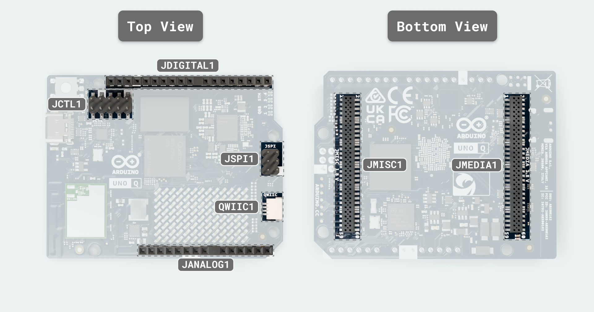
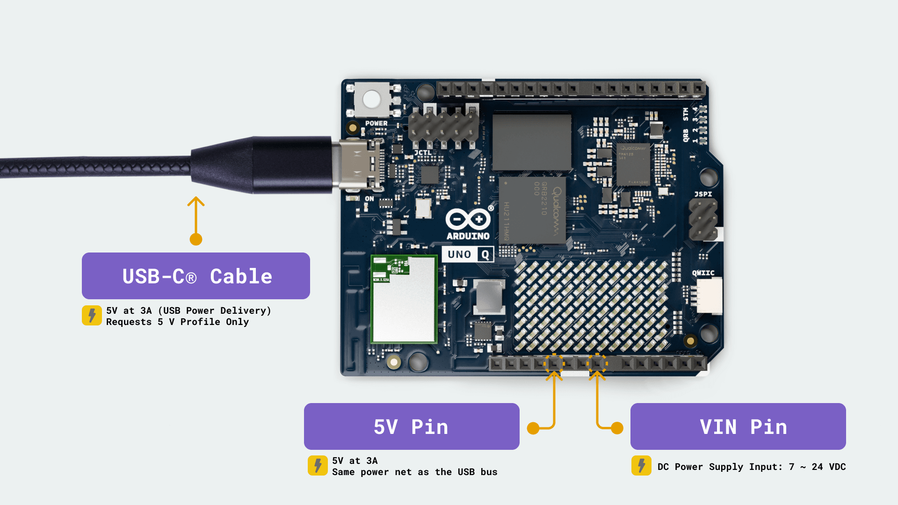
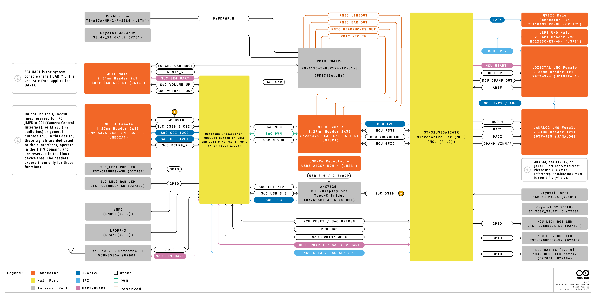
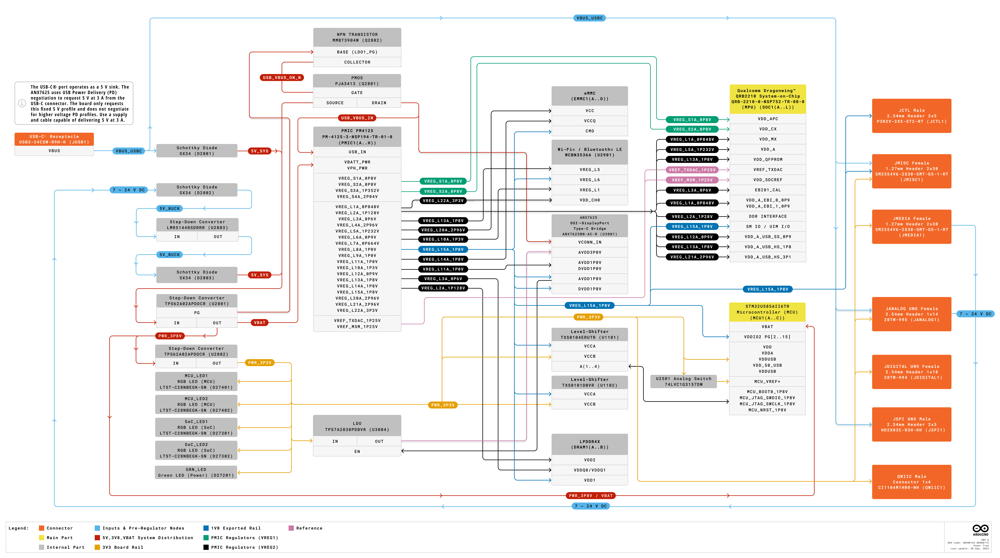
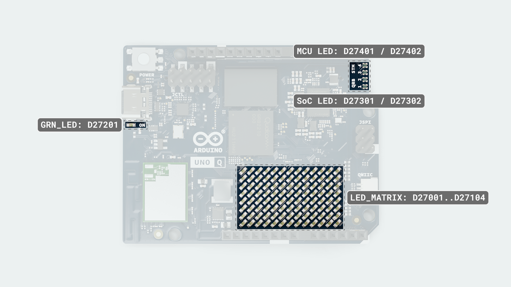
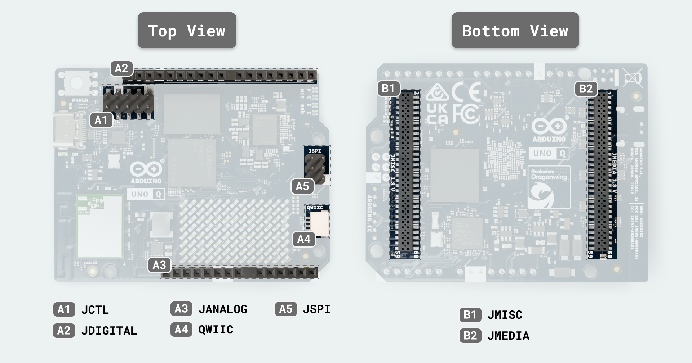
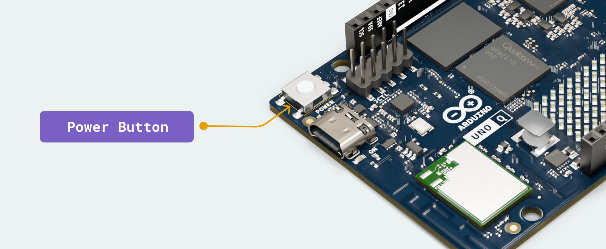
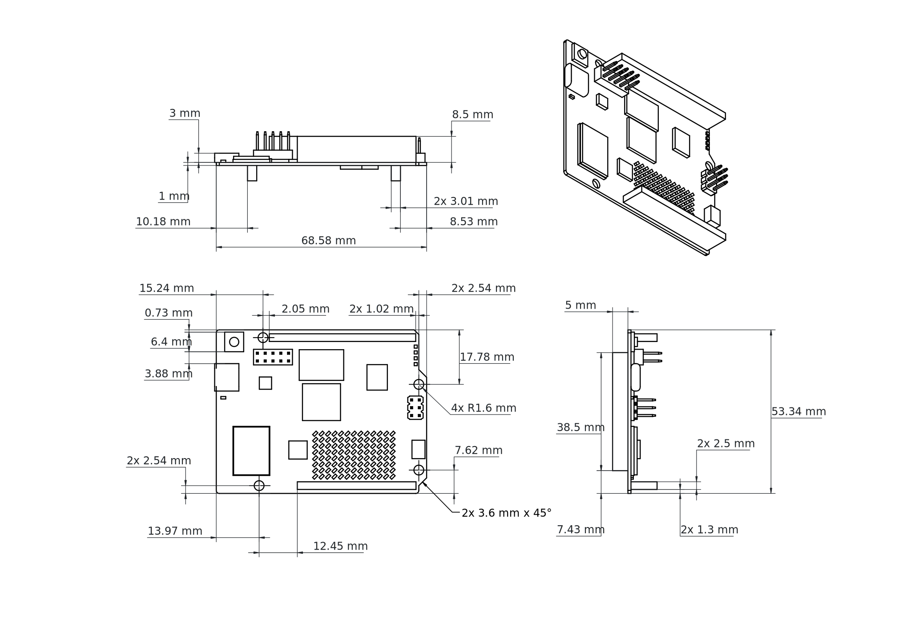

# Description

<p style="text-align: justify;">Arduino® UNO Q (hereafter UNO Q) is a single-board computer that combines the Qualcomm® Dragonwing™ QRB2210 Microprocessor (MPU), a quad-core Arm® Cortex®-A53 running Debian Linux OS, with the STMicroelectronics STM32U585 Microcontroller (MCU), an Arm® Cortex®-M33 running Arduino Core on Zephyr OS. The Linux system and the microcontroller communicate through Bridge, Arduino’s RPC (Remote Procedure Call) library. This allows Arduino sketches on the microcontroller to access Linux services for high-level tasks, while Linux applications can interact with microcontroller peripherals to handle real-time operations within the same project.
</p>

<p style="text-align: justify;">UNO Q comes with embedded eMMC storage (options 16 GB, 32 GB) and LPDDR4X SDRAM (options 2 GB, 4 GB) to run Linux and your projects smoothly. It features dual-band Wi-Fi® 5 and Bluetooth® 5.1 for wireless connectivity, a USB-C® connector with power delivery input and video output, and Arduino-compatible headers for easy expansion with shields, carriers, and accessories.
</p>

<p style="text-align: justify;">UNO Q integrates seamlessly with Arduino App Lab, enabling developers to combine Arduino sketches, Linux applications, and AI models in one environment. App Lab can run directly on the board or from a connected PC, offering ready-to-use examples, and the flexibility to create custom apps tailored to your projects.
</p>

# Target Areas

Prototyping, Edge AI & ML, Machine Vision, Education, Smart Devices, Robotics, Home and Building Automation, Gaming

<div style="page-break-after: always;"></div>

# CONTENTS

## Application Examples

<p style="text-align: justify;">UNO Q combines an AI-capable Linux processor with a real-time microcontroller, delivering the best of high-level computing and deterministic control. Alongside this dual architecture, it supports a broad ecosystem of Arduino shields, carriers, Modulino® nodes, and third-party accessories, making it a flexible platform for diverse applications.
</p>

- **Prototyping:** Rapid proof-of-concepts such as vision-based inspection tools, smart kiosks, or compact edge computers with built-in connectivity.

- **Education:** Teaching Linux, real-time programming, AI, and computer vision through project-based learning, from science experiments to interactive educational robots.

- **Robotics:** Autonomous delivery robots, gesture-following companions, and robotic arms with visual feedback, combining Linux vision with MCU-driven motor control.

- **Smart Consumer Devices:** DIY smart cameras, interactive displays, or AR projects powered by dual cameras and GPU acceleration.

- **Home & Building Automation:** Smart doorbells with facial recognition, voice-controlled systems, and personalized climate hubs.

- **Gaming:** Retro console emulation, custom arcade cabinets, or enhanced gameplay with gesture-based controls, face tracking, and real-time feedback.

<div style="page-break-after: always;"></div>

## Features

### UNO Q Variants

UNO Q is available in two variants:

- **ABX00162**: 2 GB RAM, 16 GB on-board storage
- **ABX00173**: 4 GB RAM, 32 GB on-board storage

### General Specifications Overview

#### Processing & Memory


| **Subsystem** | **Details**                                                                                                                                                                                                                                                                                                                                                                         |
|---------------|-------------------------------------------------------------------------------------------------------------------------------------------------------------------------------------------------------------------------------------------------------------------------------------------------------------------------------------------------------------------------------------|
| Main MPU      | - Qualcomm Dragonwing™ QRB2210 - System-on-Chip (SoC) (MPU) (SOC1): 4 × Arm Cortex-A53 @ 2.0 GHz, 64-bit <br></br>- Adreno 702 GPU @ 845 MHz (3D graphics) <br></br>- Dual ISPs: 13 MP + 13 MP or 25 MP @ 30 fps <br></br>- Debian OS (upstream support) <br></br>- I/O: USB 3.1 with Role-Switching Capabilities over USB Connector, SDIO 3.0, 4-lane MIPI-CSI-2 & 4-lane MIPI-DSI |
| Real-time MCU | - ST STM32U585 (MCU) (MCU1), Arm Cortex-M33 up to 160 MHz <br></br>- Arduino Core on Zephyr OS <br></br>- 2 MB Flash, 786 kB SRAM                                                                                                                                                                                                                                                   |
| System Memory | - eMMC 16 or 32 GB options (EMMC1) for OS/data <br></br>- LPDDR4X 2GB or 4 GB options (single-rank, 32-bit) (DRAM1)                                                                                                                                                                                                                                                                 |

<p style="text-align: justify;">The Qualcomm Dragonwing™ QRB2210 I/O operates at 1.8 V.
The MPU drives the MIPI-CSI-2 camera and MIPI-DSI display interfaces on JMEDIA, and the 1.8 V MPU (SoC) GPIO and audio endpoints exposed on JMISC.
JMISC is a mixed-voltage header that also carries 3.3 V MCU signals and analog audio alongside the 1.8 V MPU lines. DisplayPort video is provided by the on-board ANX7625, which converts the MPU's MIPI-DSI to DisplayPort Alt-Mode on USB-C.
The STM32U585 manages ADC, PWM, CAN, the LED matrix, and the 3.3 V headers (JDIGITAL, JANALOG, JSPI, and Qwiic).</p>

#### Connectivity & Media



| **Subsystem**      | **Details**                                                                                                                                                                                                                                                                                                                                                       |
|--------------------|-------------------------------------------------------------------------------------------------------------------------------------------------------------------------------------------------------------------------------------------------------------------------------------------------------------------------------------------------------------------|
| Wireless Module    | - WCBN3536A (Qualcomm WCN3980) (U2901) <br></br>- Wi-Fi® 5 802.11a/b/g/n/ac (dual-band) + Bluetooth® 5.1                                                                                                                                                                                                                                                          |
| USB-C Port (JUSB1) | - USB 3.1 with Role-Switching Capabilities<br></br>- DisplayPort Alt-Mode via the ANX7625 DSI-to-DP bridge (U3001) (SuperSpeed differential pairs on the Type-C are routed for DP Alt Mode)<br></br>- USB Power Delivery negotiation requests a **5 V / 3 A** contract only (no higher-voltage profiles)<br></br>- VBUS load-switch/back-drive protection (Q2801) |


The wireless module uses SDIO for Wi-Fi® data and a UART for Bluetooth® control, with a shared PCB antenna.

#### Expansion & Headers



| **Interface (Connector)** | **Voltage & Pin Count**       | **Details**                                                                                                                                                                                                                                                                                                                                                                    |
|---------------------------|-------------------------------|--------------------------------------------------------------------------------------------------------------------------------------------------------------------------------------------------------------------------------------------------------------------------------------------------------------------------------------------------------------------------------|
| JMEDIA (JMEDIA1)          | 1.8 V signals, 60-pin         | - High-speed camera/display lanes (MIPI DSI, CSI) <br></br>- Camera control bus (CCI I²C) - dedicated, not general-purpose GPIO <br></br>- Camera clocks (SOC_CAM_MCLK0/1) <br></br>- Also carries power rails (+3V3 OUT, VIN IN) and GND                                                                                                                                      |
| JMISC (JMISC1)            | Mixed 1.8 V / 3.3 V, 60-pin   | - Mixed GPIO and SDIO <br></br>- MCU peripherals: SDMMC1, TRACE, PSSI (parallel camera), I²C4, MCO/CRS_SYNC, OPAMP1 pins <br></br>- Audio endpoints: Mic2 INP/INM/BIAS, Headphone L/R + REF, LineOut P/M, Earpiece P/R, HS_DET <br></br>- MPU (SoC) GPIO banks (SE0) at 1.8 V <br></br>- Also carries power rails (+5V USB OUT, +3V3 OUT, +1V8 OUT, VBAT IN, VCOIN IN) and GND |
| JCTL (JCTL1)              | 1.8 V, 10-pin                 | - SE4 UART console <br></br>- Forced USB boot input <br></br>- PMIC reset input <br></br>- VBUS power-switch disable <br></br>- 1.8 V rail and GND                                                                                                                                                                                                                             |
| JDIGITAL (JDIGITAL1)      | 3.3 V, 18-pin                 | - Digital I/O for SPI, I²C, UART, PWM, CAN                                                                                                                                                                                                                                                                                                                                     |
| JANALOG (JANALOG1)        | 3.3 V, 14-pin                 | - Analog I/O <br></br>- ADC channels and references                                                                                                                                                                                                                                                                                                                            |
| JSPI (JSPI1)              | 3.3 V logic, 6-pin + 5 V VBUS | - Dedicated SPI: MOSI, MISO, SCLK <br></br>- MCU reset (NRST) <br></br>- Ground <br></br>- 5 V VBUS (USB power)                                                                                                                                                                                                                                                                |
| Qwiic (QWIIC1)            | 3.3 V, 4-pin                  | - I²C (Qwiic ecosystem)                                                                                                                                                                                                                                                                                                                                                        |

### Related Products

- Arduino UNO shields via JDIGITAL and JANALOG
- UNO Q compatible carrier boards
- Full 24-pin USB-C cable
- USB-C dongle with external power delivery capabilities

<div style="page-break-after: always;"></div>

## Ratings

### Input Power



| **Source**  | **Voltage Range** | **Maximum Current** | **Connector**         |
|-------------|------------------:|--------------------:|-----------------------|
| USB-C VBUS  |               5 V |           up to 3 A | USB-C connector       |
| VIN (DC IN) |            7-24 V |                   - | JMEDIA, JANALOG (VIN) |
| 5 V Pin     |               5 V |           up to 3 A | JANALOG               |

<p style="text-align: justify;">UNO Q supports dual power inputs: a USB-C port and a 7-24V DC input. Over USB Power Delivery, it requests only the 5 V / 3 A contract and does not request higher-voltage PD profiles. Use a supply and cable rated for 5 V at 3 A to avoid undervoltage during short activity peaks such as wireless bursts or display initialization. A regulated external 5 V DC source can also be used to supply power to the board via the 5 V pin on the JANALOG header.
</p>

<p style="text-align: justify;"><em>USB-C VBUS</em> and the 5 V output of the 7-24 V buck are <em>diode-OR</em> combined onto the system 5 V bus (<code>5V_SYS</code>). From <code>5V_SYS</code>, the design derives the 3.8 V pre-regulator node and, subsequently, the 3.3 V.
The PMIC, powered by 5V_SYS, derives the 1.8V rail.
</p>

<p style="text-align: justify;"><strong>Reverse-polarity protection:</strong> Verified with -24 V applied to DC IN. The operation is specified only with the correct polarity. Do not apply reverse voltage during normal use.
</p>

<p style="text-align: justify;"><strong>Schottky OR path:</strong> Forward-voltage drop from the buck output to <code>5V_SYS</code> was measured as follows (JANALOG VIN injection, Rigol DP832 supply in series, Keithley DMM6500 measurement, 8542B active load). Power dissipation is calculated as <code>P = I × Vf</code>.
</p>

| **Load current** | **Forward drop (`Vf`)** | **Diode dissipation** |
|-----------------:|------------------------:|----------------------:|
|            1.0 A |                  0.35 V |                0.35 W |
|            1.5 A |                  0.37 V |                0.56 W |
|            2.0 A |                  0.39 V |                0.78 W |

### Recommended Operating Conditions

Use the limits below to size power sources, define rail tolerances, and plan thermal margin:

| **Parameter**         | **Symbol**  | **Minimum** | **Typical** | **Maximum** | **Unit** |
|-----------------------|-------------|:-----------:|:-----------:|:-----------:|:--------:|
| USB-C input           | `VBUS_USBC` |     4.5     |     5.0     |     5.5     |    V     |
| DC input              | `DC_IN`     |     7.0     |      -      |    24.0     |    V     |
| 3.3 V system rail     | `PWR_3P3V`  |     3.1     |     3.3     |     3.5     |    V     |
| Operating temperature | `T_OP`      |     -10     |      -      |     60      |    °C    |

<p style="text-align: justify;"><em>Minimum</em> indicates the lowest continuous value for regular operation; brief dips can cause resets or link drops. <em>Typical</em> is the nominal design point. <em>Maximum</em> must not be exceeded. For <code>DC_IN</code> (7-24 V), select a supply that comfortably covers the 5 V load and use short cables to reduce voltage drop. The <code>PWR_3P3V</code> range reflects regulator tolerance and load. The temperature range refers to ambient air near the board, and operating near the limits can reduce available output current.
</p>

### On-Board Voltage Rails

| **Voltage** | **Rail**         | **Origin / Regulator**                                                       |
|------------:|------------------|------------------------------------------------------------------------------|
|       5.0 V | `5V_SYS`         | Diode OR of USB-C VBUS and 7-24 V buck output (both via Schottky rectifiers) |
|       3.8 V | `PWR_3P8V`       | Step-down (buck) from `5V_SYS`                                               |
|       3.3 V | `PWR_3P3V`       | Step-down (buck) from `PWR_3P8V`                                             |
|       1.8 V | `VREG_L15A_1P8V` | PM4125 LDO L15A  from `5V_SYS`                                               |

<div style="page-break-after: always;"></div>

## Functional Overview

### Pinout


### Block Diagram



### Power Supply

<p style="text-align: justify;">UNO Q supports dual power inputs: a USB-C port and a 7-24V DC input. 
<em>USB-C VBUS</em> and the 5 V output of the 7-24 V buck are <em>diode-OR</em> combined onto the system 5 V bus (5V_SYS).</p>

<p style="text-align: justify;"><code>5V_SYS</code> supplies the <strong>PM4125 PMIC (PMIC1)</strong> at <code>USB_IN</code>.
The PMIC's L15A LDO provides the 1.8 V rail (<code>VREG_L15A_1P8V</code>) and powers the SoC I/O banks, ANX7625 <code>DVDD18</code>, Wi-Fi® digital logic, and the on-board level shifters. The 1.8 V rail is also available on <code>JMISC</code>.
From <code>5V_SYS</code>, a buck generates the <code>PWR_3P8V (3.8 V)</code> reserved for system design and future features.
A second buck generates <code>PWR_3P3V</code> for the STM32U585, the ANX7625 (3.3 V rails), the Wi-Fi® 3.3 V domain, and the 3.3 V header pins.</p>

<p style="text-align: justify;">A <em>protected P-channel MOSFET</em> (<code>Q2801</code>) can source USB <code>VBUS</code> from <code>5V_SYS</code> when the board operates as a USB host/OTG. The <code>VCOIN</code> powers only the real-time clock of the PMIC and does not power the Linux or MCU domains. The <code>VBAT</code> powers the real-time clock of the <code>MCU</code>. </p>



<div style="page-break-after: always;"></div>

## UI & Indicators



- **RGB LEDs (Linux-controlled):** Two tri-color LEDs are driven by the Qualcomm Dragonwing™ QRB2210 application processor and exposed via `/sys/class/leds/`.

  - **RGB LED 1 (D27301):** channels: `red:user` → **GPIO_41**, `green:user` → **GPIO_42**, `blue:user` → **GPIO_60**.
  - **RGB LED 2 (D27302):** channels: `red:panic` → **GPIO_39**, `green:wlan` → **GPIO_40**, `blue:bt` → **GPIO_47**.
    
    By default, RGB LED 2 indicates system status, `PANIC`, `WLAN`, and `BT`, but it can also be user-controlled. PWM frequency is approximately 2 kHz for smooth color transitions.

- **RGB LEDs (MCU-controlled):** Two tri-color LEDs are driven by the STM32U585.

  - **RGB LED 3 (D27401):** `LED3_R` → **PH10**, `LED3_G` → **PH11**, `LED3_B` → **PH12**.
  - **RGB LED 4 (D27402):** `LED4_R` → **PH13**, `LED4_G` → **PH14**, `LED4_B` → **PH15**.

<div style="background-color: rgba(0, 170, 228, 0.2); border-left: 6px solid rgba(0, 120, 180, 1); margin: 20px 0; padding: 15px;">
  The RGB LEDs are active-low, meaning they turn on when driven to logic `0`.
</div>

- **LED matrix (D27001..D27104):** 8 × 13 monochrome blue LED matrix (104 pixels) driven by the STM32U585. It displays the boot logo for approximately 20–30 seconds during Linux startup. Accessing the matrix before startup completes may interfere with MCU operation.

- **Power LED (D27201):** Green indicator tied to the 3.3 V rail and illuminated whenever the board is powered.

## MPU & MCU

<p style="text-align: justify;">
An MPU (Microprocessor unit) is a high-performance application processor designed to run a full operating system and complex software. An MCU (Microcontroller unit) is a small, power-efficient controller focused on fast, precise timing for I/O and control. UNO Q combines both to pair OS-level compute with responsive, time-critical control on a single-board board and communicate through Bridge, an RPC layer implemented on both sides.</p>

### Application Processor (MPU)
<p style="text-align: justify;">
Qualcomm® Dragonwing™ QRB2210 is a quad-core Arm® Cortex®-A53 running Debian Linux OS. Its I/O operates at 1.8 V and it handles the high-speed media and Type-C/PD policy.
</p>

<ul>
  <li>Voltage domain: 1.8 V for MPU (SoC) GPIO and high-speed interfaces</li>
  <li>Drives JMEDIA: MIPI-CSI-2 camera and MIPI-DSI display lanes</li>
  <li>Drives 1.8 V MPU GPIO and audio endpoints on JMISC (mixed-voltage header)</li>
  <li>USB-C: role switching and PD negotiation (requests 5 V / 3 A)</li>
  <li>DisplayPort output via on-board ANX7625 (converts MIPI-DSI to DP Alt-Mode)</li>
</ul>

### Real-Time Microcontroller (MCU)
<p style="text-align: justify;">
STMicroelectronics® STM32U585 is an Arm® Cortex®-M33 running Arduino Core on Zephyr OS. It provides fast, precise timing for control tasks and 3.3 V I/O headers.
</p>

<ul>
  <li>Voltage domain: 3.3 V for GPIO and analog (VREF+ ≈ 3.3 V)</li>
  <li>Manages ADC, PWM, CAN, LED matrix, timers</li>
  <li>Handles 3.3 V headers: JDIGITAL, JANALOG, JSPI, Qwiic</li>
</ul>

<p style="text-align: justify;">
JMISC handles both domains: 1.8 V MPU lines sit alongside 3.3 V MCU signals (e.g., PSSI, SDMMC1, TRACE, I²C4) and analog/audio. Please check the voltage levels when attaching carriers or external logic.
</p>

## Inter-Processor Communication

<p style="text-align: justify;">The Qualcomm® Dragonwing™ QRB2210 (MPU) and the STM32U585 (MCU) communicate through the Arduino Bridge, a software-based Remote Procedure Call (RPC) layer implemented on both the Linux and MCU sides. Bridge provides a service-oriented API that allows either processor to expose services for the other to call, while also supporting one-way notifications for asynchronous events. It manages message routing between processors and accommodates multiple physical transports. Through its API, Bridge enables type-safe function calls, allowing microcontroller sketches to invoke Linux services and receive structured responses, or to push data via notifications.</p>

<p style="text-align: justify;">If a hardware indicator is required for a carrier board or external logic, firmware can dedicate a 1.8V MPU GPIO on JMISC, or an available JCTL GPIO, as a ready or wake output. This signal can be received on an MCU GPIO through level-compatible circuitry, such as a level shifter or open-drain configuration with a pull-up resistor. The firmware defines the exact role of this signal. Alternatively, activity on the selected transport (USB CDC, UART, or SPI) can serve as a wake source when the MCU is in sleep mode.</p>

<div style="background-color: rgba(0, 170, 228, 0.2); border-left: 6px solid rgba(0, 120, 180, 1); margin: 20px 0; padding: 15px;">
  MPU GPIO signals operate in the application processor's low-voltage domain (1.8 V). Ensure any connection to the microcontroller is level-compatible with its I/O voltage rail (3.3 V). For example, use a level shifter or an open-drain configuration with a pull-up to the microcontroller's I/O rail.
</div>

<div style="page-break-after: always;"></div>

## Hardware Acceleration

<p style="text-align: justify;">The UNO Q provides hardware acceleration for both 3D graphics and video encoding/decoding through the integrated Adreno 702 GPU running at 845 MHz.</p>

### Graphics Acceleration

<p style="text-align: justify;">The Adreno 702 GPU provides hardware-accelerated 3D graphics rendering through open-source Mesa drivers. Applications can access GPU acceleration via standard graphics APIs, including OpenGL, OpenGL ES, Vulkan, and OpenCL.</p>

| **Graphics API** | **Driver** | **Hardware Support** | **Current Driver Version** | **Device Name**        |
|------------------|------------|----------------------|----------------------------|------------------------|
| Desktop OpenGL   | freedreno  | -                    | 3.1                        | FD702                  |
| OpenGL ES        | freedreno  | 3.1                  | 3.1                        | FD702                  |
| Vulkan           | turnip     | 1.1                  | 1.0.318                    | Turnip Adreno (TM) 702 |
| OpenCL           | Mesa       | 2.0                  | 2.0                        | -                      |

<p style="text-align: justify;">The Adreno 702 GPU features unified memory architecture, sharing system RAM with the CPU for data transfer. It supports 64-bit memory addressing and provides direct rendering capabilities for optimal graphics performance.</p>

| **Parameter**                  | **Specification**                |
|--------------------------------|----------------------------------|
| Clock Frequency                | 845 MHz                          |
| Memory Architecture            | Unified (shared with system RAM) |
| Available Video Memory         | 1740 MB                          |
| Memory Addressing              | 64-bit                           |
| Direct Rendering               | Yes                              |
| Maximum 2D Texture Size        | 16384 × 16384 pixels             |
| Maximum 3D Texture Size        | 2048³ voxels                     |
| Maximum Cube Map Size          | 16384 × 16384 pixels             |
| OpenGL Shading Language (GLSL) | 1.40                             |
| OpenGL ES Shading Language     | 3.10 ES                          |

<p style="text-align: justify;">The Mesa graphics stack provides support for standard OpenGL extensions and features. Applications using OpenGL, OpenGL ES, or Vulkan will automatically use hardware acceleration without additional configuration. Standard graphics utilities such as <code>mesa-utils</code> and <code>vulkan-tools</code> work out of the box on the UNO Q.</p>

<div style="background-color: rgba(0, 170, 228, 0.2); border-left: 6px solid rgba(0, 120, 180, 1); margin: 20px 0; padding: 15px;">
  <strong>Note:</strong> The OpenGL and Vulkan drivers are available through the <strong>freedreno (OpenGL/OpenGL ES)</strong> and <strong>turnip (Vulkan)</strong> open-source Mesa drivers, providing transparency and community support. While the Adreno 702 hardware supports Vulkan 1.1, the current driver implementation provides Vulkan 1.0.318. <strong>There are no UNO Q-specific OpenGL or Vulkan examples. However, standard Mesa utilities and examples from the Mesa project can be used as references.</strong>
</div>

### Video Acceleration

<p style="text-align: justify;">The Adreno 702 GPU includes dedicated hardware video encoders and decoders accessible through the <code>V4L2 (Video4Linux2)</code> API via <code>/dev/video0</code> and <code>/dev/video1</code> devices. Hardware acceleration is available for the following video codecs:</p>

| **Codec**    | **Encoding** | **Decoding** | **GStreamer Element**     |
|--------------|--------------|--------------|---------------------------|
| H.264 (AVC)  | Yes          | Yes          | v4l2h264enc / v4l2h264dec |
| H.265 (HEVC) | Yes          | Yes          | v4l2h265enc / v4l2h265dec |
| VP9          | No           | Yes          | v4l2vp9dec                |

<p style="text-align: justify;">The hardware video encoder and decoder offload compression and decompression tasks from the CPU to dedicated hardware, enabling efficient real-time video processing. This reduces system power consumption and allows the CPU to focus on application logic. Hardware acceleration is available for resolutions up to 1920×1080 (Full HD), including common formats such as 720p (1280×720).</p>

#### GStreamer Integration

<p style="text-align: justify;">The recommended approach for accessing hardware video acceleration is through <strong>GStreamer</strong>, which provides a high-level pipeline interface to the V4L2 devices. The following GStreamer elements provide hardware-accelerated video processing:</p>

For H.264 decoding, the following pipeline can be used:

```bash
gst-launch-1.0 filesrc location=videos/xxxxx.mp4 \
  ! qtdemux name=demux demux.video_0 ! queue ! h264parse ! v4l2h264dec \
  ! videoconvert ! autovideosink
```

For H.265 decoding, the following pipeline can be used:

```bash
gst-launch-1.0 filesrc location=videos/xxxxx.mp4 \
  ! qtdemux name=demux demux.video_0 ! queue ! h265parse ! v4l2h265dec \
  ! videoconvert ! autovideosink
```

For VP9 decoding, the following pipeline can be used:

```bash
gst-launch-1.0 filesrc location=videos/xxxxx.webm \
  ! matroskademux ! queue ! v4l2vp9dec \
  ! videoconvert ! autovideosink
```

For H.264 encoding, the following pipeline can be used:

```bash
gst-launch-1.0 videotestsrc num-buffers=30 \
  ! video/x-raw,width=1280,height=720,framerate=30/1 \
  ! v4l2h264enc ! h264parse ! mp4mux ! filesink location=/tmp/output.mp4
```

For H.265 encoding, the following pipeline can be used:

```bash
gst-launch-1.0 videotestsrc num-buffers=30 \
  ! video/x-raw,width=1920,height=1080,framerate=30/1 \
  ! v4l2h265enc ! h265parse ! mp4mux ! filesink location=/tmp/output.mp4
```

For concurrent encoding and decoding, the following pipeline can be used:

```bash
gst-launch-1.0 -v videotestsrc num-buffers=1000 \
  ! video/x-raw,format=NV12,width=1280,height=720,framerate=30/1 \
  ! v4l2h264enc capture-io-mode=4 output-io-mode=2 ! h264parse \
  ! v4l2h264dec capture-io-mode=4 output-io-mode=2 ! videoconvert \
  ! autovideosink
```

<div style="background-color: rgba(0, 170, 228, 0.2); border-left: 6px solid rgba(0, 120, 180, 1); margin: 20px 0; padding: 15px;">
 <strong>Developer Access:</strong> The V4L2 video devices are accessible through standard Linux APIs, allowing direct integration into C/C++ applications using libv4l2 or through higher-level frameworks like GStreamer, FFmpeg, or OpenCV with V4L2 backend support.
</div>

### OpenCL Support

<p style="text-align: justify;">OpenCL 2.0 support is available through the Mesa implementation, allowing general-purpose GPU (GPGPU) computing for parallel processing tasks, scientific computing, and compute-intensive operations. The Adreno 702's OpenCL capabilities allow offloading compute-intensive workloads from the CPU to the GPU for improved performance.</p>

<div style="page-break-after: always;"></div>

## Peripherals



- **JDIGITAL (A2) (JDIGITAL1) / JANALOG (A3) (JANALOG1):** 3.3 V GPIO with support for SPI, UART, CAN, PWM, and ADC inputs. Analog inputs are referenced to `VREF+` on the 3.3 V rail. Valid input range is 0 V to `VREF+`. Some STM32U585 pads may be 5 V-tolerant in digital mode, but when configured as ADC or any analog function (such as *A0* through *A5*), they are not 5 V-tolerant and must not exceed `VDD + 0.3 V`. Use external conditioning like a voltage divider or buffer for higher voltages. For *A4/A5* when used as I2C3 (PC1/PC0), use pull-ups to 3.3 V only.

- **QWIIC Connector (A4) (QWIIC1):** Additional I²C bus (3.3 V logic). It maps as **PD13 (I2C4_SDA)** and **PD12 (I2C4_SCL)**. It guarantees plug-and-play compatibility with Modulino® nodes and 3rd party sensors and actuators.

- **JSPI (A5) (JSPI1):** 3.3 V SPI header for peripherals that provides MOSI, MISO, and SCLK signals, with chip-select available through a GPIO pin on JDIGITAL/JMISC. The pins use STM32U585 FT-type configuration with MISO on PC2, MOSI on PC3, and SCK on PD1. They are 5 V-tolerant as inputs or in open-drain, while outputs drive 3.3 V. Add level shifting if a 5 V input threshold or 5 V bidirectional signaling is required. Includes a `5V_SYS` power pin.

- **JMEDIA (B2) (JMEDIA1):** Four-lane camera and display signals in the 1.8 V domain (MIPI-CSI-2 and MIPI-DSI).

- **JMISC (B1) (JMISC):** Mixed function header combining 3.3 V MCU signals and 1.8 V MPU signals. It provides MCU PSSI (parallel camera) bus, SDMMC1 test pins, TRACE, I2C4, MCO/CRS_SYNC, and OPAMP1 analog pins. Also it breakout out audio (Mic2, Headphone L/R+REF, LineOut P/M, Earpiece P/R, HS_DET) and power rails (+3V3, +5V_USB, +1V8, VBAT and VCOIN for system use). Observe voltage domains: **MCU pins are 3.3 V, MPU GPIO are 1.8 V**.

- **JCTL (A1) (JCTL1):** Boot-mode pins, reset, and low-power wake signals (1.8 V logic).

<p style="text-align: justify;"><strong>SE4 UART</strong> is the system console (<code>shell UART</code>). It is separate from application UARTs and should not be repurposed for user I/O. It operates in the MPU's <strong>1.8 V</strong> I/O domain.</p>

<p style="text-align: justify;">Do not use the Qualcomm Dragonwing™ QRB2210 lines reserved for <strong>I²C</strong>, <strong>JMEDIA CCI</strong> (Camera Control Interface), or <strong>MI2S0</strong> (I²S audio bus) as general-purpose I/O. These signals are interface-dedicated, operate at <strong>1.8 V</strong>, and are reserved in the Linux device tree. The headers expose them only for those functions.</p>

### JMISC (B1) (JMISC1) - Pin Map

| **Pin** | **Designation** | **MCU/SoC Pin** | **Domain** | **Notes**                 |
|--------:|-----------------|-----------------|------------|---------------------------|
|       1 | MCU_PSSI_D0     | PC6             | 3.3V MCU   | PSSI D0                   |
|       2 | MCU_SDMMC1_CMD  | PD2             | 3.3V MCU   | SDMMC1 CMD / test         |
|       3 | MCU_PSSI_D1     | PC7             | 3.3V MCU   | PSSI D1                   |
|       4 | MCU_TRACE_CLK   | PE2             | 3.3V MCU   | Trace clock               |
|       5 | MCU_PSSI_D2     | PC8             | 3.3V MCU   | PSSI D2                   |
|       6 | MCU_TRACE_D0    | PE3             | 3.3V MCU   | Trace data 0              |
|       7 | MCU_PSSI_D3     | PC9             | 3.3V MCU   | PSSI D3                   |
|       8 | MCU_TRACE_D2    | PE5             | 3.3V MCU   | Trace data 2              |
|       9 | MCU_PSSI_D4     | PE4             | 3.3V MCU   | PSSI D4                   |
|      10 | MCU_TRACE_D3    | PE6             | 3.3V MCU   | Trace data 3              |
|      11 | MCU_PSSI_D5     | PI4             | 3.3V MCU   | PSSI D5                   |
|      12 | MCU_PE7         | PE7             | 3.3V MCU   | GPIO                      |
|      13 | MCU_PSSI_D6     | PI6             | 3.3V MCU   | PSSI D6                   |
|      14 | MCU_PE8         | PE8             | 3.3V MCU   | GPIO                      |
|      15 | MCU_PSSI_D7     | PI7             | 3.3V MCU   | PSSI D7                   |
|      16 | MCU_I2C4_SCL    | PF14            | 3.3V MCU   | I²C4 SCL                  |
|      17 | MCU_PSSI_PDCK   | PD9             | 3.3V MCU   | PSSI clock                |
|      18 | MCU_I2C4_SDA    | PF15            | 3.3V MCU   | I²C4 SDA                  |
|      19 | MCU_PSSI_RDY    | PI5             | 3.3V MCU   | PSSI ready                |
|      20 | MCU_OPAMP1_VOUT | PA3             | Analog     | OpAmp1 VOUT               |
|      21 | MCU_PSSI_DE     | PD8             | 3.3V MCU   | PSSI data enable          |
|      22 | MCU_OPAMP1_VINP | PA0             | Analog     | OpAmp1 VINP               |
|      23 | MCU_MCO         | PA8             | 3.3V MCU   | MCU clock out             |
|      24 | MCU_OPAMP1_VINM | PA1             | Analog     | OpAmp1 VINM               |
|      25 | MCU_CRS_SYNC    | PA10            | 3.3V MCU   | CRS sync                  |
|      26 | GND             | -               | Power      | Ground                    |
|      27 | GND             | -               | Power      | Ground                    |
|      28 | EAR_P_R         | -               | Analog     | Audio ear P_R             |
|      29 | MIC2_INP        | -               | Analog     | Mic2 IN+                  |
|      30 | EAR_M_R         | -               | Analog     | Audio ear M_R             |
|      31 | MIC2_INM        | -               | Analog     | Mic2 IN−                  |
|      32 | LINEOUT_P       | -               | Analog     | Line out P                |
|      33 | MIC2_BIAS       | -               | Analog     | Mic2 bias                 |
|      34 | LINEOUT_M       | -               | Analog     | Line out M                |
|      35 | GND             | -               | Power      | Ground                    |
|      36 | HPH_L           | -               | Analog     | Headphone L               |
|      37 | SOC_GPIO_0_SE0  | -               | 1.8V MPU   | SoC GPIO 0 (SE0)          |
|      38 | HPH_R           | -               | Analog     | Headphone R               |
|      39 | SOC_GPIO_1_SE0  | -               | 1.8V MPU   | SoC GPIO 1 (SE0)          |
|      40 | HPH_REF         | -               | Analog     | Headphone REF             |
|      41 | SOC_GPIO_2_SE0  | -               | 1.8V MPU   | SoC GPIO 2 (SE0)          |
|      42 | HS_DET          | -               | Analog     | Headset detect            |
|      43 | SOC_GPIO_3_SE0  | -               | 1.8V MPU   | SoC GPIO 3 (SE0)          |
|      44 | GND             | -               | Power      | Ground                    |
|      45 | SOC_GPIO_86_SE0 | -               | 1.8V MPU   | SoC GPIO 86 (SE0)         |
|      46 | SOC_GPIO_98     | -               | 1.8V MPU   | SoC GPIO 98               |
|      47 | SOC_GPIO_82_SE0 | -               | 1.8V MPU   | SoC GPIO 82 (SE0)         |
|      48 | SOC_GPIO_99     | -               | 1.8V MPU   | SoC GPIO 99               |
|      49 | SOC_GPIO_18     | -               | 1.8V MPU   | SoC GPIO 18               |
|      50 | SOC_GPIO_100    | -               | 1.8V MPU   | SoC GPIO 100              |
|      51 | SOC_GPIO_28     | -               | 1.8V MPU   | SoC GPIO 28               |
|      52 | SOC_GPIO_101    | -               | 1.8V MPU   | SoC GPIO 101              |
|      53 | +3V3 (OUT)      | -               | Power      | 3.3 V power out           |
|      54 | +5V_USB (OUT)   | -               | Power      | 5 V power out             |
|      55 | +3V3 (OUT)      | -               | Power      | 3.3 V power out           |
|      56 | +5V_USB (OUT)   | -               | Power      | 5 V power out             |
|      57 | +1V8 (IN)       | -               | Power      | 1.8 V rail in             |
|      58 | GND             | -               | Power      | Ground                    |
|      59 | VCOIN (IN)      | -               | Power      | System voltage (PMIC RTC) |
|      60 | VBAT (IN)       | -               | Power      | System voltage (MCU RTC)  |

<div style="background-color: rgba(0, 170, 228, 0.2); border-left: 6px solid rgba(0, 120, 180, 1); margin: 20px 0; padding: 15px;">
  Note: SoC GPIO lines on JMISC are interface-dedicated (not maker GPIO). MCU are at 3.3 V logic, MPU are at 1.8 V logic, and audio/mic are analog.
</div>

<div style="page-break-after: always;"></div>

### JMEDIA (B2) (JMEDIA1) - Pin Map

| **Pin** | **Designation**         | **Domain** | **Notes**               |
|--------:|-------------------------|------------|-------------------------|
|       1 | GND                     | Power      | Ground                  |
|       2 | GND                     | Power      | Ground                  |
|       3 | MIPI_DSI0_CLK_M         | MIPI D-PHY | DSI clock −             |
|       4 | MIPI_DSI0_L1_P          | MIPI D-PHY | DSI lane1 +             |
|       5 | MIPI_DSI0_CLK_P         | MIPI D-PHY | DSI clock +             |
|       6 | MIPI_DSI0_L1_M          | MIPI D-PHY | DSI lane1 −             |
|       7 | GND                     | Power      | Ground                  |
|       8 | GND                     | Power      | Ground                  |
|       9 | MIPI_DSI0_L2_M          | MIPI D-PHY | DSI lane2 −             |
|      10 | MIPI_DSI0_L0_P          | MIPI D-PHY | DSI lane0 +             |
|      11 | MIPI_DSI0_L2_P          | MIPI D-PHY | DSI lane2 +             |
|      12 | MIPI_DSI0_L0_M          | MIPI D-PHY | DSI lane0 −             |
|      13 | GND                     | Power      | Ground                  |
|      14 | GND                     | Power      | Ground                  |
|      15 | MIPI_DSI0_L3_M          | MIPI D-PHY | DSI lane3 −             |
|      16 | SOC_CAM_MCLK0 (GPIO_20) | 1.8V MPU   | Camera master clock 0   |
|      17 | MIPI_DSI0_L3_P          | MIPI D-PHY | DSI lane3 +             |
|      18 | SOC_CAM_MCLK1 (GPIO_21) | 1.8V MPU   | Camera master clock 1   |
|      19 | GND                     | Power      | Ground                  |
|      20 | GND                     | Power      | Ground                  |
|      21 | CSI0_C0_LN0_M           | MIPI D-PHY | CSI0 data0 −            |
|      22 | CCI_I2C_SDA1 (GPIO_29)  | 1.8V MPU   | Camera control I²C SDA1 |
|      23 | CSI0_B0_LN0_P           | MIPI D-PHY | CSI0 data0 +            |
|      24 | CCI_I2C_SCL1 (GPIO_30)  | 1.8V MPU   | Camera control I²C SCL1 |
|      25 | GND                     | Power      | Ground                  |
|      26 | GND                     | Power      | Ground                  |
|      27 | CSI0_B1_LN1_M           | MIPI D-PHY | CSI0 data1 −            |
|      28 | CSI1_B2_LN3_P           | MIPI D-PHY | CSI1 data3 +            |
|      29 | CSI0_A1_LN1_P           | MIPI D-PHY | CSI0 data1 +            |
|      30 | CSI1_C2_LN3_M           | MIPI D-PHY | CSI1 data3 −            |
|      31 | GND                     | Power      | Ground                  |
|      32 | GND                     | Power      | Ground                  |
|      33 | CSI0_A0_CLK_M           | MIPI D-PHY | CSI0 clock −            |
|      34 | CSI1_C1_LN2_P           | MIPI D-PHY | CSI1 data2 +            |
|      35 | CSI0_NC_CLK_P           | MIPI D-PHY | CSI0 clock +            |
|      36 | CSI1_A2_LN2_M           | MIPI D-PHY | CSI1 data2 −            |
|      37 | GND                     | Power      | Ground                  |
|      38 | GND                     | Power      | Ground                  |
|      39 | CSI0_A2_LN2_M           | MIPI D-PHY | CSI0 data2 −            |
|      40 | CSI1_NC_CLK_P           | MIPI D-PHY | CSI1 clock +            |
|      41 | CSI0_C1_LN2_P           | MIPI D-PHY | CSI0 data2 +            |
|      42 | CSI1_A0_CLK_M           | MIPI D-PHY | CSI1 clock −            |
|      43 | GND                     | Power      | Ground                  |
|      44 | GND                     | Power      | Ground                  |
|      45 | CSI0_C2_LN3_M           | MIPI D-PHY | CSI0 data3 −            |
|      46 | CSI1_A1_LN1_P           | MIPI D-PHY | CSI1 data1 +            |
|      47 | CSI0_B2_LN3_P           | MIPI D-PHY | CSI0 data3 +            |
|      48 | CSI1_B1_LN1_M           | MIPI D-PHY | CSI1 data1 −            |
|      49 | GND                     | Power      | Ground                  |
|      50 | GND                     | Power      | Ground                  |
|      51 | CCI_I2C_SCL0 (GPIO_23)  | 1.8V MPU   | Camera control I²C SCL0 |
|      52 | CSI1_B0_LN0_P           | MIPI D-PHY | CSI1 data0 +            |
|      53 | CCI_I2C_SDA0 (GPIO_22)  | 1.8V MPU   | Camera control I²C SDA0 |
|      54 | CSI1_C0_LN0_M           | MIPI D-PHY | CSI1 data0 −            |
|      55 | GND                     | Power      | Ground                  |
|      56 | GND                     | Power      | Ground                  |
|      57 | VIN (IN)                | Power      | 7-24 V input            |
|      58 | +3V3 (OUT)              | Power      | 3.3 V power out         |
|      59 | VIN (IN)                | Power      | 7-24 V input            |
|      60 | +3V3 (OUT)              | Power      | 3.3 V power out         |

<div style="background-color: rgba(0, 170, 228, 0.2); border-left: 6px solid rgba(0, 120, 180, 1); margin: 20px 0; padding: 15px;">
  Note: MIPI CSI/DSI lanes are D-PHY differential pairs and not general-purpose I/O. Control lines (CCI_I2C_*, SOC_CAM_MCLK*) are 1.8 V MPU domain. VIN on JMEDIA is the raw 7-24 V input (power only).
</div>

<div style="page-break-after: always;"></div>

### Qwiic (A4) (QWIIC1) - Pin Map

| **Pin** | **Designation** | **Net / Function** | **Domain** | **Notes**                |
|--------:|-----------------|--------------------|------------|--------------------------|
|       1 | GND             | Ground             | Power      | -                        |
|       2 | +3V3 OUT        | PWR_3P3V           | Power      | Supply for Qwiic devices |
|       3 | SDA             | PD13 (I2C4_SDA)    | 3.3 V      | -                        |
|       4 | SCL             | PD12 (I2C4_SCL)    | 3.3 V      | -                        |

### JSPI (A5) (JSPI1) - Pin Map

| **Pin** | **Designation** | **Net / Function** | **Domain** | **Notes**  |
|--------:|-----------------|--------------------|------------|------------|
|       1 | MISO            | PC2 (SPI2_MISO)    | 3.3 V      | -          |
|       2 | +5V             | 5V_USB_VBUS        | Power      | Power only |
|       3 | SCK             | PD1 (SPI2_SCK)     | 3.3 V      | -          |
|       4 | MOSI            | PC3 (SPI2_MOSI)    | 3.3 V      | -          |
|       5 | RESET           | MCU_NRST           | 3.3 V      | -          |
|       6 | GND             | Ground             | Power      | -          |

### JCTL (A1) (JCTL1) - Pin Map

| **Pin** | **Designation** | **Net / Function**        | **Domain** | **Notes**          |
|--------:|-----------------|---------------------------|------------|--------------------|
|       1 | GND             | Ground                    | Power      | -                  |
|       2 | USB_BOOT        | Boot strap                | 1.8 V      | -                  |
|       3 | VOL_DOWN        | GPIO_36                   | 1.8 V      | GPIO               |
|       4 | SOC_SE4_TX      | Console UART TX (SE4)     | 1.8 V      | System console     |
|       5 | VOL_UP          | GPIO_96                   | 1.8 V      | GPIO               |
|       6 | SOC_SE4_RX      | Console UART RX (SE4)     | 1.8 V      | System console     |
|       7 | GND             | Ground                    | Power      | -                  |
|       8 | PMIC_RESET      | PM4125 reset              | 1.8 V      | -                  |
|       9 | +1V8 OUT        | VREG_L15A_1P8V            | Power      | 1.8 V reference    |
|      10 | VBUS_DISABLE    | VBUS power switch disable | 1.8 V      | Controls VBUS path |

<div style="page-break-after: always;"></div>

### JDIGITAL (A2) (JDIGITAL1) - Pin Map

| **Pin** | **Designation** | **MCU pin** | **Functions**                               | **Domain** | **Notes**                   |
| ------: | --------------- | ----------- | ------------------------------------------- | ---------- | --------------------------- |
|       1 | D0              | PB7         | - USART1_RX <br></br>- TIM4_CH2             | 3.3 V      | UART                        |
|       2 | D1              | PB6         | - USART1_TX <br></br>- TIM4_CH1             | 3.3 V      | UART                        |
|       3 | D2              | PB3         | - TIM2_CH2                                  | 3.3 V      | -                           |
|       4 | ~D3             | PB0         | - OPAMP2_OUTPUT <br></br>- TIM3_CH3         | 3.3 V      | PWM                         |
|       5 | D4              | PA12        | - FDCAN1_TX <br></br>- TIM1_ETR             | 3.3 V      | -                           |
|       6 | ~D5             | PA11        | - FDCAN1_RX <br></br>- TIM1_CH4             | 3.3 V      | PWM                         |
|       7 | ~D6             | PB1         | - TIM3_CH4                                  | 3.3 V      | PWM                         |
|       8 | D7              | PB2         | - TIM8_CH4N                                 | 3.3 V      | -                           |
|       9 | D8              | PB4         | - TIM3_CH1                                  | 3.3 V      | -                           |
|      10 | ~D9             | PB8         | - TIM4_CH3                                  | 3.3 V      | PWM                         |
|      11 | ~D10            | PB9         | - SPI2_SS (Chip Select) <br></br>- TIM4_CH4 | 3.3 V      | PWM                         |
|      12 | ~D11            | PB15        | - SPI2_MOSI <br></br>- TIM1_CH3N            | 3.3 V      | PWM                         |
|      13 | D12             | PB14        | - SPI2_MISO <br></br>- TIM1_CH2N            | 3.3 V      | -                           |
|      14 | D13             | PB13        | - SPI2_SCK <br></br>- TIM1_CH1N             | 3.3 V      | -                           |
|      15 | GND             | -           | - Ground                                    | Power      | -                           |
|      16 | AREF            | -           | - Analog reference                          | -          | Analog ref pin (not a GPIO) |
|      17 | D20             | PB11        | - I2C2_SDA <br></br>- TIM2_CH4              | 3.3 V      | -                           |
|      18 | D21             | PB10        | - I2C2_SCL <br></br>- TIM2_CH3              | 3.3 V      | -                           |

<div style="background-color: rgba(0, 170, 228, 0.2); border-left: 6px solid rgba(0, 120, 180, 1); margin: 20px 0; padding: 15px;">
  All JDIGITAL lines are 3.3 V logic.
</div>

### JANALOG (A3) (JANALOG1) - Pin Map

| **Pin** | **Designation** | **Net / MCU pin** | **Functions**                                            | **Domain**     | **Notes**                     |
|--------:|-----------------|-------------------|----------------------------------------------------------|----------------|-------------------------------|
|       1 | BOOT            | MCU_BOOT0         | - Boot strap                                             | 3.3 V          | -                             |
|       2 | IOREF           | PWR_3P3V          | - I/O voltage reference (mirrors 3.3 V rail)             | Power          | Output only; do not back-feed |
|       3 | RESET           | MCU_NRST          | - MCU reset                                              | 3.3 V          | -                             |
|       4 | +3V3 OUT        | PWR_3P3V          | - 3.3 V supply                                           | Power          | -                             |
|       5 | +5V USB VBUS    | 5V_USB_VBUS       | - 5 V supply (pass-through)                              | Power          | Power only                    |
|       6 | GND             | GND               | - Ground                                                 | Power          | -                             |
|       7 | GND             | GND               | - Ground                                                 | Power          | -                             |
|       8 | VIN IN          | DC_IN             | - 7-24 V input                                           | Power          | Power only                    |
|       9 | A0 / D14        | PA4               | - ADC input <br></br>- DAC0 <br></br>- TIM2_CH1          | Analog / 3.3 V | Direct ADC / not 5 V-tolerant |
|      10 | A1 /  D15       | PA5               | - ADC input <br></br>- DAC1 <br></br>- TIM3_CH1          | Analog / 3.3 V | Direct ADC / not 5 V-tolerant |
|      11 | A2 /  D16       | PA6               | - ADC input <br></br>- OPAMP2_INPUT+ <br></br>- TIM3_CH2 | Analog / 3.3 V |                               |
|      12 | A3 /  D17       | PA7               | - ADC input <br></br>- OPAMP2_INPUT−                     | Analog / 3.3 V | -                             |
|      13 | A4 /  D18       | PC1               | - ADC input <br></br>- I2C3_SDA <br></br>- LPTIM1_CH1    | Analog / 3.3 V | -                             |
|      14 | A5 /  D19       | PC0               | - ADC input <br></br>- I2C3_SCL <br></br>- LPTIM1_IN1    | Analog / 3.3 V | -                             |

<div style="background-color: rgba(0, 170, 228, 0.2); border-left: 6px solid rgba(0, 120, 180, 1); margin: 20px 0; padding: 15px;">
  A0 (PA4) and A1 (PA5) are direct STM32U585 ADC inputs referenced to <code>VREF+</code>. They are not 5 V-tolerant. Valid input range is <code>0-VREF+</code> (≈3.3 V). The absolute maximum at the pin is <code>VDD + 0.3 V</code>, approximately 3.6 V. Above this level, the MCU's internal protection diodes begin to conduct. The header also provides <code>5V_SYS</code> and <code>PWR_3P3V</code> power pins, which are intended for power supply only. Do not apply 5 V to <strong>A0</strong> or <strong>A1</strong>. IOREF is connected to the 3.3 V rail (<code>PWR_3P3V</code>) and is provided as a reference/output for shields. It is not to be used to feed power back into the board.
</div>

## High-Speed Peripherals

- **USB-C:** USB 3.1 with Role-Switching Capabilities. DisplayPort Alt-Mode via ANX7625 DSI-to-DP bridge. The connector's SuperSpeed differential pairs are shared between DP Alt-Mode and USB 3.1 data. When DisplayPort Alt-Mode is active, USB data speed is reduced.

- **Camera:** Four-lane **MIPI-CSI-2** (1.8 V I/O).

- **Display:** Four-lane **MIPI-DSI** into **ANX7625** for DisplayPort Alt-Mode on USB-C.

- **Wireless:** Dual-band Wi-Fi® (802.11a/b/g/n/ac) and Bluetooth® 5.1 on a shared module.

<div style="page-break-after: always;"></div>

## Device Operation

### Getting Started - Arduino App Lab

Arduino App Lab [1] is a unified editor that builds and runs projects on both processors of the board. A project is an **App** that can include: 

- A Python® program that runs on the Linux system (Qualcomm Dragonwing™ QRB2210)
- An Arduino sketch that runs on the microcontroller (MCU) (STM32U585)
- Optional **Brick** (pre-packaged services such as AI models, web servers, or API clients) that are deployed alongside the App (runs on the Linux system as well).

Apps use **Bridge** to exchange data between the Linux side and the microcontroller.

Arduino App Lab can be installed on your PC, or executed directly on the UNO Q in Single-Board Computer mode. For this setup, the UNO Q's 4GB LPDDR4X variant is recommended to ensure sufficient memory for stable operation and resource-intensive applications. To use the board: 

- Launch a ready-to-use example in Arduino App Lab, customize it to your needs, or build a new application from scratch using the integrated editor.
- Press the **Run** button in Arduino App Lab [1].
- The editor builds the Linux component, flashes the MCU sketch, deploys any selected Brick, and starts everything on the board.
- Logs for both sides are available in the editor and you can iterate without leaving Arduino App Lab.

For first time setting up:

1. Install Arduino App Lab [1], launch it, and connect UNO Q, use a **USB-C data** cable for PC-hosted mode, or simply power the board for SBC mode.
2. The board will automatically check for updates. If there are any updates available, you will be prompted to install them. Once the update is finished, the Arduino App Lab[1] will need to be restarted.
3. During the first setup, you will be asked to provide a name and password for the device. You will also be asked to provide Wi-Fi® credentials for your local network.
4. To test the board, navigate to an example App in the **"Examples"** section of the Arduino App Lab[1], and click on the "Run" button in the top right corner. You can also create a new App in the **"Apps"** section.
5. The status of the App can be monitored in the console tab of the App.

<div style="background-color: rgba(0, 170, 228, 0.2); border-left: 6px solid rgba(0, 120, 180, 1); margin: 20px 0; padding: 15px;"> <p style="text-align: justify;">
  <strong>Note:</strong> In <strong>PC-hosted</strong> mode, a <em>USB data</em> connection is required for first-time setup. Afterwards you can use the <strong>Network</strong> target over LAN (SSH). In <strong>Single-Board Computer (SBC)</strong> mode, no USB data link is needed for setup, just power the board and use the <strong>Network</strong> target once it joins your network. For peripherals in SBC mode (keyboard, mouse, USB camera, microphone), use a USB-C dongle with external power delivery capabilities. When DisplayPort Alt-Mode is active, USB data speed is reduced.</p>
</div>

Use a 5 V / 3 A USB-C source and cable, or power from the 5 V or VIN pins as specified in the [input power section](#input-power) (USB-C is 5 V only / VIN is 7-24 V).

<div style="background-color: rgba(0, 170, 228, 0.2); border-left: 6px solid rgba(0, 120, 180, 1); margin: 20px 0; padding: 15px;">
  First boot typically takes 20-30 seconds while Linux starts. Wait for the boot LED sequence or the LED-matrix animation to finish before interacting with the board.
</div>

### Bricks

<p style="text-align: justify;"><strong>Bricks</strong> are modular building blocks in Arduino App Lab that let you extend your application without writing all of the underlying infrastructure. Each Brick encapsulates ready-made functionality, such as sensor integration, AI models, databases, or user interfaces, that you can drop into a project. Typical Bricks provide:</p>

<ul>
  <li>An AI model (e.g., object classification or keyword spotting)</li>
  <li>A web UI or REST API service</li>
  <li>An integration to an external data source</li>
</ul>

<p style="text-align: justify;">Bricks are deployed alongside the App and managed by the Linux side. The typical workflow is:</p>

<ol>
  <li>Create an <strong>App</strong> in Arduino App Lab.</li>
  <li>Select any <strong>Brick</strong> the App should use.</li>
  <li>Add your Python® code (Linux) and/or your Arduino sketch (MCU).</li>
  <li>The Brick needs to be imported into your `main.py` file, and initialized following the Brick's API.</li>
  <li>Press <strong>Run</strong> to deploy the Linux application, flash the MCU, and launch your App together with its Bricks.</li>
  <li>The <strong>Bridge</strong> tool handles data exchange between Linux and MCU.</li>
</ol>

<div style="background-color: rgba(0, 170, 228, 0.2); border-left: 6px solid rgba(0, 120, 180, 1); margin: 20px 0; padding: 15px;">
  While an App is bound and running, USB interfaces may be occupied by the system. Use Arduino App Lab [1] to deploy and monitor. To use external CLI tools over USB, stop the App or disconnect the board.
</div>

### Hello World

<p style="text-align: justify;">Let's program UNO Q with the classic Arduino "Hello World" - the <em>Blink LED</em> example. This helps verify that the board is correctly connected to Arduino App Lab.</p>

<ol>
  <li>Open Arduino App Lab. It starts in the <strong>Examples</strong> section.</li>
  <li>If you are not using single-board computer mode, <strong>connect UNO Q</strong> to your PC.</li>
  <li>Open <em>Blink LED</em>. Review the example notes to see how the App works.</li>
  <li>Click <strong>Run</strong> and wait for the upload to complete.</li>
</ol>

<p style="text-align: justify;">You should now see the red channel of the built-in RGB LED turn on for one second, then off for one second, repeatedly. The LED is driven by the STM32U585 microcontroller through the Arduino sketch.</p>

<p style="text-align: justify;">You can start from a blank App or use an existing example. For first-time use, the Hello World example is recommended to learn the basic structure.</p>

<div style="background-color: rgba(0, 170, 228, 0.2); border-left: 6px solid rgba(0, 120, 180, 1); margin: 20px 0; padding: 15px;">
  Every time you run an App, the microcontroller sketch is compiled and the Python® application starts on the Linux system. Depending on complexity, this may take up to a minute.
</div>

### How to Check the App Is Running

<p style="text-align: justify;">Open the <strong>Console</strong> in App Lab. There are three tabs:</p>

<ul>
  <li><strong>Start-up</strong>: logs from the launch sequence, including MCU compilation and Linux deployment</li>
  <li><strong>Main (Python®)</strong>: output from the Python® application (<code>print()</code>)</li>
  <li><strong>Sketch (Microcontroller)</strong>: serial output from the Arduino sketch (<code>Serial.println()</code>)</li>
</ul>

<p style="text-align: justify;">An App can launch successfully yet still have runtime issues. Check the Python® log for errors. If a sketch compilation error occurs, launch is aborted.</p>

<div style="page-break-after: always;"></div>

### Power Button

<p style="text-align: justify;">UNO Q includes a <strong>power button (JBTN1)</strong> you can use to reboot the board.</p> 



<strong>Long press (≥ 5 s):</strong> reboots the Linux system (MPU). This does not cut power to the board.

<div style="background-color: rgba(0, 170, 228, 0.2); border-left: 6px solid rgba(0, 120, 180, 1); margin: 20px 0; padding: 15px;">
  <strong>Note:</strong> A long-press reboot restarts the Linux environment and may interrupt running Apps. Save work and ensure safe shutdown of external processes where applicable. The board boots up automatically when power is supplied. Pressing the button is not required for normal boot.
</div>

### Online Resources

<p style="text-align: justify;">Explore community projects on Project Hub [3], browse the Library Reference [4] for supported APIs, and find accessories such as Qwiic sensors, UNO Shield and carrier boards in the Arduino Store [5].</p>

## Mechanical Information

<p style="text-align: justify;">The board dimension measures 68.58 mm × 53.34 mm, with bottom-side parts kept below 2 mm so the board can stack onto carrier bases. The outline and hole pattern follows and are compatible with the UNO form factor.</p>



<div style="page-break-after: always;"></div>

# Certifications

## Declaration of Conformity CE DoC (EU)

English: We declare under our sole responsibility that the products above are in conformity with the essential requirements of the following EU Directives and therefore qualify for free movement within markets comprising the European Union (EU) and European Economic Area (EEA).

French : Nous déclarons sous notre seule responsabilité que les produits indiqués ci-dessus sont conformes aux exigences essentielles des directives de l'Union européenne mentionnées ci-après, et qu'ils remplissent à ce titre les conditions permettant la libre circulation sur les marchés de l'Union européenne (UE) et de l'Espace économique européen (EEE).

## Declaration of Conformity to EU RoHS & REACH 191 11/26/2018

<p style="text-align: justify;">Arduino boards are in compliance with Directive 2011/65/EU of the European Parliament and Directive 2015/863/EU of the Council of 4 June 2015 on the restriction of the use of certain hazardous substances in electrical and electronic equipment.</p>

| **Substance**                          | **Maximum Limit (ppm)** |
|----------------------------------------|-------------------------|
| Lead (Pb)                              | 1000                    |
| Cadmium (Cd)                           | 100                     |
| Mercury (Hg)                           | 1000                    |
| Hexavalent Chromium (Cr6+)             | 1000                    |
| Poly Brominated Biphenyls (PBB)        | 1000                    |
| Poly Brominated Diphenyl ethers (PBDE) | 1000                    |
| Bis(2-Ethylhexyl) phthalate (DEHP)     | 1000                    |
| Benzyl butyl phthalate (BBP)           | 1000                    |
| Dibutyl phthalate (DBP)                | 1000                    |
| Diisobutyl phthalate (DIBP)            | 1000                    |

Exemptions: No exemptions are claimed.

<p style="text-align: justify;">Arduino boards are fully compliant with the related requirements of European Union Regulation (EC) 1907 /2006 concerning the Registration, Evaluation, Authorization and Restriction of Chemicals (REACH). We declare none of the SVHCs (https://echa.europa.eu/web/guest/candidate-list-table), the Candidate List of Substances of Very High Concern for authorization currently released by ECHA, is present in all products (and also package) in quantities totaling in a concentration equal or above 0.1%. To the best of our knowledge, we also declare that our products do not contain any of the substances listed on the "Authorization List" (Annex XIV of the REACH regulations) and Substances of Very High Concern (SVHC) in any significant amounts as specified by the Annex XVII of Candidate list published by ECHA (European Chemical Agency) 1907 /2006/EC.</p>

## Conflict Minerals Declaration

<p style="text-align: justify;">As a global supplier of electronic and electrical components, Arduino is aware of our obligations with regards to laws and regulations regarding Conflict Minerals, specifically the Dodd-Frank Wall Street Reform and Consumer Protection Act, Section 1502. Arduino does not directly source or process conflict minerals such as Tin, Tantalum, Tungsten, or Gold. Conflict minerals are contained in our products in the form of solder, or as a component in metal alloys. As part of our reasonable due diligence Arduino has contacted component suppliers within our supply chain to verify their continued compliance with the regulations. Based on the information received thus far we declare that our products contain Conflict Minerals sourced from conflict-free areas.</p>

## FCC Caution

Any Changes or modifications not expressly approved by the party responsible for compliance could void the user’s authority to operate the equipment.

This device complies with part 15 of the FCC Rules. Operation is subject to the following two conditions:

(1) This device may not cause harmful interference

(2) this device must accept any interference received, including interference that may cause undesired operation.

**FCC RF Radiation Exposure Statement:**

1. This Transmitter must not be co-located or operating in conjunction with any other antenna or transmitter.

2. This equipment complies with RF radiation exposure limits set forth for an uncontrolled environment.

3. This equipment should be installed and operated with a minimum distance of 20 cm between the radiator & your body.

English:
<p style="text-align: justify;">User manuals for licence-exempt radio apparatus shall contain the following or equivalent notice in a conspicuous location in the user manual or alternatively on the device or both. This device complies with Industry Canada licence-exempt RSS standard(s). Operation is subject to the following two conditions:</p>

(1) this device may not cause interference

(2) this device must accept any interference, including interference that may cause undesired operation of the device.

French:
<p style="text-align: justify;">Le présent appareil est conforme aux CNR d’Industrie Canada applicables aux appareils radio exempts de licence. L’exploitation est autorisée aux deux conditions suivantes:</p>

(1) l’ appareil nedoit pas produire de brouillage

(2) l’utilisateur de l’appareil doit accepter tout brouillage radioélectrique subi, même si le brouillage est susceptible d’en compromettre le fonctionnement.

**IC SAR Warning:**

English
This equipment should be installed and operated with a minimum distance of 20 cm between the radiator and your body.

French:
Lors de l’ installation et de l’ exploitation de ce dispositif, la distance entre le radiateur et le corps est d ’au moins 20 cm.

# Company Information

| Company name | Arduino S.r.l.                             |
|--------------|--------------------------------------------|
| Address      | Via Andrea Appiani 25, 20900 Monza (Italy) |

# Documentation Reference

| No. | Reference                   | Link                                                                               |
|:---:|-----------------------------|------------------------------------------------------------------------------------|
|  1  | Arduino App Lab             | [https://www.arduino.cc/en/software](https://www.arduino.cc/en/software)           |
|  2  | Arduino UNO Q Documentation | [https://docs.arduino.cc/hardware/uno-q/](https://docs.arduino.cc/hardware/uno-q/) |
|  3  | Project Hub                 | [https://projecthub.arduino.cc/](https://projecthub.arduino.cc/)                   |
|  4  | Library Reference           | [https://docs.arduino.cc/libraries/](https://docs.arduino.cc/libraries/)           |
|  5  | Arduino Store               | [https://store.arduino.cc/](https://store.arduino.cc/)                             |

# Document Revision History

|  **Date**  | **Revision** | **Changes**                                    |
| :--------: | :----------: | ---------------------------------------------- |
| 24/11/2025 |      4       | Add hardware acceleration section (graphics APIs, video codecs, OpenCL support); remove incorrect default password reference |
| 05/11/2025 |      3       | Update operational information                 |
| 27/10/2025 |      2       | Mechanical drawing and RTC power detail update |
| 01/10/2025 |      1       | First release                                  |

