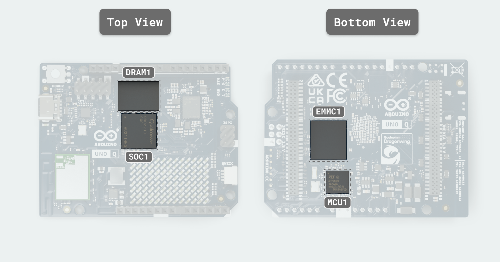
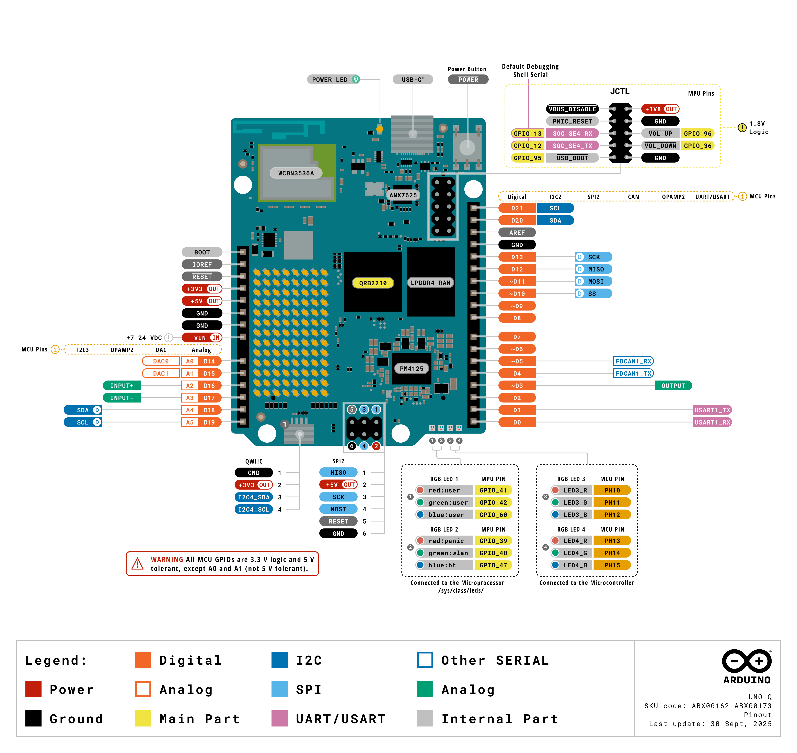

# Description

<p style="text-align: justify;">Arduino® UNO Q (hereafter UNO Q) is a single-board computer that combines the Qualcomm® Dragonwing™ QRB2210 Microprocessor (MPU), a quad-core Arm® Cortex®-A53 running Debian Linux OS, with the STMicroelectronics STM32U585 Microcontroller (MCU), an Arm® Cortex®-M33 running Arduino Core on Zephyr OS. The Linux system and the microcontroller communicate through Bridge, Arduino’s RPC (Remote Procedure Call) library. This allows Arduino sketches on the microcontroller to access Linux services for high-level tasks, while Linux applications can interact with microcontroller peripherals to handle real-time operations within the same project.</p>

<p style="text-align: justify;">UNO Q comes with embedded eMMC storage (options 16 GB, 32 GB) and LPDDR4X SDRAM (options 2 GB, 4 GB) to run Linux and your projects smoothly. It features dual-band Wi-Fi® 5 and Bluetooth® 5.1 for wireless connectivity, a USB-C® connector with power delivery input and video output, and Arduino-compatible headers for easy expansion with shields, carriers, and accessories.</p>


<p style="text-align: justify;">UNO Q integrates seamlessly with Arduino App Lab, enabling developers to combine Arduino sketches, Linux applications, and AI models in one environment. App Lab can run directly on the board or from a connected PC, offering ready-to-use examples, and the flexibility to create custom apps tailored to your projects.</p>

# Target Areas

Prototyping, Edge AI & ML, Machine Vision, Education, Smart Devices, Robotics, Home and Building Automation, Gaming

<div style="page-break-after: always;"></div>

# CONTENTS

## Application Examples

<p style="text-align: justify;">UNO Q combines an AI-capable Linux processor with a real-time microcontroller, delivering the best of high-level computing and deterministic control. Alongside this dual architecture, it supports a broad ecosystem of Arduino shields, carriers, Modulino® nodes, and third-party accessories, making it a flexible platform for diverse applications.</p>

- **Prototyping:** Rapid proof-of-concepts such as vision-based inspection tools, smart kiosks, or compact edge computers with built-in connectivity.

- **Education:** Teaching Linux, real-time programming, AI, and computer vision through project-based learning, from science experiments to interactive educational robots.

- **Robotics:** Autonomous delivery robots, gesture-following companions, and robotic arms with visual feedback, combining Linux vision with MCU-driven motor control.

- **Smart Consumer Devices:** DIY smart cameras, interactive displays, or AR projects powered by dual cameras and GPU acceleration.

- **Home & Building Automation:** Smart doorbells with facial recognition, voice-controlled systems, and personalized climate hubs.

- **Gaming:** Retro console emulation, custom arcade cabinets, or enhanced gameplay with gesture-based controls, face tracking, and real-time feedback.

<div style="page-break-after: always;"></div>

## Features

### UNO Q Variants

UNO Q is available in two variants:

- **ABX00162**: 2 GB RAM, 16 GB on-board storage
- **ABX00173**: 4 GB RAM, 32 GB on-board storage

### General Specifications Overview

#### Processing & Memory



| **Subsystem** | **Details**                                                                                                                                                                                                                                                                                                                                                                         |
|---------------|-------------------------------------------------------------------------------------------------------------------------------------------------------------------------------------------------------------------------------------------------------------------------------------------------------------------------------------------------------------------------------------|
| Main MPU      | - Qualcomm Dragonwing™ QRB2210 - System-on-Chip (SoC) (MPU) (SOC1): 4 × Arm Cortex-A53 @ 2.0 GHz, 64-bit <br></br>- Adreno 702 GPU @ 845 MHz (3D graphics) <br></br>- Dual ISPs: 13 MP + 13 MP or 25 MP @ 30 fps <br></br>- Debian OS (upstream support) <br></br>- I/O: USB 3.1 with Role-Switching Capabilities over USB Connector, SDIO 3.0, 4-lane MIPI-CSI-2 & 4-lane MIPI-DSI |
| Real-time MCU | - ST STM32U585 (MCU) (MCU1), Arm Cortex-M33 up to 160 MHz <br></br>- Arduino Core on Zephyr OS <br></br>- 2 MB Flash, 786 kB SRAM                                                                                                                                                                                                                                                   |
| System Memory | - eMMC 16 or 32 GB options (EMMC1) for OS/data <br></br>- LPDDR4X 2GB or 4 GB options (single-rank, 32-bit) (DRAM1)                                                                                                                                                                                                                                                                 |

<p style="text-align: justify;">The Qualcomm Dragonwing™ QRB2210 I/O operates at 1.8 V.
The MPU drives the MIPI-CSI-2 camera and MIPI-DSI display interfaces on JMEDIA, and the 1.8 V MPU (SoC) GPIO and audio endpoints exposed on JMISC.
JMISC is a mixed-voltage header that also carries 3.3 V MCU signals and analog audio alongside the 1.8 V MPU lines. DisplayPort video is provided by the on-board ANX7625, which converts the MPU's MIPI-DSI to DisplayPort Alt-Mode on USB-C.
The STM32U585 manages ADC, PWM, CAN, the LED matrix, and the 3.3 V headers (JDIGITAL, JANALOG, JSPI, and Qwiic).</p>

#### Connectivity & Media


| **Subsystem**      | **Details**                                                                                                                                                                                                                                                                                                                                                                                                                                                                      |
|--------------------|----------------------------------------------------------------------------------------------------------------------------------------------------------------------------------------------------------------------------------------------------------------------------------------------------------------------------------------------------------------------------------------------------------------------------------------------------------------------------------|
| Wireless Module    | - WCBN3536A (Qualcomm WCN3980) (U2901) <br></br>- Wi-Fi® 5 802.11a/b/g/n/ac (dual-band) + Bluetooth® 5.1                                                                                                                                                                                                                                                                                                                                                                         |
| USB-C Port (JUSB1) | - USB 3.1 with Role-Switching Capabilities<br></br>- DisplayPort Alt-Mode via the ANX7625 DSI-to-DP bridge (U3001) (SuperSpeed differential pairs on the Type-C are routed for DP Alt Mode)<br></br>- Video output (SBC mode): Supports Full HD (1920 × 1080p) displays; optimal resolution is 1280 × 720p<br></br>- USB Power Delivery negotiation requests a **5 V / 3 A** contract only (no higher-voltage profiles)<br></br>- VBUS load-switch/back-drive protection (Q2801) |

The wireless module uses SDIO for Wi-Fi® data and a UART for Bluetooth® control, with a shared PCB antenna.

#### Expansion & Headers


| **Interface (Connector)** | **Voltage & Pin Count**       | **Details**                                                  |
| ------------------------- | ----------------------------- | ------------------------------------------------------------ |
| JMEDIA (JMEDIA1)          | 1.8 V signals, 60-pin         | - High-speed camera/display lanes (MIPI DSI, CSI) <br></br>- Camera control bus (CCI I²C) - dedicated, not general-purpose GPIO <br></br>- Camera clocks (SOC_CAM_MCLK0/1) <br></br>- Also carries power rails (+3V3 OUT, VIN IN) and GND |
| JMISC (JMISC1)            | Mixed 1.8 V / 3.3 V, 60-pin   | - Mixed GPIO and SDIO <br></br>- MCU peripherals: SDMMC1, TRACE, PSSI (parallel camera), I²C4, MCO/CRS_SYNC, OPAMP1 pins <br></br>- Audio endpoints: Mic2 INP/INM/BIAS, Headphone L/R + REF, LineOut P/M, Earpiece P/R, HS_DET <br></br>- MPU (SoC) GPIO banks (SE0) at 1.8 V <br></br>- Also carries power rails (+5V USB OUT, +3V3 OUT, +1V8 OUT, VBAT OUT, VCOIN IN) and GND |
| JCTL (JCTL1)              | 1.8 V, 10-pin                 | - SE4 UART console <br></br>- Forced USB boot input <br></br>- PMIC reset input <br></br>- VBUS power-switch disable <br></br>- 1.8 V rail and GND |
| JDIGITAL (JDIGITAL1)      | 3.3 V, 18-pin                 | - Digital I/O for SPI, I²C, UART, PWM, CAN                   |
| JANALOG (JANALOG1)        | 3.3 V, 14-pin                 | - Analog I/O <br></br>- ADC channels and references          |
| JSPI (JSPI1)              | 3.3 V logic, 6-pin + 5 V VBUS | - Dedicated SPI: MOSI, MISO, SCLK <br></br>- MCU reset (NRST) <br></br>- Ground <br></br>- 5 V VBUS (USB power) |
| Qwiic (QWIIC1)            | 3.3 V, 4-pin                  | - I²C (Qwiic ecosystem)                                      |

### Related Products

- Arduino UNO shields via JDIGITAL and JANALOG
- UNO Q compatible carrier boards
- Full 24-pin USB-C cable
- USB-C dongle with external power delivery capabilities

<div style="page-break-after: always;"></div>

## Ratings

### Input Power


| **Source**  | **Voltage Range** | **Maximum Current** | **Connector**         |
|-------------|------------------:|--------------------:|-----------------------|
| USB-C VBUS  |               5 V |           up to 3 A | USB-C connector       |
| VIN (DC IN) |            7-24 V |                   - | JMEDIA, JANALOG (VIN) |
| 5 V Pin     |               5 V |           up to 3 A | JANALOG               |

<p style="text-align: justify;">UNO Q supports dual power inputs: a USB-C port and a 7-24V DC input. Over USB Power Delivery, it requests only the 5 V / 3 A contract and does not request higher-voltage PD profiles. Use a supply and cable rated for 5 V at 3 A to avoid undervoltage during short activity peaks such as wireless bursts or display initialization. A regulated external 5 V DC source can also be used to supply power to the board via the 5 V pin on the JANALOG header.</p>

<p style="text-align: justify;"><em>USB-C VBUS</em> and the 5 V output of the 7-24 V buck are <em>diode-OR</em> combined onto the system 5 V bus (<code>5V_SYS</code>). From <code>5V_SYS</code>, the design derives the 3.8 V pre-regulator node and, subsequently, the 3.3 V.
The PMIC, powered by 5V_SYS, derives the 1.8V rail.</p>

<p style="text-align: justify;"><strong>Reverse-polarity protection:</strong> Verified with -24 V applied to DC IN. The operation is specified only with the correct polarity. Do not apply reverse voltage during normal use.</p>

<p style="text-align: justify;"><strong>Schottky OR path:</strong> Forward-voltage drop from the buck output to <code>5V_SYS</code> was measured as follows (JANALOG VIN injection, Rigol DP832 supply in series, Keithley DMM6500 measurement, 8542B active load). Power dissipation is calculated as <code>P = I × Vf</code>.</p>

| **Load current** | **Forward drop (`Vf`)** | **Diode dissipation** |
|-----------------:|------------------------:|----------------------:|
|            1.0 A |                  0.35 V |                0.35 W |
|            1.5 A |                  0.37 V |                0.56 W |
|            2.0 A |                  0.39 V |                0.78 W |

### Recommended Operating Conditions

Use the limits below to size power sources, define rail tolerances, and plan thermal margin:

| **Parameter**         | **Symbol**  | **Minimum** | **Typical** | **Maximum** | **Unit** |
|-----------------------|-------------|:-----------:|:-----------:|:-----------:|:--------:|
| USB-C input           | `VBUS_USBC` |     4.5     |     5.0     |     5.5     |    V     |
| DC input              | `DC_IN`     |     7.0     |      -      |    24.0     |    V     |
| 3.3 V system rail     | `PWR_3P3V`  |     3.1     |     3.3     |     3.5     |    V     |
| Operating temperature | `T_OP`      |     -10     |      -      |     60      |    °C    |

<p style="text-align: justify;"><em>Minimum</em> indicates the lowest continuous value for regular operation; brief dips can cause resets or link drops. <em>Typical</em> is the nominal design point. <em>Maximum</em> must not be exceeded. For <code>DC_IN</code> (7-24 V), select a supply that comfortably covers the 5 V load and use short cables to reduce voltage drop. The <code>PWR_3P3V</code> range reflects regulator tolerance and load. The temperature range refers to ambient air near the board, and operating near the limits can reduce available output current.</p>

### On-Board Voltage Rails

| **Voltage** | **Rail**         | **Origin / Regulator**                                                       |
|------------:|------------------|------------------------------------------------------------------------------|
|       5.0 V | `5V_SYS`         | Diode OR of USB-C VBUS and 7-24 V buck output (both via Schottky rectifiers) |
|       3.8 V | `PWR_3P8V`       | Step-down (buck) from `5V_SYS`                                               |
|       3.3 V | `PWR_3P3V`       | Step-down (buck) from `PWR_3P8V`                                             |
|       1.8 V | `VREG_L15A_1P8V` | PM4125 LDO L15A  from `5V_SYS`                                               |

<div style="page-break-after: always;"></div>

## Functional Overview

### Pinout



### Block Diagram


### Power Supply

<p style="text-align: justify;">UNO Q supports dual power inputs: a USB-C port and a 7-24V DC input. 
<em>USB-C VBUS</em> and the 5 V output of the 7-24 V buck are <em>diode-OR</em> combined onto the system 5 V bus (5V_SYS).</p>

<p style="text-align: justify;"><code>5V_SYS</code> supplies the <strong>PM4125 PMIC (PMIC1)</strong> at <code>USB_IN</code>.
The PMIC's L15A LDO provides the 1.8 V rail (<code>VREG_L15A_1P8V</code>) and powers the SoC I/O banks, ANX7625 <code>DVDD18</code>, Wi-Fi® digital logic, and the on-board level shifters. The 1.8 V rail is also available on <code>JMISC</code>.
From <code>5V_SYS</code>, a buck generates the <code>PWR_3P8V (3.8 V)</code> reserved for system design and future features.
A second buck generates <code>PWR_3P3V</code> for the STM32U585, the ANX7625 (3.3 V rails), the Wi-Fi® 3.3 V domain, and the 3.3 V header pins.</p>
<p style="text-align: justify;">A <em>protected P-channel MOSFET</em> (<code>Q2801</code>) can source USB <code>VBUS</code> from <code>5V_SYS</code> when the board operates as a USB host/OTG. The <code>VCOIN</code> powers only the real-time clock of the PMIC and does not power the Linux or MCU domains. The <code>VBAT</code> connects to the <code>PWR_3P8V</code> and is reserved for system design and future features. </p>


<div style="page-break-after: always;"></div>

## UI & Indicators


- **RGB LEDs (Linux-controlled):** Two tri-color LEDs are driven by the Qualcomm Dragonwing™ QRB2210 application processor and exposed via `/sys/class/leds/`.

  - **RGB LED 1 (D27301):** channels: `red:user` → **GPIO_41**, `green:user` → **GPIO_42**, `blue:user` → **GPIO_60**.
  - **RGB LED 2 (D27302):** channels: `red:panic` → **GPIO_39**, `green:wlan` → **GPIO_40**, `blue:bt` → **GPIO_47**.
    
    By default, RGB LED 2 indicates system status, `PANIC`, `WLAN`, and `BT`, but it can also be user-controlled. PWM frequency is approximately 2 kHz for smooth color transitions.

- **RGB LEDs (MCU-controlled):** Two tri-color LEDs are driven by the STM32U585.

  - **RGB LED 3 (D27401):** `LED3_R` → **PH10**, `LED3_G` → **PH11**, `LED3_B` → **PH12**.
  - **RGB LED 4 (D27402):** `LED4_R` → **PH13**, `LED4_G` → **PH14**, `LED4_B` → **PH15**.

<div style="background-color: rgba(0, 170, 228, 0.2); border-left: 6px solid rgba(0, 120, 180, 1); margin: 20px 0; padding: 15px;">
  The RGB LEDs are active-low, meaning they turn on when driven to logic `0`.
</div>

- **LED matrix (D27001..D27104):** 8 × 13 monochrome blue LED matrix (104 pixels) driven by the STM32U585. It displays the boot logo for approximately 20–30 seconds during Linux startup. Accessing the matrix before startup completes may interfere with MCU operation.

- **Power LED (D27201):** Green indicator tied to the 3.3 V rail and illuminated whenever the board is powered.

## MPU & MCU

<p style="text-align: justify;">
An MPU (Microprocessor unit) is a high-performance application processor designed to run a full operating system and complex software. An MCU (Microcontroller unit) is a small, power-efficient controller focused on fast, precise timing for I/O and control. UNO Q combines both to pair OS-level compute with responsive, time-critical control on a single-board board and communicate through Bridge, an RPC layer implemented on both sides.</p>

### Application Processor (MPU)
<p style="text-align: justify;">
Qualcomm® Dragonwing™ QRB2210 is a quad-core Arm® Cortex®-A53 running Debian Linux OS. Its I/O operates at 1.8 V and it handles the high-speed media and Type-C/PD policy.
</p>

<ul>
  <li>Voltage domain: 1.8 V for MPU (SoC) GPIO and high-speed interfaces</li>
  <li>Drives JMEDIA: MIPI-CSI-2 camera and MIPI-DSI display lanes</li>
  <li>Drives 1.8 V MPU GPIO and audio endpoints on JMISC (mixed-voltage header)</li>
  <li>USB-C: role switching and PD negotiation (requests 5 V / 3 A)</li>
  <li>DisplayPort output via on-board ANX7625 (converts MIPI-DSI to DP Alt-Mode)</li>
</ul>

### Real-Time Microcontroller (MCU)
<p style="text-align: justify;">
STMicroelectronics® STM32U585 is an Arm® Cortex®-M33 running Arduino Core on Zephyr OS. It provides fast, precise timing for control tasks and 3.3 V I/O headers.
</p>

<ul>
  <li>Voltage domain: 3.3 V for GPIO and analog (VREF+ ≈ 3.3 V)</li>
  <li>Manages ADC, PWM, CAN, LED matrix, timers</li>
  <li>Handles 3.3 V headers: JDIGITAL, JANALOG, JSPI, Qwiic</li>
</ul>

<p style="text-align: justify;">
JMISC handles both domains: 1.8 V MPU lines sit alongside 3.3 V MCU signals (e.g., PSSI, SDMMC1, TRACE, I²C4) and analog/audio. Please check the voltage levels when attaching carriers or external logic.
</p>

## Inter-Processor Communication

<p style="text-align: justify;">The Qualcomm® Dragonwing™ QRB2210 (MPU) and the STM32U585 (MCU) communicate through the Arduino Bridge, a software-based Remote Procedure Call (RPC) layer implemented on both the Linux and MCU sides. Bridge provides a service-oriented API that allows either processor to expose services for the other to call, while also supporting one-way notifications for asynchronous events. It manages message routing between processors and accommodates multiple physical transports. Through its API, Bridge enables type-safe function calls, allowing microcontroller sketches to invoke Linux services and receive structured responses, or to push data via notifications.</p>

<p style="text-align: justify;">If a hardware indicator is required for a carrier board or external logic, firmware can dedicate a 1.8V MPU GPIO on JMISC, or an available JCTL GPIO, as a ready or wake output. This signal can be received on an MCU GPIO through level-compatible circuitry, such as a level shifter or open-drain configuration with a pull-up resistor. The firmware defines the exact role of this signal. Alternatively, activity on the selected transport (USB CDC, UART, or SPI) can serve as a wake source when the MCU is in sleep mode.</p>

<div style="background-color: rgba(0, 170, 228, 0.2); border-left: 6px solid rgba(0, 120, 180, 1); margin: 20px 0; padding: 15px;">
  MPU GPIO signals operate in the application processor's low-voltage domain (1.8 V). Ensure any connection to the microcontroller is level-compatible with its I/O voltage rail (3.3 V). For example, use a level shifter or an open-drain configuration with a pull-up to the microcontroller's I/O rail.
</div>

<div style="page-break-after: always;"></div>

## Hardware Acceleration

<p style="text-align: justify;">The UNO Q provides hardware acceleration for both 3D graphics and video encoding/decoding through the integrated Adreno 702 GPU running at 845 MHz.</p>

### Graphics Acceleration

<p style="text-align: justify;">The Adreno 702 GPU provides hardware-accelerated 3D graphics rendering through open-source Mesa drivers. Applications can access GPU acceleration via standard graphics APIs, including OpenGL, OpenGL ES, Vulkan, and OpenCL.</p>

| **Graphics API** | **Driver** | **Hardware Support** | **Current Driver Version** | **Device Name**        |
|------------------|------------|----------------------|----------------------------|------------------------|
| Desktop OpenGL   | freedreno  | -                    | 3.1                        | FD702                  |
| OpenGL ES        | freedreno  | 3.1                  | 3.1                        | FD702                  |
| Vulkan           | turnip     | 1.1                  | 1.0.318                    | Turnip Adreno (TM) 702 |
| OpenCL           | Mesa       | 2.0                  | 2.0                        | -                      |

<p style="text-align: justify;">The Adreno 702 GPU features unified memory architecture, sharing system RAM with the CPU for data transfer. It supports 64-bit memory addressing and provides direct rendering capabilities for optimal graphics performance.</p>

| **Parameter**                  | **Specification**                |
|--------------------------------|----------------------------------|
| Clock Frequency                | 845 MHz                          |
| Memory Architecture            | Unified (shared with system RAM) |
| Available Video Memory         | 1740 MB                          |
| Memory Addressing              | 64-bit                           |
| Direct Rendering               | Yes                              |
| Maximum 2D Texture Size        | 16384 × 16384 pixels             |
| Maximum 3D Texture Size        | 2048³ voxels                     |
| Maximum Cube Map Size          | 16384 × 16384 pixels             |
| OpenGL Shading Language (GLSL) | 1.40                             |
| OpenGL ES Shading Language     | 3.10 ES                          |

<p style="text-align: justify;">The Mesa graphics stack provides support for standard OpenGL extensions and features. Applications using OpenGL, OpenGL ES, or Vulkan will automatically use hardware acceleration without additional configuration. Standard graphics utilities such as <code>mesa-utils</code> and <code>vulkan-tools</code> work out of the box on the UNO Q.</p>

<div style="background-color: rgba(0, 170, 228, 0.2); border-left: 6px solid rgba(0, 120, 180, 1); margin: 20px 0; padding: 15px;">
  <strong>Note:</strong> The OpenGL and Vulkan drivers are available through the <strong>freedreno (OpenGL/OpenGL ES)</strong> and <strong>turnip (Vulkan)</strong> open-source Mesa drivers, providing transparency and community support. While the Adreno 702 hardware supports Vulkan 1.1, the current driver implementation provides Vulkan 1.0.318. <strong>There are no UNO Q-specific OpenGL or Vulkan examples. However, standard Mesa utilities and examples from the Mesa project can be used as references.</strong>
</div>

### Video Acceleration

<p style="text-align: justify;">The Adreno 702 GPU includes dedicated hardware video encoders and decoders accessible through the <code>V4L2 (Video4Linux2)</code> API via <code>/dev/video0</code> and <code>/dev/video1</code> devices. Hardware acceleration is available for the following video codecs:</p>

| **Codec**    | **Encoding** | **Decoding** | **GStreamer Element**     |
|--------------|--------------|--------------|---------------------------|
| H.264 (AVC)  | Yes          | Yes          | v4l2h264enc / v4l2h264dec |
| H.265 (HEVC) | Yes          | Yes          | v4l2h265enc / v4l2h265dec |
| VP9          | No           | Yes          | v4l2vp9dec                |

<p style="text-align: justify;">The hardware video encoder and decoder offload compression and decompression tasks from the CPU to dedicated hardware, enabling efficient real-time video processing. This reduces system power consumption and allows the CPU to focus on application logic. Hardware acceleration is available for resolutions up to 1920×1080 (Full HD), including common formats such as 720p (1280×720).</p>

#### GStreamer Integration

<p style="text-align: justify;">The recommended approach for accessing hardware video acceleration is through <strong>GStreamer</strong>, which provides a high-level pipeline interface to the V4L2 devices. The following GStreamer elements provide hardware-accelerated video processing:</p>

For H.264 decoding, the following pipeline can be used:

```bash
gst-launch-1.0 filesrc location=videos/xxxxx.mp4 \
  ! qtdemux name=demux demux.video_0 ! queue ! h264parse ! v4l2h264dec \
  ! videoconvert ! autovideosink
```

For H.265 decoding, the following pipeline can be used:

```bash
gst-launch-1.0 filesrc location=videos/xxxxx.mp4 \
  ! qtdemux name=demux demux.video_0 ! queue ! h265parse ! v4l2h265dec \
  ! videoconvert ! autovideosink
```

For VP9 decoding, the following pipeline can be used:

```bash
gst-launch-1.0 filesrc location=videos/xxxxx.webm \
  ! matroskademux ! queue ! v4l2vp9dec \
  ! videoconvert ! autovideosink
```

For H.264 encoding, the following pipeline can be used:

```bash
gst-launch-1.0 videotestsrc num-buffers=30 \
  ! video/x-raw,width=1280,height=720,framerate=30/1 \
  ! v4l2h264enc ! h264parse ! mp4mux ! filesink location=/tmp/output.mp4
```

For H.265 encoding, the following pipeline can be used:

```bash
gst-launch-1.0 videotestsrc num-buffers=30 \
  ! video/x-raw,width=1920,height=1080,framerate=30/1 \
  ! v4l2h265enc ! h265parse ! mp4mux ! filesink location=/tmp/output.mp4
```

For concurrent encoding and decoding, the following pipeline can be used:

```bash
gst-launch-1.0 -v videotestsrc num-buffers=1000 \
  ! video/x-raw,format=NV12,width=1280,height=720,framerate=30/1 \
  ! v4l2h264enc capture-io-mode=4 output-io-mode=2 ! h264parse \
  ! v4l2h264dec capture-io-mode=4 output-io-mode=2 ! videoconvert \
  ! autovideosink
```

<div style="background-color: rgba(0, 170, 228, 0.2); border-left: 6px solid rgba(0, 120, 180, 1); margin: 20px 0; padding: 15px;">
 <strong>Developer Access:</strong> The V4L2 video devices are accessible through standard Linux APIs, allowing direct integration into C/C++ applications using libv4l2 or through higher-level frameworks like GStreamer, FFmpeg, or OpenCV with V4L2 backend support.
</div>

### OpenCL Support

<p style="text-align: justify;">OpenCL 2.0 support is available through the Mesa implementation, allowing general-purpose GPU (GPGPU) computing for parallel processing tasks, scientific computing, and compute-intensive operations. The Adreno 702's OpenCL capabilities allow offloading compute-intensive workloads from the CPU to the GPU for improved performance.</p>

<div style="page-break-after: always;"></div>

## Peripherals


- **JDIGITAL (A2) (JDIGITAL1) / JANALOG (A3) (JANALOG1):** 3.3 V GPIO with support for SPI, UART, CAN, PWM, and ADC inputs. Analog inputs are referenced to `VREF+` on the 3.3 V rail. Valid input range is 0 V to `VREF+`. Some STM32U585 pads may be 5 V-tolerant in digital mode, but when configured as ADC or any analog function (such as *A0* through *A5*), they are not 5 V-tolerant and must not exceed `VDD + 0.3 V`. Use external conditioning like a voltage divider or buffer for higher voltages. For *A4/A5* when used as I2C3 (PC1/PC0), use pull-ups to 3.3 V only.

- **QWIIC Connector (A4) (QWIIC1):** Additional I²C bus (3.3 V logic). It maps as **PD13 (I2C4_SDA)** and **PD12 (I2C4_SCL)**. It guarantees plug-and-play compatibility with Modulino® nodes and 3rd party sensors and actuators.

- **JSPI (A5) (JSPI1):** 3.3 V SPI header for peripherals that provides MOSI, MISO, and SCLK signals, with chip-select available through a GPIO pin on JDIGITAL/JMISC. The pins use STM32U585 FT-type configuration with MISO on PC2, MOSI on PC3, and SCK on PD1. They are 5 V-tolerant as inputs or in open-drain, while outputs drive 3.3 V. Add level shifting if a 5 V input threshold or 5 V bidirectional signaling is required. Includes a `5V_SYS` power pin.

- **JMEDIA (B2) (JMEDIA1):** Four-lane camera and display signals in the 1.8 V domain (MIPI-CSI-2 and MIPI-DSI).

- **JMISC (B1) (JMISC):** Mixed function header combining 3.3 V MCU signals and 1.8 V MPU signals. It provides MCU PSSI (parallel camera) bus, SDMMC1 test pins, TRACE, I2C4, MCO/CRS_SYNC, and OPAMP1 analog pins. Also it breakout out audio (Mic2, Headphone L/R+REF, LineOut P/M, Earpiece P/R, HS_DET) and power rails (+3V3, +5V_USB, +1V8, VBAT and VCOIN for system use). Observe voltage domains: **MCU pins are 3.3 V, MPU GPIO are 1.8 V**.

- **JCTL (A1) (JCTL1):** Boot-mode pins, reset, and low-power wake signals (1.8 V logic).

<p style="text-align: justify;"><strong>SE4 UART</strong> is the system console (<code>shell UART</code>). It is separate from application UARTs and should not be repurposed for user I/O. It operates in the MPU's <strong>1.8 V</strong> I/O domain.</p>

<p style="text-align: justify;">Do not use the Qualcomm Dragonwing™ QRB2210 lines reserved for <strong>I²C</strong>, <strong>JMEDIA CCI</strong> (Camera Control Interface), or <strong>MI2S0</strong> (I²S audio bus) as general-purpose I/O. These signals are interface-dedicated, operate at <strong>1.8 V</strong>, and are reserved in the Linux device tree. The headers expose them only for those functions.</p>

### JMISC (B1) (JMISC1) - Pin Map

| **Pin** | **Designation** | **MCU/SoC Pin** | **Domain** | **Notes**                                                    |
| ------: | --------------- | --------------- | ---------- | ------------------------------------------------------------ |
|       1 | MCU_PSSI_D0     | PC6             | 3.3V MCU   | PSSI D0                                                      |
|       2 | MCU_SDMMC1_CMD  | PD2             | 3.3V MCU   | SDMMC1 CMD / test                                            |
|       3 | MCU_PSSI_D1     | PC7             | 3.3V MCU   | PSSI D1                                                      |
|       4 | MCU_TRACE_CLK   | PE2             | 3.3V MCU   | Trace clock                                                  |
|       5 | MCU_PSSI_D2     | PC8             | 3.3V MCU   | PSSI D2                                                      |
|       6 | MCU_TRACE_D0    | PE3             | 3.3V MCU   | Trace data 0                                                 |
|       7 | MCU_PSSI_D3     | PC9             | 3.3V MCU   | PSSI D3                                                      |
|       8 | MCU_TRACE_D2    | PE5             | 3.3V MCU   | Trace data 2                                                 |
|       9 | MCU_PSSI_D4     | PE4             | 3.3V MCU   | PSSI D4                                                      |
|      10 | MCU_TRACE_D3    | PE6             | 3.3V MCU   | Trace data 3                                                 |
|      11 | MCU_PSSI_D5     | PI4             | 3.3V MCU   | PSSI D5                                                      |
|      12 | MCU_PE7         | PE7             | 3.3V MCU   | GPIO                                                         |
|      13 | MCU_PSSI_D6     | PI6             | 3.3V MCU   | PSSI D6                                                      |
|      14 | MCU_PE8         | PE8             | 3.3V MCU   | GPIO                                                         |
|      15 | MCU_PSSI_D7     | PI7             | 3.3V MCU   | PSSI D7                                                      |
|      16 | MCU_I2C4_SCL    | PF14            | 3.3V MCU   | I²C4 SCL                                                     |
|      17 | MCU_PSSI_PDCK   | PD9             | 3.3V MCU   | PSSI clock                                                   |
|      18 | MCU_I2C4_SDA    | PF15            | 3.3V MCU   | I²C4 SDA                                                     |
|      19 | MCU_PSSI_RDY    | PI5             | 3.3V MCU   | PSSI ready                                                   |
|      20 | MCU_OPAMP1_VOUT | PA3             | Analog     | OpAmp1 VOUT                                                  |
|      21 | MCU_PSSI_DE     | PD8             | 3.3V MCU   | PSSI data enable                                             |
|      22 | MCU_OPAMP1_VINP | PA0             | Analog     | OpAmp1 VINP                                                  |
|      23 | MCU_MCO         | PA8             | 3.3V MCU   | MCU clock out                                                |
|      24 | MCU_OPAMP1_VINM | PA1             | Analog     | OpAmp1 VINM                                                  |
|      25 | MCU_CRS_SYNC    | PA10            | 3.3V MCU   | CRS sync                                                     |
|      26 | GND             | -               | Power      | Ground                                                       |
|      27 | GND             | -               | Power      | Ground                                                       |
|      28 | EAR_P_R         | -               | Analog     | Audio ear P_R                                                |
|      29 | MIC2_INP        | -               | Analog     | Mic2 IN+                                                     |
|      30 | EAR_M_R         | -               | Analog     | Audio ear M_R                                                |
|      31 | MIC2_INM        | -               | Analog     | Mic2 IN−                                                     |
|      32 | LINEOUT_P       | -               | Analog     | Line out P                                                   |
|      33 | MIC2_BIAS       | -               | Analog     | Mic2 bias                                                    |
|      34 | LINEOUT_M       | -               | Analog     | Line out M                                                   |
|      35 | GND             | -               | Power      | Ground                                                       |
|      36 | HPH_L           | -               | Analog     | Headphone L                                                  |
|      37 | SOC_GPIO_0_SE0  | -               | 1.8V MPU   | SoC GPIO 0 (SE0)                                             |
|      38 | HPH_R           | -               | Analog     | Headphone R                                                  |
|      39 | SOC_GPIO_1_SE0  | -               | 1.8V MPU   | SoC GPIO 1 (SE0)                                             |
|      40 | HPH_REF         | -               | Analog     | Headphone REF                                                |
|      41 | SOC_GPIO_2_SE0  | -               | 1.8V MPU   | SoC GPIO 2 (SE0)                                             |
|      42 | HS_DET          | -               | Analog     | Headset detect                                               |
|      43 | SOC_GPIO_3_SE0  | -               | 1.8V MPU   | SoC GPIO 3 (SE0)                                             |
|      44 | GND             | -               | Power      | Ground                                                       |
|      45 | SOC_GPIO_86_SE0 | -               | 1.8V MPU   | SoC GPIO 86 (SE0)                                            |
|      46 | SOC_GPIO_98     | -               | 1.8V MPU   | SoC GPIO 98                                                  |
|      47 | SOC_GPIO_82_SE0 | -               | 1.8V MPU   | SoC GPIO 82 (SE0)                                            |
|      48 | SOC_GPIO_99     | -               | 1.8V MPU   | SoC GPIO 99                                                  |
|      49 | SOC_GPIO_18     | -               | 1.8V MPU   | SoC GPIO 18                                                  |
|      50 | SOC_GPIO_100    | -               | 1.8V MPU   | SoC GPIO 100                                                 |
|      51 | SOC_GPIO_28     | -               | 1.8V MPU   | SoC GPIO 28                                                  |
|      52 | SOC_GPIO_101    | -               | 1.8V MPU   | SoC GPIO 101                                                 |
|      53 | +3V3 (OUT)      | -               | Power      | 3.3 V power out                                              |
|      54 | +5V_USB (OUT)   | -               | Power      | 5 V power out                                                |
|      55 | +3V3 (OUT)      | -               | Power      | 3.3 V power out                                              |
|      56 | +5V_USB (OUT)   | -               | Power      | 5 V power out                                                |
|      57 | +1V8 (IN)       | -               | Power      | 1.8 V rail in                                                |
|      58 | GND             | -               | Power      | Ground                                                       |
|      59 | VCOIN (IN)      | -               | Power      | System voltage (PMIC RTC)                                    |
|      60 | VBAT (OUT)      | -               | Power      | System voltage (Reserved for system design and future features) |

<div style="background-color: rgba(0, 170, 228, 0.2); border-left: 6px solid rgba(0, 120, 180, 1); margin: 20px 0; padding: 15px;">
  Note: SoC GPIO lines on JMISC are interface-dedicated (not maker GPIO). MCU are at 3.3 V logic, MPU are at 1.8 V logic, and audio/mic are analog.
</div>

<div style="page-break-after: always;"></div>

### JMEDIA (B2) (JMEDIA1) - Pin Map

| **Pin** | **Designation**         | **Domain** | **Notes**               |
|--------:|-------------------------|------------|-------------------------|
|       1 | GND                     | Power      | Ground                  |
|       2 | GND                     | Power      | Ground                  |
|       3 | MIPI_DSI0_CLK_M         | MIPI D-PHY | DSI clock −             |
|       4 | MIPI_DSI0_L1_P          | MIPI D-PHY | DSI lane1 +             |
|       5 | MIPI_DSI0_CLK_P         | MIPI D-PHY | DSI clock +             |
|       6 | MIPI_DSI0_L1_M          | MIPI D-PHY | DSI lane1 −             |
|       7 | GND                     | Power      | Ground                  |
|       8 | GND                     | Power      | Ground                  |
|       9 | MIPI_DSI0_L2_M          | MIPI D-PHY | DSI lane2 −             |
|      10 | MIPI_DSI0_L0_P          | MIPI D-PHY | DSI lane0 +             |
|      11 | MIPI_DSI0_L2_P          | MIPI D-PHY | DSI lane2 +             |
|      12 | MIPI_DSI0_L0_M          | MIPI D-PHY | DSI lane0 −             |
|      13 | GND                     | Power      | Ground                  |
|      14 | GND                     | Power      | Ground                  |
|      15 | MIPI_DSI0_L3_M          | MIPI D-PHY | DSI lane3 −             |
|      16 | SOC_CAM_MCLK0 (GPIO_20) | 1.8V MPU   | Camera master clock 0   |
|      17 | MIPI_DSI0_L3_P          | MIPI D-PHY | DSI lane3 +             |
|      18 | SOC_CAM_MCLK1 (GPIO_21) | 1.8V MPU   | Camera master clock 1   |
|      19 | GND                     | Power      | Ground                  |
|      20 | GND                     | Power      | Ground                  |
|      21 | CSI0_C0_LN0_M           | MIPI D-PHY | CSI0 data0 −            |
|      22 | CCI_I2C_SDA1 (GPIO_29)  | 1.8V MPU   | Camera control I²C SDA1 |
|      23 | CSI0_B0_LN0_P           | MIPI D-PHY | CSI0 data0 +            |
|      24 | CCI_I2C_SCL1 (GPIO_30)  | 1.8V MPU   | Camera control I²C SCL1 |
|      25 | GND                     | Power      | Ground                  |
|      26 | GND                     | Power      | Ground                  |
|      27 | CSI0_B1_LN1_M           | MIPI D-PHY | CSI0 data1 −            |
|      28 | CSI1_B2_LN3_P           | MIPI D-PHY | CSI1 data3 +            |
|      29 | CSI0_A1_LN1_P           | MIPI D-PHY | CSI0 data1 +            |
|      30 | CSI1_C2_LN3_M           | MIPI D-PHY | CSI1 data3 −            |
|      31 | GND                     | Power      | Ground                  |
|      32 | GND                     | Power      | Ground                  |
|      33 | CSI0_A0_CLK_M           | MIPI D-PHY | CSI0 clock −            |
|      34 | CSI1_C1_LN2_P           | MIPI D-PHY | CSI1 data2 +            |
|      35 | CSI0_NC_CLK_P           | MIPI D-PHY | CSI0 clock +            |
|      36 | CSI1_A2_LN2_M           | MIPI D-PHY | CSI1 data2 −            |
|      37 | GND                     | Power      | Ground                  |
|      38 | GND                     | Power      | Ground                  |
|      39 | CSI0_A2_LN2_M           | MIPI D-PHY | CSI0 data2 −            |
|      40 | CSI1_NC_CLK_P           | MIPI D-PHY | CSI1 clock +            |
|      41 | CSI0_C1_LN2_P           | MIPI D-PHY | CSI0 data2 +            |
|      42 | CSI1_A0_CLK_M           | MIPI D-PHY | CSI1 clock −            |
|      43 | GND                     | Power      | Ground                  |
|      44 | GND                     | Power      | Ground                  |
|      45 | CSI0_C2_LN3_M           | MIPI D-PHY | CSI0 data3 −            |
|      46 | CSI1_A1_LN1_P           | MIPI D-PHY | CSI1 data1 +            |
|      47 | CSI0_B2_LN3_P           | MIPI D-PHY | CSI0 data3 +            |
|      48 | CSI1_B1_LN1_M           | MIPI D-PHY | CSI1 data1 −            |
|      49 | GND                     | Power      | Ground                  |
|      50 | GND                     | Power      | Ground                  |
|      51 | CCI_I2C_SCL0 (GPIO_23)  | 1.8V MPU   | Camera control I²C SCL0 |
|      52 | CSI1_B0_LN0_P           | MIPI D-PHY | CSI1 data0 +            |
|      53 | CCI_I2C_SDA0 (GPIO_22)  | 1.8V MPU   | Camera control I²C SDA0 |
|      54 | CSI1_C0_LN0_M           | MIPI D-PHY | CSI1 data0 −            |
|      55 | GND                     | Power      | Ground                  |
|      56 | GND                     | Power      | Ground                  |
|      57 | VIN (IN)                | Power      | 7-24 V input            |
|      58 | +3V3 (OUT)              | Power      | 3.3 V power out         |
|      59 | VIN (IN)                | Power      | 7-24 V input            |
|      60 | +3V3 (OUT)              | Power      | 3.3 V power out         |

<div style="background-color: rgba(0, 170, 228, 0.2); border-left: 6px solid rgba(0, 120, 180, 1); margin: 20px 0; padding: 15px;">
  Note: MIPI CSI/DSI lanes are D-PHY differential pairs and not general-purpose I/O. Control lines (CCI_I2C_*, SOC_CAM_MCLK*) are 1.8 V MPU domain. VIN on JMEDIA is the raw 7-24 V input (power only).
</div>

<div style="page-break-after: always;"></div>

### Qwiic (A4) (QWIIC1) - Pin Map

| **Pin** | **Designation** | **Net / Function** | **Domain** | **Notes**                |
|--------:|-----------------|--------------------|------------|--------------------------|
|       1 | GND             | Ground             | Power      | -                        |
|       2 | +3V3 OUT        | PWR_3P3V           | Power      | Supply for Qwiic devices |
|       3 | SDA             | PD13 (I2C4_SDA)    | 3.3 V      | -                        |
|       4 | SCL             | PD12 (I2C4_SCL)    | 3.3 V      | -                        |

### JSPI (A5) (JSPI1) - Pin Map

| **Pin** | **Designation** | **Net / Function** | **Domain** | **Notes**  |
|--------:|-----------------|--------------------|------------|------------|
|       1 | MISO            | PC2 (SPI2_MISO)    | 3.3 V      | -          |
|       2 | +5V             | 5V_USB_VBUS        | Power      | Power only |
|       3 | SCK             | PD1 (SPI2_SCK)     | 3.3 V      | -          |
|       4 | MOSI            | PC3 (SPI2_MOSI)    | 3.3 V      | -          |
|       5 | RESET           | MCU_NRST           | 3.3 V      | -          |
|       6 | GND             | Ground             | Power      | -          |

### JCTL (A1) (JCTL1) - Pin Map

| **Pin** | **Designation** | **Net / Function**        | **Domain** | **Notes**          |
|--------:|-----------------|---------------------------|------------|--------------------|
|       1 | GND             | Ground                    | Power      | -                  |
|       2 | USB_BOOT        | Boot strap                | 1.8 V      | -                  |
|       3 | VOL_DOWN        | GPIO_36                   | 1.8 V      | GPIO               |
|       4 | SOC_SE4_TX      | Console UART TX (SE4)     | 1.8 V      | System console     |
|       5 | VOL_UP          | GPIO_96                   | 1.8 V      | GPIO               |
|       6 | SOC_SE4_RX      | Console UART RX (SE4)     | 1.8 V      | System console     |
|       7 | GND             | Ground                    | Power      | -                  |
|       8 | PMIC_RESET      | PM4125 reset              | 1.8 V      | -                  |
|       9 | +1V8 OUT        | VREG_L15A_1P8V            | Power      | 1.8 V reference    |
|      10 | VBUS_DISABLE    | VBUS power switch disable | 1.8 V      | Controls VBUS path |

<div style="page-break-after: always;"></div>

### JDIGITAL (A2) (JDIGITAL1) - Pin Map

| **Pin** | **Designation** | **MCU pin** | **Functions**                               | **Domain** | **Notes**                   |
| ------: | --------------- | ----------- | ------------------------------------------- | ---------- | --------------------------- |
|       1 | D0              | PB7         | - USART1_RX <br></br>- TIM4_CH2             | 3.3 V      | UART                        |
|       2 | D1              | PB6         | - USART1_TX <br></br>- TIM4_CH1             | 3.3 V      | UART                        |
|       3 | D2              | PB3         | - TIM2_CH2                                  | 3.3 V      | -                           |
|       4 | ~D3             | PB0         | - OPAMP2_OUTPUT <br></br>- TIM3_CH3         | 3.3 V      | PWM                         |
|       5 | D4              | PA12        | - FDCAN1_TX <br></br>- TIM1_ETR             | 3.3 V      | -                           |
|       6 | ~D5             | PA11        | - FDCAN1_RX <br></br>- TIM1_CH4             | 3.3 V      | PWM                         |
|       7 | ~D6             | PB1         | - TIM3_CH4                                  | 3.3 V      | PWM                         |
|       8 | D7              | PB2         | - TIM8_CH4N                                 | 3.3 V      | -                           |
|       9 | D8              | PB4         | - TIM3_CH1                                  | 3.3 V      | -                           |
|      10 | ~D9             | PB8         | - TIM4_CH3                                  | 3.3 V      | PWM                         |
|      11 | ~D10            | PB9         | - SPI2_SS (Chip Select) <br></br>- TIM4_CH4 | 3.3 V      | PWM                         |
|      12 | ~D11            | PB15        | - SPI2_MOSI <br></br>- TIM1_CH3N            | 3.3 V      | PWM                         |
|      13 | D12             | PB14        | - SPI2_MISO <br></br>- TIM1_CH2N            | 3.3 V      | -                           |
|      14 | D13             | PB13        | - SPI2_SCK <br></br>- TIM1_CH1N             | 3.3 V      | -                           |
|      15 | GND             | -           | - Ground                                    | Power      | -                           |
|      16 | AREF            | -           | - Analog reference                          | -          | Analog ref pin (not a GPIO) |
|      17 | D20             | PB11        | - I2C2_SDA <br></br>- TIM2_CH4              | 3.3 V      | -                           |
|      18 | D21             | PB10        | - I2C2_SCL <br></br>- TIM2_CH3              | 3.3 V      | -                           |

<div style="background-color: rgba(0, 170, 228, 0.2); border-left: 6px solid rgba(0, 120, 180, 1); margin: 20px 0; padding: 15px;">
  All JDIGITAL lines are 3.3 V logic.
</div>

### JANALOG (A3) (JANALOG1) - Pin Map

| **Pin** | **Designation** | **Net / MCU pin** | **Functions**                                            | **Domain**     | **Notes**                     |
|--------:|-----------------|-------------------|----------------------------------------------------------|----------------|-------------------------------|
|       1 | BOOT            | MCU_BOOT0         | - Boot strap                                             | 3.3 V          | -                             |
|       2 | IOREF           | PWR_3P3V          | - I/O voltage reference (mirrors 3.3 V rail)             | Power          | Output only; do not back-feed |
|       3 | RESET           | MCU_NRST          | - MCU reset                                              | 3.3 V          | -                             |
|       4 | +3V3 OUT        | PWR_3P3V          | - 3.3 V supply                                           | Power          | -                             |
|       5 | +5V USB VBUS    | 5V_USB_VBUS       | - 5 V supply (pass-through)                              | Power          | Power only                    |
|       6 | GND             | GND               | - Ground                                                 | Power          | -                             |
|       7 | GND             | GND               | - Ground                                                 | Power          | -                             |
|       8 | VIN IN          | DC_IN             | - 7-24 V input                                           | Power          | Power only                    |
|       9 | A0 / D14        | PA4               | - ADC input <br></br>- DAC0 <br></br>- TIM2_CH1          | Analog / 3.3 V | Direct ADC / not 5 V-tolerant |
|      10 | A1 /  D15       | PA5               | - ADC input <br></br>- DAC1 <br></br>- TIM3_CH1          | Analog / 3.3 V | Direct ADC / not 5 V-tolerant |
|      11 | A2 /  D16       | PA6               | - ADC input <br></br>- OPAMP2_INPUT+ <br></br>- TIM3_CH2 | Analog / 3.3 V |                               |
|      12 | A3 /  D17       | PA7               | - ADC input <br></br>- OPAMP2_INPUT−                     | Analog / 3.3 V | -                             |
|      13 | A4 /  D18       | PC1               | - ADC input <br></br>- I2C3_SDA <br></br>- LPTIM1_CH1    | Analog / 3.3 V | -                             |
|      14 | A5 /  D19       | PC0               | - ADC input <br></br>- I2C3_SCL <br></br>- LPTIM1_IN1    | Analog / 3.3 V | -                             |

<div style="background-color: rgba(0, 170, 228, 0.2); border-left: 6px solid rgba(0, 120, 180, 1); margin: 20px 0; padding: 15px;">
  A0 (PA4) and A1 (PA5) are direct STM32U585 ADC inputs referenced to <code>VREF+</code>. They are not 5 V-tolerant. Valid input range is <code>0-VREF+</code> (≈3.3 V). The absolute maximum at the pin is <code>VDD + 0.3 V</code>, approximately 3.6 V. Above this level, the MCU's internal protection diodes begin to conduct. The header also provides <code>5V_SYS</code> and <code>PWR_3P3V</code> power pins, which are intended for power supply only. Do not apply 5 V to <strong>A0</strong> or <strong>A1</strong>. IOREF is connected to the 3.3 V rail (<code>PWR_3P3V</code>) and is provided as a reference/output for shields. It is not to be used to feed power back into the board.
</div>

## High-Speed Peripherals

- **USB-C:** USB 3.1 with Role-Switching Capabilities. DisplayPort Alt-Mode via ANX7625 DSI-to-DP bridge. The connector's SuperSpeed differential pairs are shared between DP Alt-Mode and USB 3.1 data. When DisplayPort Alt-Mode is active, USB data speed is reduced.

- **Camera:** Four-lane **MIPI-CSI-2** (1.8 V I/O).

- **Display:** Four-lane **MIPI-DSI** into **ANX7625** for DisplayPort Alt-Mode on USB-C. When operating in Single-Board Computer (SBC) mode, the board supports Full HD (1920 × 1080p) displays with optimal resolution at 1280 × 720p.

- **Wireless:** Dual-band Wi-Fi® (802.11a/b/g/n/ac) and Bluetooth® 5.1 on a shared module.

<div style="page-break-after: always;"></div>

## Device Operation

### Getting Started - Arduino App Lab

Arduino App Lab [1] is a unified editor that builds and runs projects on both processors of the board. A project is an **App** that can include: 

- A Python® program that runs on the Linux system (Qualcomm Dragonwing™ QRB2210)
- An Arduino sketch that runs on the microcontroller (MCU) (STM32U585)
- Optional **Brick** (pre-packaged services such as AI models, web servers, or API clients) that are deployed alongside the App (runs on the Linux system as well).

Apps use **Bridge** to exchange data between the Linux side and the microcontroller.

Arduino App Lab can be installed on your PC, or executed directly on the UNO Q in Single-Board Computer mode. For this setup, the UNO Q's 4GB LPDDR4X variant is recommended to ensure sufficient memory for stable operation and resource-intensive applications. To use the board: 

- Launch a ready-to-use example in Arduino App Lab, customize it to your needs, or build a new application from scratch using the integrated editor.
- Press the **Run** button in Arduino App Lab [1].
- The editor builds the Linux component, flashes the MCU sketch, deploys any selected Brick, and starts everything on the board.
- Logs for both sides are available in the editor and you can iterate without leaving Arduino App Lab.

For first time setting up:

1. Install Arduino App Lab [1], launch it, and connect UNO Q, use a **USB-C data** cable for PC-hosted mode, or simply power the board for SBC mode.
2. The board will automatically check for updates. If there are any updates available, you will be prompted to install them. Once the update is finished, the Arduino App Lab[1] will need to be restarted.
3. During the first setup, you will be asked to provide a name and password for the device. You will also be asked to provide Wi-Fi® credentials for your local network.
4. To test the board, navigate to an example App in the **"Examples"** section of the Arduino App Lab[1], and click on the "Run" button in the top right corner. You can also create a new App in the **"Apps"** section.
5. The status of the App can be monitored in the console tab of the App.

<div style="background-color: rgba(0, 170, 228, 0.2); border-left: 6px solid rgba(0, 120, 180, 1); margin: 20px 0; padding: 15px;"> <p style="text-align: justify;">
  <strong>Note:</strong> In <strong>PC-hosted</strong> mode, a <em>USB data</em> connection is required for first-time setup. Afterwards you can use the <strong>Network</strong> target over LAN (SSH). In <strong>Single-Board Computer (SBC)</strong> mode, no USB data link is needed for setup, just power the board and use the <strong>Network</strong> target once it joins your network. For peripherals in SBC mode (keyboard, mouse, USB camera, microphone), use a USB-C dongle with external power delivery capabilities. When DisplayPort Alt-Mode is active, USB data speed is reduced.</p>
</div>

Use a 5 V / 3 A USB-C source and cable, or power from the 5 V or VIN pins as specified in the [input power section](#input-power) (USB-C is 5 V only / VIN is 7-24 V).

<div style="background-color: rgba(0, 170, 228, 0.2); border-left: 6px solid rgba(0, 120, 180, 1); margin: 20px 0; padding: 15px;">
  First boot typically takes 20-30 seconds while Linux starts. Wait for the boot LED sequence or the LED-matrix animation to finish before interacting with the board.
</div>

### Bricks

<p style="text-align: justify;"><strong>Bricks</strong> are modular building blocks in Arduino App Lab that let you extend your application without writing all of the underlying infrastructure. Each Brick encapsulates ready-made functionality, such as sensor integration, AI models, databases, or user interfaces, that you can drop into a project. Typical Bricks provide:</p>

<ul>
  <li>An AI model (e.g., object classification or keyword spotting)</li>
  <li>A web UI or REST API service</li>
  <li>An integration to an external data source</li>
</ul>

<p style="text-align: justify;">Bricks are deployed alongside the App and managed by the Linux side. The typical workflow is:</p>

<ol>
  <li>Create an <strong>App</strong> in Arduino App Lab.</li>
  <li>Select any <strong>Brick</strong> the App should use.</li>
  <li>Add your Python® code (Linux) and/or your Arduino sketch (MCU).</li>
  <li>The Brick needs to be imported into your `main.py` file, and initialized following the Brick's API.</li>
  <li>Press <strong>Run</strong> to deploy the Linux application, flash the MCU, and launch your App together with its Bricks.</li>
  <li>The <strong>Bridge</strong> tool handles data exchange between Linux and MCU.</li>
</ol>

<div style="background-color: rgba(0, 170, 228, 0.2); border-left: 6px solid rgba(0, 120, 180, 1); margin: 20px 0; padding: 15px;">
  While an App is bound and running, USB interfaces may be occupied by the system. Use Arduino App Lab [1] to deploy and monitor. To use external CLI tools over USB, stop the App or disconnect the board.
</div>

### Hello World

<p style="text-align: justify;">Let's program UNO Q with the classic Arduino "Hello World" - the <em>Blink LED</em> example. This helps verify that the board is correctly connected to Arduino App Lab.</p>

<ol>
  <li>Open Arduino App Lab. It starts in the <strong>Examples</strong> section.</li>
  <li>If you are not using single-board computer mode, <strong>connect UNO Q</strong> to your PC.</li>
  <li>Open <em>Blink LED</em>. Review the example notes to see how the App works.</li>
  <li>Click <strong>Run</strong> and wait for the upload to complete.</li>
</ol>

<p style="text-align: justify;">You should now see the red channel of the built-in RGB LED turn on for one second, then off for one second, repeatedly. The LED is driven by the STM32U585 microcontroller through the Arduino sketch.</p>

<p style="text-align: justify;">You can start from a blank App or use an existing example. For first-time use, the Hello World example is recommended to learn the basic structure.</p>

<div style="background-color: rgba(0, 170, 228, 0.2); border-left: 6px solid rgba(0, 120, 180, 1); margin: 20px 0; padding: 15px;">
  Every time you run an App, the microcontroller sketch is compiled and the Python® application starts on the Linux system. Depending on complexity, this may take up to a minute.
</div>

### How to Check the App Is Running

<p style="text-align: justify;">Open the <strong>Console</strong> in App Lab. There are three tabs:</p>

<ul>
  <li><strong>Start-up</strong>: logs from the launch sequence, including MCU compilation and Linux deployment</li>
  <li><strong>Main (Python®)</strong>: output from the Python® application (<code>print()</code>)</li>
  <li><strong>Sketch (Microcontroller)</strong>: serial output from the Arduino sketch (<code>Serial.println()</code>)</li>
</ul>

<p style="text-align: justify;">An App can launch successfully yet still have runtime issues. Check the Python® log for errors. If a sketch compilation error occurs, launch is aborted.</p>

<div style="page-break-after: always;"></div>

### Power Button

<p style="text-align: justify;">UNO Q includes a <strong>power button (JBTN1)</strong> you can use to reboot the board.</p> 


<strong>Long press (≥ 5 s):</strong> reboots the Linux system (MPU). This does not cut power to the board.

<div style="background-color: rgba(0, 170, 228, 0.2); border-left: 6px solid rgba(0, 120, 180, 1); margin: 20px 0; padding: 15px;">
  <strong>Note:</strong> A long-press reboot restarts the Linux environment and may interrupt running Apps. Save work and ensure safe shutdown of external processes where applicable. The board boots up automatically when power is supplied. Pressing the button is not required for normal boot.
</div>

### Online Resources

<p style="text-align: justify;">Explore community projects on Project Hub [3], browse the Library Reference [4] for supported APIs, and find accessories such as Qwiic sensors, UNO Shield and carrier boards in the Arduino Store [5].</p>

## Mechanical Information

<p style="text-align: justify;">The board dimension measures 68.58 mm × 53.34 mm, with bottom-side parts kept below 2 mm so the board can stack onto carrier bases. The outline and hole pattern follows and are compatible with the UNO form factor.</p>


<div style="page-break-after: always;"></div>

## 中文


# 描述

<p style="text-align: justify;">Arduino® UNO Q（以下简称UNO Q）是一款单板计算机，Qualcomm® Dragonwing™ QRB2210 微处理器（MPU）、 四核Arm® Cortex®-A53处理器 运行Debian Linux操作系统，以及意法半导体STM32U585微控制器（MCU）——该MCU基于Arm® Cortex®-M33架构，运行Zephyr OS上的Arduino核心。Linux系统与微控制器通过Arduino的RPC（远程过程调用）库Bridge进行通信。这使得微控制器上的Arduino程序能够调用Linux服务完成高级任务，同时Linux应用程序可与微控制器外设交互，在同一项目中处理实时操作。</p>

<p style="text-align: justify;">UNO Q 配备嵌入式 eMMC 存储（可选 16 GB 或 32 GB）和 LPDDR4X SDRAM（可选 2 GB 或 4 GB），可流畅运行 Linux 系统及您的项目。该开发板支持双频Wi-Fi® 5和Bluetooth® 5.1蓝牙模块实现无线连接，配备支持电源输入与视频输出的USB-C®接口，并提供兼容Arduino的扩展接口，便于通过扩展板、载体板及配件进行功能扩展。</p>

<p style="text-align: justify;">UNO Q与Arduino App Lab无缝集成，使开发者能够在一个环境中同时运行Arduino程序、Linux应用程序和AI模型。App Lab既可直接在开发板上运行，也可通过连接的电脑运行，提供现成的示例程序，并支持灵活创建定制应用程序以满足项目需求。


</p>

# 目标领域

原型设计、边缘人工智能与机器学习、机器视觉、教育、智能设备、机器人技术、家庭与建筑自动化、游戏

<div style="page-break-after: always;"></div>

# 目录

## 应用示例

<p style="text-align: justify;">UNO Q融合了具备AI能力的Linux处理器与实时微控制器，实现了高级计算与确定性控制的完美结合。凭借这种双架构设计，它兼容广泛的生态系统，包括Arduino扩展板、载体板、Modulino®节点及第三方配件，成为适用于多样化应用的灵活平台。
</p>


- **原型设计:** 快速实现概念验证，例如基于视觉的检测工具、智能自助终端或内置连接功能的紧凑型边缘计算机。

- **教育应用:** 通过项目式学习教授Linux、实时编程、人工智能及计算机视觉，涵盖科学实验到交互式教育机器人等领域。

- **机器人技术:** 融合Linux视觉与MCU驱动电机控制的自主配送机器人、手势跟随伴侣机器人及具备视觉反馈的机械臂。

- **智能消费设备:** 搭载双摄像头与GPU加速的DIY智能相机、交互式显示屏或AR项目。

- **家居与建筑自动化:** 配备人脸识别功能的智能门铃、语音控制系统及个性化气候控制中心。

- **游戏领域:** 复古主机模拟器、定制街机柜，或通过手势控制、面部追踪及实时反馈增强游戏体验。

<div style="page-break-after: always;"></div>

## 特点

### UNO Q 型号

UNO Q 提供两种型号：

- **ABX00162**：2 GB 内存，16 GB 板载存储
- **ABX00173**：4 GB 内存，32 GB 板载存储

### 一般规格概述

#### 处理器与内存


| **子系统**   | **详细信息**                                                 |
| ------------ | ------------------------------------------------------------ |
| 主MPU        | - Qualcomm Dragonwing™ QRB2210 - 系统级芯片 (SoC) (MPU) (SOC1): 4 × Arm Cortex-A53 @ 2.0 GHz, 64位<br></br>- Adreno 702 GPU @ 845 MHz 3D图形处理 <br></br>- Dual ISPs: 13 MP + 13 MP 或 25 MP @ 30 fps <br></br>- Debian操作系统（上游支持）<br></br>- I/O：USB 3.1接口支持USB连接器角色切换功能，SDIO 3.0，4通道MIPI-CSI-2及4通道MIPI-DSI |
| 实时时钟 MCU | - ST STM32U585 (MCU) (MCU1)，Arm Cortex-M33 最高160 MHz <br></br>- Zephyr OS上的Arduino核心 <br></br>- 2 MB闪存，786 kB SRAM |
| 系统内存     | - eMMC 16或32 GB选项（EMMC1）用于操作系统/数据存储 <br></br>- LPDDR4X 2GB或4 GB选项（单通道，32位）（DRAM1） |

<p style="text-align: justify;">Qualcomm Dragonwing™ QRB2210 I/O工作电压为1.8V。该MPU驱动JMEDIA上的MIPI-CSI-2摄像头接口与MIPI-DSI显示接口，同时通过JMISC引出1.8V MPU（SoC）GPIO及音频端点。JMISC为混合电压接口，除1.8V MPU线路外，同时承载3.3V MCU信号及模拟音频。显示端口视频由板载ANX7625提供，该芯片将MPU的MIPI-DSI信号转换为USB-C接口的DisplayPort替代模式。STM32U585芯片管理ADC、PWM、CAN、LED矩阵及3.3V接口（JDIGITAL、JANALOG、JSPI和Qwiic）。</p>


#### 连接性与媒体


| **子系统**                                                   | **详细信息**                                                 |
| ------------------------------------------------------------ | ------------------------------------------------------------ |
| 无线模块                                                     | - WCBN3536A（Qualcomm WCN3980）（U2901）<br></br>- Wi-Fi® 5 802.11a/b/g/n/ac（双频）+ Bluetooth® 5.1 |
| USB-C 接口 (JUSB1)                                           | - 具备角色切换功能的USB 3.1 <br></br>- 通过ANX7625 DSI转DP桥接器实现DisplayPort替代模式（U3001） |
| (Type-C接口的超高速差分对专用于DP替代模式)<br></br> - USB电源传输协议仅支持**5V/3A**供电协议（不支持更高电压配置文件）<br></br>- VBUS负载开关/背驱动保护（Q2801） |                                                              |


无线模块采用SDIO传输Wi-Fi®数据，通过UART控制Bluetooth®蓝牙模块功能，并共享PCB天线。

#### 扩展与头


| **接口 (连接器)**    | **电压与引脚数量**                        | **详细信息**                                                 |
| -------------------- | ----------------------------------------- | ------------------------------------------------------------ |
| JMEDIA (JMEDIA1)     | 1.8 V 信号, 60 引脚                       | - 高速摄像头/显示通道（MIPI DSI、CSI）<br></br>- 摄像头控制总线（CCI I2C）-<br></br> 专用接口，非通用GPIO- 摄像头时钟（SOC_CAM_MCLK0/1）<br></br>- 同时承载电源轨（+3V3 OUT、VIN IN）及地线（GND） |
| JMISC (JMISC1)       | 混合 1.8 V / 3.3 V, 60 引脚               | - 混合GPIO和SDIO <br></br>- MCU外设：SDMMC1、TRACE、PSSI（并行摄像头）、I2C4、MCO/CRS_SYNC、运算放大器1引脚 <br></br>- 音频端点： 麦克风2输入/负反馈/偏置、耳机L/R+参考、线路输出P/M、听筒P/R、耳机检测器 HS_DET<br></br>- MPU（SoC）GPIO银行（SE0）工作于1.8V <br></br>- 同时承载电源轨（+5V USB输出、+3.3V输出、+1.8V输出、电池电压输出、硬币电压输入）及地线 (GND) |
| JCTL (JCTL1)         | 1.8 V, 10 引脚                            | - SE4 UART控制台 <br></br>- 强制USB启动输入<br></br> - PMIC复位输入 <br></br>- VBUS电源开关禁用<br></br> - 1.8V电源轨及接地 |
| JDIGITAL (JDIGITAL1) | 3.3 V, 18 引脚                            | - 用于SPI、I2C、UART、PWM、CAN的数字I/O                      |
| JANALOG (JANALOG1)   | 3.3 V, 14 引脚                            | - 模拟I/O<br></br> - ADC通道及基准电压                       |
| JSPI (JSPI1)         | 3.3 V 数字逻辑电压参考, 6 引脚 + 5 V VBUS | - 专用SPI：MOSI、MISO、SCLK- MCU复位（NRST）- 接地- 5V VBUS（USB供电） |
| Qwiic (QWIIC1)       | 3.3 V, 4 引脚                             | - I2C（Qwiic生态系统）                                       |

### 相关产品

- 通过JDIGITAL和JANALOG实现的Arduino UNO扩展板
- 兼容UNO Q的载体板
- 全规格24针USB-C线缆
- 具备外接电源传输功能的USB-C转接头

<div style="page-break-after: always;"></div>

## 额定值

### 输入电源


| **源电流**  | **工作电压** | **最大限值** | **连接器**            |
| ----------- | -----------: | -----------: | --------------------- |
| USB-C VBUS  |          5 V |   高达3 A 位 | USB-C  连接器         |
| VIN (DC IN) |       7-24 V |            - | JMEDIA, JANALOG (VIN) |
| 5 V 引脚    |          5 V |   高达3 A 位 | JANALOG               |

<p style="text-align: justify;">UNO Q支持双电源输入：USB-C接口和7-24V直流输入。通过USB电源传输协议时，仅请求5V/3A供电协议，不请求更高电压的PD配置文件。请使用额定5V/3A的电源线和线缆，以避免在无线传输突发或显示初始化等短时活动高峰期间出现欠压情况。也可通过JANALOG接头上的5V引脚，使用稳压外部5V直流电源为电路板供电。
</p>


<p style="text-align: justify;"><em>USB-C VBUS</em>与7-24V降压稳压器的5V输出经<em>二极管</em>或门组合接入系统5V总线（<code>5V_SYS</code>）。设计从<code>5V_SYS</code>衍生出3.8V预稳压节点，进而生成3.3V电源。由5V_SYS供电的PMIC则衍生出1.8V电源轨。</p>

<p style="text-align: justify;"><strong>反极性保护：</strong>经直流输入端施加-24V电压验证。本器件仅在正确极性条件下保证工作特性。正常使用时请勿施加反向电压。
</p>


<p style="text-align: justify;"><strong>肖特基或路径</strong>：从降压输出到<code>5V_SYS</code>的正向电压降测量如下（JANALOG VIN注入，Rigol DP832电源串联，Keithley DMM6500测量，8542B有源负载）。功耗按<code>P = I × Vf</code>计算。</p>

| **负载电流** | **正向压降 (`Vf`)** | **二极管功耗** |
| -----------: | ------------------: | -------------: |
|        1.0 A |              0.35 V |         0.35 W |
|        1.5 A |              0.37 V |         0.56 W |
|        2.0 A |              0.39 V |         0.78 W |

### 建议运行条件

使用以下限制来确定电源规格、定义电源轨容差并规划热余量：

| **参数**     | **符号**    | **最小值** | **输出功率典型值** | **最大限值** | **单位** |
| ------------ | ----------- | :--------: | :----------------: | :----------: | :------: |
| USB-C 输入   | `VBUS_USBC` |    4.5     |        5.0         |     5.5      |    V     |
| DC 输入      | `DC_IN`     |    7.0     |         -          |     24.0     |    V     |
| 3.3 V 电源轨 | `PWR_3P3V`  |    3.1     |        3.3         |     3.5      |    V     |
| 工作温度     | `T_OP`      |    -10     |         -          |      60      |    °C    |

<p style="text-align: justify;"><em>2最小值</em>表示常规操作的最低持续值；短暂跌压可能导致重置或链路中断。<em>典型值</em>为设计标称点。<em>最大值</em>不可逾越。对于<code>DC_IN</code>（7-24 V），应选用能轻松满足5 V负载需求的电源，并使用短电缆以减少压降。<code>PWR_3P3V</code>范围反映稳压器容差与负载特性。温度范围指电路板附近环境空气温度，在临界值附近运行可能降低可用输出电流。</p>

### 板载电压轨

| **工作电压** | **电源轨**       | **原点 / 调节器**                                            |
| -----------: | ---------------- | ------------------------------------------------------------ |
|        5.0 V | `5V_SYS`         | USB-C VBUS与7-24V降压输出（均通过肖特基整流器）的二极管或门电路 |
|        3.8 V | `PWR_3P8V`       | 降压电路（降压型）从`5V_SYS`供电                             |
|        3.3 V | `PWR_3P3V`       | 降压电路（降压型）从`PWR_3P8V`供电                           |
|        1.8 V | `VREG_L15A_1P8V` | PM4125 LDO L15A 从`5V_SYS`供电                               |

<div style="page-break-after: always;"></div>

## 功能概述

### 引脚布局


### 方框图


### 电源

<p style="text-align: justify;">UNO Q支持双电源输入：USB-C端口和7-24V直流输入。
<em>USB-C VBUS</em>与7-24V降压稳压器的5V输出通过<em>二极管</em>或门组合接入系统5V总线（5V_SYS）。</p>


<p style="text-align: justify;"><code>5V_SYS</code>通过<code>USB_IN</code>接口为<strong>PM4125</strong>电源管理集成电路(PMIC1)供电。
该PMIC的L15A低压差稳压器提供1.8V电源轨（<code>VREG_L15A_1P8V</code>），为SoC I/O总线、ANX7625的<code>DVDD18</code>引脚、Wi-Fi®数字逻辑电路及板载电平转换器供电。1.8 V电源轨也可通过<code>JMISC</code>接口获取。
由<code>5V_SYS</code>供电的降压电路生成<code>PWR_3P8V (3.8 V)</code>电源，该电源专用于系统设计及未来功能扩展。
第二个降压电路生成<code>PWR_3P3V</code>，为STM32U585、ANX7625（3.3V电源轨）、Wi-Fi® 3.3V域及3.3V接头引脚供电。</p>


<p style="text-align: justify;">当板卡作为USB主机/OTG运行时，<em>受保护的P沟道MOSFET</em>（<code>Q2801</code>）可从<code>5V_SYS</code>为USB <code>VBUS</code>供电。<code>VCOIN</code>仅为PMIC的实时时钟供电，不为Linux或MCU域供电。<code>VBAT</code> 连接到 <code>PWR_3P8V</code>，该引脚保留用于系统设计和未来功能扩展。</p>


<div style="page-break-after: always;"></div>

## 用户界面与指示器


- **RGB LED(Linux控制):** 两颗三色LED由Qualcomm Dragonwing™ QRB2210应用处理器驱动，并通过`/sys/class/leds/`路径暴露。

  - **RGB LED 1 (D27301):** 通道配置：`red:user` → **GPIO_41**，`green:user` → **GPIO_42**，`blue:use` → **GPIO_60**。

  - **RGB LED 2 (D27302):** 通道配置：`red:panic` → **GPIO_39**，`green:wlan` → **GPIO_40**，`blue:bt` → **GPIO_47**。

    默认情况下，RGB LED 2 指示系统状态、`PANIC`、`WLAN` 和 `BT`，但也可由用户控制。PWM 频率约为 2 kHz，以实现平滑的色彩过渡。

- **RGB LED (MCU控制):** 两个三色LED由STM32U585驱动。

  - **RGB LED 3 (D27401):** `LED3_R` → **PH10**, `LED3_G` → **PH11**, `LED3_B` → **PH12**。
  - **RGB LED 4 (D27402):** `LED4_R` → **PH13**, `LED4_G` → **PH14**, `LED4_B` → **PH15**。

<div style="background-color: rgba(0, 170, 228, 0.2); border-left: 6px solid rgba(0, 120, 180, 1); margin: 20px 0; padding: 15px;">
  RGB LED为低电平有效，即逻辑`0`时点亮。
</div>

- **LED矩阵 (D27001..D27104):** 由STM32U585驱动的8×13单色蓝色LED矩阵（104像素）。在Linux启动过程中，该矩阵会显示启动徽标约20–30秒。启动完成前访问该矩阵可能干扰MCU运行。

- **电源指示灯 (D27201):** 绿色指示灯连接至3.3V电源轨，当电路板通电时始终亮起。

## MPU & MCU

<p style="text-align: justify;">
MPU（微处理器单元）是一种高性能应用处理器，专为运行完整操作系统和复杂软件而设计。MCU（微控制器单元）则是小型节能控制器，专注于实现I/O与控制的快速精准时序。UNO Q将二者融合，在单板上实现操作系统级计算与响应迅速的时序控制，并通过双向实现的RPC层Bridge进行通信。</p>

### 应用处理器（MPU）

<p style="text-align: justify;">Qualcomm® Dragonwing™ QRB2210是一款搭载Debian Linux操作系统的四核Arm® Cortex®-A53处理器。其I/O接口工作电压为1.8V，可处理高速媒体传输及Type-C/PD电源管理策略。
</p>

<ul>
  <li>电压域：1.8 V 供电（用于 SoC 的 MPU GPIO 及高速接口）</li> <li>驱动 JMEDIA：MIPI-CSI-2 相机通道与 MIPI-DSI 显示通道</li><li>驱动 1.8 V MPU GPIO 及 JMISC（混合电压接口）上的音频端点</li><li>USB-C：角色切换与 PD 协商（请求 5 V / 3 A）</li> <li>通过板载ANX7625实现DisplayPort输出（将MIPI-DSI转换为DP替代模式）</li>
</ul>

### 实时微控制器（MCU）

<p style="text-align: justify;">
意法半导体® STM32U585是一款基于Arm® Cortex®-M33架构的微控制器，在Zephyr OS系统上运行Arduino核心。它为控制任务提供快速精准的定时功能，并配备3.3 V I/O接口。
</p>


<ul>
  <li>电压域：GPIO和模拟信号为3.3 V (VREF+ ≈ 3.3 V)</li>
  <li>管理ADC、PWM、CAN、LED矩阵、定时器</li>
  <li>支持3.3 V接口：JDIGITAL、JANALOG、JSPI、Qwiic</li>
</ul>


<p style="text-align: justify;">
JMISC同时处理两个电压域：1.8 V MPU线路与3.3 V MCU信号（如PSSI、SDMMC1、TRACE、I2C4）及模拟/音频信号并行。连接载板或外部逻辑电路时，请务必核查电压等级。
</p>


## 处理器间通信

<p style="text-align: justify;">Qualcomm® Dragonwing™ QRB2210（MPU）与 STM32U585（MCU）通过 Arduino Bridge 进行通信，该软件层在 Linux 和 MCU 两端均实现了基于软件的远程过程调用（RPC）。该桥接器提供面向服务的API，使任一处理器都能为另一处理器暴露可调用的服务，同时支持异步事件的单向通知。它管理处理器间的消息路由，并兼容多种物理传输方式。通过其API，桥接器实现类型安全的函数调用，允许微控制器程序调用Linux服务并接收结构化响应，或通过通知推送数据。</p>

<p style="text-align: justify;">若载板或外部逻辑需要硬件指示器，固件可将JMISC上的1.8V MPU GPIO或JCTL的可用GPIO指定为就绪/唤醒输出。该信号可通过电平兼容电路（如电平转换器或带上拉电阻的开漏配置）接收到MCU GPIO端口。固件将定义该信号的具体功能。另一方案是：当MCU处于睡眠模式时，选定传输通道（USB CDC、UART或SPI）的活动状态可作为唤醒源。</p>

<div style="background-color: rgba(0, 170, 228, 0.2); border-left: 6px solid rgba(0, 120, 180, 1); margin: 20px 0; padding: 15px;">
  MPU GPIO信号在应用处理器的低电压域（1.8 V）内工作。确保与微控制器之间的任何连接均与其I/O电压轨（3.3 V）电平兼容。例如，可采用电平转换器或开漏配置，并通过上拉电阻连接至微控制器的I/O电压轨。
</div>
<div style="page-break-after: always;"></div>

## 硬件加速

<p style="text-align: justify;">UNO Q通过集成Adreno 702 GPU（运行频率845 MHz）为3D图形和视频编解码提供硬件加速。</p>

### 图形加速

Adreno 702 GPU通过开源Mesa驱动程序提供硬件加速的3D图形渲染。应用程序可通过标准图形API（包括OpenGL、OpenGL ES、Vulkan和OpenCL）访问GPU加速功能。

| **图形API**    | **驱动程序** | **硬件支持** | **当前驱动程序版本** | **设备名称**           |
| -------------- | ------------ | ------------ | -------------------- | ---------------------- |
| Desktop OpenGL | freedreno    | -            | 3.1                  | FD702                  |
| OpenGL ES      | freedreno    | 3.1          | 3.1                  | FD702                  |
| Vulkan         | turnip       | 1.1          | 1.0.318              | Turnip Adreno (TM) 702 |
| OpenCL         | Mesa         | 2.0          | 2.0                  | -                      |

<p style="text-align: justify;">Adreno 702 GPU采用统一内存架构，与CPU共享系统RAM进行数据传输。它支持64位内存寻址，并提供直接渲染能力以实现最佳图形性能。</p>

| **参数**               | **规格**                  |
| ---------------------- | ------------------------- |
| **时钟频率**           | 845 MHz                   |
| 内存架构               | 统一内存（与系统RAM共享） |
| 可用显存               | 1740 MB                   |
| 内存寻址               | 64-bit                    |
| 直接渲染               | 是                        |
| 最大2D纹理尺寸         | 16384 × 16384 像素        |
| 最大3D纹理尺寸         | 20483 体素                |
| 最大立方体贴图尺寸     | 16384 × 16384 像素        |
| OpenGL着色语言（GLSL） | 1.40                      |
| OpenGL ES着色语言      | 3.10 ES                   |

<p style="text-align: justify;">Mesa图形栈支持标准的OpenGL扩展功能。使用OpenGL、OpenGL ES或Vulkan的应用程序将自动启用硬件加速，无需额外配置。标准图形工具如<code>mesa-utils</code>和<code>vulkan-tools</code>在UNO Q上开箱即用。</p>

<div style="background-color: rgba(0, 170, 228, 0.2); border-left: 6px solid rgba(0, 120, 180, 1); margin: 20px 0; padding: 15px;">
  <strong>注:</strong>OpenGL 和 Vulkan 驱动程序可通过开源 Mesa 驱动程序 <strong>freedreno (支持 OpenGL/OpenGL ES)</strong> 和 <strong>turnip (支持 Vulkan)</strong> 获取，这些驱动程序具有透明性并获得社区支持。尽管 Adreno 702 硬件支持 Vulkan 1.1，但当前驱动程序实现仅提供 Vulkan 1.0.318 版本。<strong>目前尚无针对 UNO Q 平台的 OpenGL 或 Vulkan 示例代码。但可参考 Mesa 项目提供的标准 Mesa 工具及示例代码</strong>。
</div>

### 视频加速

<p style="text-align: justify;">Adreno 702 GPU 包含专用硬件视频编解码器，可通过 <code>V4L2 (Video4Linux2)</code>API 经由 <code>/dev/video0</code> 和 <code>/dev/video1</code> 设备访问。以下视频编解码器支持硬件加速：</p>

| **编解码器** | **编码** | **解码** | **GStreamer元素**         |
| ------------ | -------- | -------- | ------------------------- |
| H.264 (AVC)  | 是       | 是       | v4l2h264enc / v4l2h264dec |
| H.265 (HEVC) | 是       | 是       | v4l2h265enc / v4l2h265dec |
| VP9          | 没有     | 是       | v4l2vp9dec                |

<p style="text-align: justify;">硬件视频编解码器将压缩与解压缩任务从CPU卸载至专用硬件，从而实现高效的实时视频处理。这既降低了系统功耗，又使CPU能够专注于应用逻辑。硬件加速支持最高1920×1080（全高清）分辨率，涵盖720p（1280×720）等常见格式。</p>

#### GStreamer集成

<p style="text-align: justify;">访问硬件视频加速的推荐方案是通过<strong>GStreamer</strong>实现，该框架为V4L2设备提供了高级管道接口。以下GStreamer组件支持硬件加速视频处理：</p>

H.264解码可采用以下管道：

```bash
gst-launch-1.0 filesrc location=videos/xxxxx.mp4 \
  ! qtdemux name=demux demux.video_0 ! queue ! h264parse ! v4l2h264dec \
  ! videoconvert ! autovideosink
```

H.265解码可采用以下管道：

```bash
gst-launch-1.0 filesrc location=videos/xxxxx.mp4 \
  ! qtdemux name=demux demux.video_0 ! queue ! h265parse ! v4l2h265dec \
  ! videoconvert ! autovideosink
```

VP9解码可采用以下管道：

```bash
gst-launch-1.0 filesrc location=videos/xxxxx.webm \
  ! matroskademux ! queue ! v4l2vp9dec \
  ! videoconvert ! autovideosink
```

对于H.264编码，可使用以下处理流程：

```bash
gst-launch-1.0 videotestsrc num-buffers=30 \
  ! video/x-raw,width=1280,height=720,framerate=30/1 \
  ! v4l2h264enc ! h264parse ! mp4mux ! filesink location=/tmp/output.mp4
```

对于H.265编码，可使用以下处理流程：

```bash
gst-launch-1.0 videotestsrc num-buffers=30 \
  ! video/x-raw,width=1920,height=1080,framerate=30/1 \
  ! v4l2h265enc ! h265parse ! mp4mux ! filesink location=/tmp/output.mp4
```

对于并发编码与解码，可以采用以下管道：

```bash
gst-launch-1.0 -v videotestsrc num-buffers=1000 \
  ! video/x-raw,format=NV12,width=1280,height=720,framerate=30/1 \
  ! v4l2h264enc capture-io-mode=4 output-io-mode=2 ! h264parse \
  ! v4l2h264dec capture-io-mode=4 output-io-mode=2 ! videoconvert \
  ! autovideosink
```

<div style="background-color: rgba(0, 170, 228, 0.2); border-left: 6px solid rgba(0, 120, 180, 1); margin: 20px 0; padding: 15px;">
 <strong>开发者访问</strong>：V4L2视频设备可通过标准Linux API访问，支持直接集成至使用libv4l2的C/C++应用程序，或通过具备V4L2后端支持的高级框架（如GStreamer、FFmpeg或OpenCV）进行集成。
</div>


### OpenCL支持

<p style="text-align: justify;">通过Mesa实现支持OpenCL 2.0，可为并行处理任务、科学计算及计算密集型操作提供通用GPU（GPGPU）计算能力。Adreno 702的OpenCL功能可将计算密集型工作负载从CPU卸载至GPU，从而提升性能表现。</p>

<div style="page-break-after: always;"></div>

## 外设


- **JDIGITAL (A2) (JDIGITAL1) / JANALOG (A3) (JANALOG1):** 3.3 V GPIO，支持 SPI、UART、CAN、PWM 和 ADC 输入。模拟输入以 3.3 V 电源轨上的 `VREF+` 为基准。有效输入范围为0 V至`VREF+`。部分STM32U585引脚在数字模式下可耐受5 V电压，但配置为ADC或任何模拟功能（如*A0*至*A5*）时，则不耐受5 V电压，且输入电压不得超过`VDD + 0.3 V`。若需处理更高电压，请使用分压器或缓冲器等外部信号调理电路。当*A4/A5*引脚作为I2C3（PC1/PC0）使用时，仅允许使用上拉电阻连接至3.3V。

- **QWIIC连接器（A4）(QWIIC1):** 额外的I2C总线（3.3V逻辑）。其映射为**PD13（I2C4_SDA** 和 **PD12(I2C4_SCL)**。确保与Modulino®节点及第三方传感器和执行器的即插即用兼容性。

- **JSPI (A5) (JSPI1):** 3.3 V SPI外设接口，提供MOSI、MISO和SCLK信号，芯片选通信号通过JDIGITAL/JMISC上的GPIO引脚实现。引脚采用 STM32U585 FT 型配置：MISO 在 PC2，MOSI 在 PC3，SCK 在 PD1。输入模式或开漏状态下可耐受 5 V 电压，输出驱动 3.3 V。若需 5 V 输入阈值或 5 V 双向信号传输，请添加电平转换器。包含 `5V_SYS` 电源引脚。

- **JMEDIA (B2) (JMEDIA1):** 四通道摄像头与显示信号，工作于1.8V电压域（MIPI-CSI-2和MIPI-DSI）。

- **JMISC (B1) (JMISC):** 混合功能接口，整合3.3V MCU信号与1.8V MPU信号。提供MCU PSSI（并行摄像头）总线、SDMMC1测试引脚、TRACE、I2C4、MCO/CRS_SYNC及OPAMP1模拟引脚。同时引出音频接口（麦克风2、耳机L/R+参考电平、线路输出P/M、听筒P/R、耳机检测HS_DET）及电源轨（+3V3、+5V_USB、+1V8、系统用VBAT和VCOIN）。注意电压域：**MCU引脚为3.3V，MPU通用输入输出为1.8V**。

- **JCTL (A1) (JCTL1):** 启动模式引脚、复位信号及低功耗唤醒信号（1.8V逻辑电平）。

<p style="text-align: justify;"><strong>SE4 UART</strong>是系统控制台（<code>shell UART</code>）。它与应用程序UART独立，不应用于用户I/O。该接口运行于MPU的<strong>1.8V</strong> I/O域。</p>

<p style="text-align: justify;">请勿将 Qualcomm Dragonwing™ QRB2210专用于<strong>I2C</strong>、<strong>JMEDIA CCI</strong>（相机控制接口）或<strong>MI2S0</strong>（I2S音频总线）的线路用作通用输入输出。这些信号为专用接口，工作电压为<strong>1.8V</strong>，并在Linux设备树中被保留。接头仅为实现上述功能而暴露这些信号。</p>

### JMISC (B1) (JMISC1) - 引脚功能概述

| **引脚** | **名称**        | **MCU/SoC 引脚** | **域名** | **注释**                               |
| -------: | --------------- | ---------------- | -------- | -------------------------------------- |
|        1 | MCU_PSSI_D0     | PC6              | 3.3V MCU | PSSI D0                                |
|        2 | MCU_SDMMC1_CMD  | PD2              | 3.3V MCU | SDMMC1 CMD / 测试                      |
|        3 | MCU_PSSI_D1     | PC7              | 3.3V MCU | PSSI D1                                |
|        4 | MCU_TRACE_CLK   | PE2              | 3.3V MCU | 跟踪时钟                               |
|        5 | MCU_PSSI_D2     | PC8              | 3.3V MCU | PSSI D2                                |
|        6 | MCU_TRACE_D0    | PE3              | 3.3V MCU | 跟踪数据 0                             |
|        7 | MCU_PSSI_D3     | PC9              | 3.3V MCU | PSSI D3                                |
|        8 | MCU_TRACE_D2    | PE5              | 3.3V MCU | 跟踪数据 2                             |
|        9 | MCU_PSSI_D4     | PE4              | 3.3V MCU | PSSI D4                                |
|       10 | MCU_TRACE_D3    | PE6              | 3.3V MCU | 跟踪数据 3                             |
|       11 | MCU_PSSI_D5     | PI4              | 3.3V MCU | PSSI D5                                |
|       12 | MCU_PE7         | PE7              | 3.3V MCU | GPIO                                   |
|       13 | MCU_PSSI_D6     | PI6              | 3.3V MCU | PSSI D6                                |
|       14 | MCU_PE8         | PE8              | 3.3V MCU | GPIO                                   |
|       15 | MCU_PSSI_D7     | PI7              | 3.3V MCU | PSSI D7                                |
|       16 | MCU_I2C4_SCL    | PF14             | 3.3V MCU | I2C4 SCL                               |
|       17 | MCU_PSSI_PDCK   | PD9              | 3.3V MCU | PSSI 时钟                              |
|       18 | MCU_I2C4_SDA    | PF15             | 3.3V MCU | I2C4 SDA                               |
|       19 | MCU_PSSI_RDY    | PI5              | 3.3V MCU | PSSI 就绪                              |
|       20 | MCU_OPAMP1_VOUT | PA3              | 模拟     | OpAmp1 VOUT                            |
|       21 | MCU_PSSI_DE     | PD8              | 3.3V MCU | PSSI数据启用                           |
|       22 | MCU_OPAMP1_VINP | PA0              | 模拟     | OpAmp1 VINP                            |
|       23 | MCU_MCO         | PA8              | 3.3V MCU | MCU时钟输出                            |
|       24 | MCU_OPAMP1_VINM | PA1              | 模拟     | OpAmp1 VINM                            |
|       25 | MCU_CRS_SYNC    | PA10             | 3.3V MCU | CRS同步                                |
|       26 | GND             | -                | 电源     | 接地                                   |
|       27 | GND             | -                | 电源     | 接地                                   |
|       28 | EAR_P_R         | -                | 模拟     | 音频耳机P_R                            |
|       29 | MIC2_INP        | -                | 模拟     | Mic2 IN+                               |
|       30 | EAR_M_R         | -                | 模拟     | Audio ear M_R                          |
|       31 | MIC2_INM        | -                | 模拟     | Mic2 IN−                               |
|       32 | LINEOUT_P       | -                | 模拟     | 线路输出P                              |
|       33 | MIC2_BIAS       | -                | 模拟     | 麦克风2偏置                            |
|       34 | LINEOUT_M       | -                | 模拟     | 线路输出M                              |
|       35 | GND             | -                | 电源     | 接地                                   |
|       36 | HPH_L           | -                | 模拟     | 耳机L                                  |
|       37 | SOC_GPIO_0_SE0  | -                | 1.8V MPU | SoC GPIO 0 (SE0)                       |
|       38 | HPH_R           | -                | 模拟     | 耳机R                                  |
|       39 | SOC_GPIO_1_SE0  | -                | 1.8V MPU | SoC GPIO 1 (SE0)                       |
|       40 | HPH_REF         | -                | 模拟     | 耳机REF                                |
|       41 | SOC_GPIO_2_SE0  | -                | 1.8V MPU | SoC GPIO 2 (SE0)                       |
|       42 | HS_DET          | -                | 模拟     | 耳机检测                               |
|       43 | SOC_GPIO_3_SE0  | -                | 1.8V MPU | SoC GPIO 3 (SE0)                       |
|       44 | GND             | -                | 电源     | 接地                                   |
|       45 | SOC_GPIO_86_SE0 | -                | 1.8V MPU | SoC GPIO 86 (SE0)                      |
|       46 | SOC_GPIO_98     | -                | 1.8V MPU | SoC GPIO 98                            |
|       47 | SOC_GPIO_82_SE0 | -                | 1.8V MPU | SoC GPIO 82 (SE0)                      |
|       48 | SOC_GPIO_99     | -                | 1.8V MPU | SoC GPIO 99                            |
|       49 | SOC_GPIO_18     | -                | 1.8V MPU | SoC GPIO 18                            |
|       50 | SOC_GPIO_100    | -                | 1.8V MPU | SoC GPIO 100                           |
|       51 | SOC_GPIO_28     | -                | 1.8V MPU | SoC GPIO 28                            |
|       52 | SOC_GPIO_101    | -                | 1.8V MPU | SoC GPIO 101                           |
|       53 | +3V3 (输出)     | -                | 电源     | 3.3V电源输出                           |
|       54 | +5V_USB (输出)  | -                | 电源     | 5 V 电源输出                           |
|       55 | +3V3 (输出)     | -                | 电源     | 3.3V电源输出                           |
|       56 | +5V_USB (输出)  | -                | 电源     | 5 V 电源输出                           |
|       57 | +1V8 (IN)       | -                | 电源     | 1.8 V 电源轨                           |
|       58 | GND             | -                | 电源     | 接地                                   |
|       59 | VCOIN (IN)      | -                | 电源     | 系统电压（PMIC RTC）                   |
|       60 | VBAT (OUT)      | -                | 电源     | 系统电压（保留用于系统设计和未来功能） |

<div style="background-color: rgba(0, 170, 228, 0.2); border-left: 6px solid rgba(0, 120, 180, 1); margin: 20px 0; padding: 15px;">
  注：JMISC上的SoC GPIO引脚为专用接口 (非创客GPIO)。MCU采用3.3V逻辑电平，MPU采用1.8V逻辑电平，音频/麦克风为模拟信号。
</div>


<div style="page-break-after: always;"></div>

### JMEDIA (B2) (JMEDIA1) - 引脚功能概述

| **引脚** | **名称**                | **域名**   | **注释**          |
| -------: | ----------------------- | ---------- | ----------------- |
|        1 | GND                     | 电源       | 接地              |
|        2 | GND                     | 电源       | 接地              |
|        3 | MIPI_DSI0_CLK_M         | MIPI D-PHY | DSI 时钟 −        |
|        4 | MIPI_DSI0_L1_P          | MIPI D-PHY | DSI 通道1 +       |
|        5 | MIPI_DSI0_CLK_P         | MIPI D-PHY | DSI 时钟 +        |
|        6 | MIPI_DSI0_L1_M          | MIPI D-PHY | DSI 通道1 −       |
|        7 | GND                     | 电源       | 接地              |
|        8 | GND                     | 电源       | 接地              |
|        9 | MIPI_DSI0_L2_M          | MIPI D-PHY | DSI lane2 −       |
|       10 | MIPI_DSI0_L0_P          | MIPI D-PHY | DSI lane0 +       |
|       11 | MIPI_DSI0_L2_P          | MIPI D-PHY | DSI lane2 +       |
|       12 | MIPI_DSI0_L0_M          | MIPI D-PHY | DSI lane0 −       |
|       13 | GND                     | 电源       | 接地              |
|       14 | GND                     | 电源       | 接地              |
|       15 | MIPI_DSI0_L3_M          | MIPI D-PHY | DSI lane3 −       |
|       16 | SOC_CAM_MCLK0 (GPIO_20) | 1.8V MPU   | 摄像机主时钟 0    |
|       17 | MIPI_DSI0_L3_P          | MIPI D-PHY | DSI lane3 +       |
|       18 | SOC_CAM_MCLK1 (GPIO_21) | 1.8V MPU   | 摄像机主时钟 1    |
|       19 | GND                     | 电源       | 接地              |
|       20 | GND                     | 电源       | 接地              |
|       21 | CSI0_C0_LN0_M           | MIPI D-PHY | CSI0 data0 −      |
|       22 | CCI_I2C_SDA1 (GPIO_29)  | 1.8V MPU   | 相机控制 I2C SDA1 |
|       23 | CSI0_B0_LN0_P           | MIPI D-PHY | CSI0 data0 +      |
|       24 | CCI_I2C_SCL1 (GPIO_30)  | 1.8V MPU   | 相机控制 I2C SCL1 |
|       25 | GND                     | 电源       | 接地              |
|       26 | GND                     | 电源       | 接地              |
|       27 | CSI0_B1_LN1_M           | MIPI D-PHY | CSI0 data1 −      |
|       28 | CSI1_B2_LN3_P           | MIPI D-PHY | CSI1 data3 +      |
|       29 | CSI0_A1_LN1_P           | MIPI D-PHY | CSI0 data1 +      |
|       30 | CSI1_C2_LN3_M           | MIPI D-PHY | CSI1 data3 −      |
|       31 | GND                     | 电源       | 接地              |
|       32 | GND                     | 电源       | 接地              |
|       33 | CSI0_A0_CLK_M           | MIPI D-PHY | CSI0 时钟 −       |
|       34 | CSI1_C1_LN2_P           | MIPI D-PHY | CSI1 data2 +      |
|       35 | CSI0_NC_CLK_P           | MIPI D-PHY | CSI0 时钟 +       |
|       36 | CSI1_A2_LN2_M           | MIPI D-PHY | CSI1 data2 −      |
|       37 | GND                     | 电源       | 接地              |
|       38 | GND                     | 电源       | 接地              |
|       39 | CSI0_A2_LN2_M           | MIPI D-PHY | CSI0 data2 −      |
|       40 | CSI1_NC_CLK_P           | MIPI D-PHY | CSI1 时钟 +       |
|       41 | CSI0_C1_LN2_P           | MIPI D-PHY | CSI0 data2 +      |
|       42 | CSI1_A0_CLK_M           | MIPI D-PHY | CSI1 时钟 −       |
|       43 | GND                     | 电源       | 接地              |
|       44 | GND                     | 电源       | 接地              |
|       45 | CSI0_C2_LN3_M           | MIPI D-PHY | CSI0 data3 −      |
|       46 | CSI1_A1_LN1_P           | MIPI D-PHY | CSI1 data1 +      |
|       47 | CSI0_B2_LN3_P           | MIPI D-PHY | CSI0 data3 +      |
|       48 | CSI1_B1_LN1_M           | MIPI D-PHY | CSI1 data1 −      |
|       49 | GND                     | 电源       | 接地              |
|       50 | GND                     | 电源       | 接地              |
|       51 | CCI_I2C_SCL0 (GPIO_23)  | 1.8V MPU   | 相机控制 I2C SCL0 |
|       52 | CSI1_B0_LN0_P           | MIPI D-PHY | CSI1 data0 +      |
|       53 | CCI_I2C_SDA0 (GPIO_22)  | 1.8V MPU   | 相机控制 I2C SDA0 |
|       54 | CSI1_C0_LN0_M           | MIPI D-PHY | CSI1 data0 −      |
|       55 | GND                     | 电源       | 接地              |
|       56 | GND                     | 电源       | 接地              |
|       57 | VIN (IN)                | 电源       | 7-24 V 输入       |
|       58 | +3V3 (输出)             | 电源       | 3.3V电源输出      |
|       59 | VIN (IN)                | 电源       | 7-24 V 输入       |
|       60 | +3V3 (输出)             | 电源       | 3.3V电源输出      |

<div style="background-color: rgba(0, 170, 228, 0.2); border-left: 6px solid rgba(0, 120, 180, 1); margin: 20px 0; padding: 15px;">
  注：MIPI CSI/DSI通道为D-PHY差分对，而非通用I/O。控制线（CCI_I2C_*、SOC_CAM_MCLK*）属于1.8V MPU域。JMEDIA接口上的VIN为原始7-24V输入（仅供电）。
</div>
<div style="page-break-after: always;"></div>

### Qwiic (A4) (QWIIC1) - 引脚功能概述

| **引脚** | **名称** | **网络 / 功能** | **域名** | **注释**        |
| -------: | -------- | --------------- | -------- | --------------- |
|        1 | GND      | 接地            | 电源     | -               |
|        2 | +3V3 OUT | PWR_3P3V        | 电源     | Qwiic设备的供货 |
|        3 | SDA      | PD13 (I2C4_SDA) | 3.3 V    | -               |
|        4 | SCL      | PD12 (I2C4_SCL) | 3.3 V    | -               |

### JSPI (A5) (JSPI1) - 引脚功能概述

| **引脚** | **名称** | **网络 / 功能** | **域名** | **注释** |
| -------: | -------- | --------------- | -------- | -------- |
|        1 | MISO     | PC2 (SPI2_MISO) | 3.3 V    | -        |
|        2 | +5V      | 5V_USB_VBUS     | 电源     | 仅供电力 |
|        3 | SCK      | PD1 (SPI2_SCK)  | 3.3 V    | -        |
|        4 | MOSI     | PC3 (SPI2_MOSI) | 3.3 V    | -        |
|        5 | RESET    | MCU_NRST        | 3.3 V    | -        |
|        6 | GND      | 接地            | 电源     | -        |

### JCTL (A1) (JCTL1) - 引脚功能概述

| **引脚** | **名称**     | **网络 / 功能**      | **域名** | **注释**       |
| -------: | ------------ | -------------------- | -------- | -------------- |
|        1 | GND          | 接地                 | 电源     | -              |
|        2 | USB_BOOT     | 自举电路             | 1.8 V    | -              |
|        3 | VOL_DOWN     | GPIO_36              | 1.8 V    | GPIO           |
|        4 | SOC_SE4_TX   | UART TX (SE4) 控制台 | 1.8 V    | 系统控制台     |
|        5 | VOL_UP       | GPIO_96              | 1.8 V    | GPIO           |
|        6 | SOC_SE4_RX   | UART RX (SE4) 控制台 | 1.8 V    | 系统控制台     |
|        7 | GND          | 接地                 | 电源     | -              |
|        8 | PMIC_RESET   | PM4125 复位          | 1.8 V    | -              |
|        9 | +1V8 OUT     | VREG_L15A_1P8V       | 电源     | 1.8 V 参考资料 |
|       10 | VBUS_DISABLE | VBUS电源开关禁用     | 1.8 V    | 控制VBUS路径   |

<div style="page-break-after: always;"></div>

### JDIGITAL (A2) (JDIGITAL1) - 引脚功能概述

| **引脚** | **名称** | **MCU 引脚** | **功能**                                 | **域名** | **注释**                   |
| -------: | -------- | ------------ | ---------------------------------------- | -------- | -------------------------- |
|        1 | D0       | PB7          | - USART1_RX <br></br>- TIM4_CH2          | 3.3 V    | UART                       |
|        2 | D1       | PB6          | - USART1_TX <br></br>- TIM4_CH1          | 3.3 V    | UART                       |
|        3 | D2       | PB3          | - TIM2_CH2                               | 3.3 V    | -                          |
|        4 | ~D3      | PB0          | - OPAMP2_OUTPUT <br></br>- TIM3_CH3      | 3.3 V    | PWM                        |
|        5 | D4       | PA12         | - FDCAN1_TX <br></br>- TIM1_ETR          | 3.3 V    | -                          |
|        6 | ~D5      | PA11         | - FDCAN1_RX <br></br>- TIM1_CH4          | 3.3 V    | PWM                        |
|        7 | ~D6      | PB1          | - TIM3_CH4                               | 3.3 V    | PWM                        |
|        8 | D7       | PB2          | - TIM8_CH4N                              | 3.3 V    | -                          |
|        9 | D8       | PB4          | - TIM3_CH1                               | 3.3 V    | -                          |
|       10 | ~D9      | PB8          | - TIM4_CH3                               | 3.3 V    | PWM                        |
|       11 | ~D10     | PB9          | - SPI2_SS (芯片选择) <br></br>- TIM4_CH4 | 3.3 V    | PWM                        |
|       12 | ~D11     | PB15         | - SPI2_MOSI <br></br>- TIM1_CH3N         | 3.3 V    | PWM                        |
|       13 | D12      | PB14         | - SPI2_MISO <br></br>- TIM1_CH2N         | 3.3 V    | -                          |
|       14 | D13      | PB13         | - SPI2_SCK <br></br>- TIM1_CH1N          | 3.3 V    | -                          |
|       15 | GND      | -            | - 接地                                   | 电源     | -                          |
|       16 | AREF     | -            | - 模拟参考                               | -        | 模拟基准引脚（非GPIO引脚） |
|       17 | D20      | PB11         | - I2C2_SDA <br></br>- TIM2_CH4           | 3.3 V    | -                          |
|       18 | D21      | PB10         | - I2C2_SCL <br></br>- TIM2_CH3           | 3.3 V    | -                          |

<div style="background-color: rgba(0, 170, 228, 0.2); border-left: 6px solid rgba(0, 120, 180, 1); margin: 20px 0; padding: 15px;">
  所有JDIGITAL线路均为3.3V逻辑电平。
</div>

### JANALOG (A3) (JANALOG1) - 引脚功能概述

| **引脚** | **名称**     | **网络 / MCU 引脚** | **功能**                                               | **域名**     | **注释**             |
| -------: | ------------ | ------------------- | ------------------------------------------------------ | ------------ | -------------------- |
|        1 | BOOT         | MCU_BOOT0           | - 自举电路                                             | 3.3 V        | -                    |
|        2 | IOREF        | PWR_3P3V            | - I/O电压基准（镜像3.3V电源轨）                        | 电源         | 仅输出；禁止反向馈入 |
|        3 | RESET        | MCU_NRST            | - MCU 复位                                             | 3.3 V        | -                    |
|        4 | +3V3 OUT     | PWR_3P3V            | - 3.3 V 电源                                           | 电源         | -                    |
|        5 | +5V USB VBUS | 5V_USB_VBUS         | - 5V电源（直通）                                       | 电源         | 仅供电力             |
|        6 | GND          | GND                 | - 接地                                                 | 电源         | -                    |
|        7 | GND          | GND                 | - 接地                                                 | 电源         | -                    |
|        8 | VIN IN       | DC_IN               | - 7-24 V 输入                                          | 电源         | 仅供电力             |
|        9 | A0 / D14     | PA4                 | - ADC 输入<br></br>- DAC0 <br></br>- TIM2_CH1          | 模拟 / 3.3 V | 直接ADC / 不耐5V     |
|       10 | A1 /  D15    | PA5                 | - ADC 输入<br></br>- DAC1 <br></br>- TIM3_CH1          | 模拟 / 3.3 V | 直接ADC / 不耐5V     |
|       11 | A2 /  D16    | PA6                 | - ADC 输入<br></br>- OPAMP2_INPUT+ <br></br>- TIM3_CH2 | 模拟 / 3.3 V |                      |
|       12 | A3 /  D17    | PA7                 | - ADC 输入<br></br>- OPAMP2_INPUT−                     | 模拟 / 3.3 V | -                    |
|       13 | A4 /  D18    | PC1                 | - ADC 输入<br></br>- I2C3_SDA <br></br>- LPTIM1_CH1    | 模拟 / 3.3 V | -                    |
|       14 | A5 /  D19    | PC0                 | - ADC 输入<br></br>- I2C3_SCL <br></br>- LPTIM1_IN1    | 模拟 / 3.3 V | -                    |

<div style="background-color: rgba(0, 170, 228, 0.2); border-left: 6px solid rgba(0, 120, 180, 1); margin: 20px 0; padding: 15px;">
  A0（PA4）和A1（PA5）是直接参考<code>VREF+</code>的STM32U585 ADC输入引脚。它们不耐受5V电压，有效输入范围为<code>0-VREF+</code>（≈3.3V）。引脚绝对最大电压为<code>VDD + 0.3 V</code>（约3.6 V）。超过此电压时，MCU内部保护二极管将开始导通。该接口还提供<code>5V_SYS</code>和<code>PWR_3P3V</code>电源引脚，仅用于电源供应。切勿向<strong>A0</strong>或<strong>A1</strong>引脚施加5V电压。IOREF引脚连接至3.3V电源轨（<code>PWR_3P3V</code>），作为扩展板的参考/输出端口，严禁将其用于向主板回馈电源。
</div>

## 高速外围设备

- **USB-C:** 支持角色切换功能的USB 3.1接口。通过ANX7625 DSI转DP桥接器实现DisplayPort替代模式。该连接器的超高速差分线对同时服务于DP替代模式和USB 3.1数据传输。当DisplayPort替代模式激活时，USB数据传输速率将降低。

- **摄像头:** 四通道**MIPI-CSI-2**（1.8V I/O）。

- **显示:** 四通道**MIPI-DSI**接口接入**ANX7625**芯片，实现USB-C端口的DisplayPort替代模式。

- **无线:** 双频Wi-Fi®（802.11a/b/g/n/ac）与Bluetooth®5.1集成于共享模块。

<div style="page-break-after: always;"></div>

## 电路板操作

### 入门指南 - Arduino App Lab

Arduino App Lab [1] 是一个统一编辑器，可在开发板的两个处理器上构建并运行项目。项目即为**App**，可包含：

- 在Linux系统（Qualcomm Dragonwing™ QRB2210）上运行的Python®程序
- 在微控制器（MCU）（STM32U585）上运行的Arduino程序
- 可选的**Bricks**（预打包服务，如AI模型、Web服务器或API客户端）与应用程序并行部署（同样在Linux系统上运行）。

App通过**Bridge**在Linux侧与微控制器之间交换数据。

Arduino App Lab 可安装在您的电脑上，或直接在单板计算机模式的 UNO Q 上运行。此配置推荐使用 UNO Q 的 4GB LPDDR4X 版本，以确保有足够内存支持稳定运行和资源密集型应用。使用该开发板的方法：

- 在Arduino App Lab中启动现成示例，根据需求进行定制，或使用集成编辑器从零构建新应用。
- 点击Arduino App Lab中的**Run**按钮[1]。
- 编辑器将构建Linux组件、烧录MCU程序、部署所选Bricks，并启动板载所有组件。
- 编辑器中可同时查看双方日志，无需离开Arduino App Lab即可进行迭代开发。

首次设置时：

1. 安装Arduino App Lab [1]并启动，连接UNO Q开发板：采用**USB-C数据线**进入PC主机模式，或直接供电进入单板计算机模式。
2. 该开发板将自动检查更新。若有可用更新，系统将提示您安装。更新完成后，需重新启动Arduino App Lab[1]。
3. 初始设置将要求您为设备设置名称和密码，同时需提供本地网络的Wi-Fi®凭证。
4. 测试开发板时，请在Arduino App Lab[1]的**“Examples”**(示例) 部分选择一个示例应用程序，点击右上角的“运行”按钮。您也可在**“App”**板块创建新应用。
5. App的状态可在App控制台选项卡中监控。

<div style="background-color: rgba(0, 170, 228, 0.2); border-left: 6px solid rgba(0, 120, 180, 1); margin: 20px 0; padding: 15px;"> <p style="text-align: justify;">
  <strong>注意:</strong>在<strong>PC-hosted</strong>模式下，首次设置需要<em>USB数据</em>连接。之后可通过局域网（SSH）使用<strong>网络</strong>目标。在单板计算机 (SBC)模式下，设置无需USB数据连接，只需为板卡供电，待其加入<strong>网络</strong>后即可使<strong>用网</strong>络目标。SBC模式下外设（键盘、鼠标、USB摄像头、麦克风）需使用具备外接电源传输功能的USB-C转接头。当DisplayPort替代模式激活时，USB数据传输速率将降低。.</p>
</div>

使用5V/3A的USB-C电源适配器及数据线供电，或参照[输入电源部分](#input-power)说明通过5V或VIN引脚供电（USB-C仅支持5V / VIN支持7-24V）。

<div style="background-color: rgba(0, 170, 228, 0.2); border-left: 6px solid rgba(0, 120, 180, 1); margin: 20px 0; padding: 15px;">
  首次启动通常需20-30秒完成Linux系统初始化。请等待启动LED序列或LED矩阵动画结束再与开发板交互。
</div>

### Bricks

<p style="text-align: justify;">在Arduino应用实验室中，<strong>Bricks</strong>是模块化构建块，可让您无需编写底层基础设施即可扩展应用程序。每个Brick封装了现成的功能，例如传感器集成、AI模型、数据库或用户界面，您可将其直接拖入项目中使用。典型Bricks提供：</p>

<ul>
  <li>一个AI模型 (例如物体分类或关键词检测)</li>
  <li>一个Web UI或REST API服务</li>
  <li>与外部数据源的集成</li>
</ul>

<p style="text-align: justify;">Bricks与App并行部署，并由Linux侧管理。典型工作流如下：</p>

<ol>
  <li>在Arduino App Lab中创建<strong>应用</strong>程序。</li>
  <li>选择应用程序应使用的任意<strong>Brick</strong>。</li>
  <li>添加您的Python®代码（Linux）和/或Arduino草图（MCU）。</li>
  <li>需将Brick导入`main.py`文件，并按Brick的API进行初始化。</li>
  <li>点击“<strong>Run</strong>”部署Linux应用程序，烧录MCU，并启动应用程序及其Bricks组件。</li>
<li><strong>Bridge</strong>工具负责处理Linux与MCU之间的数据交换。</li>
</ol>

<div style="background-color: rgba(0, 170, 228, 0.2); border-left: 6px solid rgba(0, 120, 180, 1); margin: 20px 0; padding: 15px;">
  当应用程序处于绑定运行状态时，USB接口可能被系统占用。请使用Arduino App Lab [1]进行部署和监控。若需通过USB使用外部命令行工具，请停止应用程序或断开开发板连接。
</div>

### Hello World

<p style="text-align: justify;">让我们用经典的Arduino“Hello World”——<em>闪烁LED</em>示例来编程UNO Q。这有助于验证该板是否已正确连接至Arduino App Lab。</p>

<ol>
  <li>打开Arduino App实验室。它从“<strong>Examples</strong>”部分开始。</li>
  <li>若未使用单板计算机模式，<strong>请将UNO Q</strong>连接至电脑。</li>
  <li>打开“<em>Blink LED</em>”示例。阅读示例说明以了解App工作原理。</li>
  <li>点击“<strong>Run</strong>”并等待上传完成。</li>
</ol>

<p style="text-align: justify;">此时您应能看到内置RGB LED的红色通道以一秒亮起、一秒熄灭的节奏循环闪烁。该LED通过Arduino程序由STM32U585微控制器驱动。</p>

<p style="text-align: justify;">您可以从空白 App 开始，或使用现有示例。首次使用时，建议通过“Hello World”示例学习基本结构。</p>

<div style="background-color: rgba(0, 170, 228, 0.2); border-left: 6px solid rgba(0, 120, 180, 1); margin: 20px 0; padding: 15px;">
  每次运行App时，微控制器程序都会被编译，同时Python®应用程序会在Linux系统上启动。根据复杂程度，此过程可能需要长达一分钟。
</div>

### 如何检查应用程序是否正在运行

<p style="text-align: justify;">在 App Lab 中打开<strong>控制台</strong>。共有三个选项卡：</p>

<ul>
  <li><strong>启动</strong>：启动序列日志，包括MCU编译和Linux部署</li>
  <li><strong>主程序 (Python®)</strong>: Python®应用程序输出 (<code>print()</code>)</li>
  <li><strong>Sketch (微控制器)</strong>：Arduino程序串行输出 (<code>Serial.println()</code>)</li>
</ul>

<p style="text-align: justify;">应用程序可能启动成功，但仍存在运行时问题。请检查Python®日志中的错误信息。若发生草图编译错误，启动过程将被中止。</p>

<div style="page-break-after: always;"></div>

### 电源按钮

<p style="text-align: justify;">UNO Q 包含一<strong>个电源按钮</strong>（JBTN1），可用于重启开发板。</p>


<strong>长按 (≥5秒):</strong>重启Linux系统（MPU）。此操作不会切断电路板电源。

<div style="background-color: rgba(0, 170, 228, 0.2); border-left: 6px solid rgba(0, 120, 180, 1); margin: 20px 0; padding: 15px;">
  <strong>注:</strong> 长按重启按钮将重启Linux环境，可能中断正在运行的应用程序。请保存工作内容，并在适用情况下确保外部进程安全关闭。供电后主板将自动启动，正常启动时无需按压按钮。
</div>


### 在线资源

<p style="text-align: justify;">在Project Hub[3]探索社区项目，浏览Library Reference[4]了解支持的API，并在Arduino Store [5]选购配件，例如Qwiic传感器、UNO扩展板和载体板。</p>

## 机械层信息

<p style="text-align: justify;">电路板尺寸为68.58毫米×53.34毫米，底部元件高度控制在2毫米以下，以便堆叠至载体基座上。其轮廓与孔位布局遵循UNO规格，兼容该标准。</p>


<div style="page-break-after: always;"></div>

## Português


# Descrição

<p style="text-align: justify;">O Arduino® UNO Q (doravante denominado UNO Q) é um computador de placa única que combina o microprocessador Qualcomm® Dragonwing™ QRB2210 (MPU), um Arm® Cortex®-A53 quad-core com sistema operativo Debian Linux, com o microcontrolador STMicroelectronics STM32U585 (MCU), um Arm® Cortex®-M33 com Arduino Core no sistema operativo Zephyr. O sistema Linux e o microcontrolador comunicam-se através da Bridge, a biblioteca RPC (Remote Procedure Call) da Arduino. Isso permite que os Arduino sketch no microcontrolador acessem os serviços Linux para tarefas de alto nível, enquanto as aplicações Linux podem interagir com os periféricos do microcontrolador para lidar com operações em tempo real dentro do mesmo projeto.
</p>

<p style="text-align: justify;">O UNO Q vem com armazenamento eMMC incorporado (opções de 16 GB, 32 GB) e LPDDR4X SDRAM (opções de 2 GB, 4 GB) para executar o Linux e os seus projetos com facilidade. Possui Wi-Fi® 5 de banda dupla e Bluetooth® 5.1 para conectividade sem fios, um conector USB-C® com entrada de alimentação e saída de vídeo e conectores compatíveis com Arduino para fácil expansão com shields, carriers e acessórios.</p>

<p style="text-align: justify;">O UNO Q integra-se perfeitamente com o Arduino App Lab, permitindo que os programadores combinem Arduino sketch, aplicações Linux e modelos de IA num único ambiente. O App Lab pode ser executado diretamente na placa ou a partir de um PC conectado, oferecendo exemplos prontos a utilizar e a flexibilidade para criar aplicações personalizadas adaptadas aos seus projetos.</p>

# Áreas

Prototipagem, IA e ML de ponta, visão artificial, educação, dispositivos inteligentes, robótica, automação residencial e predial, jogos

<div style="page-break-after: always;"></div>

# ÍNDICE

## Exemplos De Aplicações

<p style="text-align: justify;">O UNO Q combina um processador Linux com capacidade para IA com um microcontrolador em tempo real, oferecendo o melhor da computação de alto nível e do controlo determinístico. Além dessa arquitetura dupla, ele suporta um amplo ecossistema de shields Arduino, carriers, nós Modulino® e acessórios de terceiros, tornando-o uma plataforma flexível para diversas aplicações.
</p>

- **Prototipagem:** provas de conceito rápidas, como ferramentas de inspeção baseadas em visão, quiosques inteligentes ou computadores compactos de ponta com conectividade integrada.

- **Educação:** Ensino de Linux, programação em tempo real, IA e visão computacional por meio de aprendizagem baseada em projetos, desde experiências científicas até robôs educacionais interativos.

- **Robótica:** Robôs de entrega autônomos, companheiros que seguem gestos e braços robóticos com feedback visual, combinando visão Linux com controle de motor acionado por MCU.

- **Dispositivos de consumo inteligentes:** Câmaras inteligentes DIY, ecrãs interativos ou projetos de RA alimentados por câmaras duplas e aceleração GPU.

- **Automação residencial e predial:** Campainhas inteligentes com reconhecimento facial, sistemas controlados por voz e hubs climáticos personalizados.

- **Jogos:** emulação de consolas retrô, gabinetes de arcade personalizados ou jogabilidade aprimorada com controles baseados em gestos, rastreamento facial e feedback em tempo real.

<div style="page-break-after: always;"></div>

## Características

### UNO Q Variantes

O UNO Q está disponível em duas variantes:

- **ABX00162**: 2 GB de RAM, 16 GB de armazenamento integrado
- **ABX00173**: 4 GB de RAM, 32 GB de armazenamento integrado

### Especificações Gerais

#### Processamento & Memória


| **Subsistema** | **Detalhes** |
|---------------|-------------------------------------------------------------------------------------------------------------------------------------------------------------------------------------------------------------------------------------------------------------------------------------------------------------------------------------------------------------------------------------|
| MPU principal      | - Qualcomm Dragonwing™ QRB2210 - Sistema em chip (SoC) (MPU) (SOC1): 4 × Arm Cortex-A53 a 2,0 GHz, 64 bits <br></br>- GPU Adreno 702 a 845 MHz (gráficos 3D) <br></br>- ISPs duplos: 13 MP + 13 MP ou 25 MP a 30 fps <br></br>- Sistema operativo Debian (suporte upstream) <br></br>- E/S: USB 3.1 com capacidades de troca de funções através do conector USB, SDIO 3.0, MIPI-CSI-2 de 4 vias e MIPI-DSI de 4 vias |
| MCU em tempo real | - ST STM32U585 (MCU) (MCU1), Arm Cortex-M33 até 160 MHz <br></br>- Arduino Core no sistema operativo Zephyr <br></br>- 2 MB de memória Flash, 786 kB de SRAM                                                                                                                                                                                                                                                   |
| Memória do sistema | - Opções eMMC de 16 ou 32 GB (EMMC1) para SO/dados <br></br>- Opções LPDDR4X de 2 GB ou 4 GB (single-rank, 32 bits) (DRAM1)                                                                                                                                                                                                                                                                 |


<p style="text-align: justify;">O Qualcomm Dragonwing™ QRB2210 I/O opera a 1,8 V.
O MPU controla as interfaces da câmara MIPI-CSI-2 e do ecrã MIPI-DSI no JMEDIA, bem como os pontos finais GPIO e áudio do MPU (SoC) de 1,8 V expostos no JMISC.
O JMISC é um conector de tensão mista que também transporta sinais MCU de 3,3 V e áudio analógico juntamente com as linhas MPU de 1,8 V. O vídeo DisplayPort é fornecido pelo ANX7625 integrado, que converte o MIPI-DSI do MPU para DisplayPort Alt-Mode no USB-C.
O STM32U585 gerencia ADC, PWM, CAN, a matriz LED e os conectores de 3,3 V (JDIGITAL, JANALOG, JSPI e Qwiic).</p>

#### Conectividade & Mídia


| **Subsistema**      | **Detalhes**                                                                                                                                                                                                                                                                                                                                                                                                                                              |
|--------------------|----------------------------------------------------------------------------------------------------------------------------------------------------------------------------------------------------------------------------------------------------------------------------------------------------------------------------------------------------------------------------------------------------------------------------------------------------------------------------------|
| Módulo sem fios    | - WCBN3536A (Qualcomm WCN3980) (U2901) <br></br>- Wi-Fi® 5 802.11a/b/g/n/ac (banda dupla) + Bluetooth® 5.1                                                                                                                                                                                                                                                                                                                                                                         |
| Porta USB-C (JUSB1) | - USB 3.1 com capacidades de troca de funções<br></br>- Modo alternativo DisplayPort através da ponte ANX7625 DSI-para-DP (U3001) (os pares diferenciais SuperSpeed no Tipo C são encaminhados para o modo alternativo DP)<br></br>- Saída de vídeo (modo SBC): suporta monitores Full HD (1920 × 1080p); a resolução ideal é 1280 × 720p<br></br>- A negociação USB Power Delivery solicita apenas um contrato de **5 V / 3 A** (sem perfis de tensão mais elevada)<br></br>- Proteção VBUS load-switch/back-drive (Q2801) |


O módulo sem fios utiliza SDIO para dados Wi-Fi® e um UART para controlo Bluetooth®, com uma antena PCB partilhada.

#### Expansão & Conectores


| **Interface (Conector)** | **Tensão & Número pin**       | **Detalhes**                                                                                                                                                                                                                                                                                                                                            |
|---------------------------|-------------------------------|--------------------------------------------------------------------------------------------------------------------------------------------------------------------------------------------------------------------------------------------------------------------------------------------------------------------------------------------------------------------------------|
| JMEDIA (JMEDIA1)          | Sinais de 1,8 V, 60 pinos         | - Linhas de alta velocidade para câmera/monitor (MIPI DSI, CSI) <br></br>- Barramento de controle da câmera (CCI I²C) - dedicado, não GPIO de uso geral <br></br>- Relógios de câmara (SOC_CAM_MCLK0/1) <br></br>- Também transporta trilhos de alimentação (+3V3 OUT, VIN IN) e GND |
| JMISC (JMISC1)            | Misto 1,8 V / 3,3 V, 60 pinos   | - GPIO e SDIO mistos <br></br>- Periféricos MCU: SDMMC1, TRACE, PSSI (câmara paralela), I²C4, pinos MCO/CRS_SYNC, OPAMP1 <br></br>- Terminais de áudio: Mic2 INP/INM/BIAS, Auscultadores L/R + REF, LineOut P/M, Auricular P/R, HS_DET <br></br>- Bancos GPIO MPU (SoC) (SE0) a 1,8 V <br></br>- Também transporta trilhos de alimentação (+5V USB OUT, +3V3 OUT, +1V8 OUT, VBAT OUT, VCOIN IN) e GND |
| JCTL (JCTL1)              | 1,8 V, 10 pinos                 | - Consola SE4 UART <br></br>- Entrada de arranque USB forçada <br></br>- Entrada de reinicialização PMIC <br></br>- Desativação do interruptor de alimentação VBUS <br></br>- Trilho de 1,8 V e GND |
| JDIGITAL (JDIGITAL1)      | 3,3 V, 18 pinos                 | - E/S digital para SPI, I²C, UART, PWM, CAN |
| JANALOG (JANALOG1)        | 3,3 V, 14 pinos | - E/S analógica - Canais ADC e referências |
| JSPI (JSPI1)              | Lógica de 3,3 V, 6 pinos + 5 V VBUS | - SPI dedicado: MOSI, MISO, SCLK <br></br>- Reinicialização do MCU (NRST) <br></br>- Terra <br></br>- 5 V VBUS (alimentação USB)                                                                                                                                                                                                                                                                |
| Qwiic (QWIIC1)            | 3,3 V, 4 pinos | - I²C (ecossistema Qwiic) |

### Produtos Relacionados

- Shields Arduino UNO via JDIGITAL e JANALOG
- Placas carrier compatíveis com UNO Q
- Cabo USB-C completo de 24 pin
- Dongle USB-C com capacidade de fornecimento de energia externa

<div style="page-break-after: always;"></div>

## Classificações

### Potência De Entrada


| **Fonte**  | **Intervalo de Tensão** | **Corrente Máxima** | **Conector**         |
|-------------|------------------:|--------------------:|-----------------------|
| USB-C VBUS  |               5 V |           até 3 A | Conector USB-C       |
| VIN (DC IN) |            7-24 V |                   - | JMEDIA, JANALOG (VIN) |
| Pino 5 V     |               5 V |           até 3 A | JANALOG               |


<p style="text-align: justify;">O UNO Q suporta duas entradas de alimentação: uma porta USB-C e uma entrada de 7-24 V CC. Através da USB Power Delivery, solicita apenas o contrato de 5 V / 3 A e não solicita perfis PD de tensão mais elevada. Utilize uma fonte e um cabo com classificação para 5 V a 3 A para evitar subtensão durante picos de atividade curtos, como rajadas sem fios ou inicialização do ecrã. Uma fonte externa regulada de 5 V DC também pode ser utilizada para fornecer energia à placa através do pino de 5 V no conector JANALOG.
</p>

<p style="text-align: justify;">O <em>USB-C VBUS</em> e a saída de 5 V do buck de 7-24 V são combinados por <em>diodo OR</em> no barramento de 5 V do sistema (<code>5V_SYS</code>). A partir de <code>5V_SYS</code>, o projeto deriva o nó pré-regulador de 3,8 V e, subsequentemente, o de 3,3 V.
O PMIC, alimentado por 5V_SYS, deriva o trilho de 1,8 V.
</p>

<p style="text-align: justify;"><strong>Proteção contra polaridade inversa:</strong> Verificado com -24 V aplicados à entrada DC IN. A operação é especificada apenas com a polaridade correta. Não aplique tensão inversa durante o uso normal.
</p>

<p style="text-align: justify;"><strong>Caminho OR Schottky:</strong> A queda de tensão direta da saída buck para <code>5V_SYS</code> foi medida da seguinte forma (injeção JANALOG VIN, alimentação Rigol DP832 em série, medição Keithley DMM6500, carga ativa 8542B). A dissipação de energia é calculada como <code>P = I × Vf</code>.
</p>

| **Corrente de carga** | **Queda direta (`Vf`)** | **Dissipação do díodo** |
|-----------------:|------------------------:|----------------------:|
|            1,0 A |                  0,35 V |                0,35 W |
|            1,5 A |                  0,37 V |                0,56 W |
|            2,0 A |                  0,39 V |                0,78 W |


### Condições Operacionais Recomendadas

Utilize os limites abaixo para dimensionar fontes de alimentação, definir tolerâncias de trilhos e planejar margem térmica:


| **Parâmetro**         | **Símbolo**  | **Mínimo** | **Típico** | **Máximo** | **Unidade** |
|-----------------------|-------------|:-----------:|:-----------:|:-----------:|:--------:|
| Entrada USB-C           | `VBUS_USBC` |     4,5     |     5,0     |     5,5     |    V     |
| Entrada CC              | `DC_IN`     |     7,0     |      -      |    24,0     |    V     |
| Trilho do sistema de 3,3 V     | `PWR_3P3V`  |     3,1     |     3,3     |     3,5     |    V     |
| Temperatura de funcionamento | `T_OP`      |     -10     |      -      |     60      |    °C    |


<p style="text-align: justify;"><em>Mínimo</em> indica o valor contínuo mais baixo para operação regular; quedas breves podem causar reinicializações ou quedas de ligação. <em>Típico</em> é o ponto nominal de projeto. <em>Máximo</em> não deve ser excedido. Para <code>DC_IN</code> (7-24 V), selecione uma fonte que cubra confortavelmente a carga de 5 V e utilize cabos curtos para reduzir a queda de tensão. A faixa <code>PWR_3P3V</code> reflete a tolerância do regulador e a carga. A faixa de temperatura refere-se ao ar ambiente próximo à placa, e operar perto dos limites pode reduzir a corrente de saída disponível.
</p>

### Tensão De Alimentação Integrada


| **Tensão** | **Rail**         | **Origem / Regulador**                                                       |
|------------:|------------------|------------------------------------------------------------------------------|
|       5,0 V | `5V_SYS`         | Diodo OR de USB-C VBUS e saída buck de 7-24 V (ambos através de retificadores Schottky) |
|       3,8 V | `PWR_3P8V`       | Redução (buck) de `5V_SYS`                                               |
|       3,3 V | `PWR_3P3V`       | Redução (buck) de `PWR_3P8V`                                             |
|       1,8 V | `VREG_L15A_1P8V` | PM4125 LDO L15A  de `5V_SYS`                                               |


<div style="page-break-after: always;"></div>

## Funções Gerais

### Pinout


### Diagrama De Blocos


### Fonte De Alimentação

<p style="text-align: justify;">O UNO Q suporta duas entradas de alimentação: uma porta USB-C e uma entrada de 7-24 V CC. 
O <em>USB-C VBUS</em> e a saída de 5 V do buck de 7-24 V são combinados por <em>diodo OR</em> no barramento de 5 V do sistema (5V_SYS).</p>

<p style="text-align: justify;"><code>5V_SYS</code> fornece o <strong>PM4125 PMIC (PMIC1)</strong> em <code>USB_IN</code>.
O LDO L15A do PMIC fornece o trilho de 1,8 V (<code>VREG_L15A_1P8V</code>) e alimenta os bancos de E/S do SoC, ANX7625 <code>DVDD18</code>, lógica digital Wi-Fi® e os shifters de nível integrados. O trilho de 1,8 V também está disponível em <code>JMISC</code>.
A partir de <code>5V_SYS</code>, um buck gera o <code>PWR_3P8V (3,8 V)</code> reservado para o design do sistema e recursos futuros.
Um segundo regulador buck gera <code>PWR_3P3V</code> para o STM32U585, o ANX7625 (trilhos de 3,3 V), o domínio Wi-Fi® de 3,3 V e os pinos do conector de 3,3 V.</p>
<p style="text-align: justify;">Um <em>MOSFET de canal P protegido</em> (<code>Q2801</code>) pode fornecer USB <code>VBUS</code> a partir de <code>5V_SYS</code> quando a placa funciona como um host USB/OTG. O <code>VCOIN</code> alimenta apenas o relógio em tempo real do PMIC e não alimenta os domínios Linux ou MCU.O <code>VBAT</code> liga-se ao <code>PWR_3P8V</code> e está reservado para o design do sistema e funcionalidades futuras. </p>


<div style="page-break-after: always;"></div>

## IU & Indicadores


- **LEDs RGB (controlados por Linux):** Dois LEDs tricolores são acionados pelo processador de aplicativos Qualcomm Dragonwing™ QRB2210 e expostos via `/sys/class/leds/`.

  - **LED RGB 1 (D27301):** canais: `vermelho:usuário` → **GPIO_41**, `verde:usuário` → **GPIO_42**, `azul:usuário` → **GPIO_60**.
  - **LED RGB 2 (D27302):** canais: `vermelho:pânico` → **GPIO_39**, `verde:wlan` → **GPIO_40**, `azul:bt` → **GPIO_47**.
    
    Por predefinição, o LED RGB 2 indica o estado do sistema, `PANIC`, `WLAN` e `BT`, mas também pode ser controlado pelo utilizador. A frequência PWM é de aproximadamente 2 kHz para transições de cor suaves.

- **LEDs RGB (controlados por MCU):** Dois LEDs tricolores são acionados pelo STM32U585.

  - **LED RGB 3 (D27401):** `LED3_R` → **PH10**, `LED3_G` → **PH11**, `LED3_B` → **PH12**.
  - **LED RGB 4 (D27402):** `LED4_R` → **PH13**, `LED4_G` → **PH14**, `LED4_B` → **PH15**.

<div style="background-color: rgba(0, 170, 228, 0.2); border-left: 6px solid rgba(0, 120, 180, 1); margin: 20px 0; padding: 15px;">
Os LEDs RGB são ativos baixos, o que significa que se acendem quando acionados para a lógica `0`.
</div>

- **Matriz LED (D27001..D27104):** Matriz LED monocromática azul 8 × 13 (104 pixels) acionada pelo STM32U585. Exibe o logótipo de inicialização por aproximadamente 20 a 30 segundos durante a inicialização do Linux. O acesso à matriz antes da conclusão da inicialização pode interferir na operação do MCU.

- **LED de alimentação (D27201):** Indicador verde ligado ao trilho de 3,3 V e aceso sempre que a placa é alimentada.

## MPU & MCU

<p style="text-align: justify;">
Uma MPU (unidade de microprocessador) é um processador de aplicativos de alto desempenho projetado para executar um sistema operacional completo e software complexos. Uma MCU (unidade de microcontrolador) é um controlador pequeno e com baixo consumo de energia, focado em temporização rápida e precisa para E/S e controle. O UNO Q combina ambos para emparelhar a computação ao nível do sistema operativo com um controlo responsivo e crítico em termos de tempo numa placa única e comunicar através do Bridge, uma camada RPC implementada em ambos os lados.</p>

### Processador De Aplicações (MPU)
<p style="text-align: justify;">
O Qualcomm® Dragonwing™ QRB2210 é um Arm® Cortex®-A53 quad-core que executa o sistema operativo Debian Linux. A sua E/S opera a 1,8 V e lida com mídia de alta velocidade e política Type-C/PD.
</p>

<ul>
  <li>Domínio de tensão: 1,8 V para MPU (SoC) GPIO e interfaces de alta velocidade</li>
  <li>Comanda JMEDIA: câmera MIPI-CSI-2 e pistas de exibição MIPI-DSI</li>
  <li>Comanda 1,8 V MPU GPIO e terminais de áudio em JMISC (conector de tensão mista)</li>
  <li>USB-C: troca de funções e negociação PD (solicita 5 V / 3 A)</li>
  <li>Saída DisplayPort via ANX7625 integrado (converte MIPI-DSI para DP Alt-Mode)</li>
</ul>

### Microcontrolador Em Tempo Real (MCU)

<p style="text-align: justify;">
O STMicroelectronics® STM32U585 é um Arm® Cortex®-M33 que executa o Arduino Core no Zephyr OS. Ele fornece temporização rápida e precisa para tarefas de controlo e conectores de E/S de 3,3 V.
</p>

<ul>
  <li>Domínio de tensão: 3,3 V para GPIO e analógico (VREF+ ≈ 3,3 V)</li>
  <li>Gerencia ADC, PWM, CAN, matriz LED, temporizadores</li>
  <li>Lida com conectores de 3,3 V: JDIGITAL, JANALOG, JSPI, Qwiic</li>
</ul>
<p style="text-align: justify;">
O JMISC lida com ambos os domínios: linhas MPU de 1,8 V ficam ao lado de sinais MCU de 3,3 V (por exemplo, PSSI, SDMMC1, TRACE, I²C4) e analógico/áudio. Verifique os níveis de tensão ao conectar carrier ou lógica externa.
</p>

## Comunicação Entre Processadores

<p style="text-align: justify;">O Qualcomm® Dragonwing™ QRB2210 (MPU) e o STM32U585 (MCU) comunicam através da Arduino Bridge, uma camada de Chamada de Procedimento Remoto (RPC) baseada em software implementada tanto no lado Linux como no lado MCU. A Bridge fornece uma API orientada a serviços que permite que qualquer um dos processadores exponha serviços para o outro chamar, ao mesmo tempo que suporta notificações unidirecionais para eventos assíncronos. Ela gerencia o encaminhamento de mensagens entre processadores e acomoda vários transportes físicos. Através da sua API, a Bridge permite chamadas de função seguras, permitindo que sketches de microcontroladores invoquem serviços Linux e recebam respostas estruturadas, ou enviem dados através de notificações.</p>

<p style="text-align: justify;">Se for necessário um indicador de hardware para uma placa carrier ou lógica externa, o firmware pode dedicar um GPIO MPU de 1,8 V no JMISC ou um GPIO JCTL disponível como saída pronta ou de ativação. Este sinal pode ser recebido num GPIO MCU através de circuitos compatíveis com o nível, tais como um deslocador de nível ou uma configuração de dreno aberto com um resistor pull-up. O firmware define a função exata deste sinal. Alternativamente, a atividade no transporte selecionado (USB CDC, UART ou SPI) pode servir como fonte de ativação quando o MCU está no modo de suspensão</p>

<div style="background-color: rgba(0, 170, 228, 0.2); border-left: 6px solid rgba(0, 120, 180, 1); margin: 20px 0; padding: 15px;">
  Os sinais GPIO do MPU operam no domínio de baixa tensão do processador da aplicação (1,8 V). Certifique-se de que qualquer ligação ao microcontrolador seja compatível com o nível da sua tensão de E/S (3,3 V). Por exemplo, utilize um nivelador ou uma configuração de dreno aberto com um pull-up para a tensão de E/S do microcontrolador.
</div>

<div style="page-break-after: always;"></div>

## Aceleração Hardware

<p style="text-align: justify;">O UNO Q fornece aceleração de hardware para gráficos 3D e codificação/decodificação de vídeo através da GPU Adreno 702 integrada, operando a 845 MHz.</p>

### Aceleração Gráfica

<p style="text-align: justify;">A GPU Adreno 702 fornece renderização de gráficos 3D acelerada por hardware através de controladores Mesa de código aberto. As aplicações podem aceder à aceleração da GPU através de APIs gráficas padrão, incluindo OpenGL, OpenGL ES, Vulkan e OpenCL.</p>


| **API gráfica** | **Controlador** | **Suporte de hardware** | **Versão atual do controlador** | **Nome do dispositivo**        |
|------------------|------------|----------------------|----------------------------|------------------------|
| Desktop OpenGL   | freedreno  | -                    | 3.1                        | FD702                  |
| OpenGL ES        | freedreno  | 3.1                  | 3.1                        | FD702                  |
| Vulkan           | turnip     | 1.1                  | 1.0.318                    | Turnip Adreno (TM) 702 |
| OpenCL           | Mesa       | 2.0                  | 2.0                        | -                      |


<p style="text-align: justify;">A GPU Adreno 702 apresenta uma arquitetura de memória unificada, partilhando a RAM do sistema com a CPU para transferência de dados. Suporta endereçamento de memória de 64 bits e oferece recursos de renderização direta para um desempenho gráfico ideal.</p>


| **Parâmetro** | **Especificação** |
|--------------------------------|----------------------------------|
| Frequência do relógio                | 845 MHz                          |
| Arquitetura de memória            | Unificada (partilhada com a RAM do sistema) |
| Memória de vídeo disponível         | 1740 MB                          |
| Endereçamento de memória              | 64 bits                           |
| Renderização direta               | Sim                              |
| Tamanho máximo da textura 2D        | 16384 × 16384 pixels             |
| Tamanho máximo da textura 3D        | 2048³ voxels                     |
| Tamanho máximo do mapa cúbico          | 16384 × 16384 pixels             |
| Linguagem de sombreamento OpenGL (GLSL) | 1.40                             |
| Linguagem de sombreamento OpenGL ES     | 3.10 ES                          |


<p style="text-align: justify;">A pilha gráfica Mesa oferece suporte para extensões e recursos OpenGL padrão. Aplicações que utilizam OpenGL, OpenGL ES ou Vulkan utilizarão automaticamente a aceleração de hardware sem configuração adicional. Utilitários gráficos padrão, como mesa-utils e vulkan-tools, funcionam imediatamente no UNO Q.</p>

<div style="background-color: rgba(0, 170, 228, 0.2); border-left: 6px solid rgba(0, 120, 180, 1); margin: 20px 0; padding: 15px;">
  <strong>Observação:</strong> Os controladores OpenGL e Vulkan estão disponíveis através dos controladores Mesa de código aberto <strong>freedreno (OpenGL/OpenGL ES)</strong> e <strong>turnip (Vulkan)</strong>, proporcionando transparência e suporte da comunidade. Embora o hardware Adreno 702 seja compatível com Vulkan 1.1, a implementação atual do controlador oferece Vulkan 1.0.318. <strong>Não há exemplos específicos do UNO Q para OpenGL ou Vulkan. No entanto, os utilitários padrão do Mesa e os exemplos do projeto Mesa podem ser usados como referência.</strong>
</div>

### Aceleração Vídeo

<p style="text-align: justify;">A GPU Adreno 702 inclui codificadores e descodificadores de vídeo de hardware dedicados acessíveis através da API <code>V4L2 (Video4Linux2)</code> através dos dispositivos <code>/dev/video0</code> e <code>/dev/video1</code>. A aceleração de hardware está disponível para os seguintes codecs de vídeo:</p>


| **Codec**    | **Codificação** | **Decodificação** | **Elemento GStreamer**     |
|--------------|--------------|--------------|---------------------------|
| H.264 (AVC)  | Sim          | Sim          | v4l2h264enc / v4l2h264dec |
| H.265 (HEVC) | Sim          | Sim          | v4l2h265enc / v4l2h265dec |
| VP9          | Não           | Sim          | v4l2vp9dec                |


<p style="text-align: justify;">O codificador e descodificador de vídeo de hardware descarregam as tarefas de compressão e descompressão da CPU para hardware dedicado, permitindo um processamento de vídeo em tempo real eficiente. Isto reduz o consumo de energia do sistema e permite que a CPU se concentre na lógica da aplicação. A aceleração de hardware está disponível para resoluções de até 1920×1080 (Full HD), incluindo formatos comuns como 720p (1280×720).</p>

#### Integração GStreamer

<p style="text-align: justify;">A abordagem recomendada para aceder à aceleração de vídeo por hardware é através do GStreamer, que fornece uma interface de pipeline de alto nível para os dispositivos V4L2. Os seguintes elementos do GStreamer fornecem processamento de vídeo acelerado por hardware:</p>

Para decodificação H.264, o seguinte pipeline pode ser utilizado:

```bash
gst-launch-1.0 filesrc location=videos/xxxxx.mp4 \
  ! qtdemux name=demux demux.video_0 ! queue ! h264parse ! v4l2h264dec \
  ! videoconvert ! autovideosink
```

Para a descodificação H.265, pode ser utilizado o seguinte pipeline:

```bash
gst-launch-1.0 filesrc location=videos/xxxxx.mp4 \
  ! qtdemux name=demux demux.video_0 ! queue ! h265parse ! v4l2h265dec \
  ! videoconvert ! autovideosink
```

Para decodificação VP9, o seguinte pipeline pode ser utilizado:

```bash
gst-launch-1.0 filesrc location=videos/xxxxx.webm \
  ! matroskademux ! queue ! v4l2vp9dec \
  ! videoconvert ! autovideosink
```

Para codificação H.264, pode-se utilizar o seguinte pipeline:

```bash
gst-launch-1.0 videotestsrc num-buffers=30 \
  ! video/x-raw,width=1280,height=720,framerate=30/1 \
  ! v4l2h264enc ! h264parse ! mp4mux ! filesink location=/tmp/output.mp4
```

Para codificação H.265, pode-se utilizar o seguinte pipeline:

```bash
gst-launch-1.0 videotestsrc num-buffers=30 \
  ! video/x-raw,width=1920,height=1080,framerate=30/1 \
  ! v4l2h265enc ! h265parse ! mp4mux ! filesink location=/tmp/output.mp4
```

Para codificação e descodificação simultâneas, pode ser utilizado o seguinte pipeline:

```bash
gst-launch-1.0 -v videotestsrc num-buffers=1000 \
  ! video/x-raw,format=NV12,width=1280,height=720,framerate=30/1 \
  ! v4l2h264enc capture-io-mode=4 output-io-mode=2 ! h264parse \
  ! v4l2h264dec capture-io-mode=4 output-io-mode=2 ! videoconvert \
  ! autovideosink
```

<div style="background-color: rgba(0, 170, 228, 0.2); border-left: 6px solid rgba(0, 120, 180, 1); margin: 20px 0; padding: 15px;">
 <strong>Acesso para desenvolvedores:</strong> Os dispositivos de vídeo V4L2 são acessíveis por meio de APIs padrão do Linux, permitindo a integração direta em aplicações C/C++ usando libv4l2 ou por meio de frameworks de nível superior, como GStreamer, FFmpeg ou OpenCV com suporte de backend V4L2.
</div>

### Suporte a OpenCL

<p style="text-align: justify;">O suporte a OpenCL 2.0 está disponível por meio da implementação Mesa, permitindo computação GPU de uso geral (GPGPU) para tarefas de processamento paralelo, computação científica e operações computacionais intensivas. Os recursos OpenCL do Adreno 702 permitem transferir cargas de trabalho computacionais intensivas da CPU para a GPU, melhorando o desempenho.</p>

<div style="page-break-after: always;"></div>

## Periféricos


- **JDIGITAL (A2) (JDIGITAL1) / JANALOG (A3) (JANALOG1):** GPIO de 3,3 V com suporte para entradas SPI, UART, CAN, PWM e ADC. As entradas analógicas são referenciadas a `VREF+` no trilho de 3,3 V. A faixa de entrada válida é de 0 V a `VREF+`. Alguns pads STM32U585 podem ser tolerantes a 5 V no modo digital, mas quando configurados como ADC ou qualquer função analógica (como *A0* a *A5*), eles não são tolerantes a 5 V e não devem exceder `VDD + 0,3 V`. Utilize condicionamento externo, como um divisor de tensão ou buffer, para tensões mais altas. Para *A4/A5* quando utilizado como I2C3 (PC1/PC0), utilize pull-ups apenas para 3,3 V.

- **Conector QWIIC (A4) (QWIIC1):** Barramento I²C adicional (lógica de 3,3 V). Mapeia como **PD13 (I2C4_SDA)** e **PD12 (I2C4_SCL)**. Garante compatibilidade plug-and-play com nós Modulino® e sensores e atuadores de terceiros.

- **JSPI (A5) (JSPI1):** Conector SPI de 3,3 V para periféricos que fornece sinais MOSI, MISO e SCLK, com seleção de chip disponível através de um pino GPIO em JDIGITAL/JMISC. Os pinos utilizam configuração do tipo STM32U585 FT com MISO em PC2, MOSI em PC3 e SCK em PD1. São tolerantes a 5 V como entradas ou em dreno aberto, enquanto as saídas conduzem 3,3 V. Adicione mudança de nível se for necessário um limiar de entrada de 5 V ou sinalização bidirecional de 5 V. Inclui um pino de alimentação `5V_SYS`.

- **JMEDIA (B2) (JMEDIA1):** Sinais de câmara e ecrã de quatro vias no domínio de 1,8 V (MIPI-CSI-2 e MIPI-DSI).

- **JMISC (B1) (JMISC):** Conector de função mista que combina sinais MCU de 3,3 V e sinais MPU de 1,8 V. Fornece barramento MCU PSSI (câmara paralela), pinos de teste SDMMC1, TRACE, I2C4, MCO/CRS_SYNC e pinos analógicos OPAMP1. Além disso, ele divide o áudio (Mic2, Headphone L/R+REF, LineOut P/M, Earpiece P/R, HS_DET) e os trilhos de alimentação (+3V3, +5V_USB, +1V8, VBAT e VCOIN para uso do sistema). Observe os domínios de tensão: **os pinos MCU são 3,3 V, os GPIO MPU são 1,8 V**.

- **JCTL (A1) (JCTL1):** Pinos do modo de inicialização, reinicialização e sinais de ativação de baixa potência (lógica de 1,8 V).

<p style="text-align: justify;"><strong>SE4 UART</strong> é a consola do sistema (<code>shell UART</code>). É separada dos UARTs da aplicação e não deve ser reutilizada para E/S do utilizador. Opera no domínio de E/S de <strong>1,8 V</strong> da MPU.</p>

<p style="text-align: justify;">Não utilize as linhas Qualcomm Dragonwing™ QRB2210 reservadas para <strong>I²C</strong>, <strong>JMEDIA CCI</strong> (Camera Control Interface) ou <strong>MI2S0</strong> (barramento de áudio I²S) como E/S de uso geral. Estes sinais são dedicados à interface, operam a <strong>1,8 V</strong> e estão reservados na árvore de dispositivos Linux. Os conectores expõem-nos apenas para essas funções.</p>

### JMISC (B1) (JMISC1) - Mapa De Pin

| **Pin** | **Designação** | **Pino MCU/SoC** | **Domínio** | **Notas**                 |
|--------:|-----------------|-----------------|------------|---------------------------|
|       1 | MCU_PSSI_D0     | PC6             | 3,3 V MCU   | PSSI D0                   |
|       2 | MCU_SDMMC1_CMD  | PD2             | 3,3 V MCU   | SDMMC1 CMD / teste         |
|       3 | MCU_PSSI_D1     | PC7             | 3,3 V MCU   | PSSI D1                   |
|       4 | MCU_TRACE_CLK   | PE2             | 3,3 V MCU   | Relógio de rastreamento               |
|       5 | MCU_PSSI_D2     | PC8             | 3,3 V MCU   | PSSI D2                   |
|       6 | MCU_TRACE_D0    | PE3             | 3,3 V MCU   | Dados de rastreamento 0              |
|       7 | MCU_PSSI_D3     | PC9             | 3,3 V MCU   | PSSI D3                   |
|       8 | MCU_TRACE_D2    | PE5             | 3,3 V MCU   | Dados de rastreamento 2              |
|       9 | MCU_PSSI_D4     | PE4             | 3,3 V MCU   | PSSI D4                   |
|      10 | MCU_TRACE_D3    | PE6             | 3,3 V MCU   | Dados de rastreamento 3              |
|      11 | MCU_PSSI_D5     | PI4             | 3,3 V MCU   | PSSI D5                   |
|      12 | MCU_PE7         | PE7             | 3,3 V MCU   | GPIO                      |
|      13 | MCU_PSSI_D6     | PI6             | 3,3 V MCU   | PSSI D6                   |
|      14 | MCU_PE8         | PE8             | 3,3 V MCU   | GPIO                      |
|      15 | MCU_PSSI_D7     | PI7             | 3,3 V MCU   | PSSI D7                   |
|      16 | MCU_I2C4_SCL    | PF14            | 3,3 V MCU   | I²C4 SCL                  |
|      17 | MCU_PSSI_PDCK   | PD9             | 3,3 V MCU   | Relógio PSSI                |
|      18 | MCU_I2C4_SDA    | PF15            | 3,3 V MCU   | I²C4 SDA                  |
|      19 | MCU_PSSI_RDY    | PI5             | 3,3 V MCU   | PSSI pronto                |
|      20 | MCU_OPAMP1_VOUT | PA3             | Analógico     | OpAmp1 VOUT               |
|      21 | MCU_PSSI_DE     | PD8             | 3,3 V MCU   | PSSI dados ativados          |
|      22 | MCU_OPAMP1_VINP | PA0             | Analógico     | OpAmp1 VINP               |
|      23 | MCU_MCO         | PA8             | 3,3 V MCU   | Saída do relógio MCU             |
|      24 | MCU_OPAMP1_VINM | PA1             | Analógico     | OpAmp1 VINM               |
|      25 | MCU_CRS_SYNC    | PA10            | 3,3 V MCU   | Sincronização CRS                  |
|      26 | GND             | -               | Alimentação      | Terra                    |
|      27 | GND             | -               | Alimentação      | Terra                    |
|      28 | EAR_P_R         | -               | Analógico     | Áudio auricular P_R             |
|      29 | MIC2_INP        | -               | Analógico     | Mic2 IN+                  |
|      30 | EAR_M_R         | -               | Analógico     | Áudio M_R             |
|      31 | MIC2_INM        | -               | Analógico     | Mic2 IN−                  |
|      32 | LINEOUT_P       | -               | Analógico     | Saída de linha P                |
|      33 | MIC2_BIAS       | -               | Analógico     | Polarização do microfone 2                 |
|      34 | LINEOUT_M       | -               | Analógico     | Saída de linha M                |
|      35 | GND             | -               | Alimentação      | Terra                    |
|      36 | HPH_L           | -               | Analógico     | Auscultadores L               |
|      37 | SOC_GPIO_0_SE0  | -               | 1,8 V MPU   | SoC GPIO 0 (SE0)          |
|      38 | HPH_R           | -               | Analógico     | Auscultadores R               |
|      39 | SOC_GPIO_1_SE0  | - | 1,8 V MPU | SoC GPIO 1 (SE0) |
| 40 | HPH_REF | - | Analógico | REF dos auscultadores |
| 41 | SOC_GPIO_2_SE0 | - | 1,8 V MPU | SoC GPIO 2 (SE0) |
|      42 | HS_DET          | -               | Analógico     | Detecção de auscultadores            |
|      43 | SOC_GPIO_3_SE0  | -               | 1,8 V MPU   | SoC GPIO 3 (SE0)          |
|      44 | GND             | -               | Alimentação      | Terra                    |
|      45 | SOC_GPIO_86_SE0 | -               | 1,8 V MPU   | SoC GPIO 86 (SE0)         |
|      46 | SOC_GPIO_98     | -               | 1,8 V MPU   | SoC GPIO 98               |
|      47 | SOC_GPIO_82_SE0 | -               | 1,8 V MPU   | SoC GPIO 82 (SE0)         |
|      48 | SOC_GPIO_99     | -               | 1,8 V MPU   | SoC GPIO 99               |
|      49 | SOC_GPIO_18     | -               | 1,8 V MPU   | SoC GPIO 18               |
|      50 | SOC_GPIO_100    | -               | 1,8 V MPU   | SoC GPIO 100              |
|      51 | SOC_GPIO_28     | -               | 1,8 V MPU   | SoC GPIO 28               |
|      52 | SOC_GPIO_101    | -               | 1,8 V MPU   | SoC GPIO 101              |
|      53 | +3V3 (OUT)      | -               | Alimentação      | Saída de alimentação de 3,3 V           |
|      54 | +5V_USB (OUT)   | -               | Alimentação      | Saída de alimentação de 5 V             |
|      55 | +3V3 (OUT)      | -               | Alimentação      | Saída de alimentação de 3,3 V           |
|      56 | +5V_USB (OUT)   | -               | Alimentação      | Saída de alimentação de 5 V             |
|      57 | +1V8 (ENTRADA)       | -               | Alimentação      | Entrada de 1,8 V             |
|      58 | GND             | -               | Alimentação      | Terra                    |
|      59 | VCOIN (ENTRADA)      | -               | Alimentação      | Tensão do sistema (PMIC RTC) |
|      60 | VBAT (OUT)     | -               | Alimentação      | Tensão do sistema (reservada para o design do sistema e funcionalidades futuras) |


<div style="background-color: rgba(0, 170, 228, 0.2); border-left: 6px solid rgba(0, 120, 180, 1); margin: 20px 0; padding: 15px;">
  Nota: As linhas GPIO SoC no JMISC são dedicadas à interface (não são GPIO do fabricante). As MCU têm lógica de 3,3 V, as MPU têm lógica de 1,8 V e o áudio/microfone são analógicos.
</div>

<div style="page-break-after: always;"></div>

### JMEDIA (B2) (JMEDIA1) - Mapa De Pin


| **Pin** | **Designação**         | **Domínio** | **Notas**               |
|--------:|-------------------------|------------|-------------------------|
|       1 | GND                     | Alimentação      | Terra                  |
|       2 | GND                     | Alimentação      | Terra                  |
|       3 | MIPI_DSI0_CLK_M         | MIPI D-PHY | Relógio DSI −             |
|       4 | MIPI_DSI0_L1_P          | MIPI D-PHY | DSI lane1 +             |
|       5 | MIPI_DSI0_CLK_P         | MIPI D-PHY | Relógio DSI +             |
|       6 | MIPI_DSI0_L1_M          | MIPI D-PHY | Pista DSI1 −             |
|       7 | GND                     | Alimentação      | Terra                  |
|       8 | GND                     | Alimentação      | Terra                  |
|       9 | MIPI_DSI0_L2_M          | MIPI D-PHY | DSI lane2 −             |
|      10 | MIPI_DSI0_L0_P          | MIPI D-PHY | DSI lane0 +             |
|      11 | MIPI_DSI0_L2_P          | MIPI D-PHY | DSI lane2 +             |
|      12 | MIPI_DSI0_L0_M          | MIPI D-PHY | DSI lane0 −             |
|      13 | GND                     | Alimentação      | Terra                  |
|      14 | GND                     | Alimentação      | Terra                  |
|      15 | MIPI_DSI0_L3_M          | MIPI D-PHY | DSI lane3 −             |
|      16 | SOC_CAM_MCLK0 (GPIO_20) | 1,8 V MPU   | Relógio mestre da câmara 0   |
|      17 | MIPI_DSI0_L3_P          | MIPI D-PHY | DSI lane3 +             |
|      18 | SOC_CAM_MCLK1 (GPIO_21) | 1,8 V MPU   | Relógio mestre da câmara 1   |
|      19 | GND                     | Alimentação      | Terra                  |
|      20 | GND                     | Alimentação      | Terra                  |
|      21 | CSI0_C0_LN0_M           | MIPI D-PHY | CSI0 dados0 −            |
|      22 | CCI_I2C_SDA1 (GPIO_29)  | 1,8 V MPU   | Controlo da câmara I²C SDA1 |
|      23 | CSI0_B0_LN0_P           | MIPI D-PHY | Dados CSI00 +            |
|      24 | CCI_I2C_SCL1 (GPIO_30)  | 1,8 V MPU   | Controlo da câmara I²C SCL1 |
|      25 | GND                     | Alimentação      | Terra                  |
|      26 | GND                     | Alimentação      | Terra                  |
|      27 | CSI0_B1_LN1_M           | MIPI D-PHY | Dados CSI01 −            |
|      28 | CSI1_B2_LN3_P           | MIPI D-PHY | Dados CSI13 +            |
|      29 | CSI0_A1_LN1_P           | MIPI D-PHY | Dados CSI01 +            |
|      30 | CSI1_C2_LN3_M           | MIPI D-PHY | Dados CSI13 −            |
|      31 | GND                     | Alimentação      | Terra                  |
|      32 | GND                     | Alimentação      | Terra                  |
|      33 | CSI0_A0_CLK_M           | MIPI D-PHY | CSI0 clock −            |
|      34 | CSI1_C1_LN2_P           | MIPI D-PHY | CSI1 data2 +            |
|      35 | CSI0_NC_CLK_P           | MIPI D-PHY | Relógio CSI0 +            |
|      36 | CSI1_A2_LN2_M           | MIPI D-PHY | Dados CSI12 −            |
|      37 | GND                     | Alimentação      | Terra                  |
|      38 | GND                     | Alimentação      | Terra                  |
|      39 | CSI0_A2_LN2_M           | MIPI D-PHY | CSI0 dados2 −            |
|      40 | CSI1_NC_CLK_P           | MIPI D-PHY | CSI1 relógio +            |
|      41 | CSI0_C1_LN2_P           | MIPI D-PHY | Dados CSI02 +            |
|      42 | CSI1_A0_CLK_M           | MIPI D-PHY | Relógio CSI1 −            |
|      43 | GND                     | Alimentação      | Terra                  |
|      44 | GND                     | Alimentação      | Terra                  |
|      45 | CSI0_C2_LN3_M           | MIPI D-PHY | CSI0 dados3 −            |
|      46 | CSI1_A1_LN1_P           | MIPI D-PHY | CSI1 dados1 +            |
|      47 | CSI0_B2_LN3_P           | MIPI D-PHY | Dados CSI0 3 +            |
|      48 | CSI1_B1_LN1_M           | MIPI D-PHY | Dados CSI1 1 −            |
|      49 | GND                     | Alimentação      | Terra                  |
|      50 | GND                     | Alimentação      | Terra                  |
|      51 | CCI_I2C_SCL0 (GPIO_23)  | 1,8 V MPU   | Controlo da câmara I²C SCL0 |
|      52 | CSI1_B0_LN0_P           | MIPI D-PHY | Dados CSI10 +            |
|      53 | CCI_I2C_SDA0 (GPIO_22)  | 1,8 V MPU   | Controlo da câmara I²C SDA0 |
|      54 | CSI1_C0_LN0_M           | MIPI D-PHY | Dados CSI10 −            |
|      55 | GND                     | Alimentação      | Terra                  |
|      56 | GND                     | Alimentação      | Terra                  |
|      57 | VIN (IN)                | Alimentação      | Entrada 7-24 V            |
|      58 | +3V3 (OUT)              | Alimentação      | Saída de alimentação de 3,3 V         |
|      59 | VIN (IN)                | Alimentação      | Entrada de 7-24 V            |
|      60 | +3V3 (OUT)              | Alimentação      | Saída de alimentação de 3,3 V         |


<div style="background-color: rgba(0, 170, 228, 0.2); border-left: 6px solid rgba(0, 120, 180, 1); margin: 20px 0; padding: 15px;">
  Observação: as pistas MIPI CSI/DSI são pares diferenciais D-PHY e não E/S de uso geral. As linhas de controle (CCI_I2C_*, SOC_CAM_MCLK*) são do domínio MPU de 1,8 V. VIN no JMEDIA é a entrada bruta de 7-24 V (apenas alimentação).
</div>

<div style="page-break-after: always;"></div>

### Qwiic (A4) (QWIIC1) - Mapa De Pin


| **Pin** | **Designação** | **Rede/Função** | **Domínio** | **Notas**                |
|--------:|-----------------|--------------------|------------|--------------------------|
|       1 | GND             | Terra             | Alimentação      | -                        |
|       2 | +3V3 OUT        | PWR_3P3V           | Alimentação      | Alimentação para dispositivos Qwiic |
|       3 | SDA             | PD13 (I2C4_SDA)    | 3,3 V      | -                        |
|       4 | SCL             | PD12 (I2C4_SCL)    | 3,3 V      | -                        |


### JSPI (A5) (JSPI1) - Mapa De Pin


| **Pin** | **Designação** | **Rede/Função** | **Domínio** | **Notas**  |
|--------:|-----------------|--------------------|------------|------------|
|       1 | MISO            | PC2 (SPI2_MISO)    | 3,3 V      | -          |
|       2 | +5V             | 5V_USB_VBUS        | Alimentação      | Apenas alimentação |
|       3 | SCK             | PD1 (SPI2_SCK)     | 3,3 V      | -          |
|       4 | MOSI            | PC3 (SPI2_MOSI)    | 3,3 V      | -          |
|       5 | RESET           | MCU_NRST           | 3,3 V      | -          |
|       6 | GND             | Terra             | Alimentação      | -          |


### JCTL (A1) (JCTL1) - Mapa De Pin


| **Pin** | **Designação** | **Rede/Função**        | **Domínio** | **Observações**          |
|--------:|-----------------|---------------------------|------------|--------------------|
|       1 | GND             | Terra                    | Alimentação      | -                  |
|       2 | USB_BOOT        | Bootstrap                | 1,8 V      | -                  |
|       3 | VOL_DOWN        | GPIO_36                   | 1,8 V      | GPIO               |
|       4 | SOC_SE4_TX      | Console UART TX (SE4)     | 1,8 V      | Console do sistema     |
|       5 | VOL_UP          | GPIO_96                   | 1,8 V      | GPIO               |
|       6 | SOC_SE4_RX      | Console UART RX (SE4)     | 1,8 V      | Console do sistema     |
|       7 | GND             | Terra                    | Alimentação      | -                  |
|       8 | PMIC_RESET      | Reinicialização PM4125              | 1,8 V      | -                  |
|       9 | +1V8 OUT        | VREG_L15A_1P8V            | Alimentação      | Referência de 1,8 V    |
|      10 | VBUS_DISABLE    | Desativação do interruptor de alimentação VBUS | 1,8 V      | Controla o caminho VBUS |


<div style="page-break-after: always;"></div>

### JDIGITAL (A2) (JDIGITAL1) - Mapa De Pin


| **Pino** | **Designação** | **Pino MCU** | **Funções** | **Domínio** | **Notas** |
| ------: | --------------- | ----------- | ------------------------------------------- | ---------- | --------------------------- |
|       1 | D0              | PB7         | - USART1_RX <br></br>- TIM4_CH2             | 3,3 V      | UART                        |
|       2 | D1              | PB6         | - USART1_TX <br></br>- TIM4_CH1             | 3,3 V      | UART                        |
|       3 | D2              | PB3         | - TIM2_CH2                                  | 3,3 V      | -                           |
|       4 | ~D3             | PB0         | - OPAMP2_OUTPUT <br></br>- TIM3_CH3         | 3,3 V      | PWM                         |
|       5 | D4              | PA12        | - FDCAN1_TX <br></br>- TIM1_ETR             | 3,3 V      | -                           |
|       6 | ~D5             | PA11        | - FDCAN1_RX <br></br>- TIM1_CH4             | 3,3 V      | PWM                         |
|       7 | ~D6             | PB1         | - TIM3_CH4                                  | 3,3 V      | PWM                         |
|       8 | D7              | PB2         | - TIM8_CH4N                                 | 3,3 V      | -                           |
|       9 | D8              | PB4         | - TIM3_CH1                                  | 3,3 V      | -                           |
|      10 | ~D9             | PB8         | - TIM4_CH3                                  | 3,3 V      | PWM                         |
|      11 | ~D10            | PB9         | - SPI2_SS (Seleção de Chip) <br></br>- TIM4_CH4 | 3,3 V      | PWM                         |
|      12 | ~D11            | PB15        | - SPI2_MOSI <br></br>- TIM1_CH3N            | 3,3 V      | PWM                         |
|      13 | D12             | PB14        | - SPI2_MISO <br></br>- TIM1_CH2N            | 3,3 V      | -                           |
|      14 | D13             | PB13        | - SPI2_SCK <br></br>- TIM1_CH1N             | 3,3 V      | -                           |
|      15 | GND             | -           | - Terra                                    | Alimentação      | -                           |
|      16 | AREF            | -           | - Referência analógica                          | -          | Pino de referência analógica (não é um GPIO) |
|      17 | D20             | PB11        | - I2C2_SDA <br></br>- TIM2_CH4              | 3,3 V      | -                           |
|      18 | D21             | PB10        | - I2C2_SCL <br></br>- TIM2_CH3              | 3,3 V      | -                           |


<div style="background-color: rgba(0, 170, 228, 0.2); border-left: 6px solid rgba(0, 120, 180, 1); margin: 20px 0; padding: 15px;">
Todas as linhas JDIGITAL são lógicas de 3,3 V.
</div>


### JANALOG (A3) (JANALOG1) - Mapa De Pin


| **Pin** | **Designação** | **Pin de rede/MCU** | **Funções**                                            | **Domínio**     | **Notas**                     |
|--------:|-----------------|-------------------|----------------------------------------------------------|----------------|-------------------------------|
|       1 | BOOT            | MCU_BOOT0         | - Bootstrap                                             | 3,3 V          | -                             |
|       2 | IOREF           | PWR_3P3V          | - Referência de tensão de E/S (espelha o trilho de 3,3 V)             | Alimentação          | Apenas saída; não retroalimentar |
|       3 | RESET           | MCU_NRST          | - Reinicialização da MCU                                              | 3,3 V          | -                             |
|       4 | +3V3 OUT        | PWR_3P3V          | - Alimentação de 3,3 V                                           | Alimentação          | -                             |
|       5 | +5V USB VBUS    | 5V_USB_VBUS       | - Alimentação de 5 V (passagem)                              | Alimentação          | Apenas alimentação                    |
|       6 | GND             | GND               | - Terra                                                 | Alimentação          | -                             |
|       7 | GND             | GND               | - Terra                                                 | Alimentação          | -                             |
|       8 | VIN IN          | DC_IN             | - Entrada de 7-24 V                                           | Alimentação          | Apenas alimentação                    |
|       9 | A0 / D14        | PA4               | - Entrada ADC <br></br>- DAC0 <br></br>- TIM2_CH1          | Analógico / 3,3 V | ADC direto / não tolerante a 5 V |
|      10 | A1 /  D15       | PA5               | - Entrada ADC <br></br>- DAC1 <br></br>- TIM3_CH1          | Analógico / 3,3 V | ADC direto / não tolerante a 5 V |
|      11 | A2 /  D16       | PA6               | - Entrada ADC <br></br>- OPAMP2_INPUT+ <br></br>- TIM3_CH2 | Analógico / 3,3 V |                               |
|      12 | A3 /  D17       | PA7               | - Entrada ADC <br></br>- OPAMP2_INPUT−                     | Analógico / 3,3 V | -                             |
|      13 | A4 /  D18       | PC1               | - Entrada ADC <br></br>- I2C3_SDA <br></br>- LPTIM1_CH1    | Analógico / 3,3 V | -                             |
|      14 | A5 /  D19       | PC0               | - Entrada ADC <br></br>- I2C3_SCL <br></br>- LPTIM1_IN1    | Analógico / 3,3 V | -                             |


<div style="background-color: rgba(0, 170, 228, 0.2); border-left: 6px solid rgba(0, 120, 180, 1); margin: 20px 0; padding: 15px;">
  A0 (PA4) e A1 (PA5) são entradas ADC diretas do STM32U585 referenciadas a <code>VREF+</code>. Elas não são tolerantes a 5 V. A faixa de entrada válida é <code>0-VREF+</code> (≈3,3 V). O máximo absoluto no pino é <code>VDD + 0,3 V</code>, aproximadamente 3,6 V. Acima deste nível, os díodos de proteção internos do MCU começam a conduzir. O conector também fornece pinos de alimentação <code>5V_SYS</code> e <code>PWR_3P3V</code>, que se destinam apenas à alimentação. Não aplique 5 V a <strong>A0</strong> ou <strong>A1</strong>. O IOREF está ligado ao trilho de 3,3 V (<code>PWR_3P3V</code>) e é fornecido como referência/saída para blindagens. Não deve ser utilizado para alimentar energia de volta à placa.
</div>

## Periféricos Alta Velocidade

- **USB-C:** USB 3.1 com capacidades de troca de funções. Modo alternativo DisplayPort através da ponte ANX7625 DSI-para-DP. Os pares diferenciais SuperSpeed do conector são partilhados entre o modo alternativo DP e os dados USB 3.1. Quando o modo alternativo DisplayPort está ativo, a velocidade dos dados USB é reduzida.

- **Câmara:** Quatro vias **MIPI-CSI-2** (1,8 V I/O).

- **Ecrã:** **MIPI-DSI** de quatro vias para **ANX7625** para DisplayPort Alt-Mode em USB-C. Ao operar no modo Single-Board Computer (SBC), a placa suporta ecrãs Full HD (1920 × 1080p) com resolução ideal de 1280 × 720p.

- **Wireless:** Wi-Fi® de banda dupla (802.11a/b/g/n/ac) e Bluetooth® 5.1 num módulo partilhado.

<div style="page-break-after: always;"></div>

## Operação Do Dispositivo

### Introdução - Arduino App Lab

O Arduino App Lab [1] é um editor unificado que cria e executa projetos em ambos os processadores da placa. Um projeto é um **App** que pode incluir: 

- Um programa Python® que é executado no sistema Linux (Qualcomm Dragonwing™ QRB2210)
- Um sketch Arduino que é executado no microcontrolador (MCU) (STM32U585)
- **Brick** opcional (serviços pré-empacotados, como modelos de IA, servidores web ou clientes API) que são implementados juntamente com a App (também executados no sistema Linux).

Os aplicativos utilizam o **Bridge** para trocar dados entre o lado Linux e o microcontrolador.

O Arduino App Lab pode ser instalado no seu PC ou executado diretamente no UNO Q no modo Computador de Placa Única. Para esta configuração, recomenda-se a variante LPDDR4X de 4 GB do UNO Q para garantir memória suficiente para uma operação estável e aplicações que exigem muitos recursos. Para utilizar a placa: 

- Inicie um exemplo pronto a utilizar no Arduino App Lab, personalize-o de acordo com as suas necessidades ou crie uma nova App  a partir do zero utilizando o editor integrado.
- Pressione o botão **Run** no Arduino App Lab [1].
- O editor cria o componente Linux, grava o sketch da MCU, implementa qualquer Brick selecionado e inicia tudo na placa.
- Os registos de ambos os lados estão disponíveis no editor e pode iterar sem sair do Arduino App Lab.

Para a primeira configuração:

1. Instale o Arduino App Lab [1], inicie-o e conecte o UNO Q, utilize um cabo de dados USB-C para o modo hospedado no PC ou simplesmente ligue a placa para o modo SBC.
2. A placa verificará automaticamente se há atualizações. Se houver atualizações disponíveis, será solicitado que as instale. Quando a atualização estiver concluída, o Arduino App Lab [1] precisará ser reiniciado.
3. Durante a primeira configuração, será solicitado que forneça um nome e uma palavra-passe para o dispositivo. Também será solicitado que forneça as credenciais Wi-Fi® da sua rede local.
4. Para testar a placa, navegue até um aplicativo de exemplo na seção **"Examples"** do Arduino App Lab[1] e clique no botão "Run" no canto superior direito. Você também pode criar um novo aplicativo na seção **"App"**.
5. O status do App pode ser monitorado na guia do console do App.

<div style="background-color: rgba(0, 170, 228, 0.2); border-left: 6px solid rgba(0, 120, 180, 1); margin: 20px 0; padding: 15px;"> <p style="text-align: justify;">
  <strong>Observação:</strong> No modo <strong>Hospedado no PC</strong>, é necessária uma conexão <em>de dados USB</em> para a configuração inicial. Posteriormente, é possível utilizar o destino <strong>Rede</strong> através da LAN (SSH). No modo <strong>Computador de placa única (SBC)</strong>, não é necessário um link de dados USB para a configuração, basta ligar a placa e utilizar o destino <strong>Rede</strong> assim que ela se juntar à sua rede. Para periféricos no modo SBC (teclado, rato, câmara USB, microfone), utilize um dongle USB-C com capacidade de fornecimento de energia externa. Quando o DisplayPort Alt-Mode está ativo, a velocidade dos dados USB é reduzida.</p>
</div>

Utilize uma fonte e um cabo USB-C de 5 V / 3 A ou alimente a partir dos pinos de 5 V ou VIN, conforme especificado na [secção de alimentação de entrada](#input-power) (USB-C é apenas 5 V / VIN é 7-24 V).

<div style="background-color: rgba(0, 170, 228, 0.2); border-left: 6px solid rgba(0, 120, 180, 1); margin: 20px 0; padding: 15px;">
  A primeira inicialização normalmente leva de 20 a 30 segundos enquanto o Linux é iniciado. Aguarde a sequência do LED de inicialização ou a animação da matriz de LED terminar antes de interagir com a placa.
</div>

### Bricks

<p style="text-align: justify;"><strong>Bricks</strong> são blocos de construção modulares no Arduino App Lab que permitem ampliar a sua App sem precisar escrever toda a infraestrutura subjacente. Cada Brick encapsula funcionalidades prontas, como integração de sensores, modelos de IA, bases de dados ou interfaces de utilizador, que podem ser inseridas em um projeto. Os Bricks típicos fornecem:</p>

<ul>
  <li>Um modelo de IA (por exemplo, classificação de objetos ou deteção de palavras-chave)</li>
  <li>Uma interface de utilizador web ou serviço REST API</li>
  <li>Uma integração com uma fonte de dados externa</li>
</ul>

<p style="text-align: justify;">Os Bricks são implementados juntamente com a App e geridos pelo lado Linux. O fluxo de trabalho típico é:</p>

<ol>
  <li>Crie um <strong>App</strong> no Arduino App Lab.</li>
  <li>Selecione qualquer <strong>Brick</strong> que o App deva utilizar.</li>
  <li>Adicione o seu código Python® (Linux) e/ou o seu sketch Arduino (MCU).</li>
  <li>O Brick precisa ser importado para o seu ficheiro `main.py` e inicializado seguindo a API do Brick.</li>
  <li>Pressione <strong>Run</strong> para implementar a aplicação Linux, atualizar a MCU e iniciar a sua aplicação juntamente com os seus Brick.</li>
  <li>A ferramenta <strong>Bridge</strong> lida com a troca de dados entre o Linux e o MCU.</li>
</ol>


<div style="background-color: rgba(0, 170, 228, 0.2); border-left: 6px solid rgba(0, 120, 180, 1); margin: 20px 0; padding: 15px;">
  Enquanto uma aplicação está vinculada e em execução, as interfaces USB podem estar ocupadas pelo sistema. Utilize o Arduino App Lab [1] para implementar e monitorizar. Para utilizar ferramentas CLI externas via USB, interrompa a aplicação ou desconecte a placa.
</div>

### Hello World

<p style="text-align: justify;">Vamos programar o UNO Q com o clássico "Hello World" do Arduino - o exemplo <em>Blink LED</em>. Isso ajuda a verificar se a placa está conectada corretamente ao Arduino App Lab.</p>

<ol>
  <li>Abra o Arduino App Lab. Ele inicia na secção <strong>Examples</strong>.</li>
  <li>Se não estiver a utilizar o modo de computador de placa única, <strong>conecte o UNO Q</strong> ao seu PC.</li>
  <li>Abra <em>Blink LED</em>. Reveja as notas do exemplo para ver como o App  funciona.</li>
  <li>Clique em <strong>Run</strong> e aguarde a conclusão do upload.</li>
</ol>


<p style="text-align: justify;">Agora deve ver o canal vermelho do LED RGB integrado acender por um segundo e, em seguida, apagar por um segundo, repetidamente. O LED é acionado pelo microcontrolador STM32U585 através do Arduino sketch.</p>

<p style="text-align: justify;">Pode começar com um App  em branco ou utilizar um exemplo existente. Para o primeiro uso, recomenda-se o exemplo Hello World para aprender a estrutura básica.</p>

<div style="background-color: rgba(0, 170, 228, 0.2); border-left: 6px solid rgba(0, 120, 180, 1); margin: 20px 0; padding: 15px;">
  Sempre que executa uma aplicação, o sketch do microcontrolador é compilado e a aplicação Python® é iniciada no sistema Linux. Dependendo da complexidade, isso pode demorar até um minuto.
</div>

### Como Verificar Se O App Está Em Execução

<p style="text-align: justify;">Abra o <strong>Console</strong> no App Lab. Existem três guias:</p>

<ul>
  <li><strong>Inicialização</strong>: registos da sequência de inicialização, incluindo compilação do MCU e implementação do Linux</li>
  <li><strong>Principal (Python®)</strong>: saída do aplicativo Python® (<code>print()</code>)</li>
  <li><strong>Sketch (Microcontrolador)</strong>: saída serial do Arduino sketch(<code>Serial.println()</code>)</li>
</ul>

<p style="text-align: justify;">Uma aplicação pode ser iniciada com sucesso, mas ainda assim apresentar problemas de tempo de execução. Verifique se há erros no log do Python®. Se ocorrer um erro de compilação do sketch, o início será abortado.</p>

<div style="page-break-after: always;"></div>

### Botão De Alimentação

<p style="text-align: justify;">O UNO Q inclui um <strong>botão liga/desliga (JBTN1)</strong> que pode ser utilizado para reiniciar a placa. </p>


<strong>Pressione longamente (≥ 5 s):</strong> reinicia o sistema Linux (MPU). Isso não corta a energia da placa.

<div style="background-color: rgba(0, 170, 228, 0.2); border-left: 6px solid rgba(0, 120, 180, 1); margin: 20px 0; padding: 15px;">
  <strong>Observação:</strong> uma reinicialização com pressão longa reinicia o ambiente Linux e pode interromper os App em execução. Salve o trabalho e garanta o encerramento seguro dos processos externos, quando aplicável. A placa inicializa automaticamente quando a energia é fornecida. Não é necessário pressionar o botão para uma inicialização normal.
</div>

### Recursos Online

<p style="text-align: justify;">Explore projetos da comunidade no Project Hub [3], navegue pela Biblioteca de Referência [4] para APIs suportadas e encontre acessórios como sensores Qwiic, UNO Shield e placas carrier na Arduino Store [5].</p>

## Informações Mecânicas

<p style="text-align: justify;">A placa mede 68,58 mm × 53,34 mm, com as partes inferiores mantidas abaixo de 2 mm para que a placa possa ser empilhada em bases de carrier. O contorno e o padrão de orifícios seguem e são compatíveis com o formato UNO.</p>


<div style="page-break-after: always;"></div>

# Certifications

## RED / UK


| CE                     | Europe – EU Declaration of Conformity                        |
| ---------------------- | ------------------------------------------------------------ |
| Česky [Czech]          | Arduino S.r.l tímto prohlašuje, že tento Radiolan je ve shodě se základními požadavky a dalšími příslušnými ustanoveními směrnice 2014/53/EU. |
| Dansk [Danish]         | Undertegnede Arduino S.r.l erklærer herved, at følgende udstyr Radiolan overholder de væsentlige krav og øvrige relevante krav i direktiv 2014/53/EU. |
| Deutsch [German]       | Hiermit erklärt Arduino S.r.l dass sich das Gerät Radiolan in Übereinstimmung mit den grundlegenden Anforderungen und den übrigen einschlägigen Bestimmungen der Richtlinie 2014/53/EU befindet. |
| Eesti [Estonian]       | Käesolevaga kinnitab Arduino S.r.l seadme Radiolan vastavust direktiivi 2014/53/EU põhinõuetele ja nimetatud direktiivist tulenevatele teistele asjakohastele sätetele. |
| English                | Hereby, Arduino S.r.l, declares that this Radiolan is in compliance with the essential requirements and other relevant provisions of Directive 2014/53/EU. |
| Español [Spanish]      | Por medio de la presente Arduino S.r.l declara que el Radiolan cumple con los requisitos esenciales y cualesquiera otras disposiciones aplicables o exigibles de la Directiva 2014/53/EU. |
| Ελληνική [Greek]       | ΜΕ ΤΗΝ ΠΑΡΟΥΣΑ Arduino S.r.l ΔΗΛΩΝΕΙ ΟΤΙ Radiolan ΣΥΜΜΟΡΦΩΝΕΤΑΙ ΠΡΟΣ ΤΙΣ ΟΥΣΙΩΔΕΙΣ ΑΠΑΙΤΗΣΕΙΣ ΚΑΙ ΤΙΣ ΛΟΙΠΕΣ ΣΧΕΤΙΚΕΣ ΔΙΑΤΑΞΕΙΣ ΤΗΣ ΟΔΗΓΙΑΣ 2014/53/EU. |
| Français [French]      | Par la présente Arduino S.r.l déclare que l'appareil Radiolan est conforme aux exigences essentielles et aux autres dispositions pertinentes de la directive 2014/53/EU. |
| Íslenska [Icelandic]   | Hér með lýsir Arduino S.r.l yfir því að Radiolan er í samræmi við grunnkröfur og aðrar kröfur, sem gerðar eru í tilskipun 2014/53/EU. |
| Italiano [Italian]     | Con la presente Arduino S.r.l dichiara che questo Radiolan è conforme ai requisiti essenziali ed alle altre disposizioni pertinenti stabilite dalla direttiva 2014/53/EU. |
| Latviski [Latvian]     | Ar šo Arduino S.r.l deklarē, ka Radiolan atbilst Direktīvas 2014/53/EU būtiskajām prasībām un citiem ar to saistītajiem noteikumiem. |
| Lietuvių [Lithuanian]  | Šiuo Arduino S.r.l deklaruoja, kad šis Radiolan atitinka esminius reikalavimus ir kitas 2014/53/EU Direktyvos nuostatas. |
| Malti [Maltese]        | Hawnhekk, Arduino S.r.l, jiddikjara li dan Radiolan jikkonforma mal-ħtiġijiet essenzjali u ma provvedimenti oħrajn relevanti li hemm fid-Dirrettiva 2014/53/EU. |
| Magyar [Hungarian]     | Alulírott, Arduino S.r.l nyilatkozom, hogy a Radiolan megfelel a vonatkozó alapvetõ követelményeknek és az 2014/53/EU irányelv egyéb elõírásainak. |
| Nederlands [Dutch]     | Hierbij verklaart Arduino S.r.l dat het toestel Radiolan in overeenstemming is met de essentiële eisen en de andere relevante bepalingen van richtlijn 2014/53/EU. |
| Norsk [Norwegian]      | Arduino S.r.l erklærer herved at utstyret Radiolan er i samsvar med de grunnleggende krav og øvrige relevante krav i direktiv 2014/53/EU. |
| Polski [Polish]        | Niniejszym Arduino S.r.l oświadcza, że Radiolan jest zgodny z zasadniczymi wymogami oraz pozostałymi stosownymi postanowieniami Dyrektywy 2014/53/EU. |
| Português [Portuguese] | Arduino S.r.l declara que este Radiolan está conforme com os requisitos essenciais e outras disposições da Directiva 2014/53/EU. |
| Slovensko [Slovenian]  | Arduino S.r.l izjavlja, da je ta Radiolan v skladu z bistvenimi zahtevami in ostalimi relevantnimi določili direktive 2014/53/EU. |
| Slovensky [Slovak]     | Arduino S.r.l týmto vyhlasuje, že Radiolan spĺňa základné požiadavky a všetky príslušné ustanovenia Smernice 2014/53/EU. |
| Suomi [Finnish]        | Arduino S.r.l vakuuttaa täten että Radiolan tyyppinen laite on direktiivin 2014/53/EU oleellisten vaatimusten ja sitä koskevien direktiivin muiden ehtojen mukainen. |
| Svenska [Swedish]      | Härmed intygar Arduino S.r.l att denna Radiolan står I överensstämmelse med de väsentliga egenskapskrav och övriga relevanta bestämmelser som framgår av direktiv 2014/53/EU. |
| **UK**                 | **United Kingdom – UKCA Declaration of Conformity**          |
| United Kingdom<br/>    | Hereby, Arduino S.r.l, declares that this Radiolan is in compliance with the essential requirements and other relevant provisions of Hereby, Arduino S.r.l, declares that this Radiolan is in compliance with the essential requirements and other relevant provisions of Directive 2014/53/EU. |

The full text of the EU and UKCA declaration of conformity is available at the following internet address: https://docs.arduino.cc/certifications/

Requirements in:

Belgium (BE), Bulgaria (BG), Czech Republic (CZ), Denmark (DK), Germany (DE), Iceland (IS), Estonia (EE), Ireland (IE), Greece (EL), Spain (ES), France (FR), Croatia (HR), Italy (IT), Cyprus (CY), Latvia (LV), Liechtenstein (LI), Lithuania (LT), Luxembourg (LU), Hungary (HU), Malta (MT), Netherlands (NL), Norway (NO), Austria (AT), Poland (PL), Portugal (PT), Romania (RO), Slovenia (SI), Slovakia (SK), Turkey (TR), Finland (FI), Sweden (SE), Switzerland (CH), and United Kingdom (UK).

Operations in the 5.15-5.35GHz band are restricted to indoor usage only.

This equipment should be installed and operated with a minimum distance of 20 cm between the radiator and your body.

**Module EIRP power (average power):**

- 2.4GHz: 19.59 dBm
- 5GHz
- 5.15 ~ 5.25 GHz: 14.53 dBm
- 5.25 ~ 5.35 GHz: 14.36 dBm
- 5.47 ~ 5.725 GHz: 15.47 dBm 
- 5.725 ~ 5.875 GHz: 13.95 dBm 
- 2.4GHz Bluetooth
- BT-EDR: 15 dBm BT-LE: 9.5 dBm

## FCC

**FCC compliance information**

This device complies with Part 15 of the FCC Rules. Operation is subject to the following two conditions: (1) this device may not cause harmful interference, and (2) this device must accept any interference received, including interference that may cause undesired operation.

This product does not contain any user serviceable components. Any unauthorized product changes or modifications will invalidate warranty and all applicable regulatory certifications and approvals, including authority to operate this device.

**FCC Part 15 Digital Emissions Compliance**

We Arduino S.r.l.  - Via Andrea Appiani 25, 20900 Monza (Italy), declare under our sole responsibility that the product Arduino® UNO Q complies with Part 15 of the FCC Rules. Operation is subject to the following two conditions: (1) this device may not cause harmful interference, and (2) this device must accept any interference received, including interference that may cause undesired operation.

**WARNING:** This equipment has been tested and found to comply with the limits for a Class B digital device, pursuant to Part 15 of the FCC Rules. These limits are designed to provide reasonable protection against harmful interference in a residential installation. This equipment generates and radiates radio frequency energy and, if not installed and used in accordance with the instructions, may cause harmful interference to radio communications.

However, there is no guarantee that interference will not occur in a particular installation. If this equipment does cause harmful interference to radio or television reception, which can be determined by turning the equipment off and on, the user is encouraged to try to correct the interference by one or more of the following measures:

* Reorient or relocate the receiving antenna.
* Increase the separation between the equipment and receiver.
* Connect the equipment into an outlet on a circuit different from the one the receiver is connected to.
* Consult the dealer or an experienced radio/TV technician for help.

The user may find the following booklet prepared by the Federal Communications Commission helpful:

**The Interference Handbook**

This booklet is available from the U.S. Government Printing Office, Washington, D.C. 20402. Stock No.004-000-00345-4.

**Radiation Exposure Statement**

1. This transmitter must not be co-located or operating in conjunction with any other antenna or transmitter.
2. This equipment complies with RF radiation exposure limits set forth for an uncontrolled environment. This equipment should be installed and operated, keeping the radiator at least 20cm or more away from the person's body.

## ISED

*English:*

This device complies with Canadian RSS-247.
This device complies with Industry Canada license-exempt RSS standard(s). Operation is subject to the following two conditions: (1) this device may not cause interference, and (2) this device must accept any interference, including interference that may cause undesired operation of the device.

*French :* 

Ce dispositif est conforme à la norme CNR-247 d'Industrie Canada applicable aux appareils radio exempts de licence. Son fonctionnement est sujet aux deux conditions suivantes: (1) le dispositif ne doit pas produire de brouillage préjudiciable, et (2) ce dispositif doit accepter tout brouillage reçu, y compris un brouillage susceptible de provoquer un fonctionnement indésirable.

*English:*

Caution:

(i) the device for operation in the band 5150-5250 MHz is only for indoor use to reduce the potential for harmful interference to co-channel mobile satellite systems;

*French :*

Avertissement :

Le guide d’utilisation des dispositifs pour réseaux locaux doit inclure des instructions précises sur les restrictions susmentionnées, notamment :

(i) les dispositifs fonctionnant dans la bande 5 150-5 250 MHz sont réservés uniquement pour une utilisation à l’intérieur afin de réduire les risques de brouillage préjudiciable aux systèmes de satellites mobiles utilisant les mêmes canaux ;

<div style="background-color: rgba(0, 170, 228, 0.2); border-left: 6px solid rgba(0, 120, 180, 1); margin: 20px 0; padding: 15px;">
  <strong>Note:</strong> For 5GHz and/or when co-located with 5 GHz transmitters, the following statements should be provided in the user information. 
</div>

**Radiation Exposure Statement**

1. To comply with the Canadian RF exposure compliance requirements, this device and its antenna must not be co-located or operating in conjunction with any other antenna or transmitter.
2. To comply with RSS 102 RF exposure compliance requirements, this equipment should be installed and operated, keeping the radiator at least 20cm or more away from the person's body.

**Déclaration d'exposition aux rayonnements**

1. Pour se conformer aux exigences de conformité RF canadienne l'exposition, cet appareil et son antenne ne doivent pas être co-localisés ou fonctionnant en conjonction avec une autre antenne ou transmetteur.
2. Pour se conformer aux exigences de conformité CNR 102 RF exposition, cet équipement doit être installé et utilisé en maintenant le radiateur à au moins 20cm ou plus du corps de la personne.

## MIC

5GHz band (W52, W53) Indoor use only. (Except for communication with high power radios and in vehicles at W52).

日本語:

5GHz 帯(W52, W53)は屋内利用に限る (高出力システムと通信する場合を除く)

## SRRC

本设备包含型号核准代码为: ABX00162 - CMIIT ID: 26J996Q0A162 (M) / ABX00173 - CMIIT ID: 26J996Q0A173 (M) 的无线电发射模块。

## ICASA

English:

5GHz band (W52,W53): Indoor use only (except communicate to high power radio)

## NCC

根據 NCC LP0002 低功率射頻器材技術規範_章節3.8.2：
**警語:** 取得審驗證明之低功率射頻器材，非經核准，公司、商號或使用者均不得擅自變更頻
率、加大功率或變更原設計之特性及功能。
低功率射頻器材之使用不得影響飛航安全及干擾合法通信；經發現有干擾現象時，應
立即停用，並改善至無干擾時方得繼續使用。
前述合法通信，指依電信管理法規定作業之無線電通信。
低功率射頻器材須忍受合法通信或工業、科學及醫療用電波輻射性電機設備之干擾。
應避免影響附近雷達系統之操作。

## Anatel

Este equipamento não tem direito à proteção contra interferência prejudicial e não pode causar interferência em sistemas devidamente autorizados. Para maiores informações, consulte o site da ANATEL – http://www.anatel.gov.br 


# Company Information

| Company name | Arduino S.r.l.                             |
|--------------|--------------------------------------------|
| Address      | Via Andrea Appiani 25, 20900 Monza (Italy) |

# Documentation Reference

| No. | Reference                   | Link                                                                               |
|:---:|-----------------------------|------------------------------------------------------------------------------------|
|  1  | Arduino App Lab             | [https://www.arduino.cc/en/software](https://www.arduino.cc/en/software)           |
|  2  | Arduino UNO Q Documentation | [https://docs.arduino.cc/hardware/uno-q/](https://docs.arduino.cc/hardware/uno-q/) |
|  3  | Project Hub                 | [https://projecthub.arduino.cc/](https://projecthub.arduino.cc/)                   |
|  4  | Library Reference           | [https://docs.arduino.cc/libraries/](https://docs.arduino.cc/libraries/)           |
|  5  | Arduino Store               | [https://store.arduino.cc/](https://store.arduino.cc/)                             |

# Document Revision History

|  **Date**  | **Revision** | **Changes**                                                  |
| :--------: | :----------: | ------------------------------------------------------------ |
| 17/02/2026 |      6       | Update VBAT description in Power Supply section and JMISC pin 60 note |
| 10/02/2026 |      5       | Translations in Chinese, Portuguese, Certification updates   |
| 24/11/2025 |      4       | Add hardware acceleration section (graphics APIs, video codecs, OpenCL support); remove incorrect default password reference |
| 05/11/2025 |      3       | Update operational information                               |
| 27/10/2025 |      2       | Mechanical drawing and RTC power detail update               |
| 01/10/2025 |      1       | First release                                                |
