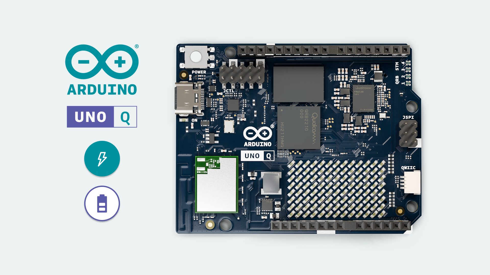
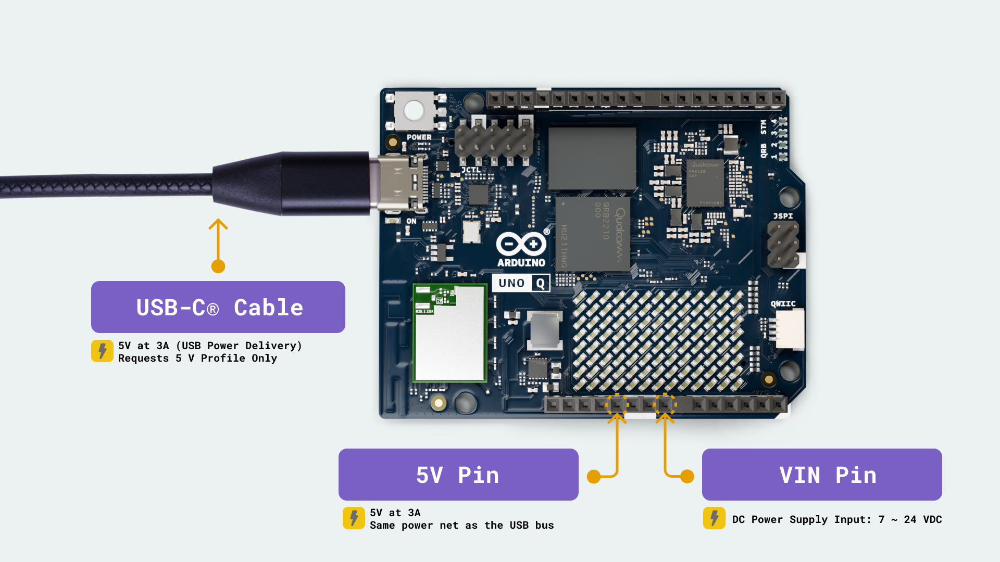
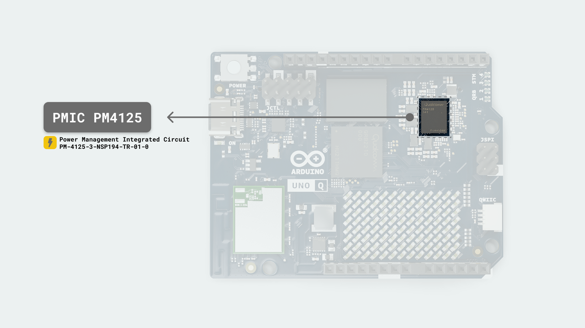
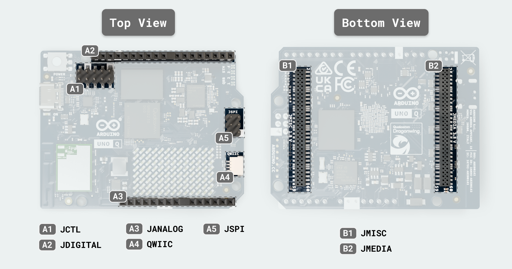
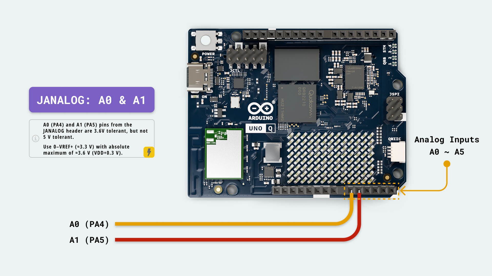
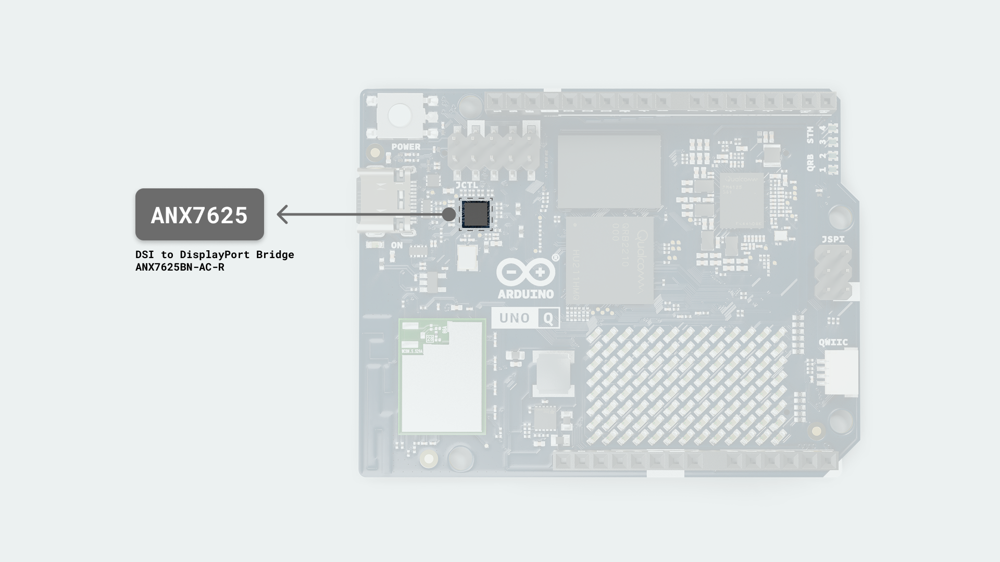
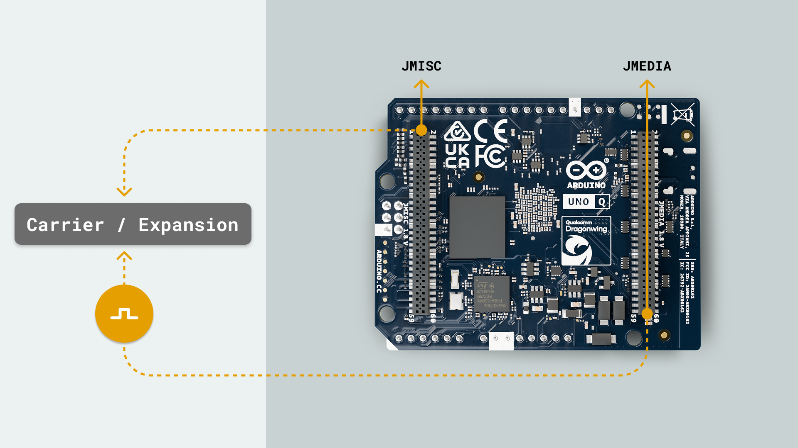

## Overview

This tutorial walks you through the power domain of UNO Q, with emphasis on the three main rails, 5 V, 3.3 V and 1.8 V. You will learn how the 5 V input gets accepted and diode-OR'd, converted into the 3.8 V pre-regulator node, and then regulated into the 3.3 V, and how the PMIC generates all the other power rails from the 5V input, including the 1.8V rail.
We will also cover the components that convert, protect and route these rails, including the safe voltage and pin-level limits you need to know.

## Goals

- Understand the board's input-voltage range and current needs.  
- See how the board merges the USB-C and DC inputs into one 5 V bus and then converts it to the 3.8 V pre-regulator stage.
- Learn how the 5 V, 3.3 V and 1.8 V rails are generated and used.  
- Know the safe electrical limits for rails and I/O pins.

## Power Tree Architecture

The UNO Q accepts a 5 V input over USB-C® or a 7–24 V input on DC input using the VIN pin (`DC_IN`), which is step-down converted to 5 V. These two sources are **diode-OR** combined into the system 5 V bus (`5V_SYS`).

From the 5 V system bus (`5V_SYS`), the board generates a 3.8 V pre-regulator node (`PWR_3P8V`). This node is the supply for the 3.3 V converter (`PWR_3P3V`). 
The PMIC also uses the 5V system bus  (`5V_SYS`) to produce the board's exported 1.8 V rail (VREG_L15A_1P8V) and the internal processor and memory rails. `PWR_3P8V`, that is connected to `VBAT`, is reserved for system design and future features. The USB VBUS back-drive path is sourced from the 5 V system bus (`5V_SYS`) and is separate from the PMIC input path.

The diagram below shows these rails and conversion points, using the same net names used throughout this tutorial.

## Power Specifications

This section outlines what the board expects as input and what it provides internally. Use these values when selecting supplies and budgeting external loads connected to the headers.

### Input Power

| **Source**  | **Voltage Range** | **Recommended Current** | **Connector**   |
|-------------|------------------:|------------------------:|-----------------|
| USB-C VBUS  |               5 V |                   ≥ 3 A | USB-C connector |
| VIN (DC IN) |         7  - 24 V |     Sized to 5 V budget | JMEDIA, JANALOG |

UNO Q supports dual power inputs: a USB-C port and a 7-24V DC input. Through USB Power Delivery negotiation, the board requests a **5 V / 3 A** contract only and does not request higher-voltage PD profiles. Use a supply and cable rated for 5 V at 3 A so short activity peaks, for example wireless bursts or display bring-up, do not cause connector droop.

`USB-C VBUS` and the 5 V output of the 7–24 V buck are **diode-OR'd** into the system 5 V bus (`5V_SYS`). The VIN (`DC IN`) path feeds a step-down converter to 5 V and its output goes through a Schottky rectifier to the same `5V_SYS` node. From `5V_SYS`, the board outputs the 3.8 V pre-regulator node and subsequently the **3.3 V** rail described below.
The PMIC also uses (`5V_SYS`) to produce the board's 1.8 V rail.

**Diode-OR'd** refers to connecting multiple power sources through diodes, which selects the higher voltage source while preventing reverse current flow.

***__Important:__ Use a stable **5 V / 3 A** source. If the supply current-limits during peaks, voltage hang may cause resets.***

#### USB-C Capabilities

The USB-C (JUSB1) port provides USB 3.1 with Role-Switching Capabilities and DisplayPort Alt-Mode video via the *ANX7625* DSI-to-DP bridge. The connector's SuperSpeed differential pairs are shared between DP Alt-Mode and USB 3.1 data. When DisplayPort Alt-Mode is active, USB data speed is reduced.

### Recommended Operating Conditions

Use the limits below to size power sources, define rail tolerances and plan thermal margin:

| **Parameter**         | **Symbol**  | **Minimum** | **Typical** | **Maximum** | **Unit** |
|-----------------------|:-----------:|:-----------:|:-----------:|:-----------:|:--------:|
| USB-C input           | `VBUS_USBC` |     4.5     |     5.0     |     5.5     |    V     |
| DC input (VIN)        |   `DC_IN`   |     7.0     |      -      |    24.0     |    V     |
| 3.3 V system rail     | `PWR_3P3V`  |     3.1     |     3.3     |     3.5     |    V     |
| Operating temperature |   `T_OP`    |     -10     |      -      |     60      |    °C    |

**Minimum** refers to the lowest continuous value required for regular operation. Brief dips can cause resets or link drops.

**Typical** is the nominal design point for planning.

**Maximum** must not be exceeded. For VIN (`DC_IN`) (7–24 V), use a supply that can cover the 5 V load with margin and keep cables short to reduce voltage drop. The `PWR_3P3V` range reflects regulator tolerance and load.

The temperature range refers to the air temperature around the board, and operating near the limits can reduce the available output current.

### On-Board Voltage Rails

Power conversion starts at the input, builds the `5V_SYS` system bus, then derives a 3.8 V pre-regulator node that supplies the 3.3 V system rail.
The PMIC also uses (`5V_SYS`) to produce the board's 1.8 V rail.

| **Voltage** | **Rail**         | **Origin / Regulator**                                              |
|------------:|------------------|---------------------------------------------------------------------|
|       5.0 V | `5V_SYS`         | Diode-OR of USB-C VBUS (Schottky) and 7–24 V buck output (Schottky) |
|       3.8 V | `PWR_3P8V`       | *TPS62A02A* step-down from `5V_SYS`                                 |
|       3.3 V | `PWR_3P3V`       | *TPS62A02A* step-down from `PWR_3P8V`                               |
|       1.8 V | `VREG_L15A_1P8V` | *PM4125* (power-management IC) LDO L15A                             |

#### 5V Rail (5V_SYS)

`5V_SYS` is the board's system 5 V bus. It feeds the two step-down converters, to 3.8 V and 3.3 V via the 3.8 V stage, and provides the path for USB VBUS back-drive when the board works as a host/OTG.

A P-channel MOSFET switches that back-drive path. Its enable is gated, so `VBUS` is not driven unless rails are valid. On headers, it appears as `VBUS_USBC`, and it is a 5 V bus.

#### 3V8 Rail (PWR_3P8V)

`PWR_3P8V` is the intermediate rail produced by the step-down converter *TPS62A02APDDCR* for 5 V to 3.8 V. It supplies the 3.3 V step-down converter.
This voltage rail is reserved for system design and future features.

#### 3V3 Rail (PWR_3P3V)

`PWR_3P3V` is the main board rail for general purpose logic and peripherals.

It powers the *STM32U585* microcontroller domains (`VDD`, `VDDA`, `VDDUSB`, `VREF+`), the *ANX7625* DSI-to-DisplayPort bridge 3.3 V domain (`AVDD33`, `VDDIO_3V3`), the 3.3 V side of the level shifters (`VCCB`), on-board 3.3 V devices and the exported 3.3 V pins on the **JANALOG**, **JDIGITAL** and **JMISC** headers and **QWIIC** connector.

Inside the PMIC, there are additional 3.3 V LDO rails used by subsystems. For example, `VREG_L22A_3P3V` for radio/PA bias. These are different from the board's `PWR_3P3V` but are part of the 3.3 V domain.

#### 1V8 Rail (VREG_L15A_1P8V)

`VREG_L15A_1P8V` is the exported 1.8 V rail output by the PMIC. It supplies the Qualcomm Dragonwing™ QRB2210 I/O banks and high-speed interfaces that require 1.8 V, the ANX7625 DVDD18 domain, the 1.8 V side of the level shifters (`VCCA`), the Wi-Fi®/Bluetooth® digital I/O and any 1.8 V pins on the JMISC and JCTL headers.

***__Important:__ Keep 3.3 V signals out of this bank to avoid over-voltage on processor-level I/O.***

## PMIC PM4125 Domain

A **PMIC** is a power management integrated circuit. It creates and controls multiple power rails from an upstream supply. It provides buck step-down conversion and low-dropout (LDO) linear regulation, manages rail enable and sequencing, as well as status report. It also handles battery charging and protection. The UNO Q uses the **PM4125**.

The **PM4125** is the PMIC (Power-Management IC) of the UNO Q. It takes its main inputs (`5V_SYS`) and generates the processor and memory supplies using its buck converters and LDOs. The board's 1.8 V rail (`VREG_L15A_1P8V`) is produced by L15A and is exported. This rail feeds the Qualcomm Dragonwing™ QRB2210 I/O domain, ANX7625 `DVDD18`, Wi-Fi digital 1.8 V, and the level shifters `VCCA`.

Other PMIC rails supply the Qualcomm Dragonwing™ QRB2210 core, peripheral and PLL domains, LPDDR4X, such as `VDD2` about 1.1 V, `VDDQ` about 0.6 V, `VPP` 1.8 V, `VREF_DDR` about 0.6 V, and eMMC, where `VCC` is 3.3 V or 1.8 V depending on configuration, and `VCCQ` is 1.8 V. The integrated audio bias rails are reserved and are exposed only at test points.

The charger block monitors `USB_VBUS_IN` when `VBUS` is present and routes energy through `VSW_CHG` to `VPH_PWR` while sensing `VBAT`. `PWR_3P8V` and `VBAT` is reserved and connect for system use and future features. Sequencing ensures the 3.3 V rail is valid before the PMIC enables its 1.8 V I/O domain. During shutdown, the 1.8 V domain is removed before the 3.3 V domain to prevent back-powering.

## Key Power Components

This table maps each block in the power tree to its function. The table shows the designators and components, and the function of each component is explained below.

| **Ref. Designation** | **Component**                 |
|----------------------|-------------------------------|
| D2801, D2803         | SX34 Schottky diodes          |
| U2803                | LMR51440 buck converter       |
| U2801                | TPS62A02A step-down converter |
| U2802                | TPS62A02A step-down converter |
| U3004                | TPS7A2030 LDO regulator       |
| Q2801                | PJA3413 P-MOSFET              |
| Q2802                | MMBT3904 NPN transistor       |
| PMIC1               | PM-4125-3-NSP194-TR-01-0      |
| U3001              | ANX7625 DSI to DisplayPort bridge     |
| MCU1            | STM32U585 Microcontroller               |

**Schottky rectifiers (D2801 and D2803)** provide the diode-OR that combines the USB-C VBUS path and the 5 V output of the DC buck into the system bus `5V_SYS`.

**LMR51440 buck converter (U2803)** is the wide-input converter that steps 7–24 V down to 5 V. Its output `5V_BUCK_OUT` feeds the OR stage through `D2803`.

**TPS62A02A step-down converter (U2801)** outputs the 3.8 V pre-regulator node `PWR_3P8V` from `5V_SYS`. This node supplies 3.3 V converter. `VBAT` connects to this node for system use and future features.

**TPS62A02A step-down converter (U2802)** outputs the 3.3 V rail `PWR_3P3V` from `PWR_3P8V`. This rail powers the STM32U585 domains' `VDD`, `VDDA`, `VDDUSB`, and `VREF+`, The 3.3 V side of the level shifters (VCCB), on-board 3.3 V devices and the exported 3.3 V header pins.

**TPS7A2030 LDO regulator (U3004)** outputs the 3.0 V analog rail used by the ANX7625 (`AVD03P0V`) from `PWR_3P3V`.

**P-MOSFET (Q2801)** switches `5V_SYS` to `USB_VBUS_IN` for host or OTG back-drive. The enable line `USB_VBUS_ON_N` is gated, so `VBUS` is only driven when rails are valid. NPN (Q2802) provides that gating using `LDO1_PG`.

PMIC **PM4125** generates the internal processor and memory rails from `PWR_3P8V`, including `VREG_L15A_1P8V`, which is exported as the board 1.8 V rail.

**DSI to DisplayPort bridge ANX7625** uses `VDDIO_3V3` from `PWR_3P3V`, `DVDD18` from `VREG_L15A_1P8V`, and `AVD03P0V` from `U3004`. Its `VCONN_IN` and other control pins are shown in the power tree. It interfaces with the USB-C/PD circuit for Type-C role, orientation and DisplayPort Alt-Mode signaling.

Microcontroller **STM32U585** is powered from `PWR_3P3V` on pins `VDD`, `VDDA`, `VDDUSB`, and `VREF+`. Its 1.8 V bank `VDDIO2` is supplied by `VREG_L15A_1P8V` via the level-shifter.

***For more detailed information about the reference, please refer to the [UNO Q schematics here](https://docs.arduino.cc/resources/schematics/ABX00162-schematics.pdf).***

## Pin-Level Power Tolerances

UNO Q separates I/O banks by voltage to keep high-speed processor interfaces at 1.8 V while exposing 3.3 V pins on the maker headers.

| **Signal Bank**                     | **Nominal I/O** | **Absolute Maximum** |
|-------------------------------------|-----------------|----------------------|
| Processor I/O - JMEDIA, JMISC, JCTL | 1.8 V           | 2.1 V                |
| Maker I/O - JDIGITAL, JANALOG       | 3.3 V           | 3.6 V                |

Processor I/O on JMEDIA, JMISC, and JCTL is directly connected to the Qualcomm Dragonwing™ QRB2210 pins in the 1.8 V domain. Use only 1.8 V logic on these pins, with an absolute maximum of 2.1 V at the pin.

Maker I/O on JDIGITAL and JANALOG are 3.3 V pins referenced to `PWR_3P3V`. These banks are level-shifted where they cross into the processor's 1.8 V domain. The absolute maximum is 3.6 V.

***__Warning:__ do not drive 1.8 V banks with 3.3 V signals.***

### I/O Operating Voltages and Drive

MCU banks (JDIGITAL, JANALOG, QWIIC, JSPI) operate at **3.3 V**. Processor banks (JMEDIA, JMISC, JCTL) operate at **1.8 V**.

Per pin drive:
  - **JDIGITAL (MCU GPIO at 3.3 V):** Follow the STM32U585 electrical specifications. Plan loads according to the STM32U585 electrical limits and respect total current per port.
  - **JANALOG (A0/A1):** ADC inputs only. Do not source or sink DC current into these pins. Use a resistor divider for higher-voltage sensing and follow the notes in [*Analog Inputs*](#analog-inputs).
  - **JMEDIA (MIPI DSI/CSI at 1.8 V):** It carries high-speed MIPI DSI/CSI lanes (1.8 V domain) and is not general purpose I/O. Do not add pull-ups, pull-downs, or other loads as DC loads, and keep controlled impedance on carrier boards.

## Header Rails

The headers export following rails:

- **JCTL (A1)** carries processor control signals in the 1.8 V domain. Treat these as 1.8 V logic pins and do not drive them with 3.3 V. A +1.8 V reference (OUT) and GND are also present.

- **JDIGITAL (A2)** provides `PWR_3P3V (3.3 V)` for 3.3 V maker I/O alongside the MCU signal banks.

- **JANALOG (A3)** provides `PWR_3P3V (3.3 V)` and also carries `5V_USB_VBUS (5 V)` as a power pin.

- **QWIIC (A4)** is a 3.3 V I2C header powered by `PWR_3P3V (3.3 V)`.

- **JSPI (A5)** carries `5V_USB_VBUS (5 V)` on a dedicated pin for accessories that need a 5 V supply. The SPI signals themselves are in the 3.3 V bank. STM32U585 SPI pins are 5 V tolerant as inputs, while outputs drive 3.3 V.

- **JMISC (B1)** exports `PWR_3P3V (3.3 V)`, the board 1.8 V rail `VREG_L15A_1P8V (1.8 V)`, `5V_USB_VBUS (5 V)` and `VBAT (3.8 V)`. `VBAT` is reserved for system use.

- **JMEDIA (B2)** breaks out `PWR_3P3V (3.3 V)` and also brings out VIN (`DC_IN`) (7-24 V). Use `PWR_3P3V (3.3 V)` for 3.3 V peripherals on this connector. VIN (`DC_IN`) is the raw 7–24 V input and is not a logic rail.

`5V_USB_VBUS (5 V)` on these headers is a pass-through 5 V bus from the input path and the `VBUS` back-drive switch. It is a power pin only, not a logic level or ADC reference.

## Current Limits

Header power is shared with on-board loads. The available current on `5V_USB_VBUS` and `PWR_3P3V` depends on the input source, the regulators and the board's own consumption at the time. Plan external peripherals within the same rail budget and verify their performance under the expected load and temperature in your setup.

When sourcing power from the headers, use nearby `GND` pins for the return path. For higher loads, use multiple `GND` returns to reduce voltage drop and noise.

## USB-C VBUS Back-Drive

P-channel MOSFET (Q2801) connects the 5 V system bus (`5V_SYS`) to `USB_VBUS_IN` when the board operates as a USB host or as an OTG host. In USB terms, a **host** provides 5 V on `VBUS` to power a connected peripheral such as a hub, keyboard or display adapter. **OTG** means that the same USB-C port can operate as both a host and a device. When working as a host, the board must source `VBUS`, and when working as a device, it must not.

The switch turns on only when the active-low enable `USB_VBUS_ON_N` is pulled low. That enable is gated by NPN transistor (Q2802) together with `LDO1_PG`, so `VBUS` is not driven unless the rails are valid. The back-drive path provides a fixed 5 V on `VBUS` and is separate from the PMIC input path. It does not power the PMIC rails.

## Analog Inputs

**A0 (PA4)** and **A1 (PA5)** on **JANALOG** are direct *STM32U585* ADC inputs referenced to `VREF+` on the 3.3 V rail. *They are not 5 V tolerant.* Valid input range is 0 V to `VREF+`. Do not exceed `VDD + 0.3 V` at these pins, which is about 3.6 V. Above this level, the on-chip protection network clamps and injection current can flow, which can damage the device or corrupt measurements.

Use external conditioning like a divider or buffer for higher voltages. Note that some STM32U585 pads are 5 V tolerant in digital mode, but when configured for ADC or any analog function (such as *A2* through *A5*), they are not. Keep them within `VDD + 0.3 V`. For *A4*/*A5* when used as *I2C3 (PC1/PC0)*, use pull-ups to 3.3 V only.

To measure a 5 V signal, scale it down with a resistor divider so the ADC pin stays at or below `VREF+`. An example is 10 kΩ over 20 kΩ, which gives about 3.3 V when the source is 5 V. Place a 100 nF capacitor from the ADC pin to ground for anti-aliasing and noise reduction and add approximately 1 kΩ in series to limit the injection current. Keep the effective source impedance at or below 50 kΩ or increase the ADC sampling time.

The **JANALOG** header also provides `5V_USB_VBUS` and `PWR_3P3V` as power pins. These are for power only. Do not apply 5 V to `A0` or `A1`.

## ANX7625 (DSI to DisplayPort) Power

ANX7625 uses three board rails. The 3.3 V rail `PWR_3P3V` powers `AVDD33` and `VDDIO_3V3`. The 1.8 V rail `VREG_L15A_1P8V` powers `DVDD18`. A dedicated 3.0 V analog rail `AVD03P0V` is output from `PWR_3P3V` by TPS7A2030 LDO (U3004).

The device does not draw power from 5 V. It only senses `VBUS` and the Type-C configuration lines. `USB_VBUS_IN` is routed through a 0.2 Ω resistor to a local filtered node with 10 µF,  100 nF, and 1 nF capacitors to ground.

This is known as `VCONN_IN`. ANX7625 reads `VCONN_IN` through a divider made by a 39.2 kΩ resistor to the pin and a 5.6 kΩ resistor to ground. It also monitors `VBUS_DIV8` and connects to `USB_CC1_R_MUX` and `USB_CC2_R_MUX` for Type-C role and configuration, as well as to the SBU lines for DisplayPort AUX. This is a detection node only and is not the cable `VCONN` supply.

`VBUS` sourcing is handled by the P-channel MOSFET (Q2801) from `5V_SYS`.

## Power Sequencing

Sequencing ensures the 1.8 V domain (`VREG_L15A_1P8V`) never turns on before the 3.3 V system rail (`PWR_3P3V`), and shutdown happens in the reverse order. When `VIN` rises above approximately 4.3 V, conversion begins with a soft start of roughly 2 ms. After the 3.3 V rail (`PWR_3P3V`) stabilizes, the 1.8 V rail (`VREG_L15A_1P8V`) is enabled approximately 1 ms later. The Qualcomm Dragonwing™ QRB2210 then boots Linux system.

After about 20 seconds, it drives a ready or wake signal on the STM32U585. On power-down, the 1.8 V rail turns off before the 3.3 V rail. This order keeps high-speed interfaces in a known state and prevents back-powering paths.

## Carrier / Expansion Signal Integrity

JMISC and JMEDIA let you attach custom carriers or platforms. Power rails at 3.3 V (`PWR_3P3V`) and 1.8 V (`VREG_L15A_1P8V`) and general-purpose 3.3 V I/O typically do not degrade in the same way as high-speed links do, but it is a worthwhile consideration to budget for voltage drop and add decoupling on the carrier.

High-speed interfaces on these headers can be sensitive to the interconnect. **MIPI-DSI/CSI** on JMEDIA and the MCU's **PSSI** on JMISC can lose margin with added length, impedance discontinuities, stubs, or poor grounding.

Keep these runs short, use controlled-impedance routing on the carrier, maintain a continuous ground reference, and avoid adding components that load the lanes.

***Warning: Keep voltage domains separated. Do not drive 1.8 V banks with 3.3 V signals. If an interface needs to cross domains, use the appropriate level shifting rather than direct wiring.***

## Conclusion

In this tutorial, you learned how UNO Q accepts power from a USB-C 5 V or 7–24 V DC source on VIN (`DC_IN`), diode-ORs them into 5 V bus system `5V_SYS`, and derives 3.8 V (`PWR_3P8V`), 3.3 V (`PWR_3P3V`), and 1.8 V (`VREG_L15A_1P8V`). You also saw which parts generate and switch these rails, what each header exports, the I/O voltage limits and the sequencing that the board goes through.

With this, you can choose suitable supplies, budget loads for 3.3 V and 1.8 V, and verify bring-up by checking the rail order and header rails.
