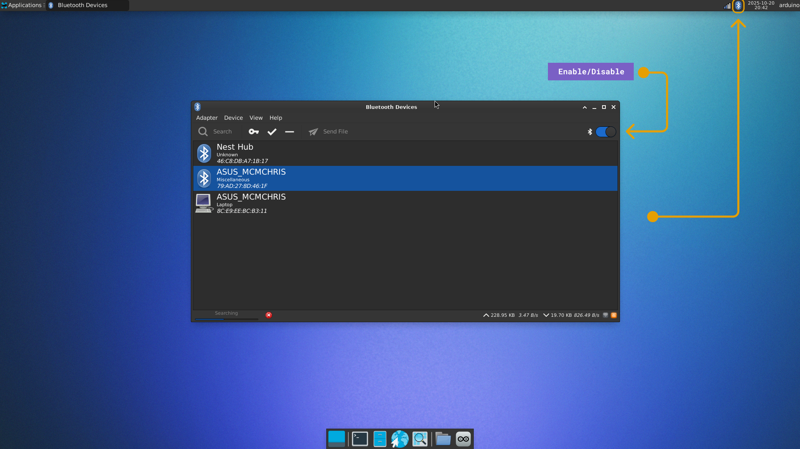

## Overview

This user manual will guide you through a practical journey covering the most interesting features of the Arduino UNO Q. With this user manual, you will learn how to set up, configure and use this Arduino board.


## Hardware and Software Requirements
### Hardware Requirements

- [UNO Q](https://store.arduino.cc/products/uno-q) (1x)
- [USB-C® cable](https://store.arduino.cc/products/usb-cable2in1-type-c) (1x)
- [USB-C multiport adapter (dongle) with external power delivery](https://store.arduino.cc/products/usb-c-to-hdmi-multiport-adapter-with-ethernet-and-usb-hub) (1x)

***You can use any USB-C dongle with external power delivery capabilities except for [Apple](https://www.apple.com/shop/product/MW5M3AM/A/usb-c-digital-av-multiport-adapter) ones.***

### Software Requirements

- [Arduino App Lab 0.1.23+](https://www.arduino.cc/en/software/#app-lab-section)

***You can still use the __Arduino IDE 2+__ to program only the microcontroller (MCU) side of your UNO Q.***

## Product Overview

The Arduino UNO Q unlocks a new level of performance for the Arduino ecosystem, blending robust computing power from Qualcomm’s advanced QRB2210 Microprocessor (MPU) running a full Debian Linux OS with upstream support, and the real-time responsiveness of a dedicated STM32U585 Microcontroller (MCU) running Arduino sketches over Zephyr OS — all on a single-board computer.

### Board Architecture Overview

The Arduino UNO Q blends the high-performance Qualcomm® QRB2210 MPU, running a full Linux environment, with the real-time precision of the STMicroelectronics® STM32U585 (32-bit Arm® Cortex®-M33) MCU, all on a single, compact board. This mixed architecture delivers the power and responsiveness needed for AIoT, machine learning, and advanced automation applications.


Here is an overview of the board’s main components, as shown in the image above:

- **Microprocessor**: The Qualcomm® QRB2210 is a quad-core Arm® Cortex®-A53 processor running at 2.0 GHz, equipped with an Adreno™ 702 GPU (845 MHz) for 3D graphics acceleration and dual ISPs supporting up to 25 MP at 30 fps. It runs Debian Linux OS with upstream support, making it well-suited for embedded vision and edge computing applications.
- **Microcontroller**: The STM32U585 microcontroller features an Arm® Cortex®-M33 core running up to 160 MHz, with 2 MB of flash memory and 786 KB of SRAM. It runs the Zephyr OS, providing a secure and efficient platform for low-power embedded applications.
- **Wireless Connectivity**: The WCBN3536A radio module provides dual-band Wi-Fi® 5 (2.4/5 GHz) and Bluetooth® 5.1 connectivity, both with onboard antennas for reliable wireless performance.
- **Memory**: The board features 16 GB or 32 GB options of eMMC storage and 2 GB or 4 GB options of LPDDR4 RAM, delivering fast memory access and reliable storage for embedded applications.
- **Multimedia Codec**: The ANX7625 multimedia codec enables video and audio output through the onboard USB-C connector, providing a high-speed interface for display and sound transmission in embedded applications.
- **Power Management**: The UNO Q includes the Qualcomm® PM4145, a power management integrated circuit (PMIC) to meet the demands of always-connected IoT devices.

### Pinout


The full pinout is available and downloadable as PDF from the link below:

- [UNO Q full pinout](https://docs.arduino.cc/resources/pinouts/ABX00162-full-pinout.pdf)

### Datasheet

The complete datasheet is available and downloadable as PDF from the link below:

- [UNO Q datasheet](https://docs.arduino.cc/resources/datasheets/ABX00162-datasheet.pdf)

### Schematics

The complete schematics are available and downloadable as PDF from the link below:

- [UNO Q schematics](https://docs.arduino.cc/resources/schematics/ABX00162-schematics.pdf)

### STEP Files

The complete STEP files are available and downloadable from the link below:

- [UNO Q STEP files](../../downloads/ABX00162-step.zip)

### Form Factor

The Arduino UNO Q features the classic UNO form factor, ensuring compatibility with the wide range of UNO shields developed by us and the community over time.


## First Use
### Powering the Board

The Arduino UNO Q can be powered by:

- A USB-C® cable providing 5 VDC 3 A (not included).
- An external +5 VDC power supply connected to 5V pin.
- An external +7-24 VDC power supply connected to VIN pin.


***Click [here](https://docs.arduino.cc/tutorials/uno-q/power-specification/) to learn more about the UNO Q power specifications.***

### Install Arduino App Lab

The [Arduino App Lab](https://docs.arduino.cc/software/app-lab/) is a unified development environment that extends the classic Arduino experience into the world of high-performance computing. Arduino App Lab lets you seamlessly combine Arduino sketches, Python scripts, and containerized Linux applications into a single workflow.

With code building blocks called Bricks, preconfigured AI models, and integrated orchestration, it reduces complexity while enabling you to create everything from simple prototypes to advanced, computation-intensive applications.


Arduino App Lab comes **pre-installed** on the UNO Q and can be used in Single-Board Computer (SBC) mode. We highly recommend the <strong>4 GB of RAM</strong> UNO Q variant for a better **standalone** experience.


To install it in your personal computer for a **PC Hosted** setup, go to the [software section](https://www.arduino.cc/en/software/#app-lab-section) on our official website, scroll to Arduino App Lab and select your OS’s respective variant.


#### Network Mode

Even when you have set up your Arduino UNO Q as a **single-board computer**, you can access it remotely from your personal machine by using the Arduino App Lab desktop and the **Network Mode**. Both modes can be used simultaneously.

- When you open Arduino App Lab, you will see your board listed with the "Network" tag.
- Click on it and enter the Linux password to log in.
- You will now have access to the board remotely.


With this method, you can access your UNO Q from any machine in your local network. This allows you to use Arduino App Lab as if you were connected directly to the board, where you can develop & run Apps in the same way as if it was connected via USB-C®.

### Hello World Example

Let’s program the UNO Q with the classic **Hello World** example typical of the Arduino ecosystem: the Blink sketch. We will use this example to verify that the board is correctly connected to the Arduino App Lab.

**Prerequisites:**

- Arduino UNO Q
- USB-C cable
- Computer with internet access (PC-hosted mode)
- Monitor, keyboard, mouse, and USB-C dongle (single-board computer mode)

- Connect the UNO Q to your PC (if you are not in single-board computer mode).
  
- Open the Arduino App Lab, it opens in the **Examples** section.
  
- Open the **Blink LED** example (Read the example documentation to understand how the App works).
- Click on the **Run** button in the top right corner and wait for the app to be uploaded.
  

You should now see the red LED of the built-in RGB LED turning on for one second, then off for one second, repeatedly.


***The LED controlled in this example is driven by the STM32 microcontroller through the Arduino sketch.***

### Arduino IDE (Beta)

The Arduino UNO Q is compatible with the standard Arduino IDE, allowing you to program the board using the familiar Arduino language and ecosystem.


***The Arduino UNO Q features a dual-processor architecture. The Arduino IDE targets and programs only the __UNO Q Microcontroller (STM32)__. If you wish to program the Qualcomm Microprocessor, please refer to the [Arduino App Lab section](#install-arduino-app-lab).***

#### Installing the UNO Q Core

To start using the board, you must first install the specific core that supports the UNO Q architecture (based on Zephyr).

1.  Open the Arduino IDE.
2.  Navigate to **Tools > Board > Boards Manager...** or click the **Boards Manager** icon in the left sidebar.
3.  In the search bar, type `UNO Q`.
4.  Locate the **Arduino UNO Q Zephyr Core** and click **Install**.


***<strong>Troubleshooting:</strong> If the core does not appear in the search results, you may need to add the package manually. Go to __File > Preferences__ and add the following link to the __Additional Boards Manager URLs__ field: `https://downloads.arduino.cc/packages/package_zephyr_index.json`***

#### Hello World (Blink)

Once the core is installed, you can verify that everything is working by uploading the classic Blink sketch.

1.  **Select the Board:** Go to **Tools > Board > Arduino UNO Q Board** and select **Arduino UNO Q**.
2.  **Select the Port:** Connect your board via USB-C. Go to **Tools > Port** and select the port corresponding to your UNO Q.
3.  **Open the Example:** Go to **File > Examples > 01.Basics > Blink**.
4.  **Upload:** Click the **Upload** button (right arrow icon) in the top toolbar.

The IDE will compile the sketch and upload it to the STM32 microcontroller. You should now see the red LED of the built-in RGB LED turning on for one second, then off for one second, repeatedly.


## Onboard User Interface

The Arduino UNO Q offers a wide range of user interfaces, making interaction intuitive and straightforward.

### LED Matrix

One of the board’s key features is an 8×13 blue LED matrix that is managed by the STM32 microcontroller of the UNO Q.


It is a versatile display you can use to show data, status indicators, icons, or even create simple animations and games.

Here is a list of basic examples for using the **LED matrix**. To test them, follow the steps below:

- Connect the UNO Q to your PC (if you are not in single-board computer mode).
  
- Open the Arduino App Lab, navigate to **My Apps** and click on **Create new app+**.
  
- A new App must be created to test each of the examples below.

#### Image Drawing

This example is for drawing **custom frames** in the LED matrix, specifically the Arduino logo.

You can copy and paste the following example into the "sketch" part of your new App in the Arduino App Lab.

```cpp
#include <Arduino_LED_Matrix.h>

uint8_t logo[104] = {
    0,0,0,0,0,0,0,0,0,0,0,0,0,
    0,0,1,1,1,0,0,0,1,1,1,0,0,
    0,1,0,0,0,1,0,1,0,0,0,1,0,
    1,0,0,0,0,0,1,0,0,1,0,0,1,
    1,0,1,1,1,0,1,0,1,1,1,0,1,
    1,0,0,0,0,0,1,0,0,1,0,0,1,
    0,1,0,0,0,1,0,1,0,0,0,1,0,
    0,0,1,1,1,0,0,0,1,1,1,0,0
};

Arduino_LED_Matrix matrix;

void setup() {
  matrix.begin();
  // display the image
  matrix.setGrayscaleBits(1);
  matrix.draw(logo);

}

void loop() {

}

```

It should look like this in the Arduino App Lab:


You can create your own frame by creating an array following the matrix format (8x13) with 1's and 0's as in the example from above:


Execute the App by clicking on the **Run** button in the Arduino App Lab and you should see the LED matrix showing your frame:


#### Dimmable LEDs

The LED matrix supports 8 levels of grayscale (3 bits) so you can manage the LED brightness individually.

You can set the brightness bits with the function `setGrayscaleBits(bits)` as shown below:

```cpp
matrix.setGrayscaleBits(3); // 3 bits result on 8 brightness levels (0 to 7)
```
As usual conversion tools to grayscale uses 256 levels (8 bits) so you can also use this range, and it will be automatically mapped.

```cpp
matrix.setGrayscaleBits(8); // 8 bits result on 256 brightness levels (0 to 255)
```

This example is for showing the **supported grayscale** in the LED matrix.

You can copy and paste the following example into the "sketch" part of your new App in the Arduino App Lab.

```cpp
#include <Arduino_LED_Matrix.h>

uint8_t shades[104] = {
    0,0,0,0,0,0,0,0,0,0,0,0,0,
    1,1,1,1,1,1,1,1,1,1,1,1,1,
    2,2,2,2,2,2,2,2,2,2,2,2,2,
    3,3,3,3,3,3,3,3,3,3,3,3,3,
    4,4,4,4,4,4,4,4,4,4,4,4,4,
    5,5,5,5,5,5,5,5,5,5,5,5,5,
    6,6,6,6,6,6,6,6,6,6,6,6,6,
    7,7,7,7,7,7,7,7,7,7,7,7,7
};

Arduino_LED_Matrix matrix;

void setup() {
  matrix.begin();
  // display the image
  matrix.setGrayscaleBits(3);
  matrix.draw(shades);

}

void loop() {

}
```

Execute the App by clicking on the **Run** button in the Arduino App Lab and you should see the LED matrix showing your frame:


### RGB LEDs
The UNO Q features 4x RGB LEDs. Two of them connected and controlled by the Qualcomm microprocessor, and the other two by the STM32 microcontroller.


#### MPU Controlled LEDs

LEDs #1 and #2 are controlled by the MPU.

There is a dedicated LED interface in our Linux OS for controlling these LEDs, they can be controlled via `/sys/class/leds` from the **Command Line**, using **SSH**, an **ADB** connection from your PC terminal or by using the Linux built-in terminal application when used in single-board computer mode:

```bash
echo 1    | tee /sys/class/leds/red:user/brightness   # set HIGH/ON
echo 0    | tee /sys/class/leds/red:user/brightness   # set LOW/OFF
```


The LED color segments are defined as follows:

**LED 1:**
- **Red:** `red:user`
- **Green:** `green:user`
- **Blue:** `blue:user`

**LED 2:**
- **Red:** `red:panic`
- **Green:** `green:wlan`
- **Blue:** `blue:bt`

***LED 2 is used to show system status: `PANIC`, `WLAN` and `BT`. But it can be controlled by the user.***

You can also control these LEDs from a Python script as follows. Remember to **create a new App** inside Arduino App Lab and then copy and paste the script below in the python section of your App:

```python
import time

LED1_R = "/sys/class/leds/red:user/brightness"
LED1_G = "/sys/class/leds/green:user/brightness"
LED1_B = "/sys/class/leds/blue:user/brightness"

LED2_R = "/sys/class/leds/red:panic/brightness"
LED2_G = "/sys/class/leds/green:wlan/brightness"
LED2_B = "/sys/class/leds/blue:bt/brightness"

def set_led_brightness(led_file, value):
    try:
        with open(led_file, "w") as f:
            f.write(f"{value}\n")
    except Exception as e:
        print(f"Error writing to {led_file}: {e}")

def main():
  # turn off all LEDs
  set_led_brightness(LED1_R, 0)
  set_led_brightness(LED1_G, 0)
  set_led_brightness(LED1_B, 0)
  set_led_brightness(LED2_R, 0)
  set_led_brightness(LED2_G, 0)
  set_led_brightness(LED2_B, 0)

  while True:
    #blink the LED 1 RED segment
    set_led_brightness(LED1_R, 1)
    time.sleep(1)
    set_led_brightness(LED1_R, 0)
    time.sleep(1)

if __name__ == "__main__":
    main()
```

#### MCU Controlled LEDs

LEDs #3 and #4 are controlled by the MCU.

They can be controlled by setting the state of their respective GPIOs using the `digitalWrite` function as usual.

To test them follow the steps below:

- Connect the UNO Q to your PC (if you are not in single-board computer mode).
- Open the Arduino App Lab, navigate to **My Apps** and click on **Create new app+**.

You can copy and paste the following example into the "sketch" part of your new App in the Arduino App Lab.

```cpp
void setup(){
  // Configure the pins as outputs
  pinMode(LED3_R, OUTPUT);
  pinMode(LED3_G, OUTPUT);
  pinMode(LED3_B, OUTPUT);
  // As they are active low, turn them OFF initially
  digitalWrite(LED3_R, HIGH);
  digitalWrite(LED3_G, HIGH);
  digitalWrite(LED3_B, HIGH);
}

void loop(){
  digitalWrite(LED3_R, LOW);  // Turn ON red segment
  digitalWrite(LED3_G, HIGH);
  digitalWrite(LED3_B, HIGH);
  delay(1000);
  digitalWrite(LED3_R, HIGH);
  digitalWrite(LED3_G, LOW);  // Turn ON green segment
  digitalWrite(LED3_B, HIGH);
  delay(1000);
  digitalWrite(LED3_R, HIGH);
  digitalWrite(LED3_G, HIGH);
  digitalWrite(LED3_B, LOW);  // Turn ON blue segment
  delay(1000);
}
```


The LED color segments are defined as follows:

**LED 3:**
- **Red:** `LED3_R`
- **Green:** `LED3_G`
- **Blue:** `LED3_B`

**LED 4:**
- **Red:** `LED4_R`
- **Green:** `LED4_G`
- **Blue:** `LED4_B`

***The RGB LEDs are active low, this means they turn ON with logic '0'.***

### Hardware Debug UART Interface

The UNO Q provides a dedicated low-level UART interface for debugging and system diagnostics. This interface connects directly to the SoC’s main console (TTY), allowing you to observe boot and kernel logs, troubleshoot system issues, or access a shell environment before network services like SSH or ADB are available.


This interface is available through the JCTL connector on the UNO Q. Refer to the [pinout](#pinout) section for details, and follow the wiring example above to access it.

***<strong>WARNING:</strong> This interface operates at __1.8 V logic__ levels and must be used with a compatible USB-to-TTL converter to avoid hardware damage.***

#### Prerequisites

- 1.8V USB to TTL converter (e.g., DSD Tech SH-U09C5)
- USB-C cable to power the UNO Q
- Serial Terminal (e.g., [Tera Term](https://teratermproject.github.io/index-en.html))

#### UART Parameters:

- **Baud rate:** 115200 bps
- **Logic level:** 1.8 V

This console provides access to low-level system messages printed by the bootloaders (e.g., SPL and U-Boot), which are not visible through SSH or other high-level interfaces. For example, it allows capturing logs related to power delivery negotiation or hardware initialization during early boot stages, providing information that is otherwise inaccessible.

It can be used to log in to the board and interact with the system through the shell. Use the **Linux credentials** configured during the board setup process to authenticate.


### Power Button

The UNO Q features a power button that can be used to reboot the board.


- **Long press**: the board’s Linux part is rebooted when the button is pressed for **5+** seconds.

***You do not need to press the power button for the board to power up, it boots automatically after being powered.***

## USB-C Connector

The UNO Q features a USB-C connector that can be used for much more than just programming and powering the board.


Below is a table with the main features of the USB-C connector that expands the UNO Q capabilities.

| Feature            | Description            |
| ------------------ | ---------------------- |
| USB Power (Sink)   | 5 VDC 3 A (15 W)       |
| USB Standard       | USB 3.1 Gen 1 (5 Gb/s) |
| Display over USB-C | DisplayPort            |

By using a USB-C dongle (adapter/hub) you can also leverage the following features:

| Feature      | Description                                 |
| ------------ | ------------------------------------------- |
| Video Output | HDMI support                                |
| Video Input  | USB camera support                          |
| Audio        | USB or 3.5mm headset (speaker + microphone) |
| Ethernet     | Internet through Ethernet supported         |
| HID          | USB keyboard/mouse and other HID devices    |
| Storage      | External microSD card or USB drive support  |

## Pins

The UNO Q is equipped with two connector types: the **classic UNO-style headers** on the top, designed for prototyping and debugging, guaranteeing full compatibility with Arduino UNO Shields, and the **high-speed header connectors** on the bottom, purpose-built for integration with UNO Q carriers.


### Digital Pins

The UNO Q has 47x digital pins controlled by the **STM32 microcontroller**, 22x of them exposed through the UNO-styled connector and 25x exposed through JMISC connector mapped as follows:

| Microcontroller Pin | Arduino Pin Mapping |    Pin Functionality    |
| :-----------------: | :-----------------: | :---------------------: |
|         PB7         |       D0 / RX       |     GPIO / UART RX      |
|         PB6         |       D1 / TX       |     GPIO / UART TX      |
|         PB3         |         D2          |          GPIO           |
|         PB0         |         D3          |    GPIO / OPAMP OUT     |
|        PA12         |   D4 / FDCAN1_TX    |    GPIO / CAN Bus TX    |
|        PA11         |   D5 / FDCAN1_RX    |    GPIO / CAN Bus RX    |
|         PB1         |         D6          |          GPIO           |
|         PB2         |         D7          |          GPIO           |
|         PB4         |         D8          |          GPIO           |
|         PB8         |         D9          |          GPIO           |
|         PB9         |      D10 / SS       |      GPIO / SPI SS      |
|        PB15         |     D11 / MOSI      |     GPIO / SPI MOSI     |
|        PB14         |     D12 / MISO      |     GPIO / SPI MISO     |
|        PB13         |      D13 / SCK      |     GPIO / SPI SCK      |
|         PA4         |     D14 / DAC0      |    GPIO / ADC / DAC     |
|         PA5         |     D15 / DAC1      |    GPIO / ADC / DAC     |
|         PA6         |         D16         | GPIO / ADC / OPAMP IN + |
|         PA7         |         D17         | GPIO / ADC / OPAMP IN - |
|         PC1         |     D18 / SDA2      |  GPIO / ADC / I2C SDA   |
|         PC0         |     D19 / SCL2      |  GPIO / ADC / I2C SCL   |
|        PB11         |      D20 / SDA      |     GPIO / I2C SDA      |
|        PB10         |      D21 / SCL      |     GPIO / I2C SCL      |

***Notice that pins D14 to D19 also have analog capabilities.***

The digital pins of the UNO Q can be used as inputs or outputs through the built-in functions of the Arduino programming language.

The configuration of a digital pin is done in the `setup()` function with the built-in function `pinMode()` as shown below:

```cpp
// Pin configured as an input
pinMode(pin, INPUT);
// Pin configured as an output
pinMode(pin, OUTPUT);
// Pin configured as an input, internal pull-up resistor enabled
pinMode(pin, INPUT_PULLUP);
```
The state of a digital pin, configured as an input, can be read using the built-in function `digitalRead()` as shown below:

```cpp
// Read pin state, store value in a state variable
state = digitalRead(pin);
```

The state of a digital pin, configured as an output, can be changed using the built-in function `digitalWrite()` as shown below:

```cpp
// Set pin on
digitalWrite(pin, HIGH);
// Set pin off
digitalWrite(pin, LOW);
```

The example code shown below uses digital pin `D5` to control an LED and reads the state of a button connected to digital pin `D4`:


Create a new App in the Arduino App Lab, then copy and paste the example below in the "sketch" part of your new App.


```cpp
#include <Arduino_RouterBridge.h>
// Define button and LED pin
int buttonPin = D4;
int ledPin = D5;

// Variable to store the button state
int buttonState = 0;

void setup() {
  // Configure button and LED pins
  pinMode(buttonPin, INPUT_PULLUP);
  pinMode(ledPin, OUTPUT);

  // Initialize Serial communication
  Monitor.begin();
}

void loop() {
  // Read the state of the button
  buttonState = digitalRead(buttonPin);

  // If the button is pressed, turn on the LED and print its state to the Serial Monitor
  if (buttonState == LOW) {
    digitalWrite(ledPin, HIGH);
    Monitor.println("- Button is pressed. LED is on.");
  } else {
    // If the button is not pressed, turn off the LED and print to the Serial Monitor
    digitalWrite(ledPin, LOW);
    Monitor.println("- Button is not pressed. LED is off.");
  }

  // Wait for 1000 milliseconds
  delay(1000);
}
```

### Analog Pins

The UNO Q features the well-known analog pins in the **JANALOG** connector; more details below:

#### Analog to Digital Converter (ADC)

In the **JANALOG** connector the UNO Q has 6x 14-bit ADC pins mapped as follows:

| Microcontroller Pin | Arduino Pin Mapping |    Pin Functionality    |
| :-----------------: | :-----------------: | :---------------------: |
|         PA4         |         A0          |    GPIO / ADC / DAC     |
|         PA5         |         A1          |    GPIO / ADC / DAC     |
|         PA6         |         A2          | GPIO / ADC / OPAMP IN + |
|         PA7         |         A3          | GPIO / ADC / OPAMP IN - |
|         PC1         |         A4          |  GPIO / ADC / I2C SDA   |
|         PC0         |         A5          |  GPIO / ADC / I2C SCL   |

Analog input pins can be used through the built-in functions of the Arduino programming language.

The UNO Q ADC **resolution** can be configured between 14, 12, 10, or 8 bits by using the `analogReadResolution(bits)` function:

```cpp
  // ADC resolution set to 14-bit (0 to 16383)
  analogReadResolution(14);
```

The default ADC **voltage reference** is 3.3V and can be changed by software using the function `analogReference()` with the following arguments:

| Analog Voltage Reference (V<sub>REF+</sub>) |    Argument     |  Source  |
| :-----------------------------------------: | :-------------: | :------: |
|                    1.5 V                    | AR_INTERNAL1V5  | Internal |
|                    1.8 V                    | AR_INTERNAL1V8  | Internal |
|                   2.048 V                   | AR_INTERNAL2V05 | Internal |
|                    2.5 V                    | AR_INTERNAL2V5  | Internal |
|                  2 V ~ VDD                  |   AR_EXTERNAL   | External |

***An external voltage reference can be provided through the <strong>AREF</strong> pin when `AR_EXTERNAL` reference is used.***

To set a different analog reference from the default one, see the following example:

```cpp
analogReference(AR_INTERNAL2V5);
```

The example code shown below reads the analog input value from a potentiometer connected to `A0` and displays it on the Serial Monitor. To understand how to properly connect a potentiometer to the UNO Q, take the following image as a reference:


Create a new App in the Arduino App Lab, then copy and paste the example below in the "sketch" part of your new App.


```cpp
#include <Arduino_RouterBridge.h>

int sensorPin = A0;   // select the input pin for the potentiometer

int sensorValue = 0;  // variable to store the value coming from the sensor

void setup() {
  Monitor.begin();
}

void loop() {
  // read the value from the sensor:
  sensorValue = analogRead(sensorPin);

  Monitor.println(sensorValue);
  delay(100);
}
```
#### Digital to Analog Converter (DAC)

The UNO Q has two DAC outputs, mapped as follows:

| Microcontroller Pin | Arduino Pin Mapping | Pin Functionality |
| :-----------------: | :-----------------: | :---------------: |
|         PA4         |        DAC0         | GPIO / ADC / DAC  |
|         PA5         |        DAC1         | GPIO / ADC / DAC  |

The digital-to-analog converters of the UNO Q can be used to output analog voltages through the built-in functions of the Arduino programming language.

The DAC output resolution can be configured from 8 to 12 bits using the `analogWriteResolution()` function as follows:

```cpp
// DAC resolution set to 12-bit (0 to 4095)
analogWriteResolution(12);  // enter the desired resolution in bits (8, 10, 12)
```

To output an analog voltage value through a DAC pin, use the `analogWrite()` function with the DAC channel as an argument. See the example below:

```cpp
analogWrite(DAC0, value);   // the value should be in the range of the DAC resolution (e.g. 0-4095 with a 12 bits resolution)
```
***If a normal GPIO is passed to the `analogWrite()` function, the output will be a PWM signal.***

The following sketch will create a **60 Hz sine wave** signal in the `A0/DAC0` UNO Q pin:

Create a new App in the Arduino App Lab, then copy and paste the example below in the "sketch" part of your new App.


```cpp
const float freq = 60.0f;
const int   N    = 256;     // 256 samples/cycle
const uint32_t Ts_us = (uint32_t)llroundf(1e6f / (freq * N));

uint16_t lut[N]; // store the sine wave here

void setup() {
  analogWriteResolution(12);

  for (int i = 0; i < N; ++i){
      lut[i] = 2048 + (1000.0 * sin(2 * PI * i / N));
  }

}

void loop() {
  static uint32_t t_next = micros();
  for (int i = 0; i < N; ++i) {
    analogWrite(DAC0, lut[i]);  // output the sine wave values
    t_next += Ts_us;
    while ((int32_t)(micros() - t_next) < 0) { /* spin */ }
  }
}

```

The DAC output should look like the image below:


### PWM Pins

The UNO Q has 6x PWM (Pulse Width Modulation) pins, mapped as follows:

| Microcontroller Pin | Arduino Pin Mapping |    Pin Functionality    |
| :-----------------: | :-----------------: | :---------------------: |
|         PB0         |         D3          | GPIO / OPAMP OUT / PWM  |
|        PA11         |   D5 / FDCAN1_RX    | GPIO / CAN Bus RX / PWM |
|         PB1         |         D6          |       GPIO / PWM        |
|         PB8         |         D9          |       GPIO / PWM        |
|         PB9         |      D10 / SS       |   GPIO / SPI SS / PWM   |
|        PB15         |     D11 / MOSI      |  GPIO / SPI MOSI / PWM  |

This functionality can be used with the built-in function `analogWrite()` as shown below:

```cpp
analogWrite(pin, value);
```
By default, the output resolution is **8 bits**, so the output value should be between 0 and 255. To set a greater resolution, do it using the built-in function `analogWriteResolution` as shown below:

```cpp
// PWM resolution set to 10-bit (0 to 4095)
analogWriteResolution(10);
```

Here is an example of how to create a variable duty-cycle PWM signal:

Create a new App in the Arduino App Lab, then copy and paste the example below in the "sketch" part of your new App.


```cpp
const int analogInPin = A0;  // Analog input pin that the potentiometer is attached to
const int pwmOutPin = D3;    // PWM output pin

int sensorValue = 0;  // value read from the pot
int outputValue = 0;  // value output to the PWM (analog out)

void setup() {
  // Define the PWM output resolution
  analogWriteResolution(10);  // 0 - 1023 -> 0 - 100% duty-cycle
  analogReadResolution(14);   // 0 - 16383
}

void loop() {
  // read the analog in value:
  sensorValue = analogRead(analogInPin);
  // map it to the range of the analog out:
  outputValue = map(sensorValue, 0, 16383, 0, 1024);
  // change the analog out value:
  analogWrite(pwmOutPin, outputValue);

  // wait 2 milliseconds before the next loop for the ADC
  // to settle after the last reading:
  delay(2);
}
```

Now you can control the PWM signal duty-cycle by turning the potentiometer.


***PWM frequency is fixed to 500 Hz.***

## Communication

This section of the user manual covers the different communication protocols that are supported by the Arduino UNO Q.

### Bridge - Remote Procedure Call (RPC) Library

The Arduino UNO Q uses RPC (Remote Procedure Call) to exchange data between the Linux (Qualcomm MPU) side and the real-time STM32 MCU. This mechanism allows functions running on one processor to be invoked transparently from the other, as if they were local calls.


#### Overview

The `Bridge` library provides a communication layer built on top of the `Arduino_RPClite` framework. It manages bidirectional RPC traffic between the MPU and MCU, handling method binding, request forwarding, and asynchronous responses.

- **MPU side (Qualcomm QRB, Linux)**: Runs higher-level services and can remotely invoke MCU functions.
- **MCU side (STM32, Zephyr RTOS)**: Handles time-critical tasks and exposes functions to the MPU via RPC.

#### The Arduino Router (Infrastructure)

Under the hood, the communication is managed by a background Linux service called the **Arduino Router** (`arduino-router`).

While the `Bridge` library is what you use in your code, the Router is the traffic controller that makes it possible. It implements a **Star Topology** network using MessagePack RPC.

**Key Features:**

- **Multipoint Communication:** Unlike simple serial communication (which is typically point-to-point), the Router allows multiple Linux processes to communicate with the MCU simultaneously (and with each other).

  **Linux ↔ MCU:** Multiple Linux processes can interact with the MCU simultaneously (e.g., a Python® script reading sensors while a separate C++ application commands motors).

  **Linux ↔ Linux:** You can use the Router to bridge different applications running on the MPU. For example, a Python script can expose an RPC function that another Python® or C++ application calls directly, allowing services to exchange data without involving the MCU at all.

- **Service Discovery:** Clients (like your Python® script or the MCU Sketch) "register" functions they want to expose. The Router keeps a directory of these functions and routes calls to the correct destination.

**Source Code:**

- **[Arduino Router Service](https://github.com/arduino/arduino-router)**
- **[Arduino_RouterBridge Library](https://github.com/arduino-libraries/Arduino_RouterBridge/tree/main)**

#### System Configuration & Hardware Interfaces

The Router manages the physical connection between the two processors. It is important to know which hardware resources are claimed by the Router to avoid conflicts in your own applications.

* **Linux Side (MPU):** The router claims the serial device `/dev/ttyHS1`.
* **MCU Side (STM32):** The router claims the hardware serial port `Serial1`.

> **⚠️ WARNING: Reserved Resources**
> Do not attempt to open `/dev/ttyHS1` (on Linux) or `Serial1` (on Arduino/Zephyr) in your own code. These interfaces are exclusively locked by the `arduino-router` service. Attempting to access them directly will cause the Bridge to fail.

#### Managing the Router Service

The arduino-router runs automatically as a system service. In most cases, you do not need to interact with it directly. However, if you are debugging advanced issues or need to restart the communication stack, you can control it via the Linux terminal:

**Check Status** To see if the router is running and connected:
```bash
systemctl status arduino-router
```
**Restart the Service** If the communication seems stuck, you can restart the router without rebooting the board:
```bash
sudo systemctl restart arduino-router
```
**View Logs** To view the real-time logs for debugging (e.g., to see if RPC messages are being rejected or if a client has disconnected):
```bash
journalctl -u arduino-router -f
```

To capture more detailed information in the logs, you can append the `--verbose` argument to the systemd service configuration.

- Open the service file for editing:
  ```bash
  sudo nano /etc/systemd/system/arduino-router.service
  ```

- Locate the line beginning with `ExecStart=` and append `--verbose` to the end of the command. The updated service file should look like this:

  ```bash
  [Unit]
  Description=Arduino Router Service
  After=network-online.target
  Wants=network-online.target
  Requires=

  [Service]
  # Put the micro in a ready state.
  ExecStartPre=-/usr/bin/gpioset -c /dev/gpiochip1 -t0 37=0
  ExecStart=/usr/bin/arduino-router --unix-port /var/run/arduino-router.sock --serial-port /dev/ttyHS1 --serial-baudrate 115200 --verbose # <--- ADD THIS
  # End the boot animation after the router is started.
  ExecStartPost=/usr/bin/gpioset -c /dev/gpiochip1 -t0 70=1
  StandardOutput=journal
  StandardError=journal
  Restart=always
  RestartSec=3

  [Install]
  WantedBy=multi-user.target
  ```

- You must reload the systemd daemon for the configuration changes to take effect.

  ```bash
  sudo systemctl daemon-reload
  ```

- Restart the Router:
  
  ```bash
  sudo systemctl restart arduino-router
  ```

- View the verbose logs:
  
  ```bash
  journalctl -u arduino-router -f
  ```

#### Core Components

`BridgeClass` The main class managing RPC clients and servers.
- `begin()`: Initializes the bridge and the internal serial transport.
- `call(method, args...)`: Invokes a function on the Linux side and waits for a result.
- `notify(method, args...)`: Invokes a function on the Linux side without waiting for a response (fire-and-forget).
- `provide(name, function)`: Exposes a local MCU function to Linux. Note: The function executes in the high-priority background RPC thread. Keep these functions short and thread-safe.
- `provide_safe(name, function)`: Exposes a local MCU function, but ensures it executes within the main `loop()` context. Use this if your function interacts with standard Arduino APIs (like `digitalWrite` or `Serial`) to avoid concurrency crashes.

***__Warning:__ Do not use `Bridge.call()` or `Monitor.print()` inside `provide()` functions. Initiating a new communication while responding to one causes system deadlocks.***

`RpcCall`
- Helper class representing an asynchronous RPC. If its `.result` method is invoked, it waits for the response, extracts the return value, and propagates error codes if needed.

`Monitor` 
- The library includes a pre-defined Monitor object. This allows the Linux side to send text streams to the MCU (acting like a virtual Serial Monitor) via the RPC method mon/write.

**Threading and Safety**
- The bridge uses Zephyr mutexes (`k_mutex`) to guarantee safe concurrent access when reading/writing over the transport. Updates are handled by a background thread that continuously polls for requests.
- **Incoming Updates**: Handled by a dedicated background thread (`updateEntryPoint`) that continuously polls for requests.
- **Safe Execution**: The provide_safe mechanism hooks into the main loop (`__loopHook`) to execute user callbacks safely when the processor is idle.

#### Usage Example (Arduino App Lab)

This example shows the **Linux side (Qualcomm QRB)** toggling an LED on the **MCU (STM32)** by calling a remote function over the Bridge.

Create a new App in the Arduino App Lab, then copy and paste the example below in the "Python" and "sketch" parts of your new App respectively.


1. **Linux (QRB) example to call a remote MCU function**

    This Python script runs on the QRB and calls an MCU-exposed RPC named `set_led_state` once per second:

    ```python
    # main.py (QRB side)
    from arduino.app_utils import *
    import time

    led_state = False

    def loop():
        global led_state
        time.sleep(1)
        led_state = not led_state
        Bridge.call("set_led_state", led_state)

    App.run(user_loop=loop)
    ```
    This sends a boolean to the MCU every second using `Bridge.call("set_led_state", <bool>)`

2. **MCU (STM32) setup to include the Bridge and start it**

    This sketch includes the Bridge library and configures the LED pin.

    ```cpp
    #include "Arduino_RouterBridge.h"

    void setup() {
        pinMode(LED_BUILTIN, OUTPUT);

        Bridge.begin();
        Bridge.provide("set_led_state", set_led_state);
    }

    void loop() {
    }

    void set_led_state(bool state) {
        // LOW state means LED is ON
        digitalWrite(LED_BUILTIN, state ? LOW : HIGH);
    }
    ```
    This registers the local MCU function `set_led_state` as an RPC service named `"set_led_state"`, so that the Linux (QRB) side can call it remotely as if it were a local function using `Bridge.provide("set_led_state", set_led_state);`

***You can do the same the other way around, Python functions can be provided to the MCU sketch to be used locally.***

After pasting the Python script into your App’s Python file and the Arduino code to the sketch, you can run the App and observe LED #3 blinking in red every second.


***There are more advanced methods in the Bridge RPC library that you can discover by testing our different built-in examples inside Arduino App Lab.***

#### Interacting via Unix Socket (Advanced)

Linux processes communicate with the Router using a **Unix Domain Socket** located at:
`/var/run/arduino-router.sock`

While the `Bridge` library handles this automatically for you, you can manually connect to this socket to interact with the MCU or other Linux services using any language that supports **MessagePack RPC** (e.g., Python, C++, Rust, Go).

#### Usage Example (Custom Python Client)

The following example demonstrates how to control an MCU function (`set_led_state`) from a standard Python script using the `msgpack` library, without using the Arduino App Lab helper classes. This is useful for integrating Arduino functions into existing Linux applications.

**Prerequisites:**

1. **Flash the MCU Sketch**
   
   Upload the following code using the Arduino IDE or Arduino App Lab. This registers the function we want to call.

    ```cpp
    #include "Arduino_RouterBridge.h"

    void setup() {
      pinMode(LED_BUILTIN, OUTPUT);

      Bridge.begin();
      // We use provide_safe to ensure the hardware call runs in the main loop context
      Bridge.provide_safe("set_led_state", set_led_state);
    }

    void loop() {
    }

    void set_led_state(bool state) {
      digitalWrite(LED_BUILTIN, state ? LOW : HIGH);
    }
    ```
2. **Install the Python Dependency** 
   
    Install the msgpack library using the system package manager:

    ```bash
    sudo apt install python3-msgpack
    ```
3. **Create the Python Script** 
   
   Create a new file named msgpack_test.py:

    ```bash
    nano msgpack_test.py
    ```
4. **Add the Script Content**
  
   Copy and paste the following code. This script connects manually to the Router's Unix socket and sends a raw RPC request.
  
    ```python
    import socket
    import msgpack
    import sys

    # 1. Define the connection to the Router's Unix Socket
    SOCKET_PATH = "/var/run/arduino-router.sock"

    # 2. Parse command line arguments
    # Default to turning LED ON (True) if no argument is provided
    led_state = True 

    if len(sys.argv) > 1:
        arg = sys.argv[1]
        if arg == "1":
            led_state = True
        elif arg == "0":
            led_state = False
        else:
            print("Usage: python3 msgpack_test.py [1|0]")
            sys.exit(1)

    print(f"Sending request to set LED: {led_state}")

    # 3. Create the MessagePack RPC Request
    # Format: [type=0 (Request), msgid=1, method="set_led_state", params=[led_state]]
    request = [0, 1, "set_led_state", [led_state]]
    packed_req = msgpack.packb(request)

    # 4. Send the request
    try:
        with socket.socket(socket.AF_UNIX, socket.SOCK_STREAM) as client:
            client.connect(SOCKET_PATH)
            client.sendall(packed_req)
            
            # 5. Receive the response
            response_data = client.recv(1024)
            response = msgpack.unpackb(response_data)
            
            # Response Format: [type=1 (Response), msgid=1, error=None, result=None]
            print(f"Router Response: {response}")
            
    except Exception as e:
        print(f"Connection failed: {e}")
    ```

**Running the Example**

You can now test the connection by running the script from the terminal and passing `1` (ON) or `0` (OFF):

```bash
python3 msgpack_test.py 1 # to turn on the LED
# or
python3 msgpack_test.py 0 # to turn off the LED
```


### SPI

The UNO Q supports SPI communication, which allows data transmission between the board and other SPI-compatible devices.

The pins used in the UNO Q for the SPI communication protocol are the following:

| **Microcontroller Pin** | **Arduino Pin Mapping** |
| :---------------------: | :---------------------: |
|           PB9           |        SS / D10         |
|          PB15           |       MOSI / D11        |
|          PB14           |       MISO / D12        |
|          PB13           |        SCK / D13        |

Please, refer to the [board pinout section](#pinout) of the user manual to locate them on the board.

Include the `SPI` library at the top of your sketch to use the SPI communication protocol. The SPI library provides functions for SPI communication:

```cpp
#include <SPI.h>
```

In the `setup()` function, initialize the SPI library, define and configure the chip select (`SS`) pin:

```cpp
#define SS D10

void setup() {
  // Set the chip select pin as output
  pinMode(SS, OUTPUT);

  // Pull the SS pin HIGH to unselect the device
  digitalWrite(SS, HIGH);

  // Initialize the SPI communication
  SPI.begin();
}
```

To transmit data to an SPI-compatible device, you can use the commands used in the following example:

Create a new App in the Arduino App Lab, then copy and paste the example below in the "sketch" part of your new App.


```cpp
#include <SPI.h>

#define SS D10

void setup() {
  // Set the chip select pin as output
  pinMode(SS, OUTPUT);

  // Pull the SS pin HIGH to unselect the device
  digitalWrite(SS, HIGH);

  // Initialize the SPI communication
  SPI.begin();
}

void loop() {
  // Replace with the target device’s address
  byte address = 0x35;
  // Replace with the value to send
  byte value = 0xFA;
  // Pull the SS pin LOW to select the device
  digitalWrite(SS, LOW);
  // Send the address
  SPI.transfer(address);
  // Send the value
  SPI.transfer(value);
  // Pull the SS pin HIGH to unselect the device
  digitalWrite(SS, HIGH);

  delay(2000);
}
```

The example code above should output this:


### I2C

The UNO Q supports I2C communication, which allows data transmission between the board and other I2C-compatible devices. The pins used in the UNO Q for the I2C communication protocol are the following:

| **Microcontroller Pin** | **Arduino Pin Mapping (Wire)** | **Microcontroller Pin** | **Arduino Pin Mapping (Wire1)** |
| :---------------------: | :----------------------------: | :---------------------: | :-----------------------------: |
|          PB10           |           SCL / D21            |          PD12           |        I2C4_SCL (Qwiic)         |
|          PB11           |           SDA / D20            |          PD13           |        I2C4_SDA (Qwiic)         |

Please, refer to the [board pinout section](#pinout) of the user manual to locate them on the board.

To use I2C communication, include the `Wire` library at the top of your sketch. The `Wire` library provides functions for I2C communication:

```cpp
#include <Wire.h>
```

In the `setup()` function, initialize the I2C library:

```cpp
// Initialize the I2C communication
Wire.begin(); // I2C in UNO-style headers (D20, D21)
// or
Wire1.begin(); // I2C in Qwiic connector
```

To transmit data to an I2C-compatible device, you can use the commands used in the following example:

Create a new App in the Arduino App Lab, then copy and paste the example below in the "sketch" part of your new App.


```cpp
#include <Wire.h>

void setup() {
  // Initialize the I2C communication
  Wire.begin();
}

void loop() {
  // Replace with the target device’s I2C address
  byte deviceAddress = 0x35;
  // Replace with the appropriate instruction byte
  byte instruction = 0x00;
  // Replace with the value to send
  byte value = 0xFA;
  // Begin transmission to the target device
  Wire.beginTransmission(deviceAddress);
  // Send the instruction byte
  Wire.write(instruction);
  // Send the value
  Wire.write(value);
  // End transmission
  Wire.endTransmission();

  delay(2000);
}
```
The example code above should output this:


#### Qwiic

The Arduino UNO Q features an onboard Qwiic connector that provides a simple, tool-free solution for connecting I²C devices. The Qwiic ecosystem, developed by SparkFun Electronics, has become an industry standard for rapid prototyping with I²C devices, allowing you to connect sensors, displays, and other peripherals without soldering or complex wiring.


The Qwiic system’s key advantages include:

- **Plug-and-play connectivity**: No breadboards, jumper wires, or soldering required
- **Polarized connectors**: Prevents accidental reverse connections
- **Daisy-chain capability**: Connect multiple devices in series
- **Built-in pull-up resistors**: No external resistors needed
- **Standard pinout**: Compatible across all Qwiic ecosystem devices

***The Qwiic connector on the UNO Q is connected to the secondary I2C bus (I2C4), which uses the `Wire1` object rather than the `Wire` object. Please note that the Qwiic connector is 3.3 V only.***

The Qwiic connector allows you to interface our Modulino nodes for developing soldering-free projects.


You can check our [Modulino family](https://www.arduino.cc/en/hardware/#modulino) where you will find a variety of **sensors** and **actuators** to expand your projects.

### UART

The pins used in the UNO Q for the UART communication protocol are the following:

| **Microcontroller Pin** | **Arduino Pin Mapping** |
| :---------------------: | :---------------------: |
|           PB6           |     USART1_TX / D1      |
|           PB7           |     USART1_RX / D0      |

Please, refer to the [board pinout section](#pinout) of the user manual to locate them on the board.

To begin with UART communication, you will need to configure it first. In the `setup()` function, set the baud rate (bits per second):

```cpp
// Start UART communication at 115200 baud
Serial.begin(115200);
```

To transmit data to another device via UART, you can use the `write()` function:

```cpp
// Transmit the string "Hello UNO Q"
Serial.write("Hello UNO Q");
Serial.write("\r\n"); // new line
```

You can also use the `print` and `println()` to send a string without a newline character or followed by a newline character:

```cpp
// Transmit the string "Hello UNO Q"
Serial.print("Hello UNO Q");

// Transmit the string "Hello UNO Q" followed by a newline character
Serial.println("Hello UNO Q");
```

To test the UART transmit method use the following example, remember to create a new App in the Arduino App Lab, then copy and paste the example below:

```cpp
void setup() {
  // Initialize the hardware UART at 115200 bps
  Serial.begin(115200);
}

void loop() {
  // Transmit the string "Hello UNO Q" followed by a newline character
  Serial.println("Hello UNO Q");
  delay(1000);
}
```

You should get the following in the **TX** and **RX** pins of your UNO Q board, I am using a logic analyzer to capture the data:


To read incoming data, you can use a `while()` loop to continuously check for available data and read individual characters. The code shown below stores the incoming characters in a String variable and processes the data when a line-ending character is received:

```cpp
String incoming = "";

void setup() {
  // Initialize the hardware UART at 115200 baud
  Serial.begin(115200);
}

void loop() {
  while (Serial.available()) {
    char c = Serial.read();

    if (c == '\n') {
      // Echo the buffered message and add a newline
      Serial.println(incoming);

      // Clear for the next message
      incoming = "";
    } else {
      incoming += c;
    }
  }
}
```
With this example the UNO Q will send back whatever it receives on the UART.

#### From Serial to Monitor

Because of the UNO Q’s architecture, using `Serial` does not display data in the Arduino App Lab Serial Monitor as you might expect.

To make debugging just as easy as on other Arduino boards, we provide the `Monitor` object, which you can use to print debugging messages, sensor readings, or any other information directly to the Serial Monitor.

You can do exactly the same, but with a minor prerequisite; including the `Arduino_RouterBridge` library in your sketch:

```cpp
#include <Arduino_RouterBridge.h>

void setup() {
  // Initialize the Monitor
  Monitor.begin();
}

void loop() {
  // Transmit the string "Hello UNO Q" followed by a newline character
  Monitor.println("Hello UNO Q");
  delay(1000);
}
```


## Wireless Connectivity

The UNO Q features the WCBN3536A radio module that provides dual-band Wi-Fi® 5 (2.4/5 GHz) and Bluetooth® 5.1 to the board. This allows seamless wireless connectivity for both IoT and peripheral communication. 


Whether connecting to a local network, uploading data to the cloud, or communicating with Bluetooth-enabled devices such as smartphones and sensors, the UNO Q offers flexible and reliable options for your projects.

### Wi-Fi®

Wi-Fi connectivity on the UNO Q allows the board to connect to local networks or the internet to access online services, perform software updates, and communicate with remote servers. Additionally, Wi-Fi can be configured to share its internet connection with the onboard microcontroller, allowing both systems to stay connected without additional network hardware.

#### From the Microprocessor

If you followed the Arduino App Lab first set up, you should be already connected to the internet. However, here is a brief explanation of how to do it manually.

To **connect** the UNO Q to the internet, simply go to the upper-right corner and click on the network icon. Then, search for available Wi-Fi® networks and select one.


Or run the following command in the terminal:

```bash
sudo nmcli d wifi connect <SSID> password <YOUR_PASSWORD>
```

To **disconnect** the UNO Q from the current Wi-Fi network, go to the same place where you enabled it before, click on the network icon in the upper-right corner, and then click on "Disconnect".

Or run the following command in the terminal:

```bash
sudo nmcli d disconnect wlan0 
```
***`wlan0` is the typical name of the Wi-Fi interface, you can verify yours running `nmcli device` in the terminal.***

If you want to forget the saved network so it doesn’t auto-connect again, you can also run:

```bash
sudo nmcli connection delete <SSID>
```

#### WPA2-Enterprise Connections

To connect to a WPA2-Enterprise network, you need to provide additional authentication configuration. The possible configurations can be complex; please refer to the [official documentation](https://people.freedesktop.org/~lkundrak/nm-dbus-api/nm-settings.html) for a comprehensive list of options.

For example, here is the configuration for **Eduroam**, an international Wi-Fi roaming service for users in research and education.

```bash
nmcli con add \
  type wifi \
  connection.id Eduroam \ # Connection name
  wifi.ssid eduroam \   # Network Wi-Fi SSID
  wifi.mode infrastructure \
  wifi-sec.key-mgmt wpa-eap \
  802-1x.eap peap \
  802-1x.phase2-auth mschapv2 \
  802-1x.identity <your identity>
```


Here's another example using TTLS authentication with PAP:

```bash
nmcli con add \
  type wifi \
  connection.id ExampleNetwork \ # Connection name
  wifi.ssid <your Wi-Fi SSID> \ # Network Wi-Fi SSID
  wifi.mode infrastructure \
  wifi-sec.key-mgmt wpa-eap \
  802-1x.eap ttls \
  802-1x.phase2-auth pap \
  802-1x.domain-suffix-match example.com \
  802-1x.identity <your identity>
```

If you prefer not to store your password in plain text (especially when it contains special characters), you can use the `--ask` flag to be prompted for the password interactively when connecting:

```bash
nmcli --ask con up <your network name>
```

#### From the Microcontroller 

Since the radio module is connected to the Qualcomm microprocessor, we need the **Bridge** to expose the connectivity to the microcontroller.

The following example gets the UTC time using TCP over socket RPC calls and prints it in the Serial Monitor:

Create a new App in the Arduino App Lab, then copy and paste the example below in the "sketch" part of your new App.


```cpp
#include <Arduino_RouterBridge.h>

BridgeTCPClient<> client(Bridge);

void setup() {
  if (!Bridge.begin()) {
    while (true) {}
  }
  if (!Monitor.begin()) {
    while (true) {}
  }

  Monitor.println("TCP Daytime Demo started");
}

void loop() {
  Monitor.println("\nConnecting to time.nist.gov ...");

  if (client.connect("time.nist.gov", 13) < 0) {
    Monitor.println("Connection failed!");
    delay(5000);
    return;
  }

  Monitor.println("Connected, reading response...");
  String line;
  while (client.connected() || client.available()) {
    if (client.available()) {
      char c = client.read();
      if (c == '\n') break; // daytime sends one line
      if (c != '\r') line += c;
    }
  }

  Monitor.print("Server says: ");
  Monitor.println(line);

  client.stop();
  delay(10000);
}

```

Once running, open the Arduino App Lab Serial Monitor and you will see the time and date retrieved from the `time.nist.gov` server.


### Bluetooth®

Bluetooth® connectivity allows the UNO Q to communicate with nearby devices such as smartphones, computers, or sensors. It can be used for data exchange, remote control, or connecting to Bluetooth® peripherals like keyboards, headsets and serial devices. Depending on the setup, the UNO Q can act as either a Bluetooth® peripheral or host, enabling flexible short-range communication for various applications.

You can leverage the Bluetooth® feature from the Single-Board Computer mode by clicking on the upper-right Bluetooth icon to manage it.



From here, you can do the following:

- Scan for devices
- Pair to a specific device
- Trust devices
- Send files
- Turn on or off the Bluetooth connection

You can also manage the Bluetooth connection from the terminal by using `bluetoothctl` as follows:

```bash
bluetoothctl power on # turn on Bluetooth 
bluetoothctl power off # turn off Bluetooth 
```

You can enter the Bluetooth manager prompt by running `bluetoothctl` and inside you can run specific commands:

```bash
power on # turn on Bluetooth 
power off # turn off Bluetooth
scan on # start searching for nearby Bluetooth devices
scan off # stop searching for devices
connect <MAC_ADDRESS> # pair to the device with the specified MAC address
```

Here is an example of how looks like to search for Bluetooth devices from the terminal:


## Support

If you encounter any issues or have questions while working with the Arduino UNO Q, we provide various support resources to help you find answers and solutions.

### Help Center

Explore our [Help Center](https://support.arduino.cc/hc/en-us), which offers a comprehensive collection of articles and guides for the UNO Q. The Arduino Help Center is designed to provide in-depth technical assistance and help you make the most of your device.

- [UNO Q Help Center page](https://support.arduino.cc/hc/en-us)

### Forum

Join our community forum to connect with other UNO Q users, share your experiences, and ask questions. The forum is an excellent place to learn from others, discuss issues, and discover new ideas and projects related to the UNO Q.

- [UNO Q category in the Arduino Forum](https://forum.arduino.cc/c/official-hardware/uno-family/uno-q/222)

### Contact Us

Please get in touch with our support team if you need personalized assistance or have questions not covered by the help and support resources described before. We are happy to help you with any issues or inquiries about the UNO Q.

- [Contact us page](https://www.arduino.cc/en/contact-us/)

