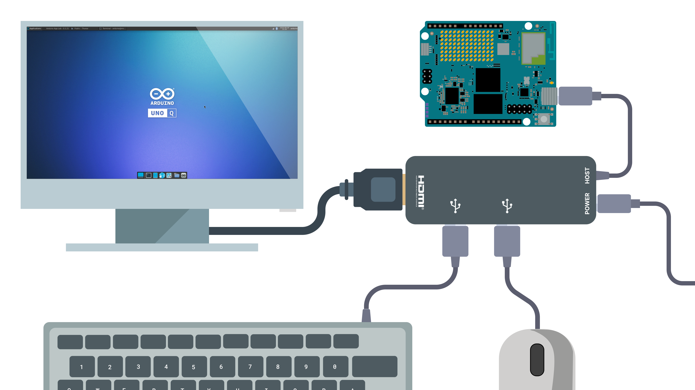

## Overview

The UNO Q is a powerful, versatile development board designed for hobbyists, developers, and makers. Thanks to its hybrid architecture, we can leverage it as a fully functional Linux based **Single-Board Computer** (SBC), capable of running Arduino sketches.



In this tutorial, you will learn how to set up your UNO Q as a personal computer, ready for everyday tasks like web browsing, office work and media playback, alongside working with product specific features like using **Arduino App Lab** for developing amazing projects.

## Goals

- Understand the required hardware and software for using the UNO Q as an SBC.
- Assemble your UNO Q into a functional desktop setup.
- Successfully complete the first boot and initial configuration.
- Explore the standalone Arduino App Lab mode.

## Required Hardware and Software

To set up the UNO Q as a single-board computer, you will need the following hardware and software components.


### Hardware Requirements

- [Arduino® UNO Q](https://store.arduino.cc/products/uno-q)
- USB Mouse
- USB Keyboard
- HDMI Display
- USB-C® Dongle<sup>1</sup>
- Power Supply +5 VDC at 3 A (to power the USB-C dongle)

***<sup>1</sup>Apple’s USB-C dongle has been tested and found to be incompatible with the UNO Q. Please select an alternative part number.***

### Software Requirements

The UNO Q comes preloaded with a desktop operating system based on the Debian distribution with upstream support, allowing you to start working immediately. For the test shown in this tutorial, there is no need to flash the board or install any additional images or programs.

## UNO Q Features for SBC Use

The UNO Q offers the essential performance and connectivity needed for everyday computing and embedded applications.

- **CPU**: Qualcomm Dragonwing™ QRB2210 | Quad-core Arm® Cortex®-A53 @ 2.0 GHz
- **GPU**: Adreno 702 GPU @ 845 MHz | 3D graphics accelerator
- **RAM**: 2 GB or 4 GB LPDDR4 (we recommend the **4 GB** variant for a smooth SBC experience)
- **Storage**: 16 GB or 32 GB eMMC
- **Connectivity**: Wi-Fi® 5 Dual-band 2.4/5 GHz and Bluetooth® 5.1
- **Display**: HD resolution through USB-C

## Computer Assembly

To assemble your UNO Q single-board computer, follow the steps below:


1. Connect the USB-C dongle to the USB-C port on the Arduino UNO Q.
2. Plug the USB keyboard and mouse into the dongle’s USB-A ports.
3. Connect the monitor to the dongle’s HDMI port.
4. Attach the external power supply to the dongle, but do not power it on yet.

***The UNO Q does not supply power to the USB-C dongle. The dongle must be powered externally, and, in turn, it will also provide power to the board.***

### Powering Options

To power your single-board computer, use an external power supply to power the USB-C dongle as follows:


***The power supply should provide at least +5 VDC at 3 A to reliably power the dongle, the connected devices, and the UNO Q.***

Once powered, the single-board computer will turn on and boot automatically.

## Login and First Use

When the UNO Q finishes booting, the Debian login screen will appear. The default username is `arduino` and in the password field enter a **custom password**:

- **Username**: arduino
- **Password**: `new-password`
- You will then be asked to confirm your password.


Arduino App Lab will open automatically and guide you through a one-time board configuration process with the following steps:

- Set your **keyboard** configuration and the **board name**:

  

- Select your Wi-Fi® network `SSID` and enter its password to connect to it.

  

- Set your Linux login credentials. You can use the same password you set at login time or change it by entering a new one:

  

Eventually, Arduino App Lab will open showing the built-in examples Apps. Now, you are ready to use the UNO Q as a single-board computer. The Arduino App Lab will open automatically and guide you in the first time board set up.


***Arduino App Lab will always run on boot and will update the board and the dependencies to their latest versions.***

### Connect to the Internet

If you followed the Arduino App Lab first set up, you should be already connected to the internet. However, here is a brief explanation of how to do it manually.

To connect the UNO Q to the internet, simply go to the upper right corner and click on the network icon. Then, search for available Wi-Fi® networks and select one.


Or run the following command in the terminal:

```bash
sudo nmcli d wifi connect <SSID> password <YOUR_PASSWORD>
```

## Explore SBC Mode: Linux & Arduino App Lab

With your single-board computer now configured and ready, you can tap into the full Linux experience and take advantage of our new Arduino App Lab to work with the UNO Q.

### Arduino App Lab

Develop hybrid Arduino Edge AI projects effortlessly with the built-in Arduino App Lab. Follow our [step-by-step tutorial](/software/app-lab/tutorials/getting-started/) to unlock the full potential of your Arduino UNO Q.


### Everyday Use

You can use your single-board computer for web browsing, media playing, coding, file managing and much more.


Out of the box, the Debian-based image on the UNO Q already comes with several useful applications pre-installed, allowing you to get started immediately:

- **Chromium Browser**: surf the web, check your email, and use cloud-based productivity tools.
- **Terminal**: manage files, run Linux commands, install software, and interact with the system at a deeper level.
- **Vim Editor**: a powerful text editor available in the terminal, useful for editing configuration files or writing code.
- **File Manager**: organize your documents, images, and downloads in a graphical interface.
- **Media Player**: play audio and video files locally (VLC installation needed). 

These built-in applications give you everything you need for daily computing tasks without requiring additional installations. Of course, you can always expand your environment by installing more software using Debian’s package manager (apt).

For example, to install **VLC media player** run the following command in the terminal:

```bash
sudo apt install vlc
```

To use a USB camera we can install **Cheese**, an app that provides a graphical interface to take snapshots and record:

```bash
sudo apt install cheese
```


## Expand Your Single-Board Computer

You can add more functionalities to your UNO Q single-board computer by adding extra peripherals connected to your USB-C dongle, for example:

- USB camera
- USB drive
- MicroSD card
- Wired internet connectivity through Ethernet
- Headset (speaker and/or microphone)


## Network Mode

Even when you have set up your Arduino UNO Q as a **single-board computer**, you can access it remotely from your personal machine by using the Arduino App Lab desktop and the **Network Mode**. 

This provides a flexible way of developing Apps on your computer, and testing them locally on the board, as both modes can be used simultaneously.

- When you open Arduino App Lab, you will see your board listed with the "Network" tag.
- Click on it and enter the Linux password to log in.
- You will now have access to the board remotely.


With this method, you can access your UNO Q from any machine in your local network. This allows you to use Arduino App Lab as if you were connected directly to the board. Develop applications and more.

## Conclusion

In this tutorial, you learned how to set up and use the Arduino UNO Q as a fully functional single-board computer, leveraging its quad-core processor, integrated GPU, wireless connectivity, and Debian-based operating system. You also explored how to assemble the hardware into a complete desktop setup, perform the first boot, log in, and connect to the internet.

Thanks to its mixed architecture and built-in Arduino App Lab, the UNO Q offers a seamless blend of general-purpose computing and embedded development, enabling you to browse the web, work on documents, play media, and simultaneously design Arduino projects without additional hardware. This makes it a versatile platform for both productivity and prototyping in a compact form factor.

### Next Steps

- Explore the Arduino App Lab tutorial to learn how to create hybrid applications directly on your UNO Q.
- Try connecting additional peripherals like a USB camera or Ethernet adapter to expand its capabilities.
- Customize your Debian environment by installing your preferred software packages using the built-in package manager.
- Experiment with developing and running both desktop and embedded applications on the same device.