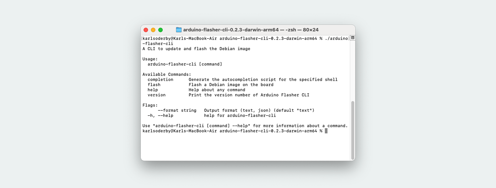
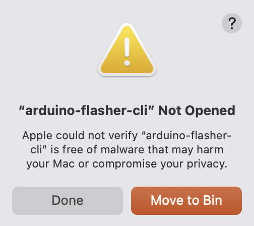
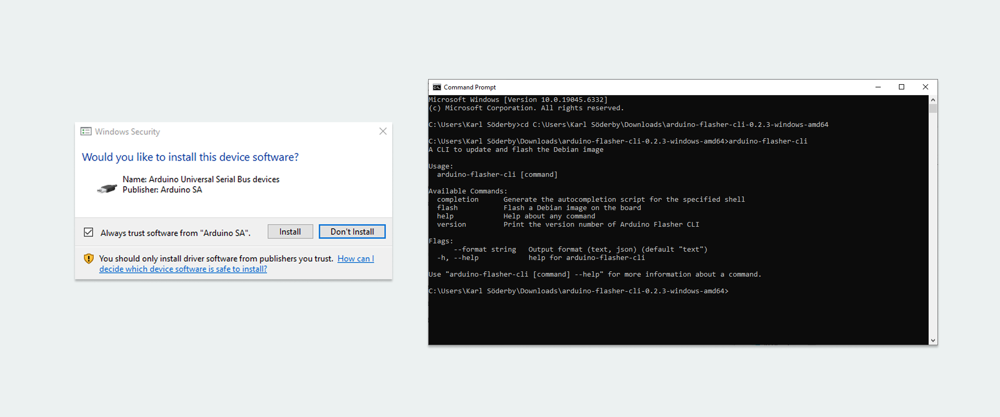

The [Arduino® UNO Q](https://store.arduino.cc/products/uno-q) runs a Linux operating system (OS), which comes pre-installed on the board.

There is often no need to re-install the OS on your board (also known as flashing an image), as the OS automatically receives updates regularly.

However, if we want to hard-reset the board and perform a fresh installation, it is possible. This process requires some additional tools installed on your machine.

> **WARNING!** Note that the instructions in this tutorial will wipe the board clean, and files & configurations saved on the board will be destroyed.

## Requirements

### Hardware Requirements

- [Arduino® UNO Q](https://store.arduino.cc/products/uno-q)
- [USB-C® cable](https://store.arduino.cc/products/usb-cable2in1-type-c)
- Female-to-female jumper wire

### Software Requirements

- [Arduino Flasher CLI](https://www.arduino.cc/en/software/#flasher-tool)
- At least 10 GB of free disk space

To re-flash the board, we will use the **Arduino Flasher CLI** tool:

- Download the [Arduino Flasher CLI](https://www.arduino.cc/en/software/#flasher-tool)

***Note that this tool will download an image with a size that exceeds 1 GB. A stable Internet connection and at least 10 GB of free disk space is recommended.***

## Download & Install CLI Tool

1. Download the [Arduino Flasher CLI](https://www.arduino.cc/en/software/#flasher-tool) for your OS (MacOS / Linux / Windows)
2. Unzip the downloaded file, (you will receive an executable binary named `arduino-flasher-cli`)

### Verify Tool Is Installed

Before flashing a new image, check that the `arduino-flasher-cli` tool is working. Below are instructions to verify the tool is installed and working on your OS.

#### MacOS

Navigate to the unzipped folder (e.g. `arduino-flasher-cli-x.x.x-darwin-arm64`), and run the following command:

```
./arduino-flasher-cli
```

You should see something like:



This means it is working, and we can proceed to [preparing the hardware](#preparing-the-hardware).

**Important Note:** Do not run the file directly from Finder, you will receive a prompt window akin to:



As the tool is run from the command line with specific flags (explained further below), there is no reason to run it from Finder.

#### Windows

Navigate to the unzipped folder (e.g. `arduino-flasher-cli-x.x.x-darwin-arm64`), and run the following command:

```
arduino-flasher-cli
```

A new window should appear, prompting you to install the driver. Install it, and run `arduino-flasher-cli` again in the terminal.



This means it is working, and we can proceed to [preparing the hardware](#preparing-the-hardware).

#### Linux

Navigate to the unzipped folder (e.g. `arduino-flasher-cli-x.x.x-darwin-arm64`), and run the following command:

```
./arduino-flasher-cli
```

You should see something like:


This means it is working, and we can proceed to [preparing the hardware](#preparing-the-hardware).

***Note: in some Linux systems, the `arduino-flasher-cli` could exit with an error right before flashing. This may occur if the kernel module `qcserial` is loaded. A workaround solution to fix this is in place (see section below).***

#### Fixing `qcserial` Issue (Linux Only)

Open a terminal, and check if `qcserial` is present by running `lsmod | grep qcse`

If present, it will return:

```
> lsmod | grep qcse
qcserial               24576  0
usb_wwan               24576  1 qcserial
usbserial              69632  2 qcserial,usb_wwan
```

Then, check if `qcserial` is locking the serial port `ttyUSB0`, by running `sudo dmesg`:

```
> sudo dmesg
[31633.372270] qcserial ttyUSB0: Qualcomm USB modem converter now disconnected from ttyUSB0
[31633.372308] qcserial 3-3:1.0: device disconnected
```

This issue can be fixed by disabling (or blacklisting), the `qcserial` kernel module on the Linux system.

1. Create or edit a configuration file named `blacklist-modem.conf` inside the `/etc/modprobe.d/` directory:
    ```sh
    sudo nano /etc/modprobe.d/blacklist-modem.conf
    ```
2. Inside this file, we need to blacklist the `qcserial` module:

    ```sh
    blacklist qcserial
    ```
3. Save the file and restart the system for the configuration to take effect.

## Preparing the Hardware

To prepare the hardware for flashing, follow the instructions below:

1. Disconnect the board from your computer.
2. Add the female-to-female jumper cable between the two pins specified in the image:

    

## Flash Image to the Board

In this step, we will upload the new image to the board using the Arduino Flasher CLI.

1. Connect the board to your computer, using a USB-C® type cable.
2. Open a terminal and navigate to the directory where you unzipped the Arduino Flasher CLI (normally `cd /Downloads`).
3. Run the following command in the terminal: `./arduino-flasher-cli flash latest`.
4. A download sequence will begin (the image is >1 GB). Once the download is complete, it will flash the board with the new image. **Please note:** this will take several minutes. Do **not** disconnect the USB cable during this process.
5. Once flashing completes and the tool reports success, **power-cycle** the board (unplug and re-plug USB) so it boots the new OS.

The steps above are summarized in the graphic below:


## Troubleshooting

- Ensure the Arduino Flasher CLI is unzipped and accessible.
- Check that the correct pins are shorted, and that they are shorted **before** connecting the board to the computer.
- Make sure the board has not finished booting when running the flashing command (`./arduino-flasher-cli flash latest`).
- Verify that you are running the command from the correct directory where the Arduino Flasher CLI was unzipped.
- After the tool reports a successful installation, **power-cycle** the board **with the jumper removed.**
