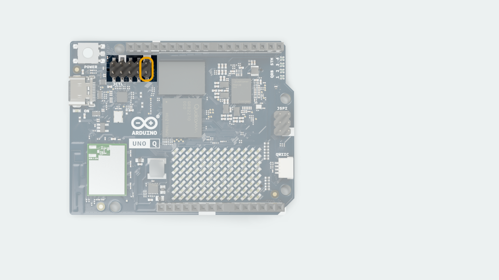

The [Arduino® UNO Q](https://store.arduino.cc/products/uno-q) runs a Linux operating system (OS), which comes pre-installed on the board.

There is often no need to re-install the OS on your board (also known as flashing an image), as the OS automatically receives updates regularly.

However, if we want to hard-reset the board and perform a fresh installation, it is possible. This process requires some additional tools installed on your machine.

***Note that the instructions in this tutorial will wipe the board clean, and files & configurations saved on the board will be destroyed.***

## Requirements

### Hardware Requirements

- [Arduino® UNO Q](https://store.arduino.cc/products/uno-q)
- [USB-C® cable](https://store.arduino.cc/products/usb-cable2in1-type-c)
- Female-to-female jumper wire

### Software Requirements

To re-flash the board, we will use the **Arduino Flasher CLI** tool:

- Download the [Arduino Flasher CLI](https://www.arduino.cc/en/software/#flasher-tool)

***Note that this tool will download an image with a size that exceeds 1 GB. A stable Internet connection is recommended.***

## Download & Install CLI Tool

1. Download the [Arduino Flasher CLI](https://www.arduino.cc/en/software/#flasher-tool) for your OS (MacOS / Linux / Windows)
2. Unzip the downloaded file, (you will receive a executable binary named `arduino-flasher-cli`)

### Verify Tool Is Installed

Before flashing a new image, check that the `arduino-flasher-cli` tool is working. Below are instructions to verify the tool is installed and working on your OS.

#### MacOS

Navigate to the unzipped folder (e.g. `arduino-flasher-cli-x.x.x-darwin-arm64`), and run the following command:

```
./arduino-flasher-cli
```

You should see something like:


This means it is working, and we can proceed to [flashing the board](#flash-image-to-the-board).

#### Linux

Navigate to the unzipped folder (e.g. `arduino-flasher-cli-x.x.x-darwin-arm64`), and run the following command:

```
./arduino-flasher-cli
```

You should see something like:


This means it is working, and we can proceed to [flashing the board](#flash-image-to-the-board).

#### Windows

Navigate to the unzipped folder (e.g. `arduino-flasher-cli-x.x.x-darwin-arm64`), and run the following command:

```
arduino-flasher-cli
```

A new window should appear, prompting you to install the driver. Install it, and run `arduino-flasher-cli` again in the terminal.


This means it is working, and we can proceed to [flashing the board](#flash-image-to-the-board).

## Preparing the Hardware

To prepare the hardware for flashing, follow the instructions below:

1. Disconnect the board from your computer.
2. Add the female-to-female jumper cable between the two pins specified in the image:

    

3. Do **not** connect the board to the computer yet. This will need to be timed in the next step.

## Flash Image to the Board

In this step, we will upload the new image to the board using the Arduino Flasher CLI.

1. Open a terminal and navigate to the directory where you unzipped the Arduino Flasher CLI (normally `/Downloads`).
2. Type the following command in the terminal: `./arduino-flasher-cli flash latest` **but do not press Enter yet**
3. **Connect the board to the computer**, and press **Enter** to run the command **during the boot animations** on the LED matrix (immediately after plugging in). You only need the jumper to force recovery at plug-in; **you may remove it after you run the command**.
4. A download sequence will begin (the image is >1 GB). Once the download is complete, it will flash the board with the new image. **Please note:** this will take several minutes. Do **not** disconnect the USB cable during this process.
5. Once flashing completes and the tool reports success, **power-cycle** the board (unplug and re-plug USB) so it boots the new OS. (Ensure the jumper is removed before the power-cycle.)

***It is important to run the flashing command ONLY when the board is booting up; it does not work once the OS has finished booting.***


## Troubleshooting

- Ensure the Arduino Flasher CLI is unzipped and accessible.
- Check that the correct pins are shorted, and that they are shorted **before** connecting the board to the computer.
- Make sure the board has not finished booting when running the flashing command (`./arduino-flasher-cli flash latest`).
- Verify that you are running the command from the correct directory where the Arduino Flasher CLI was unzipped.
- After the tool reports a successful installation, **power-cycle** the board **with the jumper removed.**
