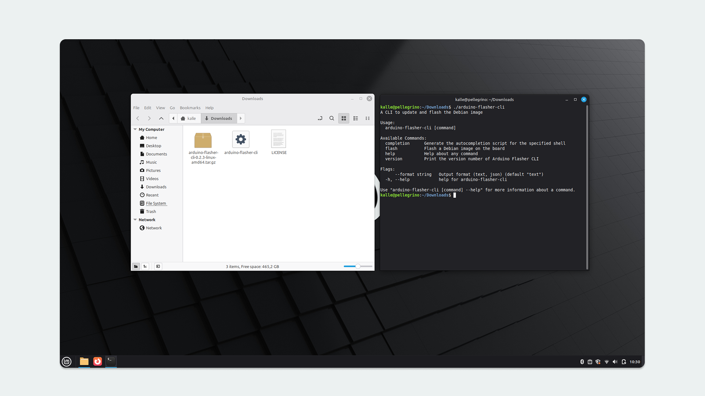

The [Arduino® UNO Q](https://store.arduino.cc/products/uno-q) runs a Linux operating system (OS), which comes pre-installed on the board.

There is often no need to re-install the OS on your board (also known as flashing an image), as the OS automatically receives updates regularly.

However, if we want to hard-reset the board and perform a fresh installation, it is possible. This process requires some additional tools installed on your machine.

> **WARNING!** Note that the instructions in this tutorial will wipe the board clean, and files & configurations saved on the board will be destroyed.

## Requirements

### Hardware Requirements

- [Arduino® UNO Q](https://store.arduino.cc/products/uno-q)
- [USB-C® cable](https://store.arduino.cc/products/usb-cable2in1-type-c)
- Female-to-female jumper wire

### Software Requirements

- [Arduino Flasher CLI](https://www.arduino.cc/en/software/#flasher-tool)
- At least 10 GB of free disk space

To re-flash the board, we will use the **Arduino Flasher CLI** tool:

- Download the [Arduino Flasher CLI](https://www.arduino.cc/en/software/#flasher-tool)

***Note that this tool will download an image with a size that exceeds 1 GB. A stable Internet connection and at least 10 GB of free disk space is recommended.***

#### Linux Users: USB Permissions Required

If you are using Linux, it is recommended to configure USB device permissions before attempting to flash the board. The flashing process communicates with the board through ADB (Android Debug Bridge) over USB, which requires write access to the USB device files created when the board connects to your computer.

Without proper permissions, the flashing process will fail with an error message saying `adb: insufficient permissions for device`:


It happens because the UNO Q works in a particular mode during the flashing process called Emergency Download Mode, or EDL. This mode uses a different USB configuration than regular operation.

In regular operation, the board presents itself with USB VID `2341` and PID `0078`. When entering EDL mode for flashing or recovery operations, it switches to USB VID `05c6` and PID `9008`. Your Linux system needs to recognize and grant permissions for both modes, which is why we need to install udev rules for both configurations.

#### Installing Required Udev Rules

The correct way to configure the necessary permissions for your user account is via `udev rules`. The following udev rules will grant your user account access to the UNO Q in both operating modes:

```bash
# Operating mode
SUBSYSTEMS=="usb", ATTRS{idVendor}=="2341", ATTRS{idProduct}=="0078", MODE="0660", TAG+="uaccess"
# EDL mode
SUBSYSTEMS=="usb", ATTRS{idVendor}=="05c6", ATTRS{idProduct}=="9008", MODE="0660", TAG+="uaccess"
```

Run this command to install the necessary udev rules:

```bash
echo \
'# Operating mode
SUBSYSTEMS=="usb", ATTRS{idVendor}=="2341", ATTRS{idProduct}=="0078", MODE="0660", TAG+="uaccess"
# EDL mode
SUBSYSTEMS=="usb", ATTRS{idVendor}=="05c6", ATTRS{idProduct}=="9008", MODE="0660", TAG+="uaccess"' \
| \
  sudo \
    tee \
      "/etc/udev/rules.d/60-Arduino-UNO-Q.rules" \
&& \
sudo \
  udevadm control \
    --reload-rules \
&& \
sudo \
  udevadm trigger
```


This command creates a udev rule file that tells Linux to grant access to the UNO Q automatically whenever it is connected. The `MODE="0660"` parameter sets the file permissions so that the owner and group can read and write to the device. The `TAG+="uaccess"` parameter grants access specifically to your currently logged-in user account.

After creating the rules, the command reloads all udev rules without requiring a system restart, then applies the new rules to any devices that are already connected. It means if your UNO Q is currently plugged in, it will receive the correct permissions immediately.

You can verify the installation using the following command:

```bash
cat /etc/udev/rules.d/60-Arduino-UNO-Q.rules
```


You should see both udev rules displayed, one for Operating mode and one for EDL mode.

To check if the UNO Q is detected, the following command is used:

```bash
lsusb | grep -E "2341:0078|05c6:9008"
```


***For more information about Linux USB permissions and troubleshooting, you can refer to the [Linux Host Setup section in the User Manual](https://docs.arduino.cc/tutorials/uno-q/user-manual/#linux-host-setup-required-for-linux-users).***

After installing the udev rules, **unplug your UNO Q board from the computer, wait a few seconds, then reconnect it**. It helps new permissions are applied. Once reconnected, you can continue to the next steps in the flashing process.

#### Alternative Installation Method

You can use the official `post-install` script from the [*Arduino Core Zephyr repository*](https://github.com/arduino/ArduinoCore-zephyr) to configure these permissions automatically. This script performs the same [udev rule installation as the manual method](#linux-users-usb-permissions-required) described above.

To download and run the `post-install` script, navigate to your Downloads directory and use `wget` to fetch the script from the repository:

```bash
cd ~/Downloads
```

```bash
wget https://raw.githubusercontent.com/arduino/ArduinoCore-zephyr/main/post_install.sh
```


```bash
chmod +x post_install.sh
```

```bash
sudo ./post_install.sh
```


If wget is not available on your system, you can use `curl` instead:

```bash
cd ~/Downloads
```

```bash
curl -O https://raw.githubusercontent.com/arduino/ArduinoCore-zephyr/main/post_install.sh
```

```bash
chmod +x post_install.sh
```

```bash
sudo ./post_install.sh
```

```bash
sudo ~/.arduino15/packages/arduino/hardware/zephyr/<version>/post_install.sh
```

Alternatively, you can clone the entire repository and run the script from there:

```bash
cd ~/Downloads
```

```bash
git clone https://github.com/arduino/ArduinoCore-zephyr.git
```

```bash
cd ArduinoCore-zephyr
```

```bash
chmod +x post_install.sh
```

```bash
sudo ./post_install.sh
```

When prompted, enter your password. The script will create the udev rules file, reload the udev rules, and apply them to any currently connected devices, just like the manual installation method.

After running the script, you can verify the installation using the same command shown in the manual installation section:

```bash
cat /etc/udev/rules.d/60-arduino-zephyr.rules
```


Note that the script creates a file named `60-arduino-zephyr.rules` rather than `60-Arduino-UNO-Q.rules`, but it has the same permission rules for both operating modes.

After installing the udev rules using either method, **unplug your UNO Q board from the computer, wait a few seconds, then reconnect it**. This allows the new permissions to be applied. Once reconnected, you can continue to the next steps in the flashing process.

#### Verifying ADB Access

Before attempting to flash the image, you should check that ADB can detect your board without permission errors. Run the following command:

```bash
adb devices
```

This command lists all Android Debug Bridge devices connected to your system. Your UNO Q should appear in the list without any error messages. Or the following command to access the UNO Q:

```bash
adb shell
```


If you see `insufficient permissions` in the output, it indicates that the udev rules were not applied correctly or the board needs to be reconnected.

If permission errors persist, please double check that the udev rules were installed to the correct location. Check that you unplugged and reconnected the board after installing the rules, as existing connections do not automatically apply new permissions. Make sure you have closed and reopened any terminals or applications that were running when you installed the rules.

If you are still experiencing issues, try restarting the udev service:

```bash
sudo systemctl restart systemd-udevd
```

After restarting the service, unplug the board, wait a few seconds, and reconnect it. Then run `adb devices` or `adb shell` again to verify the board is detected correctly. Once ADB shows your device without errors, you can proceed with confidence to the flashing steps.

## Download & Install CLI Tool

1. Download the [Arduino Flasher CLI](https://www.arduino.cc/en/software/#flasher-tool) for your OS (MacOS / Linux / Windows)
2. Unzip the downloaded file, (you will receive an executable binary named `arduino-flasher-cli`)

### Verify Tool Is Installed

Before flashing a new image, check that the `arduino-flasher-cli` tool is working. Below are instructions to verify the tool is installed and working on your OS.

#### MacOS

Navigate to the unzipped folder (e.g. `arduino-flasher-cli-x.x.x-darwin-arm64`), and run the following command:

```
./arduino-flasher-cli
```

You should see something like:


This means it is working, and we can proceed to [preparing the hardware](#preparing-the-hardware).

**Important Note:** Do not run the file directly from Finder, you will receive a prompt window akin to:


As the tool is run from the command line with specific flags (explained further below), there is no reason to run it from Finder.

#### Windows

Navigate to the unzipped folder (e.g. `arduino-flasher-cli-x.x.x-windows-amd64`), and run the following command:

```
arduino-flasher-cli
```

A new window should appear, prompting you to install the driver. Install it, and run `arduino-flasher-cli` again in the terminal.


This means it is working, and we can proceed to [preparing the hardware](#preparing-the-hardware).

#### Linux

Navigate to the unzipped folder (e.g. `arduino-flasher-cli-x.x.x-linux-amd64`), and run the following command:

```
./arduino-flasher-cli
```

You should see something like:



This means it is working, and we can proceed to [preparing the hardware](#preparing-the-hardware).

***Note: in some Linux systems, the `arduino-flasher-cli` could exit with an error right before flashing. This may occur if the kernel module `qcserial` is loaded. A workaround solution to fix this is in place (see section below).***

#### Fixing `qcserial` Issue (Linux Only)

Open a terminal, and check if `qcserial` is present by running `lsmod | grep qcse`

If present, it will return:

```
> lsmod | grep qcse
qcserial               24576  0
usb_wwan               24576  1 qcserial
usbserial              69632  2 qcserial,usb_wwan
```

Then, check if `qcserial` is locking the serial port `ttyUSB0`, by running `sudo dmesg`:

```
> sudo dmesg
[31633.372270] qcserial ttyUSB0: Qualcomm USB modem converter now disconnected from ttyUSB0
[31633.372308] qcserial 3-3:1.0: device disconnected
```

This issue can be fixed by disabling (or blacklisting), the `qcserial` kernel module on the Linux system.

1. Create or edit a configuration file named `blacklist-modem.conf` inside the `/etc/modprobe.d/` directory:
    ```sh
    sudo nano /etc/modprobe.d/blacklist-modem.conf
    ```
2. Inside this file, we need to blacklist the `qcserial` module:

    ```sh
    blacklist qcserial
    ```
3. Save the file and restart the system for the configuration to take effect.

## Preparing the Hardware

To prepare the hardware for flashing, follow the instructions below:

1. Disconnect the board from your computer.
2. Add the female-to-female jumper cable between the two pins specified in the image:

    

## Flash Image to the Board

In this step, we will upload the new image to the board using the Arduino Flasher CLI.

1. Connect the board to your computer, using a USB-C® type cable.
2. Open a terminal and navigate to the directory where you unzipped the Arduino Flasher CLI (normally `cd /Downloads`).
3. Run the following command in the terminal: `./arduino-flasher-cli flash latest`.
4. A download sequence will begin (the image is >1 GB). Once the download is complete, it will flash the board with the new image. **Please note:** this will take several minutes. Do **not** disconnect the USB cable during this process.
5. Once flashing completes and the tool reports success, **power-cycle** the board (unplug and re-plug USB) so it boots the new OS.

The steps above are summarized in the graphic below:


## Troubleshooting

- Ensure the Arduino Flasher CLI is unzipped and accessible.
- Check that the correct pins are shorted, and that they are shorted **before** connecting the board to the computer.
- Make sure the board has not finished booting when running the flashing command (`./arduino-flasher-cli flash latest`).
- Verify that you are running the command from the correct directory where the Arduino Flasher CLI was unzipped.
- After the tool reports a successful installation, **power-cycle** the board **with the jumper removed.**
