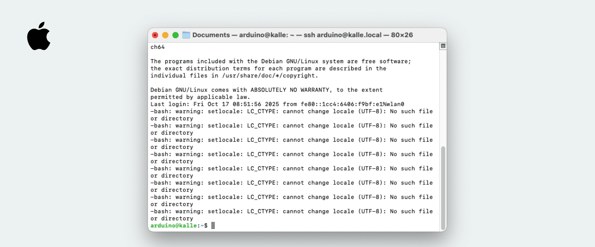
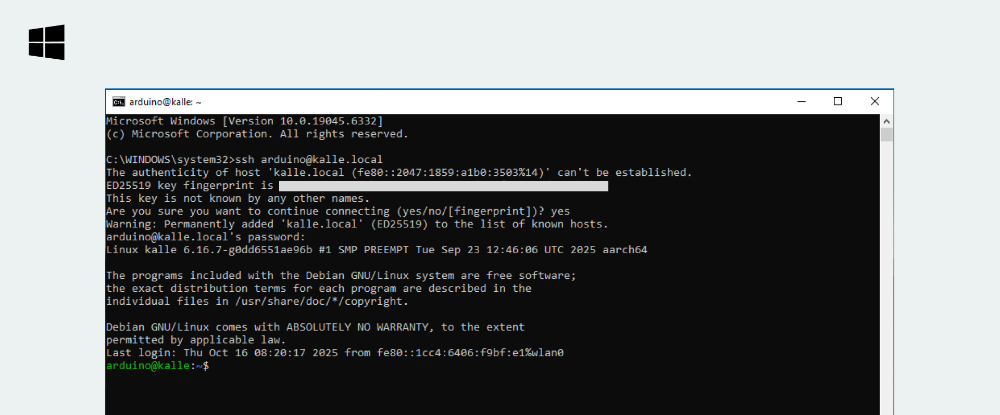
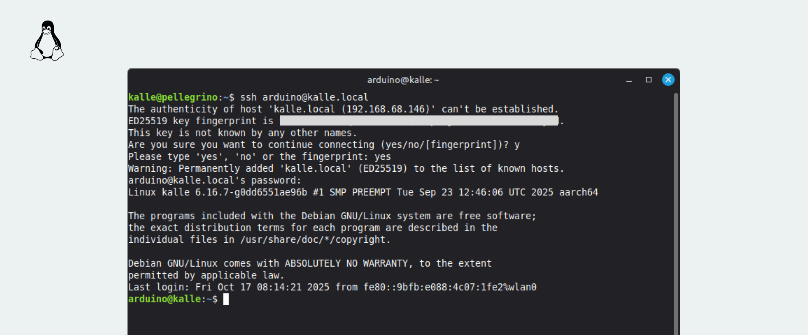

The [Arduino® UNO Q](https://store.arduino.cc/products/uno-q) can be programmed via the [Arduino App Lab](/software/app-lab/), a desktop application supporting code editing and running [Apps](/software/app-lab/tutorials/getting-started/#create--run-apps) on the board without any external tools.

The board's microprocessor (running Debian OS) can also be accessed using Secure Shell (SSH), a method that allows remote connection to your board over a local network. This allows you to, among other things:
- Access the board's shell and perform operations on the board remotely.
- Transfer files from your local computer to the board remotely (using SCP).

The UNO Q board comes pre-packaged with the Arduino App Lab, which is based on the `arduino-app-cli` tool\*. This allows you, among other things, to **launch Apps through the command line**, instead of using the desktop App.

\* Read more about the `arduino-app-cli` in the [Arduino App CLI guide](/software/app-lab/tutorials/cli).

## Requirements

### Hardware Requirements

- [Arduino® UNO Q](https://store.arduino.cc/products/uno-q)
- 5 VDC 3 A power supply (e.g., a phone charger or USB port from a computer)

### Software Requirements

- [First setup](/software/app-lab/tutorials/getting-started/#install--set-up-arduino-app-lab) of board completed\*
- An SSH client tool installed on the computer (macOS, Windows 10+, Ubuntu has built-in SSH client tools)
- Access to a local Wi-Fi® network (both computer & board need to be on the same network)

***During the first setup, Wi-Fi® credentials are entered, and the board will automatically enable SSH. Without completing it, it is not possible to access the board via SSH unless activated manually. This can also be activated by accessing the board using `adb`, and running `arduino-app-cli system network-mode enable` in the board's shell. See more in the [Arduino App CLI documentation](/software/app-lab/tutorials/cli/)***

## Installing SSH (Local Computer)

SSH is a network protocol, not a tool itself. There are many different SSH tools to choose from, and most operating systems have a built-in tool. In this section, we will cover how to set it up on some common operating systems (macOS, Windows, Ubuntu).

### macOS

macOS features a built-in `ssh` tool based on [OpenSSH](https://www.openssh.com/), and **should work out of the box**. Check if the tool is present on your machine by running the following in a terminal:

```
ssh -V
```

You should see something like:

```
OpenSSH_9.9p2, LibreSSL 3.3.6
```

Which means it is working properly. ✅

***If you are running an outdated/custom system that for some reason does not feature SSH, you can look into installing [OpenSSH](https://formulae.brew.sh/formula/openssh) and [LibreSSL](https://formulae.brew.sh/formula/libressl) manually via, e.g., Brew.***


### Windows

Later versions of Windows (10+) include SSH clients as well, with no requirement to install additional tools. To verify tools are installed, open a terminal on your Windows machine, and type:

```
ssh -V
```

Which should return something like:

```
OpenSSH_for_Windows_x.x, LibreSSL 3.x.x
```

This means it is working properly. ✅

***For older Windows machines, use a package manager such as [Chocolatey](https://chocolatey.org/) to install OpenSSH / LibreSSL.***

### Linux (Ubuntu)

Many Linux OS include SSH clients, with no requirement to install additional tools. To verify tools are installed, open a terminal on your Ubuntu machine, and type:

```
ssh -V
```

Which should return something like:

```
OpenSSH_x.x Ubuntu-3ubuntu.x, OpenSSL x.x.x
```

This means it is working properly. ✅

***If you are running an outdated/custom system that for some reason does not feature SSH, you can look into installing [OpenSSH](https://formulae.brew.sh/formula/openssh) and [LibreSSL](https://formulae.brew.sh/formula/libressl) manually, by running `sudo apt install openssh-client openssh-server libressl-dev`.***

## Connecting via SSH

To connect to an UNO Q board via SSH, we only need to know the **board name and password**. This is set up during the first setup.

1. Open a terminal.
2. Run the following command:

   ```
   ssh arduino@<boardname>.local #replace <boardname> with your board name
   ``` 

3. Type `yes` when asked to connect.
4. Enter the password for the board.

After entering the password, you should enter the board's shell, and you can now perform operations!

See below how it should look when you have successfully accessed the board's shell.

### macOS Confirmation



#### MacOS MDNS Issues

If the connection fails with the following error:
- `ssh: connect to host <boardname>.local port 22: Connection refused`

It might be a mDNS issue with your local network. To work around this, there are some alternatives to try:

**Connect directly via the IP address:** The board's IP address can be found through:
- Arduino IDE 2 (needs the Zephyr core installed)
- Arduino CLI, by running `arduino-cli board list`
- Running `hostname -I` while in the board's shell. You can access the board via `adb shell` ([instructions](/software/app-lab/tutorials/cli/#connect-via-adb)), or [using the board in SBC mode](/tutorials/uno-q/single-board-computer/).

After obtaining the IP address, you should be able to connect via SSH using `ssh arduino@10.0.20.138`.

***If you have previously connected to a board with the same IP address, but have re-flashed the board, you may need to remove the old key from `~/.ssh/known_hosts`. This can be done by editing the `known_hosts` file or by running `ssh-keygen -R <board ip address>`.***

### Windows Confirmation



### Linux (Ubuntu) Confirmation



## Arduino App CLI

The `arduino-app-cli` can be used to start & stop Apps on the board from the terminal. When accessing the board via SSH, you can run commands such as `arduino-app-cli app start <app>`.

More details on the `arduino-app-cli` tool can be found in the [Arduino App CLI guide](/software/app-lab/tutorials/cli/).

## File Transfer

To transfer files from your computer to the board, use the `scp` tool **from your computer's terminal** (not inside an SSH session on the board). The tool can be used to either **push** or **pull** files and folders to and from the board.

This is done by specifying a local path on your computer (e.g., `/User/documents/file.xx`), and a path on the board (e.g., `/home/arduino/`).

### Push Files

To **push** a file, use the command below:

```
scp test-transfer.txt arduino@<boardname>.local:/home/arduino/
```

This will transfer the `test-transfer.txt` file in the same directory you are running the command, to the board.

### Pull Files

To **pull** a file, use the command below:

```
scp arduino@<boardname>.local:/home/arduino/test-transfer.txt ./
```

This will pull the file to the directory where you run the command. `./` can be replaced by specifying a path (e.g., `/User/documents/`).

### Push/Pull Folders

To **push** a folder, use `-rp` to copy directories **r**ecursively, and **p**reserve times/permissions:

`scp -rp "my-folder" arduino@<board-name>.local:/home/arduino/ArduinoApps/`

To **pull** a folder from the board to your current directory:

`scp -rp arduino@<board-name>.local:/home/arduino/ArduinoApps/my-folder ./`


## Troubleshooting

If the SSH connection fails, there are some common things to check:
- Has the first setup been completed? If not, follow the instructions [here](/software/app-lab/tutorials/getting-started/#install--set-up-arduino-app-lab) and see the instructions. The first setup will enable SSH on the board, which is required to connect.
- If the SSH connection gets stuck even though the first setup has been completed, it may be a local network issue. Check that the board is connected to the same network as your computer.

### Issues with MDNS

Some networks may block using mDNS, which allows us to use a "friendly" name (`arduino@<boardname>.local`), instead of using the actual IP address of the board. There are two ways to work around this:
1. Instead of using `arduino@<boardname>.local`, use the board's IP address directly. The IP address can be accessed by either launching the board in SBC mode and typing `hostname -I` in a terminal. This will reveal the IP address of your board.
2. (advanced) Edit the `/etc/hosts` on your local computer by running `sudo nano /etc/hosts`. At the bottom of the file, add `<boardipaddress> <boardname>.local`. This will allow you to connect using `ssh arduino@<boardname>.local`.
