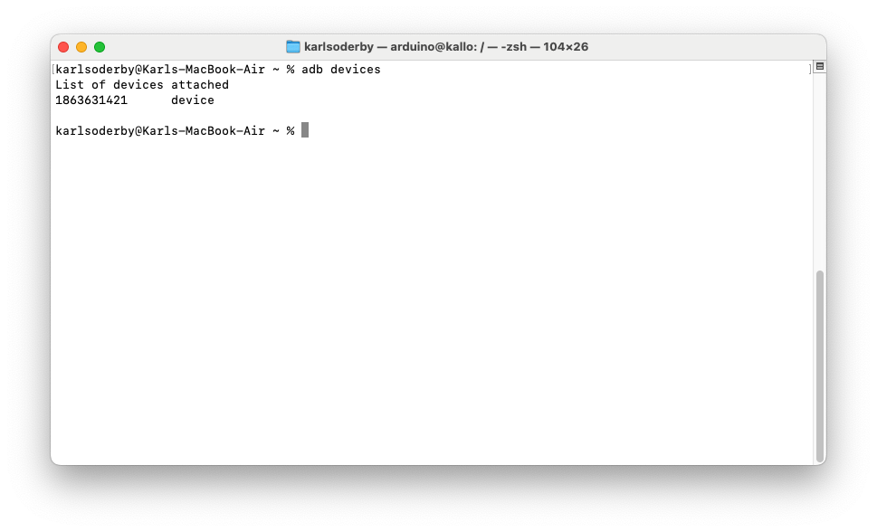
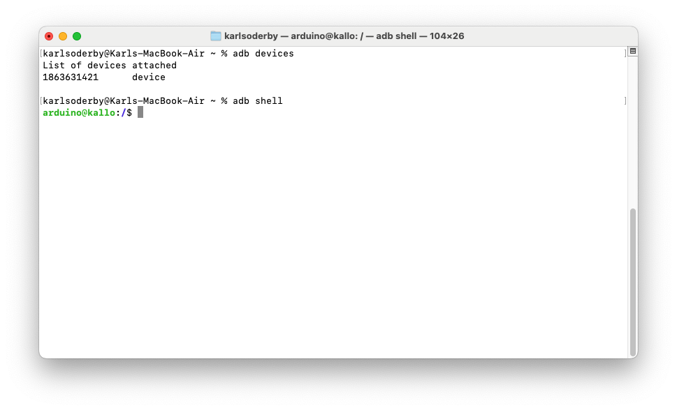

The Linux OS running on the [Arduino UNO Q](https://store.arduino.cc/products/uno-q) can be accessed over USB, using a tool called Android Debug Bridge (ADB). 

ADB is a tool that you install on your computer, where you can access the board's shell and run operations on the system.

## Requirements

The following hardware is required:
- [Arduino UNO Q](https://store.arduino.cc/products/uno-q)
- [USB-C® type cable](https://store.arduino.cc/products/usb-cable2in1-type-c)

You will also need to have the following software installed on your OS:
- [Android Debug Bridge](https://developer.android.com/tools/releases/platform-tools)

## Installing ADB (Host Computer)

The ADB command line tool is supported on MacOS, Windows & Linux. For more specific instructions for your OS, see the sections below. 

***You can find more information and download the latest version for the tool for all operating systems directly from the [Android SDK Platform Tools](https://developer.android.com/tools/releases/platform-tools#downloads) page.***

### MacOS

To install the ADB tools on **MacOS**, we can use `homebrew`. Open the terminal and run the following command:

```bash
brew install android-platform-tools
```

To verify the tool is installed, run `adb version`.

### Windows

To install the ADB tools on **Windows**, we can use `winget`, supported on Windows 11 and on some earlier Windows 10 versions. 

Open a terminal and run the following:

```bash
winget install Google.PlatformTools
```

To verify the tool is installed, run `adb version`.

### Linux

To install ADB tools on a **Debian/Ubuntu Linux distribution**, open a terminal and run the following command:

```bash
sudo apt-get install android-sdk-platform-tools
```

To verify the tool is installed, run `adb version`.

## Connect via ADB

1. Connect the UNO Q board to your computer via USB-C®.
2. Run `adb devices` in the terminal. This should list the connected devices.

    

>Note that it may take up to a minute for the device to appear after connecting it.

3. Run `adb shell`. If you have not set up your board prior to this via the Arduino App Lab, you may be required to provide a password, which is `arduino`.
4. You should now be inside your board's terminal.

    

5. You are now able to run commands via the terminal on your board! To exit from the terminal, simply type `exit`.

## Summary

Connecting via ADB is an easy way to gain access to your board's shell, allowing you to perform actions such as installing packages, editing files and running scripts.

The `arduino-app-cli` can also be used directly via the shell, allowing you to launch Apps directly from the command line. You can read more about that in the link below:
- [Arduino App CLI: Manage Apps from the Command Line](/software/app-lab/tutorials/cli/)