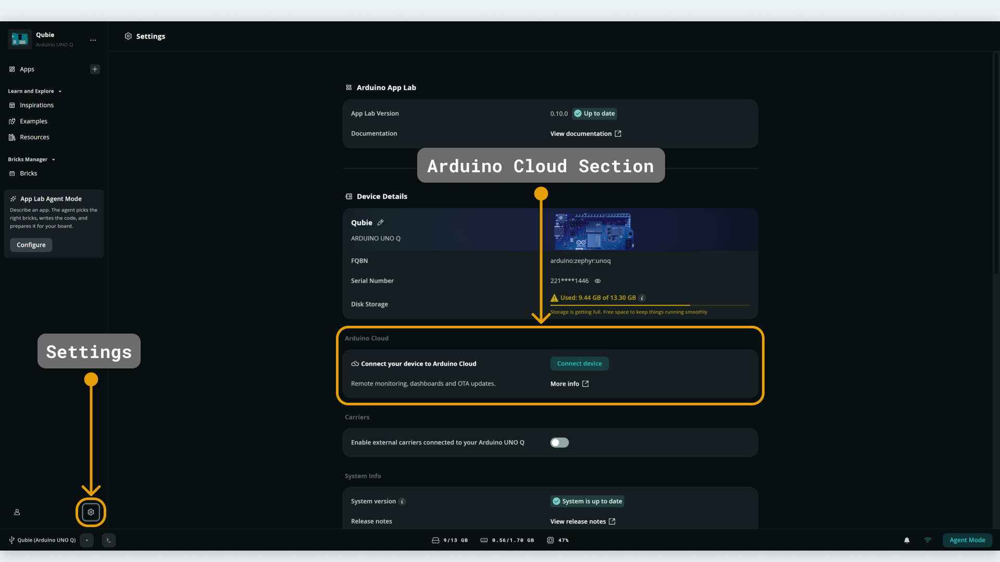
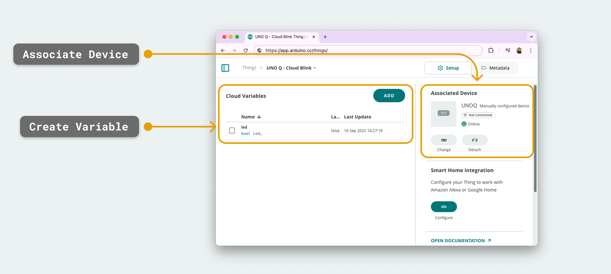
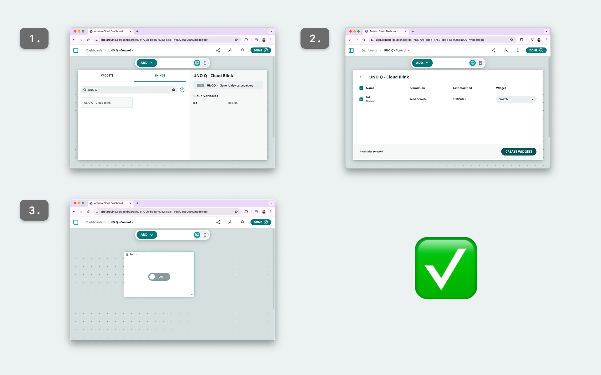
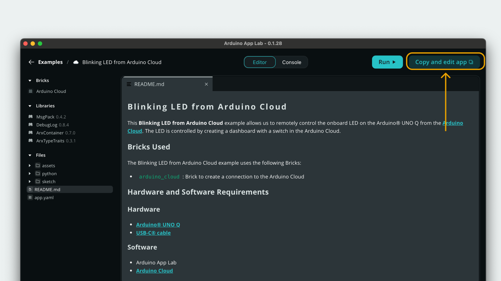
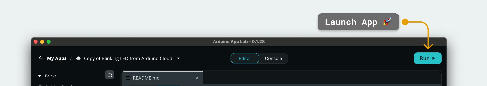
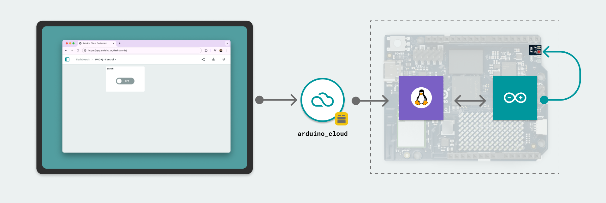

The [Arduino® UNO Q](https://store.arduino.cc/products/uno-q) is supported by the [Arduino Cloud](https://app.arduino.cc/), allowing it to send and receive data over the Internet. Note that the UNO Q requires the [Arduino App Lab](https://docs.arduino.cc/software/app-lab/) to be programmed, which includes the ready-made example that this tutorial is based on. 

The communication with Arduino Cloud is enabled by the UNO Q's microprocessor (MPU) and Wi-Fi® module, and is programmed using Python. Data to and from the Microcontroller (MCU) is handled via the [Bridge](/software/app-lab/getting-started/quickstart/#bridge-tool) tool.

***The UNO Q is connected to Arduino Cloud directly from Arduino App Lab. Once you connect your device to your Cloud space, it is automatically provisioned and ready to receive data from your apps.***

## Goals

In this tutorial, you will learn:
- How to set up the Arduino Cloud.
- How to connect the UNO Q to Arduino Cloud from Arduino App Lab.
- How to turn on a LED on the UNO Q from a dashboard in the Arduino Cloud.

## Hardware & Software Needed

- [Arduino® UNO Q](https://store.arduino.cc/products/uno-q)
- An [Arduino Cloud account](https://login.arduino.cc/login)
- [Arduino App Lab](https://www.arduino.cc/en/software)

## Set up Arduino Cloud

First, we need to set up the Arduino Cloud part, including:
- Connecting a Device (from the Arduino App Lab)
- Creating a Thing and a cloud variable
- Creating a dashboard and a widget

To set this up, follow the instructions below:

1. Navigate to the [Arduino Cloud](https://app.arduino.cc/) page and log in / create an account.
2. From here, you can click "Create a new device" and select "Arduino Uno Q" (or the most similar option for Q devices).
3. This will prompt you to open Arduino App Lab if it's installed, or invite you to download it first.
4. Open Arduino App Lab, go to device settings, and in the Cloud section click "Connect".
    
5. If you're not logged in with your Arduino account in the App Lab, you'll first be asked to log in, a web authentication page opens, you log in, and the App Lab reopens automatically.
6. Select which of your Cloud spaces to add the device to, among your personal and organization spaces.
7. If everything is successful, you'll see a confirmation message, and your device will appear in the devices list of the selected space in the Arduino Cloud.
8. Go to the [things](https://app.arduino.cc/things) page and create a new thing.
9. Inside the thing, create a new **boolean** variable, and name it **"led"**. We also need to associate the device we created with this thing.
    
10. Finally, navigate to the [dashboards](https://app.arduino.cc/dashboards), and create a dashboard. Inside the dashboard, click on **"Edit"**, and select the thing we just created. This will automatically assign a switch widget to the **led** variable.
    

Starting from the Cloud is optional, the flow can also start directly from the Arduino App Lab, as described below.

## Program the UNO Q (Cloud Example)

To program the UNO Q, we need to use Arduino App Lab. The example we are going to use is included in Arduino App Lab.

***If you are new to the UNO Q, you can check out the [Getting Started with Arduino App Lab](https://docs.arduino.cc/software/app-lab/getting-started/quickstart/) guide***

1. Open Arduino App Lab and connect (using USB / network option).
2. Open the **"Examples"** tab in the left side menu. Here you will find the **"Blinking LED from Arduino Cloud"** example.
3. Duplicate the example by clicking on **"Copy and edit app"** button in the top right corner
   

4. On the App page, you'll find the **"Arduino Cloud"** Brick already added. No configuration is needed. The device is already connected to your Cloud space (as set up in the previous section), it connects automatically.

5. Launch the App by clicking the "Run" button in the top right corner. Wait until the App has launched.
    

## Testing the Cloud Connection

The example works by establishing a connection between the Arduino Cloud and the UNO Q board. When interacting with the dashboard's switch widget (turn ON/OFF), the cloud updates the `led` variable.

The `main.py` script running on the Linux system listens for changes to this property using the `arduino_cloud` Brick. When a change is detected, the **Bridge** tool is used to send data to the microcontroller, and turn the LED ON.

The flow of the App is:
1. The switch in the Arduino Cloud dashboard is changed.
2. The Arduino Cloud updates the device's state.
3. `main.py` receives the updated state, sends a message to the microcontroller which turns the LED to an ON/OFF state.

## Summary

In this tutorial, you learned how to connect the UNO Q with the Arduino Cloud. This connection is done by using the **Arduino Cloud Brick** in the Python script running on the UNO Q's MPU. 

The data that the Python script receives is then sent to the MCU, which turns on the built-in LED on the board. For this, the [Bridge](/software/app-lab/getting-started/quickstart/#bridge-tool) tool is used.

You can read more about the Arduino Cloud & UNO Q through the links below:
- [Arduino Cloud documentation](/arduino-cloud/)
- [Arduino UNO Q documentation](/hardware/uno-q/)
