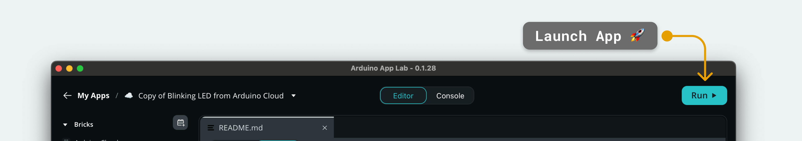

The [Arduino® UNO Q](https://store.arduino.cc/products/uno-q) is supported by the [Arduino Cloud](https://app.arduino.cc/), allowing it to send and receive data over the Internet. Note that the UNO Q requires the [Arduino App Lab](https://docs.arduino.cc/software/app-lab/) to be programmed, which includes the ready-made example that this tutorial is based on. 

The communication with Arduino Cloud is enabled by the UNO Q's microprocessor (MPU) and Wi-Fi® module, and is programmed using Python. Data to and from the Microcontroller (MCU) is handled via the [Bridge](/software/app-lab/tutorials/getting-started/#bridge-tool) tool.

***Currently the UNO Q is set up using the "Manual Device" flow in the Arduino Cloud, using the `SECRET_KEY` and `DEVICE_ID` variables in a Python script running on the board.***

## Goals

In this tutorial, you will learn:
- How to set up the Arduino Cloud.
- How to create a manual device (representing the UNO Q).
- How to turn on an LED on the UNO Q from a dashboard in the Arduino Cloud.

## Hardware & Software Needed

- [Arduino® UNO Q](https://store.arduino.cc/products/uno-q)
- An [Arduino Cloud account](https://login.arduino.cc/login)
- [Arduino App Lab](https://www.arduino.cc/en/software)

## Set up Arduino Cloud

First, we need to set up the Arduino Cloud part, including:
- Creating a Device (manual device type)
- Creating a Thing and a cloud variable
- Creating a dashboard and a widget

To set this up, follow the instructions below:

1. Navigate to the [Arduino Cloud](https://app.arduino.cc/) page and log in / create an account.
2. Go to the [devices](https://app.arduino.cc/devices) page and create a device, selecting the "manual device" type. Follow the instructions and take note of the **device_id** and **secret_key** provided in the setup. 
    
3. Go to the [things](https://app.arduino.cc/things) page and create a new thing.
4. Inside the thing, create a new **boolean** variable, and name it **"led"**. We also need to associate the device we created with this thing.
    
5. Finally, navigate to the [dashboards](https://app.arduino.cc/dashboards), and create a dashboard. Inside the dashboard, click on **"Edit"**, and select the thing we just created. This will automatically assign a switch widget to the **led** variable.
    

## Program the UNO Q (Cloud Example)

To program the UNO Q, we need to use the Arduino App Lab. The example we are going to use is included in the Arduino App Lab.

***If you are new to the UNO Q, you can check out the [Getting Started with Arduino App Lab](https://docs.arduino.cc/software/app-lab/tutorials/getting-started/) guide***

1. Open the Arduino App Lab and connect (using USB / network option).
2. Open the **"Examples"** tab in the left side menu. Here you will find the **"Blinking LED from Arduino Cloud"** example.
3. Duplicate the example by clicking on **"Copy and edit app"** button in the top right corner
   

4. On the App page, click on the **"Arduino Cloud"** Brick, then click on the **"Brick Configuration"** button.
    

5. Enter the cloud credentials (device ID and secret key), replacing the `<YOUR_DEVICE_ID>` and `<YOUR_SECRET>` values. These are the ones retrieved in the Arduino Cloud (previous section).

    

6. Launch the App by clicking on the "Play" button in the top right corner. Wait until the App has launched.
    

## Testing the Cloud Connection

The example works by establishing a connection between the Arduino Cloud and the UNO Q board. When interacting with the dashboard's switch widget (turn ON/OFF), the cloud updates the `led` variable.

The `main.py` script running on the Linux system listens for changes to this property using the `arduino_cloud` Brick. When a change is detected, the **Bridge** tool is used to send data to the microcontroller, and turn the LED ON.

The flow of the App is:
1. The switch in the Arduino Cloud dashboard is changed.
2. The Arduino Cloud updates the device's state.
3. `main.py` receives the updated state, sends a message to the microcontroller which turns the LED to an ON/OFF state.

## Summary

In this tutorial, you learned how to connect the UNO Q with the Arduino Cloud. This connection is done by using the **Arduino Cloud Brick** in the Python script running on the UNO Q's MPU. 

The data that the Python script receives is then sent to the MCU, which turns on the built-in LED on the board. For this, the [Bridge](/software/app-lab/tutorials/getting-started/#bridge-tool) tool is used.

You can read more about the Arduino Cloud & UNO Q through the links below:
- [Arduino Cloud documentation](/arduino-cloud/)
- [Arduino UNO Q documentation](/hardware/uno-q/)
