## Overview

The Arduino UNO Q runs a full Debian Linux operating system on its Qualcomm® QRB2210 microprocessor (MPU), providing a complete computing environment alongside the Arduino microcontroller (MCU).

This guide explains the Debian system, how to access it, navigate the file system, manage permissions, install software, work with USB peripherals, and practices worth keeping in mind.

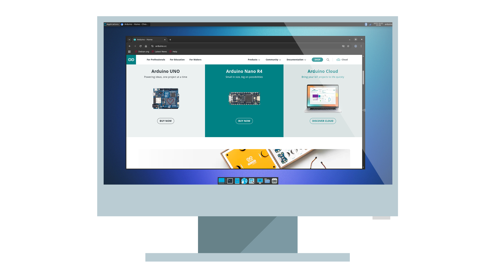

Understanding the Debian system allows you to leverage the full power of Linux for advanced projects, system administration, and development tasks beyond Arduino sketches, thus using the UNO Q to its fullest.

## What Is Debian?

Debian is a free and open-source Linux distribution known for its stability, security, and extensive package ecosystem. On the UNO Q, Debian provides a full Linux environment with standard Unix tools and utilities, allowing you to run multiple applications simultaneously and access thousands of software packages through the `apt` package manager.

The system includes built-in support for network services such as SSH, web servers, and various network protocols, as well as pre-installed development tools, including compilers, interpreters, and development libraries.

### How Debian Works on the UNO Q

The UNO Q features a hybrid architecture with two different processing environments working together. The Qualcomm® QRB2210 microprocessor runs Debian Linux and handles high-level computing tasks, including managing networking capabilities like Wi-Fi® and Bluetooth®, running Python® scripts and Linux applications, and controlling system resources and peripherals.

Working alongside this is the STM32U585 microcontroller running Zephyr RTOS, which runs Arduino sketches, handles real-time operations, controls GPIO pins and hardware interfaces, and communicates with the MPU through the **Bridge** mechanism.

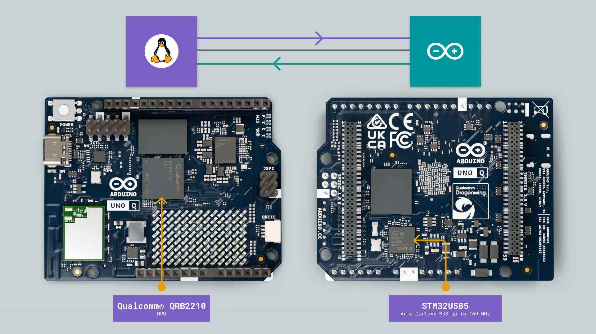

The [Bridge mechanism](https://docs.arduino.cc/tutorials/uno-q/user-manual/#bridge---remote-procedure-call-rpc-library) is the key element that enables uninterrupted communication between both systems. It allows your Python® scripts running on Debian to interact with Arduino code running on the MCU, creating a flexible hybrid development environment that leverages both the computational power of Linux and the real-time capabilities of Arduino.

Python® is the officially supported language for MPU-side development on the UNO Q. As development continues, additional programming languages and alternative methods for MPU/MCU communication will become available, providing more options for integrating custom applications with the hardware.

***If you would like to learn about the UNO Q in general before diving into this Debian guide, please refer to the [__UNO Q user manual__](/tutorials/uno-q/user-manual/) to familiarize yourself with the board.***

## Accessing the Board Shell

There are four methods to access the Debian shell on your UNO Q, each suited for different scenarios and workflows.

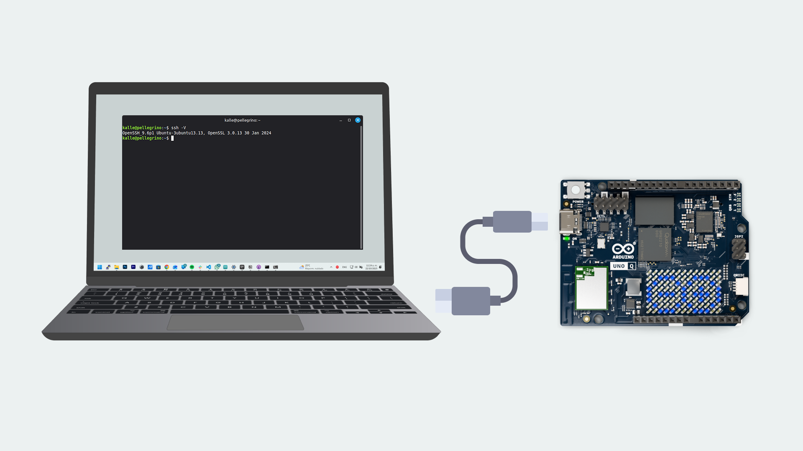

### Through USB-C® (ADB)

The Android Debug Bridge (ADB) provides direct shell access via USB connection, making it ideal for quick access when the board is connected to your computer, without requiring any network setup.

To use this method, you will need a USB-C® cable and ADB tools installed on your computer. Once connected, the board can be verified by running `adb devices`, which lists all connected devices.

```bash
adb devices
```

Then run `adb shell` to enter the board's shell environment. This method is useful during initial setup or when network connectivity is not available.

```bash
adb shell
```

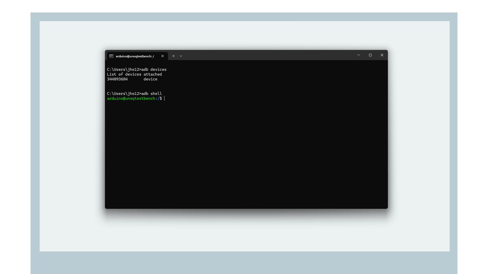

### Through SSH (Network)

Secure Shell (SSH) provides remote access over your local network, allowing you to connect to your board from anywhere on the same network without physical cables.

This method requires that your board is connected to Wi-Fi® and that SSH is enabled, which is enabled after completing the first setup in the Arduino App Lab. **Both your computer and the board must be on the same network for this to work.**

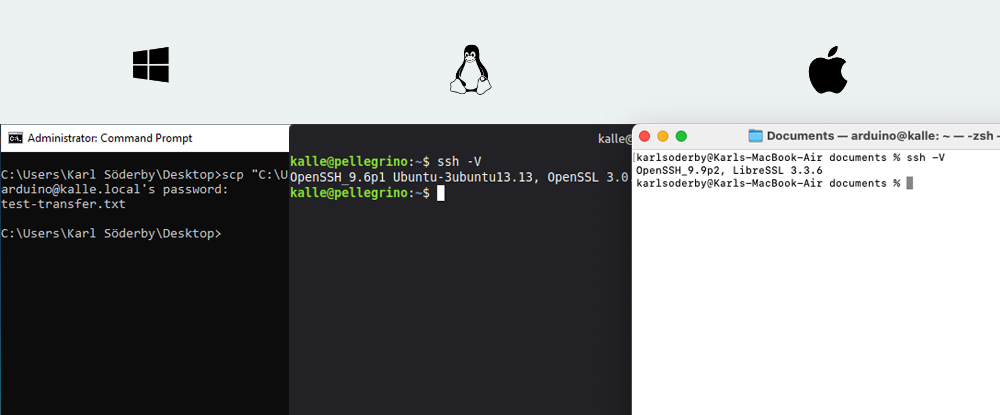

To connect, open a terminal on your computer and run:

```bash
ssh arduino@<boardname>.local
```

Replace `<boardname>` with your actual board name. When connecting for the first time, you will be asked to verify the connection by typing `yes`. After confirming, enter your board's password to gain full shell access. For example, 

```bash
ssh arduino@unoqtestbench.local
```

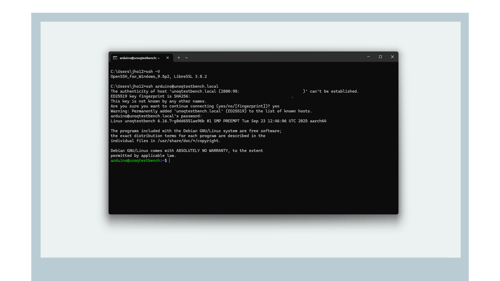

This remote access capability allows you to work on your UNO Q from anywhere on your network, making it easy to manage projects, upload files, and monitor your board without being physically connected.

If you encounter connection issues, particularly with mDNS on certain networks, you can connect directly to the board's IP address instead of its `.local` hostname. Find the IP address by running:

```bash
hostname -I
```

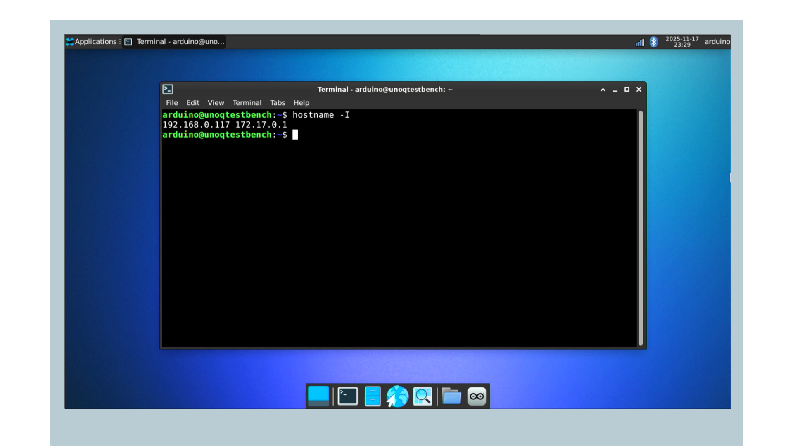

On the board (accessible via ADB or SBC mode).

***For detailed SSH setup, file transfer with SCP, and comprehensive troubleshooting, refer to the dedicated [__UNO Q via Secure Shell (SSH) tutorial__](https://docs.arduino.cc/tutorials/uno-q/ssh/).***

### Through SBC Mode

The single-board computer mode turns your UNO Q into a standalone desktop computer with a graphical user interface. To use this mode, you will need a [*USB-C® dongle with external power delivery*](https://store.arduino.cc/products/usb-c-to-hdmi-multiport-adapter-with-ethernet-and-usb-hub), an HDMI display, and a USB keyboard and mouse.


***You can use any USB-C dongle with external power delivery capabilities except for [Apple](https://www.apple.com/shop/product/mw5m3am/a/usb-c-digital-av-multiport-adapter) ones.***

Connect all peripherals through the USB-C® dongle, power on the system, and log in using your credentials. Once logged in, you can open the Terminal application directly from the desktop environment, giving you shell access alongside the graphical interface.

This method is ideal when you want to use your UNO Q as a workstation, allowing you to browse the web, edit files graphically, and access the terminal all from the same device.

***For a complete Single-Board Computer mode tutorial, refer to the dedicated [__UNO Q Single-Board Computer tutorial__](https://docs.arduino.cc/tutorials/uno-q/single-board-computer/).***

### Through Hardware Debug UART

For low-level debugging and early boot diagnostics, the board provides a dedicated Hardware Debug UART interface operating at 1.8 V logic levels (115200 baud) through the JCTL connector.


This interface connects directly to the SoC's main console (TTY), allowing you to monitor boot and kernel logs, troubleshoot system issues, or access a shell environment before network services like SSH or ADB are available. You can log in using your Linux credentials to interact with the system through the shell.

***This method requires a 1.8V USB-to-TTL converter and is intended for advanced users. For complete setup instructions and technical specifications, refer to the [__Hardware Debug UART Interface__](/tutorials/uno-q/user-manual/#hardware-debug-uart-interface) section in the user manual.***

## System Navigation

### Understanding the File System

Debian organizes files in a hierarchical directory structure, with the root directory `/` at the top level and all other directories below it.

For most UNO Q projects, you will mostly work within `/home/arduino/`, your default user directory.

Within your home directory, the `ArduinoApps/` folder is important because it contains all the Apps you create with Arduino App Lab, each stored in its own subdirectory.

```
/                         # Root directory (top level)
├── home/
│   └── arduino/          # Your working directory
│       └── ArduinoApps/  # Your Arduino App Lab projects
├── tmp/                  # Temporary files (cleared on reboot)
└── mnt/                  # Mount points for USB drives
```

When navigating the system, you will spend most of your time in `/home/arduino/`. The `/tmp/` directory is useful for temporary files, and `/mnt/` becomes relevant when you mount USB storage devices.

### Navigation Commands

The `cd` command is a frequently used tool for navigating the directory structure. Running `cd ~` takes you directly to your home directory, while `cd /home/arduino/Documents` navigates to a specific path.

```bash
cd ~
```

```bash
cd /home/arduino/Documents
```

To move up one directory level, use `cd ..`, and to return to your previous directory, use `cd -`. Your command prompt will change to show your current directory location, helping you keep track of where you are in the file system.

```bash
cd ..
```

```bash
cd -
```

To see the contents of a directory, use the `ls` command. Running `ls` alone shows a basic listing of files and directories. The `ls -lh` command provides a detailed listing with permissions, ownership, and human-readable file sizes.

```bash
ls
```

```bash
ls -lh
```

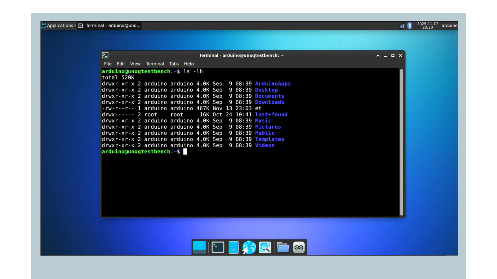

Adding the `-a` flag with `ls -a` reveals hidden files that start with a dot, and you can combine multiple options like `ls -lah` to see all files with full details in a readable format.

```bash
ls -a
```

```bash
ls -lah
```

When you run `ls -lah`, you will see output similar to this:

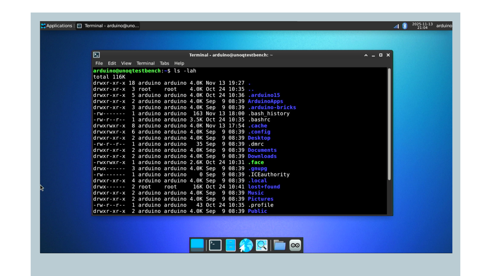

If you ever need to know exactly where you are in the directory structure, the `pwd` command prints your current working directory.

For example, running `pwd` might display `/home/arduino/Documents`, confirming your current location in the file system.

```bash
pwd
```

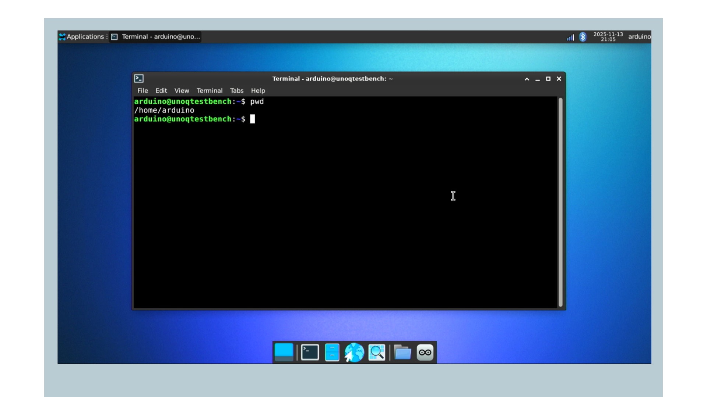

### File Operations

Creating directories is simple with the `mkdir` command. Running `mkdir my_project` creates a new directory in your current location.

```bash
mkdir my_project
```

On the other hand, `mkdir -p projects/arduino/sketches` creates all nested directories at once, including any intermediate directories that don't already exist. This is useful when setting up complex project structures.

```bash
mkdir -p projects/arduino/sketches
```

The `cp` command handles file copying operations. To copy a single file, use `cp source.txt destination.txt`, which creates a duplicate with a new name.

```bash
cp source.txt destination.txt
```

When working with directories, you will need the recursive flag: `cp -r source_folder/ destination_folder/` copies the entire directory and all its contents. This is essential when you need to back up or duplicate project folders.

```bash
cp -r source_folder/ destination_folder/
```

Both moving and renaming files use the `mv` command.

The difference is in how you use it: `mv oldname.txt newname.txt` renames a file in the current directory.

```bash
mv oldname.txt newname.txt
```

While `mv file.txt /home/arduino/Documents/` moves the file to a different location. Unlike copying, moving doesn't create a duplicate. It relocates the original file.

```bash
mv file.txt /home/arduino/Documents/
```

Deleting files requires attention. The `rm file.txt` command permanently removes a file, while `rm -r folder/` deletes an entire directory and its contents.

```bash
rm file.txt
```

```bash
rm -r folder/
```

The most effective but dangerous variant is `rm -rf folder/`, which forcefully deletes everything without asking for confirmation. This command should be used with extreme care, as deleted files cannot be recovered.

```bash
rm -rf folder/
```

***The `rm -rf` command permanently deletes files without confirmation and cannot be undone. Always double-check the path before running this command to avoid accidental data loss.***

## Permissions and Superuser Access

### Understanding Linux Permissions

Every file and directory in Debian has associated permissions that control who can **read**, **write**, or **run** it.

- The **read** permission allows viewing the contents of a file or listing the contents of a directory.
- The **write** permission allows modifying or deleting files.
- While the **run** permission allows running files as programs or accessing directories.

These permissions are assigned to three categories of users:

- The owner who created the file
- Users in the same group as the file
- All other users on the system.

This permission system provides controlled access to files and system security.

### Using `sudo` (Superuser Do)

Many system operations require administrator privileges to prevent unintended modifications to critical system files. The `sudo` command allows you to run commands with superuser privileges *temporarily*.

For example, installing software usually requires elevated privileges, so you would use `sudo apt install package-name`.

```bash
sudo apt install package-name
```

Similarly, editing system configuration files like `sudo nano /etc/network/interfaces` needs superuser access.

```bash
sudo nano /etc/network/interfaces
```

When controlling system services with commands like `sudo systemctl restart networking`, or accessing protected directories such as `sudo ls /root`, you will be prompted for your password before the command runs. This security measure proves that critical system changes are intentional and authenticated.

```bash
sudo systemctl restart networking
```

```bash
sudo ls /root
```

### Changing File Permissions

The `chmod` command modifies file and directory permissions. When you need to make a script executable, run `chmod +x script.sh` adds execute permission, allowing you to run the script with `./script.sh`.

```bash
chmod +x script.sh
```

For more control, you can use numeric notation like `chmod 755 script.sh`, which grants the owner full read, write, and run permissions, while others can only read and run the file.

```bash
chmod 755 script.sh
```

When you need to apply permissions to an entire directory and its contents, the recursive flag `chmod -R 755 folder/` makes sure all files within the folder bind to the same permissions.

```bash
chmod -R 755 folder/
```

Common permission codes you will encounter include `755`, which gives the owner full control, while others can read and run.

- `644` allows the owner to read and write, while others can only read.
- `777` grants everyone full access and should be used with precaution due to security implications.

### Changing Ownership

File ownership can be modified using the `chown` command, which is useful when files are created with incorrect ownership or need to be transferred between users.

```bash
sudo chown arduino file.txt
```

Running `sudo chown arduino file.txt` changes the file's owner to the Arduino user. You can simultaneously change both the owner and group with `sudo chown arduino:arduino file.txt`.

```bash
sudo chown arduino:arduino file.txt
```

For entire directory structures, the recursive option `sudo chown -R arduino:arduino /home/arduino/project/` makes sure all files within the project folder have the corresponding ownership.

```bash
sudo chown -R arduino:arduino /home/arduino/project/
```

## File Management

### Viewing File Contents

When you need to view the contents of a text file, Debian provides several tools suited for different scenarios.

The simplest is `cat file.txt`, which prints the entire file directly to your terminal. This works well for short files but can be overwhelming for longer documents.

```bash
cat file.txt
```

For larger files, the `less file.txt` command opens a scrollable viewer where you can navigate using arrow keys, search for text with `/`, and exit by pressing `q`. It provides much more control over how you read the file.

```bash
less file.txt
```

Sometimes you only need to see the beginning or end of a file. The `head file.txt` command shows the first 10 lines, while `tail file.txt` displays the last 10 lines.

```bash
head file.txt
```

```bash
tail file.txt
```

You can customize the number of lines shown with commands like `head -n 20 file.txt`.

```bash
head -n 20 file.txt
```

The `tail -f` command is useful as it continuously monitors a file and displays new lines as they are added. It is ideal for watching log files or monitoring output in real-time.

```bash
tail -f mylogfile.txt
```

For monitoring system logs on the UNO Q, the `journalctl` command can be used which shows system log in real-time:

```bash
sudo journalctl -f
```

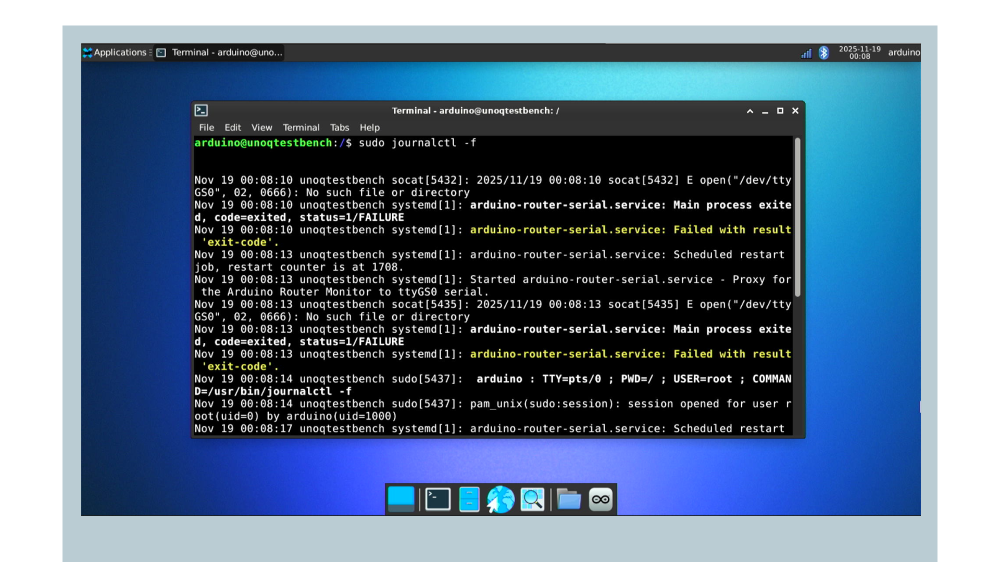

### Editing Files with Nano

Nano is a user-friendly terminal text editor that comes pre-installed on the UNO Q, making it a choice for editing configuration files and scripts from the command line.

To edit a file, run `nano myfile.txt`, which will either open the existing file or create a new one if it doesn't exist.

```bash
nano myfile.txt
```

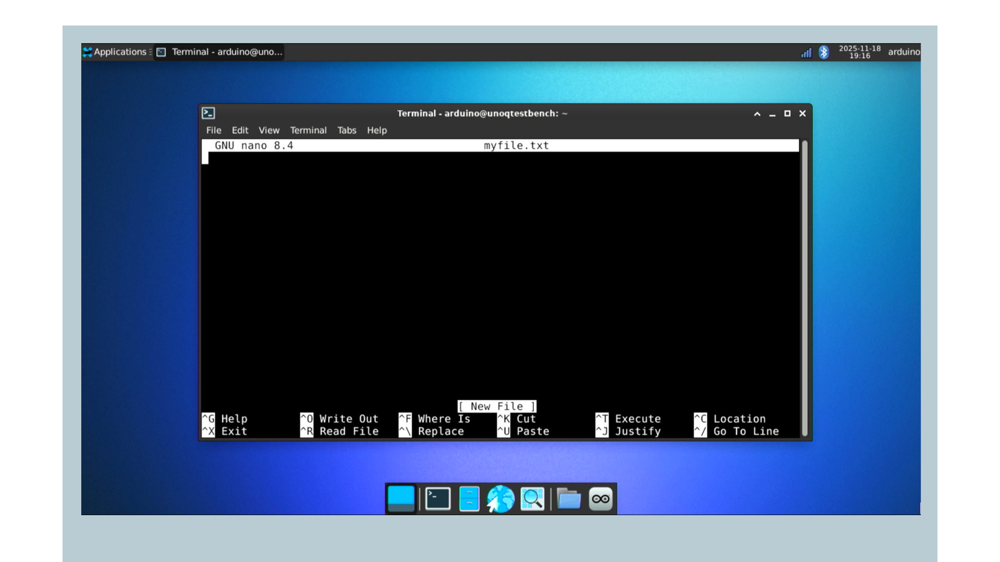

When editing system files that require elevated privileges, prefix the command with sudo, like `sudo nano /etc/hostname`.

```bash
sudo nano /etc/hostname
```


Once inside Nano, use the arrow keys to move through your text, and you will see a helpful menu at the bottom showing available commands.

To save your changes, press **CTRL + O** (write **O**ut), confirm the filename, and press *Enter*. Other useful commands are:

- **CTRL + X** to exit nano
- **CTRL + K** to cut the current line
- **CTRL + U** to paste it elsewhere
- **CTRL + W** to search for text
- **CTRL + G** to access the full help menu

When you press `CTRL + O` to save, Nano will write your changes to storage, making them permanent.

### Searching Files and Content

The `find` command helps locate files based on various criteria. To find all Python files in your home directory, run `find /home/arduino -name "*.py"`, which searches recursively through all subdirectories.

```bash
find /home/arduino -name "*.py"
```

You can also search based on modification time. For example, `find /home/arduino -mtime -7` finds all files modified in the last seven days. It is useful for locating recently changed files in large directory structures.

```bash
find /home/arduino -mtime -7
```

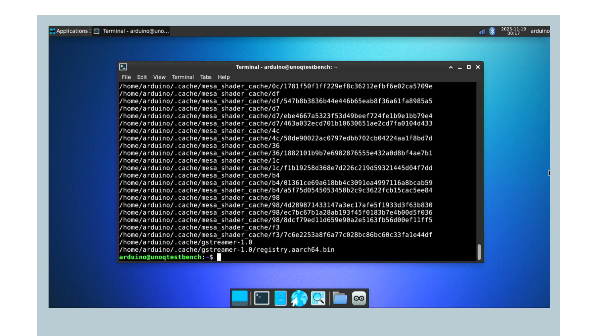

For searching within file contents rather than filenames, the `grep` command is useful. Running `grep "Arduino" file.txt` searches for the word `"Arduino"` in a specific file and displays matching lines.

```bash
grep "Arduino" file.txt
```

To search through an entire directory structure, use `grep -r "TODO" /home/arduino/`, which recursively searches all files for the text `"TODO"`.

```bash
grep -r "TODO" /home/arduino/
```

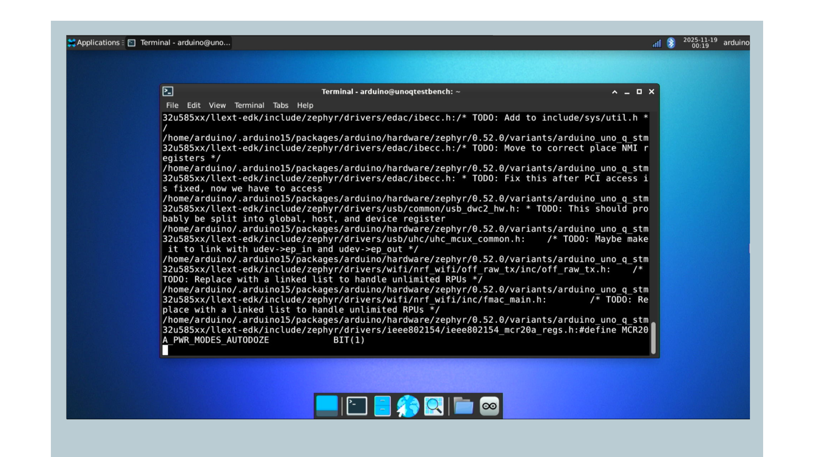

The case-insensitive option `grep -i "arduino" file.txt` will match `"Arduino"`, `"arduino"`, and `"ARDUINO"`, making searches more flexible.

```bash
grep -i "arduino" file.txt
```

## Package Management

Debian uses the *Advanced Package Tool*, commonly known as `apt`, to manage software installation, updates, and removal. This system handles dependencies automatically, making sure that when you install a program, all required supporting libraries and tools are installed as well.

### Updating Package Lists

Before installing new software or upgrading your system, it is essential to update your package lists to make sure you are using the latest versions.

Running `sudo apt update` downloads the most current package information from Debian's repositories. You will see output listing the various repositories being checked, followed by a summary of available upgrades.

```bash
sudo apt update
```

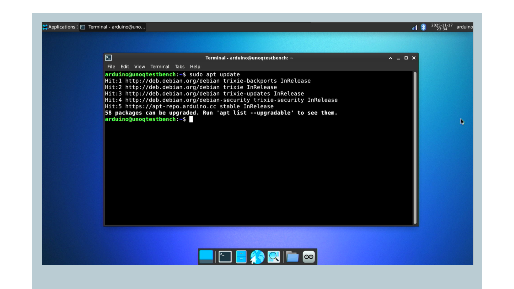

The output will show something like:

```bash
Hit:1 http://deb.debian.org/debian trixie-backports InRelease
Hit:2 http://deb.debian.org/debian trixie InRelease
Hit:3 http://deb.debian.org/debian trixie-updates InRelease
Hit:4 http://deb.debian.org/debian-security trixie-security InRelease
Hit:5 https://apt-repo.arduino.cc stable InRelease
58 packages can be upgraded. Run 'apt list --upgradable' to see them.
```

In case all available packages are up-to-date, the following result can be seen:


This process does not install anything. It refreshes your system's knowledge of available software versions. The `Hit` messages indicate that your package lists are synchronized with the repositories. If packages can be upgraded, the system will notify you with a count.

### Upgrading Your System

After updating the package lists, you can upgrade installed packages to their latest versions. The `sudo apt upgrade` command updates all installed packages while remaining conservative about dependencies, providing system stability.

```bash
sudo apt upgrade
```

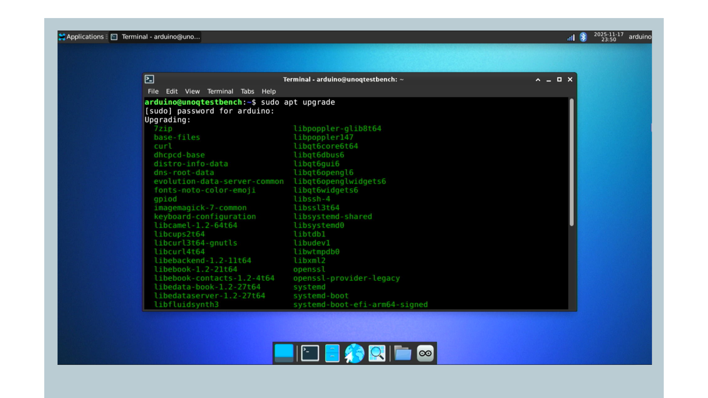

For more comprehensive updates that may change package dependencies or install new packages required by upgrades, use `sudo apt full-upgrade`. This command handles complex upgrade scenarios and is more thorough than the standard upgrade.

```bash
sudo apt full-upgrade
```

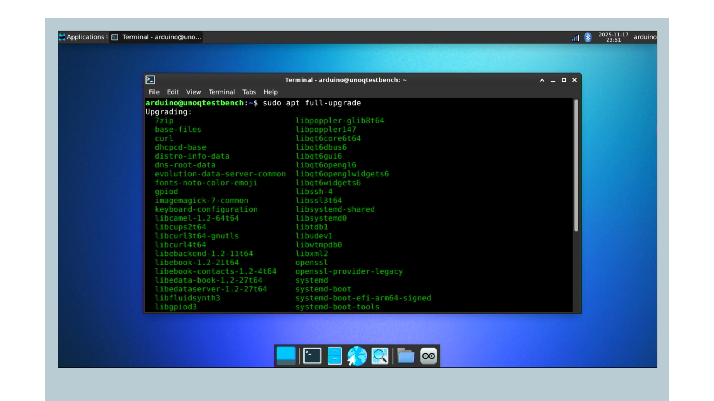

Regular updates help to have the latest security patches and bug fixes, keeping your UNO Q secure and stable. It is a good practice to run `sudo apt update && sudo apt upgrade` regularly to keep your system up to date.

***For major system updates or OS version upgrades, it is recommended to use the image flashing procedure described in the dedicated [__UNO Q image flash tutorial__](https://docs.arduino.cc/tutorials/uno-q/update-image/).***

### Installing Software

Installing software with *apt* is straightforward. To install a single package, use `sudo apt install package-name`, which downloads the package and all its dependencies, then installs everything automatically.

```bash
sudo apt install package-name
```

You can install multiple packages in a single command by separating them with spaces, like `sudo apt install python3-pip git curl`. During installation, *apt* will show you what will be installed and ask for confirmation before proceeding.

```bash
sudo apt install python3-pip git curl
```

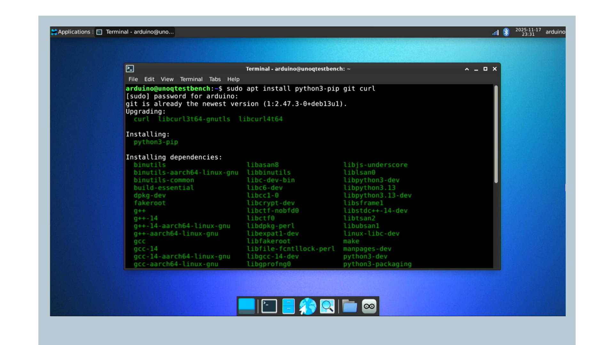

For example, if you want to install the *Vim* text editor, running `sudo apt install vim` will download Vim and any required libraries, then configure everything so it is ready to use immediately.

```bash
sudo apt install vim
```

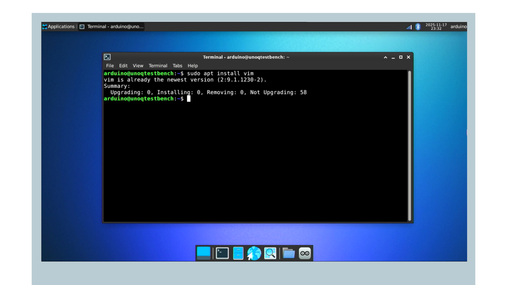

The package manager handles all the complexity behind the scenes, making software installation simpler than manual compilation and configuration. If a package is already installed, it will prompt for the package's availability and the installed version.

### Searching and Managing Packages

When you're not sure of the exact package name, the `apt search keyword` command helps you find packages related to a topic.

For instance, `apt search python3` will list all available packages related to Python 3, with brief descriptions of each. It is useful for exploring the tools available for a specific task or programming language. The following command searches for available packages in general:

```bash
apt search keyword
```

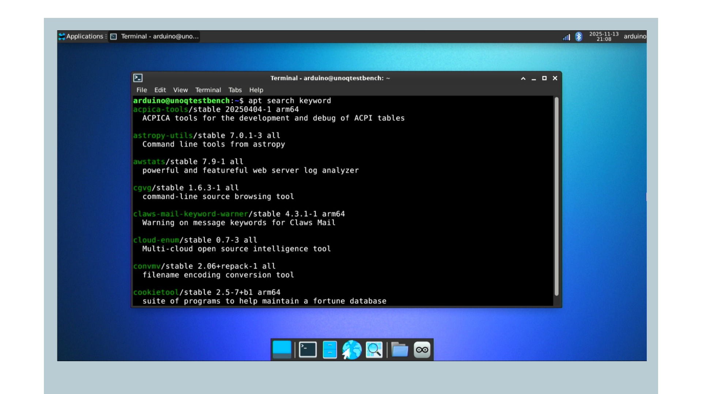

For example, to find Python related packages:

```bash
apt search python3
```


Removing software is as simple as well. The command `sudo apt remove package-name` uninstalls the package but preserves any configuration files you may have customized.

```bash
sudo apt remove package-name
```

If you want to completely remove a package including its configuration files, use `sudo apt purge package-name` instead. Over time, your system may accumulate unused dependencies from previously installed packages.

```bash
sudo apt purge package-name
```

Running `sudo apt autoremove` cleans them up automatically, freeing disk space by removing packages no longer needed.

```bash
sudo apt autoremove
```

## USB and Peripherals Access

### Detecting USB Devices

When you connect a USB device to the UNO Q through a USB-C® dongle in SBC mode, Debian detects and registers it.

The `lsusb` command provides a quick overview of all connected USB devices, showing manufacturer IDs, product IDs, and device descriptions. You might see listings for your keyboard, mouse, camera, or other peripherals.

```bash
lsusb
```

The output shows connected devices in a format like:

```
Bus 002 Device 001: ID 1d6b:0003 Linux Foundation 3.0 root hub
Bus 001 Device 003: ID 046d:c52b Logitech, Inc. USB Keyboard
Bus 001 Device 002: ID 093a:2510 USB Camera
```

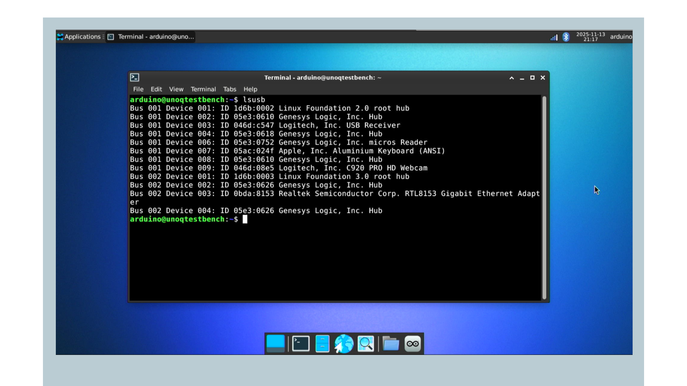

For more detailed information about USB devices, including power requirements, transfer speeds, and device capabilities, you can use `lsusb -v` for verbose output, or `lsusb -t` to see the USB device tree showing how devices are connected through hubs and ports.

This detailed view is useful when troubleshooting USB issues or understanding power distribution across multiple devices. The following command shows detailed USB information:

```bash
lsusb -v
```

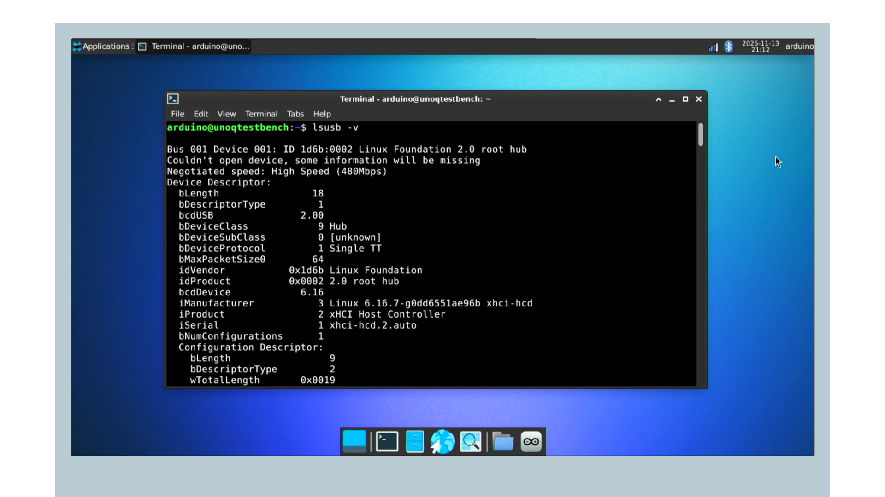

The following command shows information about the USB device tree:

```bash
lsusb -t
```

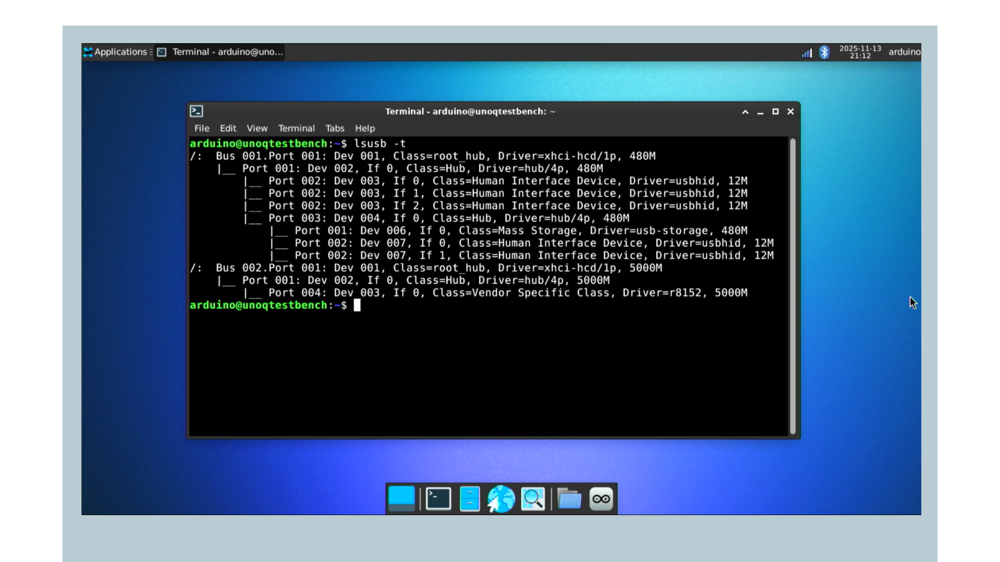

### Working with USB Storage Devices

When you connect a USB flash drive or external hard drive in SBC mode to the desktop environment, the system typically auto-mounts it at `/media/arduino/`, making it accessible in the file manager.

However, when working from the command line or in headless mode, you will need to mount drives manually.

First, identify your USB drive by running `lsblk`, which lists all block devices and their partitions. You will see output showing device names like `/dev/sdb1` along with their sizes and mount points.

```bash
lsblk
```

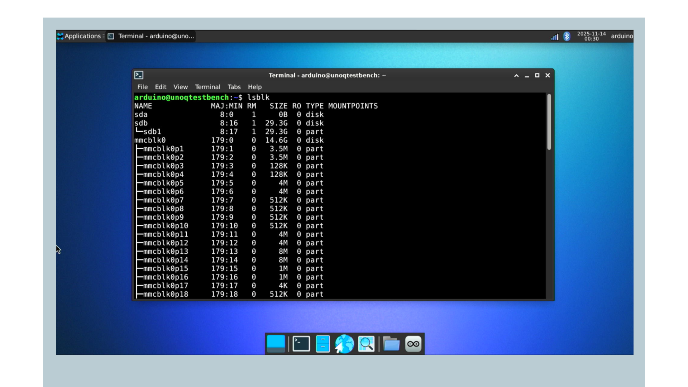

To mount a USB drive manually, create a mount point directory with `sudo mkdir -p /mnt/usb`, then mount the device using `sudo mount /dev/sdb1 /mnt/usb`. The USB drive's contents are now accessible at `/mnt/usb`.

```bash
sudo mkdir -p /mnt/usb
```

```bash
sudo mount /dev/sdb1 /mnt/usb
```

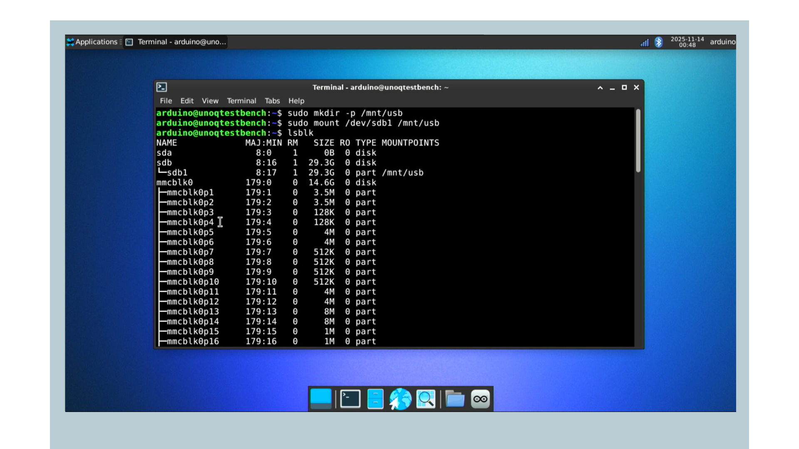

When you're finished working with the drive, always unmount it properly using `sudo umount /mnt/usb` before physically disconnecting it to prevent data corruption.

```bash
sudo umount /mnt/usb
```

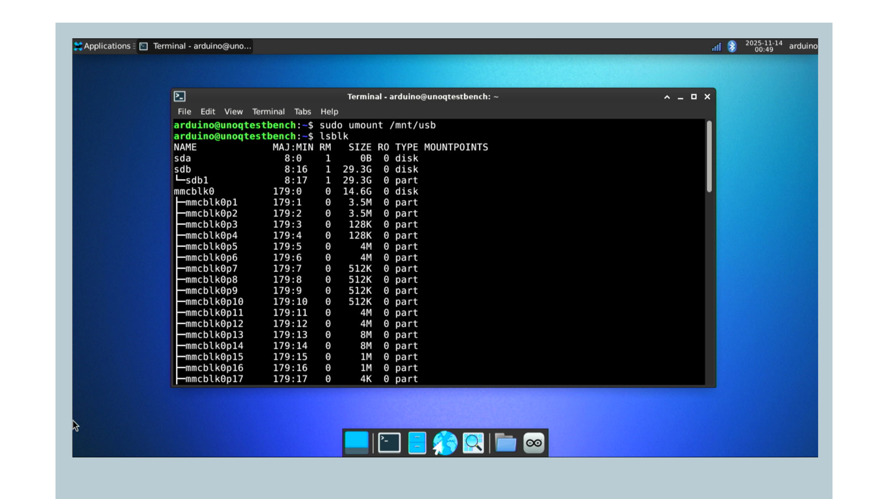

### USB Cameras

USB cameras register as video devices in the `/dev/` directory. Running `ls /dev/video*` lists all available video devices, including both physical cameras and virtual video devices. The output will typically show `/dev/video0`, `/dev/video1`, and so on.

```bash
ls /dev/video*
```

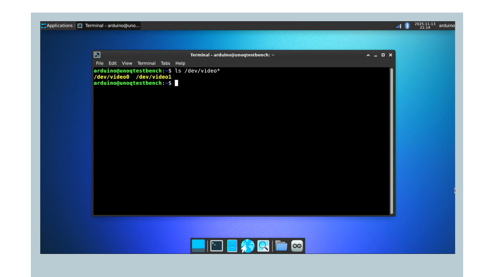

To test and use USB cameras on the UNO Q, we can install and use **Cheese**, a user-friendly camera application with a graphical interface. Install it with `sudo apt install cheese` and launch it with the `cheese` command.

```bash
sudo apt install cheese
```

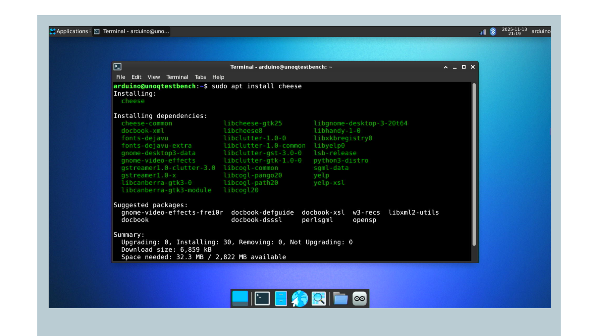

```bash
cheese
```

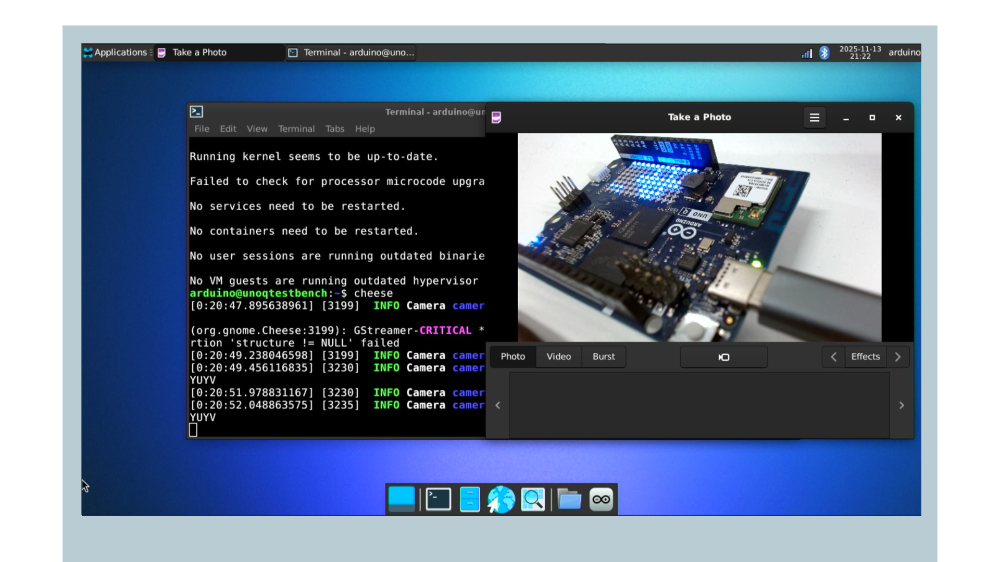

This opens a window showing your camera feed with options to take photos or record videos, making it easy to test camera functionality without writing code. Cheese automatically detects and configures your camera, handling all the technical details in the background.

For camera access in your development projects, Python libraries like OpenCV (`python3-opencv`) provide camera control and image processing capabilities, which integrate well with Arduino App Lab Python scripts.

```bash
sudo apt install python3-opencv
```

### Serial Devices

USB serial devices, including Arduino boards and USB-to-serial adapters, appear in the system as special device files in the `/dev/` directory, typically named `/dev/ttyUSB*` for generic USB serial devices or `/dev/ttyACM*` for devices that implement the USB Communications Device Class. You can list all serial ports by running `ls /dev/tty*`, though this will show many entries, including virtual terminals.

To interact with a serial device, the `screen` utility provides a simple terminal interface. First install it with `sudo apt install screen`, then connect to your serial device using `screen /dev/ttyUSB0 115200`, where 115200 is the baud rate.

This opens a terminal session connected to the serial port. To exit the screen, press **CTRL+A**, then press **K**, and finally press **Y** to confirm.

```bash
sudo apt install screen
```

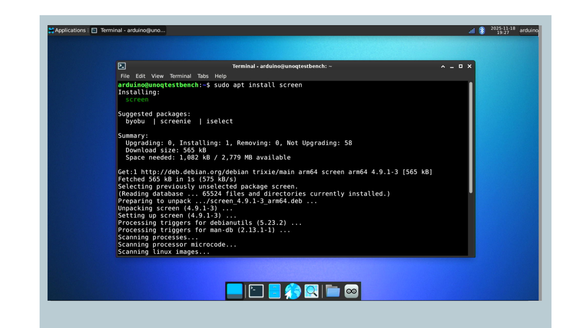

```bash
screen /dev/ttyUSB0 115200
```

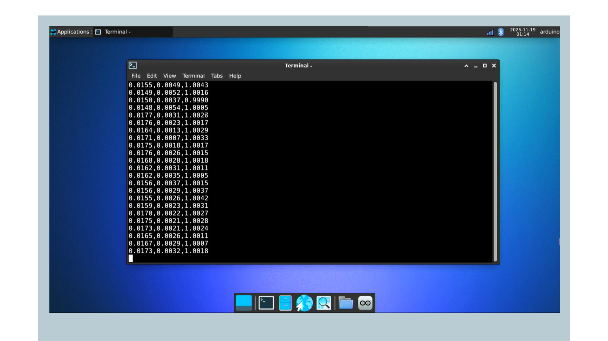

Serial devices are often configured with restricted permissions by default. Running `ls -l /dev/ttyUSB0` might show that only users in the `dialout` group have access.

```bash
ls -l /dev/ttyUSB0
```

To grant your user account access to serial ports, add yourself to the dialout group with `sudo usermod -a -G dialout arduino`. This change takes effect after you log out and back in. After this one-time setup, you will be able to access serial devices without needing sudo permissions.

```bash
sudo usermod -a -G dialout arduino
```

## Arduino App CLI

The Arduino UNO Q comes with the Arduino App CLI (`arduino-app-cli`) pre-installed, a command-line tool for managing and controlling Arduino App Lab applications directly from the terminal.

This tool allows you to build, start, stop, and manage Apps without using the graphical Arduino App Lab interface, making it ideal for automation, remote management via SSH, or headless operation.

### Managing Apps

Your Arduino Apps are stored in the `~/ArduinoApps/` directory. Navigate there to see all available projects:

```bash
cd ~/ArduinoApps/
```

Using the following command shows all your Arduino App Lab projects:

```bash
ls
```

These Arduino App Lab projects are examples from the **My Apps** space.

Each App directory contains your sketch code, Python scripts, and the `app.yml` configuration file.

When an App runs, persistent data is saved in the `data/` folder within the App directory, while supporting files, such as the Python virtual environment, are stored in the `.cache/` folder.

To list all available Apps on your board, use:

```bash
arduino-app-cli app list
```

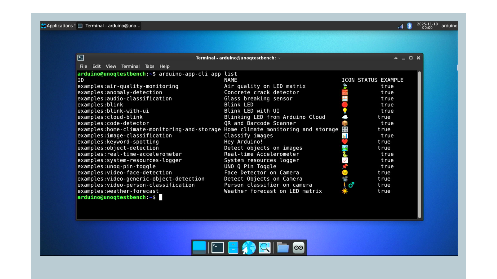

To start or stop Apps from the command line, use the following command format:

```bash
arduino-app-cli app start user:my-app
```

For example, to start an example App, use:

```bash
arduino-app-cli app start examples:blink
```

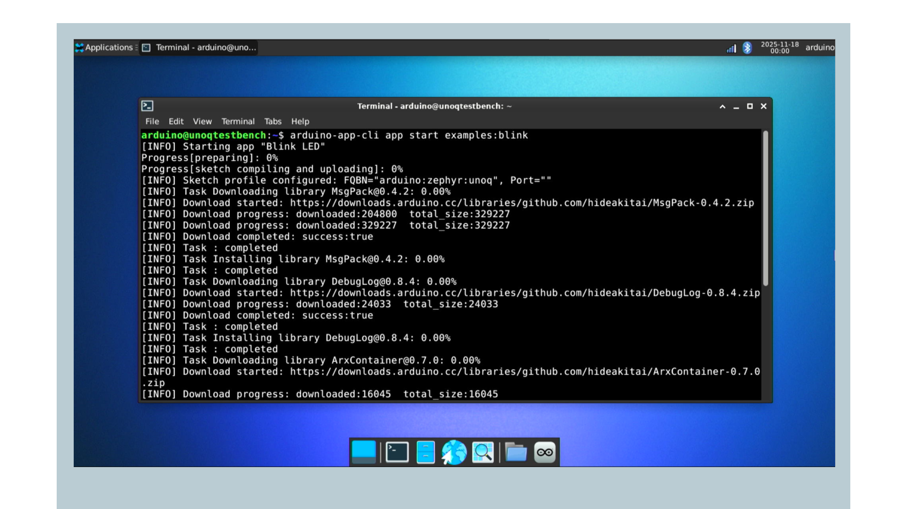

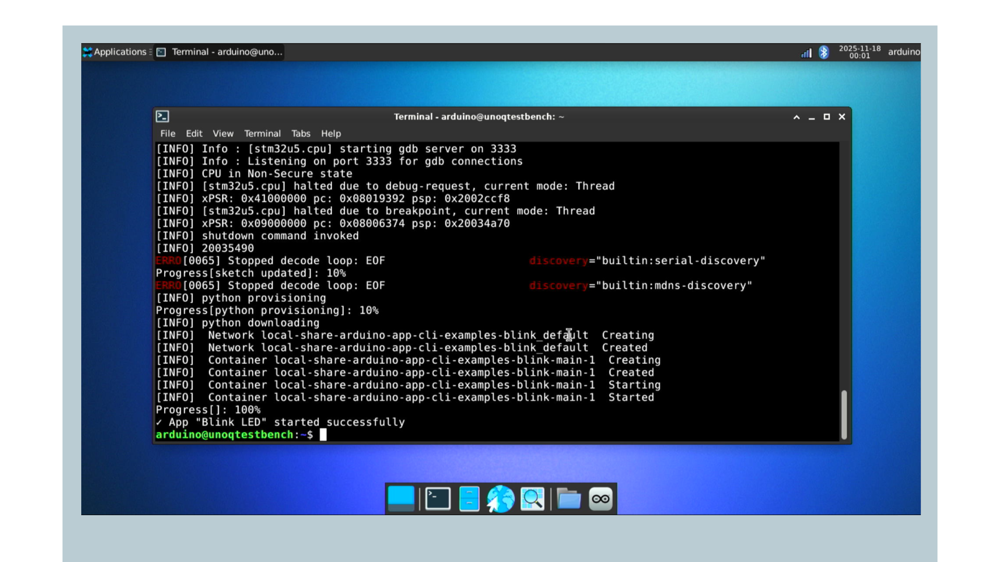

To stop a running App, use:

```bash
arduino-app-cli app stop user:my-app
```

For example, to stop the running Blink LED App, use:

```bash
arduino-app-cli app stop examples:blink
```

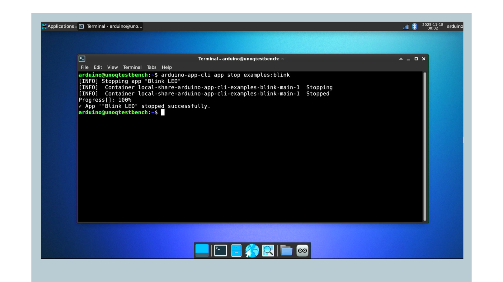

### System and Network Configuration

The Arduino App CLI also provides system management commands. One useful feature is enabling or disabling network mode, which allows Arduino App Lab desktop application to connect to your board remotely.

The following command can enable or disable network mode for remote Arduino App Lab access:

```bash
arduino-app-cli system network-mode <enable/disable>
```

Then, you can use the following command to check the network mode status:

```bash
arduino-app-cli system network-mode status
```

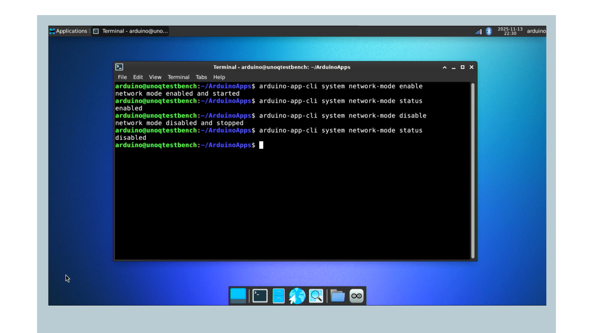

Network mode is automatically enabled during the first setup, but these commands let you control it manually if needed.

### Working with Apps

For building, starting, and stopping Apps, **Arduino App Lab** (either the desktop application or when running on the board in SBC mode) is the recommended interface.

The App Lab automatically handles compilation, deployment, and execution of both the Linux and microcontroller components.

If you need to view or edit App files manually, navigate to the App directory and use standard Linux commands:

```bash
cd ~/ArduinoApps/MyApp
```

Using the following command will view the App configuration:

```bash
cat app.yaml
```

Using the following command will view the Arduino sketch content:

```bash
cat sketch/sketch.ino
```

Using the following command will view the Python script content:

```bash
cat main.py
```

***For comprehensive Arduino App CLI documentation, including creating Apps, monitoring logs, managing Bricks, and system updates, please refer to the dedicated [__Arduino App CLI tutorial__](https://docs.arduino.cc/software/app-lab/tutorials/cli/).***

### Arduino CLI

The standard Arduino CLI tool (`arduino-cli`) is also available on the UNO Q for users who need direct access to Arduino core management, library installation, and sketch compilation outside of the Arduino App Lab ecosystem.

This tool is independent of Arduino App Lab and follows the standard Arduino CLI workflow. The following command can be used to check the `arduino-cli` version and the availability:

```bash
arduino-cli version
```


For UNO Q development, **Arduino App Lab and [`arduino-app-cli`](#arduino-app-cli) are the recommended tools** as they are specifically designed for the board's architecture and handle communication between the MPU and MCU automatically.

The standard `arduino-cli` is useful for users who need to manage cores and libraries manually or work with other Arduino boards connected to the UNO Q.

***For detailed Arduino CLI documentation, visit the [official Arduino CLI documentation](https://arduino.github.io/arduino-cli/).***

## System Monitoring

### Checking System Resources

Understanding your system's resource usage helps identify performance bottlenecks and troubleshoot issues.

The `top` command provides an interactive, real-time view of running processes, showing CPU and memory usage for each process.

Press `q` to quit the top interface. It is useful when tracking down which program is consuming excessive resources.

```bash
top
```

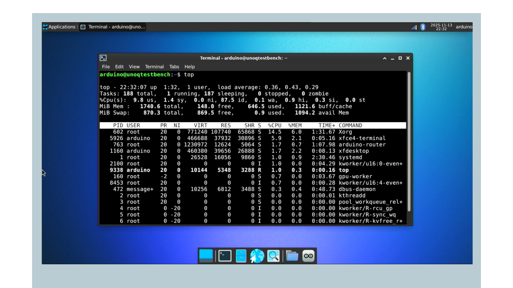

Disk space management is crucial, especially on the UNO Q's eMMC storage. The `df -h` command displays disk usage for all mounted filesystems in human-readable format (MB, GB), showing total size, used space, available space, and mount points.

It helps you monitor storage consumption and identify when you are running low on space.

```bash
df -h
```

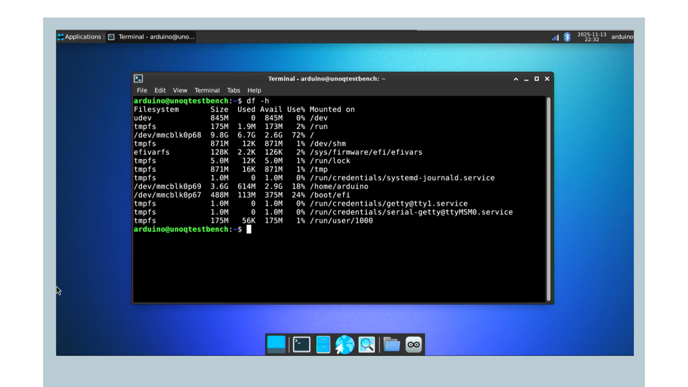

To see how much space individual directories are consuming, use `du -sh *` in any directory.

This summarizes the size of each item in the current location, making it easy to identify large directories that might be good candidates for cleanup.

```bash
du -sh *
```

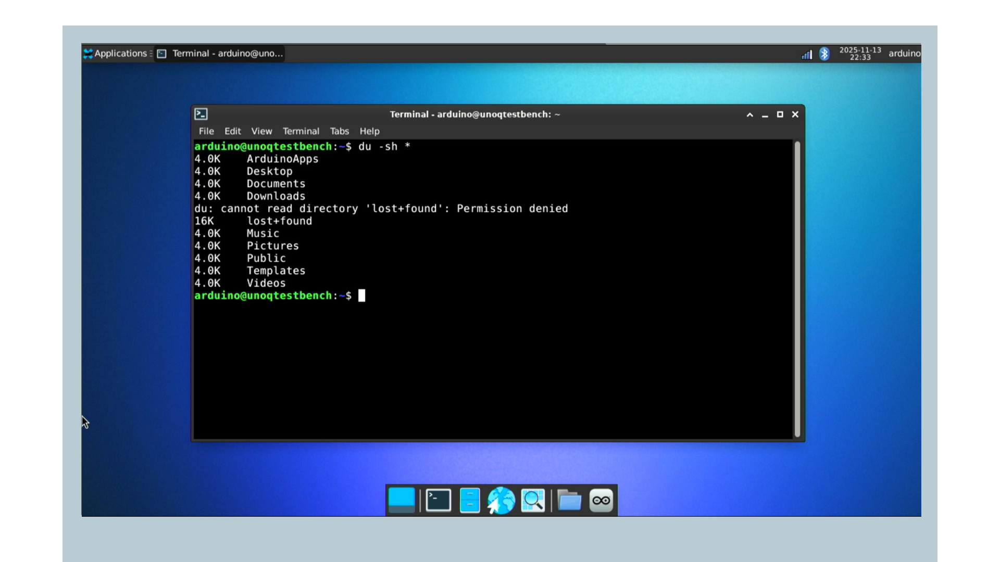

The `free -h` command displays memory usage statistics, showing total RAM, used memory, free memory, and swap space in a human-readable format. The `-h` flag displays sizes in human-readable format rather than raw byte counts.

This helps you determine whether your applications are consuming too much memory or whether you have sufficient resources for new programs.

```bash
free -h
```

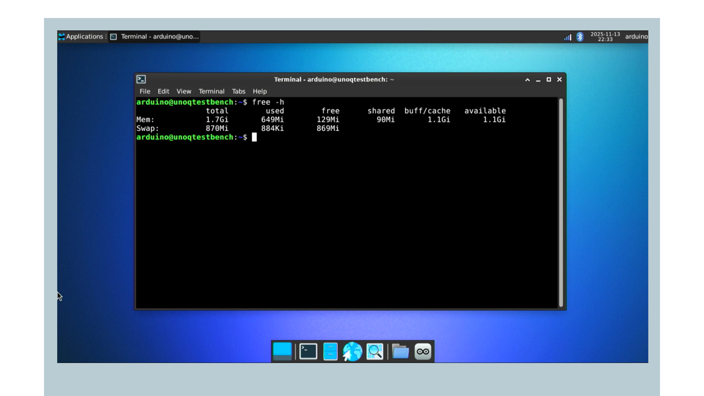

### System Information

Several commands provide detailed information about your UNO Q's hardware and software configuration. The `uname -a` command displays comprehensive Linux kernel information, including the version, build date, and architecture.

```bash
uname -a
```

To specifically see which Debian version you are running, examine `/etc/os-release` with `cat /etc/os-release`, which lists the operating system name, version, and other distribution details.

```bash
cat /etc/os-release
```

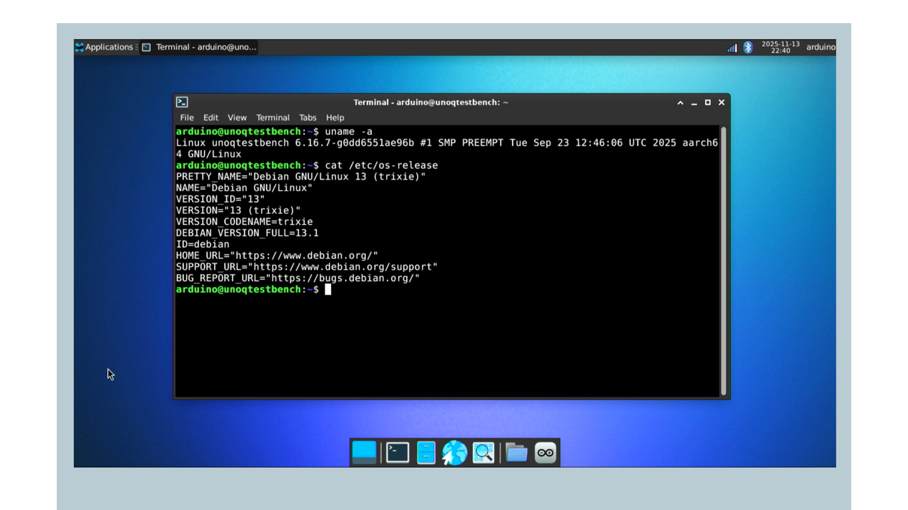

For detailed CPU information, including model, core count, clock speed, and supported features, use `lscpu`.

```bash
lscpu
```

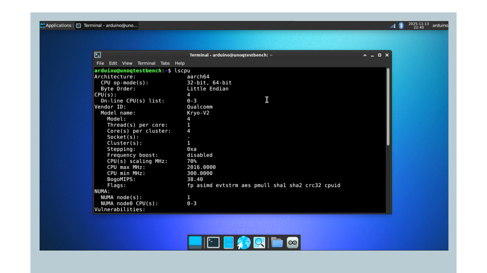

## Network Management

### Checking Network Status

The `ip addr` command displays all network interfaces along with their IP addresses, MAC addresses, and current state.

This shows both your physical interfaces, such as `wlan0` for Wi-Fi® and `eth0` for Ethernet, as well as virtual interfaces. The output includes IPv4 and IPv6 addresses, helping you determine how your board is connected to the network.

```bash
ip addr
```

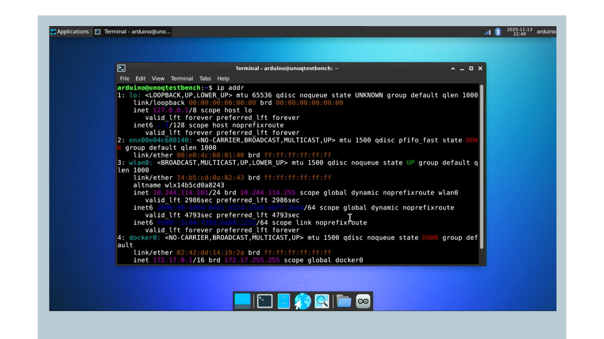

To see which interfaces are currently active or inactive, use `ip link show`. This displays the link state for each interface, indicating whether it's UP (active) or DOWN (inactive), along with other properties such as MAC addresses and supported features.

```bash
ip link show
```

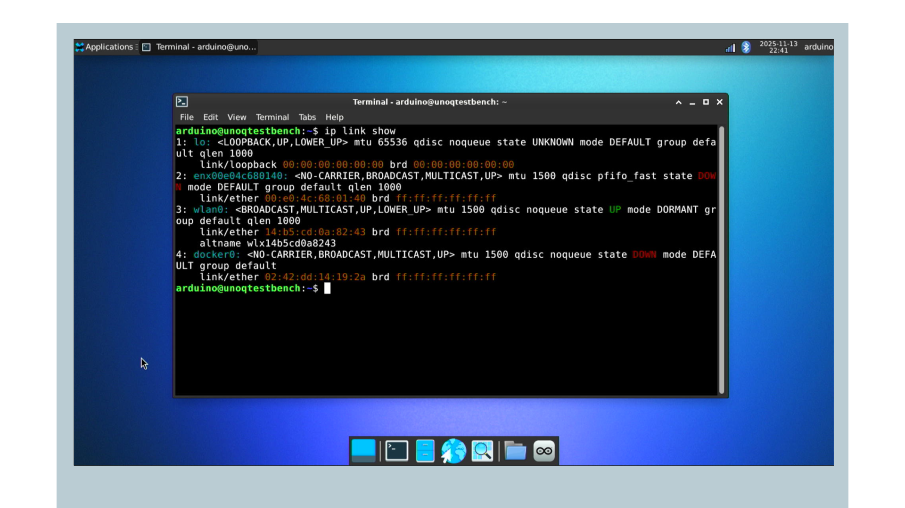

### Wi-Fi® Management

NetworkManager's command-line interface, `nmcli`, provides comprehensive Wi-Fi® management capabilities. Running `nmcli device status` shows all network devices and their current connection status.

```bash
nmcli device status
```

To scan for available Wi-Fi® networks in range, use `nmcli device wifi list`, which displays SSIDs, signal strength, security types, and channels for all visible networks.

```bash
# List available Wi-Fi® networks
nmcli device wifi list
```

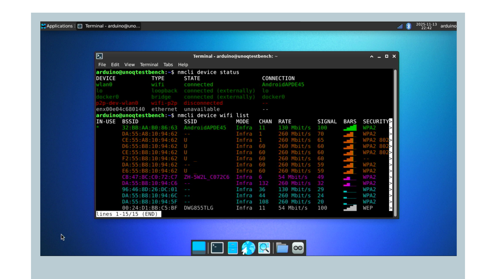

Connecting to a Wi-Fi® network is possible with `sudo nmcli device wifi connect "SSID" password "password"`, replacing SSID and password with your network credentials.

```bash
nmcli device wifi connect "SSID" password "password"
```

The connection is saved automatically, allowing your board to reconnect after reboots. To disconnect from the current network, use `sudo nmcli device disconnect wlan0`.

You can view all saved network connections with `nmcli connection show`, which lists connection names, types, and associated devices.

```bash
nmcli device disconnect wlan0
```

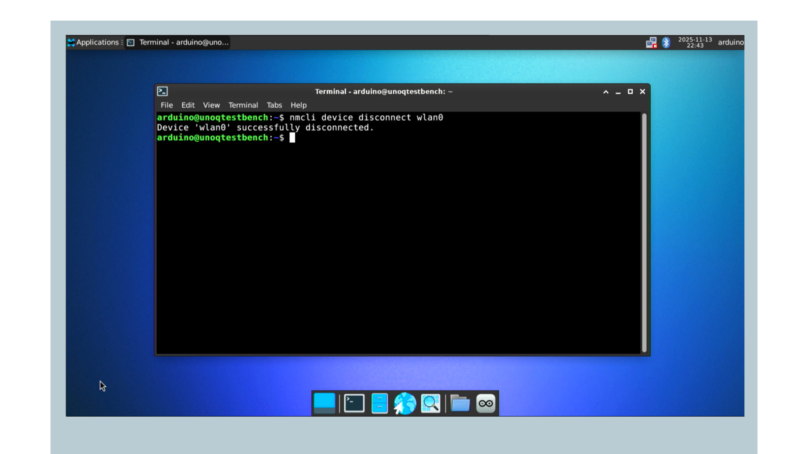

```bash
nmcli connection show
```

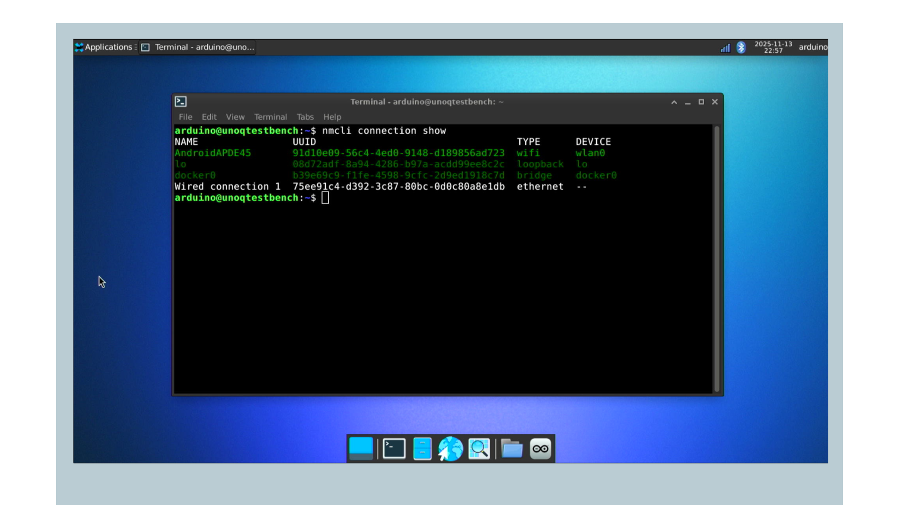

### Network Diagnostics

When troubleshooting network issues, several diagnostic tools are essential.

The `ping google.com` command tests basic internet connectivity by sending packets to a remote server and measuring response times. Press **CTRL+C** to stop the continuous ping output.

```bash
ping google.com
```

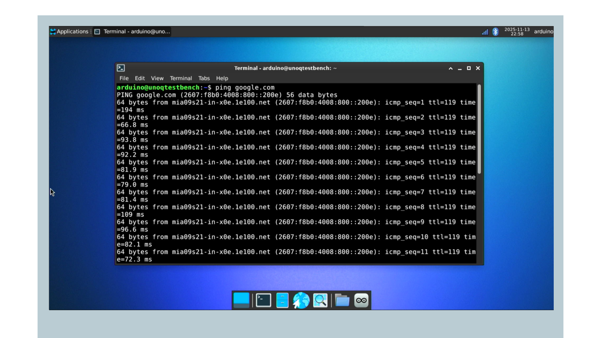

The `traceroute google.com` command shows the network path packets take to reach a destination, helping identify where connection problems occur.

```bash
traceroute google.com
```

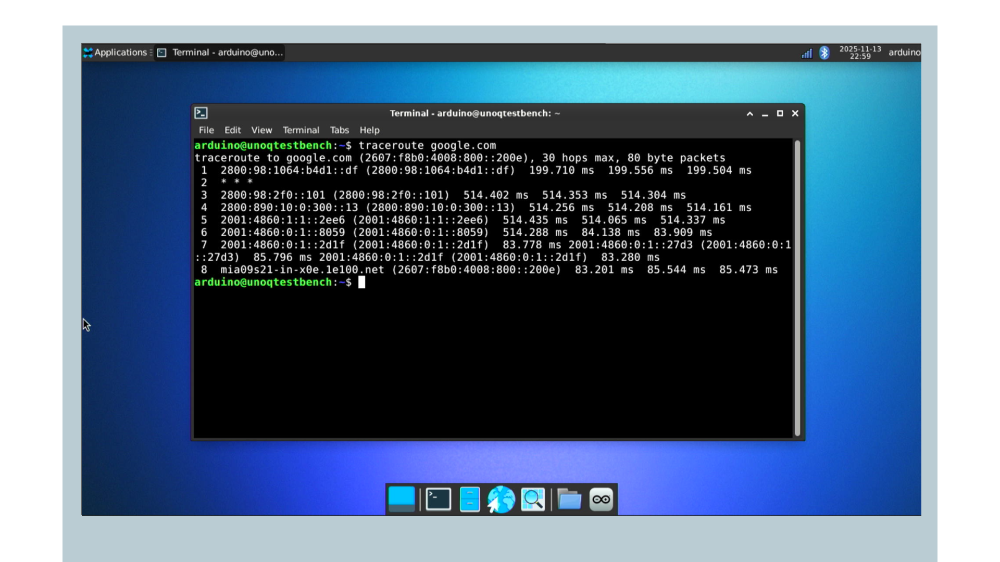

For DNS troubleshooting, `nslookup arduino.cc` queries DNS servers to verify that domain names resolve correctly to IP addresses.

```bash
nslookup arduino.cc
```

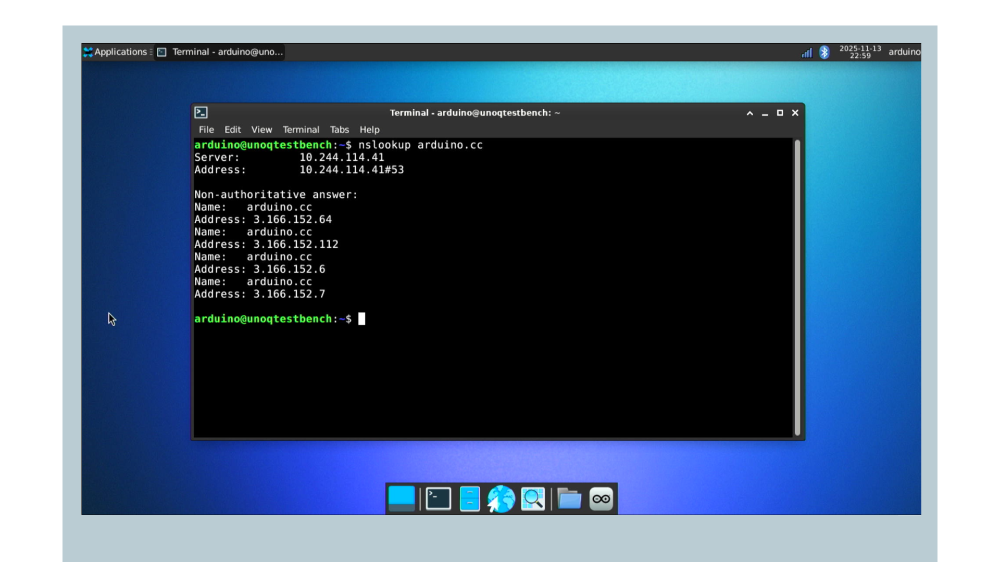

#### Troubleshooting Network Issues via ADB

If you configure a network that does not work properly, you may find yourself unable to access the board through Arduino App Lab or network mode.

In this situation, you can use ADB to access the shell and delete the problematic network connection without reflashing the board or using SBC mode with a keyboard and mouse.

First, connect your UNO Q via USB-C® cable, then access the shell through ADB. On macOS, the ADB tool is located in your Arduino15 directory:

```bash
# macOS - Access shell via ADB
~/Library/Arduino15/packages/arduino/tools/adb/32.0.0/adb shell
```

Once in the shell, list saved connections:

```bash
nmcli connection show
```

With the following command, delete the problematic connection:

```bash
nmcli connection delete <ConnectionName>
```

On Linux, the path is typically:

```bash
# Linux - Access shell via ADB
~/.arduino15/packages/arduino/tools/adb/32.0.0/adb shell
```

Then delete the connection as above using the following command:

```bash
nmcli connection delete <ConnectionName>
```

On Windows, the path uses the user's `AppData` folder:

```bash
# Windows - Access shell via ADB (in Command Prompt or PowerShell)
%LOCALAPPDATA%\Arduino15\packages\arduino\tools\adb\32.0.0\adb.exe shell
```

Then delete the connection as above using the following command:

```bash
nmcli connection delete <ConnectionName>
```

After deleting the bad connection, you can exit the ADB shell and reconfigure your network either through [Arduino App Lab's first setup process](https://docs.arduino.cc/tutorials/uno-q/user-manual/#install-arduino-app-lab) or by connecting to a working network using the commands above.

***This ADB method is useful when you are locked out of network access and do not have a USB-C® dongle, keyboard, or mouse available for SBC mode.***

## Helpful Tips and Best Practices

### Command Line Efficiency

The terminal includes several keyboard shortcuts that help improve efficiency.

Pressing **Tab** automatically completes commands and file names, saving typing and preventing errors.

To stop a running command, press **CTRL + C**. To clear your terminal screen, use **CTRL + L**.

The `up` and `down` arrow keys let you navigate through previously entered commands, making it easy to repeat or modify recent commands. The reverse search feature, activated with **CTRL + R**, allows you to search through your entire command history by typing a few characters.

### Getting Help

Debian includes documentation for nearly every command through the manual system.

Running `man <command-name>` opens the detailed manual page for any command, complete with explanations of all options, usage examples, and related commands.

```bash
man <command-name>
```

For example, `man ls` shows everything about the ls command.

```bash
man ls
```

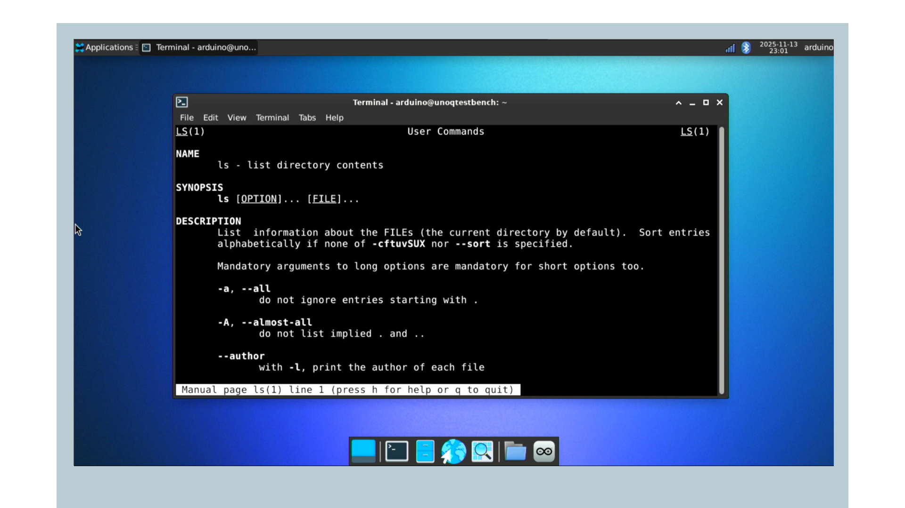

For quicker reference, most commands support a `--help` flag, such as`ls --help`, which displays a summary of options directly in the terminal.

```bash
ls --help
```

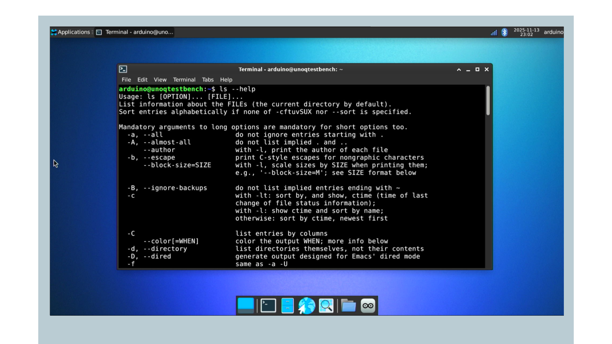

### System Logs and Troubleshooting

System logs are important for diagnosing problems.

The `journalctl -xe` command shows recent system log entries with explanatory text, helping you understand what is happening when things go wrong.

```bash
journalctl -xe
```

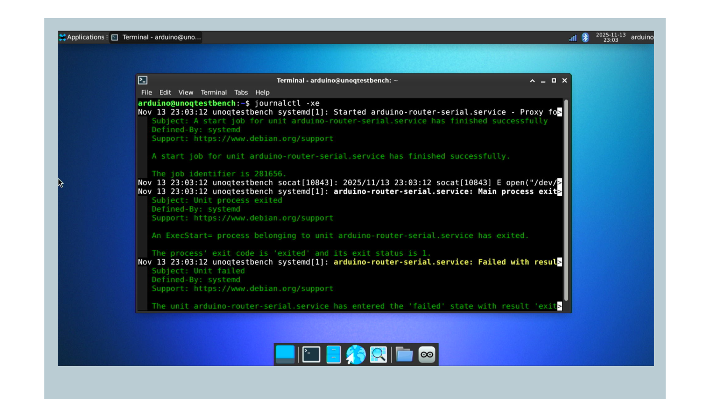

For real-time log monitoring, `journalctl -f` follows logs as they are written, similar to watching a live feed of system events.

```bash
journalctl -f
```


The `dmesg | less` command displays kernel boot messages and hardware detection logs, which are helpful in troubleshooting hardware issues or driver problems.

```bash
dmesg | less
```

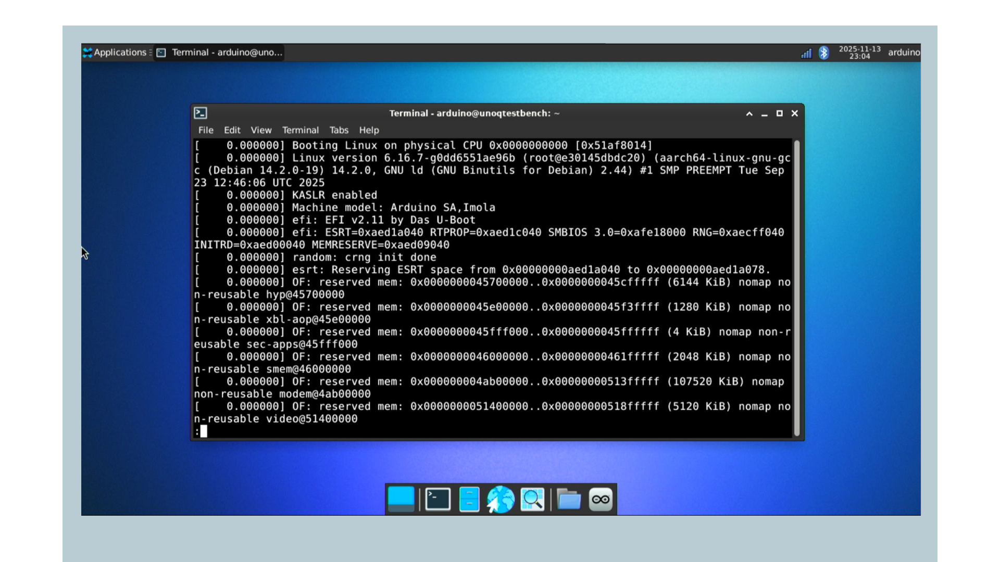

### Safe System Management

Following best practices helps prevent system damage. [**Understanding when to use `sudo`**](#using-sudo-superuser-do) is important for safe system management. You should only use `sudo` when you need elevated permissions for system-level operations, such as installing packages with `apt`, editing system configuration files in `/etc/`, or accessing protected directories.

**For everyday tasks like creating files in your home directory, editing your own documents, or running programs, `sudo` is not needed and should not be used.**

Using `sudo` unnecessarily can actually create problems. When you create or modify files with `sudo`, they are owned by **root** rather than your user account, which can lead to permission issues later.

For example, if you run [**`sudo nano myfile.txt`**](#editing-files-with-nano) in your home directory, the file will be owned by root. You will need `sudo` to edit it again in the future. This is why you should reserve `sudo` for operations that genuinely require system administrator privileges.

Before making significant system changes, always back up important files to an [**external storage device**](#usb-and-peripherals-access), such as the Apps you have worked on. This simple precaution can save hours of work if something goes wrong.

When available, use command options to run in dry mode and preview changes before implementing them, allowing you to verify the operation without actually modifying anything.

Keep your system and packages up to date with a [**regular `sudo apt update && sudo apt upgrade` routine**](#updating-package-lists). Keeping the system up to date with the latest security patches, compatibility elements, and bug fixes.

Being especially cautious with commands like [**`rm -rf`**](#file-operations) is important, as they permanently delete files without confirmation and cannot be undone.

Always double-check paths and filenames before performing destructive commands. Similarly, avoid using [**`chmod 777`**](#**changing-file-permissions) on files or directories unless necessary, as this grants full access to everyone and creates security vulnerabilities.

When in doubt about a command's effect, consult the manual with [**`man <command-name>`**](#getting-help) or search for examples before proceeding. Taking these extra moments to verify your actions prevents the frustration and data loss that comes from premature mistakes.

## Summary

This guide showed you to the Debian Linux environment running on the Arduino UNO Q's microprocessor. You learned what Debian is and how it integrates with the Arduino microcontroller to create a hybrid platform. The guide covered commands for accessing the board's shell via ADB, SSH, or SBC mode, navigating the Linux file system, managing permissions with `sudo`, installing packages with `apt`, and working with USB peripherals. You also explored the Arduino App CLI for managing Apps and system monitoring tools for tracking resources and network connectivity.

### Next Steps

Practice navigating the file system, editing files with nano, and installing packages that support your projects. Experiment with USB peripherals and explore Python programming on the MPU side using the Bridge to communicate with Arduino sketches on the MCU.

For specific topics, consult these tutorials:

- [Connect to UNO Q via Secure Shell (SSH)](https://docs.arduino.cc/tutorials/uno-q/ssh/)
- [UNO Q as a Single-Board Computer](https://docs.arduino.cc/tutorials/uno-q/single-board-computer/)
- [Flashing a New Image to the UNO Q](https://docs.arduino.cc/tutorials/uno-q/update-image/)
- [Arduino App Lab Documentation](https://docs.arduino.cc/software/app-lab/)