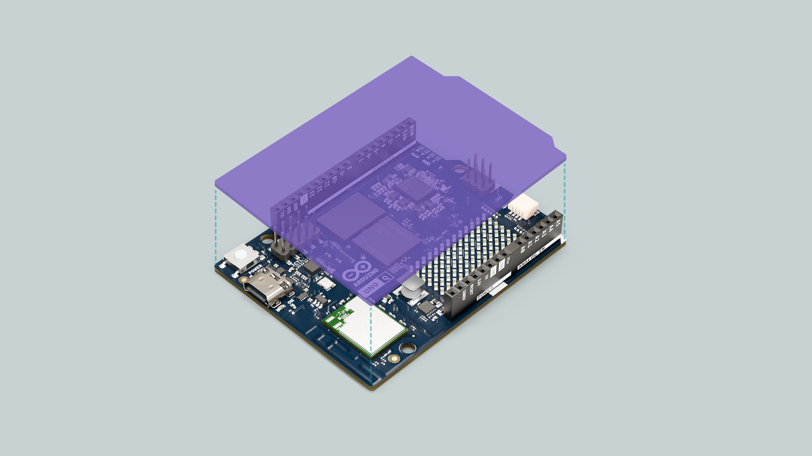

## Overview

The Arduino UNO Q runs a full Debian Linux operating system on its Qualcomm® QRB2210 microprocessor (MPU), providing a complete computing environment alongside the Arduino microcontroller (MCU). This guide explains the Debian system, how to access it, navigate the file system, manage permissions, install software, and work with USB peripherals.


Understanding the Debian system allows you to leverage the full power of Linux for advanced projects, system administration, and development tasks beyond Arduino sketches, thus using the UNO Q to its fullest.

## What is Debian?

Debian is a free and open-source Linux distribution known for its stability, security, and extensive package ecosystem. On the UNO Q, Debian provides a full Linux environment with standard Unix tools and utilities, allowing you to run multiple applications simultaneously and access thousands of software packages through the `apt` package manager.

The system includes built-in support for network services such as SSH, web servers, and various network protocols, as well as pre-installed development tools such as compilers, interpreters, and development libraries.

### How Debian Works on the UNO Q

The UNO Q features a hybrid architecture with two different processing environments working together. The Qualcomm® QRB2210 microprocessor runs Debian Linux and handles high-level computing tasks, including managing networking capabilities like Wi-Fi® and Bluetooth®, running Python® scripts and Linux applications, and controlling system resources and peripherals.

Working alongside this is the STM32U585 microcontroller running Zephyr RTOS, which runs Arduino sketches, handles real-time operations, controls GPIO pins and hardware interfaces, and communicates with the MPU through the Bridge mechanism.



The Bridge mechanism is the key element that enables uninterrupted communication between both systems. This allows your Python® scripts running on Debian to interact with Arduino code running on the MCU, creating a flexible hybrid development environment that leverages both the computational power of Linux and the real-time capabilities of Arduino.

## Accessing the Board Shell

There are three main methods to access the Debian shell on your UNO Q, each suited for different scenarios and workflows.

### Through USB-C® (ADB)

The Android Debug Bridge (ADB) provides direct shell access via USB connection, making it ideal for quick access when the board is connected to your computer, without requiring any network setup.

To use this method, you'll need a USB-C® cable and ADB tools installed on your computer. Once connected, the board can be verified by running `adb devices`, which lists all connected devices.

Then run `adb shell` to enter the board's shell environment. This method is particularly useful during initial setup or when network connectivity is not available.

```bash
# Connect the board via USB-C®
adb devices
# Expected result: Lists connected devices

adb shell
# Result: Enters the board's shell
```

### Through SSH (Network)

Secure Shell (SSH) provides remote access over your local network, allowing you to connect to your board from anywhere on the same network without physical cables. This method requires that your board is connected to Wi-Fi® and that SSH is enabled, which is enabled after completing the first setup in the Arduino App Lab. **Both your computer and the board must be on the same network for this to work.**

To connect, open a terminal on your computer and run:

```bash`
ssh arduino@<boardname>.local
```

Replace `<boardname>` with your actual board name. When connecting for the first time, you'll be asked to verify the connection by typing `yes`. After confirming, enter your board's password to gain full shell access.

```bash
# Connect from your computer
ssh arduino@<boardname>.local
# Type 'yes' when asked to connect (first time only)
# Enter password when prompted

# Example
ssh arduino@myunoq.local
```

This remote access capability allows you to work on your UNO Q from anywhere on your network, making it easy to manage projects, upload files, and monitor your board without being physically connected.

If you encounter connection issues, particularly with mDNS on certain networks, you can connect directly to the board's IP address instead of its `.local` hostname. Find the IP address by running

```bash
hostname -I
```

On the board (accessible via ADB or SBC mode).

***For detailed SSH setup, file transfer with SCP, and comprehensive troubleshooting, refer to the [SSH tutorial](https://docs.arduino.cc/tutorials/uno-q/ssh/).***

### Through SBC Mode

The single-board computer mode turns your UNO Q into a standalone desktop computer with a graphical user interface. To use this mode, you'll need a USB-C® dongle with external power delivery, an HDMI display, and a USB keyboard and mouse.

Connect all peripherals through the USB-C® dongle, power on the system, and log in using your credentials. Once logged in, you can open the Terminal application directly from the desktop environment, giving you shell access alongside the graphical interface.

This method is ideal when you want to use your UNO Q as a workstation, allowing you to browse the web, edit files graphically, and access the terminal all from the same device.

***For complete SBC mode tutorial, refer to the [SBC tutorial](https://docs.arduino.cc/tutorials/uno-q/single-board-computer/).***

## System Navigation

### Understanding the File System

Debian organizes files in a hierarchical directory structure, with the root directory `/` at the top level containing all other directories.

For most UNO Q projects, you'll primarily work within `/home/arduino/`, your default user directory.

Within your home directory, the `ArduinoApps/` folder is particularly important as it contains all the Apps you create with Arduino App Lab, with each App stored in its own subdirectory.

```
/                       # Root directory (top level)
├── home/
│   └── arduino/        # Your working directory
│       └── ArduinoApps/  # Your Arduino App Lab projects
├── tmp/                # Temporary files (cleared on reboot)
└── mnt/                # Mount points for USB drives
```

When navigating the system, you'll spend most of your time in `/home/arduino/`. The `/tmp/` directory is useful for temporary files, and `/mnt/` becomes relevant when you mount USB storage devices.

### Navigation Commands

The `cd` command is a frequently used tool for navigating the directory structure. Running `cd ~` takes you directly to your home directory, while `cd /home/arduino/Documents` navigates to a specific path.

To move up one directory level, use `cd ..`, and to return to your previous directory, use `cd -`. Your command prompt will change to show your current directory location, helping you keep track of where you are in the file system.

```bash
# Navigate to home directory
cd ~

# Navigate to a specific path
cd /home/arduino/Documents

# Go up one level
cd ..

# Go to previous directory
cd -
```

To see the contents of a directory, use the `ls` command. Running `ls` alone shows a basic listing of files and directories. The `ls -lh` command provides a detailed listing with permissions, ownership, and human-readable file sizes.

Adding the `-a` flag with `ls -a` reveals hidden files that start with a dot, and you can combine multiple options like `ls -lah` to see all files with full details in a readable format.

```bash
# Basic listing
ls

# Detailed listing with permissions and sizes
ls -lh

# Show hidden files (starting with .)
ls -a

# Combine options
ls -lah
```

When you run `ls -lah`, you'll see output similar to this:

```
total 24K
drwxr-xr-x  5 arduino arduino 4.0K Oct 31 10:30 .
drwxr-xr-x  3 root    root    4.0K Oct 15 14:20 ..
-rw-r--r--  1 arduino arduino  220 Oct 15 14:20 .bashrc
drwxr-xr-x  2 arduino arduino 4.0K Oct 25 09:15 Documents
```

If you ever need to know exactly where you are in the directory structure, the `pwd` command prints your current working directory.

For example, running `pwd` might display `/home/arduino/Documents`, confirming your current location in the file system.

```bash
pwd
# Result: /home/arduino/Documents
```

### File Operations

Creating directories is simple with the `mkdir` command. Running `mkdir my_project` creates a new directory in your current location. In contrast, `mkdir -p projects/arduino/sketches` creates all nested directories at once, including any intermediate directories that don't already exist. This is particularly useful when setting up complex project structures.

```bash
mkdir my_project
# Creates a new directory

mkdir -p projects/arduino/sketches
# Creates nested directories
```

The `cp` command handles file copying operations. To copy a single file, use `cp source.txt destination.txt`, which creates a duplicate with a new name.

When working with directories, you'll need the recursive flag: `cp -r source_folder/ destination_folder/` copies the entire directory and all its contents. This is essential when you need to back up or duplicate project folders.

```bash
# Copy file
cp source.txt destination.txt

# Copy directory recursively
cp -r source_folder/ destination_folder/
```

Both moving and renaming files use the `mv` command.

The difference is in how you use it: `mv oldname.txt newname.txt` renames a file in the current directory.

While `mv file.txt /home/arduino/Documents/` moves the file to a different location. Unlike copying, moving doesn't create a duplicate. It relocates the original file.

```bash
# Rename file
mv oldname.txt newname.txt

# Move file to directory
mv file.txt /home/arduino/Documents/
```

Deleting files requires attention. The `rm file.txt` command permanently removes a file, while `rm -r folder/` deletes an entire directory and its contents.

The most effective but dangerous variant is `rm -rf folder/`, which forcefully deletes everything without asking for confirmation. This command should be used with extreme care, as deleted files cannot be recovered.

```bash
# Delete file
rm file.txt

# Delete directory and contents
rm -r folder/

# Force delete without confirmation (use carefully!)
rm -rf folder/
```

***The `rm -rf` command permanently deletes files without confirmation and cannot be undone. Always double-check the path before running this command to avoid accidental data loss.***

## Permissions and Superuser Access

### Understanding Linux Permissions

Every file and directory in Debian has associated permissions that control who can read, write, or run it.

The read permission allows viewing the contents of a file or listing the contents of a directory.

The write permission allows modifying or deleting files.

While the run permission allows running files as programs or accessing directories.

These permissions are assigned to three categories of users: the owner who created the file, users in the same group as the file, and all other users on the system. This permission system provides controlled access to files and system security.

### Using `sudo` (Superuser Do)

Many system operations require administrator privileges to prevent accidental or malicious modifications to critical system files. The `sudo` command allows you to execute commands with superuser privileges temporarily.

For example, installing software requires elevated privileges, so you would use `sudo apt install package-name`. Similarly, editing system configuration files like `sudo nano /etc/network/interfaces` needs superuser access.

When controlling system services with commands like `sudo systemctl restart networking`, or accessing protected directories such as `sudo ls /root`, you'll be prompted for your password before the command executes. This security measure ensures that critical system changes are intentional and authenticated.

```bash
# Install software
sudo apt install package-name

# Edit system configuration files
sudo nano /etc/network/interfaces

# Control system services
sudo systemctl restart networking

# Access protected system directories
sudo ls /root
```

### Changing File Permissions

The `chmod` command modifies file and directory permissions. When you need to make a script executable, run `chmod +x script.sh` adds execute permission, allowing you to run the script with `./script.sh`.

For more precise control, you can use numeric notation like `chmod 755 script.sh`, which grants the owner full read, write, and run permissions, while others can only read and execute the file.

When you need to apply permissions to an entire directory and its contents, the recursive flag `chmod -R 755 folder/` makes sure all files within the folder bind to the same permissions.

```bash
# Make file executable
chmod +x script.sh
# Now you can run ./script.sh

# Set specific permissions (numeric notation)
chmod 755 script.sh
# Owner: read+write+execute, Others: read+execute

# Recursive permission change
chmod -R 755 folder/
# Applies permissions to folder and all contents
```

Common permission codes you'll encounter include 755, which gives the owner full control while others can read and run.

644 allows the owner to read and write, while others can only read.

777, which grants everyone full access and should be used with precaution due to security implications.

### Changing Ownership

File ownership can be modified using the `chown` command, which is particularly useful when files are created with incorrect ownership or need to be transferred between users.

Running `sudo chown arduino file.txt` changes the file's owner to the arduino user. You can simultaneously change both the owner and group with `sudo chown arduino:arduino file.txt`.

For entire directory structures, the recursive option `sudo chown -R arduino:arduino /home/arduino/project/` makes sure all files within the project folder have the correct ownership.

```bash
# Change file owner
sudo chown arduino file.txt

# Change owner and group
sudo chown arduino:arduino file.txt

# Recursive ownership change
sudo chown -R arduino:arduino /home/arduino/project/
```

## File Management

### Viewing File Contents

When you need to view the contents of a text file, Debian provides several tools suited for different scenarios.

The simplest is `cat file.txt`, which prints the entire file directly to your terminal. This works well for short files but can be overwhelming for longer documents.

For larger files, the `less file.txt` command opens a scrollable viewer where you can navigate using arrow keys, search for text with `/`, and exit by pressing `q`. This provides much more control over how you read the file.

```bash
cat file.txt
# Prints entire file to terminal

less file.txt
# Opens scrollable viewer
# Use arrow keys to navigate, 'q' to quit
```

Sometimes you only need to see the beginning or end of a file. The `head file.txt` command shows the first 10 lines, while `tail file.txt` displays the last 10 lines.

You can customize the number of lines shown with commands like `head -n 20 file.txt`. `tail -f /var/log/syslog` command is particularly useful, which continuously monitors a file and displays new lines as they're added, ideal for watching log files in real-time.

```bash
# First 10 lines
head file.txt

# Last 10 lines
tail file.txt

# Custom number of lines
head -n 20 file.txt

# Follow file updates (useful for logs)
tail -f /var/log/syslog
```

### Editing Files with Nano

Nano is a user-friendly terminal text editor that comes pre-installed on the UNO Q, making it a choice for editing configuration files and scripts from the command line.

To edit a file, run `nano myfile.txt`, which will either open the existing file or create a new one if it doesn't exist. When editing system files that require elevated privileges, prefix the command with sudo, like `sudo nano /etc/hostname`.

```bash
# Edit existing file or create new one
nano myfile.txt

# Edit system file with sudo
sudo nano /etc/hostname
```

Once inside Nano, navigation is simple. Use the arrow keys to move through your text, and you'll see a helpful menu at the bottom showing available commands.

To save your changes, press **CTRL + O** (write **O**ut), confirm the filename, and press Enter.

To exit nano, press **CTRL + X**. Other useful commands include:
**CTRL + K** to cut the current line
**CTRL + U** to paste it elsewhere
**CTRL + W** to search for text
**CTRL + G** to access the full help menu.

When you press CTRL + O to save, Nano will write your changes to storage, making them permanent.

### Searching Files and Content

The `find` command is useful for locating files based on various criteria. To find all Python files in your home directory, run `find /home/arduino -name "*.py"`, which searches recursively through all subdirectories.

You can also search based on modification time. For example, `find /home/arduino -mtime -7` finds all files modified in the last seven days. This is useful for locating recently changed files in large directory structures.

```bash
# Find files by name
find /home/arduino -name "*.py"
# Lists all Python files

# Find files modified in last 7 days
find /home/arduino -mtime -7
```

For searching within file contents rather than filenames, the `grep` command is very useful. Running `grep "Arduino" file.txt` searches for the word "Arduino" in a specific file and displays matching lines.

To search through an entire directory structure, use `grep -r "TODO" /home/arduino/projects/`, which recursively searches all files for the text "TODO". The case-insensitive option `grep -i "arduino" file.txt` will match "Arduino", "arduino", and "ARDUINO", making searches more flexible.

```bash
# Search for text in file
grep "Arduino" file.txt

# Search recursively in directory
grep -r "TODO" /home/arduino/projects/

# Case-insensitive search
grep -i "arduino" file.txt
```

## Package Management

Debian uses the Advanced Package Tool, commonly known as `apt`, to manage software installation, updates, and removal. This system handles dependencies automatically, making sure that when you install a program, all required supporting libraries and tools are also installed.

### Updating Package Lists

Before installing new software, it's important to update your package lists to ensure you're getting the latest versions. Running `sudo apt update` downloads the most current package information from Debian's repositories.

You'll see output listing various repositories being checked, ending with "Reading package lists... Done". This process doesn't install anything. It refreshes your system's knowledge of available software versions. Always run this command before attempting to install new packages to avoid installing outdated versions.

```bash
sudo apt update
```

The output will show something like:

```
Hit:1 http://deb.debian.org/debian bookworm InRelease
Reading package lists... Done
```

### Installing Software

Installing software with apt is straightforward. To install a single package, use `sudo apt install package-name`, which downloads the package and all its dependencies, then installs everything automatically.

You can install multiple packages in a single command by separating them with spaces, like `sudo apt install python3-pip git curl`. During installation, apt will show you what will be installed and ask for confirmation before proceeding.

```bash
# Install a package
sudo apt install package-name

# Install multiple packages
sudo apt install python3-pip git curl
```

For example, if you want to install the Vim text editor, running `sudo apt install vim` will download Vim and any required libraries, then configure everything so it's ready to use immediately.

The package manager handles all the complexity behind the scenes, making software installation simpler than manual compilation and configuration.

```bash
sudo apt install vim
# Downloads and installs vim text editor
```

### Searching and Managing Packages

When you're not sure of the exact package name, the `apt search keyword` command helps you find packages related to a topic.

For instance, `apt search python3` will list all available packages related to Python 3, with brief descriptions of each. This is useful for exploring the tools available for a specific task or programming language.

```bash
# Search available packages
apt search keyword

# Example: Find Python packages
apt search python3
```

Removing software is as simple as well. The command `sudo apt remove package-name` uninstalls the package but preserves any configuration files you may have customized.

If you want to completely remove a package including its configuration files, use `sudo apt purge package-name` instead. Over time, your system may accumulate unused dependencies from previously installed packages.

Running `sudo apt autoremove` cleans these up automatically, freeing disk space by removing packages that are no longer needed.

```bash
# Remove package but keep configuration files
sudo apt remove package-name

# Remove package and configuration files
sudo apt purge package-name

# Remove unused dependencies
sudo apt autoremove
```

### System Updates

Keeping your system updated is important for security and stability. The `sudo apt upgrade` command updates all installed packages to their latest versions while being conservative about dependencies.

For more comprehensive updates that may change package dependencies, use `sudo apt full-upgrade`, which handles complex upgrade scenarios. Regular updates keep you up to date with the latest security patches and bug fixes.

```bash
# Upgrade installed packages
sudo apt upgrade

# Upgrade with automatic handling of dependencies
sudo apt full-upgrade
```

***For major system updates or OS version upgrades, it is recommended to use the image flashing procedure described in the [image update tutorial](https://docs.arduino.cc/tutorials/uno-q/update-image/) rather than in-place upgrades.***

## USB and Peripherals Access

### Detecting USB Devices

When you connect a USB device to the UNO Q through a USB-C® dongle in SBC mode, Debian detects and registers it.

The `lsusb` command provides a quick overview of all connected USB devices, showing manufacturer IDs, product IDs, and device descriptions. You might see listings for your keyboard, mouse, camera, or other peripherals.

```bash
lsusb
```

The output shows connected devices in a format like:

```
Bus 002 Device 001: ID 1d6b:0003 Linux Foundation 3.0 root hub
Bus 001 Device 003: ID 046d:c52b Logitech, Inc. USB Keyboard
Bus 001 Device 002: ID 093a:2510 USB Camera
```

For more detailed information about USB devices, including power requirements, transfer speeds, and device capabilities, you can use `lsusb -v` for verbose output, or `lsusb -t` to see the USB device tree showing how devices are connected through hubs and ports.

This detailed view is useful when troubleshooting USB issues or understanding power distribution across multiple devices.

```bash
# Show detailed USB information
lsusb -v

# Show USB device tree
lsusb -t
```

### Working with USB Storage Devices

When you connect a USB flash drive or external hard drive in SBC mode to the desktop environment, the system typically auto-mounts it at `/media/arduino/`, making it accessible in the file manager. However, when working from the command line or in headless mode, you'll need to mount drives manually.

First, identify your USB drive by running `lsblk`, which lists all block devices and their partitions. You'll see output showing device names like `/dev/sda1` along with their sizes and mount points.

To mount a USB drive manually, create a mount point directory with `sudo mkdir -p /mnt/usb`, then mount the device using `sudo mount /dev/sda1 /mnt/usb`. The USB drive's contents are now accessible at `/mnt/usb`.

When you're finished working with the drive, always unmount it properly using `sudo umount /mnt/usb` before physically disconnecting it to prevent data corruption.

```bash
# List block devices
lsblk

# Create mount point
sudo mkdir -p /mnt/usb

# Mount USB drive
sudo mount /dev/sda1 /mnt/usb
# USB contents accessible at /mnt/usb

# Unmount when done
sudo umount /mnt/usb
```

### USB Cameras

USB cameras register as video devices in the `/dev/` directory. Running `ls /dev/video*` lists all available video devices, including both physical cameras and virtual video devices. The output will typically show `/dev/video0`, `/dev/video1`, and so on.

```bash
ls /dev/video*
# Result: /dev/video0 /dev/video1
```

To test your camera from the command line, you can use `fswebcam`, a simple tool for capturing images.

After installing it with `sudo apt install fswebcam`, you can capture a test image using `fswebcam -r 1280x720 --no-banner test.jpg`, which saves a 720p image to the current directory without adding timestamp banners.

```bash
# Install fswebcam
sudo apt install fswebcam

# Capture image
fswebcam -r 1280x720 --no-banner test.jpg
```

For a more user-friendly experience with a graphical interface, Cheese is an excellent camera application. Install it with `sudo apt install cheese` and launch it with the `cheese` command.

This opens a window showing your camera feed with options to take photos or record videos, making it easy to test camera functionality without writing code.

```bash
sudo apt install cheese
cheese
# Opens camera application
```

### Serial Devices

USB serial devices, including Arduino boards and USB-to-serial adapters, appear in the system as special device files in the `/dev/` directory, typically named `/dev/ttyUSB*` for generic USB serial devices or `/dev/ttyACM*` for devices that implement the USB Communications Device Class. You can list all serial ports by running `ls /dev/tty*`, though this will show many entries, including virtual terminals.

To interact with a serial device, the `screen` utility provides a simple terminal interface. First install it with `sudo apt install screen`, then connect to your serial device using `screen /dev/ttyUSB0 115200`, where 115200 is the baud rate. This opens a terminal session connected to the serial port. To exit the screen, press **CTRL+A**, then press **K**, and finally press **Y** to confirm.

```bash
# Install screen for serial communication
sudo apt install screen

# Connect to serial port (115200 baud)
screen /dev/ttyUSB0 115200
# Exit: CTRL+A, then K, then Y
```

Serial devices are often configured with restricted permissions by default. Running `ls -l /dev/ttyUSB0` might show that only users in the `dialout` group have access.

To grant your user account access to serial ports, add yourself to the dialout group with `sudo usermod -a -G dialout arduino`. This change takes effect after you log out and back in. After this one-time setup, you'll be able to access serial devices without needing sudo permissions.

```bash
ls -l /dev/ttyUSB0
# May show: crw-rw---- 1 root dialout

# Add user to dialout group for access
sudo usermod -a -G dialout arduino
# Log out and back in for changes to take effect
```

## Arduino App CLI Control

The Arduino UNO Q comes with the Arduino App CLI (`arduino-app-cli`) pre-installed, a command-line tool for managing and controlling Arduino App Lab applications directly from the terminal.

This tool allows you to build, start, stop, and manage Apps without using the graphical Arduino App Lab interface, making it ideal for automation, remote management via SSH, or headless operation.

### Managing Apps

The `arduino-app-cli` provides commands for controlling the Apps you create in Arduino App Lab. Navigate to your Apps directory to see all available projects:

```bash
cd ~/ArduinoApps
ls
# Shows all your Arduino App Lab projects
```

Each App in this directory can be controlled using `arduino-app-cli` commands. To build an App from the command line, use the build command:

```bash
arduino-app-cli app build MyApp
# Compiles the App named MyApp
```

Starting and stopping Apps is simple. The start command launches an App and keeps it running, while the stop command terminates it:

```bash
# Start an App
arduino-app-cli app start MyApp

# Stop a running App
arduino-app-cli app stop MyApp
```

These commands are useful when accessing your board via SSH, enabling you to remotely manage your projects without a graphical interface.

For example, you could upload a new App via SCP, build it, and start it running, all from your computer's terminal without ever touching the board directly.

### System and Network Configuration

The Arduino App CLI also provides system management commands. One useful feature is enabling or disabling network mode, which allows Arduino App Lab desktop application to connect to your board remotely:

```bash
# Enable network mode for remote Arduino App Lab access
arduino-app-cli system network-mode enable

# Check network mode status
arduino-app-cli system network-mode status
```

Network mode is automatically enabled during the first setup, but these commands let you control it manually if needed.

### Arduino CLI

The standard Arduino CLI tool (`arduino-cli`) is also available on the UNO Q for users who need direct access to Arduino core management, library installation, and sketch compilation outside of the Arduino App Lab ecosystem. This tool is independent of Arduino App Lab and follows the standard Arduino CLI workflow.

```bash
# Check if arduino-cli is available
arduino-cli version
```

For UNO Q development, **Arduino App Lab and `arduino-app-cli` are the recommended tools** as they are specifically designed for the board's architecture and handle communication between the MPU and MCU automatically.

The standard `arduino-cli` is useful for advanced users who need to manage cores and libraries manually or work with other Arduino boards connected to the UNO Q.

***For detailed Arduino CLI documentation, visit the [official Arduino CLI documentation](https://arduino.github.io/arduino-cli/).***

## System Monitoring

### Checking System Resources

Understanding your system's resource usage helps identify performance bottlenecks and troubleshoot issues.

The `top` command provides an interactive, real-time view of running processes, showing CPU and memory usage for each process.

Press `q` to quit the top interface. This is particularly useful when tracking down which program is consuming excessive resources.

```bash
top
# Interactive process viewer showing CPU, memory usage
# Press 'q' to quit
```

Disk space management is crucial, especially on the UNO Q's eMMC storage. The `df -h` command displays disk usage for all mounted filesystems in human-readable format (MB, GB), showing total size, used space, available space, and mount points. This helps you monitor storage consumption and identify when you are running low on space.

```bash
df -h
# Shows available space on all mounted drives
```

To see how much space individual directories are consuming, use `du -sh *` in any directory.

This summarizes the size of each item in the current location, making it easy to identify large directories that might be good candidates for cleanup.

The `-h` flag ensures sizes are displayed in human-readable format rather than raw byte counts.

```bash
du -sh *
# Shows size of each item in current directory
```

The `free -h` command displays memory usage statistics, showing total RAM, used memory, free memory, and swap space in a human-readable format.

This helps you determine whether your applications are consuming too much memory or whether you have sufficient resources for new programs.

```bash
free -h
# Shows RAM usage in human-readable format
```

### System Information

Several commands provide detailed information about your UNO Q's hardware and software configuration. The `uname -a` command displays comprehensive Linux kernel information including the version, build date, and architecture.

To specifically see which Debian version you are running, examine `/etc/os-release` with `cat /etc/os-release`, which lists the operating system name, version, and other distribution details. For detailed CPU information, including model, core count, clock speed, and supported features, use `lscpu`.

```bash
# Show Linux version
uname -a

# Show Debian version
cat /etc/os-release

# Show CPU information
lscpu
```

## Network Management

### Checking Network Status

The `ip addr` command displays all network interfaces along with their IP addresses, MAC addresses, and current state.

This shows both your physical interfaces, such as `wlan0` for Wi-Fi® and `eth0` for Ethernet, as well as virtual interfaces. The output includes IPv4 and IPv6 addresses, helping you determine how your board is connected to the network.

```bash
ip addr
# Lists all network interfaces with IP addresses
```

To see which interfaces are currently active or inactive, use `ip link show`. This displays the link state for each interface, showing whether it's UP (active) or DOWN (inactive), along with other properties such as MAC addresses and supported features.

```bash
ip link show
# Shows active connections and interface states
```

### Wi-Fi® Management

NetworkManager's command-line interface, `nmcli`, provides comprehensive Wi-Fi® management capabilities. Running `nmcli device status` shows all network devices and their current connection status.

To scan for available Wi-Fi® networks in range, use `nmcli device wifi list`, which displays SSIDs, signal strength, security types, and channels for all visible networks.

```bash
# Show network status
nmcli device status

# List available Wi-Fi® networks
nmcli device wifi list
```

Connecting to a Wi-Fi® network is possible with `sudo nmcli device wifi connect "SSID" password "password"`, replacing SSID and password with your network credentials.

The connection is saved automatically, allowing your board to reconnect after reboots. To disconnect from the current network, use `sudo nmcli device disconnect wlan0`. You can view all saved network connections with `nmcli connection show`, which lists connection names, types, and associated devices.

```bash
# Connect to network
sudo nmcli device wifi connect "SSID" password "password"

# Disconnect from network
sudo nmcli device disconnect wlan0

# Show saved connections
nmcli connection show
```

### Network Diagnostics

When troubleshooting network issues, several diagnostic tools are essential.

The `ping google.com` command tests basic internet connectivity by sending packets to a remote server and measuring response times. Press **CTRL+C** to stop the continuous ping output.

The `traceroute google.com` command shows the network path packets take to reach a destination, helping identify where connection problems occur.

For DNS troubleshooting, `nslookup arduino.cc` queries DNS servers to verify that domain names resolve correctly to IP addresses.

```bash
# Test connectivity
ping google.com
# Shows response times (CTRL+C to stop)

# Trace network route
traceroute google.com

# Check DNS resolution
nslookup arduino.cc
```

## Helpful Tips and Best Practices

### Command Line Efficiency

The terminal includes several keyboard shortcuts that help improve efficiency.

Pressing **Tab** automatically completes commands and file names, saving typing and preventing errors.

To stop a running command, press **CTRL + C** immediately.
To clear your terminal screen of clutter, use **CTRL + L**.

The up and down arrow keys let you navigate through previously entered commands, making it easy to repeat or modify recent commands. The reverse search feature, activated with **CTRL + R**, allows you to search through your entire command history by typing a few characters.

### Getting Help

Debian includes documentation for nearly every command through the manual system.

Running `man command-name` opens the detailed manual page for any command, complete with explanations of all options, usage examples, and related commands.

For example, `man ls` shows everything about the ls command. For quicker reference, most commands support a `--help` flag, such as`ls --help`, which displays a summary of options directly in the terminal.

```bash
# Show command manual
man command-name
# Example: man ls

# Show brief help
command-name --help
# Example: ls --help
```

### System Logs and Troubleshooting

System logs are important for diagnosing problems.

The `sudo journalctl -xe` command shows recent system log entries with explanatory text, helping you understand what's happening when things go wrong.

For real-time log monitoring, `sudo journalctl -f` follows logs as they are written, similar to watching a live feed of system events.

The `dmesg | less` command displays kernel boot messages and hardware detection logs, useful for troubleshooting hardware issues or driver problems.

```bash
# View system log
sudo journalctl -xe

# Follow real-time logs
sudo journalctl -f

# View boot messages
dmesg | less
```

### Safe System Management

Following best practices helps prevent accidents and system damage. Understanding when to use `sudo` is important for safe system management. You should only use `sudo` when you need elevated permissions for system-level operations, such as installing packages with `apt`, editing system configuration files in `/etc/`, or accessing protected directories.

For everyday tasks like creating files in your home directory, editing your own documents, or running programs, `sudo` is not needed and should not be used.

Using `sudo` unnecessarily can actually create problems. When you create or modify files with `sudo`, they are owned by root rather than your user account, which can lead to permission issues later.

For example, if you run `sudo nano myfile.txt` in your home directory, the file will be owned by root, and you'll need `sudo` to edit it again in the future. This is why you should reserve `sudo` for operations that genuinely require system administrator privileges.

Before making significant system changes, always back up important files to external storage or another location. This simple precaution can save hours of work if something goes wrong.

When available, use dry-run options on commands to preview changes before implementing them, allowing you to verify the operation without actually modifying anything. Keep your system and packages up to date with regular `sudo apt update && sudo apt upgrade` runs, ensuring you have the latest security patches and bug fixes that protect your board from vulnerabilities.

Being especially cautious with powerful commands like `rm -rf` is essential, as they permanently delete files without confirmation and cannot be undone.

Always double-check paths and filenames before executing destructive commands. Similarly, avoid using `chmod 777` on files or directories unless absolutely necessary, as this grants full access to everyone and creates security vulnerabilities.

When in doubt about a command's effect, consult the manual with `man command-name` or search for examples before proceeding. Taking these extra moments to verify your actions prevents the frustration and data loss that comes from premature mistakes.

## Summary

This guide showed you to the Debian Linux environment running on the Arduino UNO Q's microprocessor. You learned what Debian is and how it integrates with the Arduino microcontroller to create a hybrid platform. The guide covered accessing the board's shell through ADB, SSH, or SBC mode, navigating the Linux file system, managing permissions with `sudo`, installing packages with `apt`, and working with USB peripherals. You also explored the Arduino App CLI for managing Apps and system monitoring tools for tracking resources and network connectivity.

### Next Steps

Practice navigating the file system, editing files with nano, and installing packages that support your projects. Experiment with USB peripherals and explore Python programming on the MPU side using the Bridge to communicate with Arduino sketches on the MCU.

For specific topics, consult these tutorials:

- [Connect to UNO Q via Secure Shell (SSH)](https://docs.arduino.cc/tutorials/uno-q/ssh/)
- [UNO Q as a Single-Board Computer](https://docs.arduino.cc/tutorials/uno-q/single-board-computer/)
- [Flashing a New Image to the UNO Q](https://docs.arduino.cc/tutorials/uno-q/update-image/)
- [Arduino App Lab Documentation](https://docs.arduino.cc/software/app-lab/)