## Overview

While the Arduino App Lab provides a convenient Python® Bridge API for communication between the Linux microprocessor (MPU) and the Arduino microcontroller (MCU), you may want more control or prefer using C++, standalone Python scripts, or other languages for custom system integration.

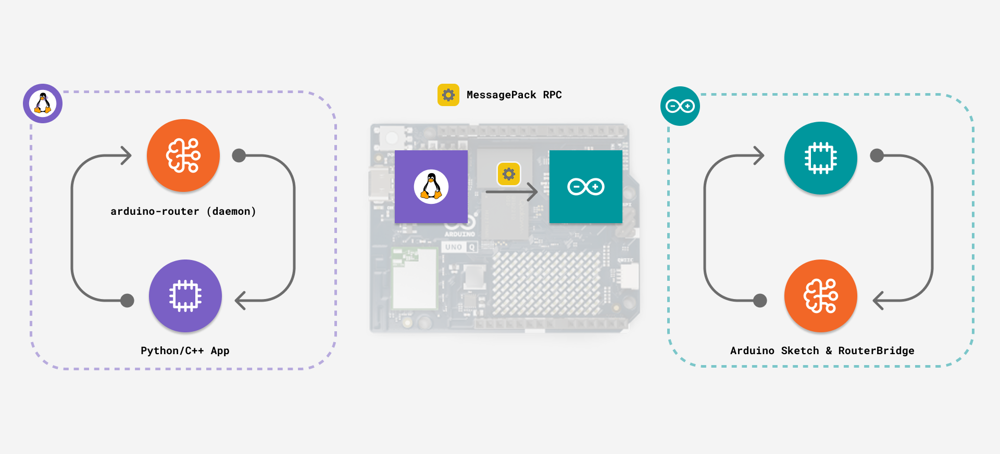

This tutorial shows you how to communicate directly with the `arduino-router` daemon using the MessagePack RPC protocol. This approach gives you the flexibility to build custom applications in any language that supports Unix sockets and MessagePack encoding, opening up possibilities for performance-critical applications, multi-process architectures, and integration with existing Linux services.

## Goals

- Understand how the `arduino-router` daemon manages RPC communication between processors
- Learn the MessagePack RPC protocol and message formats
- Build RPC clients in C++ with complete working examples
- Implement standalone Python® applications that communicate with the MCU
- Debug and troubleshoot `arduino-router` communication issues

## Hardware and Software Requirements

### Hardware Requirements

- [Arduino® UNO Q](https://store.arduino.cc/products/uno-q)
- USB-C® cable

## Understanding the Arduino Router

The `arduino-router` is a background Linux service that acts as a traffic controller for all RPC communication on the UNO Q. Instead of having direct point-to-point connections between applications, the router implements a star topology, with the router at the center and managing connections between multiple clients.

This architecture provides several key advantages. Multiple Linux processes can communicate with the MCU simultaneously. For example, one Python® script could read sensor data while a separate C++ application controls the motors. The router also supports Linux-to-Linux communication, allowing different services to exchange data without involving the MCU.

Additionally, the router handles service discovery by maintaining a directory of registered functions and automatically routing calls to the correct destination.

### Architecture Overview


When a client wants to communicate, it connects to the router via a Unix socket at `/var/run/arduino-router.sock`. Clients register the functions they want to expose. When another client calls those functions, the router forwards the messages back and forth, handling message ID remapping to prevent conflicts between different clients.

### Managing the Router Service

The `arduino-router` runs automatically as a `systemd` service. In most cases, you don't need to interact with it directly. Here are some useful commands for debugging and management.

Check if the router is running and view its status:

```bash
systemctl status arduino-router
```

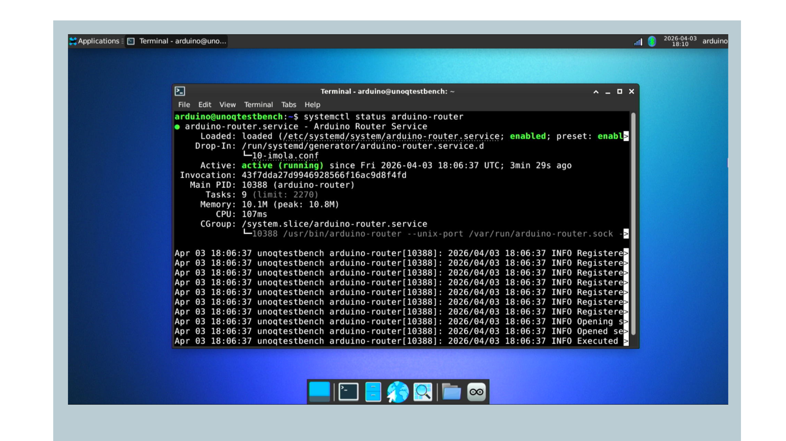

Restart the service if communication seems stuck:

```bash
sudo systemctl restart arduino-router
```

View real-time logs to debug issues:

```bash
journalctl -u arduino-router -f
```

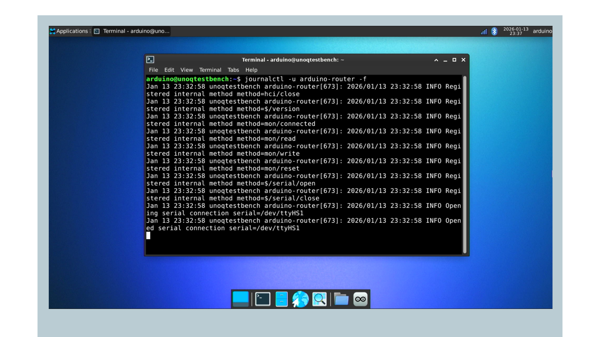

For more detailed debugging information, you can enable verbose logging. To edit the full system-wide unit file directly, use:

```bash
sudo systemctl edit --full arduino-router.service
```

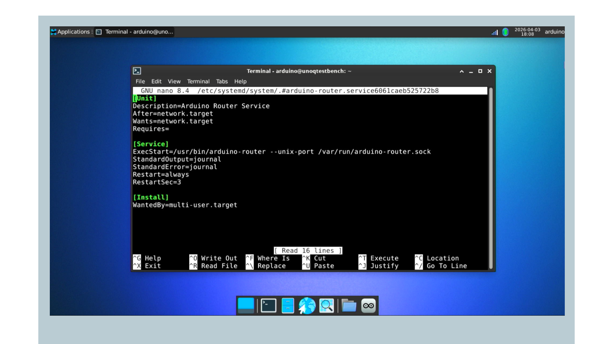

Alternatively, if you prefer to keep your changes isolated in a drop-in overlay, which overrides only specific settings without touching the original unit file, use the following command:

```bash
sudo systemctl edit arduino-router.service
```

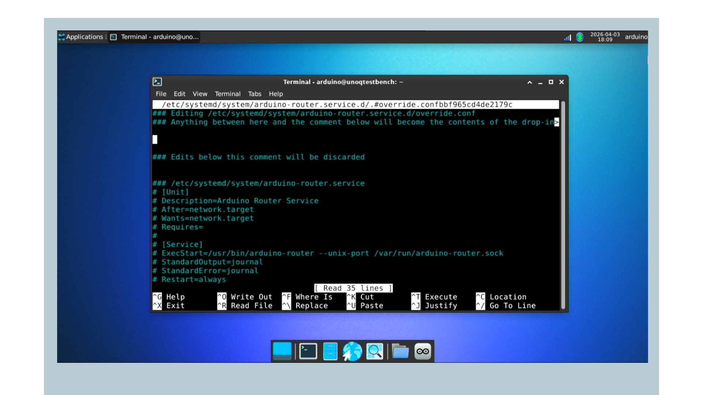

Add `--verbose` to the end of the `ExecStart` line, then reload and restart:

```bash
sudo systemctl daemon-reload
```

```bash
sudo systemctl restart arduino-router
```

```bash
journalctl -u arduino-router -f
```

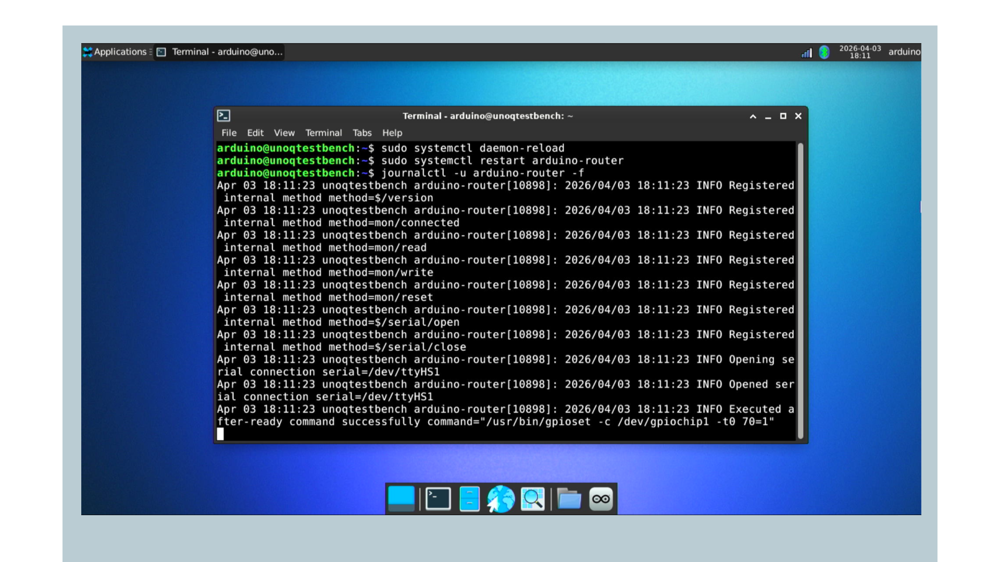

## MessagePack RPC Protocol

The `arduino-router` uses MessagePack RPC, a binary protocol that is more accessible than text-based formats like JSON. Understanding the message structure is important for building applications that communicate with the router.

### Message Types and Formats

The protocol defines three message types, each serving a different communication pattern.

**REQUEST (Type 0)** is used when you need a response from a function call. For example, reading a sensor value or confirming that an operation completed. The message format is:

```
[0, msgid, "method_name", [arg1, arg2, ...]]
```

The `msgid` is a unique identifier you assign to track this call, and the router will use the same ID in its response.

**RESPONSE (Type 1)** is sent back after processing a REQUEST. It contains either the return value or an error message:

```
[1, msgid, error, result]
```

If the call succeeded, `error` is `null` and `result` contains the return value. If it failed, `error` contains the error message and `result` is `null`.

**NOTIFY (Type 2)** is for fire-and-forget commands where you don't need confirmation. It is faster since you don't wait for a response:

```
[2, "method_name", [arg1, arg2, ...]]
```

Note that *NOTIFY* messages don't include a `msgid` since no response is expected.

### Router Control Methods

The router implements special methods that begin with `$/` for managing the routing system.

To register a function your application wants to expose, send:

```
[0, msgid, "$/register", ["method_name"]]
```

To unregister all your methods, following can be used. It is useful when shutting down gracefully:

```
[0, msgid, "$/reset", []]
```

### Connecting To the Router

Your application connects to the Unix domain socket at `/var/run/arduino-router.sock`. Unix sockets are similar to TCP sockets but exist only locally, making them faster and more secure for inter-process communication. After connecting, you send and receive MessagePack-encoded messages as described above.

## C++ Implementation

Let's build a C++ client that handles socket management, MessagePack encoding, and response tracking. It will give you a clean API for making RPC calls without worrying about the low-level details.

### Installation

Install the MessagePack C++ library on the UNO Q:

```bash
sudo apt update
```

```bash
sudo apt install libmsgpack-cxx-dev
```

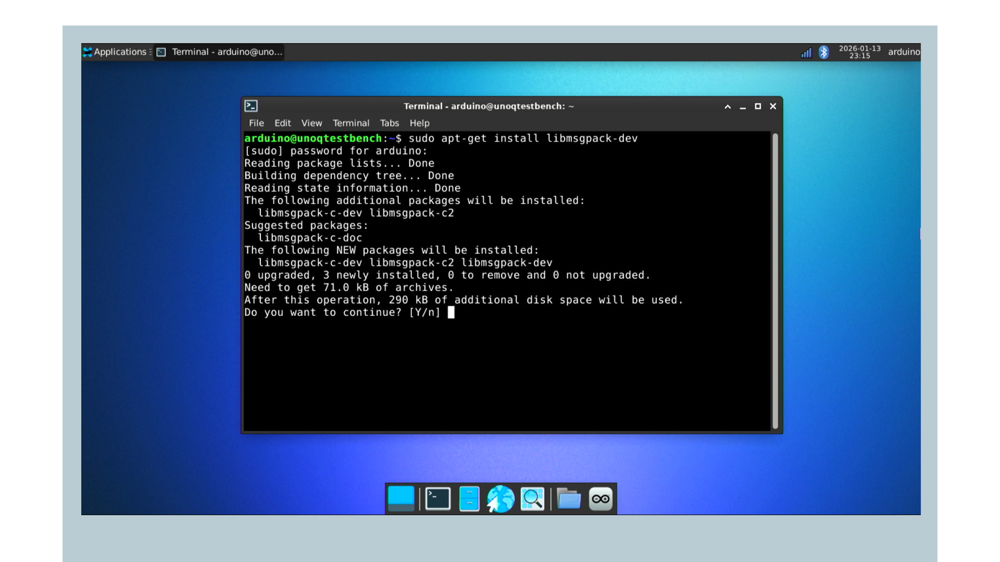

The `libmsgpack-cxx-dev` package provides the C++ header-only library for MessagePack serialization. Since it's header-only, you don't need to link against any additional libraries during compilation.

### C++ Bridge Class

Create a header file `arduino_bridge.hpp` with the complete implementation:

```cpp
#ifndef ARDUINO_BRIDGE_HPP
#define ARDUINO_BRIDGE_HPP

#include <msgpack.hpp>
#include <sys/socket.h>
#include <sys/un.h>
#include <unistd.h>
#include <vector>
#include <string>
#include <sstream>
#include <iostream>
#include <map>
#include <thread>
#include <mutex>
#include <condition_variable>
#include <cstring>

class ArduinoBridge {
public:
    struct Response {
        bool success;
        msgpack::object_handle result;
        std::string error;
    };
    
private:
    int sock_fd;
    uint32_t msg_counter;
    std::thread recv_thread;
    bool running;
    std::mutex response_mutex;
    std::condition_variable response_cv;
    std::map<uint32_t, Response> pending_responses;
    
public:
    ArduinoBridge() : sock_fd(-1), msg_counter(0), running(false) {}
    
    bool connect() {
        sock_fd = socket(AF_UNIX, SOCK_STREAM, 0);
        if (sock_fd < 0) {
            std::cerr << "Failed to create socket: " << strerror(errno) << std::endl;
            return false;
        }
        
        struct sockaddr_un addr;
        memset(&addr, 0, sizeof(addr));
        addr.sun_family = AF_UNIX;
        strncpy(addr.sun_path, "/var/run/arduino-router.sock", 
                sizeof(addr.sun_path) - 1);
        
        if (::connect(sock_fd, (struct sockaddr*)&addr, sizeof(addr)) < 0) {
            std::cerr << "Failed to connect: " << strerror(errno) << std::endl;
            close(sock_fd);
            sock_fd = -1;
            return false;
        }
        
        running = true;
        recv_thread = std::thread(&ArduinoBridge::receive_loop, this);
        
        return true;
    }
    
    template<typename... Args>
    Response call(const std::string& method, Args... args) {
        int type = 0;
        uint32_t msgid = ++msg_counter;
        
        std::vector<msgpack::type::variant> params;
        pack_args(params, args...);
        
        std::stringstream buffer;
        msgpack::pack(buffer, std::make_tuple(type, msgid, method, params));
        std::string data = buffer.str();
        
        {
            std::lock_guard<std::mutex> lock(response_mutex);
            pending_responses[msgid] = Response{false, msgpack::object_handle(), ""};
        }
        
        ssize_t sent = send(sock_fd, data.c_str(), data.size(), 0);
        if (sent != (ssize_t)data.size()) {
            return Response{false, msgpack::object_handle(), "Send failed"};
        }
        
        std::unique_lock<std::mutex> lock(response_mutex);
        bool received = response_cv.wait_for(
            lock, 
            std::chrono::seconds(5), 
            [this, msgid]() {
                return pending_responses[msgid].success || 
                       !pending_responses[msgid].error.empty();
            }
        );
        
        if (!received) {
            pending_responses.erase(msgid);
            return Response{false, msgpack::object_handle(), "Timeout"};
        }
        
        Response response = pending_responses[msgid];
        pending_responses.erase(msgid);
        
        return response;
    }
    
    template<typename... Args>
    bool notify(const std::string& method, Args... args) {
        int type = 2;
        
        std::vector<msgpack::type::variant> params;
        pack_args(params, args...);
        
        std::stringstream buffer;
        msgpack::pack(buffer, std::make_tuple(type, method, params));
        std::string data = buffer.str();
        
        ssize_t sent = send(sock_fd, data.c_str(), data.size(), 0);
        return (sent == (ssize_t)data.size());
    }
    
    void disconnect() {
        running = false;
        if (recv_thread.joinable()) {
            recv_thread.join();
        }
        if (sock_fd >= 0) {
            close(sock_fd);
            sock_fd = -1;
        }
    }
    
    ~ArduinoBridge() {
        disconnect();
    }
    
private:
    void receive_loop() {
        char buffer[4096];
        msgpack::unpacker unpacker;
        
        while (running) {
            ssize_t received = recv(sock_fd, buffer, sizeof(buffer), 0);
            if (received <= 0) break;
            
            unpacker.reserve_buffer(received);
            memcpy(unpacker.buffer(), buffer, received);
            unpacker.buffer_consumed(received);
            
            msgpack::object_handle oh;
            while (unpacker.next(oh)) {
                handle_response(oh.get());
            }
        }
    }
    
    void handle_response(const msgpack::object& obj) {
        if (obj.type != msgpack::type::ARRAY) return;
        
        auto arr = obj.via.array;
        if (arr.size < 4) return;
        
        int type = arr.ptr[0].as<int>();
        if (type != 1) return;
        
        uint32_t msgid = arr.ptr[1].as<uint32_t>();
        
        std::lock_guard<std::mutex> lock(response_mutex);
        auto it = pending_responses.find(msgid);
        if (it != pending_responses.end()) {
            if (!arr.ptr[2].is_nil()) {
                it->second.error = arr.ptr[2].as<std::string>();
            } else {
                it->second.success = true;
                it->second.result = msgpack::clone(arr.ptr[3]);
            }
            response_cv.notify_all();
        }
    }
    
    template<typename T, typename... Rest>
    void pack_args(std::vector<msgpack::type::variant>& params, 
                   T first, Rest... rest) {
        params.push_back(msgpack::type::variant(first));
        pack_args(params, rest...);
    }
    
    void pack_args(std::vector<msgpack::type::variant>& params) {}
};

#endif
```

The `ArduinoBridge` class wraps all the socket and MessagePack details into a simple interface. When you create a bridge object and call `connect()`, it opens a socket to the router and starts a background thread to receive messages.

This background thread continuously listens for responses from the MCU, so your main program doesn't have to wait around for each message.

The class provides two main methods for communication. The `call()` method sends a request and waits up to 5 seconds for a response, which is useful when you need data back from the MCU, such as sensor readings.

The `notify()` method sends a command without waiting for confirmation, which is faster for simple actions like turning an LED on or off.

To track which responses match which requests, the class uses a message counter to generate unique IDs for each request. When a response arrives, the background thread looks up the ID and wakes up the waiting call. A mutex protects the pending responses map so both threads can safely access it.

### Example: LED Blink

Here is a simple example that blinks an LED by sending commands to the MCU. Create `blink_example.cpp`:

```cpp
#include "arduino_bridge.hpp"
#include <iostream>
#include <thread>
#include <chrono>

int main() {
    ArduinoBridge bridge;
    
    std::cout << "Connecting to arduino-router..." << std::endl;
    if (!bridge.connect()) {
        std::cerr << "Failed to connect!" << std::endl;
        return 1;
    }
    
    std::cout << "Connected! Blinking LED..." << std::endl;
    
    bool state = false;
    for (int i = 0; i < 10; i++) {
        state = !state;
        
        if (bridge.notify("set_led_state", state)) {
            std::cout << "LED: " << (state ? "ON" : "OFF") << std::endl;
        }
        
        std::this_thread::sleep_for(std::chrono::milliseconds(500));
    }
    
    bridge.disconnect();
    return 0;
}
```

The corresponding MCU sketch deployed via Arduino App Lab:

```cpp
#include "Arduino_RouterBridge.h"

void setup() {
    pinMode(LED_BUILTIN, OUTPUT);
    
    Bridge.begin();
    Bridge.provide("set_led_state", set_led_state);
}

void loop() {}

void set_led_state(bool state) {
    digitalWrite(LED_BUILTIN, state ? LOW : HIGH);
}
```

This example uses `notify()` instead of `call()` because we don't need to wait for the LED to confirm it changed state. The function name "set_led_state" must match exactly between the C++ code and the MCU sketch.

On the MCU side, `Bridge.provide()` registers the function with the router so it can be called from Linux. Note that the built-in LED on UNO Q is active-low, meaning you write LOW to turn it on.

Compile and run the C++ program:

```bash
g++ -std=c++17 blink_example.cpp -pthread -o blink_example
```

```bash
./blink_example
```

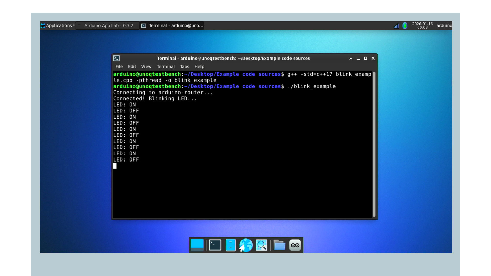

The compilation needs the `-pthread` flag for thread support. Since `msgpack-cxx` is a header-only library, no additional linking flags are required.

### Example: Reading Sensor Data

This example shows how to call a function and receive a return value. Create `sensor_example.cpp`:

```cpp
#include "arduino_bridge.hpp"
#include <iostream>

int main() {
    ArduinoBridge bridge;
    
    if (!bridge.connect()) {
        return 1;
    }
    
    std::cout << "Reading sensor value..." << std::endl;
    
    auto response = bridge.call("read_sensor");
    
    if (response.success) {
        int value = response.result.get().as<int>();
        std::cout << "Sensor value: " << value << std::endl;
    } else {
        std::cerr << "Error: " << response.error << std::endl;
    }
    
    bridge.disconnect();
    return 0;
}
```

MCU side sketch is as follows:

```cpp
#include "Arduino_RouterBridge.h"

void setup() {
    Bridge.begin();
    Bridge.provide("read_sensor", read_sensor);
}

void loop() {}

int read_sensor() {
    return analogRead(A0);
}
```

Here we use `call()` instead of `notify()` because we need the sensor value back. The response object contains either the result or an error message. You extract the actual value using `response.result.get().as<int>()`, which converts the MessagePack data to a C++ integer. The UNO Q has a 14-bit ADC, so analog readings range from 0 to 16383.

Compile and run:

```bash
g++ -std=c++17 sensor_example.cpp -pthread -o sensor_example
```

```bash
./sensor_example
```

### Complete Example: Temperature Monitor

This example shows a practical application that monitors temperature, logs data to a file, and controls an LED based on temperature thresholds. Create `temp_monitor.cpp`:

```cpp
#include "arduino_bridge.hpp"
#include <iostream>
#include <fstream>
#include <thread>
#include <chrono>
#include <iomanip>
#include <ctime>

std::string get_timestamp() {
    auto now = std::time(nullptr);
    auto tm = *std::localtime(&now);
    std::ostringstream oss;
    oss << std::put_time(&tm, "%Y-%m-%d %H:%M:%S");
    return oss.str();
}

int main() {
    ArduinoBridge bridge;
    
    if (!bridge.connect()) {
        std::cerr << "Failed to connect" << std::endl;
        return 1;
    }
    
    std::cout << "Temperature Monitor Started" << std::endl;
    
    std::ofstream logfile("temperature_log.csv");
    logfile << "Timestamp,Temperature_C" << std::endl;
    
    while (true) {
        auto response = bridge.call("read_temperature");
        
        if (response.success) {
            float temp = response.result.get().as<float>();
            std::string timestamp = get_timestamp();
            
            std::cout << timestamp << " - " << temp << "°C" << std::endl;
            
            logfile << timestamp << "," << temp << std::endl;
            logfile.flush();
            
            if (temp > 50.0) {
                bridge.notify("set_led_state", true);
                std::cout << "WARNING: High temperature!" << std::endl;
            } else {
                bridge.notify("set_led_state", false);
            }
        } else {
            std::cerr << "Error: " << response.error << std::endl;
        }
        
        std::this_thread::sleep_for(std::chrono::seconds(5));
    }
    
    return 0;
}
```

The sketch for the MCU side is as follows:

```cpp
#include "Arduino_RouterBridge.h"

const int TEMP_PIN = A0;

void setup() {
    pinMode(LED_BUILTIN, OUTPUT);
    
    Bridge.begin();
    Bridge.provide("read_temperature", read_temperature);
    Bridge.provide("set_led_state", set_led_state);
    
    Monitor.begin();
    Monitor.println("Temperature sensor ready");
}

void loop() {}

float read_temperature() {
    int raw = analogRead(TEMP_PIN);
    float voltage = (raw / 16383.0) * 3.3;
    float temp_c = (voltage - 0.5) * 100.0;
    
    Monitor.print("Temperature: ");
    Monitor.println(temp_c);
    
    return temp_c;
}

void set_led_state(bool state) {
    digitalWrite(LED_BUILTIN, state ? LOW : HIGH);
}
```

This example combines both `call()` and `notify()` operations. It uses `call()` to get temperature readings and `notify()` to control the LED, since we don't need confirmation that the LED changed. The program logs all readings to a CSV file. It uses `flush()` to make sure data is written immediately rather than buffered. The temperature calculation assumes a TMP36 sensor, where each degree Celsius equals 10 mV and a 500 mV offset at 0°C.

Compile and run:

```bash
g++ -std=c++17 temp_monitor.cpp -pthread -o temp_monitor
```

```bash
./temp_monitor
```

## Python® Implementation

If you prefer Python® for your Linux applications, you can also communicate directly with the `arduino-router` without using Arduino App Lab.

Install the MessagePack library:

```bash
pip3 install msgpack --break-system-packages
```

Verify installation using the following command:

```bash
python3 -c "import msgpack; print(msgpack.version)"
```

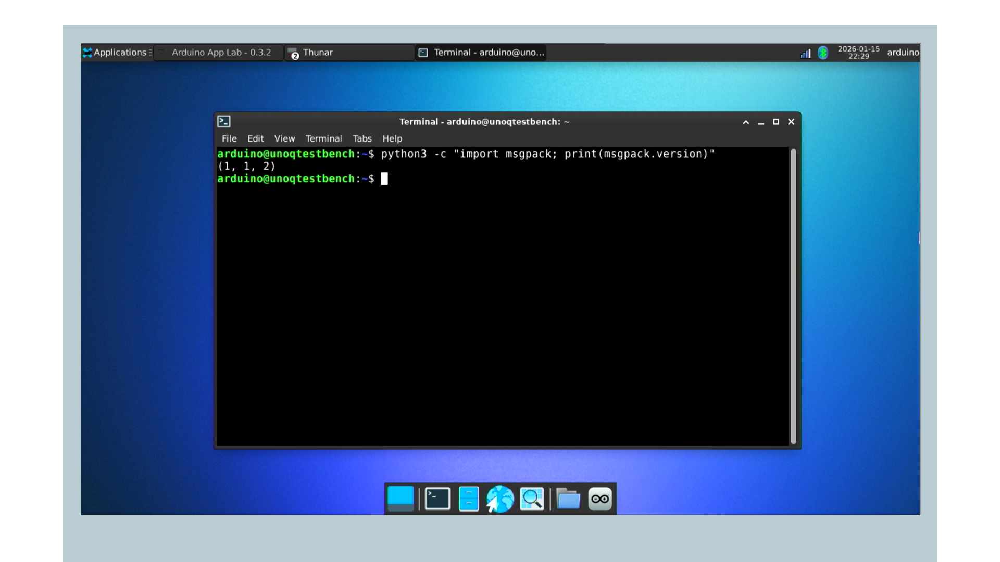

Create `arduino_bridge.py`:

```python
import socket
import msgpack
import threading
import time

class ArduinoBridge:
    def __init__(self, socket_path="/var/run/arduino-router.sock"):
        self.socket_path = socket_path
        self.sock = None
        self.msg_counter = 0
        self.pending_responses = {}
        self.running = False
        self.recv_thread = None
        self.lock = threading.Lock()
        
    def connect(self):
        try:
            self.sock = socket.socket(socket.AF_UNIX, socket.SOCK_STREAM)
            self.sock.connect(self.socket_path)
            
            self.running = True
            self.recv_thread = threading.Thread(target=self._receive_loop, daemon=True)
            self.recv_thread.start()
            
            return True
        except Exception as e:
            print(f"Connection failed: {e}")
            return False
    
    def call(self, method, *args, timeout=5):
        self.msg_counter += 1
        msgid = self.msg_counter
        
        message = [0, msgid, method, list(args)]
        packed = msgpack.packb(message)
        
        event = threading.Event()
        with self.lock:
            self.pending_responses[msgid] = {"event": event, "result": None, "error": None}
        
        self.sock.sendall(packed)
        
        if event.wait(timeout):
            with self.lock:
                response = self.pending_responses.pop(msgid)
            
            if response["error"]:
                raise Exception(response["error"])
            return response["result"]
        else:
            with self.lock:
                self.pending_responses.pop(msgid, None)
            raise TimeoutError(f"Timeout waiting for {method}")
    
    def notify(self, method, *args):
        message = [2, method, list(args)]
        packed = msgpack.packb(message)
        self.sock.sendall(packed)
    
    def disconnect(self):
        self.running = False
        if self.sock:
            self.sock.close()
        if self.recv_thread:
            self.recv_thread.join(timeout=1)
    
    def _receive_loop(self):
        unpacker = msgpack.Unpacker()
        while self.running:
            try:
                data = self.sock.recv(4096)
                if not data:
                    break
                
                unpacker.feed(data)
                for msg in unpacker:
                    self._handle_response(msg)
            except Exception as e:
                if self.running:
                    print(f"Receive error: {e}")
                break
    
    def _handle_response(self, msg):
        if not isinstance(msg, list) or len(msg) < 4:
            return
        
        msg_type, msgid, error, result = msg[0], msg[1], msg[2], msg[3]
        
        if msg_type != 1:
            return
        
        with self.lock:
            if msgid in self.pending_responses:
                self.pending_responses[msgid]["error"] = error
                self.pending_responses[msgid]["result"] = result
                self.pending_responses[msgid]["event"].set()
```

The Python® implementation follows the same approach as the C++ version. When you call `connect()`, it opens a socket and starts a background thread to receive messages. The receive thread runs as a daemon thread, which means it will automatically stop when your program exits.

The `call()` method works similarly to C++, but uses Python®'s Event object to wait for responses. When you call a function, it creates an event and stores it in the pending responses dictionary.

The receive thread watches for incoming messages and sets the event when a matching response arrives. The `with self.lock:` blocks make sure that only one thread accesses the pending responses at a time.

Python®'s MessagePack unpacker automatically handles partial messages, so you can feed it data as it arrives from the socket without worrying about message boundaries.

### Python® Example

Here is a simple example using the Python® bridge:

```python
from arduino_bridge import ArduinoBridge
import time

def main():
    bridge = ArduinoBridge()
    
    if not bridge.connect():
        print("Failed to connect")
        return
    
    print("Connected!")
    
    for i in range(10):
        state = i % 2 == 0
        bridge.notify("set_led_state", state)
        print(f"LED: {'ON' if state else 'OFF'}")
        time.sleep(0.5)
    
    try:
        value = bridge.call("read_sensor")
        print(f"Sensor value: {value}")
    except Exception as e:
        print(f"Error: {e}")
    
    bridge.disconnect()

if __name__ == "__main__":
    main()
```

This example first blinks an LED ten times using `notify()`, then reads a sensor value using `call()`. The Python® syntax is cleaner than C++ for simple tasks like this. When calling methods with arguments, Python automatically converts them to a list for the MessagePack message.

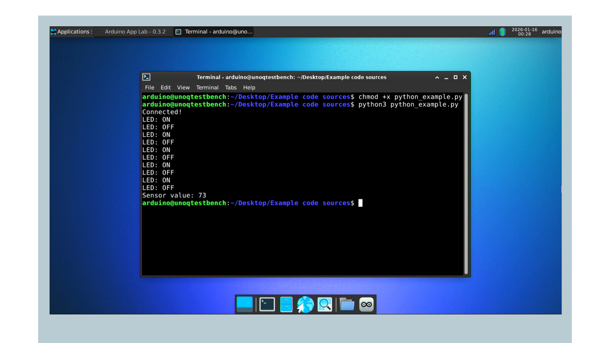

## Troubleshooting

When working with the `arduino-router`, you may encounter some common issues. Here is how to diagnose and fix them.

### Connection Failed

If you cannot connect to the router, first check if it is running:

```bash
systemctl status arduino-router
```


If it is not running, start it:

```bash
sudo systemctl start arduino-router
```

### Timeout Waiting for Response

It usually means the MCU hasn't registered the function you're trying to call. Verify your MCU sketch called `Bridge.begin()` in `setup()` and registered the function with `Bridge.provide("method_name", function_pointer)`.

The function name must match exactly, as they are case-sensitive. Also, verify that the Arduino App Lab app is currently running on the MCU.

Check the router logs for clues:

```bash
journalctl -u arduino-router -n 50
```

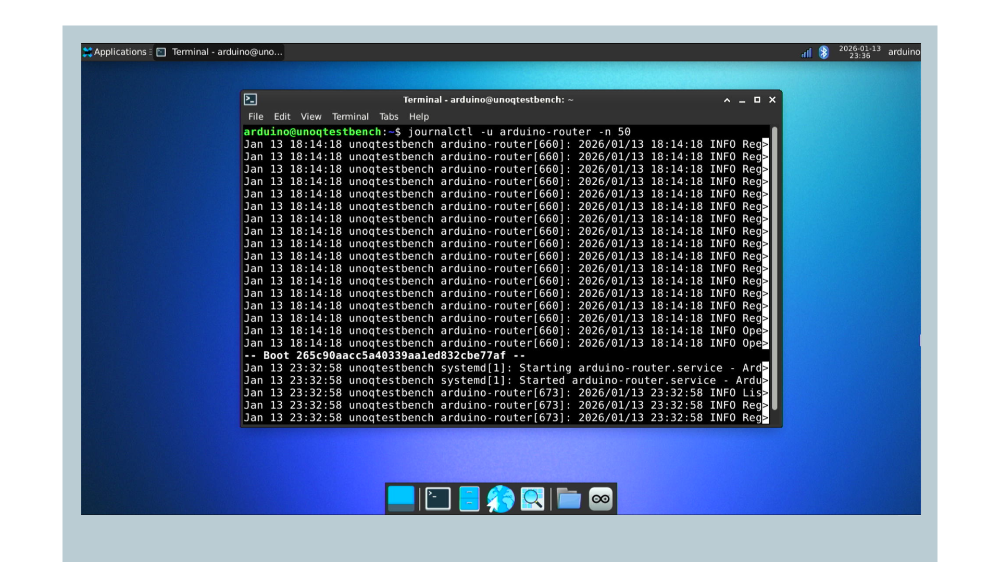

The error `method XXX not available` means no client has registered that function. Check that your MCU sketch is properly registered and is currently running.

The router may have lost connection to the MCU. Check the logs:

```bash
journalctl -u arduino-router -f
```


Restart the router if needed:

```bash
sudo systemctl restart arduino-router
```

### Debugging Tips

Enable verbose logging to see all message traffic. To edit the full system-wide unit file directly, use:

```bash
sudo systemctl edit --full arduino-router.service
```


Alternatively, if you prefer to keep your changes isolated in a drop-in overlay, which overrides only specific settings without touching the original unit file, use:

```bash
sudo systemctl edit arduino-router.service
```


Add `--verbose` to the `ExecStart` line, then reload and restart:

```bash
sudo systemctl daemon-reload
```

```bash
sudo systemctl restart arduino-router
```

```bash
journalctl -u arduino-router -f
```


Test with a simple command before debugging code:

```cpp
bridge.notify("set_led_state", true);
```

Monitor the socket connection using `socat`:

```bash
sudo apt install socat
```

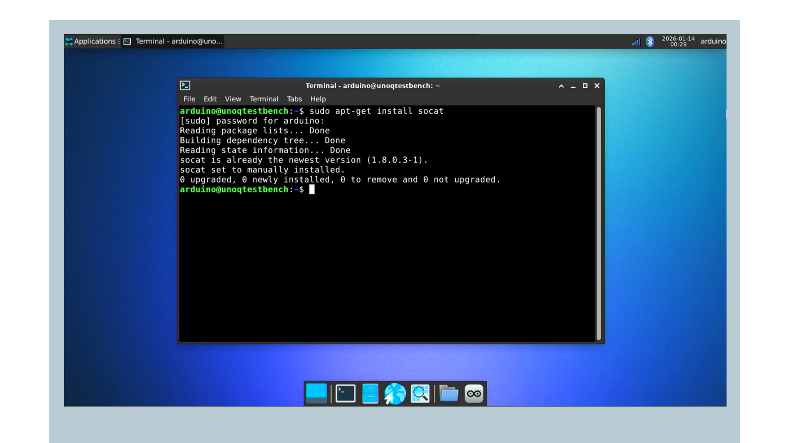

```bash
socat -v UNIX-LISTEN:/tmp/debug.sock,fork UNIX-CONNECT:/var/run/arduino-router.sock
```

Then connect your app to `/tmp/debug.sock` instead to see all traffic.

## Conclusion

In this tutorial, you learned how to communicate with the UNO Q MCU using custom applications in C++ and Python®. You now understand how the `arduino-router` manages RPC communication, the MessagePack protocol structure, and how to build complete applications with bidirectional communication.

This approach opens new possibilities beyond Arduino App Lab. You can build performance-critical applications, integrate with existing Linux services, create multi-process architectures, and use your preferred programming language for UNO Q projects.

### Next Steps

Now that you understand the basics, you can explore the [arduino-router source code](https://github.com/arduino/arduino-router) for advanced features, build multi-process applications where different services communicate through the router, integrate UNO Q with existing Linux daemons and services, or experiment with other languages like Rust, Node.js, or Go using their MessagePack libraries.

### Additional Resources

For more information on related topics, please refer to:

- [MessagePack specification](https://msgpack.org/)
- [MessagePack RPC specification](https://github.com/msgpack-rpc/msgpack-rpc/blob/master/spec.md)
- [UNO Q User Manual - Bridge Section](/tutorials/uno-q/user-manual#bridge---remote-procedure-call-rpc-library)
- [Arduino Forum - UNO Q](https://forum.arduino.cc/c/official-hardware/uno-family/uno-q/222)