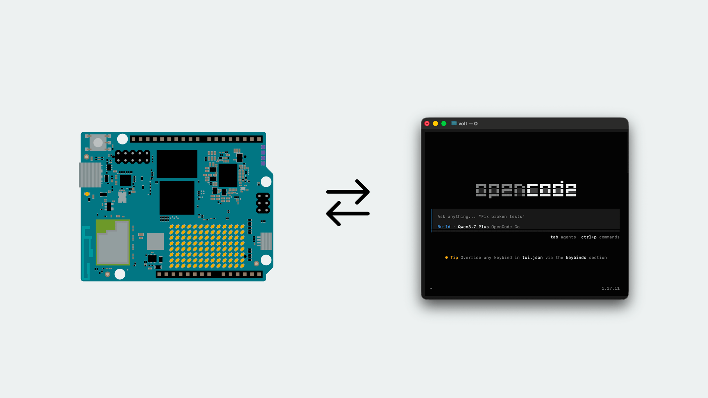
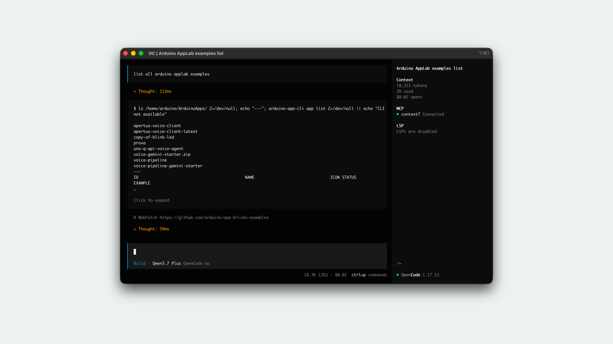
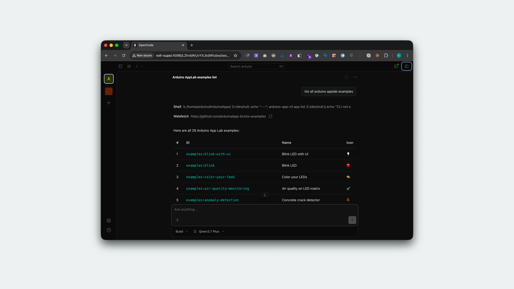

This tutorial covers how to use modern terminal coding agents, such as [OpenCode](https://github.com/anomalyco/opencode), Claude Code, or Codex, directly within the [Arduino® UNO Q](https://store.arduino.cc/products/uno-q)'s Debian Linux environment.

Unlike traditional remote editing, running an AI coding agent inside the board's shell allows the agent to inspect files, install packages, read logs, and test hardware-specific scripts in real-time. We will focus on OpenCode for this guide.



## Required Hardware and Software

### Hardware Requirements
- [Arduino® UNO Q](https://store.arduino.cc/products/uno-q)
- A computer (macOS, Windows, or Linux) to connect from
- USB-C® cable (only required for the ADB-over-USB workflow)
- Network connection (Ethernet or Wi-Fi®) for the SSH workflow

### Software Requirements
- **OpenCode**, or another terminal AI coding agent installed directly on your UNO Q.
- SSH or ADB access configured on your board.

***Note: For more details on setting up connections, refer to the [ADB tutorial](/tutorials/uno-q/adb/) or the [SSH tutorial](/tutorials/uno-q/ssh/).***

## Using OpenCode on the UNO Q

[OpenCode](https://github.com/anomalyco/opencode) is an open-source coding agent that operates within a terminal interface, but also features a rich Web UI. By bridging it with the UNO Q's Debian system, you can drastically speed up hardware prototyping and system debugging.

### 1. Connect to the Board

Before using the agent, ensure you can access the board's shell. 

**Via Secure Shell (SSH):**
If the board is on your local network, access it using its hostname (e.g., `uno-q.local` or whatever hostname you configured):

```bash
ssh arduino@<hostname>.local
```

**Via ADB (Android Debug Bridge):**
If the board is connected directly via USB, use ADB:

```bash
adb shell
```

### 2. Install the Agent

You will install the agent directly onto the UNO Q board. Open an active SSH or ADB terminal session to your board to begin.

Install OpenCode using its standalone bash script:

```bash
curl -fsSL https://opencode.ai/install | bash
```

*Note: If you receive a `command not found` error after installing, your terminal hasn't loaded the new path yet. Simply restart your SSH session or run `source ~/.bashrc` (or `source ~/.profile`) to apply the changes.*

**Alternative Agents**  
If you prefer using **Claude Code**, you can install it via its standalone bash script:

```bash
curl -fsSL https://claude.ai/install.sh | bash
```

Similarly, **Codex CLI** provides a standalone installation script without needing a package manager:

```bash
curl -fsSL https://chatgpt.com/codex/install.sh | sh
```

### 3. Prepare Your Workspace

Since the UNO Q acts as a dedicated hardware sandbox, you don't necessarily need a strictly isolated workspace. You can work directly in your home directory (`~/`) or within the default App Lab directory (`~/ArduinoApps`).

> **Warning:** AI coding agents can run commands and modify files autonomously. Even in a sandbox environment, we strongly recommend initializing a Git repository where you choose to work to track changes and easily revert mistakes.

Connect to your board (via SSH or ADB) and navigate to your preferred directory:

```bash
cd ~/ArduinoApps
git init
```

### 4. Provide Hardware Context to the Agent

The UNO Q features the [`arduino-app-cli`](/software/app-lab/tutorials/cli/), a powerful command-line tool built specifically for managing, building, and deploying App Lab applications directly on the board.

To get the most out of your AI agent, you need to provide it with context about this environment. Since the tool is built-in, you can instruct your agent to explore it directly.

When you start your agent, simply give it a strong initial prompt establishing its boundaries and toolset. For example:

> *"You are running on an Arduino UNO Q Debian system. Please explore the `arduino-app-cli` tool by running `arduino-app-cli --help`. Learn how to create, build, and run applications, and use this tool for our upcoming tasks. Avoid modifying network, SSH, ADB, or security settings."*

Alternatively, you can codify these instructions by creating an **`AGENTS.md`** file in your workspace. An `AGENTS.md` (or `CLAUDE.md` for Claude Code) is a plaintext markdown file that acts as a persistent set of instructions for the agent. Whenever the agent starts in that directory, it automatically reads the file and applies your custom guardrails, preferred coding style, and tool usage rules (like prioritizing the `arduino-app-cli`) without needing to be prompted every time. 

Additionally, agents like OpenCode support **Skills**—modular, reusable scripts or prompt templates that extend the agent's capabilities. You can build custom skills for your workspace that teach the agent exactly how to interact with specific hardware interfaces or `arduino-app-cli` workflows, allowing for highly tailored hardware development.

### 5. Start Developing

Once inside your workspace directory on the board, launch your agent.

**Terminal UI (TUI):**  
Simply type `opencode` to start chatting with the agent directly in your SSH session.



**Web UI:**  
OpenCode also features a built-in Web UI, which is excellent for a more visual experience. Launch it by running:
```bash
opencode serve
```
This will start a local web server, and you can access the interface from your computer's browser while the agent performs work on the board in the background.



Try these example prompts to see what it can do:
- **System Inspection:** *"Inspect this board and summarize the Linux version, available memory, storage, and connected Arduino-related tools."*
- **App Lab Integration:** *"Explore the `arduino-app-cli --help` commands. Once you understand them, scaffold a new Python app that blinks the user LED."*
- **Debugging:** *"Check the logs for errors from my Python app and suggest the smallest fix."*

## Safety & Security

When giving AI agents access to a physical board, keep the following security practices in mind:
- **Git Checkpoints:** Frequently commit your code. This ensures you can roll back if the agent makes destructive changes.
- **System Files:** Explicitly instruct the agent to avoid editing system directories (`/etc/`, `/root/`) unless strictly necessary.
- **Physical Access:** The UNO Q has ADB enabled over USB by default (as per the security hardening guide). Ensure physical access to the board is secured if working in a public environment.
- **API Keys:** Avoid storing API keys permanently on a shared board. Use temporary environment variables instead.

## Alternative: Remote Agent via ADB

If you prefer not to install the agent directly on the board to save memory or keep your API keys strictly on your computer, you can run the agent on your host machine and control the UNO Q via ADB.

In this topology, the agent runs in your computer's terminal but executes commands on the board using the `adb shell`.

### 1. Host Setup
1. Connect the UNO Q to your computer via USB-C®.
2. Ensure the `adb` CLI tool is installed on your computer.
3. Run `adb devices` in your computer's terminal to confirm the board is recognized.
4. Install OpenCode on your computer (`curl -fsSL https://opencode.ai/install | bash`).

### 2. The Context File
Create a project folder **on your host computer** and add an `AGENTS.md` file. You must explicitly instruct the agent to route all its actions through ADB:

```markdown
You are an AI assistant helping develop for an Arduino UNO Q board.
You are running on my host machine, but the target environment is connected via Android Debug Bridge (ADB).

CRITICAL RULES:
1. DO NOT run standard bash commands (like `ls`, `mkdir`, `python`) directly on the host.
2. To run commands on the board, you MUST wrap them in `adb shell` (e.g., `adb shell "arduino-app-cli --help"`).
3. To read files from the board, use `adb shell "cat /path/to/file"`.
4. To write files to the board, write them to this local directory first, then use `adb push <local_file> <board_path>`.
5. To inspect logs or fetch files, use `adb pull <board_path> <local_file>`.
```

When you launch the agent from this local directory, it will automatically bridge the gap: drafting code safely on your computer and pushing it directly to the board via ADB.
