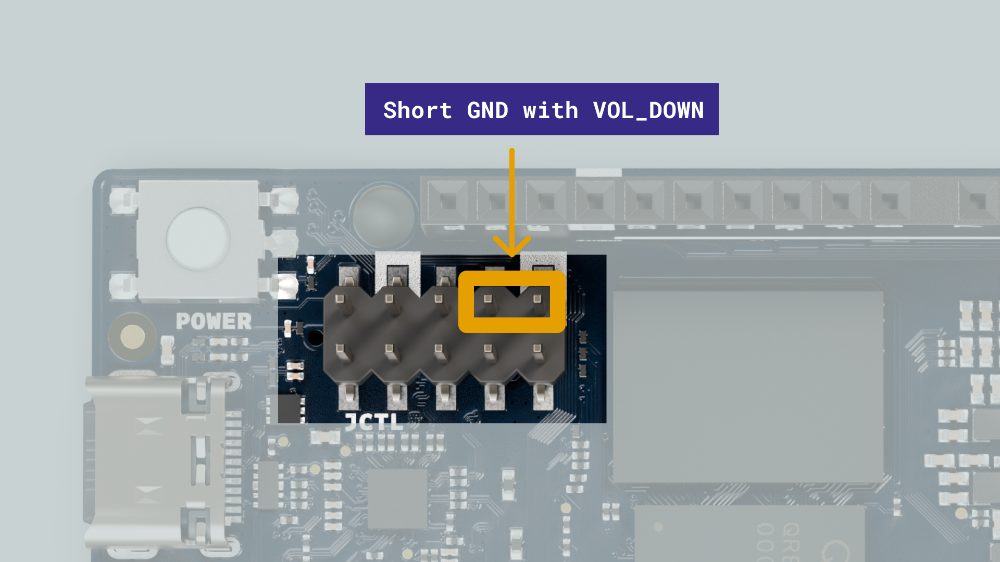

When the **Arduino® UNO Q** is powered externally via the 5V/VIN pin rather than the USB-C® port, the PMIC does not detect a USB connection and therefore does not enable the VBUS path. This means USB peripherals connected to the USB-C® port may not be detected.

To work around this, you can force USB host mode by shorting two specific pins on the **JCTL** header. This instructs the USB-C® controller to operate as a host regardless of how the board is powered.

## Requirements

- (x1) [Arduino® UNO Q 2GB](https://store.arduino.cc/products/uno-q) or [UNO Q 4GB](https://store.arduino.cc/products/uno-q-4gb)
- (x1) [Arduino® UNO Breakout Carrier](https://store.arduino.cc/products/uno-breakout-carrier)
- (x1) [USB-C® cable](https://store.arduino.cc/products/usb-cable2in1-type-c)
- Female-to-female jumper cable or jumper cap

## Force Host Mode

With the board **powered off**, short the two designated pins on the **JCTL** header using a jumper cable or cap, as shown in the image below.

Power the board on. The USB-C® controller will now operate in host mode and USB peripherals will be detected as expected.

<Alert type="info">

The JCTL header operates at **1.8 V** logic. Never attempt applying 3.3 V or 5 V signals to these pins (in this tutorial, we are simply shorting them).

</Alert>

