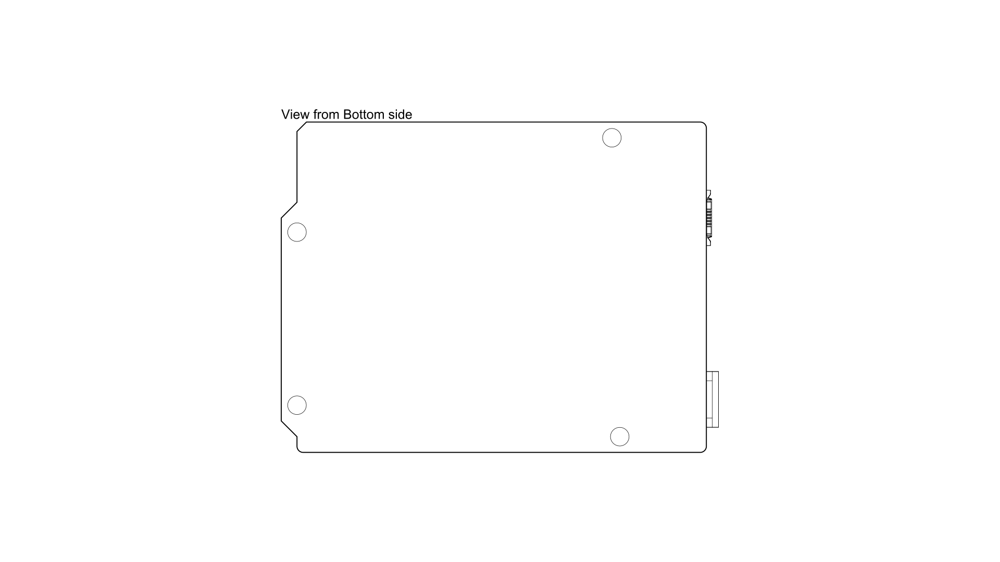

# Description

The Arduino® UNO R4 Minima is the first UNO board to feature a 32-bit microcontroller. It features a RA4M1 series microcontroller from Renesas (R7FA4M1AB3CFM#AA0), which embeds a 48 MHz Arm® Cortex®-M4 microprocessor. The UNO R4 Minima's memory is larger than its predecessors, with 256 kB flash, 32 kB SRAM and 8 kB data memory (EEPROM).

The UNO R4 Minima board's operating voltage is 5 V, making it hardware compatible with UNO form factor accessories with the same operating voltage. Shields designed for previous UNO revisions are therefore safe to use with this board but are not guaranteed to be software compatible due to the change of microcontroller.

# Target areas:

Maker, beginner, education

# Features

- **R7FA4M1AB3CFM#AA0**
  - 48 MHz Arm® Cortex®-M4 microprocessor with a floating point unit (FPU)
  - 5 V operating voltage
  - Real-time Clock (RTC)
  - Memory Protection Unit (MPU)
  - Digital Analog Converter (DAC)
- **Memory**
  - 256 kB Flash Memory
  - 32 kB SRAM
  - 8 kB Data Memory (EEPROM)
- **Pins**
  - 14x digital pins (GPIO), D0-D13
  - 6x analog input pins (ADC), A0-A5
  - 6x PWM pins: D3,D5,D6,D9,D10,D11
- **Peripherals**
  - Capacitive Touch Sensing Unit (CTSU)
  - USB 2.0 Full-Speed Module (USBFS)
  - up to 14-bit ADC
  - up to 12-bit DAC
  - Operational Amplifier (OPAMP)
- **Power**
  - Recommended input voltage (VIN) is 6-24 V
  - 5 V operating voltage
  - Barrel jack connected to VIN pin
  - Power via USB-C® at 5 V
  - Schottky diodes for overvoltage and reverse polarity protection
- **Communication**
  - 1x UART (pin D0, D1)
  - 1x SPI (pin D10-D13, ICSP header)
  - 1x I2C (pin A4, A5, SDA, SCL)
  - 1x CAN (pin D4, D5, external transceiver is required)

# CONTENTS

## The Board

### Application Examples

The UNO R4 Minima is the first UNO series 32-bit development board, being previously based on 8-bit AVR microcontrollers. There are thousands of guides, tutorials and books written about the UNO board, where UNO R4 Minima continues its legacy.

The board features the standard 14 digital I/O ports, 6 analog channels, dedicated pins for I2C, SPI and UART connections. Compared to its predecessors the board has a much larger memory: 8 times more flash memory (256 kB) and 16 times more SRAM (32 kB).

**Entry level projects:** If this is your first project within coding and electronics, the UNO R4 Minima is a good fit. It is easy to get started with and has a lot of online documentation (both official + third party).

**Easy power management:** the UNO R4 Minima has a barrel jack connector and supports input voltages from 6-24 V. This connector is widely popular and removes the need for additional circuitry required to step down the voltage.

**Cross compatibility:** the UNO form factor automatically makes it compatible with hundreds of existing third-party shields and other accessories.

### Related Products

- Arduino UNO R3
- Arduino UNO R3 SMD
- Arduino UNO R4 WiFi

 

# Rating

## Recommended Operating Conditions

| Symbol          | Description                          | Min | Typ | Max | Unit |
| --------------- | ------------------------------------ | --- | --- | --- | ---- |
| VIN  | Input voltage from VIN pad / DC Jack | 6   | 7.0 | 24  | V    |
| VUSB | Input voltage from USB connector     | 4.8 | 5.0 | 5.5 | V    |
| TOP  | Operating Temperature                | -40 | 25  | 85  | °C   |

 

# Functional Overview

## Block Diagram

## Board Topology

### Front View

| **Ref.** | **Description**                      | **Ref.** | **Description**               |
| -------- | ------------------------------------ | -------- | ----------------------------- |
| U1       | R7FA4M1AB3CFM#AA0 Microcontroller IC | J4       | DC Jack                       |
| U2       | ISL854102FRZ-T Buck Converter        | DL1      | LED TX (serial transmit)      |
| PB1      | RESET Button                         | DL2      | LED RX (serial receive)       |
| JANALOG  | Analog input/output headers          | DL3      | LED Power                     |
| JDIGITAL | Digital input/output headers         | DL4      | LED SCK (serial clock)        |
| J1       | ICSP header (SPI)                    | D2       | PMEG6020AELRX Schottky Diode  |
| J2       | SWD/JTAG Connector                   | D3       | PMEG6020AELRX Schottky Diode  |
| J3       | CX90B-16P USB-C® connector           | D4       | PRTR5V0U2X,215 ESD Protection |

### Back View

## Microcontroller (R7FA4M1AB3CFM#AA0)

The UNO R4 Minima is based on the 32-bit RA4M1 series microcontroller, **R7FA4M1AB3CFM#AA0**, from Renesas, which uses a 48 MHz Arm® Cortex®-M4 microprocessor with a floating point unit (FPU).

On the UNO R4 Minima, the operating voltage is fixed at 5 V to be fully retro compatible with shields, accessories & circuits originally designed for older UNO revisions.

The R7FA4M1AB3CFM#AA0 features:

- 256 kB flash / 32 kB SRAM / 8 kB data flash (EEPROM)
- Real-time Clock (RTC)
- 4x Direct Memory Access Controller (DMAC)
- up to 14-bit ADC
- up to 12-bit DAC
- OPAMP
- 1x CAN bus

For more technical details on this microcontroller, visit [Renesas - RA4M1 series](https://www.renesas.com/us/en/products/microcontrollers-microprocessors/ra-cortex-m-mcus/ra4m1-32-bit-microcontrollers-48mhz-arm-cortex-m4-and-lcd-controller-and-cap-touch-hmi).

## USB Connector

The UNO R4 Minima has one USB-C® port, used to power and program your board as well as send & receive serial communication.

**_Note: You should not power the board with more than 5 V via the USB-C® port._**

## Digital Analog Converter (DAC)

The UNO R4 Minima has a DAC with up to 12-bit resolution attached to the A0 analog pin. A DAC is used to convert a digital signal to an analog signal.

## Rated Current

| Min   | Typ   | Max   | Notes                                                                                                                 |
| ----- | ----- | ----- | --------------------------------------------------------------------------------------------------------------------- |
| 29.71 | 33.39 | 36.98 | Average current consumption while powered with USB-C and running the default firmware shipped with the board (blink). |

## Power Options

Power can either be supplied via the VIN pin, the barrel jack, or via USB-C® connector. If power is supplied via VIN, the ISL854102FRZ buck converter steps the voltage down to 5 V.

The VUSB, barrel jack connector and VIN pins are connected to the ISL854102FRZ buck converter, with Schottky diodes in place for reverse polarity & overvoltage protection respectively.

Power via USB supplies about ~4.7 V (due to Schottky drop) to the RA4M1 microcontroller.

### Power Tree

### Pin Voltage

The UNO R4 Minima operates on 5 V, as does all pins on this board except for the **3.3V pin**. This pin draws power from the `VCC_USB` pin on the R7FA4M1AB3CFM#AA0, and is not connected to the buck converter.

### Pin Current

The GPIOs on the R7FA4M1AB3CFM#AA0 microcontroller can handle up to **8 mA**. Never connect devices that draw higher current directly to a GPIO.

In case you need to power external devices that require more power, e.g. servo motors, use an external power supply.

 

# Mechanical Information

## Pinout

### Analog

| Pin | Function | Type   | Description                                      |
| --- | -------- | ------ | ------------------------------------------------ |
| 1   | BOOT     | Mode   | Mode selection                                   |
| 2   | IOREF    | IOREF  | Reference for digital logic V - connected to 5 V |
| 3   | Reset    | Reset  | Reset                                            |
| 4   | +3V3     | Power  | +3V3 Power Rail                                  |
| 5   | +5V      | Power  | +5V Power Rail                                   |
| 6   | GND      | Power  | Ground                                           |
| 7   | GND      | Power  | Ground                                           |
| 8   | VIN      | Power  | Voltage Input                                    |
| 9   | A0       | Analog | Analog input 0 / DAC                             |
| 10  | A1       | Analog | Analog input 1 / OPAMP+                          |
| 11  | A2       | Analog | Analog input 2 / OPAMP-                          |
| 12  | A3       | Analog | Analog input 3 / OPAMPOut                        |
| 13  | A4       | Analog | Analog input 4 / I²C Serial Datal (SDA)          |
| 14  | A5       | Analog | Analog input 5 / I²C Serial Clock (SCL)          |

### Digital

| Pin | Function  | Type    | Description                                      |
| --- | --------- | ------- | ------------------------------------------------ |
| 1   | SCL       | Digital | I²C Serial Clock (SCL)                           |
| 2   | SDA       | Digital | I²C Serial Datal (SDA)                           |
| 3   | AREF      | Digital | Analog Reference Voltage                         |
| 4   | GND       | Power   | Ground                                           |
| 5   | D13/SCK   | Digital | GPIO 13 / SPI Clock                              |
| 6   | D12/CIPO  | Digital | GPIO 12 / SPI Controller In Peripheral Out       |
| 7   | D11/COPI  | Digital | GPIO 11 (PWM) / SPI Controller Out Peripheral In |
| 8   | D10/CS    | Digital | GPIO 10 (PWM) / SPI Chip Select                  |
| 9   | D9        | Digital | GPIO 9 (PWM~)                                    |
| 10  | D8        | Digital | GPIO 8                                           |
| 11  | D7        | Digital | GPIO 7                                           |
| 12  | D6        | Digital | GPIO 6 (PWM~)                                    |
| 13  | D5/CANRX0 | Digital | GPIO 5 (PWM~) / CAN Transmitter (TX)             |
| 14  | D4/CANTX0 | Digital | GPIO 4 / CAN Receiver (RX)                       |
| 15  | D3        | Digital | GPIO 3 (PWM~) / Interrupt Pin                    |
| 16  | D2        | Digital | GPIO 2 / Interrupt Pin                           |
| 17  | D1/TX0    | Digital | GPIO 1 / Serial 0 Transmitter (TX)               |
| 18  | D0/TX0    | Digital | GPIO 0 / Serial 0 Receiver (RX)                  |

### ICSP

| Pin | Function | Type     | Description                  |
| --- | -------- | -------- | ---------------------------- |
| 1   | CIPO     | Internal | Controller In Peripheral Out |
| 2   | +5V      | Internal | Power Supply of 5 V          |
| 3   | SCK      | Internal | Serial Clock                 |
| 4   | COPI     | Internal | Controller Out Peripheral In |
| 5   | RESET    | Internal | Reset                        |
| 6   | GND      | Internal | Ground                       |

### SWD/JTAG

| Pin | Function | Type     | Description         |
| --- | -------- | -------- | ------------------- |
| 1   | +5V      | Internal | Power Supply of 5 V |
| 2   | SWDIO    | Internal | Data I/O pin        |
| 3   | GND      | Internal | Ground              |
| 4   | SWCLK    | Internal | Clock Pin           |
| 5   | GND      | Internal | Ground              |
| 6   | NC       | Internal | Not connected       |
| 7   | RX       | Internal | Serial Receiver     |
| 8   | TX       | Internal | Serial Transmitter  |
| 9   | GND      | Internal | Ground              |
| 10  | NC       | Internal | Not connected       |

## Mounting Holes And Board Outline

## Board Operation

### Getting Started - IDE

If you want to program your UNO R4 Minima while offline you need to install the Arduino® Desktop IDE **[1]**. To connect the UNO R4 Minima to your computer, you will need a Type-C® USB cable, which can also provide power to the board, as indicated by the LED (DL1).

### Getting Started - Arduino Cloud Editor

All Arduino boards, including this one, work out-of-the-box on the Arduino Cloud Editor **[2]**, by just installing a simple plugin.

The Arduino Cloud Editor is hosted online, therefore it will always be up-to-date with the latest features and support for all boards. Follow **[3]** to start coding on the browser and upload sketches onto your board.

### Getting Started - Arduino Cloud

All Arduino IoT enabled products are supported on Arduino Cloud which allows you to log, graph and analyze sensor data, trigger events, and automate your home or business.

### Online Resources

Now that you have gone through the basics of what you can do with the board you can explore the endless possibilities it provides by checking exciting projects on Arduino Project Hub **[4]**, the Arduino Library Reference **[5]**, and the online store **[6]**; where you will be able to complement your board with sensors, actuators and more.

### Board Recovery

All Arduino boards have a built-in bootloader which allows flashing the board via USB. In case a sketch locks up the processor and the board is not reachable anymore via USB, it is possible to enter bootloader mode by double-tapping the reset button right after the power-up.

# Certifications

## Declaration of Conformity CE DoC (EU)

We declare under our sole responsibility that the products above are in conformity with the essential requirements of the following EU Directives and therefore qualify for free movement within markets comprising the European Union (EU) and European Economic Area (EEA).

## Declaration of Conformity to EU RoHS & REACH 211 01/19/2021

Arduino boards are in compliance with RoHS 2 Directive 2011/65/EU of the European Parliament and RoHS 3 Directive 2015/863/EU of the Council of 4 June 2015 on the restriction of the use of certain hazardous substances in electrical and electronic equipment.

| **Substance**                          | **Maximum Limit (ppm)** |
| -------------------------------------- | ----------------------- |
| Lead (Pb)                              | 1000                    |
| Cadmium (Cd)                           | 100                     |
| Mercury (Hg)                           | 1000                    |
| Hexavalent Chromium (Cr6+)             | 1000                    |
| Poly Brominated Biphenyls (PBB)        | 1000                    |
| Poly Brominated Diphenyl ethers (PBDE) | 1000                    |
| Bis(2-Ethylhexyl} phthalate (DEHP)     | 1000                    |
| Benzyl butyl phthalate (BBP)           | 1000                    |
| Dibutyl phthalate (DBP)                | 1000                    |
| Diisobutyl phthalate (DIBP)            | 1000                    |

Exemptions : No exemptions are claimed.

Arduino Boards are fully compliant with the related requirements of European Union Regulation (EC) 1907 /2006 concerning the Registration, Evaluation, Authorization and Restriction of Chemicals (REACH). We declare none of the SVHCs ([<https://echa.europa.eu/web/guest/candidate-list-table](<https://echa.europa.eu/web/guest/candidate-list-table)), the Candidate List of Substances of Very High Concern for authorization currently released by ECHA, is present in all products (and also package) in quantities totaling in a concentration equal or above 0.1%. To the best of our knowledge, we also declare that our products do not contain any of the substances listed on the "Authorization List" (Annex XIV of the REACH regulations) and Substances of Very High Concern (SVHC) in any significant amounts as specified by the Annex XVII of Candidate list published by ECHA (European Chemical Agency) 1907 /2006/EC.

## Conflict Minerals Declaration

As a global supplier of electronic and electrical components, Arduino is aware of our obligations with regards to laws and regulations regarding Conflict Minerals, specifically the Dodd-Frank Wall Street Reform and Consumer Protection Act, Section 1502. Arduino does not directly source or process conflict minerals such as Tin, Tantalum, Tungsten, or Gold. Conflict minerals are contained in our products in the form of solder, or as a component in metal alloys. As part of our reasonable due diligence Arduino has contacted component suppliers within our supply chain to verify their continued compliance with the regulations. Based on the information received thus far we declare that our products contain Conflict Minerals sourced from conflict-free areas.

## FCC Caution

Any Changes or modifications not expressly approved by the party responsible for compliance could void the user’s authority to operate the equipment.

This device complies with part 15 of the FCC Rules. Operation is subject to the following two conditions:

(1) This device may not cause harmful interference

(2) this device must accept any interference received, including interference that may cause undesired operation.

**FCC RF Radiation Exposure Statement:**

1. This Transmitter must not be co-located or operating in conjunction with any other antenna or transmitter.

2. This equipment complies with RF radiation exposure limits set forth for an uncontrolled environment.

3. This equipment should be installed and operated with a minimum distance of 20 cm between the radiator & your body.

English:
User manuals for licence-exempt radio apparatus shall contain the following or equivalent notice in a conspicuous location in the user manual or alternatively on the device or both. This device complies with Industry Canada licence-exempt RSS standard(s). Operation is subject to the following two conditions:

(1) this device may not cause interference

(2) this device must accept any interference, including interference that may cause undesired operation of the device.

French:
Le présent appareil est conforme aux CNR d’Industrie Canada applicables aux appareils radio exempts de licence. L’exploitation est autorisée aux deux conditions suivantes :

(1) l’ appareil nedoit pas produire de brouillage

(2) l’utilisateur de l’appareil doit accepter tout brouillage radioélectrique subi, même si le brouillage est susceptible d’en compromettre le fonctionnement.

**IC SAR Warning:**

English
This equipment should be installed and operated with a minimum distance of 20 cm between the radiator and your body.

French:
Lors de l’ installation et de l’ exploitation de ce dispositif, la distance entre le radiateur et le corps est d ’au moins 20 cm.

**Important:** The operating temperature of the EUT can’t exceed 85 ℃ and shouldn’t be lower than -40 ℃.

Hereby, Arduino S.r.l. declares that this product is in compliance with essential requirements and other relevant provisions of Directive 201453/EU. This product is allowed to be used in all EU member states.

## Company Information

| Company name    | Arduino S.r.l.                                  |
| --------------- | -------------------------------------------- |
| Company Address | Via Andrea Appiani, 25 - 20900 MONZA（Italy) |

## Reference Documentation

| Ref                                    | Link                                                                     |
| -------------------------------------- | ------------------------------------------------------------------------ |
| Arduino IDE (Desktop)                  | https://www.arduino.cc/en/Main/Software                                  |
| Arduino Cloud Editor                   | https://create.arduino.cc/editor                                         |
| Arduino Cloud Editor - Getting Started | https://docs.arduino.cc/arduino-cloud/guides/editor/                     |
| Arduino Project Hub                    | https://create.arduino.cc/projecthub?by=part&part_id=11332&sort=trending |
| Library Reference                      | https://github.com/arduino-libraries/                                    |
| Arduino Store                          | https://store.arduino.cc/                                                |

## Change Log

| Date       | **Revision** | **Changes**                      |
|------------|--------------|----------------------------------|
| 10/29/2025 | 5            | Mechanical drawing update        |
| 25/04/2024 | 4            | Updated link to new Cloud Editor |
| 28/03/2024 | 3            | Update Rated Current             |
| 25/07/2023 | 2            | Update Pin Table                 |
| 06/19/2023 | 1            | First Release                    |

# 中文 (ZH)

# 描述

Arduino® UNO R4 Minima（以下简称 UNO R4 Minima）是第一款采用 32 位微控制器的 UNO 板。它采用了瑞萨电子（Renesas）（R7FA4M1AB3CFM#AA0）的 RA4M1 系列微控制器，内嵌了 48 MHz 的 Arm® Cortex®-M4 微处理器。UNO R4 的内存比上一代更大，有 256 kB 的闪存，32 kB 的 SRAM 和 8 kB 的数据存储器（EEPROM）。

UNO R4 Minima 板的工作电压是 5 V，使其与具有相同工作电压的 UNO 外形尺寸的配件硬件兼容。因此，为以前的 UNO 版本设计的扩展板可以安全地与该板一起使用，但由于微控制器的更换，不能保证软件兼容性。

# 目标领域：

创客，初学者，教育

# 特点

- **R7FA4M1AB3CFM#AA0**
  - 48 MHz Arm® Cortex®-M4 微处理器，带有浮点单元（FPU）
  - 5 V 工作电压
  - 实时时钟（RTC）
  - 内存保护单元（MPU）
  - 数字模拟转换器（DAC）
- **内存**
  - 256 kB 闪存
  - 32 kB SRAM
  - 8 kB 数据存储器（EEPROM）
- **引脚**
  - 14 个数字引脚 (GPIO)，D0-D13
  - 6 个模拟输入引脚（ADC），A0-A5
  - 6 个 PWM 引脚：D3，D5，D6，D9，D10，D11
- **外设**
  - 电容式触摸感应单元（CTSU）
  - USB 2.0 全速模块（USBFS）
  - 高达 14 位 ADC
  - 高达 12 位 DAC
  - 运算放大器（OPAMP）
- **电源**
  - 推荐输入电压（VIN）为 6-24 V
  - 5 V 工作电压
  - 连接到 VIN 引脚的桶形插孔
  - 通过 USB-C® 以 5 V 供电
  - 肖特基二极管用于过压和反极性保护
- **通信**
  - 1x UART（引脚 D0，D1）
  - 1x SPI（引脚 D10-D13，ICSP 头）
  - 1x I2C（引脚 A4，A5，SDA，SCL）
  - 1x CAN（引脚 D4，D5，需要外部收发器）

# 目录

## 开发板

### 应用示例

UNO R4 Minima 是第一款 UNO 系列 32 位开发板，之前基于 8 位 AVR 微控制器。关于 UNO 板，有数千篇指南、教程和书籍，UNO R4 Minima 继承了它的传统。

该板具有标准的 14 个数字 I/O 端口，6 个模拟通道，专用的 I2C、SPI 和 UART 连接引脚。与其前辈相比，该板具有更大的内存：闪存增加了 8 倍（256 kB），SRAM 增加了 16 倍（32 kB）。

**入门级项目:** 如果这是你在编码和电子领域的第一个项目，UNO R4 Minima 是一个很好的选择。它易于入门，并且有很多在线文档 (包括官方文档和第三方文档)。

**简单的电源管理:** UNO R4 Minima 有一个桶形插座连接器，支持 6-24 V 的输入电压。这种连接器非常流行，可以去除降低电压所需的额外电路。

**跨平台兼容性:** UNO 的外形尺寸自动使其与数百种现有的第三方扩展板和其他配件兼容。

### 相关产品

- Arduino UNO R3
- Arduino UNO R3 SMD
- Arduino UNO R4 WiFi

 

# 评级

## 推荐操作条件

| 符号            | 描述                            | 最低 | 典型 | 最低 | 单位 |
| --------------- | ------------------------------- | ---- | ---- | ---- | ---- |
| VIN  | 输入电压来自 VIN 接线柱/DC 插孔 | 6    | 7.0  | 24   | V    |
| VUSB | 从 USB 连接器输入电压           | 4.8  | 5.0  | 5.5  | V    |
| TOP  | 操作温度                        | -40  | 25   | 85   | °C   |

 

# 功能概述

## 方框图

## 微控制器电路板拓扑结构

### 前视图

| **参考资料** | **描述**                      | **参考资料** | **Description**            |
| ------------ | ----------------------------- | ------------ | -------------------------- |
| U1           | R7FA4M1AB3CFM#AA0 微控制器 IC | J4           | DC 插孔                    |
| U2           | ISL854102FRZ-T 降压转换器     | DL1          | LED TX（串行传输）         |
| PB1          | 重置按钮                      | DL2          | LED RX（串行接收）         |
| JANALOG      | 模拟输入/输出标头             | DL3          | LED 功率                   |
| JDIGITAL     | 数字输入/输出标头             | DL4          | LED SCK (串行时钟)         |
| J1           | ICSP 头（SPI）                | D2           | PMEG6020AELRX 肖特基二极管 |
| J2           | SWD/JTAG 连接器               | D3           | PMEG6020AELRX 肖特基二极管 |
| J3           | CX90B-16P USB-C® 连接器       | D4           | PRTR5V0U2X，215 ESD 保护   |

### 开发板背面视图

## 微控制器（R7FA4M1AB3CFM#AA0）

UNO R4 Minima 基于来自瑞萨的 32 位 RA4M1 系列微控制器**R7FA4M1AB3CFM#AA0**，该微控制器采用 48 MHz Arm® Cortex®-M4 微处理器和浮点单元 (FPU)。

在 UNO R4 Minima 上，工作电压固定为 5V，以便与旧版 UNO 设计的扩展板、配件和电路完全兼容。

R7FA4M1AB3CFM#AA0 特点：

- 256 kB 闪存/32 kB SRAM/8 kB 数据闪存（EEPROM）
- 实时时钟（RTC）
- 4x 直接内存访问控制器（DMAC）
- 高达 14 位 ADC
- 高达 12 位 DAC
- OPAMP
- 1x CAN 总线

访问[Renesas - RA4M1 系列](https://www.renesas.com/us/en/products/microcontrollers-microprocessors/ra-cortex-m-mcus/ra4m1-32-bit-microcontrollers-48mhz-arm-cortex-m4-and-lcd-controller-and-cap-touch-hmi)以获取有关此微控制器的更多技术细节。

## USB 连接器

UNO R4 Minima 具有一个 USB-C® 端口，用于为您的板子供电和编程，以及发送和接收串行通信。

**_注意：请勿通过 USB-C® 端口以超过 5V 的电压给板子供电。_**

## 数字模拟转换器（DAC）

UNO R4 Minima 具有连接到 A0 模拟引脚的 DAC，分辨率高达 12 位。DAC 用于将数字信号转换为模拟信号。

## 额定电流

| 最小值 | 典型值 | 最大值 | 备注                                                              |
| ------ | ------ | ------ | ----------------------------------------------------------------- |
| 29.71  | 33.39  | 36.98  | 使用 USB-C 供电并运行开发板出厂默认固件（闪烁）时的平均电流消耗。 |

## 电源选项

电源可以通过 VIN 引脚、桶形插孔或 USB-C® 连接器供应。如果电源通过 VIN 供应，则 ISL854102FRZ 降压转换器将电压降至 5V。

VUSB、桶形插座连接器和 VIN 引脚与 ISL854102FRZ 降压转换器连接，分别采用肖特基二极管进行反向极性和过压保护。

通过 USB 供电，RA4M1 微控制器的电压约为~4.7 V（由于肖特基压降）。

### 电源树

### 引脚电压

UNO R4 Minima 在 5V 上运行，除了**3.3V 引脚**以外，该板上的所有引脚都是 5V。该引脚从 R7FA4M1AB3CFM#AA0 的`VCC_USB`引脚获取电源，并未连接到降压转换器。

### 引脚电流

R7FA4M1AB3CFM#AA0 微控制器上的 GPIO 可以处理高达**8 mA**的电流。请勿直接连接需要更高电流的设备到 GPIO。

如果您需要为需要更多功率的外部设备（例如伺服电机）提供电源，请使用外部电源。

 

# 机械信息

## 引脚布局

### 模拟

| 引脚 | 功能  | 类型  | 描述                             |
| ---- | ----- | ----- | -------------------------------- |
| 1    | BOOT  | MD    | 模式选择                         |
| 2    | IOREF | IOREF | 数字逻辑 V 的参考 - 连接到 5 V   |
| 3    | Reset | 重置  | 重置                             |
| 4    | +3V3  | 电源  | +3V3 电源线                      |
| 5    | +5V   | 电源  | +5V 电源线                       |
| 6    | GND   | 电源  | 接地                             |
| 7    | GND   | 电源  | 接地                             |
| 8    | VIN   | 电源  | 电压输入                         |
| 9    | A0    | 模拟  | 模拟输入 0 / DAC                 |
| 10   | A1    | 模拟  | 模拟输入 1 / OPAMP+              |
| 11   | A2    | 模拟  | 模拟输入 2 / OPAMP-              |
| 12   | A3    | 模拟  | 模拟输入 3 / OPAMPOut            |
| 13   | A4    | 模拟  | 模拟输入 4 / I2C 串行数据（SDA） |
| 14   | A5    | 模拟  | 模拟输入 5 / I2C 串行时钟（SCL） |

### 数字信号

| 引脚 | 功能      | 类型     | 描述                                   |
| ---- | --------- | -------- | -------------------------------------- |
| 1    | SCL       | 数字信号 | I2C 串行时钟（SCL）                    |
| 2    | SDA       | 数字信号 | I2C 串行数据线（SDA）                  |
| 3    | AREF      | 数字信号 | 模拟参考电压                           |
| 4    | GND       | 电源     | 接地                                   |
| 5    | D13/SCK   | 数字信号 | GPIO 13 / SPI 时钟                     |
| 6    | D12/CIPO  | 数字信号 | GPIO 12 / SPI 控制器在外设输出         |
| 7    | D11/COPI  | 数字信号 | GPIO 11（PWM）/ SPI 控制器输出外设输入 |
| 8    | D10/CS    | 数字信号 | GPIO 10（PWM）/ SPI 芯片选择           |
| 9    | D9        | 数字信号 | GPIO 9 (PWM~)                          |
| 10   | D8        | 数字信号 | GPIO 8                                 |
| 11   | D7        | 数字信号 | GPIO 7                                 |
| 12   | D6        | 数字信号 | GPIO 6（PWM~）                         |
| 13   | D5/CANRX0 | 数字信号 | GPIO 5（PWM~）/ CAN 发射器（TX）       |
| 14   | D4/CANTX0 | 数字信号 | GPIO 4 / CAN 接收器（RX）              |
| 15   | D3        | 数字信号 | GPIO 3（PWM〜）/ 中断引脚              |
| 16   | D2        | 数字信号 | GPIO 2 / 中断引脚                      |
| 17   | D1/TX0    | 数字信号 | GPIO 1 / 串行 0 发射器 (TX)            |
| 18   | D0/TX0    | 数字信号 | GPIO 0 / Serial 0 接收器 (RX)          |

### ICSP

| 引脚 | 功能  | 类型     | 描述                |
| ---- | ----- | -------- | ------------------- |
| 1    | CIPO  | 内部功能 | 控制器在外设中      |
| 2    | +5V   | 内部功能 | 5 V 的电源          |
| 3    | SCK   | 内部功能 | 串行时钟            |
| 4    | COPI  | 内部功能 | 控制器输出 外设输入 |
| 5    | RESET | 内部功能 | 重置                |
| 6    | GND   | 内部功能 | 接地                |

### SWD/JTAG

| 引脚 | 功能  | 类型     | 描述              |
| ---- | ----- | -------- | ----------------- |
| 1    | +5V   | 内部功能 | 5 V 的电源        |
| 2    | SWDIO | 内部功能 | 数据输入/输出引脚 |
| 3    | GND   | 内部功能 | 接地              |
| 4    | SWCLK | 内部功能 | 时钟引脚          |
| 5    | GND   | 内部功能 | 接地              |
| 6    | NC    | 内部功能 | 未连接            |
| 7    | RX    | 内部功能 | 串行接收器        |
| 8    | TX    | 内部功能 | 串行发射器        |
| 9    | GND   | 内部功能 | 接地              |
| 10   | NC    | 内部功能 | 未连接            |

## 安装孔和开发板外形图

## 开发板操作

### 入门 - IDE

如果您想在离线状态下编程 UNO R4 Minima，您需要安装 Arduino® Desktop IDE1。要将 UNO R4 Minima 连接到您的计算机，您需要一根 Type-C® USB 电缆，它也可以为板子提供电源，如 LED（DL1）所示。

### 入门 - Arduino Cloud Editor

所有的 Arduino 板，包括这一款，都可以在 Arduino Cloud Editor 上即插即用，只需安装一个简单的插件。 Arduino Cloud Editor 是在线托管的，因此它总是具有最新的功能和对所有板的支持。请按照 在浏览器上开始编码并将草稿上传到您的板上。

### 入门 - Arduino Cloud

所有支持物联网的 Arduino 产品都可以在 Arduino Cloud 上使用，它可以让您记录、绘制和分析传感器数据，触发事件，并自动化您的家庭或业务。

### 在线资源

现在您已经了解了您可以用板子做什么，您可以通过在 Arduino Project Hub 上查看令人兴奋的项目，Arduino 库参考 ，和在线商店 来探索它提供的无限可能性；在那里您可以用传感器、执行器等来补充您的板子。

### 板恢复

所有的 Arduino 板都有一个内置的引导程序，它允许通过 USB 刷新板子。如果一个草稿锁定了处理器，导致板子无法通过 USB 访问，可以通过在开机后双击复位按钮进入引导程序模式。

# 认证

## 符合性声明 CE DoC（欧盟）

我们在此声明，以上产品符合以下欧盟指令的基本要求，因此有资格在包括欧洲联盟（EU）和欧洲经济区（EEA）的市场内自由流通。

## 声明符合欧盟 RoHS 和 REACH 211 01/19/2021

Arduino 板符合欧洲议会 2011/65/EU 关于限制电子电气设备中某些有害物质使用的 RoHS 2 指令和 2015 年 6 月 4 日理事会 2015/863/EU 关于限制电子电气设备中某些有害物质使用的 RoHS 3 指令。

| **物质**                             | **最大限制（ppm)** |
| ------------------------------------ | ------------------ |
| 铅 (Pb)                              | 1000               |
| 镉 (Cd)                              | 100                |
| 水星（Hg）                           | 1000               |
| 六价铬（Cr6+）                       | 1000               |
| 多溴联苯醚（PBB）                    | 1000               |
| 多溴联苯醚（PBDE）                   | 1000               |
| 邻苯二甲酸二（2-乙基己基）酯（DEHP） | 1000               |
| 苯基丁酸酯（BBP）                    | 1000               |
| 邻苯二甲酸二丁酯（DBP）              | 1000               |
| 邻苯二甲酸二异丁酯（DIBP）           | 1000               |

豁免：未申请任何豁免。

Arduino 板符合欧盟法规（EC）1907/2006，涉及化学品的注册、评估、授权和限制（REACH）的相关要求。我们声明在所有产品（以及包装）中，没有任何由 ECHA（欧洲化学品管理局）发布的目前授权的非常关注物质候选清单（[<https://echa.europa.eu/web/guest/candidate-list-table](<https://echa.europa.eu/web/guest/candidate-list-table))中的SVHC（非常关注物质）以浓度等于或超过0.1%的总量存在。据我们所知，我们还声明我们的产品不含有REACH法规附件XIV“授权清单”和ECHA发布的候选清单附件XVII中规定的任何重要量的非常关注物质（SVHC）（欧洲化学品管理局）1907/2006/EC。

## 冲突矿产声明

作为电子和电气元件的全球供应商，Arduino 意识到我们对冲突矿物的法律和法规的义务，特别是多德-弗兰克华尔街改革和消费者保护法第 1502 节。Arduino 不直接采购或加工锡、钽、钨或金等冲突矿物。冲突矿物以焊料的形式或作为金属合金的组成部分存在于我们的产品中。作为我们合理尽职调查的一部分，Arduino 已联系供应链中的元件供应商，以验证他们对法规的持续遵守情况。根据迄今收到的信息，我们声明我们的产品中含有来自无冲突地区的冲突矿物。

## FCC 警告

任何未经合规责任方明确批准的更改或修改可能会使用户操作设备的权限无效。

本设备符合 FCC 规则第 15 部分。操作受以下两个条件限制：

(1) 此设备可能不会造成有害干扰

(2) 此设备必须接受任何干扰，包括可能导致不良操作的干扰。

**FCC RF 辐射暴露声明**

1. 此发射器不得与任何其他天线或发射器共同放置或操作。

2. 此设备符合为无控制环境设定的射频辐射暴露限制。

3. 这个设备应该安装和操作时，散热器与您的身体之间应保持至少 20 厘米的距离。

免许可无线电设备的用户手册应在用户手册的显眼位置或设备上，或两者兼有的地方包含以下或等效的通知。该设备符合加拿大工业部免许可 RSS 标准。操作受以下两个条件的限制：

(1) 此设备可能不会引起干扰

(2) 本设备必须接受任何干扰，包括可能导致设备不正常运行的干扰。

French:
Le présent appareil est conforme aux CNR d’Industrie Canada applicables aux appareils radio exempts de licence. L’exploitation est autorisée aux deux conditions suivantes :

(1) l’ appareil nedoit pas produire de brouillage

(2) l’utilisateur de l’appareil doit accepter tout brouillage radioélectrique subi, même si le brouillage est susceptible d’en compromettre le fonctionnement.

**IC SAR 警告:**

English
This equipment should be installed and operated with a minimum distance of 20 cm between the radiator and your body.

French:
Lors de l’ installation et de l’ exploitation de ce dispositif, la distance entre le radiateur et le corps est d ’au moins 20 cm.

**重要:** EUT 的工作温度不能超过 85°C，也不能低于-40°C。

Arduino S.r.l.特此声明，该产品符合 201453/EU 指令的基本要求和其他相关规定。该产品允许在所有欧盟成员国使用。

## 公司信息

| 公司名称 | Arduino S.r.l.                                    |
| -------- | ---------------------------------------------- |
| 公司地址 | Via Andrea Appiani, 25 - 20900 MONZA（意大利） |

## 参考文档

| 参考资料                   | 链接                                                                      |
| ------------------------- | ------------------------------------------------------------------------- |
| Arduino IDE (Desktop)     | https://www.arduino.cc/en/Main/Software                                   |
| Arduino Cloud Editor      | https://create.arduino.cc/editor                                          |
| 开始 Arduino Cloud Editor | https://docs.arduino.cc/arduino-cloud/guides/editor/                      |
| Arduino Project Hub       | https://create.arduino.cc/projecthub?by=part&part_id=11332&sort=trending  |
| 图书馆参考                 | https://github.com/arduino-libraries/                                     |
| 在线商店                   | https://store.arduino.cc/                                                 |

## 变更日志

| 日期       | **修订** | **改变**             |
| ---------- | -------- | -------------------- |
| 28/03/2024 | 3        | Update Rated Current |
| 25/07/2023 | 2        | 更新 Pin 表          |
| 06/19/2023 | 1        | 首次发布             |
