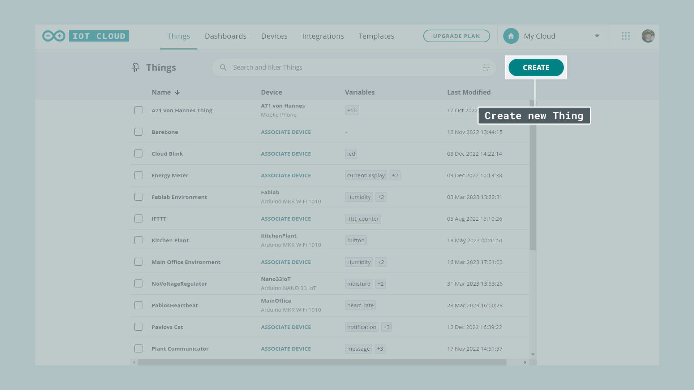
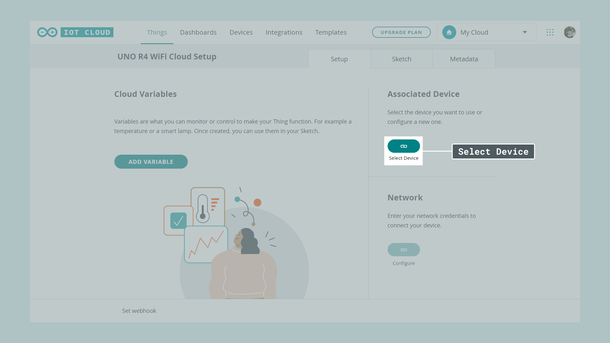
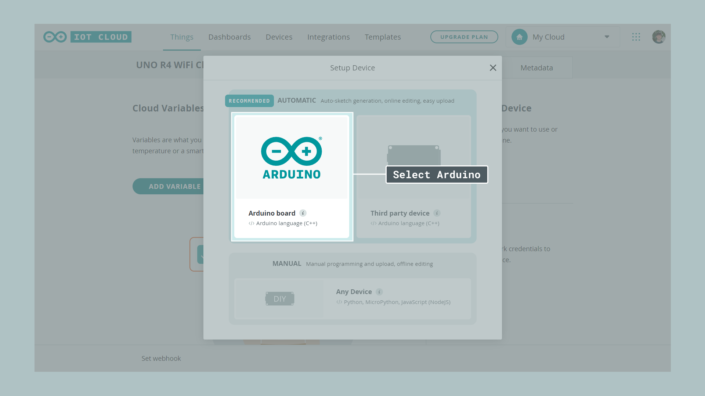
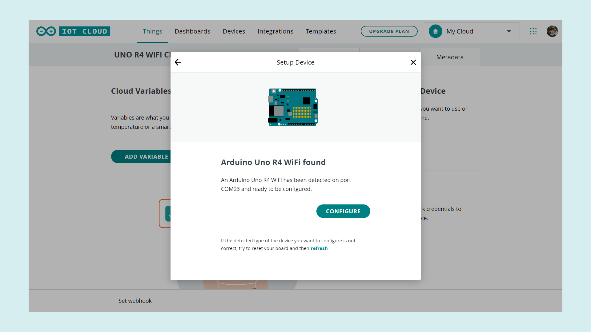
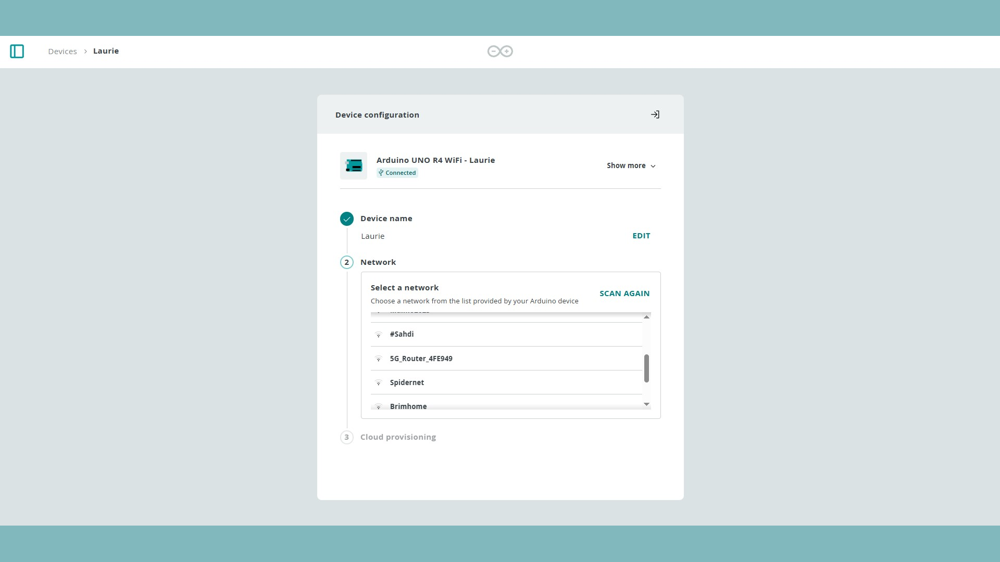
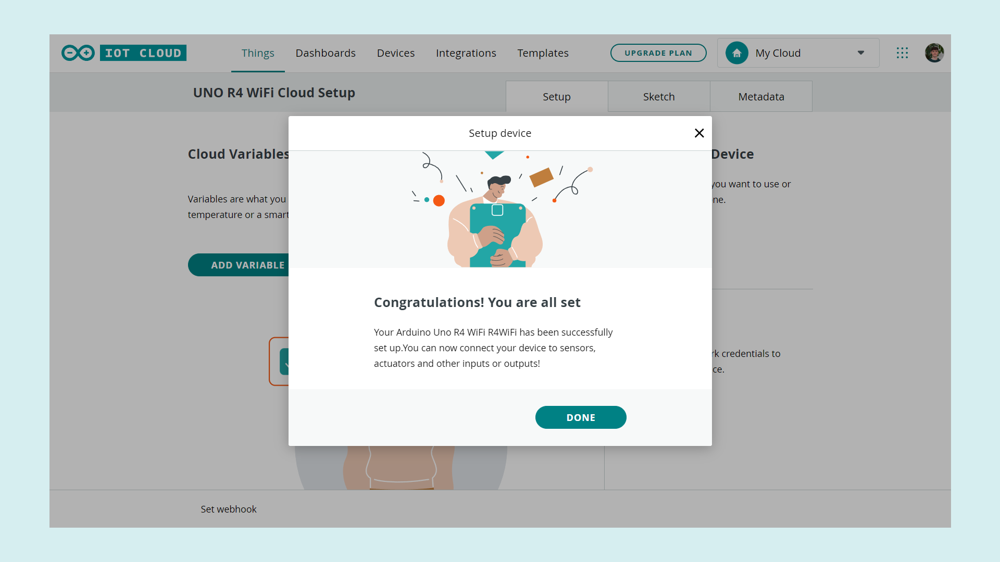

The Arduino UNO R4 WiFi comes with a built-in ESP32-S3 module that enables Wi-Fi® functionality. This also means you can use it with the Arduino Cloud!

This article shows you how to set up your board and connect it to the Cloud allowing you to upload code over the air, create dashboards to monitor your data and control your Arduino board remotely.

## Software & Hardware Needed

- [Arduino UNO R4 WiFi](https://store.arduino.cc/uno-r4-wifi)
- [Arduino Cloud](https://cloud.arduino.cc/home/)

## Setup and Process

***If you are new to the Arduino Cloud before check out [Getting Started With the Arduino Cloud](/arduino-cloud/getting-started/iot-cloud-getting-started).***

To use the Arduino Cloud you will need to register and set up a **free** account. 

### Configure Your Board

After you have set up your account you can connect your board to your pc. Inside the Cloud Things overview click on **Create**.

This will take you to the setup menu for creating your Thing. Here you can set up your device, configure your network connection and add Cloud variables. You can learn more about Cloud variables in [Getting Started With the Arduino Cloud](/arduino-cloud/getting-started/iot-cloud-getting-started). First, under associate device, click on **Select Device**.

Then click on **Set Up New Device**.

You can now choose between three different options depending on what type of board you are using. In this case, using the UNO R4 WiFi continue by clicking on **Arduino board**.

If this is your first time using the Arduino Cloud you will be asked to download the **Arduino Create Agent**. The Create Agent is a piece of software that is necessary for your Arduino board to communicate with your browser. Download and install it by clicking on download and following the installation process.

When the installation is finished you will see a short loading screen and once your board has been found continue by pressing **configure**.

Choose a name for your board and chose the network you want to connect to. Pick and add your Wi-Fi® credentials.

After completing the steps in the popup you should be greeted by a prompt telling you that you can now use the board with the Arduino Cloud.

### Network Configuration

## Summary

You have now successfully set up your UNO R4 WiFi to work with the Arduino Cloud. To get started with your first IoT project, check out our [Getting Started With the Arduino Cloud](arduino-cloud/getting-started/iot-cloud-getting-started) guide.