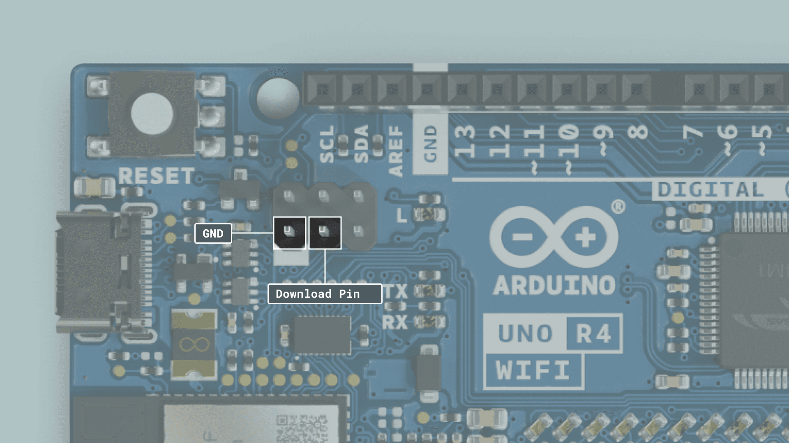

***This tutorial is for advanced users. Following along may result in soft-bricking your board.***

The [Arduino UNO R4 WiFi](/hardware/uno-r4-wifi) has two different microcontrollers onboard, the Renesas RA4M1 and the ESP32-S3.

By default, the ESP32-S3 module acts as a serial bridge, handling the connection to your computer. It also handles the rebooting of the main MCU, the Renesas RA4M1 when it is needed, for example when receiving a new sketch and resetting.

On the UNO R3, the ATMEGA16U2 serves the same purpose, but the onboard ESP32 module is a more advanced SoC, adding Wi-Fi® & Bluetooth® connectivity to the board.

The UNO R4 WiFi also exposes the ESP32's data lines, so that you can program the ESP32 directly. These data lines are exposed by a 3x2 header at the top of the board, or through pads on the bottom side.

***Please note that the ESP32 has a default firmware installed, which is set to communicate with the RA4M1 chip. Any direct programming of the ESP32 will override that firmware and the communication between the chips may be disrupted until the default firmware is restored.***

## Hardware & Software Needed

- [Arduino UNO R4 WiFi](/hardware/uno-r4-wifi)
- [Python®](https://www.python.org/downloads/)
- [esptool](https://docs.espressif.com/projects/esptool/en/latest/esp32/)

## Step 1: ESP32 Download Mode

***We don't provide any custom firmware in this tutorial. If you flash a firmware that doesn't enable a serial-usb-bridge between two microcontrollers you will lose most of the board's functionality!***

In order to flash custom firmware to the ESP32-S3 we need to put the chip in download mode by shorting the **download pin** and **GND**. The download pin can be found on the 3x2 header at the top of the board or on the downside using the exposed pads.



The easiest way is to use a female-to-female cable and short the pins at the top of the board. At this point, the board has to be powered off. Once the pins are shorted you can connect the board to your PC and remove the jumper wire. If you check the device name it should have changed to: **USB JTAG/serial debug unit**.

**Windows**
- Check in the device manager under Universal Serial Bus devices.

**MacOS**
- Check in the System Information under USB.

**Linux**
- Open the commandline and type `lsusb`.

## Step 2: Flash Firmware

Once the chip is set to the right mode we use esptool to flash custom firmware to the board. For this to work you will need to download and install Python, which you can then use to install esptool using a simple command. Verify that python is installed by opening your terminal and write ``pip3``. You should see a list of commands shown in the terminal. Once you have confirmed that it's installed properly install esptool by typing:

```
pip3 install esptool
```

Next, `esptool.py` should be added to your **PATH** so you can run it from anywhere, instead of navigating to the installation folder each time. The PATH variable allows you to run commands and programs from any location on your computer without having to specify the full path to the executable file. This is done differently depending on your operating system, you can read more about it [here](https://learn.sparkfun.com/tutorials/configuring-the-path-system-variable/all). 

Flashing a new firmware is done in two steps, first erasing the firmware currently on the module and then flashing the new one. Once everything is set up it's just a matter of running the following two commands:

To erase the flash memory run:
```
esptool.py --chip esp32s3 --port <yourPort> erase_flash
```

To upload firmware run:
```
esptool.py --chip esp32s3 --port <your port> write_flash -z 0 <yourCustomFirmware.bin>
```

***Please note that we don't provide any custom firmware in this tutorial. If you flash a firmware that doesn't enable a serial-usb-bridge between two microcontrollers you will lose most of the board's functionality!***

## Restore Default Firmware

To restore the default firmware on the ESP32 check out [Update the connectivity module firmware on UNO R4 WiFi](https://support.arduino.cc/hc/en-us/articles/9670986058780-Update-the-connectivity-module-firmware-on-UNO-R4-WiFi#espflash).