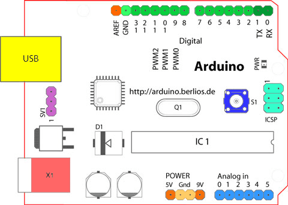

Looking at the board from the top down, this is an outline of what you will see (parts of the board you might interact with in the course of normal use are highlighted):

Starting clockwise from the top center:

- Analog Reference pin (orange)
- Digital Ground (light green)
- Digital Pins 2-13 (green)
- Digital Pins 0-1/Serial In/Out - TX/RX (dark green) - These pins cannot be used for digital i/o (digitalRead and digitalWrite) if you are also using serial communication (e.g. Serial.begin).
- Reset Button - S1 (dark blue)
- In-circuit Serial Programmer (blue-green)
- Analog In Pins 0-5 (light blue)
- Power and Ground Pins (power: orange, grounds: light orange)
- External Power Supply In (9-12VDC) - X1 (pink)
- Toggles External Power and USB Power (place jumper on two pins closest to desired supply) - SV1 (purple)
- USB (used for uploading sketches to the board and for serial communication between the board and the computer; can be used to power the board) (yellow)

## Microcontrollers

[ATmega328P](https://content.arduino.cc/assets/Atmel-7810-Automotive-Microcontrollers-ATmega328P_Datasheet.pdf?) (used on most recent boards)

- Digital I/O Pins:	14 (of which 6 provide PWM output)
- Analog Input Pins:	6 (DIP) or 8 (SMD)
- DC Current per I/O Pin:	40 mA
- Flash Memory:	32 KB
- SRAM:	2 KB
- EEPROM:	1 KB

**ATmega168** (used on most Arduino Diecimila and early Duemilanove)

- Digital I/O Pins:	14 (of which 6 provide PWM output)
- Analog Input Pins:	6 (DIP) or 8 (SMD)
- DC Current per I/O Pin:	40 mA
- Flash Memory	16 KB:
- SRAM:	1 KB
- EEPROM:	512 bytes

**ATmega8** (used on some older board)

- Digital I/O Pins:	14 (of which 3 provide PWM output)
- Analog Input Pins:	6
- DC Current per I/O Pin:	40 mA
- Flash Memory:	8 KB
- SRAM:	1 KB
- EEPROM:	512 bytes

## Digital Pins

In addition to the specific functions listed below, the digital pins on an Arduino board can be used for general purpose input and output via the [pinMode()](https://www.arduino.cc/reference/en/language/functions/digital-io/pinmode/), [digitalRead()](https://www.arduino.cc/reference/en/language/functions/digital-io/digitalread/), and [digitalWrite()](https://www.arduino.cc/reference/en/language/functions/digital-io/digitalwrite/) commands. Each pin has an internal pull-up resistor which can be turned on and off using digitalWrite() (w/ a value of HIGH or LOW, respectively) when the pin is configured as an input. The maximum current per pin is 40 mA.

- Serial: 0 (RX) and 1 (TX). Used to receive (RX) and transmit (TX) TTL serial data. On the Arduino Diecimila, these pins are connected to the corresponding pins of the FTDI USB-to-TTL Serial chip. On the Arduino BT, they are connected to the corresponding pins of the WT11 Bluetooth® module. On the Arduino Mini and LilyPad Arduino, they are intended for use with an external TTL serial module (e.g. the Mini-USB Adapter).
- External Interrupts: 2 and 3. These pins can be configured to trigger an interrupt on a low value, a rising or falling edge, or a change in value. See the [attachInterrupt()](https://www.arduino.cc/reference/en/language/functions/external-interrupts/attachinterrupt/) function for details.
- PWM: 3, 5, 6, 9, 10, and 11. Provide 8-bit PWM output with the [analogWrite()](https://www.arduino.cc/reference/en/language/functions/analog-io/analogwrite/) function. On boards with an ATmega8, PWM output is available only on pins 9, 10, and 11.
- BT Reset: 7. (Arduino BT-only) Connected to the reset line of the Bluetooth® module.
- SPI: 10 (SS), 11 (MOSI), 12 (MISO), 13 (SCK). These pins support SPI communication, which, although provided by the underlying hardware, is not currently included in the Arduino language.
- LED: 13. On the Diecimila and LilyPad, there is a built-in LED connected to digital pin 13. When the pin is HIGH value, the LED is on, when the pin is LOW, it's off.

## Analog Pins

In addition to the specific functions listed below, the analog input pins support 10-bit analog-to-digital conversion (ADC) using the [analogRead()](https://www.arduino.cc/reference/en/language/functions/analog-io/analogread/) function. Most of the analog inputs can also be used as digital pins: analog input 0 as digital pin 14 through analog input 5 as digital pin 19. Analog inputs 6 and 7 (present on the Mini and BT) cannot be used as digital pins.

- I2C: 4 (SDA) and 5 (SCL). Support I2C (TWI) communication using the [Wire](http://wiring.org.co/reference/libraries/Wire/index.html) library (documentation on the Wiring website).

## Power Pins

- VIN (sometimes labelled "9V"). The input voltage to the Arduino board when it's using an external power source (as opposed to 5 volts from the USB connection or other regulated power source). You can supply voltage through this pin, or, if supplying voltage via the power jack, access it through this pin. Note that different boards accept different input voltages ranges, please see the documentation for your board. Also note that the LilyPad has no VIN pin and accepts only a regulated input.
- 5V. The regulated power supply used to power the microcontroller and other components on the board. This can come either from VIN via an on-board regulator, or be supplied by USB or another regulated 5V supply.
- 3V3. (Diecimila-only) A 3.3 volt supply generated by the on-board FTDI chip.
- GND. Ground pins.

## Other Pins

- AREF. Reference voltage for the analog inputs. Used with [analogReference()](https://www.arduino.cc/reference/en/language/functions/analog-io/analogreference/).
- Reset. (Diecimila-only) Bring this line LOW to reset the microcontroller. Typically used to add a reset button to shields which block the one on the board.