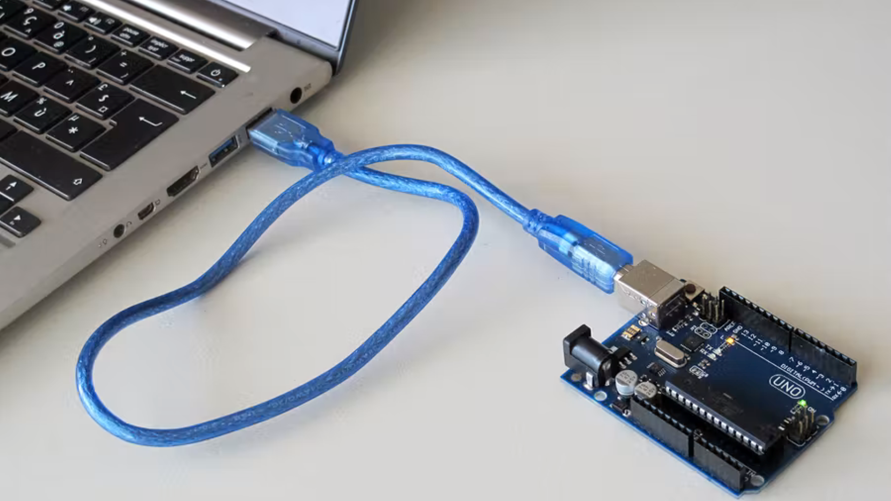
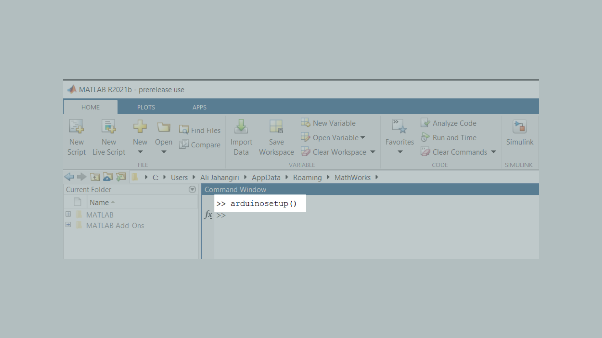
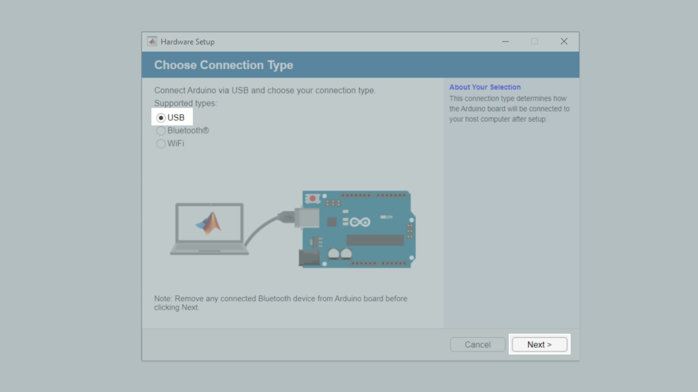
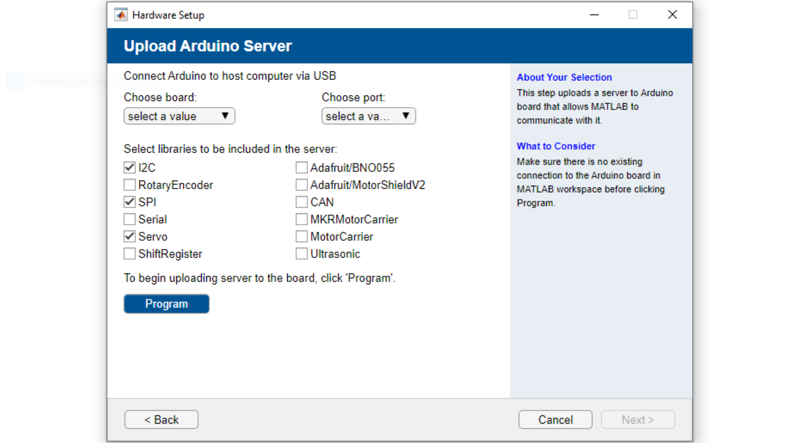
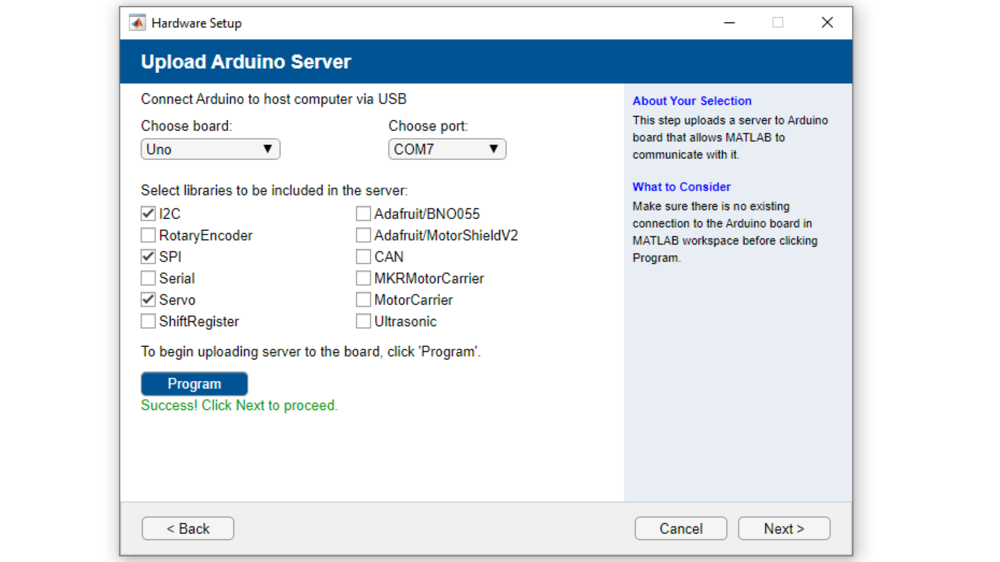
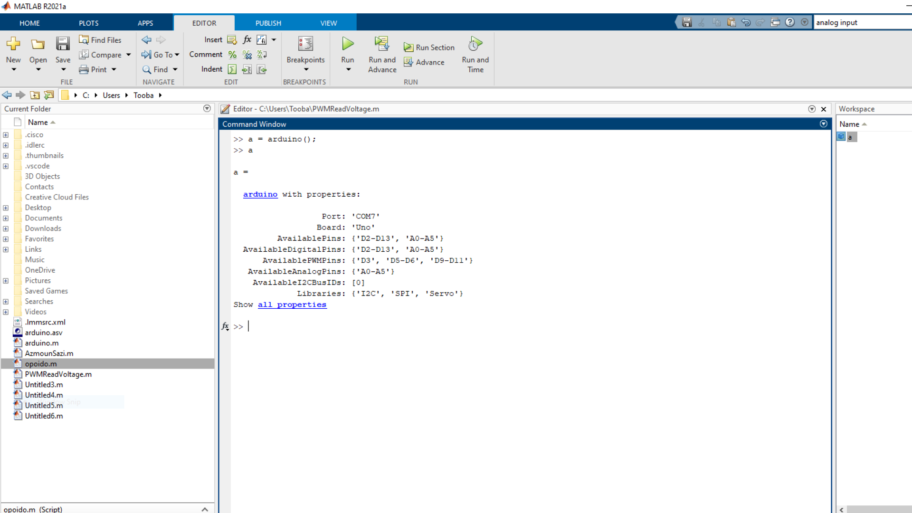
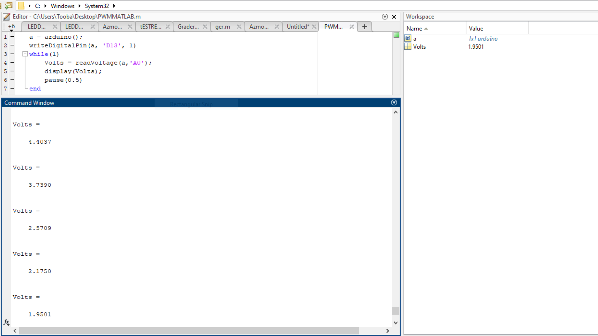

## Introduction

In this tutorial, we will use MATLAB® to turn on an external LED, and then to adjust the output using MATLAB® Support Package for Arduino® Hardware.


### Goals

The goals of this project are:

- Control the UNO R3 LED with MATLAB.
- Control the UNO R3 PWM output with MATLAB.
- Create a dimmable light using a potentiometer.

### Hardware & Software Needed

- [UNO R3](https://store.arduino.cc/products/arduino-uno-rev3)
- [USB 2.0 Cable Type A/B](https://store.arduino.cc/products/usb-2-0-cable-type-a-b)
- Potentiometer trough-hole
- Valid MATLAB® licence
- [MATLAB® Support Package for Arduino® Hardware](https://www.mathworks.com/matlabcentral/fileexchange/47522-matlab-support-package-for-arduino-hardware)


***A valid MATLAB® licence is needed. Your workplace or education institution may have a subscription. Alternatively, a one-year trial subscription to MATLAB® is included as part of the [Arduino Engineering Kit R2](https://store.arduino.cc/products/arduino-engineering-kit-rev2).***


### Why MATLAB?
MATLAB® is an educational and industrial programming platform used to analyse data, perform simulations and carry out model based designs. Through an interactive communication with an Arduino board, you can expand MATLAB®'s capabilities, while also gaining access to a wide range of math, engineering and plotting functions. Check out the capabilities of MATLAB® over on the [MathWorks website](https://www.mathworks.com/solutions.html#capabilities). In this tutorial, we will establish the connection with MATLAB® via a USB and Wi-Fi connection. The [MATLAB® Support Package for Arduino Hardware](https://www.mathworks.com/matlabcentral/fileexchange/47522-matlab-support-package-for-arduino-hardware) must be installed (which may require a MathWorks® account), in order to facilitate the communication between the MATLAB® software on your computer and your Arduino board. 
 
## Connecting the Board to MATLAB
**1.** Connect your board to the computer via the USB 2.0 Cable Type A/B.



**2.** Open MATLAB and run the command `arduinosetup()` in the Command Window.



**3.** A Graphical User Interface (GUI) appears, that will help you set up the MATLAB®-Arduino connection. To establish the connection over the USB cable, make sure that the USB radio box is selected and then click on Next.




**4.** Choose the "UNO" from the dropdown menu, as well as the relevant COM port, and click on the blue `Program` button to upload the Arduino Server to the board. When you have done so, click on next.




**5.** In this step you can review the connection type, Port, board and loaded libraries. You can also click on Test connection to evaluate the Arduino-MATLAB® connection. Next, you should see a Green check-mark signalling the successful connection, as shown in the image below.




**6.** The UNO R3 is now configured to interact with MATLAB®. Now to create the object in MATLAB®, we run the command `a = arduino()`. The properties of the object, including the COM port, are displayed as shown in the example below.



**7.** Enter the command `writeDigitalPin(a, 'D13', 1);`. This command is similar to the `digitalWrite(D13, HIGH)` by the Arduino programming language. Which means that digital pin 13 **D13** is connected to the built-in LED, `a` is the Arduino object we created, and 1 represents a HIGH or ON state. Try turning the LED ON and OFF several times by changing 1 to 0 and vice-versa.


***Unlike in the Arduino IDE, here you cannot address the built-in LED using the `LED_BUILTIN` macro.***


**8.** Now, you can use this command to continuously blink an LED as part of a `while` loop. Try entering the script below.

```
while (1)
      writeDigitalPin(a, 'D13', 0);
      pause(0.5);
      writeDigitalPin(a, 'D13', 1);
      pause(0.5);
end
```


## Circuit

On one breadboard there is a white jumper wire sending 5 volts to the potentiometer. The orange cable is connected to GND(Ground) and the gray wire is our input to A0. A0 will read the variable voltage coming in from pin13 after being adjusted through the potentiometer.
On the right breadboard we have a simple LED circuit comprised of a red output wire from pin11, a resistor and the LED finally connected to GND via the green wire.


***Make sure to connect the longer leg of the LED (anode) to the resistor and the shorter (cathode) to GND.***

## Programming the Board

**1.** Set your output to 1 in the previously mentioned way using `writeDigitalPin(a, 'D13', 1);`. As mentioned earlier, 1 means ON or HIGH and sets the digital pin 13 **D13** to 5V allowing the current flow towards the LED. Check to see if the analog pin 0 **A0** is actually reading an adjustable voltage using `readVoltage(a, 'A0');` in a loop and then use `display(Volts)` to print the value of `Volts` on the "Command Window".

```
a = arduino();
writeDigitalPin(a, 'D13', 1)
while(1)
  Volts = readVoltage(a, 'A0');
  display(Volts);
  pause(0.5)
end
```

The amount assigned to `Volts` should be changing as you rotate the potentiometer's knob.



**2.** Set the value of `Volts` as the voltage to be set on digital pin 11 **D11** using the command: `writePWMVoltage()`. This command is adjustable between 0 and 5 volts. It will convert the value to a PWM Signal on the digital pin.

```
a = arduino();
writeDigitalPin(a, 'D13', 1)
while(1)
  Volts = readVoltage(a, 'A0');
  writePWMVoltage(a, 'D11', Volts)
  display(Volts);
  pause(0.5)
end
```

### Troubleshoot


- If the code gets frozen or seems to not be working try to clear previous Arduino objects linked to the device. You can do this by running the command `clear <object>`, for example `clear a` will clear the Arduino object.
- If you get the message `Unrecognized function or variable 'arduinosetup'` ensure that you have installed the [MATLAB® Support Package for Arduino Hardware](https://www.mathworks.com/matlabcentral/fileexchange/47522-matlab-support-package-for-arduino-hardware).


## Conclusion

You can now control your output using variable inputs to control your devices and make use of the powerful features for scientific computing and developing engineering applications! Different input modulators similar to the potentiometer processed by the various toolboxes offered my MATLAB can lead to infinite types of output beyond that of the brightness of an LED.

## Further Ideas

- You can also use the command line arguments to upload the MATLAB® server to the Arduino® UNO via the `arduino()` command. See more information on using this function in the [MathWorks® documentation](https://www.mathworks.com/help/supportpkg/arduinoio/ref/arduino.html).
- Try writing a MATLAB® code that slowly increases and then decreases the blink speed instead of adjusting the brightness.
- Use different sensors and parts instead of the potentiometer and LED, for example a light sensor.
