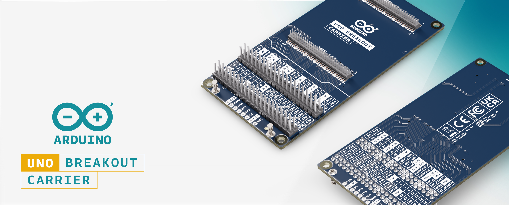
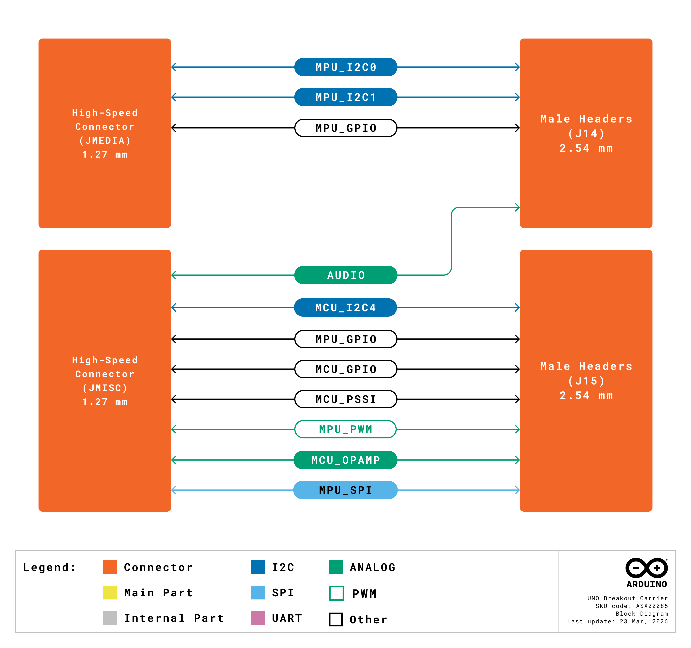
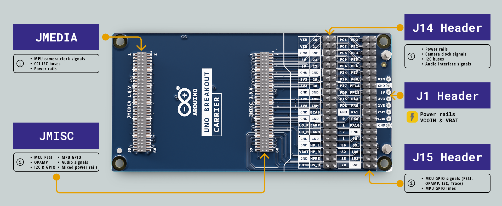
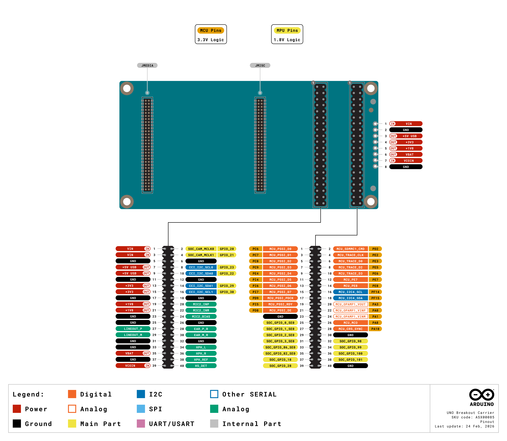
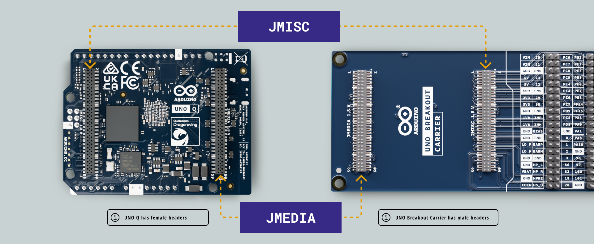
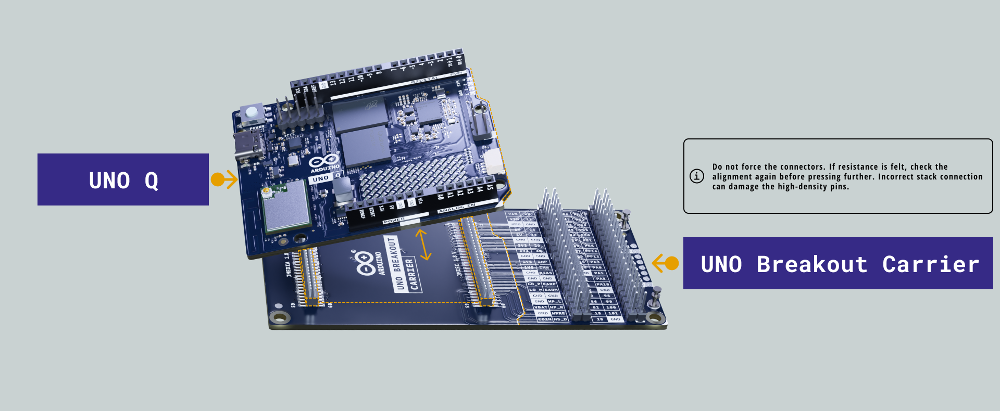
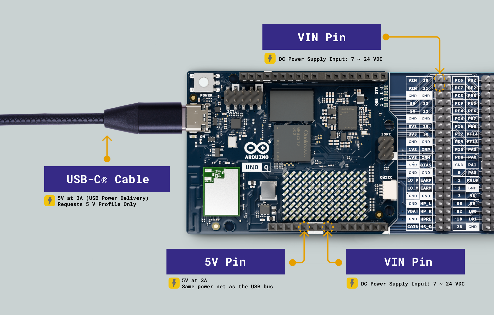
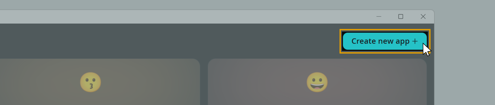

## Overview

This user manual provides a comprehensive guide to the Arduino® UNO Breakout Carrier, covering all its features in one place for easy reference. It includes instructions for setting up, connecting and using its various onboard interfaces.



The UNO Breakout Carrier is designed for prototyping, hardware validation, research and development, and education. It exposes the complete signal set of the UNO Q's JMEDIA and JMISC high-speed connectors through labeled standard headers, removing the need for complex adapters or custom breakout solutions.

## Hardware and Software Requirements

### Hardware Requirements

- (x1) [Arduino® UNO Q 2GB](https://store.arduino.cc/products/uno-q) or [UNO Q 4GB](https://store.arduino.cc/products/uno-q-4gb)
- (x1) [Arduino® UNO Breakout Carrier](https://store.arduino.cc/products/uno-breakout-carrier)
- (x1) [USB-C® cable](https://store.arduino.cc/products/usb-cable2in1-type-c)

### Software Requirements

- [Arduino App Lab 0.1.23+](https://www.arduino.cc/en/software/#app-lab-section)

***You can also use the __Arduino IDE 2+__ to program only the microcontroller (MCU) side of the UNO Q while using the carrier.***

## Product Overview

The Arduino UNO Breakout Carrier extends the capabilities of the Arduino UNO Q by providing direct, complete access to all relevant signals on the JMEDIA and JMISC high-speed connectors. Signals including audio, I2C, SPI, UART, PWM, PSSI, GPIO, OPAMP and power rails are routed to 2.54 mm and 1.27 mm male headers, making the carrier an ideal tool for hardware validation, system integration and signal analysis.



### Carrier Architecture Overview

The UNO Breakout Carrier connects directly to the UNO Q through its two JMEDIA and JMISC high-density connectors, mirroring all signals to breakout headers accessible with standard test equipment, custom circuits, and third-party modules.

Here is an overview of the carrier's main components:

- **Standard 2x20 Male Headers (J14, J15)**: Two 2.54 mm pitch dual-row headers that expose the JMEDIA and JMISC signal sets in an accessible, labeled layout suitable for breadboards, jumper wires and measurement equipment.
- **High-Speed 2x30 Male Headers (JMEDIA, JMISC)**: Two 1.27 mm pitch dual-row headers that provide a direct physical passthrough of the UNO Q's JMEDIA and JMISC high-density connectors for connecting with compatible high-speed peripherals.
- **Through-Hole Pads (1x8, 2.54 mm)**: A single row 8-pad through-hole footprint for soldering custom connections or wiring to external circuits.
- **Power Management**: The carrier is powered directly from the host UNO Q through the high-density connectors. An external VIN input (+7–24 VDC) is also available via the J14 header for applications that require independent power delivery to external circuits.
- **Audio Interfaces**: The carrier exposes the UNO Q's full audio signal set from the JMISC connector, including microphone input (MIC IN), headphone output (HP OUT), audio line output (LINE OUT) and earphone output (EAR OUT) through the J14 and J15 headers.

### Carrier Topology



| **Ref.** | **Description**                                       |
| :------: | :---------------------------------------------------- |
|   J14    | Male header connector 2x20, 2.54 mm pitch             |
|   J15    | Male header connector 2x20, 2.54 mm pitch             |
|  JMEDIA  | High-speed male header connector 2x30, 1.27 mm pitch  |
|  JMISC   | High-speed male header connector 2x30, 1.27 mm pitch  |

### Pinout

The UNO Breakout Carrier pinout is shown in the figure below.



The full pinout is available and downloadable as PDF from the link below:

- [UNO Breakout Carrier full pinout](https://docs.arduino.cc/resources/pinouts/ASX00085-full-pinout.pdf)

### Datasheet

The complete datasheet is available and downloadable as PDF from the link below:

- [UNO Breakout Carrier datasheet](https://docs.arduino.cc/resources/datasheets/ASX00085-datasheet.pdf)

### Schematics

The complete schematics are available and downloadable as PDF from the link below:

- [UNO Breakout Carrier schematics](https://docs.arduino.cc/resources/schematics/ASX00085-schematics.pdf)

### STEP Files

The complete STEP files are available and downloadable from the link below:

- [UNO Breakout Carrier STEP files](../../downloads/ASX00085-step.zip)

## Mechanical Information

### Board Dimensions

The UNO Breakout Carrier has the following dimensions:

- **Width**: 53.34 mm
- **Length**: 107.6 mm

The board outline, dimensions and mounting hole positions are shown in the figure below. All dimensions are in mm.


### Board Connectors

The connector layout of the UNO Breakout Carrier is shown in the figure below. All connectors are placed on the top side of the board. All dimensions are in mm.


### Recommended Operating Conditions

|   **Symbol**   | **Description**          | **Min** | **Typ** | **Max** | **Unit** |
|:--------------:|:-------------------------|:-------:|:-------:|:-------:|:--------:|
|       T        | Operating temperature    |   -10   |   20    |   60    |    °C    |
| V<sub>IN</sub> | Input voltage at VIN pad |    7    |    -    |   24    |    V     |

## First Use

### Mounting the Carrier

To attach the UNO Q to the UNO Breakout Carrier, follow the steps below:





1. Hold the UNO Q with the high-density connectors (JMEDIA and JMISC) facing down, aligned with the corresponding connectors on the carrier.
2. Gently press the UNO Q straight down until both connectors are fully seated. Apply even pressure across both connectors to avoid misalignment.
3. Verify that the UNO Q sits firmly and level on the carrier before applying power.

***Do not force the connectors. If resistance is felt, check the alignment again before pressing further. Incorrect stack connection can damage the high-density pins.***

### Powering the Carrier

Once the UNO Q is mounted on the carrier, the carrier is powered through the UNO Q's high-density connectors. Any of its standard power inputs can power the UNO Q itself:

- A USB-C® cable providing 5 VDC 3 A connected to the UNO Q.
- An external +5 VDC power supply connected to the UNO Q's 5V pin.
- An external +7–24 VDC supply connected to the UNO Q's VIN pin.



For applications that require the carrier to supply power independently to external circuits connected to the J14 header, a VIN supply of +7–24 VDC can be connected to the VIN pads (pins 1 and 3) of J14.

***Click [here](https://docs.arduino.cc/tutorials/uno-q/power-specification/) to learn more about the UNO Q power specifications.***

### Install Arduino App Lab

The [Arduino App Lab](https://docs.arduino.cc/software/app-lab/) is a unified development environment that extends the classic Arduino experience into the world of high-performance computing. It lets you combine Arduino sketches, Python scripts and containerized Linux applications into a single workflow, all of which can interact with signals exposed by the UNO Breakout Carrier.

Arduino App Lab comes **pre-installed** on the UNO Q. To install it on your personal computer for a **PC Hosted** setup, go to the [software section](https://www.arduino.cc/en/software/#app-lab-section) on the official website, scroll to Arduino App Lab and select the variant for your OS.

***Click [here](https://docs.arduino.cc/tutorials/uno-q/user-manual/#install-arduino-app-lab) to learn more about setting up the Arduino App Lab with the UNO Q.***

## Headers and Connectors

The UNO Breakout Carrier exposes all JMEDIA and JMISC signals through two pairs of headers: the standard 2.54 mm headers (J14 and J15) for easy access with common test equipment and breadboards, and the 1.27 mm high-speed passthrough headers (JMEDIA and JMISC) for direct connection with compatible modules.

### J14

J14 is a 2x20 male header (2.54 mm pitch) that exposes the JMEDIA signal set alongside the audio outputs from the JMISC connector. It carries power rails, camera clock signals, I2C buses and all audio interface signals.

| **Pin** | **Function** | **Type**      | **Description**                      |
|---------|--------------|---------------|--------------------------------------|
| 1       | VIN          | Power In      | Voltage Input                        |
| 2       | GPIO_20      | Digital       | SOC_CAM_MCLK0                        |
| 3       | VIN          | Power In      | Voltage Input                        |
| 4       | GPIO_21      | Digital       | SOC_CAM_MCLK1                        |
| 5       | GND          | Ground        | Ground                               |
| 6       | GND          | Ground        | Ground                               |
| 7       | +5V USB      | Power Out     | +5V USB Power Output                 |
| 8       | GPIO_23      | Digital / I2C | CCI_I2C_SCL0                         |
| 9       | +5V USB      | Power Out     | +5V USB Power Output                 |
| 10      | GPIO_22      | Digital / I2C | CCI_I2C_SDA0                         |
| 11      | GND          | Ground        | Ground                               |
| 12      | GND          | Ground        | Ground                               |
| 13      | +3V3         | Power Out     | +3.3V Power Output                   |
| 14      | GPIO_29      | Digital / I2C | CCI_I2C_SDA1                         |
| 15      | +3V3         | Power Out     | +3.3V Power Output                   |
| 16      | GPIO_30      | Digital / I2C | CCI_I2C_SCL1                         |
| 17      | GND          | Ground        | Ground                               |
| 18      | GND          | Ground        | Ground                               |
| 19      | +1V8         | Power Out     | +1.8V Power Output                   |
| 20      | MIC2_INP     | Analog        | Microphone Input Positive            |
| 21      | +1V8         | Power Out     | +1.8V Power Output                   |
| 22      | MIC2_INM     | Analog        | Microphone Input Negative            |
| 23      | GND          | Ground        | Ground                               |
| 24      | MIC2_BIAS    | Analog        | Microphone Bias                      |
| 25      | GND          | Ground        | Ground                               |
| 26      | GND          | Ground        | Ground                               |
| 27      | LINEOUT_P    | Analog        | Audio Line Out Positive              |
| 28      | EAR_P_R      | Analog        | Ear Right Positive                   |
| 29      | LINEOUT_M    | Analog        | Audio Line Out Negative              |
| 30      | EAR_M_R      | Analog        | Ear Right Negative                   |
| 31      | GND          | Ground        | Ground                               |
| 32      | GND          | Ground        | Ground                               |
| 33      | GND          | Ground        | Ground                               |
| 34      | HPH_L        | Analog        | Headphone Left                       |
| 35      | VBAT         | Power Out     | +3.8V Buck Converter Output          |
| 36      | HPH_R        | Analog        | Headphone Right                      |
| 37      | GND          | Ground        | Ground                               |
| 38      | HPH_REF      | Analog        | Headphone Reference                  |
| 39      | VCOIN        | Power In      | Coin Cell / RTC Backup Voltage Input |
| 40      | HS_DET       | Analog        | Headset Detection                    |

### J15

J15 is a 2x20 male header (2.54 mm pitch) that exposes the JMISC signal set, carrying MCU GPIO signals including PSSI, OPAMP, I2C and trace pins, alongside MPU GPIO lines.

| **Pin** | **Function**          | **Type**      | **Description**       |
|---------|-----------------------|---------------|-----------------------|
| 1       | MCU_PSSI_D0 / PC6     | Digital       | MCU GPIO              |
| 2       | MCU_SDMMC1_CMD / PD2  | Digital       | MCU GPIO              |
| 3       | MCU_PSSI_D1 / PC7     | Digital       | MCU GPIO              |
| 4       | MCU_TRACE_CLK / PE2   | Digital       | MCU GPIO              |
| 5       | MCU_PSSI_D2 / PC8     | Digital       | MCU GPIO              |
| 6       | MCU_TRACE_D0 / PE3    | Digital       | MCU GPIO              |
| 7       | MCU_PSSI_D3 / PC9     | Digital       | MCU GPIO              |
| 8       | MCU_TRACE_D2 / PE5    | Digital       | MCU GPIO              |
| 9       | MCU_PSSI_D4 / PE4     | Digital       | MCU GPIO              |
| 10      | MCU_TRACE_D3 / PE6    | Digital       | MCU GPIO              |
| 11      | MCU_PSSI_D5 / PI4     | Digital       | MCU GPIO              |
| 12      | MCU_PE7 / PE7         | Digital       | MCU GPIO              |
| 13      | MCU_PSSI_D6 / PI6     | Digital       | MCU GPIO              |
| 14      | MCU_PE8 / PE8         | Digital       | MCU GPIO              |
| 15      | MCU_PSSI_D7 / PI7     | Digital       | MCU GPIO              |
| 16      | MCU_I2C4_SCL / PF14   | Digital / I2C | MCU GPIO              |
| 17      | MCU_PSSI_PDCK / PD9   | Digital       | MCU GPIO              |
| 18      | MCU_I2C4_SDA / PF15   | Digital / I2C | MCU GPIO              |
| 19      | MCU_PSSI_RDY / PI5    | Digital       | MCU GPIO              |
| 20      | MCU_OPAMP1_VOUT / PA3 | Analog        | MCU GPIO / OPAMP OUT  |
| 21      | MCU_PSSI_DE / PD8     | Digital       | MCU GPIO              |
| 22      | MCU_OPAMP1_VINP / PA0 | Analog        | MCU GPIO / OPAMP IN + |
| 23      | GND                   | Ground        | Ground                |
| 24      | MCU_OPAMP1_VINM / PA1 | Analog        | MCU GPIO / OPAMP IN - |
| 25      | SOC_GPIO_0_SE0        | Digital       | MPU GPIO              |
| 26      | MCU_MCO / PA8         | Digital       | MCU GPIO              |
| 27      | SOC_GPIO_1_SE0        | Digital       | MPU GPIO              |
| 28      | MCU_CRS_SYNC / PA10   | Digital       | MCU GPIO              |
| 29      | SOC_GPIO_2_SE0        | Digital       | MPU GPIO              |
| 30      | GND                   | Ground        | Ground                |
| 31      | SOC_GPIO_3_SE0        | Digital       | MPU GPIO              |
| 32      | SOC_GPIO_98           | Digital       | MPU GPIO              |
| 33      | SOC_GPIO_86_SE0       | Digital       | MPU GPIO              |
| 34      | SOC_GPIO_99           | Digital       | MPU GPIO              |
| 35      | SOC_GPIO_82_SE0       | Digital       | MPU GPIO              |
| 36      | SOC_GPIO_100          | Digital       | MPU GPIO              |
| 37      | SOC_GPIO_18           | Digital       | MPU GPIO              |
| 38      | SOC_GPIO_101          | Digital       | MPU GPIO              |
| 39      | SOC_GPIO_28           | Digital       | MPU GPIO              |
| 40      | GND                   | Ground        | Ground                |

### JMEDIA

JMEDIA is a 2x30 high-speed male header (1.27 mm pitch) that provides a direct passthrough of the UNO Q's JMEDIA high-density connector. It carries MPU camera clock signals, CCI I2C buses and power rails.

| **Pin** | **Function**            | **Type**  | **Description**    |
|---------|-------------------------|-----------|--------------------|
| 1       | GND                     | Ground    | Ground             |
| 2       | GND                     | Ground    | Ground             |
| 3       | NC                      | None      | Not Connected      |
| 4       | NC                      | None      | Not Connected      |
| 5       | NC                      | None      | Not Connected      |
| 6       | NC                      | None      | Not Connected      |
| 7       | GND                     | Ground    | Ground             |
| 8       | GND                     | Ground    | Ground             |
| 9       | NC                      | None      | Not Connected      |
| 10      | NC                      | None      | Not Connected      |
| 11      | GND                     | Ground    | Ground             |
| 12      | NC                      | None      | Not Connected      |
| 13      | GND                     | Ground    | Ground             |
| 14      | GND                     | Ground    | Ground             |
| 15      | NC                      | None      | Not Connected      |
| 16      | SOC_CAM_MCLK0 / GPIO_20 | Digital   | MPU GPIO           |
| 17      | NC                      | None      | Not Connected      |
| 18      | SOC_CAM_MCLK1 / GPIO_21 | Digital   | MPU GPIO           |
| 19      | GND                     | Ground    | Ground             |
| 20      | GND                     | Ground    | Ground             |
| 21      | NC                      | None      | Not Connected      |
| 22      | CCI_I2C_SDA1 / GPIO_29  | I2C       | MPU GPIO           |
| 23      | NC                      | None      | Not Connected      |
| 24      | CCI_I2C_SCL1 / GPIO_30  | I2C       | MPU GPIO           |
| 25      | GND                     | Ground    | Ground             |
| 26      | GND                     | Ground    | Ground             |
| 27      | NC                      | None      | Not Connected      |
| 28      | NC                      | None      | Not Connected      |
| 29      | NC                      | None      | Not Connected      |
| 30      | NC                      | None      | Not Connected      |
| 31      | GND                     | Ground    | Ground             |
| 32      | GND                     | Ground    | Ground             |
| 33      | NC                      | None      | Not Connected      |
| 34      | NC                      | None      | Not Connected      |
| 35      | NC                      | None      | Not Connected      |
| 36      | NC                      | None      | Not Connected      |
| 37      | GND                     | Ground    | Ground             |
| 38      | GND                     | Ground    | Ground             |
| 39      | NC                      | None      | Not Connected      |
| 40      | NC                      | None      | Not Connected      |
| 41      | NC                      | None      | Not Connected      |
| 42      | NC                      | None      | Not Connected      |
| 43      | GND                     | Ground    | Ground             |
| 44      | GND                     | Ground    | Ground             |
| 45      | NC                      | None      | Not Connected      |
| 46      | NC                      | None      | Not Connected      |
| 47      | NC                      | None      | Not Connected      |
| 48      | NC                      | None      | Not Connected      |
| 49      | GND                     | Ground    | Ground             |
| 50      | GND                     | Ground    | Ground             |
| 51      | CCI_I2C_SCL0 / GPIO_23  | I2C       | MPU GPIO           |
| 52      | NC                      | None      | Not Connected      |
| 53      | CCI_I2C_SDA0 / GPIO_22  | I2C       | MPU GPIO           |
| 54      | NC                      | None      | Not Connected      |
| 55      | GND                     | Ground    | Ground             |
| 56      | GND                     | Ground    | Ground             |
| 57      | VIN                     | Power In  | Voltage Input      |
| 58      | +3V3                    | Power Out | +3.3V Power Output |
| 59      | VIN                     | Power In  | Voltage Input      |
| 60      | +3V3                    | Power Out | +3.3V Power Output |

### JMISC

JMISC is a 2x30 high-speed male header (1.27 mm pitch) that provides a direct passthrough of the UNO Q's JMISC high-density connector. It carries MCU PSSI, OPAMP, I2C and GPIO signals, MPU GPIO lines, all audio signals and mixed power rails.

| **Pin** | **Function**          | **Type**      | **Description**                      |
|---------|-----------------------|---------------|--------------------------------------|
| 1       | MCU_PSSI_D0 / PC6     | Digital       | MCU GPIO                             |
| 2       | MCU_SDMMC1_CMD / PD2  | Digital       | MCU GPIO                             |
| 3       | MCU_PSSI_D1 / PC7     | Digital       | MCU GPIO                             |
| 4       | MCU_TRACE_CLK / PE2   | Digital       | MCU GPIO                             |
| 5       | MCU_PSSI_D2 / PC8     | Digital       | MCU GPIO                             |
| 6       | MCU_TRACE_D0 / PE3    | Digital       | MCU GPIO                             |
| 7       | MCU_PSSI_D3 / PC9     | Digital       | MCU GPIO                             |
| 8       | MCU_TRACE_D2 / PE5    | Digital       | MCU GPIO                             |
| 9       | MCU_PSSI_D4 / PE4     | Digital       | MCU GPIO                             |
| 10      | MCU_TRACE_D3 / PE6    | Digital       | MCU GPIO                             |
| 11      | MCU_PSSI_D5 / PI4     | Digital       | MCU GPIO                             |
| 12      | MCU_PE7 / PE7         | Digital       | MCU GPIO                             |
| 13      | MCU_PSSI_D6 / PI6     | Digital       | MCU GPIO                             |
| 14      | MCU_PE8 / PE8         | Digital       | MCU GPIO                             |
| 15      | MCU_PSSI_D7 / PI7     | Digital       | MCU GPIO                             |
| 16      | MCU_I2C4_SCL / PF14   | Digital / I2C | MCU GPIO                             |
| 17      | MCU_PSSI_PDCK / PD9   | Digital       | MCU GPIO                             |
| 18      | MCU_I2C4_SDA / PF15   | Digital / I2C | MCU GPIO                             |
| 19      | MCU_PSSI_RDY / PI5    | Digital       | MCU GPIO                             |
| 20      | MCU_OPAMP1_VOUT / PA3 | Analog        | MCU GPIO / OPAMP OUT                 |
| 21      | MCU_PSSI_DE / PD8     | Digital       | MCU GPIO                             |
| 22      | MCU_OPAMP1_VINP / PA0 | Analog        | MCU GPIO / OPAMP IN +                |
| 23      | MCU_MCO / PA8         | Digital       | MCU GPIO                             |
| 24      | MCU_OPAMP1_VINM / PA1 | Analog        | MCU GPIO / OPAMP IN -                |
| 25      | MCU_CRS_SYNC / PA10   | Digital       | MCU GPIO                             |
| 26      | GND                   | Ground        | Ground                               |
| 27      | GND                   | Ground        | Ground                               |
| 28      | EAR_P_R               | Analog        | Ear Right Positive                   |
| 29      | MIC2_INP              | Analog        | Microphone Input Positive            |
| 30      | EAR_M_R               | Analog        | Ear Right Negative                   |
| 31      | MIC2_INM              | Analog        | Microphone Input Negative            |
| 32      | LINEOUT_P             | Analog        | Audio Line Out Positive              |
| 33      | MIC2_BIAS             | Analog        | Microphone Bias                      |
| 34      | LINEOUT_M             | Analog        | Audio Line Out Negative              |
| 35      | GND                   | Ground        | Ground                               |
| 36      | HPH_L                 | Analog        | Headphone Left                       |
| 37      | SOC_GPIO_0_SE0        | Digital       | MPU GPIO                             |
| 38      | HPH_R                 | Analog        | Headphone Right                      |
| 39      | SOC_GPIO_1_SE0        | Digital       | MPU GPIO                             |
| 40      | HPH_REF               | Analog        | Headphone Reference                  |
| 41      | SOC_GPIO_2_SE0        | Digital       | MPU GPIO                             |
| 42      | HS_DET                | Analog        | Headset Detection                    |
| 43      | SOC_GPIO_3_SE0        | Digital       | MPU GPIO                             |
| 44      | GND                   | Ground        | Ground                               |
| 45      | SOC_GPIO_86_SE0       | Digital       | MPU GPIO                             |
| 46      | SOC_GPIO_98           | Digital       | MPU GPIO                             |
| 47      | SOC_GPIO_82_SE0       | Digital       | MPU GPIO                             |
| 48      | SOC_GPIO_99           | Digital       | MPU GPIO                             |
| 49      | SOC_GPIO_18           | Digital       | MPU GPIO                             |
| 50      | SOC_GPIO_100          | Digital       | MPU GPIO                             |
| 51      | SOC_GPIO_28           | Digital       | MPU GPIO                             |
| 52      | SOC_GPIO_101          | Digital       | MPU GPIO                             |
| 53      | +3V3                  | Power Out     | +3.3V Power Output                   |
| 54      | +5V USB               | Power Out     | +5V USB Power Output                 |
| 55      | +3V3                  | Power Out     | +3.3V Power Output                   |
| 56      | +5V USB               | Power Out     | +5V USB Power Output                 |
| 57      | +1V8                  | Power Out     | +1.8V Power Output                   |
| 58      | GND                   | Ground        | Ground                               |
| 59      | VCOIN                 | Power In      | Coin Cell / RTC Backup Voltage Input |
| 60      | VBAT                  | Power Out     | +3.8V Buck Converter Output          |

## Power

The UNO Breakout Carrier exposes several power rails from the UNO Q through the J14 and JMISC headers. These rails can supply power to external circuits, sensors, or peripherals connected to the carrier.

| **Rail** | **Voltage** | **Available On**                    | **Description**              |
|----------|-------------|-------------------------------------|------------------------------|
| VIN      | +7–24 VDC   | J14 pins 1, 3                       | External voltage input       |
| +5V USB  | +5 VDC      | J14 pins 7, 9 / JMISC pins 54, 56   | USB bus power output         |
| +3V3     | +3.3 VDC    | J14 pins 13, 15 / JMISC pins 53, 55 | 3.3V regulated output        |
| +1V8     | +1.8 VDC    | J14 pins 19, 21 / JMISC pin 57      | 1.8V regulated output        |
| VBAT     | +3.8 VDC    | J14 pin 35 / JMISC pin 60           | Buck converter output        |
| VCOIN    | Input       | J14 pin 39 / JMISC pin 59           | Coin cell / RTC backup input |

***All power rails exposed on the carrier are sourced directly from the UNO Q. Do not connect external power sources to the output rails (+5V USB, +3V3, +1V8, VBAT). Only VIN and VCOIN are intended as inputs.***

## Communication

The UNO Breakout Carrier exposes the I2C buses from the UNO Q's JMEDIA and JMISC connectors through the J14 and J15 headers. Depending on the interface, signals come from either the Qualcomm® QRB2210 microprocessor (MPU) or the STM32U585 microcontroller (MCU).

The UNO Q's standard UNO-style SPI and UART pins remain accessible on the top-side headers of the UNO Q board. It can be used independently of the carrier. Refer to the [UNO Q user manual](https://docs.arduino.cc/tutorials/uno-q/user-manual) for full SPI and UART usage examples.

### I2C

The carrier exposes two I2C buses from the MPU (CCI I2C buses) through the J14 header and JMEDIA connector, and one I2C bus from the MCU through the J15 header and JMISC connector.

#### MPU I2C (CCI Buses)

The camera control interface (CCI) I2C buses are routed from the MPU through the J14 header and the JMEDIA high-speed connector. These buses operate at a 1.8 V logic level and are general purpose I2C buses also used for camera control.

| **Bus**   | **SCL Pin (J14)** | **SDA Pin (J14)** | **JMEDIA Pin (SCL)** | **JMEDIA Pin (SDA)** |
|-----------|:-----------------:|:-----------------:|:--------------------:|:--------------------:|
| CCI I2C 0 |       Pin 8       |      Pin 10       |        Pin 51        |        Pin 53        |
| CCI I2C 1 |      Pin 16       |      Pin 14       |        Pin 24        |        Pin 22        |

***The CCI I2C buses operate at __1.8 V__ logic level. Use a compatible level shifter when connecting 3.3 V devices to these pins.***

These buses are accessible from the UNO Q's Debian Linux environment using the `smbus2` Python library. Access the board's terminal via ADB, SSH or SBC mode and install the library if it is not already present:

```bash
sudo apt install python3-smbus2
```

To identify the correct bus number for each CCI I2C bus, list the available I2C devices on the system:

```bash
ls /dev/i2c-*
```

You can then inspect each bus using `i2cdetect` to locate connected devices. Install the tool if needed:

```bash
sudo apt install i2c-tools
```

```bash
i2cdetect -y <bus_number>  # replace <bus_number> with the number from /dev/i2c-*
```

The following example writes a byte to a device on a CCI I2C bus and reads it back. Run it from the board's terminal as a Python script:

```python
from smbus2 import SMBus

# Replace with the bus number identified by i2cdetect
bus = SMBus(0)

device_address = 0x50  # Replace with your device's I2C address
register       = 0x00  # Replace with the appropriate register
value          = 0xFF  # Replace with the value to send

# Write a byte to the device
bus.write_byte_data(device_address, register, value)

# Read a byte back from the device
data = bus.read_byte_data(device_address, register)
print(f"Read value: {data}")

bus.close()
```

Save the script to a file on the board (e.g. `i2c_test.py`) and run it from the terminal:

```bash
python3 i2c_test.py
```

#### MCU I2C (I2C4)

The MCU I2C bus (I2C4) is routed from the STM32U585 microcontroller through the J15 header (pins 16 and 18) and the JMISC connector (pins 16 and 18). This bus works at a 3.3 V logic level and is compatible with the standard Arduino `Wire1` interface.

| **Signal** | **J15 Pin** | **JMISC Pin** | **MCU Pin** |
|------------|:-----------:|:-------------:|:-----------:|
| SCL        |     16      |      16       |    PF14     |
| SDA        |     18      |      18       |    PF15     |

To use this I2C bus from an Arduino sketch running in Arduino App Lab:

1. Create a new App in the Arduino App Lab.



2. Install the **Arduino_RouterBridge** library by clicking on **Add Sketch Library** and searching for it.


3. Copy and paste the example below into the sketch part of your new App.

```cpp
#include <Arduino_RouterBridge.h>
#include <Wire.h>

void setup() {
  Monitor.begin();

 // Initialize the MCU I2C4 bus (Wire1)
  Wire1.begin();
}

void loop() {
  byte deviceAddress = 0x50; // Replace with your device's I2C address
  byte instruction   = 0x00; // Replace with the appropriate register
  byte value         = 0xFA; // Replace with the value to send

  // Begin transmission to the target device
  Wire1.beginTransmission(deviceAddress);
  // Send the register address
  Wire1.write(instruction);
  // Send the value
  Wire1.write(value);
  // End transmission
  Wire1.endTransmission();

  Monitor.println("Data sent via I2C4.");
  delay(2000);
}
```

***The MCU I2C4 bus uses the `Wire1` object, not `Wire`. `Wire` is mapped to the standard UNO-style header pins (D20/D21) on the UNO Q itself.***

## GPIO

The UNO Breakout Carrier exposes GPIO lines from both the MPU and the MCU through the J14, J15, JMEDIA, and JMISC headers. The MCU GPIO signals operate at a 3.3 V logic level and are controlled by the STM32U585 microcontroller. The MPU GPIO signals (SOC_GPIO) operate at 1.8 V and are controlled by the Qualcomm® QRB2210 microprocessor.

### MCU GPIO

MCU GPIO signals are accessible through the J15 header and the JMISC high-speed connector. These pins can be configured and controlled from Arduino sketches running in the Arduino App Lab using the standard Arduino programming language, just as the UNO Q's standard digital pins.

To use an MCU GPIO exposed on the J15 header or JMISC connector:

1. Create a new App in the Arduino App Lab.


2. Install the **Arduino_RouterBridge** library by clicking on **Add Sketch Library** and searching for it.


3. Copy and paste the example below into the sketch part of your new App.

The following example configures `MCU_PSSI_D0 (PC6)`, available on J15 pin 1 and JMISC pin 1, as a digital output and toggles it every 500 ms:

```cpp
#include <Arduino_RouterBridge.h>

// MCU GPIO accessible on J15 pin 1 / JMISC pin 1
#define MY_PIN PC6

void setup() {
  Monitor.begin();
  // Configure the pin as a digital output
  pinMode(MY_PIN, OUTPUT);
}

void loop() {
  digitalWrite(MY_PIN, HIGH);
  Monitor.println("Pin HIGH");
  delay(500);
  digitalWrite(MY_PIN, LOW);
  Monitor.println("Pin LOW");
  delay(500);
}
```

The same pin can be configured as a digital input with an internal pull-up resistor:

```cpp
// Pin configured as an input with internal pull-up resistor enabled
pinMode(MY_PIN, INPUT_PULLUP);

// Read and print the pin state
int state = digitalRead(MY_PIN);
Monitor.println(state);
```

### MPU GPIO

MPU GPIO signals (SOC_GPIO) are accessible through the J15 header and the JMISC connector. These signals are controlled from the UNO Q's Debian Linux environment using the `gpiod` package, which provides the `gpioset` and `gpioget` command-line tools.

***MPU GPIO signals work at __1.8 V__ logic level. Use a compatible level shifter when connecting to 3.3 V circuits.***

Access the board's terminal via ADB, SSH, or SBC mode and install the `gpiod` package if it is not already present:

```bash
sudo apt install gpiod
```

Before controlling a specific GPIO, use `gpiodetect` to list the available GPIO chips on the system, then `gpioinfo` to identify the correct chip and line number for the signal you want to control:

```bash
# List all GPIO chips
gpiodetect
```

```bash
# List all lines on a specific chip
gpioinfo gpiochip0
```

Once you have identified the correct chip and line number, use `gpioset` to drive the signal and `gpioget` to read its state:

```bash
# Set a GPIO line high
gpioset gpiochip0 <line_number>=1
```

```bash
# Set a GPIO line low
gpioset gpiochip0 <line_number>=0
```

```bash
# Read the state of a GPIO line
gpioget gpiochip0 <line_number>
```

You can also control MPU GPIO lines from the Python section of an Arduino App Lab App. Create a new App, then copy and paste the script below into the Python section of your App:

```python
import subprocess
import time
from arduino.app_utils import App

# Replace <chip> and <line_number> with the values identified by gpiodetect/gpioinfo
GPIO_CHIP = "gpiochip0"
GPIO_LINE = "0"

def loop():
  # Set the GPIO line high
  subprocess.run(["gpioset", GPIO_CHIP, f"{GPIO_LINE}=1"])
  time.sleep(1)
  # Set the GPIO line low
  subprocess.run(["gpioset", GPIO_CHIP, f"{GPIO_LINE}=0"])
  time.sleep(1)

App.run(user_loop=loop)
```

## Audio

The UNO Breakout Carrier exposes the full audio signal set from the UNO Q's JMISC connector through the J14 and J15 headers. These signals originate from the Qualcomm® QRB2210 microprocessor (MPU) and its associated audio subsystem.

The available audio interfaces on the carrier are as follows:

| **Interface** | **Header** | **Pins**   | **Description**               |
|---------------|------------|------------|-------------------------------|
| Microphone In | J14        | 20, 22, 24 | MIC2_INP, MIC2_INM, MIC2_BIAS |
| Line Out      | J14        | 27, 29     | LINEOUT_P, LINEOUT_M          |
| Earphone Out  | J14        | 28, 30     | EAR_P_R, EAR_M_R              |
| Headphone Out | J14        | 34, 36, 38 | HPH_L, HPH_R, HPH_REF         |
| Headset Det.  | J14        | 40         | HS_DET                        |

***All audio signals on the carrier are differential analog signals. These signals are not amplified. Connect them to an appropriate amplifier or audio codec when interfacing with standard headphones or speakers.***

Audio playback and capture are handled by the ALSA (Advanced Linux Sound Architecture) framework available in the UNO Q's Debian OS. The `alsa-utils` package provides the `arecord` and `aplay` command-line tools.

Install it if not already present by opening a terminal on the board via ADB, SSH, or SBC mode:

```bash
sudo apt install alsa-utils
```

Before running any audio command, list the available sound cards and devices on the system to confirm the correct device identifier:

```bash
# List available capture (input) devices
arecord -l
```

```bash
# List available playback (output) devices
aplay -l
```

The device identifier used in the examples below (`hw:0,0`) refers to card 0, device 0. Replace this with the correct values for your setup based on the output of the commands above.

### Microphone Input

The microphone input interface provides a differential analog input pair (MIC2_INP/MIC2_INM) and a bias-voltage output (MIC2_BIAS) for powering electret-type microphones. These signals are available on J14 pins 20, 22, and 24, and on JMISC pins 29, 31, and 33.

To capture audio from the microphone input and save it to a WAV file, run the following command from the board's terminal:

```bash
arecord -D hw:0,0 -f S16_LE -r 44100 -c 2 -d 5 /home/arduino/recording.wav
```

The `-d 5` flag sets the recording duration to 5 seconds. Skip it to record until interrupted with **CTRL + C**.

### Headphone Output

The headphone output exposes left (`HPH_L`), right (`HPH_R`), and reference (`HPH_REF`) signals on J14 pins 34, 36, and 38, and on JMISC pins 36, 38, and 40. The `HPH_REF` pin provides the common reference voltage required by the headphone driver.

To play back a WAV file through the headphone output, run the following command from the board's terminal:

```bash
aplay -D hw:0,0 /home/arduino/recording.wav
```

Both `arecord` and `aplay` can also be called from the Python section of an Arduino App Lab App, which is useful for integrating audio capture or playback into a larger project workflow. Create a new App, then copy and paste the example below into the Python section of your App:

```python
import subprocess
import time
from arduino.app_utils import App

# Replace hw:0,0 with the correct device identifier from arecord -l / aplay -l
AUDIO_DEVICE = "hw:0,0"
RECORDING_PATH = "/home/arduino/recording.wav"

def loop():
  # Record 5 seconds of audio from the microphone input
  subprocess.run([
      "arecord", "-D", AUDIO_DEVICE,
      "-f", "S16_LE", "-r", "44100", "-c", "2",
      "-d", "5", RECORDING_PATH
  ])
  time.sleep(1)
  # Play back the recorded audio through the headphone output
  subprocess.run([
      "aplay", "-D", AUDIO_DEVICE, RECORDING_PATH
  ])
  time.sleep(1)

App.run(user_loop=loop)
```

### Audio Line Output

The line output exposes a differential pair (`LINEOUT_P` / `LINEOUT_M`) on J14 pins 27 and 29, and on JMISC pins 32 and 34. This interface is suitable for connection to external amplifiers or line-level audio equipment.

### Earphone Output

The earphone output exposes a single-ended differential pair (`EAR_P_R` / `EAR_M_R`) for the right earphone channel on J14 pins 28 and 30, and on JMISC pins 28 and 30.

### Headset Detection

The `HS_DET` signal on J14 pin 40 and JMISC pin 42 can be monitored on the MPU's Linux system to detect when a headset is physically connected, enabling automatic software-based audio routing changes.

## PWM

The UNO Q's PWM-capable pins are available on the standard UNO-style headers of the UNO Q board itself. These remain fully accessible when the carrier is mounted. The carrier does not add additional PWM routing through J14 or J15.

To use PWM from an Arduino sketch running in Arduino App Lab, on any of the UNO Q's six PWM-capable pins (D3, D5, D6, D9, D10, D11):

1. Create a new App in the Arduino App Lab.


2. Copy and paste the example below into the sketch part of your new App.

```cpp
const int pwmOutPin = D3; // PWM output pin accessible on the UNO Q header

void setup() {
  // Set PWM output resolution to 10-bit (0 to 1023 = 0% to 100% duty-cycle)
  analogWriteResolution(10);
}

void loop() {
  // Sweep the PWM duty cycle from 0% to 100% and back
  for (int value = 0; value <= 1023; value++) {
    analogWrite(pwmOutPin, value);
    delay(2);
  }
  for (int value = 1023; value >= 0; value--) {
    analogWrite(pwmOutPin, value);
    delay(2);
  }
}
```

***PWM frequency on the UNO Q is fixed to 500 Hz. For a full list of PWM-capable pins and their mappings, refer to the [UNO Q user manual](https://docs.arduino.cc/tutorials/uno-q/user-manual/#pwm-pins).***

## PSSI

The Parallel Synchronous Serial Interface (PSSI) signals from the STM32U585 MCU are exposed on the J15 header and through the JMISC connector. The PSSI interface supports high-speed parallel data transfers between the MCU and external image sensors or custom parallel interfaces.

| **Signal** | **J15 Pin** | **JMISC Pin** | **MCU Pin** |
|------------|:-----------:|:-------------:|:-----------:|
| PSSI_D0    |      1      |       1       |     PC6     |
| PSSI_D1    |      3      |       3       |     PC7     |
| PSSI_D2    |      5      |       5       |     PC8     |
| PSSI_D3    |      7      |       7       |     PC9     |
| PSSI_D4    |      9      |       9       |     PE4     |
| PSSI_D5    |     11      |      11       |     PI4     |
| PSSI_D6    |     13      |      13       |     PI6     |
| PSSI_D7    |     15      |      15       |     PI7     |
| PSSI_PDCK  |     17      |      17       |     PD9     |
| PSSI_RDY   |     19      |      19       |     PI5     |
| PSSI_DE    |     21      |      21       |     PD8     |

These pins are GPIO-multiplexed and can also be used as standard digital I/O when the PSSI interface is not in use, following the same approach shown in the [MCU GPIO section](#mcu-gpio). Refer to the [UNO Q datasheet](https://docs.arduino.cc/resources/datasheets/ABX00162-datasheet.pdf) for full PSSI peripheral configuration details.

## OPAMP

The STM32U585 MCU's internal operational amplifier (`OPAMP1`) is exposed through the J15 header and the JMISC connector. It provides a non-inverting input (`VINP`), an inverting input (`VINM`) and an output (`VOUT`) for use in analog signal conditioning, filtering or amplification applications.

| **Signal**  | **J15 Pin** | **JMISC Pin** | **MCU Pin** |
|-------------|:-----------:|:-------------:|:-----------:|
| OPAMP1_VOUT |     20      |      20       |     PA3     |
| OPAMP1_VINP |     22      |      22       |     PA0     |
| OPAMP1_VINM |     24      |      24       |     PA1     |

The OPAMP pins are also mapped to the UNO Q's standard analog header (D3 / OPAMP OUT, D16 / OPAMP IN+, D17 / OPAMP IN-), which remain accessible on the top side UNO-style connector when the carrier is mounted.

The following example reads the voltage at the OPAMP inputs and outputs and prints the raw ADC values to the App Lab console. To try it in Arduino App Lab:

1. Create a new App in the Arduino App Lab.


2. Install the **Arduino_RouterBridge** library by clicking on **Add Sketch Library** and searching for it.


3. Copy and paste the example below into the sketch part of your new App.

```cpp
#include <Arduino_RouterBridge.h>

// OPAMP pins exposed on J15 / JMISC and mirrored on UNO-style header
#define OPAMP_VINP PA0  // J15 pin 22 / JMISC pin 22 / D16
#define OPAMP_VINM PA1  // J15 pin 24 / JMISC pin 24 / D17
#define OPAMP_VOUT PA3  // J15 pin 20 / JMISC pin 20 / D3

void setup() {
  Monitor.begin();

  // Configure OPAMP input pins
  pinMode(OPAMP_VINP, INPUT);
  pinMode(OPAMP_VINM, INPUT);

  // Set ADC resolution to 14-bit (0 to 16383)
  analogReadResolution(14);
}

void loop() {
  // Read the OPAMP inputs and output
  int vinp = analogRead(OPAMP_VINP);
  int vinm = analogRead(OPAMP_VINM);
  int vout = analogRead(OPAMP_VOUT);

  Monitor.print("VINP: ");
  Monitor.print(vinp);
  Monitor.print(" | VINM: ");
  Monitor.print(vinm);
  Monitor.print(" | VOUT: ");
  Monitor.println(vout);

  delay(100);
}
```

## Support

If you encounter any issues or have questions while working with the Arduino® UNO Breakout Carrier, we provide various support resources to help you find answers and solutions.

### Help Center

Explore our [Help Center](https://support.arduino.cc/hc/en-us), which offers a comprehensive collection of articles and guides for the UNO Breakout Carrier. The Arduino Help Center is designed to provide in-depth technical assistance and help you make the most of your device.

- [UNO Breakout Carrier Help Center page](https://support.arduino.cc/hc/en-us)

### Forum

Join our community forum to connect with other UNO Breakout Carrier users, share your experiences, and ask questions. The forum is an excellent place to learn from others, discuss issues, and discover new ideas and projects related to the UNO Breakout Carrier.

- [UNO Breakout Carrier category in the Arduino Forum](https://forum.arduino.cc/c/official-hardware/uno-family/uno-breaout-carrier/228)

### Contact Us

Please get in touch with our support team if you need personalized assistance or have questions not covered by the help and support resources described before. We are happy to help you with any issues or inquiries about the UNO Breakout Carrier.

- [Contact us page](https://www.arduino.cc/en/contact-us/)