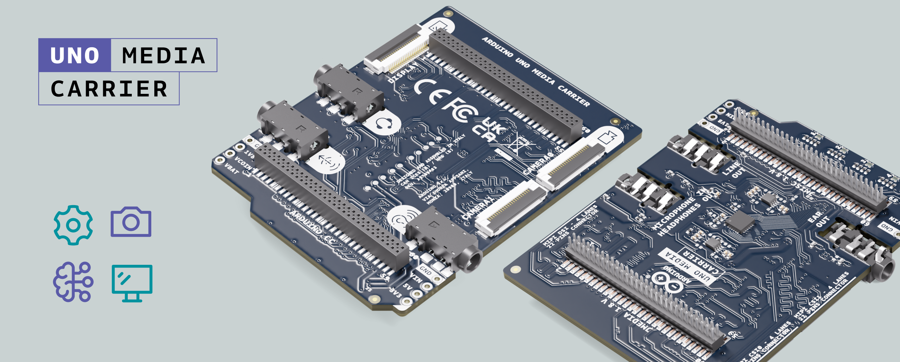
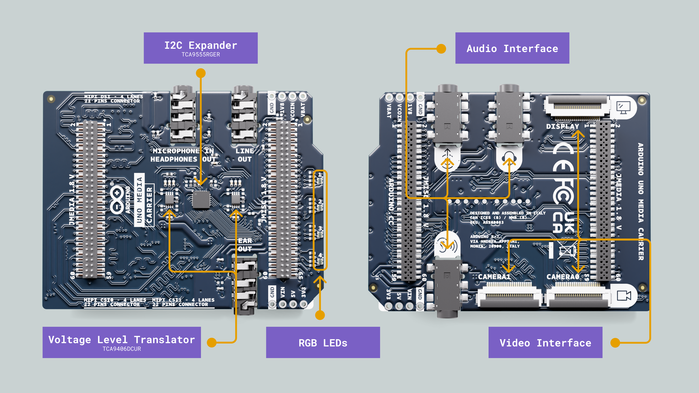
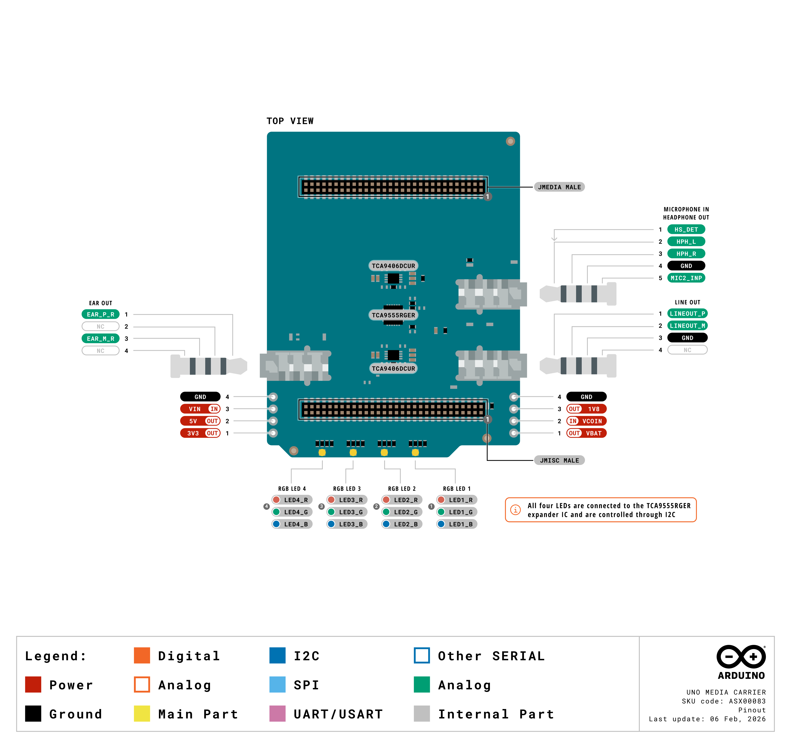
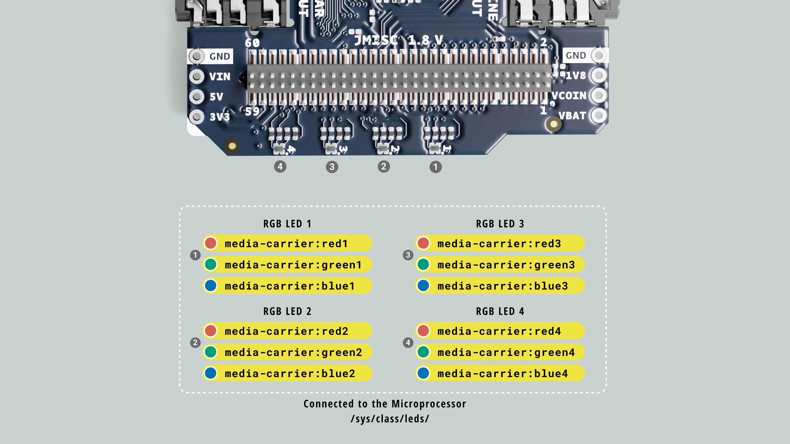
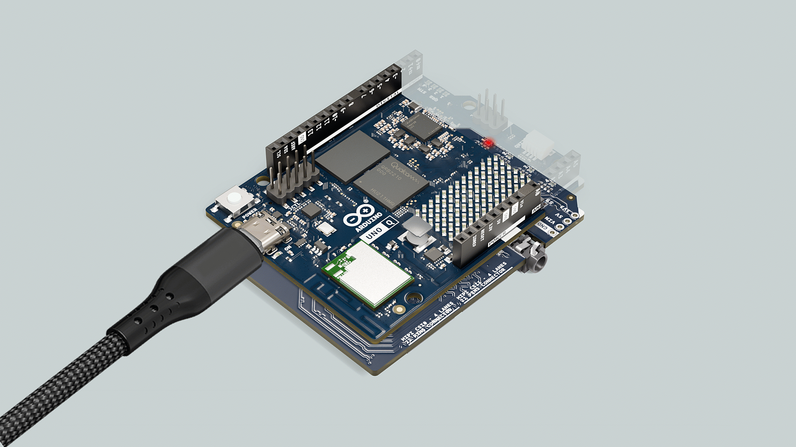

## Overview

This user manual will guide you through the advanced multimedia capabilities of the **Arduino UNO Media Carrier**. Designed to seamlessly mate with the Arduino UNO Q through its High-Speed connectors, this carrier board expands your project into the world of computer vision, graphical interfaces, and high-fidelity audio.



## Hardware and Software Requirements
### Hardware Requirements

- (1x) [UNO Q 2GB](https://store.arduino.cc/products/uno-q) or [UNO Q 4GB](https://store.arduino.cc/products/uno-q-4gb)
- (1x) [UNO Media Carrier](https://store.arduino.cc/products/uno-media-carrier)
- Power supply capable of providing at least 5V/3A.
- [USB-C® cable](https://store.arduino.cc/products/usb-cable2in1-type-c) (1x)

### Software Requirements

- [Arduino App Lab 0.6.0+](https://www.arduino.cc/en/software/#app-lab-section)

***You can still use the __Arduino IDE 2+__ to program only the microcontroller (MCU) side of your UNO Q.***

## Product Overview

The UNO Media Carrier extends the multimedia capabilities of compatible boards, enabling advanced vision, display, and audio applications with plug-and-play simplicity. It connects via the JMEDIA and JMISC high-speed connectors, providing access to dual MIPI-CSI camera interfaces, a MIPI-DSI display interface, and three 3.5 mm audio jacks, all in the UNO form factor.

Key features include:
- **1x MIPI DSI Interface:** For connecting high-resolution LCD/OLED displays.
- **2x MIPI CSI Interfaces:** For connecting dual camera modules (e.g., IMX708, IMX219).
- **3x Audio Jacks:** Dedicated ports for Line Out, Ear Out, and a CTIA-standard Headset (Mic + Headphones).
- **4x RGB LEDs:** Controlled via an onboard I2C expander.

### Board Architecture Overview

The Media Carrier acts as an advanced expansion board, interfacing directly with the UNO Q via high-density connectors to break out and expand the board's multimedia capabilities.



Here is an overview of the board’s main components, as shown in the image above:

- **I2C GPIO Expander:** A Texas Instruments TCA9555 provides 16 additional general-purpose I/O pins via the I2C bus. This chip acts as the control hub for the carrier's four onboard RGB LEDs and manages the power enable signals for connected multimedia peripherals.

- **Voltage-Level Translators:** Dual Texas Instruments TCA9406 chips facilitate secure bidirectional voltage level translation. These ensure stable I2C and SMBus communication between the core 1.8V logic of the UNO Q and the 3.3V or 5V domains of the external carrier peripherals.

- **Status Indicators:** Four onboard RGB LEDs provide customizable visual feedback. Thanks to the I2C expander integration, these are addressable directly through the standard Linux LED subsystem.

- **Multimedia Interfaces:** The carrier routes high-speed signals from the MPU to dedicated physical ports, supporting up to two MIPI CSI cameras, a MIPI DSI display interface, and dedicated audio input/output jacks.

### Pinout



The full pinout is available and downloadable as PDF from the link below:

- [UNO Q full pinout](https://docs.arduino.cc/resources/pinouts/ASX00083-full-pinout.pdf)

### Datasheet

The complete datasheet is available and downloadable as PDF from the link below:

- [UNO Media Carrier datasheet](https://docs.arduino.cc/resources/datasheets/ASX00083-datasheet.pdf)

### Schematics

The complete schematics are available and downloadable as PDF from the link below:

- [UNO Media Carrier schematics](https://docs.arduino.cc/resources/schematics/ASX00083-schematics.pdf)

### STEP Files

The complete STEP files are available and downloadable from the link below:

- [UNO Media Carrier STEP files](../../downloads/ASX00083-step.zip)

## Hardware Features & Interfaces

### RGB LEDs

The Arduino UNO Q Media Carrier features four onboard RGB LEDs designed to provide customizable visual feedback for your applications. To optimize the board's native pinout, these LEDs are not driven directly by the microprocessor's GPIOs. Instead, they are routed through a Texas Instruments TCA9555 I2C GPIO expander. Thanks to the integrated drivers, this I2C expander is mapped directly into the standard Linux LED subsystem, making control seamless.



#### Enabling the Media Carrier Overlay

To use the LEDs, the system must load the hardware map for the Media Carrier. This is done by applying the official Device Tree Overlay (`.dtbo`). 

Run the following commands to merge the Media Carrier and the standard Video/Sound overlays into the base UNO Q device tree:

```bash
cd /boot/efi/dtb/qcom/

sudo fdtoverlay -i qrb2210-arduino-imola-base.dtb \
                -o qrb2210-arduino-imola.dtb \
                qrb2210-arduino-imola-carrier-media.dtbo \
                qrb2210-arduino-imola-video_sound-usbc.dtbo

# Synchronize filesystem and reboot to apply the new hardware map
sync && sudo reboot
```

#### Verifying LED Subsystem

Once the board has rebooted, you can verify that the I2C expander has been successfully registered and the LEDs are available to the OS by listing the LED class devices:

```bash
ls /sys/class/leds/ | grep carrier
```

You should see an output listing all 12 color channels across the 4 LEDs, formatted as `media-carrier:{color}{number}` (e.g., `media-carrier:red1`, `media-carrier:green3`, etc.).

#### LED Control Example

By using the terminal connection to your UNO Q (via SSH or ADB), create a python file for the LEDs blink example script:

```bash
nano blink_carrier_leds.py
```
Then paste the following script inside:

```python
import time

# Configuration
LEDS_COUNT = 4
COLORS = ["red", "green", "blue"]
DELAY = 0.15  # Delay in seconds

def set_led_brightness(led_num, color, value):
    """Writes 1 or 0 to the specific LED's brightness file."""
    path = f"/sys/class/leds/media-carrier:{color}{led_num}/brightness"
    try:
        with open(path, "w") as f:
            f.write(str(value))
    except FileNotFoundError:
        pass # Ignore if a specific color channel is missing
    except PermissionError:
        print(f"Error: Root privileges required to write to {path}")

def main():
    print("Starting RGB sequential blink on Media Carrier...")
    print("Press Ctrl+C to stop.")
    
    try:
        # Ensure all LEDs start in the OFF state
        for i in range(1, LEDS_COUNT + 1):
            for color in COLORS:
                set_led_brightness(i, color, 0)

        while True:
            for i in range(1, LEDS_COUNT + 1):
                for color in COLORS:
                    # Turn ON
                    set_led_brightness(i, color, 1)
                    time.sleep(DELAY)
                    # Turn OFF
                    set_led_brightness(i, color, 0)

    except KeyboardInterrupt:
        print("\nTest finished. Turning off LEDs...")
        for i in range(1, LEDS_COUNT + 1):
            for color in COLORS:
                set_led_brightness(i, color, 0)

if __name__ == "__main__":
    main()
```

Save the file with `Ctrl+O` and exit editing with `Ctrl+X`. Now you can run the script with:

```bash
python3 blink_carrier_leds.py
```

You should see your Media Carrier LEDs blinking as follows:



### MIPI Camera

The UNO Media Carrier features two MIPI CSI connectors for ...

### MIPI Display

### Audio

#### Audio Playback

#### Audio Recording

## Support

If you encounter any issues or have questions while working with the Arduino UNO Q, we provide various support resources to help you find answers and solutions.

### Help Center

Explore our [Help Center](https://support.arduino.cc/hc/en-us), which offers a comprehensive collection of articles and guides for the UNO Q. The Arduino Help Center is designed to provide in-depth technical assistance and help you make the most of your device.

- [UNO Q Help Center page](https://support.arduino.cc/hc/en-us)

### Forum

Join our community forum to connect with other UNO Q users, share your experiences, and ask questions. The forum is an excellent place to learn from others, discuss issues, and discover new ideas and projects related to the UNO Q.

- [UNO Q category in the Arduino Forum](https://forum.arduino.cc/c/official-hardware/uno-family/uno-q/222)

### Contact Us

Please get in touch with our support team if you need personalized assistance or have questions not covered by the help and support resources described before. We are happy to help you with any issues or inquiries about the UNO Q.

- [Contact us page](https://www.arduino.cc/en/contact-us/)
