## Overview

This user manual will guide you through the advanced multimedia capabilities of the **Arduino UNO Media Carrier**. Designed to seamlessly mate with the Arduino UNO Q through its High-Speed connectors, this carrier board expands your project into the world of computer vision, graphical interfaces, and high-fidelity audio.


## Hardware and Software Requirements
### Hardware Requirements

- (1x) [UNO Q 2GB](https://store.arduino.cc/products/uno-q) or [UNO Q 4GB](https://store.arduino.cc/products/uno-q-4gb)
- (1x) [UNO Media Carrier](https://store.arduino.cc/products/uno-media-carrier)
- Power supply capable of providing at least 5V/3A.
- [USB-C® cable](https://store.arduino.cc/products/usb-cable2in1-type-c) (1x)

### Software Requirements

- [Arduino App Lab 0.8.0+](https://www.arduino.cc/en/software/#app-lab-section)

***You can still use the __Arduino IDE 2+__ to program only the microcontroller (MCU) side of your UNO Q.***

## Product Overview

The UNO Media Carrier extends the multimedia capabilities of compatible boards, enabling advanced vision, display, and audio applications with plug-and-play simplicity. It connects via the JMEDIA and JMISC high-speed connectors, providing access to dual MIPI-CSI camera interfaces, a MIPI-DSI display interface, and three 3.5 mm audio jacks, all in the UNO form factor.

Key features include:
- **1x MIPI DSI Interface:** For connecting high-resolution LCD/OLED displays.
- **2x MIPI CSI Interfaces:** For connecting dual camera modules (e.g., IMX708, IMX219).
- **3x Audio Jacks:** Dedicated ports for Line Out, Ear Out, and a CTIA-standard Headset (Mic + Headphones).
- **4x RGB LEDs:** Controlled via an onboard I2C expander.

### Board Architecture Overview

The Media Carrier acts as an advanced expansion board, interfacing directly with the UNO Q via high-density connectors to break out and expand the board's multimedia capabilities.


Here is an overview of the board’s main components, as shown in the image above:

- **I2C GPIO Expander:** A Texas Instruments TCA9555 provides 16 additional general-purpose I/O pins via the I2C bus. This chip acts as the control hub for the carrier's four onboard RGB LEDs and manages the power enable signals for connected multimedia peripherals.

- **Voltage-Level Translators:** Dual Texas Instruments TCA9406 chips facilitate secure bidirectional voltage level translation. These ensure stable I2C and SMBus communication between the core 1.8V logic of the UNO Q and the 3.3V or 5V domains of the external carrier peripherals.

- **Status Indicators:** Four onboard RGB LEDs provide customizable visual feedback. Thanks to the I2C expander integration, these are addressable directly through the standard Linux LED subsystem.

- **Multimedia Interfaces:** The carrier routes high-speed signals from the MPU to dedicated physical ports, supporting up to two MIPI CSI cameras, a MIPI DSI display interface, and dedicated audio input/output jacks.

### Pinout


The full pinout is available and downloadable as PDF from the link below:

- [UNO Q full pinout](https://docs.arduino.cc/resources/pinouts/ASX00083-full-pinout.pdf)

### Datasheet

The complete datasheet is available and downloadable as PDF from the link below:

- [UNO Media Carrier datasheet](https://docs.arduino.cc/resources/datasheets/ASX00083-datasheet.pdf)

### Schematics

The complete schematics are available and downloadable as PDF from the link below:

- [UNO Media Carrier schematics](https://docs.arduino.cc/resources/schematics/ASX00083-schematics.pdf)

### STEP Files

The complete STEP files are available and downloadable from the link below:

- [UNO Media Carrier STEP files](../../downloads/ASX00083-step.zip)

## Hardware Features & Interfaces

The UNO Media Carrier is fully configurable through the Arduino App Lab settings. 

Navigate to **Settings** and under **Carriers** section you will see the option to **enable** it by toggling the **Enable external carriers** switch:

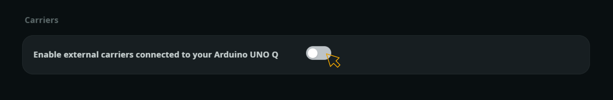

You will be advised to connect the Media Carrier with the board **powered off** if you have yet to:


<Alert type="warning">If the Media Carrier is not connected, unplug the UNO Q, connect the carrier and plug it back.</Alert>

Click on **Ok, Got it**, and you will see the different carrier configurations.

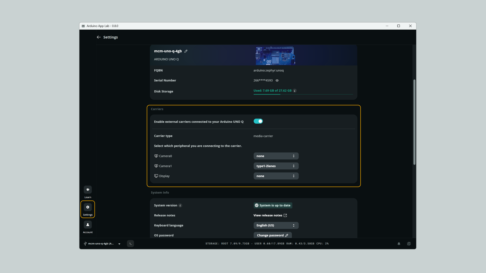

Then, click on **Apply and reboot** for applying the new configurations.

### Through the CLI (Optional Alternative)

To configure the UNO Media Carrier, we also developed a CLI that is included on the Arduino UNO Q. See the supported commands below:

<Alert type="success">Use your UNO Q terminal (through SSH or ADB).</Alert>

```bash
# List available carriers and devices
sudo arduino-linux-config carrier list
```
The command above will print the available carriers and supported devices as follows:

```bash
CARRIER          DEVICE     OPTIONS
-------          ------     -------
media-carrier    camera0    none, type1-2lanes, type1-4lanes
                 camera1    none, type1-2lanes, type1-4lanes
                 display    none, 5-dsi-touch-a, 8-dsi-touch-a, 10-dsi-touch-a
```

To enable the Media Carrier and configure a specific connector to manage above listed devices, use:

```bash
# Configure a carrier with specific devices
sudo arduino-linux-config carrier enable media-carrier camera0=type1-2lanes display=8-dsi-touch-a
```

<Alert type="info">The command above configures the MIPI CSI0 connector to control an IMX219 camera and an 8" DSI touch display.</Alert>

To check the current or pending configuration to be applied, run:

```bash
# Show current and pending configuration
sudo arduino-linux-config carrier show media-carrier
```

<Alert type="note">Any carrier configuration change will be applied after a board reboot.</Alert>

To disable the UNO Media Carrier, use:

```bash
# Reset a carrier to factory defaults
sudo arduino-linux-config carrier disable media-carrier
```

We are going to use the commands above on dedicated sections below to show how to use the different supported features.

### RGB LEDs

The Arduino UNO Q Media Carrier features four onboard RGB LEDs designed to provide customizable visual feedback for your applications. To optimize the board's native pinout, these LEDs are not driven directly by the microprocessor's GPIOs. Instead, they are routed through a Texas Instruments TCA9555 I2C GPIO expander. Thanks to the integrated drivers, this I2C expander is mapped directly into the standard Linux LED subsystem, making control seamless.


#### The LED Subsystem

Once the board has rebooted, you can verify that the I2C expander has been successfully registered and the LEDs are available to the OS by listing the LED class devices:

```bash
ls /sys/class/leds/ | grep carrier
```

You should see an output listing all 12 color channels across the 4 LEDs, formatted as `media-carrier:{color}{number}` (e.g., `media-carrier:red1`, `media-carrier:green3`, etc.).

#### LED Control Example

**Terminal:**

To turn ON the red channel of the first LED, run the following command:

```bash
sudo sh -c "echo 1 > /sys/class/leds/media-carrier:red1/brightness"
```

To turn it back OFF, simply change the value to `0`:

```bash
sudo sh -c "echo 0 > /sys/class/leds/media-carrier:red1/brightness"
```

**Python Script:**

By using the terminal connection to your UNO Q (via SSH or ADB), create a python file for the LEDs blink example script:

```bash
nano blink_carrier_leds.py
```
Then paste the following script inside:

```python
import time

# Configuration
LEDS_COUNT = 4
COLORS = ["red", "green", "blue"]
DELAY = 0.15  # Delay in seconds

def set_led_brightness(led_num, color, value):
    """Writes 1 or 0 to the specific LED's brightness file."""
    path = f"/sys/class/leds/media-carrier:{color}{led_num}/brightness"
    try:
        with open(path, "w") as f:
            f.write(str(value))
    except FileNotFoundError:
        pass # Ignore if a specific color channel is missing
    except PermissionError:
        print(f"Error: Root privileges required to write to {path}")

def main():
    print("Starting RGB sequential blink on Media Carrier...")
    print("Press Ctrl+C to stop.")
    
    try:
        # Ensure all LEDs start in the OFF state
        for i in range(1, LEDS_COUNT + 1):
            for color in COLORS:
                set_led_brightness(i, color, 0)

        while True:
            for i in range(1, LEDS_COUNT + 1):
                for color in COLORS:
                    # Turn ON
                    set_led_brightness(i, color, 1)
                    time.sleep(DELAY)
                    # Turn OFF
                    set_led_brightness(i, color, 0)

    except KeyboardInterrupt:
        print("\nTest finished. Turning off LEDs...")
        for i in range(1, LEDS_COUNT + 1):
            for color in COLORS:
                set_led_brightness(i, color, 0)

if __name__ == "__main__":
    main()
```

Save the file with `Ctrl+O` and exit editing with `Ctrl+X`. Now you can run the script with:

```bash
python3 blink_carrier_leds.py
```

You should see your Media Carrier LEDs blinking as follows:


### MIPI Camera

The UNO Media Carrier features two 22-pin MIPI-CSI connectors compatible with standard Raspberry Pi cameras, enabling dual-camera computer vision applications such as stereo depth mapping, multi-angle capture, and object tracking.

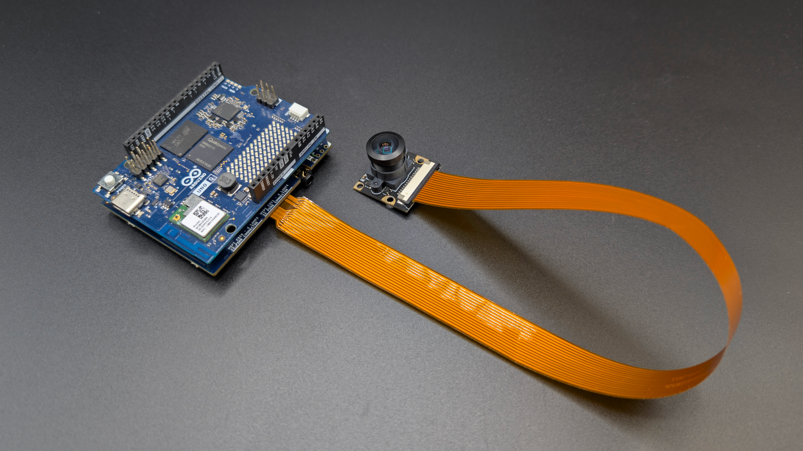

To use a MIPI camera, connect it to "CAMERA0" or "CAMERA1" connectors with the UNO Q **unpowered**. 

<Alert type="note">Only __IMX219__ cameras are supported right now, we will be adding support for other modules in the future.</Alert>

Plug your board and inside Arduino App Lab, navigate to **Settings**, enable the carrier and select your camera type on its respective connector:

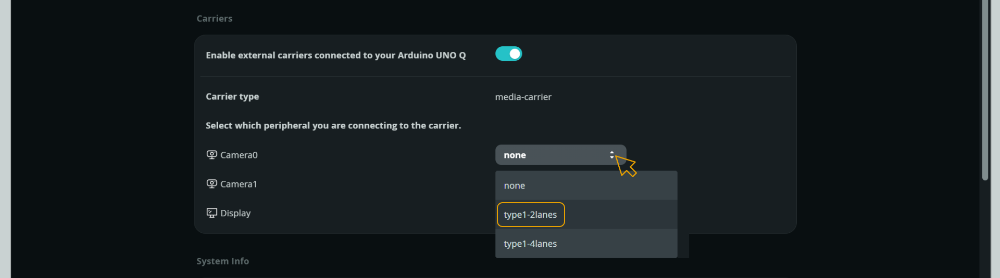

<Alert type="note">Click on __Apply and Reboot__ after changing any configuration.</Alert>

Or run the following command from the terminal:

```bash
sudo arduino-linux-config carrier enable media-carrier camera1=type1-2lanes
```

<Alert type="note">Remember to __reboot__ your Arduino UNO Q after any configuration change.</Alert>

Now, with your MIPI camera enabled, you can try the different Arduino App Lab examples that uses a camera input and they will work out of the box:

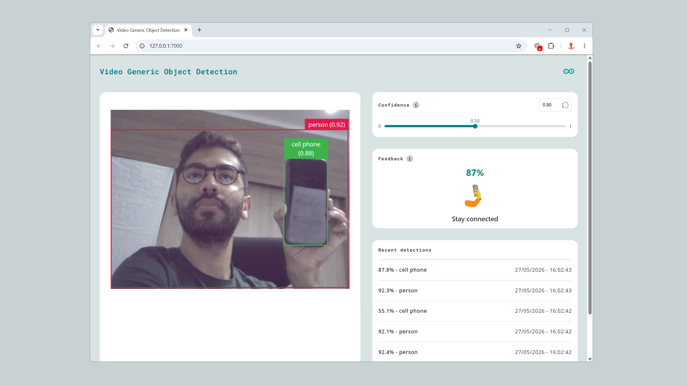

#### Capturing Images
Once your board has rebooted, you can start capturing images. There are several ways to interact with the camera, depending on whether you prefer the command line or a graphical interface.

#### Using the Command Line (CLI)

To capture images directly from the terminal, we use **GStreamer**. Install it with:

```bash
sudo apt update
sudo apt install gstreamer1.0-tools gstreamer1.0-plugins-base gstreamer1.0-plugins-good gstreamer1.0-libcamera
```

To take a snapshot with the first detected camera and specific resolution (1280x720), use:

```bash
sudo gst-launch-1.0 libcamerasrc ! video/x-raw,width=1280,height=720 ! videoconvert ! jpegenc snapshot=true ! filesink location=test_photo.jpg
```

If you want to capture from a specific camera, add the `camera-name` parameter as follows:

```bash
camera-name="/base/soc@0/cci@5c1b000/i2c-bus@0/sensor@10" # for camera0
camera-name="/base/soc@0/cci@5c1b000/i2c-bus@1/sensor@10" # for camera1
```

For example:

```bash
sudo gst-launch-1.0 libcamerasrc camera-name="/base/soc@0/cci@5c1b000/i2c-bus@1/sensor@10" ! video/x-raw,width=1280,height=720 ! videoconvert ! jpegenc snapshot=true ! filesink location=test_photo.jpg
```

<Alert type="warning">Because MIPI sensors need a brief moment to calibrate their auto-exposure and white balance when turned on, capturing a single instant frame often results in a dark image.</Alert>

To get better photos, run the following command. It will briefly activate the camera and capture 2 frames, giving the sensor time to adjust on the second shot:

```bash
sudo timeout 2 gst-launch-1.0 libcamerasrc ! video/x-raw,width=1280,height=720 ! videorate ! video/x-raw,framerate=1/1 ! videoconvert ! jpegenc ! multifilesink location=photo_%d.jpg
```

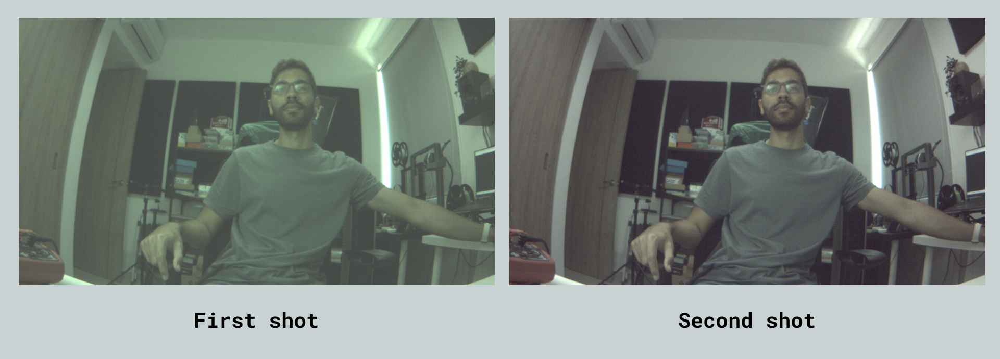

**Even Better Photos**

By using lower-level settings and bypassing the default hardware ISP, you can get much better photos:

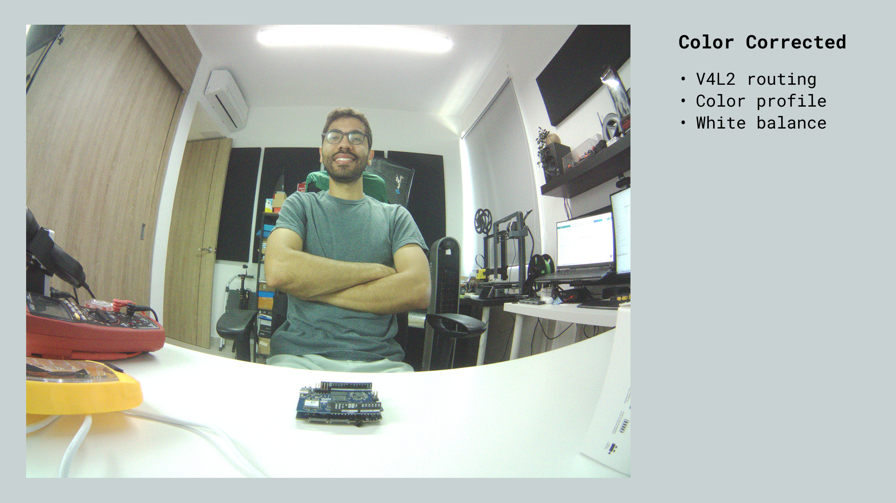

Instead of relying on standard high-level video capture methods—which often struggle with memory allocation for high-resolution 10-bit RAW streams and apply generic, uncalibrated color profiles—this pipeline extracts the RAW DMA frames directly from the kernel using `v4l2-ctl`. 

This approach allows us to build a custom Software Image Signal Processor (ISP) pipeline in Python. By manually demosaicing the RAW Bayer data and injecting the official JSON color matrices (CCM) and Auto White Balance (AWB) curves tailored for the IMX219 sensor, we regain absolute control over the color science. This method also allows us to:

- Directly manipulate the physical analog gain and exposure registers of the sensor.
- Safely handle the massive 8-Megapixel (3280x2464) data payload without memory bottlenecking.

The result is a sharp, color-accurate photograph that perfectly matches the physical lighting of the environment.

<Alert type="success">Check this [dedicated repository](https://github.com/mcmchris/uno-q-mipi-camera-imx219) for achieving better photos and find the best color settings.</Alert>


#### Using a Graphical Interface (GUI)

If you are running a desktop environment on your UNO Q, the system fully supports **Cheese**, the standard GNOME camera application.

You can install it using the package manager:

```bash
sudo apt update
sudo apt install cheese -y
```

After installation, you just need to open the app and start capturing photos or video:

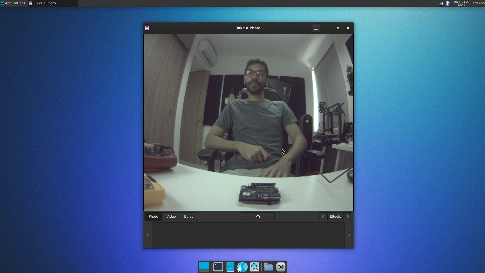

<Alert type="note">With Cheese you will get the same color results as before by using the CLI.</Alert> 

### MIPI Display

The UNO Media Carrier features a 22-pin MIPI-DSI connector compatible with standard Raspberry Pi displays, enabling interactive visual output for applications such as touchscreen user interfaces, real-time data dashboards, and multimedia playback.

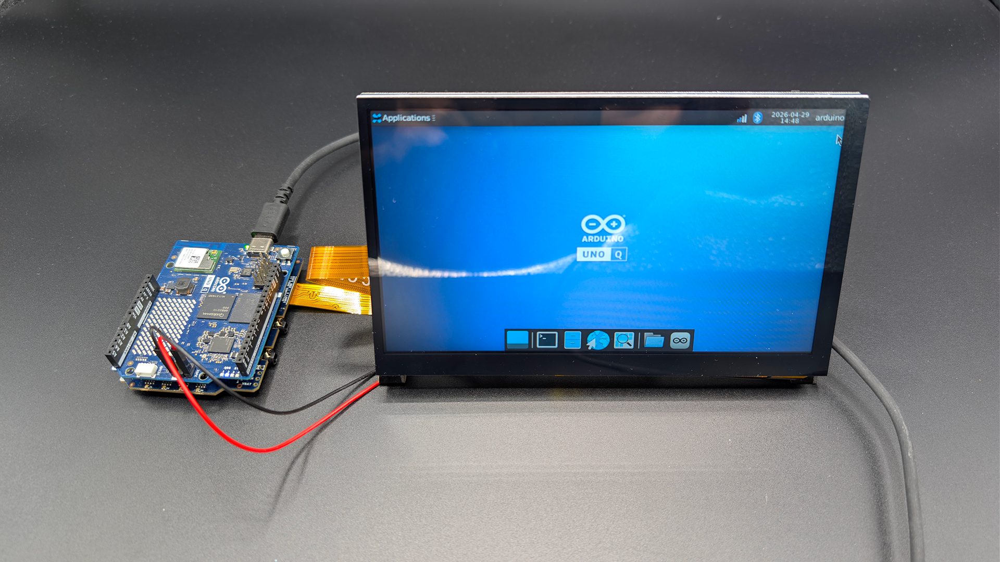

To use a MIPI display, connect it to the "DISPLAY" connector with the UNO Q **unpowered**. 

<Alert type="note">Waveshare 5, 8 and 10 inches displays supported, we will be adding support for other ones in the future.</Alert>

Power your board and inside Arduino App Lab, navigate to **Settings**, enable the carrier and select your display type:

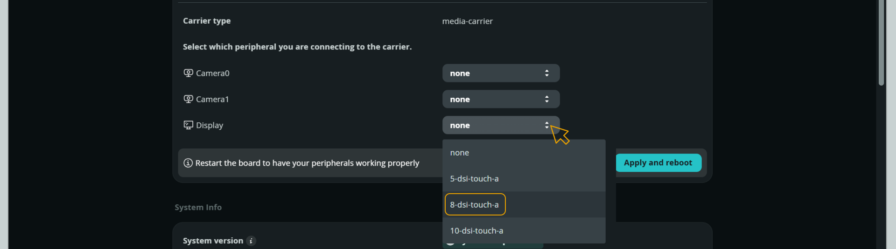

<Alert type="note">Click on __Apply and Reboot__ after changing any configuration.</Alert>

Or run the following command from the terminal:

```bash
sudo arduino-linux-config carrier enable media-carrier display=8-dsi-touch-a
```

<Alert type="note">Remember to __reboot__ your Arduino UNO Q after any configuration change.</Alert>

While your board is rebooting, it will show the boot logs and load the desktop view. Also, you will be able to navigate through it by using the touchscreen.


### Audio

The carrier provides three 3.5 mm audio jacks for flexible audio input and output.

| **Jack**                | **Type**    | **Function**                                   |
|-------------------------|-------------|------------------------------------------------|
| MIC-IN / Headphones Out | 3.5 mm jack | Combined microphone input and headphone output |
| Line Out                | 3.5 mm jack | Line-level audio output                        |
| Earphones Out           | 3.5 mm jack | Earphone output                                |

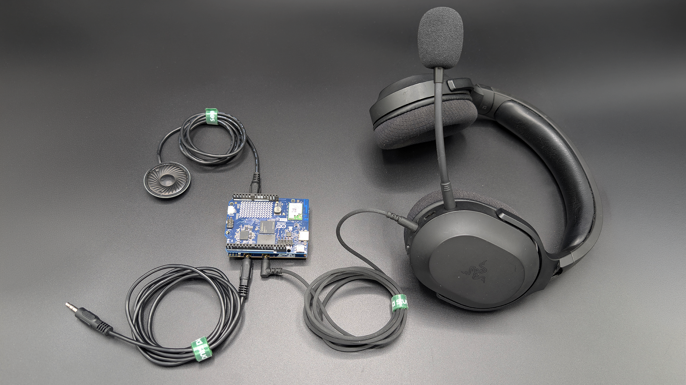

Audio playback and capture are handled by the ALSA (Advanced Linux Sound Architecture) framework available in the UNO Q's Debian OS. The `alsa-utils` package provides the `arecord` and `aplay` command-line tools.

Install it if not already present by opening a terminal on the board via ADB, SSH, or SBC mode:

```bash
sudo apt install alsa-utils
```

Before running any audio command, list the available sound cards and devices on the system to confirm the correct device identifier:

```bash
# List available capture (input) devices
arecord -l
```

```bash
# List available playback (output) devices
aplay -l
```

On the UNO Q, both commands return the same output, as all interfaces share a single sound card. The output will look similar to the following:

```bash
**** List of PLAYBACK Hardware Devices ****
card 0: ArduinoImolaHPH [Arduino-Imola-HPH-LOUT], device 0: MultiMedia1 (*) []
  Subdevices: 1/1
  Subdevice #0: subdevice #0
card 0: ArduinoImolaHPH [Arduino-Imola-HPH-LOUT], device 1: MultiMedia2 (*) []
  Subdevices: 1/1
  Subdevice #0: subdevice #0
card 0: ArduinoImolaHPH [Arduino-Imola-HPH-LOUT], device 2: MultiMedia3 (*) []
  Subdevices: 1/1
  Subdevice #0: subdevice #0
card 0: ArduinoImolaHPH [Arduino-Imola-HPH-LOUT], device 3: MultiMedia4 (*) []
  Subdevices: 1/1
  Subdevice #0: subdevice #0
```

The board has a single sound card (`card 0`, named `Arduino-Imola-HPH-LOUT`) with four logical devices (0–3), each corresponding to a different multimedia stream (MultiMedia1–4).

The device identifier used in audio commands is built from the card and device numbers `hw:0,0` refers to card 0, device 0. The correct device number for each audio interface is noted in each section below.

ALSA supports two device access modes:

- `hw:` provides direct hardware access and requires the audio parameters (sample rate, format, channels) to exactly match what the hardware expects.
- `plughw:` adds an automatic conversion layer that handles mismatches on the fly.

When using `amixer` routing commands to configure the audio pipeline before recording or playback, `plughw:` must be used in the subsequent `arecord` or `aplay` command. Without it, parameter mismatches between the routing configuration and the command will cause the command to fail.

#### Audio Recording

You can record audio through the **MIC-IN / Headphones Out** connector, it exposes the (MIC2_INP) where referenced to ground a headset microphone can be connected. The microphone input uses *device 2* on the sound card.

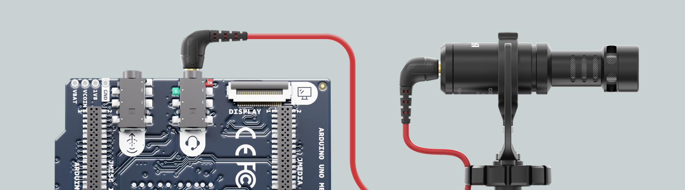

Before recording, configure the audio pipeline using the following `amixer` commands. These set up the routing path from the microphone through the codec and configure the capture gain:

```bash
amixer -c0 cset iface=MIXER,name='MultiMedia3 Mixer TX_CODEC_DMA_TX_3' 1
amixer -c0 cset iface=MIXER,name='TX DEC0 MUX' 'SWR_MIC'
amixer -c0 cset iface=MIXER,name='TX SMIC MUX0' 'SWR_MIC1'
amixer -c0 cset iface=MIXER,name='TX_AIF1_CAP Mixer DEC0' 1
amixer -c0 cset iface=MIXER,name='ADC2 Switch' 1
amixer -c0 cset iface=MIXER,name='ADC2 MUX' 'INP2'
amixer -c0 cset iface=MIXER,name='ADC2_MIXER Switch' 1
amixer -c0 cset iface=MIXER,name='ADC2 Volume' 5
amixer -c0 cset iface=MIXER,name='TX_DEC0 Volume' 100
```

Then capture audio with the following command. `plughw:0,2` is used because the pipeline has been configured with `amixer`. The `-d 5` flag sets the recording duration to 5 seconds and skip it to record until interrupted with **CTRL + C**:

```bash
arecord -D plughw:0,2 -f S32_LE -c 1 -r 48000 -d 5 /home/arduino/recording.wav
```

After recording, close the pipeline to return the audio subsystem to its default state:

```bash
amixer -c0 cset iface=MIXER,name='ADC2_MIXER Switch' 0
amixer -c0 cset iface=MIXER,name='MultiMedia3 Mixer TX_CODEC_DMA_TX_3' 0
```

#### Audio Playback

**Headphone Output:**

You can play audio through the **MIC-IN / Headphones Out** connector, it provides a stereo output. The headphone output uses *device 0* on the sound card.

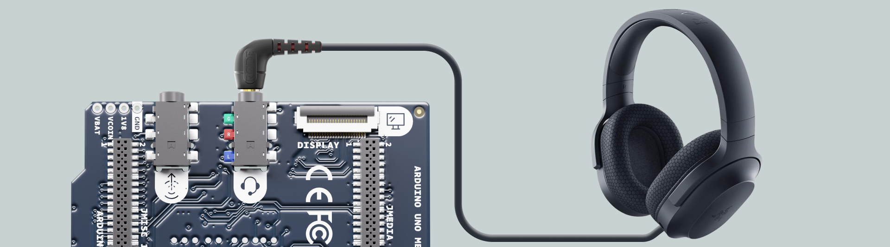

Before playback, configure the audio pipeline using the following `amixer` commands. These set up the routing path from the multimedia stream through the codec to the headphone driver and configure the output volume:

```bash
amixer -c0 cset iface=MIXER,name='RX_CODEC_DMA_RX_0 Audio Mixer MultiMedia1' 1
amixer -c0 cset iface=MIXER,name='RX_MACRO RX0 MUX' 'AIF1_PB'
amixer -c0 cset iface=MIXER,name='RX_MACRO RX1 MUX' 'AIF1_PB'
amixer -c0 cset iface=MIXER,name='RX INT0_1 MIX1 INP0' 'RX0'
amixer -c0 cset iface=MIXER,name='RX INT1_1 MIX1 INP0' 'RX1'
amixer -c0 cset iface=MIXER,name='RX INT0 DEM MUX' 'CLSH_DSM_OUT'
amixer -c0 cset iface=MIXER,name='RX INT1 DEM MUX' 'CLSH_DSM_OUT'
amixer -c0 cset iface=MIXER,name='RX_COMP1 Switch' 1
amixer -c0 cset iface=MIXER,name='RX_COMP2 Switch' 1
amixer -c0 cset iface=MIXER,name='HPHL_RDAC Switch' 1
amixer -c0 cset iface=MIXER,name='HPHR_RDAC Switch' 1
amixer -c0 cset iface=MIXER,name='HPHL_COMP Switch' 1
amixer -c0 cset iface=MIXER,name='HPHR_COMP Switch' 1
amixer -c0 cset iface=MIXER,name='HPHR Switch' 1
amixer -c0 cset iface=MIXER,name='HPHL Switch' 1
amixer -c0 cset iface=MIXER,name='RX_RX0 Digital Volume' 80
amixer -c0 cset iface=MIXER,name='RX_RX1 Digital Volume' 80
```

Then, play back a WAV file using the following command, where `plughw:0,0` is used because the pipeline has been configured with `amixer`:

```bash
aplay -D plughw:0,0 /usr/share/sounds/alsa/Front_Center.wav
```

After playback, close the pipeline to return the audio subsystem to its default state:

```bash
amixer -c0 cset iface=MIXER,name='RX_CODEC_DMA_RX_0 Audio Mixer MultiMedia1' 0
amixer -c0 cset iface=MIXER,name='HPHR Switch' 0
amixer -c0 cset iface=MIXER,name='HPHL Switch' 0
```

***Output levels may sound unbalanced or saturated in some configurations. Adjusting the `RX_RX0 Digital Volume` and `RX_RX1 Digital Volume` values can help tune the output level for your setup.***

**Audio Line Output:**

The line output exposes a differential audio pair (`LINEOUT_P` / `LINEOUT_M`) rather than a traditional stereo Left/Right signal. This interface provides a single Mono channel optimized for noise rejection over long cable runs, making it suitable for connection to professional audio equipment, PA systems, or industrial amplifiers with **Balanced Inputs**.

The line output uses *device 1* on the sound card.

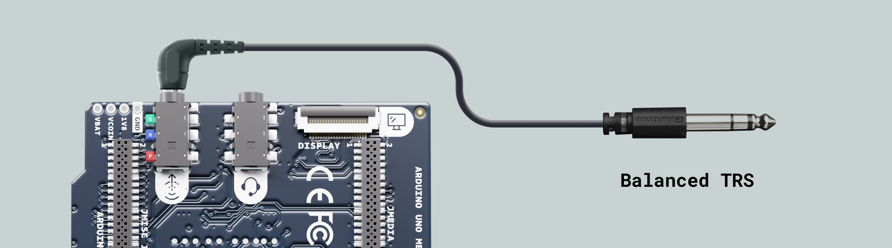

Before playback, configure the audio pipeline using the following `amixer` command:

```bash
amixer -c0 cset iface=MIXER,name='RX_CODEC_DMA_RX_0 Audio Mixer MultiMedia2' 1
amixer -c0 cset iface=MIXER,name='RX_MACRO RX0 MUX' 1
amixer -c0 cset iface=MIXER,name='RX INT0_1 MIX1 INP0' 'RX0'
amixer -c0 cset iface=MIXER,name='RX INT0 DEM MUX' 1
amixer -c0 cset iface=MIXER,name='LO_RDAC Switch' 1
amixer -c0 cset iface=MIXER,name='RX_RX0 Digital Volume' 80
```

Then play back a *WAV* file using the following command:

```bash
aplay -D plughw:0,1 /usr/share/sounds/alsa/Front_Center.wav
```

After playback, close the pipeline to return the audio subsystem to its default state:

```bash
amixer -c0 cset iface=MIXER,name='RX_CODEC_DMA_RX_0 Audio Mixer MultiMedia2' 0
amixer -c0 cset iface=MIXER,name='RX_MACRO RX0 MUX' 'ZERO'
amixer -c0 cset iface=MIXER,name='RX INT0_1 MIX1 INP0' 'ZERO'
amixer -c0 cset iface=MIXER,name='LO_RDAC Switch' 0
```

### Earphone Output

The earphone output provides the right earphone channel as a differential pair. The earphone output uses *device 1* on the sound card.

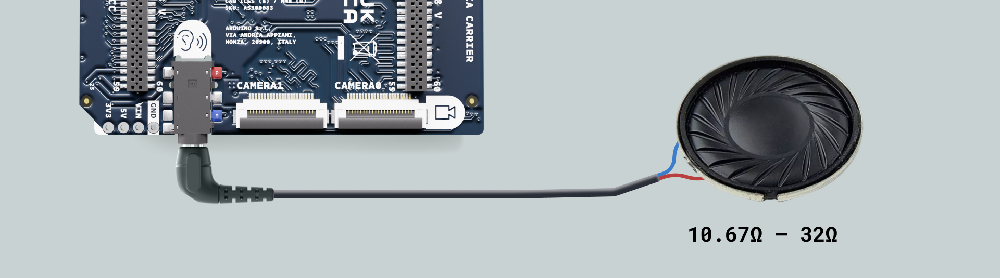

<Alert type="note">On this output you can connect a tiny speaker with an impedance range of <strong>10.67 Ω – 32 Ω</strong></Alert>

Before playback, configure the audio pipeline using the following `amixer` commands:

```bash
amixer -c0 cset iface=MIXER,name='RX_CODEC_DMA_RX_0 Audio Mixer MultiMedia2' 1
amixer -c0 cset iface=MIXER,name='RX_MACRO RX0 MUX' 1
amixer -c0 cset iface=MIXER,name='RX INT0_1 MIX1 INP0' 'RX0'
amixer -c0 cset iface=MIXER,name='RX INT0 DEM MUX' 1
amixer -c0 cset iface=MIXER,name='EAR_RDAC Switch' 1
amixer -c0 cset iface=MIXER,name='HPHL Switch' 1
amixer -c0 cset iface=MIXER,name='RX_RX0 Digital Volume' 80
```

Then, play back a WAV file using the following command. This interface uses `hw:0,1` directly without the `plughw` conversion layer:

```bash
aplay -D hw:0,1 /home/arduino/recording.wav
```

After playback, close the pipeline to return the audio subsystem to its default state:

```bash
amixer -c0 cset iface=MIXER,name='RX_CODEC_DMA_RX_0 Audio Mixer MultiMedia2' 0
amixer -c0 cset iface=MIXER,name='RX_MACRO RX0 MUX' 'ZERO'
amixer -c0 cset iface=MIXER,name='RX INT0_1 MIX1 INP0' 'ZERO'
amixer -c0 cset iface=MIXER,name='RX INT0 DEM MUX' 'NORMAL_DSM_OUT'
amixer -c0 cset iface=MIXER,name='EAR_RDAC Switch' 0
amixer -c0 cset iface=MIXER,name='HPHL Switch' 0
```

## Support

If you encounter any issues or have questions while working with the Arduino UNO Media Carrier, we provide various support resources to help you find answers and solutions.

### Help Center

Explore our [Help Center](https://support.arduino.cc/hc/en-us), which offers a comprehensive collection of articles and guides for the Media Carrier. The Arduino Help Center is designed to provide in-depth technical assistance and help you make the most of your device.

- [Media Carrier Help Center page](https://support.arduino.cc/hc/en-us)

### Forum

Join our community forum to connect with other Media Carrier users, share your experiences, and ask questions. The forum is an excellent place to learn from others, discuss issues, and discover new ideas and projects related to the Media Carrier.

- [Media Carrier category in the Arduino Forum](https://forum.arduino.cc/c/official-hardware/uno-family/uno-media-carrier/229)

### Contact Us

Please get in touch with our support team if you need personalized assistance or have questions not covered by the help and support resources described before. We are happy to help you with any issues or inquiries about the Media Carrier.

- [Contact us page](https://www.arduino.cc/en/contact-us/)
