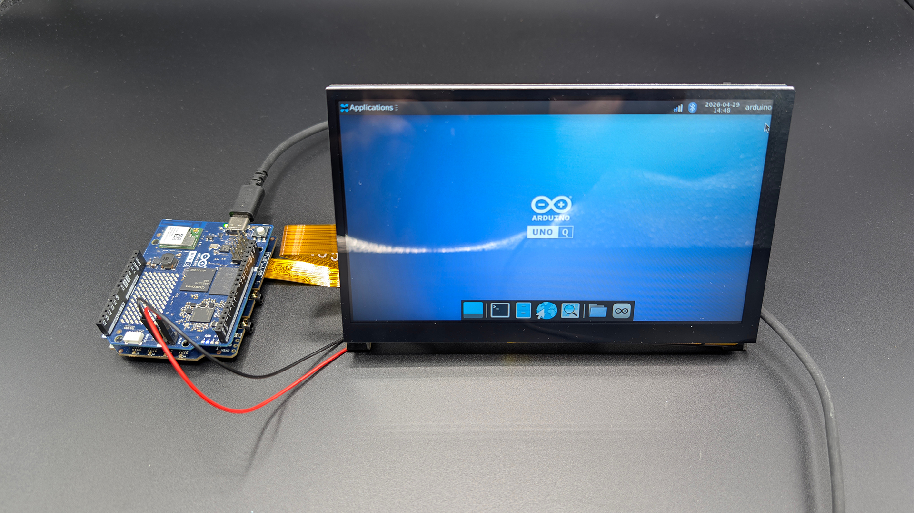
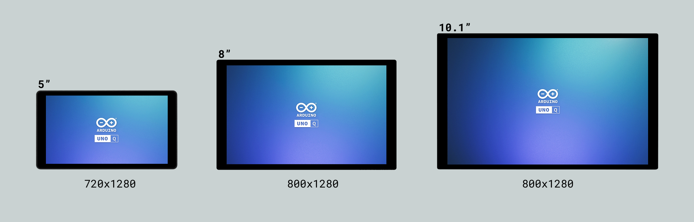
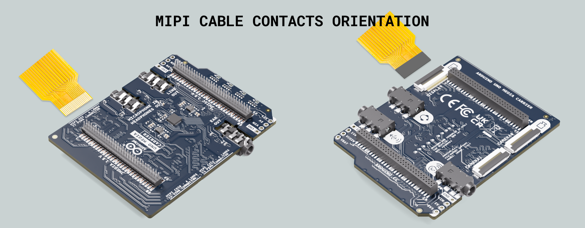
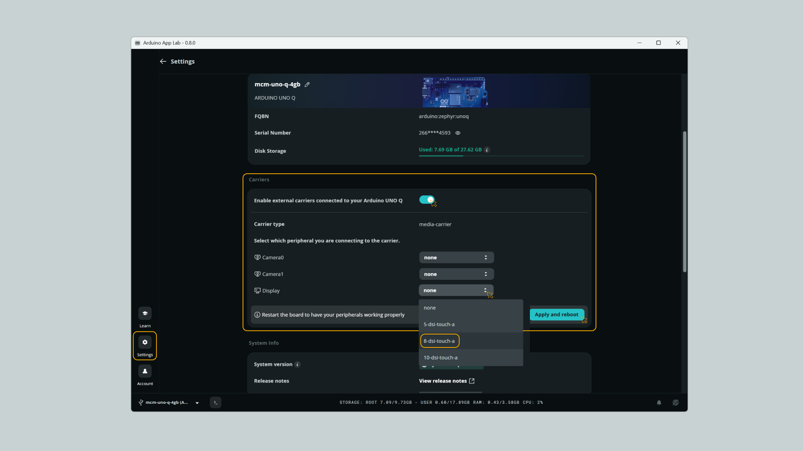
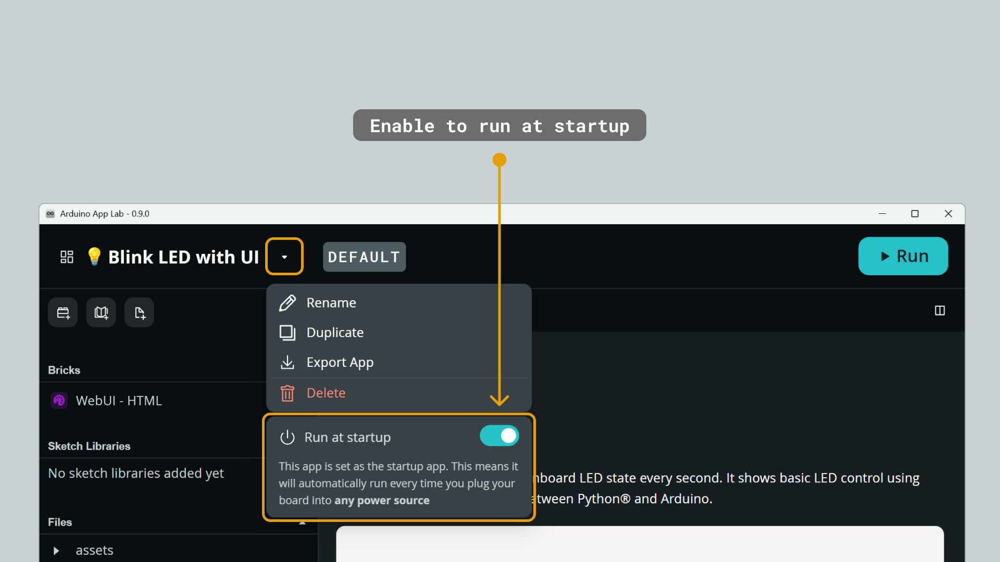
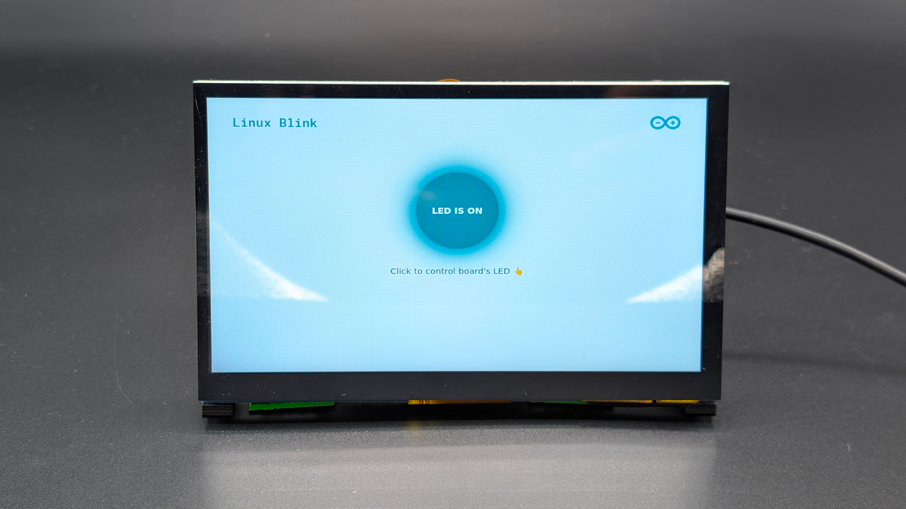

## Overview

This tutorial will guide you through connecting a MIPI DSI display to the **Arduino UNO Media Carrier** and configuring your **Arduino UNO Q** to boot in Kiosk Mode. This lets the system bypass the password prompt at boot and launch directly into the desktop or a specific graphical application, making it ideal for self-contained interactive installations, dashboards, and retail kiosks.



## Hardware and Software Requirements
### Hardware Requirements

- (1x) [UNO Q 2GB](https://store.arduino.cc/products/uno-q) or [UNO Q 4GB](https://store.arduino.cc/products/uno-q-4gb)
- (1x) [UNO Media Carrier](https://store.arduino.cc/products/uno-media-carrier)
- (1x) Compatible MIPI DSI Touch Display
- Power supply capable of providing at least 5V/3A.
- [USB-C® cable](https://store.arduino.cc/products/usb-cable2in1-type-c) (1x)

#### Compatible MIPI DSI Displays

The UNO Media Carrier is compatible with some Waveshare displays out of the box; more details below:



- [5 inch DSI Touch Display](https://www.waveshare.com/5-dsi-touch-a.htm)
- [8 inch DSI Touch Display](https://www.waveshare.com/8-dsi-touch-a.htm)
- [10.1 inch DSI Touch Display](https://www.waveshare.com/10.1-dsi-touch-a.htm)

### Software Requirements

- [Arduino App Lab](https://www.arduino.cc/en/software/#app-lab-section)

## Connecting the Hardware

The UNO Media Carrier features a 22-pin MIPI-DSI connector compatible with standard Raspberry Pi displays, enabling interactive visual output.

To use a MIPI display, connect it to the **DISPLAY** connector on the UNO Media Carrier. **Ensure the UNO Q is completely unpowered before making the connection.**



<Alert type="warning">Pay close attention to the ribbon cable orientation. The metal contacts should face the correct direction as indicated by the connector on both the carrier and the display.</Alert>

Mount the Media Carrier on top of your Arduino UNO Q by gently pressing down to securely mate the high-speed JMEDIA and JMISC connectors.

## Enabling the MIPI Display

Once the hardware is connected, power on your board and open the **Arduino App Lab**. 

Navigate to **Settings**, look for the **Carriers** section, and toggle the **Enable external carriers** switch. 



Then select your connected display type from the dropdown menu (e.g., `8-dsi-touch-a`). Currently, Waveshare 5", 8", and 10" DSI displays are natively supported.

<Alert type="note">Click on __Apply and Reboot__ after changing any configuration.</Alert>

### Through the CLI (Optional Alternative)

If you prefer using the terminal (via SSH or ADB), you can configure the display using the built-in `arduino-linux-config` utility.

First, list the available devices to verify your display options:
```bash
sudo arduino-linux-config carrier list
```

Enable the Media Carrier and configure the DSI display (for example, an 8-inch touch display):
```bash
sudo arduino-linux-config carrier enable media-carrier display=8-dsi-touch-a
```

<Alert type="note">Remember to __reboot__ your Arduino UNO Q after applying this configuration.</Alert>

Upon rebooting, the UNO Q will show the boot sequence on your MIPI display and eventually load the Debian desktop environment. 

## Configuring Kiosk Mode

By default, Debian on the UNO Q prompts you for your user password before you can access the desktop. In a kiosk scenario (like a retro gaming console, retail assistant, or dashboard), you want the device to boot straight into the interface without any manual login.

### 1. Enabling Auto-Login

The Arduino UNO Q runs a Debian-based Linux distribution. To bypass the login screen, configure the Display Manager to automatically log in the default `arduino` user.

Open a terminal via SSH, ADB, or directly from the current desktop session, and edit the Display Manager configuration.

**Since the UNO Q uses LightDM (Common for lightweight desktops):**

Open the configuration file:
```bash
sudo nano /etc/lightdm/lightdm.conf
```

Find the `[Seat:*]` section and modify or uncomment the following lines:
```bash
[Seat:*]
autologin-guest=false
autologin-user=arduino
autologin-user-timeout=0
```
Save and exit (`Ctrl+O`, `Enter`, `Ctrl+X`).

### 2. Launching an Application on Boot (Kiosk App)

Once auto-login is active, you may want to start a specific application as soon as the desktop loads. For this, follow the steps below:

1.  Open your custom App (or the copy of an example).
2.  Locate the App name in the top left corner.
3.  Click the arrow (▼) next to the name to open the menu.
4.  Toggle the **Run at startup** switch to the **ON** position.



Once configured, a **DEFAULT** badge will appear next to your App's name, indicating it will run automatically upon boot.

**_Note that built-in examples cannot run on startup; you will need to click the "Copy and Edit App" button to use this feature._**

#### Automatic Full Screen Web Browser

Then, configure the system's desktop environment to **automatically open a full-screen** web browser pointing to your local app's interface. 

Open a terminal (via SSH or ADB) and follow these steps:

1. Create the autostart directory. Ensure the configuration folder exists for your user:

  ```bash
  mkdir -p ~/.config/autostart
  ```
2. Create the Kiosk shortcut file. Create a `.desktop` file that the system will read as soon as it logs in:

  ```bash
  nano ~/.config/autostart/kiosk.desktop
  ```
3. Add the Chromium configuration. Paste the following content into the editor:

  ```bash
  [Desktop Entry]
  Type=Application
  Name=Kiosk Mode
  Exec=chromium --kiosk --no-first-run --disable-infobars http://localhost:7000
  ```

  ***`localhost:7000` is where the UNO Q serves the UI of the Arduino App Lab applications by default.***

  Save and exit (`Ctrl+O`, `Enter`, `Ctrl+X`).

Reboot your board:
```bash
sudo reboot
```



### 3. Preventing the Screen Lock (Password Prompt)

By default, the operating system might turn off the screen to save power after a few minutes of inactivity. While screen blanking helps the display's lifespan, the XFCE desktop environment often locks the session and asks for the user's password on wake, which breaks the Kiosk experience.

To allow the screen to go to sleep but prevent XFCE from locking the session, open a terminal and modify the power manager properties with the following commands:

```bash
# Disable locking when the screen blanks or suspends
xfconf-query -c xfce4-power-manager -p /xfce4-power-manager/lock-screen-suspend-hibernate -n -t bool -s false

# Disable the general session lock screen
xfconf-query -c xfce4-session -p /shutdown/LockScreen -n -t bool -s false
```

**Reboot** your board after applying the commands. The screen can still go black to rest, but touching it will instantly bring you back to your Chromium UI.

```bash
sudo reboot
```

#### Screen Never Sleep (Optional)

If you want the screen to never go black (stay on 24/7), you can disable display power management. Create an autostart file:

```bash
nano ~/.config/autostart/noblank.desktop
```

And paste this inside:

```bash
[Desktop Entry]
Type=Application
Name=Disable Screen Blanking
Exec=xset s off -dpms
```

**Reboot** your board after applying the commands. With these settings applied, your Kiosk will stay on continuously.

```bash
sudo reboot
```

If you want to revert this and allow your screen to sleep:

```bash
rm ~/.config/autostart/noblank.desktop
```

### 4. Hiding the Mouse Cursor (Optional)

For touch-only kiosk applications, a visible mouse pointer might break the immersion. You can hide it using the Display Manager.

Open the configuration file:
```bash
sudo nano /etc/lightdm/lightdm.conf
```

Find the `[Seat:*]` section and add the following line:
```bash
[Seat:*]
xserver-command=X -nocursor # this is the new line
autologin-guest=false
autologin-user=arduino
autologin-user-timeout=0
```
Save and exit (`Ctrl+O`, `Enter`, `Ctrl+X`).

Reboot your board:
```bash
sudo reboot
```

Your UNO Q should now power on, initialize the MIPI DSI display, automatically log in as the `arduino` user, and launch your application in full screen.

## Conclusion

You have successfully transformed your Arduino UNO Q and Media Carrier into a fully functional, standalone kiosk. By connecting a MIPI DSI display, bypassing the login screen, and configuring your Arduino App Lab interface to launch automatically in full-screen mode, you've optimized your device for seamless user interaction. With the screen lock disabled and the cursor perfectly hidden, you are ready to deploy robust dashboards, retail displays, or interactive installations without any manual intervention.

## Support

If you encounter issues or have questions while working with the UNO Media Carrier, we offer support resources to help you find answers and solutions.

### Help Center

Explore our [Help Center](https://support.arduino.cc/hc/en-us), which offers a comprehensive collection of articles and guides.

### Forum

Join our community forum to connect with other users, share your experiences, and ask questions.

- [UNO Media Carrier category in the Arduino Forum](https://forum.arduino.cc/c/official-hardware/uno-family/uno-media-carrier/229)

### Contact Us

Contact our support team if you need personalized assistance.

- [Contact us page](https://www.arduino.cc/en/contact-us/)
