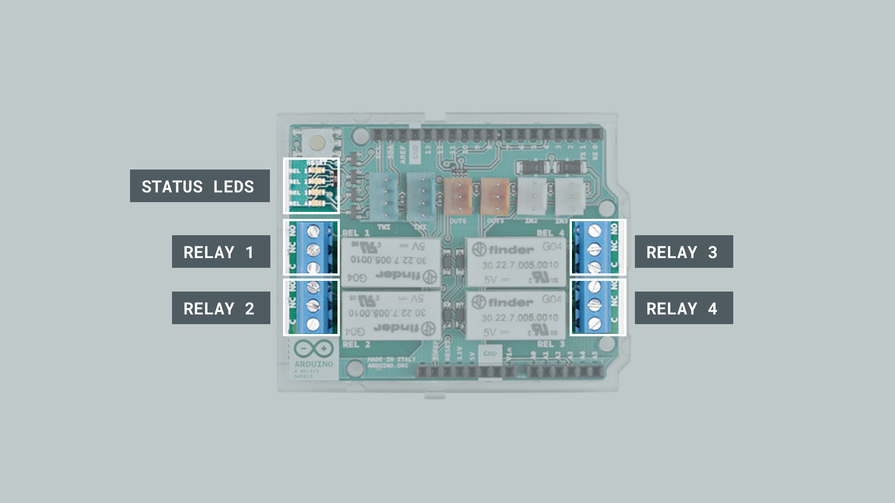
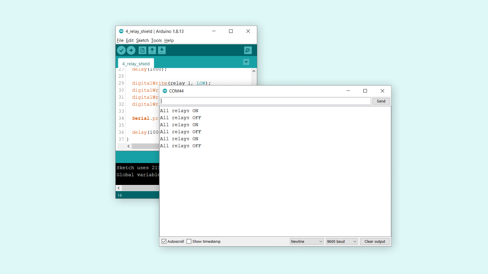
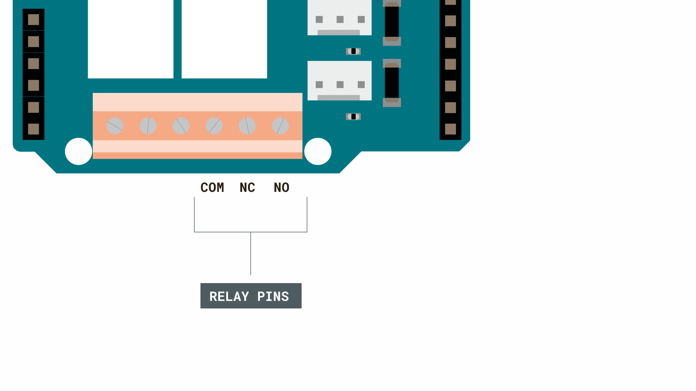

## Introduction 

In this tutorial, we will test out the **four relays** on board the [Arduino 4 Relays Shield](https://store.arduino.cc/arduino-mkr-relay-proto-shield). This shield is a great addon for the Arduino UNO board, as it has four relays capable of handling loads up to 48V. To control the relays, we need to use the following pins:

- **Relay 1** - pin 4.
- **Relay 2** - pin 7.
- **Relay 3** - pin 8.
- **Relay 4** - pin 12.

The sketch we will use is going to be very simple. It will activate all four relays for one second, then de-activating them for one second. The status of the relays can be seen onboard the shield, as it has a status LED for each relay.

>**Note:** Please use extreme caution when using relays and higher power loads. Powering the relays directly from a wall socket can be **extremely dangerous**, and exceeds the maximum voltage the relays can handle by far.

## Goals

The goals of this project are:

- Understand how relays work, and what they can be used for.
- Activating all four relays on the shield.
- De-activating all four relays on the shield.

## Hardware & Software Needed

- Arduino IDE ([online](https://create.arduino.cc/) or [offline](https://www.arduino.cc/en/main/software)).
- Arduino 4 Relays Shield([link to store](https://store.arduino.cc/arduino-4-relays-shield))
- Arduino UNO ([link to store](https://store.arduino.cc/arduino-genuino/arduino-genuino-mkr-family))

## Relays

Relays allow low-power microcontrollers to handle circuits that uses much higher power than what the board can handle directly. They are typically used in industrial applications to control high power circuits, but it is also used in cars, homes and other electric applications.

Relays are composed by an electromagnet that moves a tiny metallic plank, which is called **COM** terminal, between two different positions **NC** terminal and **NO** terminal. We can decide in which position the COM terminal is connected to through activating/deactivating the electromagnet, by connecting a low power signal in the electromagnet control terminals.

<video width="100%" loop autoplay>
<source src="assets/relays.mp4" type="video/mp4" />
</video>

Writing a program to control the relays is very easy: it works very similar to turning ON or OFF an LED. Take a look at the snippet below to understand how it is used:

```
digitalWrite(relay, HIGH);

digitalWrite(relay, LOW);
```

And that's basically how we control the relays. Depending on the configuration, the logic will be inverted. For example, if we are using an NC (normally closed) configuration, we need to write a **LOW** signal to activate the relay. If we are using an NO (normally open) configuration, we need to write a **HIGH** signal to activate the relay.

## The Arduino 4 Relay Shield

Inside the shield, the low power circuit is already made. The only thing we need to connect is a power supply (max 48V), and a high power component (max 48V). These are connected to the **high power pins**. In the image below, you can get a better understanding on the layout of the shield:



### Circuit

Let's begin by mounting our Arduino 4 Relay Shield on top of an Arduino UNO.


### Programming the Board

We will now get to the programming part of this tutorial. 

First, let's take a look at how we will activate our relays. We are actually not using a library, as the operation is very basic.

- `int relay_1 = 4;` - assigns `relay_1` to pin 4. It is important that we assign it to pin 4, as the relay is internally wired to this pin.
- `int relay_2 = 7;` - assigns `relay_2` to pin 7. Same here, the relay is wired to pin 7, so we can't use a pin of our choosing. 
- `int relay_3 = 8;` - assigns `relay_3` to pin 8. Same here, the relay is wired to pin 8, so we can't use a pin of our choosing. 
- `int relay_4 = 12;` - assigns `relay_4` to pin 12. Same here, the relay is wired to pin 12, so we can't use a pin of our choosing. 
- `pinMode(relay_X, OUTPUT)` - configures relay 1 to be an `OUTPUT`.
- `digitalWrite(relay_X, state)` - write either a high or low state to relay 1.

The sketch can be found in the snippet below. Upload the sketch to the board.

```arduino
int relay_1 = 4;
int relay_2 = 7;
int relay_3 = 8;
int relay_4 = 12;

void setup() {
  // put your setup code here, to run once:
  Serial.begin(9600);

  pinMode(relay_1, OUTPUT);
  pinMode(relay_2, OUTPUT);
  pinMode(relay_3, OUTPUT);
  pinMode(relay_4, OUTPUT);

}

void loop() {

  digitalWrite(relay_1, HIGH);
  digitalWrite(relay_2, HIGH);
  digitalWrite(relay_3, HIGH);
  digitalWrite(relay_4, HIGH);

  Serial.println("All relays ON");

  delay(1000);

  digitalWrite(relay_1, LOW);
  digitalWrite(relay_2, LOW);
  digitalWrite(relay_3, LOW);
  digitalWrite(relay_4, LOW);

  Serial.println("All relays OFF");

  delay(1000);
}
```

## Testing It Out

After we have uploaded the code, the program will start running immediately. If everything is working correctly, we will hear a "tick-tack" noise every second. This is the sound of the relays that are mechanically switching on and off. If we take a look at the shield, we will see **four LEDs** blinking every second. These signify the state of the relays. We can also view the states in the Serial Monitor.



Now in this example, we have simply activated the relays, but we still haven't connected anything to them. While we are not going to go in-depth on how to connect high power components, we can take a look at how a circuit looks like for turning ON or OFF a 24V lamp.

Let's begin with the high power pins on the Arduino 4 Relays Shield. There are **twelve in total** for all four relays, where there are three different type of connections: COM, NC and NO. Below is how the high power pins for **Relay 4** looks like.



In this scenario, we are going to use the **NC** configuration, which means that writing a **LOW** signal to the relay will connect the NC pin to COM, which provides power to the component connected. The circuit for this could look like this:


In this circuit, we are using a 24V power supply and a 24V light bulb. Now, if we were to write a program for this, we would activate through using:

```
digitalWrite(relay_4, LOW)
```

and to de-activate it:

```
digitalWrite(relay_4, HIGH)
```

>**Note:** Use extreme caution when creating higher power circuits. Make sure that both the power supply and the component does not exceed 48V. For example, connecting it straight to a wall socket without a power converter would supply 220-240V, which is **5 times as high.**

### Troubleshoot

If the code is not working, there are some common issues we can troubleshoot:

- We have not connect the LEDs properly (this is an optional requirement).
- If the code fails to compile, make sure there's no missing curly brackets {} or semicolons ; anywhere in the code.
- We have connected the shield correctly on top of the board (the pins should match each other).

## Conclusion

In this tutorial, we have gone through some basics of how a relay works, including how the internal mechanism works, but also how to create a circuit with high power components, and how to create a program that activates or de-activates them.

Relays are incredible popular electronic components that are practically used everywhere: cars, planes, heating systems, industrial machines and many many more. 

