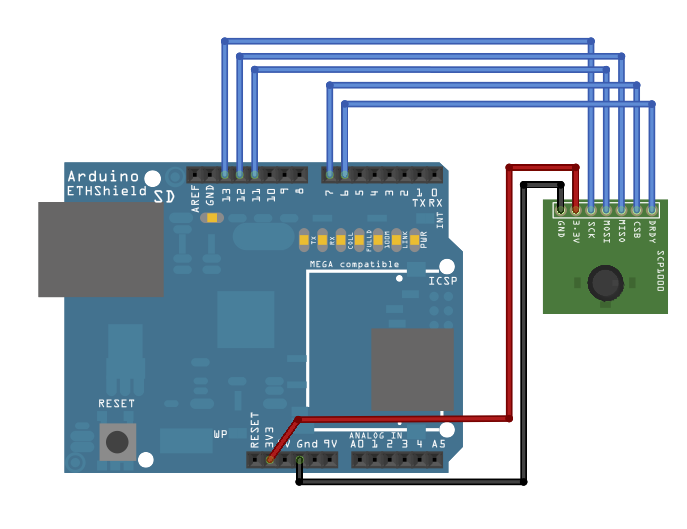
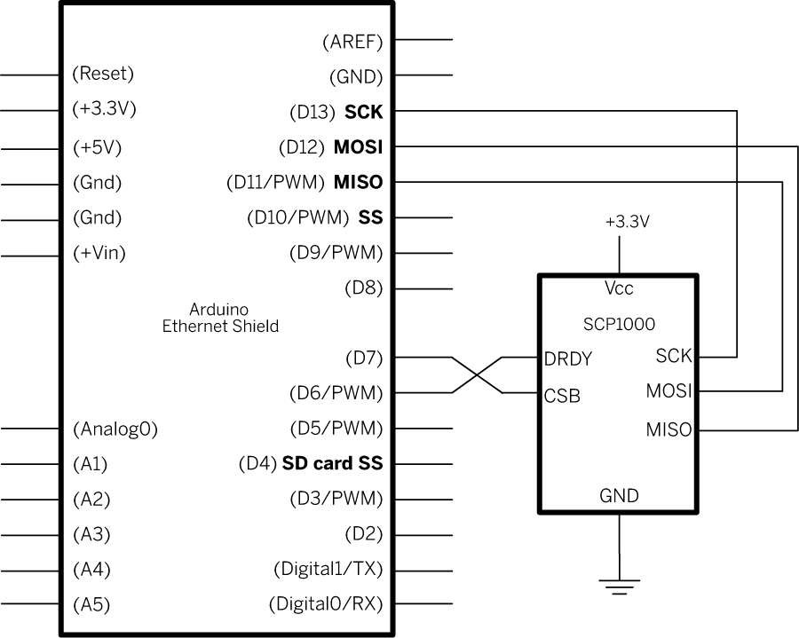

This example shows how to use SPI communications to read data from [a SCP1000 Barometric Pressure sensor](http://www.sparkfun.com/commerce/product_info.php?products_id=8161), and how to then post that data to the web by using your Arduino / Ethernet Shield combo as a simple web server. Using the Ethernet library, your device will be able to answer HTTP requests by responding with just enough HTML for a browser to display the temperature and barometric pressure values outputted by your sensor. After completing your circuit and uploading the example code below, simply navigate to your Ethernet shield's IP address, in a browser, to see this information.

See the [Barometric Pressure Sensor](https://arduino.cc/en/Tutorial/LibraryExamples/BarometricPressureSensor) example for more on how the sensor works.

## Hardware Required

- Arduino Board

- SCP1000 Pressure Sensor Breakout Board

- Arduino Ethernet Shield

## Circuit

Your Barometric Pressure sensor will be attached to pins 6,7, and the SPI pins of your Arduino / Ethernet shield combo, and powered via your device's 3.3 volt output. Connect the DRDY (Data Ready) pin on your sensor to digital pin 6 on your combo, and the CSB pin (Chip Select) to digital pin 7. Your sensor's COPI (Controller Out Periheral In), MISO (Controller In Periheral Out), and SCK (SPI clock input) pins should then be connected to the SPI pins on your Arduino board/shield. The SPI pin numbers differ depending on which Arduino board you're using and are listed in the [SPI reference page](https://www.arduino.cc/en/Reference/SPI). Make sure that the two share a common ground.

After wiring your sensor, your shield should be connected to a network with an Ethernet cable. You will need to change the network settings in the program to correspond to your network.



Image developed using [Fritzing](http://www.fritzing.org). For more circuit examples, see the [Fritzing project page](http://fritzing.org/projects/)

***In the above  image, the Arduino board would be stacked below the Ethernet shield.***

## Schematic



## Code

```arduino

/*

  SCP1000 Barometric Pressure Sensor Display

 Serves the output of a Barometric Pressure Sensor as a web page.

 Uses the SPI library. For details on the sensor, see:

 http://www.sparkfun.com/commerce/product_info.php?products_id=8161

 This sketch adapted from Nathan Seidle's SCP1000 example for PIC:

 http://www.sparkfun.com/datasheets/Sensors/SCP1000-Testing.zip

 TODO: this hardware is long obsolete.  This example program should

 be rewritten to use https://www.sparkfun.com/products/9721

 Circuit:

 SCP1000 sensor attached to pins 6,7, and 11 - 13:

 DRDY: pin 6

 CSB: pin 7

 MOSI: pin 11

 MISO: pin 12

 SCK: pin 13

 created 31 July 2010

 by Tom Igoe

 */

#include <Ethernet.h>
// the sensor communicates using SPI, so include the library:
#include <SPI.h>

// assign a MAC address for the Ethernet controller.
// fill in your address here:
byte mac[] = {

  0xDE, 0xAD, 0xBE, 0xEF, 0xFE, 0xED
};
// assign an IP address for the controller:

IPAddress ip(192, 168, 1, 20);

// Initialize the Ethernet server library
// with the IP address and port you want to use
// (port 80 is default for HTTP):

EthernetServer server(80);

//Sensor's memory register addresses:

const int PRESSURE = 0x1F;      //3 most significant bits of pressure

const int PRESSURE_LSB = 0x20;  //16 least significant bits of pressure

const int TEMPERATURE = 0x21;   //16 bit temperature reading

// pins used for the connection with the sensor
// the others you need are controlled by the SPI library):

const int dataReadyPin = 6;

const int chipSelectPin = 7;

float temperature = 0.0;
long pressure = 0;
long lastReadingTime = 0;

void setup() {

  // You can use Ethernet.init(pin) to configure the CS pin

  //Ethernet.init(10);  // Most Arduino shields

  //Ethernet.init(5);   // MKR ETH shield

  //Ethernet.init(0);   // Teensy 2.0

  //Ethernet.init(20);  // Teensy++ 2.0

  //Ethernet.init(15);  // ESP8266 with Adafruit® Featherwing Ethernet

  //Ethernet.init(33);  // ESP32 with Adafruit® Featherwing Ethernet

  // start the SPI library:

  SPI.begin();

  // start the Ethernet connection

  Ethernet.begin(mac, ip);

  // Open serial communications and wait for port to open:

  Serial.begin(9600);

  while (!Serial) {

    ; // wait for serial port to connect. Needed for native USB port only

  }

  // Check for Ethernet hardware present

  if (Ethernet.hardwareStatus() == EthernetNoHardware) {

    Serial.println("Ethernet shield was not found.  Sorry, can't run without hardware. :(");

    while (true) {

      delay(1); // do nothing, no point running without Ethernet hardware

    }

  }

  if (Ethernet.linkStatus() == LinkOFF) {

    Serial.println("Ethernet cable is not connected.");

  }

  // start listening for clients

  server.begin();

  // initialize the data ready and chip select pins:

  pinMode(dataReadyPin, INPUT);

  pinMode(chipSelectPin, OUTPUT);

  //Configure SCP1000 for low noise configuration:

  writeRegister(0x02, 0x2D);

  writeRegister(0x01, 0x03);

  writeRegister(0x03, 0x02);

  // give the sensor and Ethernet shield time to set up:

  delay(1000);

  //Set the sensor to high resolution mode tp start readings:

  writeRegister(0x03, 0x0A);

}

void loop() {

  // check for a reading no more than once a second.

  if (millis() - lastReadingTime > 1000) {

    // if there's a reading ready, read it:

    // don't do anything until the data ready pin is high:

    if (digitalRead(dataReadyPin) == HIGH) {

      getData();

      // timestamp the last time you got a reading:

      lastReadingTime = millis();

    }

  }

  // listen for incoming Ethernet connections:

  listenForEthernetClients();
}

void getData() {

  Serial.println("Getting reading");

  //Read the temperature data

  int tempData = readRegister(0x21, 2);

  // convert the temperature to celsius and display it:

  temperature = (float)tempData / 20.0;

  //Read the pressure data highest 3 bits:

  byte  pressureDataHigh = readRegister(0x1F, 1);

  pressureDataHigh &= 0b00000111; //you only needs bits 2 to 0

  //Read the pressure data lower 16 bits:

  unsigned int pressureDataLow = readRegister(0x20, 2);

  //combine the two parts into one 19-bit number:

  pressure = ((pressureDataHigh << 16) | pressureDataLow) / 4;

  Serial.print("Temperature: ");

  Serial.print(temperature);

  Serial.println(" degrees C");

  Serial.print("Pressure: " + String(pressure));

  Serial.println(" Pa");
}

void listenForEthernetClients() {

  // listen for incoming clients

  EthernetClient client = server.available();

  if (client) {

    Serial.println("Got a client");

    // an http request ends with a blank line

    bool currentLineIsBlank = true;

    while (client.connected()) {

      if (client.available()) {

        char c = client.read();

        // if you've gotten to the end of the line (received a newline

        // character) and the line is blank, the http request has ended,

        // so you can send a reply

        if (c == '\n' && currentLineIsBlank) {

          // send a standard http response header

          client.println("HTTP/1.1 200 OK");

          client.println("Content-Type: text/html");

          client.println();

          // print the current readings, in HTML format:

          client.print("Temperature: ");

          client.print(temperature);

          client.print(" degrees C");

          client.println("<br />");

          client.print("Pressure: " + String(pressure));

          client.print(" Pa");

          client.println("<br />");

          break;

        }

        if (c == '\n') {

          // you're starting a new line

          currentLineIsBlank = true;

        } else if (c != '\r') {

          // you've gotten a character on the current line

          currentLineIsBlank = false;

        }

      }

    }

    // give the web browser time to receive the data

    delay(1);

    // close the connection:

    client.stop();

  }
}

//Send a write command to SCP1000
void writeRegister(byte registerName, byte registerValue) {

  // SCP1000 expects the register name in the upper 6 bits

  // of the byte:

  registerName <<= 2;

  // command (read or write) goes in the lower two bits:

  registerName |= 0b00000010; //Write command

  // take the chip select low to select the device:

  digitalWrite(chipSelectPin, LOW);

  SPI.transfer(registerName); //Send register location

  SPI.transfer(registerValue); //Send value to record into register

  // take the chip select high to de-select:

  digitalWrite(chipSelectPin, HIGH);
}

//Read register from the SCP1000:
unsigned int readRegister(byte registerName, int numBytes) {

  byte inByte = 0;           // incoming from  the SPI read

  unsigned int result = 0;   // result to return

  // SCP1000 expects the register name in the upper 6 bits

  // of the byte:

  registerName <<=  2;

  // command (read or write) goes in the lower two bits:

  registerName &= 0b11111100; //Read command

  // take the chip select low to select the device:

  digitalWrite(chipSelectPin, LOW);

  // send the device the register you want to read:

  SPI.transfer(registerName);

  // send a value of 0 to read the first byte returned:

  inByte = SPI.transfer(0x00);

  result = inByte;

  // if there's more than one byte returned,

  // shift the first byte then get the second byte:

  if (numBytes > 1) {

    result = inByte << 8;

    inByte = SPI.transfer(0x00);

    result = result | inByte;

  }

  // take the chip select high to de-select:

  digitalWrite(chipSelectPin, HIGH);

  // return the result:

  return (result);
}
```

**Last revision 2018/09/07 by SM**