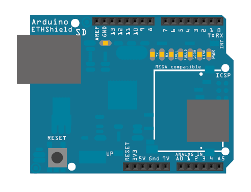

A simple server that distributes any incoming messages to all connected clients.  To use, open a terminal window, Telnet to your devices IP address, and type away.  Any incoming text will be sent to all connected clients (including the one typing). Additionally, you will be able to see the client's input in your serial monitor as well.

## Hardware Required

- Arduino Board

- [Arduino Ethernet Shield](https://arduino.cc/en/Guide/ArduinoEthernetShield)

## Circuit

The Ethernet shield allows you to connect a WizNet Ethernet controller to the Arduino boards via the SPI bus. It uses pins 10, 11, 12, and 13 for the SPI connection to the WizNet.  Later models of the Ethernet shield also have an SD Card on board. Digital pin 4 is used to control the chip select pin on the SD card.

The shield should be connected to a network with an ethernet cable.  You will need to change the network settings in the program to correspond to your network.



image developed using [Fritzing](http://www.fritzing.org). For more circuit examples, see the [Fritzing project page](http://fritzing.org/projects/)

***In the above  image, the Arduino board would be stacked below the Ethernet shield.***

## Schematic


## Code:

```arduino

/*

 Chat Server

 A simple server that distributes any incoming messages to all

 connected clients.  To use, telnet to your device's IP address and type.

 You can see the client's input in the serial monitor as well.

 Using an Arduino Wiznet Ethernet shield.

 Circuit:

 * Ethernet shield attached to pins 10, 11, 12, 13

 created 18 Dec 2009

 by David A. Mellis

 modified 9 Apr 2012

 by Tom Igoe

 */

#include <SPI.h>
#include <Ethernet.h>

// Enter a MAC address and IP address for your controller below.
// The IP address will be dependent on your local network.
// gateway and subnet are optional:
byte mac[] = {

  0xDE, 0xAD, 0xBE, 0xEF, 0xFE, 0xED };

IPAddress ip(192, 168, 1, 177);

IPAddress myDns(192, 168, 1, 1);

IPAddress gateway(192, 168, 1, 1);

IPAddress subnet(255, 255, 0, 0);

// telnet defaults to port 23

EthernetServer server(23);

bool alreadyConnected = false; // whether or not the client was connected previously

void setup() {

  // You can use Ethernet.init(pin) to configure the CS pin

  //Ethernet.init(10);  // Most Arduino shields

  //Ethernet.init(5);   // MKR ETH shield

  //Ethernet.init(0);   // Teensy 2.0

  //Ethernet.init(20);  // Teensy++ 2.0

  //Ethernet.init(15);  // ESP8266 with Adafruit® Featherwing Ethernet

  //Ethernet.init(33);  // ESP32 with Adafruit® Featherwing Ethernet

  // initialize the ethernet device

  Ethernet.begin(mac, ip, myDns, gateway, subnet);

  // Open serial communications and wait for port to open:

  Serial.begin(9600);

   while (!Serial) {

    ; // wait for serial port to connect. Needed for native USB port only

  }

  // Check for Ethernet hardware present

  if (Ethernet.hardwareStatus() == EthernetNoHardware) {

    Serial.println("Ethernet shield was not found.  Sorry, can't run without hardware. :(");

    while (true) {

      delay(1); // do nothing, no point running without Ethernet hardware

    }

  }

  if (Ethernet.linkStatus() == LinkOFF) {

    Serial.println("Ethernet cable is not connected.");

  }

  // start listening for clients

  server.begin();

  Serial.print("Chat server address:");

  Serial.println(Ethernet.localIP());
}

void loop() {

  // wait for a new client:

  EthernetClient client = server.available();

  // when the client sends the first byte, say hello:

  if (client) {

    if (!alreadyConnected) {

      // clear out the input buffer:

      client.flush();

      Serial.println("We have a new client");

      client.println("Hello, client!");

      alreadyConnected = true;

    }

    if (client.available() > 0) {

      // read the bytes incoming from the client:

      char thisChar = client.read();

      // echo the bytes back to the client:

      server.write(thisChar);

      // echo the bytes to the server as well:

      Serial.write(thisChar);

    }

  }
}
```

**Last revision 2018/08/23 by SM**
