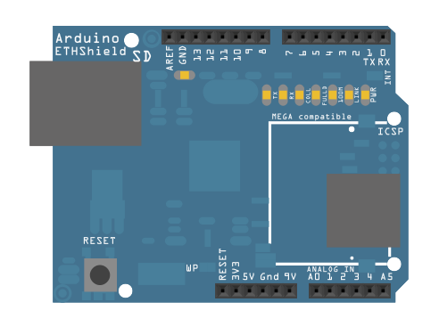

---

tags: [Ethernet]
author: Arduino
title: 'Ethernet Shield DHCP Chat Server'
description: 'Connects to a Telnet server using an Ethernet shield. Messages from the server are printed out via the serial port.'
---

This example connects to a Telnet server using an Ethernet shield.  Messages from the server are printed out via the serial port. Messages can be sent to the remote server serially as well. The Serial Monitor works well for this purpose.

This version attempts to get an IP address using DHCP. An IP address can be assigned via DHCP when Ethernet.begin(mac) is called. Be careful, when using the DHCP extensions, sketch size increases significantly.

## Hardware Required

- Arduino Board

- [Arduino Ethernet Shield](/hardware/ethernet-shield-rev2)

## Software Required

- A telnet server

- Alternatively, [Processing](http://www.Processing.org) has a ChatServer example that works well for this purpose

## Circuit

The Ethernet shield allows you to connect a WIZNet Ethernet controller to the Arduino boards via the SPI bus. It uses the ICSP header pins and pin 10 as chip select for the SPI connection to the Ethernet controller chip. Later models of the Ethernet shield also have an SD Card on board. Digital pin 4 is used to control the chip select pin on the SD card.

The shield should be connected to a network with an Ethernet cable.  You will need to change the network settings in the program to correspond to your network.



Image developed using [Fritzing](http://www.fritzing.org). For more circuit examples, see the [Fritzing project page](http://fritzing.org/projects/)

***In the above  image, the Arduino board would be stacked below the Ethernet shield.***

## Code

```arduino

/*

 DHCP Chat  Server

 A simple server that distributes any incoming messages to all

 connected clients.  To use, telnet to your device's IP address and type.

 You can see the client's input in the serial monitor as well.

 Using an Arduino Wiznet Ethernet shield.

 THis version attempts to get an IP address using DHCP

 Circuit:

 * Ethernet shield attached to pins 10, 11, 12, 13

 created 21 May 2011

 modified 9 Apr 2012

 by Tom Igoe

 modified 02 Sept 2015

 by Arturo Guadalupi

 Based on ChatServer example by David A. Mellis

 */

#include <SPI.h>
#include <Ethernet.h>

// Enter a MAC address and IP address for your controller below.
// The IP address will be dependent on your local network.
// gateway and subnet are optional:
byte mac[] = {

  0x00, 0xAA, 0xBB, 0xCC, 0xDE, 0x02
};

IPAddress ip(192, 168, 1, 177);

IPAddress myDns(192, 168, 1, 1);

IPAddress gateway(192, 168, 1, 1);

IPAddress subnet(255, 255, 0, 0);

// telnet defaults to port 23

EthernetServer server(23);

bool gotAMessage = false; // whether or not you got a message from the client yet

void setup() {

  // You can use Ethernet.init(pin) to configure the CS pin

  //Ethernet.init(10);  // Most Arduino shields

  //Ethernet.init(5);   // MKR ETH shield

  //Ethernet.init(0);   // Teensy 2.0

  //Ethernet.init(20);  // Teensy++ 2.0

  //Ethernet.init(15);  // ESP8266 with Adafruit® Featherwing Ethernet

  //Ethernet.init(33);  // ESP32 with Adafruit® Featherwing Ethernet

  // Open serial communications and wait for port to open:

  Serial.begin(9600);

  while (!Serial) {

    ; // wait for serial port to connect. Needed for native USB port only

  }

  // start the Ethernet connection:

  Serial.println("Trying to get an IP address using DHCP");

  if (Ethernet.begin(mac) == 0) {

    Serial.println("Failed to configure Ethernet using DHCP");

    // Check for Ethernet hardware present

    if (Ethernet.hardwareStatus() == EthernetNoHardware) {

      Serial.println("Ethernet shield was not found.  Sorry, can't run without hardware. :(");

      while (true) {

        delay(1); // do nothing, no point running without Ethernet hardware

      }

    }

    if (Ethernet.linkStatus() == LinkOFF) {

      Serial.println("Ethernet cable is not connected.");

    }

    // initialize the Ethernet device not using DHCP:

    Ethernet.begin(mac, ip, myDns, gateway, subnet);

  }

  // print your local IP address:

  Serial.print("My IP address: ");

  Serial.println(Ethernet.localIP());

  // start listening for clients

  server.begin();
}

void loop() {

  // wait for a new client:

  EthernetClient client = server.available();

  // when the client sends the first byte, say hello:

  if (client) {

    if (!gotAMessage) {

      Serial.println("We have a new client");

      client.println("Hello, client!");

      gotAMessage = true;

    }

    // read the bytes incoming from the client:

    char thisChar = client.read();

    // echo the bytes back to the client:

    server.write(thisChar);

    // echo the bytes to the server as well:

    Serial.print(thisChar);

    Ethernet.maintain();

  }
}
```

