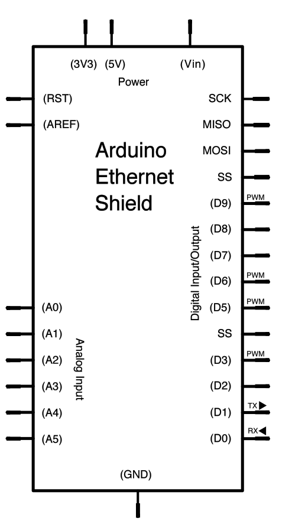

This example shows you how to make repeated HTTP requests using an Ethernet shield.   This example uses DNS, by assigning the Ethernet client with a MAC address, IP address, and DNS address. It connects to  [http://www.arduino.cc/latest.txt](http://www.arduino.cc/latest.txt). The content of the page is viewable in the Serial Monitor.

## Hardware Required

- Arduino Board

- [Arduino Ethernet Shield](/hardware/ethernet-shield-rev2)

## Circuit

The Ethernet shield allows you to connect a WIZNet Ethernet controller to the Arduino boards via the SPI bus. It uses the ICSP header pins and pin 10 as chip select for the SPI connection to the Ethernet controller chip. Later models of the Ethernet shield also have an SD Card on board. Digital pin 4 is used to control the chip select pin on the SD card.

The shield should be connected to a network with an Ethernet cable.  You will need to change the network settings in the program to correspond to your network.


Image developed using [Fritzing](http://www.fritzing.org). For more circuit examples, see the [Fritzing project page](http://fritzing.org/projects/)

***In the above  image, the Arduino board would be stacked below the Ethernet shield.***

## Schematic



## Code

```arduino

/*

  Repeating Web client

 This sketch connects to a a web server and makes a request

 using a Wiznet Ethernet shield. You can use the Arduino Ethernet shield, or

 the Adafruit Ethernet shield, either one will work, as long as it's got

 a Wiznet Ethernet module on board.

 This example uses DNS, by assigning the Ethernet client with a MAC address,

 IP address, and DNS address.

 Circuit:

 * Ethernet shield attached to pins 10, 11, 12, 13

 created 19 Apr 2012

 by Tom Igoe

 modified 21 Jan 2014

 by Federico Vanzati

 http://www.arduino.cc/en/Tutorial/WebClientRepeating

 This code is in the public domain.

 */

#include <SPI.h>
#include <Ethernet.h>

// assign a MAC address for the ethernet controller.
// fill in your address here:
byte mac[] = {

  0xDE, 0xAD, 0xBE, 0xEF, 0xFE, 0xED
};
// Set the static IP address to use if the DHCP fails to assign

IPAddress ip(192, 168, 0, 177);

IPAddress myDns(192, 168, 0, 1);

// initialize the library instance:

EthernetClient client;

char server[] = "www.arduino.cc";  // also change the Host line in httpRequest()
//IPAddress server(64,131,82,241);

unsigned long lastConnectionTime = 0;           // last time you connected to the server, in milliseconds

const unsigned long postingInterval = 10*1000;  // delay between updates, in milliseconds

void setup() {

  // You can use Ethernet.init(pin) to configure the CS pin

  //Ethernet.init(10);  // Most Arduino shields

  //Ethernet.init(5);   // MKR ETH shield

  //Ethernet.init(0);   // Teensy 2.0

  //Ethernet.init(20);  // Teensy++ 2.0

  //Ethernet.init(15);  // ESP8266 with Adafruit Featherwing Ethernet

  //Ethernet.init(33);  // ESP32 with Adafruit Featherwing Ethernet

  // start serial port:

  Serial.begin(9600);

  while (!Serial) {

    ; // wait for serial port to connect. Needed for native USB port only

  }

  // start the Ethernet connection:

  Serial.println("Initialize Ethernet with DHCP:");

  if (Ethernet.begin(mac) == 0) {

    Serial.println("Failed to configure Ethernet using DHCP");

    // Check for Ethernet hardware present

    if (Ethernet.hardwareStatus() == EthernetNoHardware) {

      Serial.println("Ethernet shield was not found.  Sorry, can't run without hardware. :(");

      while (true) {

        delay(1); // do nothing, no point running without Ethernet hardware

      }

    }

    if (Ethernet.linkStatus() == LinkOFF) {

      Serial.println("Ethernet cable is not connected.");

    }

    // try to configure using IP address instead of DHCP:

    Ethernet.begin(mac, ip, myDns);

    Serial.print("My IP address: ");

    Serial.println(Ethernet.localIP());

  } else {

    Serial.print("  DHCP assigned IP ");

    Serial.println(Ethernet.localIP());

  }

  // give the Ethernet shield a second to initialize:

  delay(1000);
}

void loop() {

  // if there's incoming data from the net connection.

  // send it out the serial port.  This is for debugging

  // purposes only:

  if (client.available()) {

    char c = client.read();

    Serial.write(c);

  }

  // if ten seconds have passed since your last connection,

  // then connect again and send data:

  if (millis() - lastConnectionTime > postingInterval) {

    httpRequest();

  }

}

// this method makes a HTTP connection to the server:
void httpRequest() {

  // close any connection before send a new request.

  // This will free the socket on the WiFi shield

  client.stop();

  // if there's a successful connection:

  if (client.connect(server, 80)) {

    Serial.println("connecting...");

    // send the HTTP GET request:

    client.println("GET /latest.txt HTTP/1.1");

    client.println("Host: www.arduino.cc");

    client.println("User-Agent: arduino-ethernet");

    client.println("Connection: close");

    client.println();

    // note the time that the connection was made:

    lastConnectionTime = millis();

  } else {

    // if you couldn't make a connection:

    Serial.println("connection failed");

  }
}
```


**Last revision 2018/09/07 by SM**
