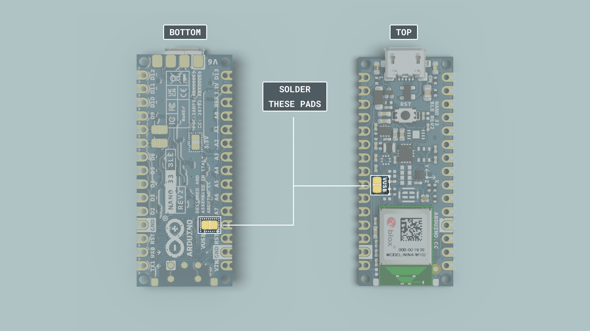
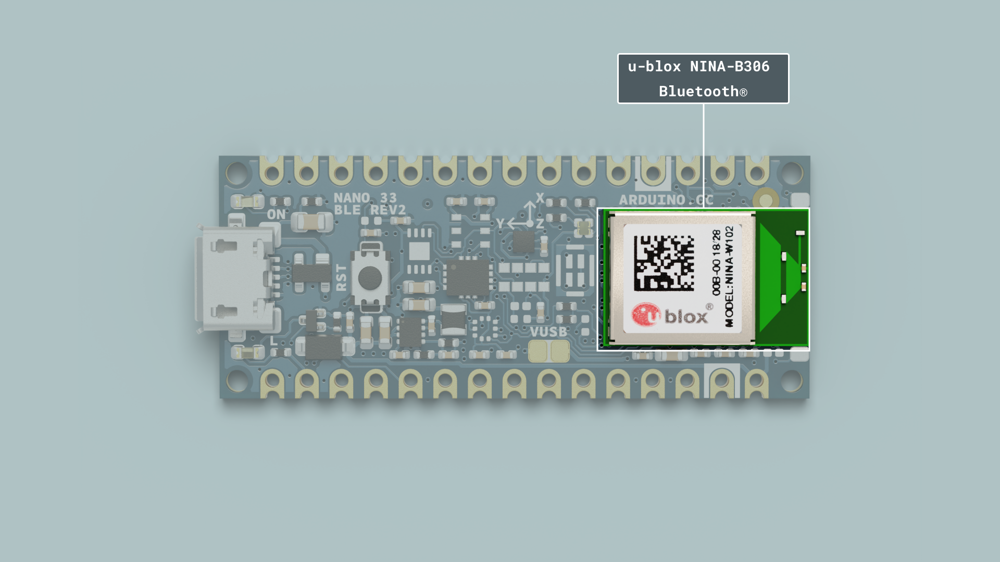

This article is a collection of guides, API calls, libraries and tutorials that can help you get started with the Nano 33 BLE Rev2 board.

You can also visit the [documentation platform for the Nano 33 BLE Rev2](/hardware/nano-33-ble-rev2).

## Core

The Nano 33 BLE Rev2 uses the [Arduino Mbed OS Nano Boards core](https://github.com/arduino/ArduinoCore-mbed).

## Datasheet

The full datasheet is available as a downloadable PDF from the link below:

- [Download the Arduino Nano 33 BLE Rev2 datasheet](../../downloads/ABX00071-datasheet.pdf)

## Installation

### Arduino IDE 1.8.X

The Nano 33 BLE Rev2 can be programmed through the **Classic Arduino IDE 1.8.X**. To install your board, you can check out the guide below:

- [Installing the Arduino Mbed OS Nano Boards core](/software/ide-v2/tutorials/ide-v2-board-manager)

### Arduino IDE 2 

The Nano 33 BLE Rev2 can be programmed through the **Arduino IDE 2**. To install your board, you can check out the guide below:

- [How to use the board manager with the Arduino IDE 2](/software/ide-v2/tutorials/ide-v2-board-manager)

### Web Editor

The Nano 33 BLE Rev2 can be programmed through the **Web Editor**. To get started with your board, you will only need to install a plugin, which is explained in the guide below:

- [Getting Started with the Web Editor](/arduino-cloud/guides/cloud-editor)

## Using OpenMV IDE

If you want to use your board with MicroPython and OpenMV, follow the tutorial below:

- [Getting started with OpenMV with Nano 33 BLE Rev2](/tutorials/nano-33-ble/getting-started-omv)

If you want an overlook of the functions and features that MicroPython provides, take a look at the tutorial below:

- [MicroPython functions and syntax guide](/tutorials/nano-33-ble/ble-python-api)

### Forcing Bootloader

There is a risk that the uploading process gets stuck during an upload. If this happens, double-tap the reset button, to forcefully trigger the bootloader.

## Pins


### Analog Pins

The Nano 33 BLE Rev2 has eight analog pins, that can be used through the `analogRead()` function.

```arduino
value = analogRead(pin, value);
```

***Please note: pins `A4` and `A5` should be used for I2C only.***


### PWM Pins

Pins **D2-D12** and **A0-A7** support PWM (Pulse Width Modulation).

***Pins A4, A5 and D11, D12 are not recommended for PWM as they have I2C & SPI buses attached.***

```arduino
analogWrite(pin, value);
```

### Digital Pins

There are a total of 14 digital pins.


To use them, we first need to define them inside the `void setup()` function of our sketch.


```arduino
pinMode(pin, INPUT); //configured as an input
pinMode(pin, OUTPUT); //configured as an output
pinMode(pin, INPUT_PULLUP); //uses the internal 10k ohm resistor
```

To read the state of a digital pin:

```arduino
state = digitalRead(pin);
```

To write a state to a digital pin:

```arduino
digitalWrite(pin, HIGH);
```

### 5V Pin

The microcontroller on the Nano 33 BLE Rev2 runs at 3.3 V, which means that you must never apply more than 3.3 V to its Digital and Analog pins. Care must be taken when connecting sensors and actuators to ensure that this limit of 3.3 V is never exceeded. Connecting higher voltage signals, like the 5 V commonly used with the other Arduino boards, will damage the Nano 33 BLE Rev2.

To avoid such risk with existing projects, where you should be able to pull out a Nano and replace it with the Nano 33 BLE Rev2, we have the 5V pin on the header, positioned between RST and A7 that is not connected as the default factory setting. This means that if you have a design that takes 5 V from that pin, it won't work immediately, as a precaution we put in place to draw your attention to the 3.3 V compliance on digital and analog inputs.

5 V on that pin is available only when two conditions are met: you make a solder bridge on the two pads marked as VUSB and you power the Nano 33 BLE Rev2 through the USB port. There are two sets of VUSB pads on the Nano 33 BLE Rev2, one set on the bottom and one set on top. To enable the 5V pin, either one of these needs to be connected If you power the board from the VIN pin, you won't get any regulated 5 V and therefore even if you do the solder bridge, nothing will come out of that 5V pin. The 3.3V, on the other hand, is always available and supports enough current to drive your sensors. Please make your designs so that sensors and actuators are driven with 3.3 V and work with 3.3 V digital IO levels. 5 V is now an option for many modules and 3.3 V is becoming the standard voltage for electronic ICs.



## IMU


### BMI270 and BMM150

The Nano 33 BLE Rev2 Inertial Measurement Unit system is made up of two separate IMUs, a 6-axis BMI270 and a 3-axis BMM150, effectively giving you a 9-axis IMU system. This allows you to detect orientation, motion, or vibrations in your project.

### BMI270 and BMM150 Library

To access the data from the IMU system, we need to install the [BMI270_BMM150](https://github.com/arduino-libraries/Arduino_BMI270_BMM150) library, which comes with examples that can be used directly with the Nano 33 BLE Rev2.

It can be installed directly from the library manager through the IDE of your choice. To use it, we need to include it at the top of the sketch:

```arduino
#include "Arduino_BMI270_BMM150.h"
```

And to initialize the library, we can use the following command inside `void setup()`.

```arduino
  if (!IMU.begin()) {
    Serial.println("Failed to initialize IMU!");
    while (1);
  }
```

### Accelerometer

The accelerometer data can be accessed through the following commands:

```arduino
  float x, y, z;

  if (IMU.accelerationAvailable()) {
    IMU.readAcceleration(x, y, z);
  }
```

### Gyroscope

The gyroscope data can be accessed through the following commands:

```arduino
  float x, y, z;

  if (IMU.gyroscopeAvailable()) {
    IMU.readGyroscope(x, y, z);
  }
```

### Magnetometer

The magnetometer data can be accessed through the following commands:

```arduino
  float x, y, z;

  IMU.readMagneticField(x, y, z);
```

### Tutorials

If you want to learn more about how to use the IMU, please check out the tutorials below:

- [Accessing IMU gyroscope data with Nano 33 BLE Rev2](/tutorials/nano-33-ble-rev2/imu-gyroscope)
- [Accessing IMU accelerometer data with Nano 33 BLE Rev2](/tutorials/nano-33-ble-rev2/imu-accelerometer)
- [Accessing IMU magnetometer data with Nano 33 BLE Rev2](/tutorials/nano-33-ble-rev2/imu-magnetometer)

## Communication

Like other Arduino® products, the Nano 33 BLE Rev2 features dedicated pins for different protocols.

### SPI

The pins used for SPI (Serial Peripheral Interface) on the Nano 33 BLE Rev2 are the following:

- (CIPO) - D12
- (COPI) - D11
- (SCK) - D13
- (CS/SS) - Any GPIO

***The signal names MOSI, MISO and SS have been replaced by COPI (Controller Out, Peripheral In), CIPO (Controller In, Peripheral Out) and CS (Chip Select).***

To use SPI, we first need to include the [SPI](https://www.arduino.cc/en/reference/SPI) library.

```arduino
#include <SPI.h>
```

Inside `void setup()` we need to initialize the library.

```arduino
SPI.begin();
```

And to write to the device:

```arduino
  digitalWrite(chipSelectPin, LOW); //pull down the CS pin
  
  SPI.transfer(address); // address for device, for example 0x00
  SPI.transfer(value); // value to write

  digitalWrite(chipSelectPin, HIGH); // pull up the CS pin
```


### I2C

The pins used for I2C (Inter-Integrated Circuit) on the Nano 33 BLE Rev2 are the following:

- (SDA) - A4
- (SCL) - A5

To use I2C, we can use the [Wire](https://www.arduino.cc/en/Reference/wire) library, which we need to include at the top of our sketch.

```arduino
#include <Wire.h>
```

Inside `void setup()` we need to initialize the library.

```arduino
Wire.begin(); 
```

And to write something to a device connected via I2C, we can use the following commands:

```arduino
  Wire.beginTransmission(1); //begin transmit to device 1
  Wire.write(byte(0x00)); //send instruction byte 
  Wire.write(val); //send a value
  Wire.endTransmission(); //stop transmit
```

### UART

The pins used for UART (Universal asynchronous receiver-transmitter) are the following:

- (Rx) - D0
- (Tx) - D1

To send and receive data through UART, we will first need to set the baud rate inside `void setup()`.

```arduino
Serial1.begin(9600);
```

To read incoming data, we can use a while loop() to read each individual character and add it to a string.

```arduino
  while(Serial1.available()){
    delay(2);
    char c = Serial1.read();
    incoming += c;
  }
```

And to write something, we can use the following command:

```arduino
Serial1.write("Hello world!");
```

## Connectivity

The Nano 33 BLE Rev2 supports Bluetooth® through the [u-blox NINA-B306](https://docs.arduino.cc/resources/datasheets/NINA-B3-series.pdf) module. To use this module, we can use the [ArduinoBLE](https://www.arduino.cc/en/Reference/ArduinoBLE) library. 



## Bluetooth®

To enable Bluetooth® on the Nano 33 BLE Rev2, we can use the [ArduinoBLE](https://www.arduino.cc/en/Reference/ArduinoBLE) library, and include it at the top of our sketch:

```arduino
#include <ArduinoBLE.h>
```

Set the service and characteristics:

```arduino
BLEService ledService("180A"); // BLE LED Service
BLEByteCharacteristic switchCharacteristic("2A57", BLERead | BLEWrite);
```

Set advertised name and service:

```arduino
  BLE.setLocalName("Nano 33 BLE Rev2");
  BLE.setAdvertisedService(ledService);
```

Start advertising:

```arduino
BLE.advertise();
```

Listen for Bluetooth® Low Energy peripherals to connect:

```arduino  
BLEDevice central = BLE.central();
```

### Tutorials

- [Controlling Nano 33 BLE Rev2 RGB LED via Bluetooth](/tutorials/nano-33-ble/bluetooth)

## USB Keyboard

To use the board as a keyboard, you can refer to the [USB HID](https://github.com/arduino/ArduinoCore-mbed/tree/master/libraries/USBHID) library that can be found inside the core.

You first need to include the libraries and create an object:

```arduino
#include "PluggableUSBHID.h"
#include "USBKeyboard.h"

USBKeyboard Keyboard;
```

Then use the following command to write something:

```arduino
Keyboard.printf("This is Nano 33 speaking!");
```
