***This post was originally published by Sandeep Mistry and Dominic Pajak on the [TensorFlow blog](https://medium.com/tensorflow/how-to-get-started-with-machine-learning-on-arduino-7daf95b4157).*** 

## Introduction

***Important notice! The [TensorFlow Lite Micro Library](https://github.com/tensorflow/tflite-micro-arduino-examples) is no longer available in the Arduino Library Manager. This library will need to be manually downloaded, and included in your IDE.***

[Arduino](https://www.arduino.cc/) is on a mission to make machine learning simple enough for anyone to use. We’ve been working with the TensorFlow Lite team over the past few months and are excited to show you what we’ve been up to together: bringing TensorFlow Lite Micro to the [Arduino Nano 33 BLE Sense Rev2](/hardware/nano-33-ble-sense-rev2). In this article, we’ll show you how to install and run several new [TensorFlow Lite Micro](https://www.tensorflow.org/lite/microcontrollers/overview) examples that are now available in the [Arduino Library Manager](https://www.arduino.cc/en/guide/libraries).

The first tutorial below shows you how to install a neural network on your Arduino board to recognize simple voice commands.

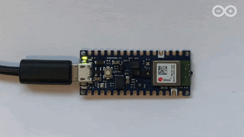

Next, we’ll introduce a more in-depth tutorial you can use to train your own custom gesture recognition model for Arduino using TensorFlow in Colab. This material is based on a practical workshop held by Sandeep Mistry and Don Coleman, an updated version of which is [now online](https://github.com/arduino/ArduinoTensorFlowLiteTutorials/tree/master/GestureToEmoji). 

If you have previous experience with Arduino, you may be able to get these tutorials working within a couple of hours. If you’re entirely new to microcontrollers, it may take a bit longer. 

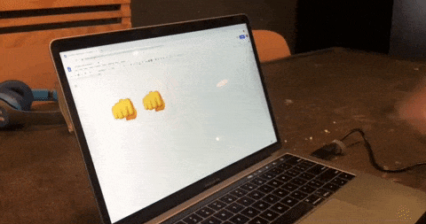

We’re excited to share some of the first examples and tutorials, and to see what you will build from here. Let’s get started!

<iframe width="560" height="315" src="https://www.youtube.com/embed/HzCRZsGJLbI" title="YouTube video player" frameborder="0" allow="accelerometer; autoplay; clipboard-write; encrypted-media; gyroscope; picture-in-picture" allowfullscreen></iframe>

**Note:** The following projects are based on TensorFlow Lite for Microcontrollers which is currently experimental within the [TensorFlow repo](https://github.com/tensorflow/tflite-micro-arduino-examples). This is still a new and emerging field!

## Goals 
- Learn the fundamentals of TinyML implementation and training.
- Use the [BMI270_BMM150](https://www.arduino.cc/reference/en/libraries/arduino_bmi270_bmm150/) and [Arduino_TensorFlowLite](https://github.com/tensorflow/tflite-micro-arduino-examples) libraries

## Hardware & Software Needed
- An [Arduino Nano 33 BLE Sense Rev2](/hardware/nano-33-ble-sense-rev2) board
- A Micro USB cable to connect the Arduino board to your desktop machine
- To program your board, you can use the [Arduino Web Editor](https://www.arduino.cc/en/main/software) or install the [Arduino IDE](https://www.arduino.cc/en/main/software). We’ll give you more details on how to set these up in the following sections

The Arduino Nano 33 BLE Sense Rev2 has a variety of onboard sensors meaning potential for some cool TinyML applications:

- Voice – digital microphone
- Motion – 9-axis IMU (accelerometer, gyroscope, magnetometer)
- Environmental – temperature, humidity and pressure
- Light – brightness, color and object proximity

Unlike classic Arduino Uno, the board combines a microcontroller with onboard sensors which means you can address many use cases without additional hardware or wiring. The board is also small enough to be used in end applications like wearables. As the name suggests it has Bluetooth® Low Energy connectivity so you can send data (or inference results) to a laptop, mobile app or other Bluetooth® Low Energy boards and peripherals.

**Tip: Sensors on a USB stick** – Connecting the BLE Sense board over USB is an easy way to capture data and add multiple sensors to single board computers without the need for additional wiring or hardware – a nice addition to a Raspberry Pi, for example.

## Microcontrollers and TinyML
Microcontrollers, such as those used on Arduino boards, are low-cost, single chip, self-contained computer systems. They’re the invisible computers embedded inside billions of everyday gadgets like wearables, drones, 3D printers, toys, rice cookers, smart plugs, e-scooters, washing machines. The trend to connect these devices is part of what is referred to as the Internet of Things.

Arduino is an open-source platform and community focused on making microcontroller application development accessible to [everyone](https://create.arduino.cc/projecthub). The [board](https://store.arduino.cc/usa/nano-33-ble-sense) we’re using here has an Arm Cortex-M4 microcontroller running at 64 MHz with 1 MB Flash memory and 256 KB of RAM. This is tiny in comparison to cloud, PC, or mobile but reasonable by microcontroller standards.

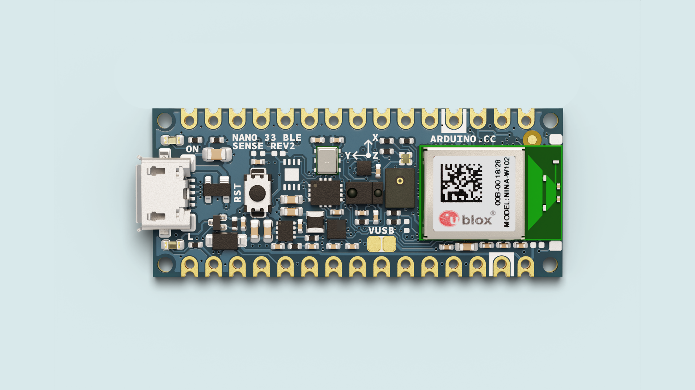

There are practical reasons you might want to squeeze ML on microcontrollers, including: 

- Function – wanting a smart device to act quickly and locally (independent of the Internet).
- Cost – accomplishing this with simple, lower cost hardware.
- Privacy – not wanting to share all sensor data externally.
- Efficiency – smaller device form-factor, energy-harvesting or longer battery life.

There’s a final goal which we’re building towards that is very important:

- Machine learning can make microcontrollers accessible to developers who don’t have a background in embedded development 

On the machine learning side, there are techniques you can use to fit neural network models into memory constrained devices like microcontrollers. One of the key steps is the [quantization of the weights](https://petewarden.com/2016/05/03/how-to-quantize-neural-networks-with-tensorflow/) from floating point to 8-bit integers. This also has the effect of making inference quicker to calculate and more applicable to lower clock-rate devices. 

TinyML is an emerging field and there is still work to do – but what’s exciting is there’s a vast unexplored application space out there. Billions of microcontrollers combined with all sorts of sensors in all sorts of places which can lead to some seriously creative and valuable TinyML applications in the future.

## TensorFlow Lite for Microcontrollers Examples

***The TensorFlow Lite examples are currently not compatible with the [Arduino Nano BLE Sense Rev2](/hardware/nano-33-ble-sense-rev2) board.***

The inference examples for TensorFlow Lite for Microcontrollers are now packaged and available through the Arduino Library Manager making it possible to include and run them on Arduino in a few clicks. In this section we’ll show you how to run them. The examples are:

- micro_speech – speech recognition using the onboard microphone
- magic_wand – gesture recognition using the onboard IMU
- person_detection – person detection using an external ArduCam camera

For more background on the examples you can take a look at the source in the [TensorFlow repository](https://github.com/tensorflow/tflite-micro-arduino-examples). The models in these examples were previously trained. The tutorials below show you how to deploy and run them on an Arduino. In the next section, we’ll discuss training.

## How to Run the Examples Using Arduino Create Web Editor. 
Once you connect your Arduino Nano 33 BLE Sense Rev2 to your desktop machine with a USB cable you will be able to compile and run the following TensorFlow examples on the board by using the [Arduino Create](https://create.arduino.cc/editor) web editor:


## Focus On The Speech Recognition Example
One of the first steps with an Arduino board is getting the LED to flash. Here, we’ll do it with a twist by using TensorFlow Lite Micro to recognise voice keywords. It has a simple vocabulary of “yes” and “no.” Remember this model is running locally on a microcontroller with only 256 KB of RAM, so don’t expect commercial ‘voice assistant’ level accuracy – it has no Internet connection and on the order of 2000x less local RAM available.

Note the board can be battery powered as well. As the Arduino can be connected to motors, actuators and more this offers the potential for voice-controlled projects.


## How To Run The Examples Using the Arduino IDE

Alternatively you can use try the same inference examples using Arduino IDE application.

First, follow the instructions in the next section Setting up the Arduino IDE.

In the Arduino IDE, you will see the examples available via the **File > Examples > Arduino_TensorFlowLite**  menu in the ArduinoIDE.

Select an example and the sketch will open. To compile, upload and run the examples on the board, and click the arrow icon:


## Training a TensorFlow Lite Micro Model For Arduino


Next we will use ML to enable the Arduino board to recognise gestures. We’ll capture motion data from the Arduino Nano 33 BLE Sense Rev2 board, import it into TensorFlow to train a model, and deploy the resulting classifier onto the board.

The idea for this tutorial was based on Charlie Gerard’s awesome [Play Street Fighter with body movements using Arduino and Tensorflow.js](https://medium.com/@devdevcharlie/play-street-fighter-with-body-movements-using-arduino-and-tensorflow-js-6b0e4734e118). In Charlie’s example, the board is streaming all sensor data from the Arduino to another machine which performs the gesture classification in Tensorflow.js. We take this further and “TinyML-ify” it by performing gesture classification on the Arduino board itself. This is made easier in our case as the Arduino Nano 33 BLE Sense Rev2 board we’re using has a more powerful Arm Cortex-M4 processor, and an on-board IMU.

We’ve adapted the tutorial below, so no additional hardware is needed – the sampling starts on detecting movement of the board. The original version of the tutorial adds a breadboard and a hardware button to press to trigger sampling. If you want to get into a little hardware, you can follow that version [instead](https://github.com/sandeepmistry/aimldevfest-workshop-2019).

## IDE Setup

**1.** First, let's make sure we have the drivers for the Nano 33 BLE boards installed. If we are using the online IDE, there is no need to install anything, if you are using the offline IDE, we need to install it manually. This can be done by navigating to **Tools > Board > Board Manager...**, search for **Arduino Mbed OS Nano Boards**, and install it. 

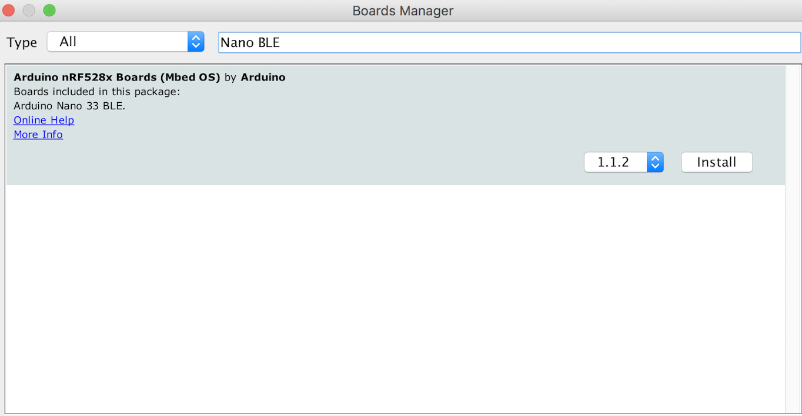

**2.** Also, let's make sure we have all the libraries we need installed. If we are using the online IDE, there is no need to install anything. If we are using the offline IDE, this can be done by navigating to **Tools > Manage libraries...**, search for **Arduino_TensorFlowLite** and **Arduino_BMI270_BMM150**, and install them both. 

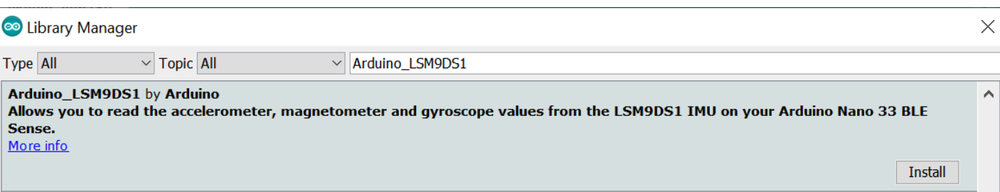

There are more detailed [Getting Started](https://www.arduino.cc/en/Guide/NANO33BLESense) and [Troubleshooting](https://support.arduino.cc/hc/en-us) guides on the Arduino site if you need help.

## Streaming Sensor Data From the Arduino Board

First, we need to capture some training data. You can capture sensor data logs from the Arduino board over the same USB cable you use to program the board with your laptop or PC.

Arduino boards run small applications (also called sketches) which are compiled from .ino format Arduino source code, and programmed onto the board using the Arduino IDE or Arduino Create. 

With the sketch we are creating we will do the following:

- Monitor the board’s accelerometer and gyroscope 
- Trigger a sample window on detecting significant linear acceleration of the board 
- Sample for one second at 119Hz, outputting CSV format data over USB 
- Loop back and monitor for the next gesture

**The sensors we choose to read from the board, the sample rate, the trigger threshold, and whether we stream data output as CSV, JSON, binary or some other format are all customizable in the sketch running on the Arduino. There is also scope to perform signal preprocessing and filtering on the device before the data is output to the log – this we can cover in another blog. For now, you can just upload the sketch and get sampling.**

The complete sketch can be found below:

```
/*
  IMU Capture
  This example uses the on-board IMU to start reading acceleration and gyroscope
  data from on-board IMU and prints it to the Serial Monitor for one second
  when the significant motion is detected.
  You can also use the Serial Plotter to graph the data.
  The circuit:
  - Arduino Nano 33 BLE or Arduino Nano 33 BLE Sense Rev2 board.
  Created by Don Coleman, Sandeep Mistry
  Modified by Dominic Pajak, Sandeep Mistry
  This example code is in the public domain.
*/

#include <Arduino_BMI270_BMM150.h>

const float accelerationThreshold = 2.5; // threshold of significant in G's
const int numSamples = 119;

int samplesRead = numSamples;

void setup() {
  Serial.begin(9600);
  while (!Serial);

  if (!IMU.begin()) {
    Serial.println("Failed to initialize IMU!");
    while (1);
  }

  // print the header
  Serial.println("aX,aY,aZ,gX,gY,gZ");
}

void loop() {
  float aX, aY, aZ, gX, gY, gZ;

  // wait for significant motion
  while (samplesRead == numSamples) {
    if (IMU.accelerationAvailable()) {
      // read the acceleration data
      IMU.readAcceleration(aX, aY, aZ);

      // sum up the absolutes
      float aSum = fabs(aX) + fabs(aY) + fabs(aZ);

      // check if it's above the threshold
      if (aSum >= accelerationThreshold) {
        // reset the sample read count
        samplesRead = 0;
        break;
      }
    }
  }

  // check if the all the required samples have been read since
  // the last time the significant motion was detected
  while (samplesRead < numSamples) {
    // check if both new acceleration and gyroscope data is
    // available
    if (IMU.accelerationAvailable() && IMU.gyroscopeAvailable()) {
      // read the acceleration and gyroscope data
      IMU.readAcceleration(aX, aY, aZ);
      IMU.readGyroscope(gX, gY, gZ);

      samplesRead++;

      // print the data in CSV format
      Serial.print(aX, 3);
      Serial.print(',');
      Serial.print(aY, 3);
      Serial.print(',');
      Serial.print(aZ, 3);
      Serial.print(',');
      Serial.print(gX, 3);
      Serial.print(',');
      Serial.print(gY, 3);
      Serial.print(',');
      Serial.print(gZ, 3);
      Serial.println();

      if (samplesRead == numSamples) {
        // add an empty line if it's the last sample
        Serial.println();
      }
    }
  }
}
```

## Visualizing Live Sensor Data Log From the Arduino Board
With that done we can now visualize the data coming off the board. We’re not capturing data yet this is just to give you a feel for how the sensor data capture is triggered and how long a sample window is. This will help when it comes to collecting training samples.

- In the Arduino IDE, open the Serial Plotter **Tools > Serial Plotter** 
- If you get an error that the board is not available, reselect the port:
**Tools > Port > portname (Arduino Nano 33 BLE)** 
- Pick up the board and practice your punch and flex gestures
- You’ll see it only sample for a one second window, then wait for the next gesture
- You should see a live graph of the sensor data capture (see GIF below)

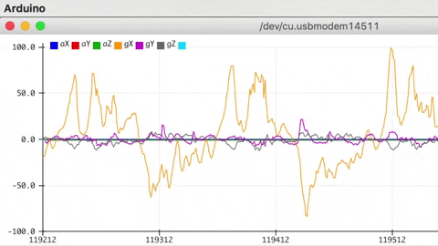

**When you’re done be sure to close the Serial Plotter window – this is important as the next step won’t work otherwise.**

## Capturing Gesture Training Data
To capture data as a CSV log to upload to TensorFlow, you can use **Arduino IDE > Tools > Serial Monitor** to view the data and export it to your desktop machine:

- Reset the board by pressing the small white button on the top
- Pick up the board in one hand (picking it up later will trigger sampling)
- In the Arduino IDE, open the Serial Monitor Tools > Serial Monitor
- If you get an error that the board is not available, reselect the port:
- Tools > Port > portname (Arduino Nano 33 BLE) 
- Make a punch gesture with the board in your hand (Be careful whilst doing this!)
- Make the outward punch quickly enough to trigger the capture
- Return to a neutral position slowly so as not to trigger the capture again 
- Repeat the gesture capture step 10 or more times to gather more data
- Copy and paste the data from the Serial Console to new text file called punch.csv 
- Clear the console window output and repeat all the steps above, this time with a flex gesture in a file called flex.csv 
- Make the inward flex fast enough to trigger capture returning slowly each time

**Note:** the first line of your two csv files should contain the fields aX,aY,aZ,gX,gY,gZ.

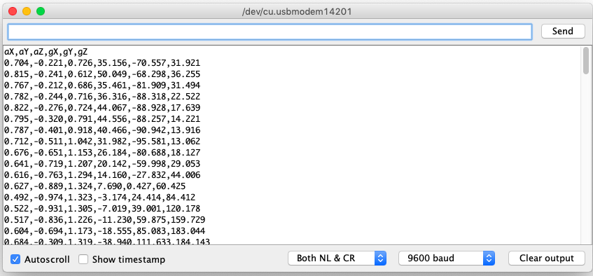

***Linux tip:*** *If you prefer you can redirect the sensor log outputform the Arduino straight to  .csv file on the command line. With the Serial Plotter / Serial MOnitor windows close use: 
```
 $ cat /dev/cu.usbmodem[nnnnn] > sensorlog.csv
```

## Training in TensorFlow
We’re going to use [Google Colab](https://colab.research.google.com/) to train our machine learning model using the data we collected from the Arduino board in the previous section. Colab provides a Jupyter notebook that allows us to run our TensorFlow training in a web browser.

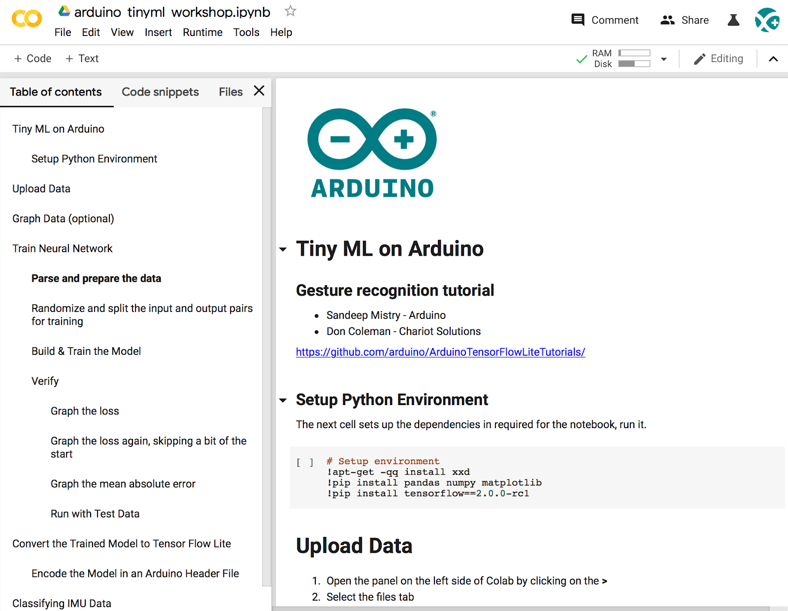


- Set up Python environment
- Upload the punch.csv and flex.csv data 
- Parse and prepare the data
- Build and train the model
- Convert the trained model to TensorFlow Lite
- Encode the model in an Arduino header file

The final step of the colab is generates the model.h file to download and include in our Arduino IDE gesture classifier project in the next section:

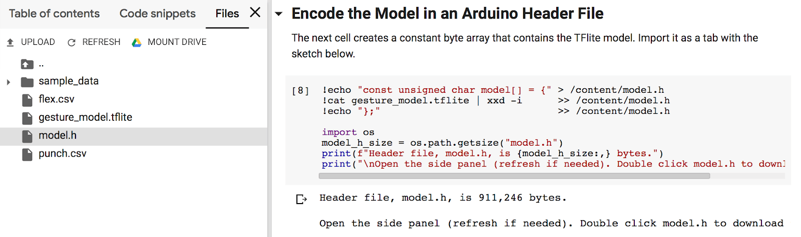

Let’s open the notebook in Colab and run through the steps in the cells – [arduino_tinyml_workshop.ipynb](https://colab.research.google.com/github/arduino/ArduinoTensorFlowLiteTutorials/blob/master/GestureToEmoji/arduino_tinyml_workshop.ipynb)

## Classifying IMU Data
Next we will use model.h file we just trained and downloaded from Colab in the previous section in our Arduino IDE project:

We will be starting a new sketch, you will find the complete code below:
```
/*
  IMU Classifier
  This example uses the on-board IMU to start reading acceleration and gyroscope
  data from on-board IMU, once enough samples are read, it then uses a
  TensorFlow Lite (Micro) model to try to classify the movement as a known gesture.
  Note: The direct use of C/C++ pointers, namespaces, and dynamic memory is generally
        discouraged in Arduino examples, and in the future the TensorFlowLite library
        might change to make the sketch simpler.
  The circuit:
  - Arduino Nano 33 BLE or Arduino Nano 33 BLE Sense Rev2 board.
  Created by Don Coleman, Sandeep Mistry
  Modified by Dominic Pajak, Sandeep Mistry
  This example code is in the public domain.
*/

#include "Arduino_BMI270_BMM150.h"

#include <TensorFlowLite.h>
#include <tensorflow/lite/micro/all_ops_resolver.h>
#include <tensorflow/lite/micro/micro_error_reporter.h>
#include <tensorflow/lite/micro/micro_interpreter.h>
#include <tensorflow/lite/schema/schema_generated.h>
#include <tensorflow/lite/version.h>

#include "model.h"

const float accelerationThreshold = 2.5; // threshold of significant in G's
const int numSamples = 119;

int samplesRead = numSamples;

// global variables used for TensorFlow Lite (Micro)
tflite::MicroErrorReporter tflErrorReporter;

// pull in all the TFLM ops, you can remove this line and
// only pull in the TFLM ops you need, if would like to reduce
// the compiled size of the sketch.
tflite::AllOpsResolver tflOpsResolver;

const tflite::Model* tflModel = nullptr;
tflite::MicroInterpreter* tflInterpreter = nullptr;
TfLiteTensor* tflInputTensor = nullptr;
TfLiteTensor* tflOutputTensor = nullptr;

// Create a static memory buffer for TFLM, the size may need to
// be adjusted based on the model you are using
constexpr int tensorArenaSize = 8 * 1024;
byte tensorArena[tensorArenaSize] __attribute__((aligned(16)));

// array to map gesture index to a name
const char* GESTURES[] = {
  "punch",
  "flex"
};

#define NUM_GESTURES (sizeof(GESTURES) / sizeof(GESTURES[0]))

void setup() {
  Serial.begin(9600);
  while (!Serial);

  // initialize the IMU
  if (!IMU.begin()) {
    Serial.println("Failed to initialize IMU!");
    while (1);
  }

  // print out the samples rates of the IMUs
  Serial.print("Accelerometer sample rate = ");
  Serial.print(IMU.accelerationSampleRate());
  Serial.println(" Hz");
  Serial.print("Gyroscope sample rate = ");
  Serial.print(IMU.gyroscopeSampleRate());
  Serial.println(" Hz");

  Serial.println();

  // get the TFL representation of the model byte array
  tflModel = tflite::GetModel(model);
  if (tflModel->version() != TFLITE_SCHEMA_VERSION) {
    Serial.println("Model schema mismatch!");
    while (1);
  }

  // Create an interpreter to run the model
  tflInterpreter = new tflite::MicroInterpreter(tflModel, tflOpsResolver, tensorArena, tensorArenaSize, &tflErrorReporter);

  // Allocate memory for the model's input and output tensors
  tflInterpreter->AllocateTensors();

  // Get pointers for the model's input and output tensors
  tflInputTensor = tflInterpreter->input(0);
  tflOutputTensor = tflInterpreter->output(0);
}

void loop() {
  float aX, aY, aZ, gX, gY, gZ;

  // wait for significant motion
  while (samplesRead == numSamples) {
    if (IMU.accelerationAvailable()) {
      // read the acceleration data
      IMU.readAcceleration(aX, aY, aZ);

      // sum up the absolutes
      float aSum = fabs(aX) + fabs(aY) + fabs(aZ);

      // check if it's above the threshold
      if (aSum >= accelerationThreshold) {
        // reset the sample read count
        samplesRead = 0;
        break;
      }
    }
  }

  // check if the all the required samples have been read since
  // the last time the significant motion was detected
  while (samplesRead < numSamples) {
    // check if new acceleration AND gyroscope data is available
    if (IMU.accelerationAvailable() && IMU.gyroscopeAvailable()) {
      // read the acceleration and gyroscope data
      IMU.readAcceleration(aX, aY, aZ);
      IMU.readGyroscope(gX, gY, gZ);

      // normalize the IMU data between 0 to 1 and store in the model's
      // input tensor
      tflInputTensor->data.f[samplesRead * 6 + 0] = (aX + 4.0) / 8.0;
      tflInputTensor->data.f[samplesRead * 6 + 1] = (aY + 4.0) / 8.0;
      tflInputTensor->data.f[samplesRead * 6 + 2] = (aZ + 4.0) / 8.0;
      tflInputTensor->data.f[samplesRead * 6 + 3] = (gX + 2000.0) / 4000.0;
      tflInputTensor->data.f[samplesRead * 6 + 4] = (gY + 2000.0) / 4000.0;
      tflInputTensor->data.f[samplesRead * 6 + 5] = (gZ + 2000.0) / 4000.0;

      samplesRead++;

      if (samplesRead == numSamples) {
        // Run inferencing
        TfLiteStatus invokeStatus = tflInterpreter->Invoke();
        if (invokeStatus != kTfLiteOk) {
          Serial.println("Invoke failed!");
          while (1);
          return;
        }

        // Loop through the output tensor values from the model
        for (int i = 0; i < NUM_GESTURES; i++) {
          Serial.print(GESTURES[i]);
          Serial.print(": ");
          Serial.println(tflOutputTensor->data.f[i], 6);
        }
        Serial.println();
      }
    }
  }
}
```

- Create a new tab in the IDE. When asked name it model.h
- Open the model.h tab and paste in the version you downloaded from Colab

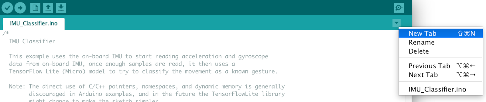

- Upload the sketch: Sketch > Upload
- Open the Serial Monitor: Tools > Serial Monitor
- Perform some gestures
- The confidence of each gesture will be printed to the Serial Monitor (0 = low confidence, 1 =  high confidence)
- Congratulations you’ve just trained your first ML application for Arduino!

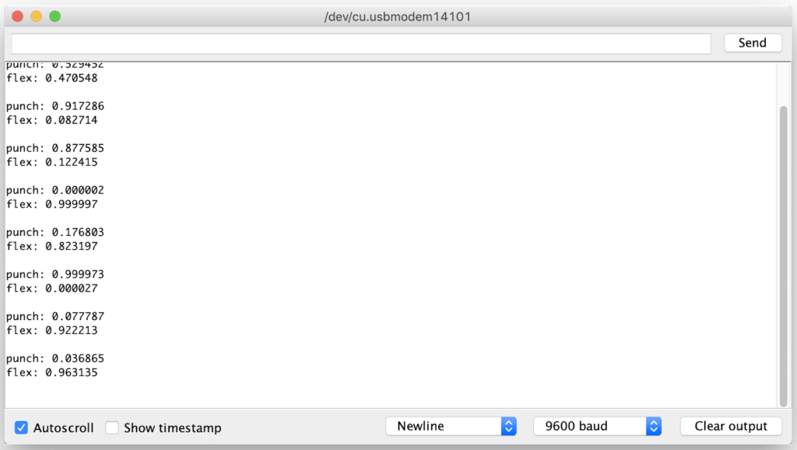

For added fun the [Emoji_Button.ino](https://github.com/arduino/ArduinoTensorFlowLiteTutorials/blob/master/GestureToEmoji/ArduinoSketches/Emoji_Button/Emoji_Button.ino) example shows how to create a USB keyboard that prints an emoji character in Linux and macOS. Try combining the [Emoji_Button.ino](https://github.com/arduino/ArduinoTensorFlowLiteTutorials/blob/master/GestureToEmoji/ArduinoSketches/Emoji_Button/Emoji_Button.ino) example with the [IMU_Classifier.ino](https://github.com/arduino/ArduinoTensorFlowLiteTutorials/blob/master/GestureToEmoji/ArduinoSketches/IMU_Classifier/IMU_Classifier.ino) sketch to create a gesture controlled emoji keyboard.

## Conclusion
It’s an exciting time with a lot to learn and explore in TinyML. We hope this blog has given you some idea of the potential and a starting point to start applying it in your own projects. Be sure to let us know what you build and [share it](https://create.arduino.cc/projecthub) with the Arduino community.

For a comprehensive background on TinyML and the example applications in this article, we recommend Pete Warden and Daniel Situnayake’s new O’Reilly book “[TinyML: Machine Learning with TensorFlow on Arduino and Ultra-Low Power Microcontrollers](https://www.oreilly.com/library/view/tinyml/9781492052036/).”
