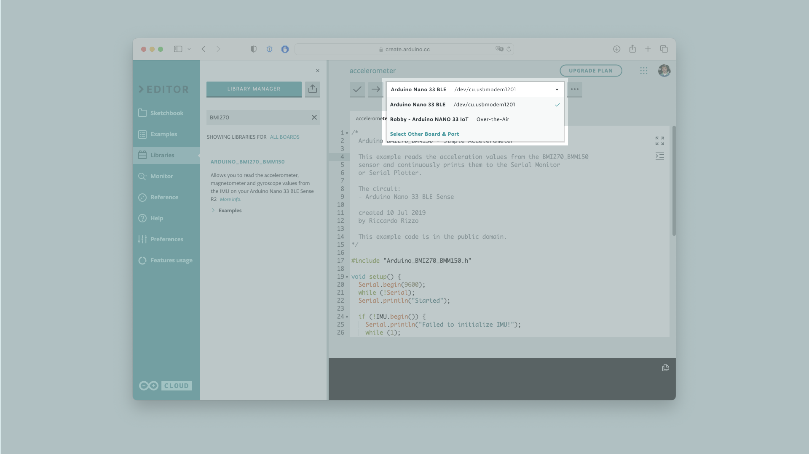

This tutorial will focus on the IMU system with the **BMI270 and BMM150** modules on the Arduino Nano 33 BLE Rev2, to measure the relative position of the board. This will be achieved by utilizing the values of the accelerometer's axes and later printing the return values through the Arduino IDE Serial Monitor.


## Goals

The goals of this project are:
- Understand how the IMU system on the Arduino Nano 33 BLE Rev2 works.
- Use the BMI270_BMM150 library.
- Read the raw data of the accelerometer sensor.
- Convert the raw data into board positions.
- Print out live data through the Serial Monitor.


## Hardware & Software Needed
* This project uses no external sensors or components.
* In this tutorial, we will use the Arduino Create Web Editor to program the board.


## The IMU System on Arduino Nano 33 BLE Rev2

IMU (Inertial Measurement Unit)  is an electronic device that measures and reports a body's specific force, angular rate and the orientation of the body, using a combination of accelerometers, gyroscopes, and oftentimes magnetometers. In this tutorial, we will learn about the IMU system that is included in the Arduino Nano 33 BLE Rev2 Board.


The IMU system on the Arduino Nano 33 BLE Rev2 is a combination of two modules, the 6-axis BMI270, and the 3-axis BMM150, that together add up to a combined 9-axis IMU system that can measure acceleration, as well as rotation and magnetic fields all in 3D space.


### The BMI270_BMM150 Library
The Arduino BMI270_BMM150 library allows us to use the Arduino Nano 33 BLE Rev2 IMU system without having to go into complicated programming. The library takes care of the sensor initialization and sets its values as follows:

- **Accelerometer** range is set at [-4, +4]g -/+0.122 mg.
- **Gyroscope** range is set at [-2000, +2000] dps +/-70 mdps.
- **Magnetometer** range is set at [-400, +400] uT +/-0.014 uT.
- **Accelerometer** Output data rate is fixed at 104 Hz.
- **Gyroscope** Output data rate is fixed at 104 Hz.
- **Magnetometer** Output data rate is fixed at 20 Hz.

If you want to read more about the sensor modules that make up the IMU system, find the datasheet for the <a href="https://content.arduino.cc/assets/bst-bmi270-ds000.pdf" target="_blank">BMI270</a> and the <a href="https://content.arduino.cc/assets/bst-bmm150-ds001.pdf" target="_blank">BMM150</a> here.


### Accelerometer

An accelerometer is an electromechanical device used to measure acceleration forces. Such forces may be static, like the continuous force of gravity or, as is the case with many mobile devices, dynamic to movement or vibrations.


In this example, we will use the accelerometer as a "level" that will provide information about the position of the board. With this application, we will be able to read the relative position of the board as well as the degrees, by tilting the board up, down, left or right.


## Creating the Program

**1. Setting up**

Let's start by opening the Arduino Web Editor, clicking on the **Libraries** tab and searching for the **BMI270_BMM150** library. Then in **> Examples**, open the **SimpleAccelerometer** sketch and once it opens, rename it as **Accelerometer**.


**2. Connecting the board**

Now, connect the Arduino Nano 33 BLE Rev2 to the computer and make sure that the Web Editor recognizes it, if so, the board and port should appear as shown in the image below. If they don't appear, follow the [instructions](https://create.arduino.cc/getting-started/plugin/welcome) to install the plugin that will allow the Editor to recognize your board.




**3. Printing the relative position**

Now we will need to modify the code on the example, to print the relative position of the board as we move it in different angles.

Let's start by initializing the x, y, and z axes as `float` data types, and the `int degreesX = 0;` and `int degreesY = 0;` variables before the `setup()`.

In the `setup()` we should **remove** the following lines of code:


```arduino
Serial.println();
Serial.println("Acceleration in G's");
Serial.println("X\tY\tZ");
```

Since the raw values of the three axes will not be required, we can remove the lines that will print these. Similarly, we should **remove** the following lines from the `loop()`:


```arduino
Serial.print(x);
Serial.print('\t');
Serial.print(y);
Serial.print('\t');
Serial.println(z);
```

Instead, in the `loop()`  we tell the sensor to begin reading the values for the three axes. In this example we will not be using the readings from the Z axis as it is not required for this application to function, therefore you could remove it.

After the `IMU.readAcceleration` initialization, we add four `if` statements for the board's different positions. The statements will calculate the direction in which the board will be tilting, as well as provide the axe's degree values.

```arduino
if(x > 0.1){
    x = 100*x;
    degreesX = map(x, 0, 97, 0, 90);
    Serial.print("Tilting up ");
    Serial.print(degreesX);
    Serial.println("  degrees");
    }
  if(x < -0.1){
    x = 100*x;
    degreesX = map(x, 0, -100, 0, 90);
    Serial.print("Tilting down ");
    Serial.print(degreesX);
    Serial.println("  degrees");
    }
  if(y > 0.1){
    y = 100*y;
    degreesY = map(y, 0, 97, 0, 90);
    Serial.print("Tilting left ");
    Serial.print(degreesY);
    Serial.println("  degrees");
    }
  if(y < -0.1){
    y = 100*y;
    degreesY = map(y, 0, -100, 0, 90);
    Serial.print("Tilting right ");
    Serial.print(degreesY);
    Serial.println("  degrees");
    }

```

Lastly, we print the values in the serial monitor add a `delay(1000);`.

>**Note:** For the following code to properly work, the board's facing direction and inclination during the initialization of the code, need to be specific. More information will be shared on the "testing it out" section.


**4. Complete code**

If you choose to skip the code-building section, the complete code can be found below:

```arduino
/*
  Arduino BMI270_BMM150 - Simple Accelerometer

  This example reads the acceleration values from the BMI270_BMM150
  sensor and continuously prints them to the Serial Monitor
  or Serial Plotter.

  The circuit:
  - Arduino Nano 33 BLE Rev2

  created 10 Jul 2019
  by Riccardo Rizzo

  This example code is in the public domain.
*/

#include "Arduino_BMI270_BMM150.h"

float x, y, z;
int degreesX = 0;
int degreesY = 0;

void setup() {
  Serial.begin(9600);
  while (!Serial);
  Serial.println("Started");

  if (!IMU.begin()) {
    Serial.println("Failed to initialize IMU!");
    while (1);
  }

  Serial.print("Accelerometer sample rate = ");
  Serial.print(IMU.accelerationSampleRate());
  Serial.println(" Hz");
}

void loop() {
  float x, y, z;

  if (IMU.accelerationAvailable()) {
    IMU.readAcceleration(x, y, z);

if(x > 0.1){
    x = 100*x;
    degreesX = map(x, 0, 97, 0, 90);
    Serial.print("Tilting up ");
    Serial.print(degreesX);
    Serial.println("  degrees");
    }
  if(x < -0.1){
    x = 100*x;
    degreesX = map(x, 0, -100, 0, 90);
    Serial.print("Tilting down ");
    Serial.print(degreesX);
    Serial.println("  degrees");
    }
  if(y > 0.1){
    y = 100*y;
    degreesY = map(y, 0, 97, 0, 90);
    Serial.print("Tilting left ");
    Serial.print(degreesY);
    Serial.println("  degrees");
    }
  if(y < -0.1){
    y = 100*y;
    degreesY = map(y, 0, -100, 0, 90);
    Serial.print("Tilting right ");
    Serial.print(degreesY);
    Serial.println("  degrees");
    }
  }
}

}
```


## Testing It Out

To get a correct reading of the board data, before uploading the sketch to the board hold the board in your hand, from the side of the USB port. The board should be facing up and "pointing" away from you. The image below illustrates the board's position and how it works:


Now, you can verify and upload the sketch to the board and open the Monitor from the menu on the left.  

If you tilt the board upwards, downwards, right or left, you will see the results printing every second according to the direction of your movement!


Here is a screenshot of the sketch returning these values:


### Troubleshoot

Sometimes errors occur, if the code is not working there are some common issues we can troubleshoot:
- Missing a bracket or a semicolon.
- The Arduino board is connected to the wrong port.
- Accidental interruption of cable connection.
- The initial position of the board is not as instructed. In this case, you can refresh the page and try again.


## Conclusion

In this simple tutorial, we learned what an IMU sensor module is, how to use the **BMI270_BMM150** library, and how to use an Arduino Nano 33 BLE Rev2 to get data. Furthermore, we utilized the 3-axis accelerometer sensor, in order to measure and print out the degrees and relative position of the board.
