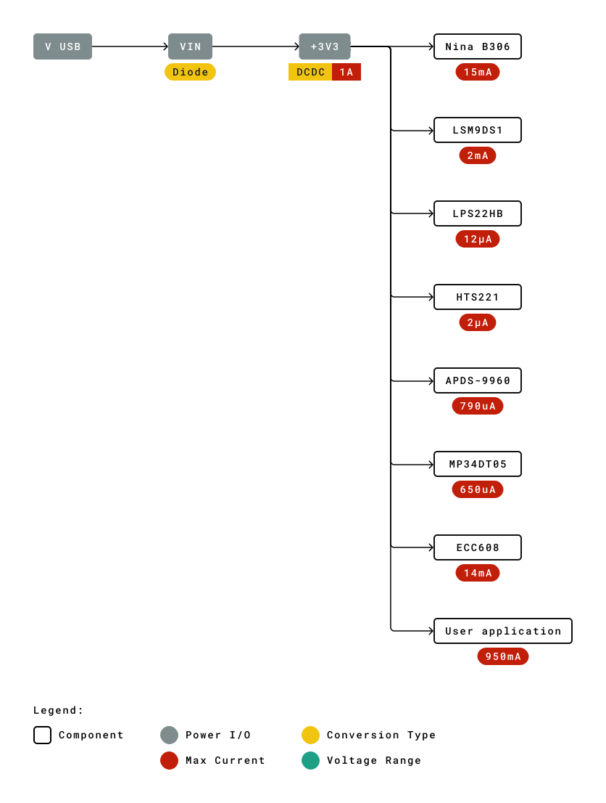
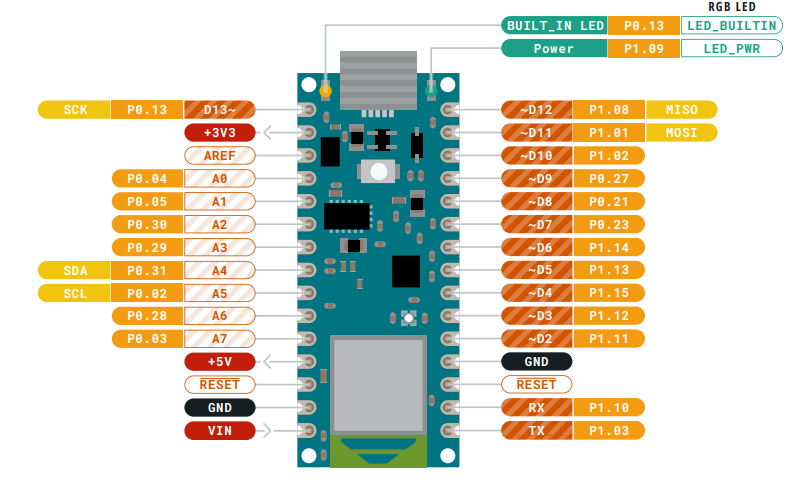
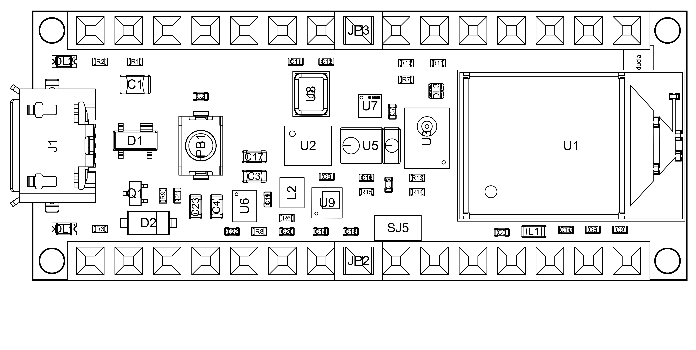

# Description

The Arduino® Nano 33 BLE Sense Rev2 is a miniature sized module containing a NINA B306 module, based on Nordic nRF52480 and containing an Arm® Cortex®-M4F. The BMI270 and BMM150 jointly provide a 9 axis IMU. The module can either be mounted as a DIP component (when mounting pin headers), or as a SMT component, directly soldering it via the castellated pads.

The Nano 33 BLE Sense Rev2 is available in two variants: without headers (SKU: ABX00069) and with headers (SKU: ABX00070).

# Target areas:

Enviromental sensing, Machine Learning

# Contents

## Aplication Examples

**Onboard Sensors for Rapid Prototyping:** Equipped with a wide range of built-in sensors (IMU, microphone, temperature, humidity, pressure, color, and gesture), it lets you test multiple applications without additional hardware.

**AI at the Edge:** Run TinyML models directly on the board to perform tasks such as speech recognition, anomaly detection, or gesture classification locally, without needing cloud connectivity.

**Wireless Communication:** With integrated Bluetooth® Low Energy (BLE), you can seamlessly connect your projects to smartphones, wearables, or other BLE devices for IoT applications.

**Scalable Development:** Start small with sensor demos and grow into complex IoT systems. The familiar Nano form factor ensures compatibility with a wide ecosystem of accessories and community resources.

**Cross-platform Integration:** Its BLE capabilities and sensor suite make it ideal for integrating with mobile apps, cloud dashboards, or wearable devices, enabling quick end-to-end solution development.

## Features
### General Specifications Overview

The Nano 33 BLE Sense Rev2 is an evolution of its predecessor, the Nano 33 BLE and Nano 33 BLE Sense. Where Nano 33 BLE Sense Rev2 continues the legacy.

The board features the standard 14x digital I/O ports, 8x analog channels, dedicated pins for I2C, SPI and UART connections.

| Feature               | Description                                                   |
| --------------------- | ------------------------------------------------------------- |
| Microcontroller       | nRF52480 32-bit Arm® Cortex®-M4                               |
| Frequency             | 64 MHz                                                        |
| Internal Memory       | 256 kB RAM / 1MB flash                                        |
| USB Connectivity      | Micro USB port for power and data                             |
| Power                 | Input voltage (VIN): 5-18 V / Power via USB at 5 V            |
| Digital Inputs        | GPIO (21x - All exposed I/O can be used as digital), PWM (5x) |
| Analog Inputs         | 12-bit ADC (8x)                                               |
| Communication         | UART (1x), I2C (1x), SPI (1x)                                 |
| Dimensions            | 18 mm x 45 mm                                                 |
| Operating Temperature | -40 °C to +85 °C                                              |

### Microcontroller

The Nano 33 BLE Sense Rev2 is based on the 32-bit **nRF52480** series microcontroller, from Nordic Semiconductor, which uses a 64 MHz Arm® Cortex®-M4 microprocessor.

On the Nano 33 BLE Sense Rev2, the operating voltage is fixed at 3.3 V being compatible with shields, accessories and circuits originally designed for older Nano boards that works with the same operating voltage.

| Component          | Details                              |
| ------------------ | ------------------------------------ |
| nRF52480 Processor | Arm® Cortex®-M4 core at up to 64 MHz |
| Flash Memory       | 1 MB of Flash Memory                 |
| Programming Memory | 256 kB of RAM                        |
| ADC                | Yes (12-bit)                         |
| DAC                | Yes (12-bit)                         |

For more technical details on this microcontroller, visit [Nordic - nRF52480 series official documentation](https://www.nordicsemi.com/Products/nRF52840).

Most of its pins are connected to the external headers, however some are reserved for internal communication with the wireless module and the on-board internal I2C peripherals (IMU and Crypto).

**NOTE**: As opposed to other Arduino Nano boards, pins A4 and A5 have an internal pull up and default to be used as an I2C Bus so usage as analog inputs is not recommended.

### Full speed USB Connector

The Nano 33 BLE Sense Rev2 has one micro USB 2.0 full speed port up to 12 Mbps, used to power and program your board as well as send and receive serial communication.

| Pin | **Function** | **Type**     | **Description**                                                                        |
|-----|--------------|--------------|----------------------------------------------------------------------------------------|
| 1   | VUSB         | Power        | Power Supply Input. If board is powered via VUSB from header this is an Output **(1)** |
| 2   | D-           | Differential | USB differential data -                                                                |
| 3   | D+           | Differential | USB differential data +                                                                |
| 4   | ID           | Analog       | Selects Host/Device functionality                                                      |
| 5   | GND          | Power        | Power Ground                                                                           |

### Digital Analog Converter (DAC)

The Nano 33 BLE Sense Rev2 has a DAC with up to 12-bit resolution attached to the A0 analog pin. A DAC is used to convert a digital signal to an analog signal.

### Board Actuators

The Nano R4 features an RGB LED and single color built-in LED, both can be controlled through the Nano 33 BLE Sense Rev2 GPIOs. See the [pinout](#pinout) section for a detailed overview.

### Related Products

- Arduino Screw Terminal Adapter (ASX00037)
- Arduino Connector Carrier (ASX00061)

## Ratings

#### Recommended Operating Conditions

The table below provides a guideline for the optimal use of the Nano 33 BLE Sense Rev2 board, outlining typical operating conditions and design limits. The operating conditions of the Nano 33 BLE Sense Rev2 are largely a function based on its component's specifications.

|    **Symbol**   |        **Description**        | **Min** | **Typ** | **Max** | **Unit** |
|:---------------:|:-----------------------------:|:-------:|:-------:|:-------:|:--------:|
|  VIN |    Input voltage (VIN pin)    |   5.0   |   7.0   |   18.0  |    VDC   |
| VUSB | Input voltage (USB connector) |   4.8   |   5.0   |   5.5   |    VDC   |
|  TOP |     Operating temperature     |   -40   |    25   |    85   |    °C    |

<strong>Note:</strong> VDD Nano 33 BLE Sense Rev2 only supports 3.3V I/Os and is **NOT** 5V tolerant so please make sure you are not directly connecting 5V signals to this board or it will be damaged. Also, as opposed to Arduino Nano boards that support 5V operation, the 5V pin does NOT supply voltage but is rather connected, through a jumper, to the USB power input.

### Power Options

Power can either be supplied via the VIN pin, or via the micro USB connector. If power is supplied via VIN, the MP2322GQH buck converter steps the voltage down to 3.3 V.

When using the 3V3 pin to power external peripherals, notice that above 150 mA the board may become very hot due to LDO regulator functioning basis.

 

#### Power Tree

The board can be powered via USB connector, VIN or VUSB pins on headers. The following diagram illustartes the Nano 33 BLE Sense Rev2 main system power architecture.

**NOTE:** Since VUSB feeds VIN via a Schottky diode and a DC-DC regulator specified minimum input voltage is 4.5V the minimum supply voltage from USB has to be increased to a voltage in the range between 4.8V to 4.96V depending on the current being drawn.

## Functional Overview

### Pinout

The Nano breakout connectors pinout is shown in the following figure.

#### Headers

The board exposes two 15 pin connectors which can either be assembled with pin headers or soldered through castellated vias.

| Pin | **Function** | **Type**     | **Description**                                                                     |
|-----|--------------|--------------|-------------------------------------------------------------------------------------|
| 1   | D13          | Digital      | GPIO                                                                                |
| 2   | +3V3         | Power Out    | Internally generated power output to external devices                               |
| 3   | AREF         | Analog       | Analog Reference; can be used as GPIO                                               |
| 4   | A0/DAC0      | Analog       | ADC in/DAC out; can be used as GPIO                                                 |
| 5   | A1           | Analog       | ADC in; can be used as GPIO                                                         |
| 6   | A2           | Analog       | ADC in; can be used as GPIO                                                         |
| 7   | A3           | Analog       | ADC in; can be used as GPIO                                                         |
| 8   | A4/SDA       | Analog       | ADC in; I2C SDA; Can be used as GPIO **(1)**                                        |
| 9   | A5/SCL       | Analog       | ADC in; I2C SCL; Can be used as GPIO **(1)**                                        |
| 10  | A6           | Analog       | ADC in; can be used as GPIO                                                         |
| 11  | A7           | Analog       | ADC in; can be used as GPIO                                                         |
| 12  | VUSB         | Power In/Out | Normally NC; can be connected to VUSB pin of the USB connector by shorting a jumper |
| 13  | RST          | Digital In   | Active low reset input (duplicate of pin 18)                                        |
| 14  | GND          | Power        | Power Ground                                                                        |
| 15  | VIN          | Power In     | Vin Power input                                                                     |
| 16  | TX           | Digital      | USART TX; can be used as GPIO                                                       |
| 17  | RX           | Digital      | USART RX; can be used as GPIO                                                       |
| 18  | RST          | Digital      | Active low reset input (duplicate of pin 13)                                        |
| 19  | GND          | Power        | Power Ground                                                                        |
| 20  | D2           | Digital      | GPIO                                                                                |
| 21  | D3/PWM       | Digital      | GPIO; can be used as PWM                                                            |
| 22  | D4           | Digital      | GPIO                                                                                |
| 23  | D5/PWM       | Digital      | GPIO; can be used as PWM                                                            |
| 24  | D6/PWM       | Digital      | GPIO, can be used as PWM                                                            |
| 25  | D7           | Digital      | GPIO                                                                                |
| 26  | D8           | Digital      | GPIO                                                                                |
| 27  | D9/PWM       | Digital      | GPIO; can be used as PWM                                                            |
| 28  | D10/PWM      | Digital      | GPIO; can be used as PWM                                                            |
| 29  | D11/MOSI     | Digital      | SPI MOSI; can be used as GPIO                                                       |
| 30  | D12/MISO     | Digital      | SPI MISO; can be used as GPIO                                                       |

#### Debug

On the bottom side of the board, under the communication module, debug signals are arranged as 3x2 test pads with 100 mil pitch with pin 4 removed. Pin 1 is depicted in Figure 3 – Connector Positions

| Pin | **Function** | **Type**   | **Description**                                                   |
|-----|--------------|------------|-------------------------------------------------------------------|
| 1   | +3V3         | Power Out  | Internally generated power output to be used as voltage reference |
| 2   | SWD          | Digital    | nRF52480 Single Wire Debug Data                                   |
| 3   | SWCLK        | Digital In | nRF52480 Single Wire Debug Clock                                  |
| 5   | GND          | Power      | Power Ground                                                      |
| 6   | RST          | Digital In | Active low reset input                                            |

### Board Topology

Top:

| **Ref.** | **Description**                                   | **Ref.** | **Description**                  |
| -------- | ------------------------------------------------- | -------- | -------------------------------- |
| U1       | NINA-B306 Module Bluetooth® Low Energy 5.0 Module | U6       | MP2322GQH Step Down Converter    |
| U2       | BMI270 Sensor IMU                                 | PB1      | IT-1185AP1C-160G-GTR Push button |
| U3       | MP34DT06JTR MEMS Microphone                       | U8       | HS3003 Humidity Sensor           |
| U7       | BMM150 Magnetometer IC                            | DL1      | Led L                            |
| U5       | APDS-9660 Ambient Module                          | DL2      | Led Power                        |
| U9       | LPS22HBTR Pressure Sensor IC                      |          |                                  |

Bottom:

| **Ref.** | **Description** | **Ref.** | **Description** |
|----------|-----------------|----------|-----------------|
| SJ1      | VUSB Jumper     | SJ2      | D7 Jumper       |
| SJ3      | 3v3 Jumper      | SJ4      | D8 Jumper       |

### IMU

The Nano 33 BLE Sense Rev2 provides IMU capabilities with 9-axis, by combination of the BMI270 and BMM150 ICs. The BMI270 includes both a three axis gyroscope as well as an three axis accelerometer, while the BMM150 is capable of sensing magnetic field variations in all three dimensions. The information obtained can be used for measuring raw movement parameters as well as for machine learning.

### LPS22HB (U9) Barometer and Temperature Sensor

The LPS22HB pressure sensor IC (U9) includes both a piezoresistive absolute pressure sensor together with a temperature sensor integrated into a small chip. The pressure sensor (U9) interfaces with the main microcontroller (U1) via an I2C interface. The sensing element is composed of a micromachined suspended membrane for measuring absolute pressure, and includes a Wheatstone bridge internally for measuring the the piezoresistive elements. The temperature perturbations are compensated via an included temperature sensor on-chip. The absolute pressure can range from 260 to 1260 hPa. Pressure data can be polled via I2C at up to 24-bits, while temperature data can be polled at up to 16-bits.

The Arduino_LPS22HB library provides a ready to use implementation of the I2C protocol with this chip.

### HS3003 (U8) Relative Humidity and Temperature Sensor

The HS3003 (U8) is a MEMS sensors, designed to provide accurate readings of relative humidity and temperature in a small package. Temperature-compensation and calibration is performed on-chip, without requiring external circuitry. The HS3003 can measure the relative humidity from 0% to 100%RH with fast response times (under 4 seconds). The included on-chip temperature sensor (used for compensation) is has a temperature accuracy of ±0.1 °C.

U8 communicates via the main microcontroller via an I2C bus.

#### Gesture Detection

Gesture detection utilizes four directional photodiodes to sense reflected IR energy (sourced by the integrated LED) to convert physical motion information (i.e. velocity, direction and distance) to a digital information. The architecture of the gesture engine features automatic activation (based on Proximity engine results), ambient light subtraction, cross-talk cancellation, dual 8-bit data converters, power saving inter-conversion delay, 32-dataset FIFO, and interrupt driven I2C communication. The gesture engine accommodates a wide range of mobile device gesturing requirements: simple UP-DOWN-RIGHT-LEFT gestures or more complex gestures can be accurately sensed. Power consumption and noise are minimized with adjustable IR LED timing.

#### Proximity Detection

The Proximity detection feature provides distance measurement (E.g. mobile device screen to user’s ear) by photodiode detection of reflected IR energy (sourced by the integrated LED). Detect/release events are interrupt driven, and occur whenever proximity result crosses upper and/ or lower threshold settings. The proximity engine features offset adjustment registers to compensate for system offset caused by unwanted IR energy reflections appearing at the sensor. The IR LED intensity is factory trimmed to eliminate the need for end-equipment calibration due to component variations. Proximity results are further improved by automatic ambient light subtraction.

#### Color and ALS Detection

The Color and ALS detection feature provides red, green, blue and clear light intensity data. Each of the R, G, B, C channels have a UV and IR blocking filter and a dedicated data converter producing16-bit data simultaneously. This architecture allows applications to accurately measure ambient light and sense color which enables devices to calculate color temperature and control display backlight.

### Digital Microphone

The MP34DT06JTR is an ultra-compact, low-power, omnidirectional, digital MEMS microphone built with a capacitive sensing element and an IC interface.

The sensing element, capable of detecting acoustic waves, is manufactured using a specialized silicon micromachining process dedicated to produce audio sensors

## Device Operation

### Getting Started - IDE

If you want to program your Nano 33 BLE Sense Rev2 while offline you need to install the Arduino Desktop IDE [1] To connect the Nano 33 BLE Sense Rev2 to your computer, you’ll need a Micro-B USB cable. This also provides power to the board, as indicated by the LED.

### Getting Started - Arduino Cloud Editor

All Arduino boards, including this one, work out-of-the-box on the Arduino Cloud Editor [2], by just installing a simple plugin.

The Arduino Cloud Editor is hosted online, therefore it will always be up-to-date with the latest features and support for all boards. Follow [3] to start coding on the browser and upload your sketches onto your board.

### Getting Started - Arduino Cloud

All Arduino IoT enabled products are supported on Arduino Cloud which allows you to Log, graph and analyze sensor data, trigger events, and automate your home or business.

### Sample Sketches

Sample sketches for the Nano 33 BLE Sense Rev2 can be found either in the “Examples” menu in the Arduino IDE or in the “Documentation” section of the Arduino Docs website.

### Online Resources

Now that you have gone through the basics of what you can do with the board you can explore the endless possibilities it provides by checking exciting projects on Arduino Project Hub [4], the Arduino Library Reference [5] and the on line store where you will be able to complement your board with sensors, actuators and more.

### Board Recovery

All Arduino boards have a built-in bootloader which allows flashing the board via USB. In case a sketch locks up the processor and the board is not reachable anymore via USB it is possible to enter bootloader mode by double-tapping the reset button right after power up.

## Mechanical Information

### Board Outline and Mounting Holes

The board measures are mixed between metric and imperial. Imperial measures are used to maintain 100 mil pitch grid between pin rows to allow them to fit a breadboard whereas board length is Metric

## Certifications

### Declaration of Conformity CE DoC (EU)

We declare under our sole responsibility that the products above are in conformity with the essential requirements of the following EU Directives and therefore qualify for free movement within markets comprising the European Union (EU) and European Economic Area (EEA).

### Declaration of Conformity to EU RoHS & REACH 211 01/19/2021

Arduino boards are in compliance with RoHS 2 Directive 2011/65/EU of the European Parliament and RoHS 3 Directive 2015/863/EU of the Council of 4 June 2015 on the restriction of the use of certain hazardous substances in electrical and electronic equipment.

| Substance                              | **Maximum limit (ppm)** |
|----------------------------------------|-------------------------|
| Lead (Pb)                              | 1000                    |
| Cadmium (Cd)                           | 100                     |
| Mercury (Hg)                           | 1000                    |
| Hexavalent Chromium (Cr6+)             | 1000                    |
| Poly Brominated Biphenyls (PBB)        | 1000                    |
| Poly Brominated Diphenyl ethers (PBDE) | 1000                    |
| Bis(2-Ethylhexyl} phthalate (DEHP)     | 1000                    |
| Benzyl butyl phthalate (BBP)           | 1000                    |
| Dibutyl phthalate (DBP)                | 1000                    |
| Diisobutyl phthalate (DIBP)            | 1000                    |

Exemptions : No exemptions are claimed.

Arduino Boards are fully compliant with the related requirements of European Union Regulation (EC) 1907 /2006 concerning the Registration, Evaluation, Authorization and Restriction of Chemicals (REACH). We declare none of the SVHCs ([https://echa.europa.eu/web/guest/candidate-list-table](https://echa.europa.eu/web/guest/candidate-list-table)), the Candidate List of Substances of Very High Concern for authorization currently released by ECHA, is present in all products (and also package) in quantities totaling in a concentration equal or above 0.1%. To the best of our knowledge, we also declare that our products do not contain any of the substances listed on the "Authorization List" (Annex XIV of the REACH regulations) and Substances of Very High Concern (SVHC) in any significant amounts as specified by the Annex XVII of Candidate list published by ECHA (European Chemical Agency) 1907 /2006/EC.

### Conflict Minerals Declaration

As a global supplier of electronic and electrical components, Arduino is aware of our obligations with regards to laws and regulations regarding Conflict Minerals, specifically the Dodd-Frank Wall Street Reform and Consumer Protection Act, Section 1502. Arduino does not directly source or process conflict minerals such as Tin, Tantalum, Tungsten, or Gold. Conflict minerals are contained in our products in the form of solder, or as a component in metal alloys. As part of our reasonable due diligence Arduino has contacted component suppliers within our supply chain to verify their continued compliance with the regulations. Based on the information received thus far we declare that our products contain Conflict Minerals sourced from conflict-free areas.

## FCC Caution

Any Changes or modifications not expressly approved by the party responsible for compliance could void the user’s authority to operate the equipment.

This device complies with part 15 of the FCC Rules. Operation is subject to the following two conditions:

(1) This device may not cause harmful interference

 (2) this device must accept any interference received, including interference that may cause undesired operation.

**FCC RF Radiation Exposure Statement:**

1. This Transmitter must not be co-located or operating in conjunction with any other antenna or transmitter.

2. This equipment complies with RF radiation exposure limits set forth for an uncontrolled environment.

3. This equipment should be installed and operated with minimum distance 20cm between the radiator & your body.

English:
User manuals for license-exempt radio apparatus shall contain the following or equivalent notice in a conspicuous location in the user manual or alternatively on the device or both. This device complies with Industry Canada license-exempt RSS standard(s). Operation is subject to the following two conditions:

(1) this device may not cause interference

(2) this device must accept any interference, including interference that may cause undesired operation of the device.

French:
Le présent appareil est conforme aux CNR d’Industrie Canada applicables aux appareils radio exempts de licence. L’exploitation est autorisée aux deux conditions suivantes :

(1) l’ appareil nedoit pas produire de brouillage

(2) l’utilisateur de l’appareil doit accepter tout brouillage radioélectrique subi, même si le brouillage est susceptible d’en compromettre le fonctionnement.

**IC SAR Warning:**

English
This equipment should be installed and operated with minimum distance 20 cm between the radiator and your body.

French:
Lors de l’ installation et de l’ exploitation de ce dispositif, la distance entre le radiateur et le corps est d ’au moins 20 cm.

**Important:** The operating temperature of the EUT can’t exceed 85℃ and shouldn’t be lower than -40℃.

Hereby, Arduino S.r.l. declares that this product is in compliance with essential requirements and other relevant provisions of Directive 2014/53/EU. This product is allowed to be used in all EU member states.

| Frequency bands | Maximum output power (ERP) |
|-----------------|----------------------------|
| 863-870Mhz      | TBD                        |

## Company Information

| Company name    | Arduino S.r.l                           |
|-----------------|-----------------------------------------|
| Company Address | Via Andrea Appiani 25 20900 MONZA Italy |

## Reference Documentation

| Reference                              | **Link**                                                                            |
|---------------------------------------|------------------------------------------------------------------------------------- |
| Arduino IDE (Desktop)                  | https://www.arduino.cc/en/software                                                  |
| Arduino Cloud Editor                   | https://create.arduino.cc/editor                                                    |
| Arduino Cloud Editor - Getting Started | https://docs.arduino.cc/arduino-cloud/guides/editor/                                |
| Arduino Project Hub                    | https://create.arduino.cc/projecthub?by=part&part_id=11332&sort=trending            |
| Library Reference                      | https://www.arduino.cc/reference/en/                                                |
| Forum                                  | https://create.arduino.cc/projecthub/Arduino_Genuino/getting-started-with-arduino-web-editor-4b3e4a |
| Nina B306                              | https://content.u-blox.com/sites/default/files/NINA-B3_DataSheet_UBX-17052099.pdf   |
| Arduino_LPS22HB Library                | https://github.com/arduino-libraries/Arduino_LPS22HB                                |
| Arduino_APDS9960 Library               | https://github.com/arduino-libraries/Arduino_APDS9960                               |

## Revision History

| Date       | **Revision** | **Changes**                           |
|------------|--------------|---------------------------------------|
| 25/04/2024 | 5            | Updated link to new Cloud Editor      |
| 03/05/2023 | 4            | Add SKU for version with headers      |
| 10/11/2022 | 3            | Updated to account for Rev2 changes:  LSM9DS1 -> BMI270+Bmm150, HTS221 -> HS3003, MPM3610 -> MP2322, PCB modification   |
| 03/08/2022 | 2            | Reference documentation links updates |
| 27/04/2021 | 1            | General datasheet updates             |

