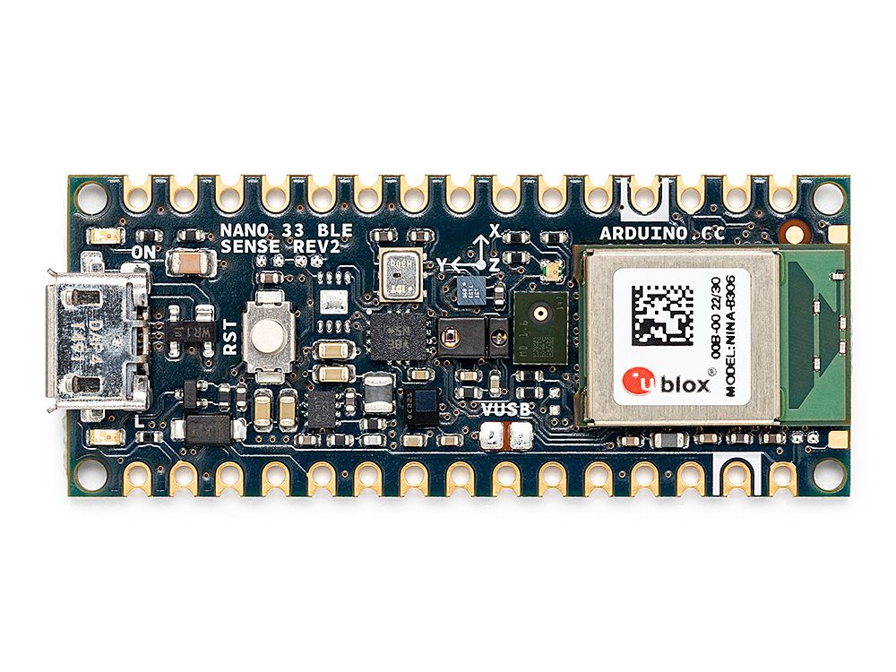
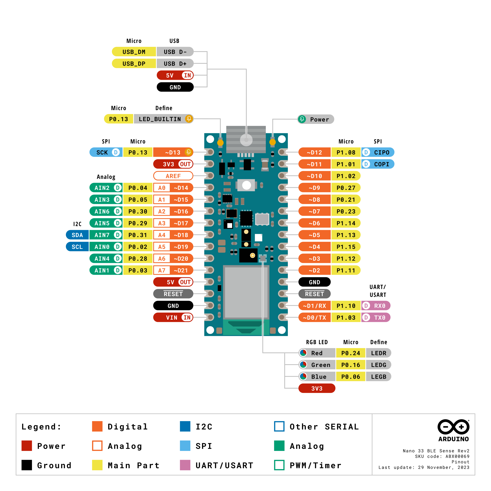
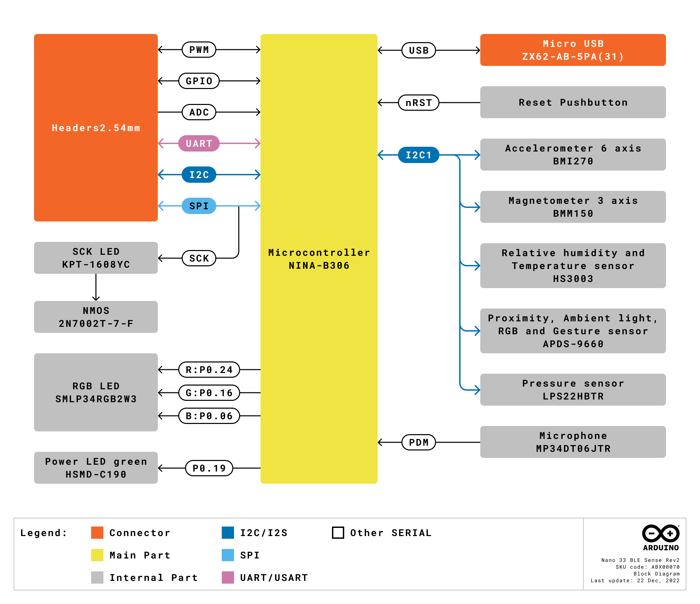
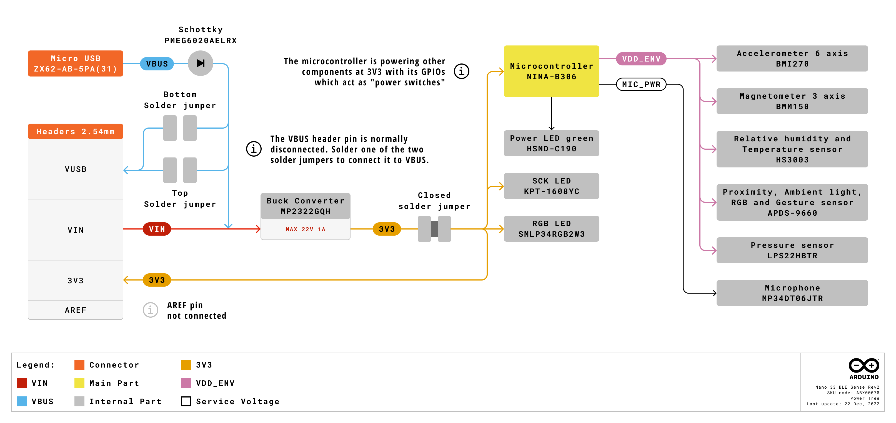

# Description

Experience the power of edge computing with the Arduino® Nano 33 BLE Sense Rev2. This miniature-sized module combines the NINA-B306 module, based on Nordic nRF52840 with an Arm® Cortex®-M4F processor, with an extensive array of onboard sensors. The board integrates a 9-axis IMU (BMI270 and BMM150), environmental sensors, and wireless connectivity, making it ideal for machine learning applications, environmental monitoring, and IoT prototyping within the familiar Arduino ecosystem.

The Nano 33 BLE Sense Rev2 is available in two variants: without headers (SKU: ABX00069) and with headers (SKU: ABX00070).

# Target Areas

Environmental sensing, edge AI, IoT applications

# Contents
## Application Examples

The Arduino Nano 33 BLE Sense Rev2, with its extensive sensor suite and wireless capabilities, provides versatile solutions for various sectors. Below are some application examples that demonstrate its potential:

- **Industrial automation**: The Nano 33 BLE Sense Rev2 enhances industrial processes through intelligent sensing and wireless connectivity, enabling predictive maintenance and environmental monitoring.
  - 
<strong>Predictive maintenance systems</strong>: Deploy the board's IMU and environmental sensors to monitor equipment vibrations, temperature anomalies, and humidity levels, enabling early detection of potential failures in industrial machinery.

  - 
<strong>Workplace safety monitoring</strong>: Use the onboard gas, temperature, and humidity sensors to continuously monitor environmental conditions in industrial facilities, ensuring compliance with safety regulations and worker protection standards.

  - 
<strong>Asset tracking and monitoring</strong>: Leverage the BLE connectivity and motion sensors to track valuable assets and equipment in warehouses and manufacturing facilities, providing real-time location and condition data.

- **Building automation**: In smart building applications, the Nano 33 BLE Sense Rev2 facilitates the creation of intelligent systems that improve comfort, safety, and energy efficiency.
  - 
<strong>Indoor air quality management</strong>: Integrate the board's environmental sensors to monitor CO₂ levels, humidity, and temperature, automatically adjusting HVAC systems to maintain optimal indoor conditions.

  - 
<strong>Gesture-controlled interfaces</strong>: Implement touchless control systems using the APDS-9960 gesture sensor for lighting, doors, and other building systems, enhancing hygiene and user experience.

  - 
<strong>Presence detection and space optimization</strong>: Use the proximity sensor and BLE beacons to track occupancy patterns, optimizing energy usage and space allocation in office buildings.

- **Prototyping**: The Nano 33 BLE Sense Rev2 offers a comprehensive platform for rapid development and testing of IoT and machine learning applications.
  - 
<strong>Edge AI development platform</strong>: With its powerful Arm® Cortex®-M4F processor and sensor array, the board provides an ideal platform for developing and deploying edge AI models for voice recognition, anomaly detection, and gesture classification.

  - 
<strong>Environmental monitoring stations</strong>: Create complete weather and environmental monitoring systems using the integrated temperature, humidity, pressure, and light sensors without additional hardware.

  - 
<strong>Wearable device prototyping</strong>: The compact form factor and BLE connectivity make it perfect for developing fitness trackers, health monitors, and other wearable applications.

## Features
### General Specifications Overview

The Nano 33 BLE Sense Rev2 represents an evolution of the classic Arduino Nano form factor, integrating advanced wireless connectivity and a extensive sensor suite. It features the powerful nRF52840 microcontroller with native USB support and Bluetooth® Low Energy 5.0 capabilities, making it ideal for IoT and machine learning applications at the edge.

The main features are highlighted in the table shown below.

| **Feature**                          | **Description**                                                                                           |
|--------------------------------------|-----------------------------------------------------------------------------------------------------------|
| Microcontroller                      | 64 MHz Arm® Cortex®-M4F (nRF52840)                                                                        |
| Internal Memory                      | 1 MB Flash and 256 kB SRAM                                                                                |
| Power Supply                         | Various options for easily powering the board: USB connector (5V), VIN pin (5-18V), or direct 3.3V supply |
| USB Connectivity                     | Full-speed USB 2.0 (up to 12 Mbps) via micro USB connector                                                |
| Wireless Connectivity                | Bluetooth® Low Energy 5.0 via NINA-B306 module                                                            |
| Digital Peripherals                  | GPIO (21x), PWM (5x), UART (1x), I²C (1x), SPI (1x)                                                       |
| Analog Peripherals                   | 12-bit ADC (8x), 12-bit DAC (1x on A0)                                                                    |
| Onboard 9-axis IMU                   | BMI270 (6-axis accelerometer and gyroscope) + BMM150 (3-axis magnetometer)                                |
| Onboard Environmental Sensors        | HS3003 (humidity and temperature), LPS22HB (pressure and temperature)                                     |
| Onboard Gesture and Proximity Sensor | APDS-9960 (gesture, proximity, ambient light, and RGB color detection)                                    |
| Onboard Digital Microphone           | MP34DT06JTR MEMS microphone                                                                               |
| Onboard LEDs                         | RGB LED and orange LED for user feedback                                                                  |
| Operating Temperature                | -40°C to +85°C                                                                                            |
| Dimensions                           | 18 mm x 45 mm                                                                                             |
| Weight                               | 5 g                                                                                                       |
| Pinout Features                      | Castellated pads allow the board to be surface-mount soldered on a custom carrier                         |

### Accessories

- Arduino Screw Terminal Adapter (SKU: ASX00037)
- Arduino Connector Carrier (SKU: ASX00061)

### Related Products

- Arduino Portenta H7 (SKU: ABX00042)
- Arduino Portenta C33 (SKU: ABX00074)
- Arduino MKR WiFi 1010 (SKU: ABX00023)
- Arduino Nano 33 IoT (SKU: ABX00027)
- Arduino Nano ESP32 (SKU: ABX00092)
- Arduino Nano RP2040 Connect (SKU: ABX00052)
- Arduino UNO R4 WiFi (SKU: ABX00087)

## Ratings

### Recommended Operating Conditions

 The table below provides a guideline for the optimal use of the Nano 33 BLE Sense Rev2, outlining typical operating conditions and design limits. The operating conditions of the Nano 33 BLE Sense Rev2 are largely based on the specifications of its components

|    **Symbol**   |        **Description**        | **Min** | **Typ** | **Max** | **Unit** |
|:---------------:|:-----------------------------:|:-------:|:-------:|:-------:|:--------:|
|  VIN |    Input voltage (VIN pin)    |   5.0   |   7.0   |   18.0  |    VDC   |
| VUSB | Input voltage (USB connector) |   4.8   |   5.0   |   5.5   |    VDC   |
|  TOP |     Operating temperature     |   -40   |    25   |    85   |    °C    |

<strong>Safety Note:</strong> The Nano 33 BLE Sense Rev2 operates at +3.3 VDC and is <strong>NOT +5 VDC tolerant</strong>. Connecting +5 VDC signals directly to any I/O pin will permanently damage the board. Always use level shifters when interfacing with +5 VDC systems.

 
<strong>Power Tip:</strong> When powering external peripherals from the +3.3 VDC pin, limit current draw to 150 mA to prevent overheating of the onboard voltage regulator. For higher current requirements, use an external power supply.

## Functional Overview

The core of the Nano 33 BLE Sense Rev2 is the nRF52840 microcontroller from Nordic Semiconductor, featuring an Arm® Cortex®-M4F processor running at 64 MHz. The board integrates multiple sensors connected via I²C, including environmental sensors, a 9-axis IMU, and a gesture/proximity sensor. Additionally, it features a digital MEMS microphone and wireless connectivity through the NINA-B306 Bluetooth® Low Energy module.

### Pinout

The Nano 33 BLE Sense Rev2 connectors pinout is shown in the figure below.

### Block Diagram

An overview of the high-level architecture of the Nano 33 BLE Sense Rev2 is illustrated in the figure below.

### Power Supply

The Nano 33 BLE Sense Rev2 can be powered through one of the following interfaces:

- **USB connector**: The board can be powered via the micro USB connector with +5 VDC input.
- **VIN pin**: External power supply from +5 VDC to +18 VDC connected to the VIN pin, regulated down to +3.3 VDC by the MP2322GQH buck converter.
- 3.3V pin: Direct 3.3V supply (use with caution, bypasses onboard regulation).
- VUSB pin: 5V from USB can be accessed via the VUSB pin when the jumper SJ1 is closed.

A detailed figure below illustrates the power options available on the Nano 33 BLE Sense Rev2 and the main system power architecture.

<strong>Low-Power Operation Tip:</strong> The nRF52840 supports various low-power modes. Use the <code>ArduinoBLE</code> library's built-in power management features to optimize battery life in portable applications.

<strong>Safety Note:</strong> Since VUSB feeds VIN via a Schottky diode and the DC-DC regulator requires a minimum input of +4.5 VDC, ensure USB supply voltage is between +4.8 VDC and +5.5 VDC for proper operation.

## Device Operation

### Getting Started - IDE

If you want to program your Nano 33 BLE Sense Rev2 offline, install the Arduino Desktop IDE <strong>[1]</strong>. To connect the board to your computer, you will need a micro USB cable. This connection also provides power to the board, as indicated by the power LED.

### Getting Started - Arduino Web Editor

All Arduino devices work out of the box on the Arduino Web Editor <strong>[2]</strong> by simply installing a plugin. The Arduino Web Editor is hosted online, ensuring it is always up-to-date with the latest features and board support. Follow <strong>[3]</strong> to start coding in the browser and upload sketches to your board.

### Getting Started - Arduino Cloud

All Arduino IoT-enabled products are supported on Arduino Cloud, which allows you to log, graph, and analyze sensor data, trigger events, and automate your home or business. Refer to the Getting Started guide <strong>[4]</strong> for detailed instructions.

### Arduino Nano 33 BLE Sense Rev2 Libraries

The board is supported by several dedicated libraries that provide easy access to its onboard sensors and features:

- <code>Arduino_BMI270_BMM150</code>: 9-axis IMU control <strong>[5]</strong>
- <code>Arduino_HS300x</code>: Humidity and temperature sensor <strong>[6]</strong>
- <code>Arduino_LPS22HB</code>: Pressure sensor <strong>[7]</strong>
- <code>Arduino_APDS9960</code>: Gesture, proximity, light, and color sensor <strong>[8]</strong>
- <code>PDM</code>: Digital microphone interface <strong>[9]</strong>
- <code>ArduinoBLE</code>: Bluetooth® Low Energy communication <strong>[10]</strong>

### Sample Sketches

Sample sketches for the Nano 33 BLE Sense Rev2 can be found in the "Examples" menu in the Arduino IDE after installing the required libraries, or in the "Nano 33 BLE Sense Rev2 Documentation" section of the Arduino documentation <strong>[11]</strong>.

### Online Resources

Explore the endless possibilities of your board by checking exciting projects on Arduino Project Hub <strong>[12]</strong>, the Arduino Library Reference <strong>[13]</strong>, and the online store <strong>[14]</strong> where you can complement your Nano 33 BLE Sense Rev2 with additional extensions, sensors, and actuators.

### Board Recovery

All Arduino boards have a built-in bootloader that allows flashing the board via USB. If a sketch locks up the processor and the board becomes unreachable via USB, you can enter bootloader mode by double-tapping the reset button immediately after power-up.

## Mechanical Information

The Nano 33 BLE Sense Rev2 is a double-sided 18 mm x 45 mm board with castellated pads along its edges, allowing it to be used either as a through-hole component (with headers) or as a surface-mount module.

### Board Dimensions

The Nano 33 BLE Sense Rev2 board outline is shown in the figure below; all dimensions are in mm.

The Nano 33 BLE Sense Rev2 features castellated pads along its edges, allowing it to be used as either a through-hole component (with headers) or as a surface-mount module for integration into custom PCBs.

### Board Connectors

The Nano 33 BLE Sense Rev2 exposes two 15-pin headers that can be assembled with pin headers (SKU: ABX00070) or soldered directly via castellated vias (SKU: ABX00069). The headers follow the classic Arduino Nano pinout for compatibility with existing shields and accessories.

### Board Components and Peripherals

The Nano 33 BLE Sense Rev2 features various components on both sides of the board. The top side houses the main processor, wireless module, sensors, and user interfaces (reset button, LEDs), while the bottom side contains debug pads and configuration jumpers.

## Certifications

### Declaration of Conformity CE DoC (EU)

We declare under our sole responsibility that the products above are in conformity with the essential requirements of the following EU Directives and therefore qualify for free movement within markets comprising the European Union (EU) and European Economic Area (EEA).

### Declaration of Conformity to EU RoHS & REACH 211 01/19/2021

Arduino boards are in compliance with RoHS 2 Directive 2011/65/EU of the European Parliament and RoHS 3 Directive 2015/863/EU of the Council of 4 June 2015 on the restriction of the use of certain hazardous substances in electrical and electronic equipment.

| Substance                              | **Maximum limit (ppm)** |
|----------------------------------------|-------------------------|
| Lead (Pb)                              | 1000                    |
| Cadmium (Cd)                           | 100                     |
| Mercury (Hg)                           | 1000                    |
| Hexavalent Chromium (Cr6+)             | 1000                    |
| Poly Brominated Biphenyls (PBB)        | 1000                    |
| Poly Brominated Diphenyl ethers (PBDE) | 1000                    |
| Bis(2-Ethylhexyl} phthalate (DEHP)     | 1000                    |
| Benzyl butyl phthalate (BBP)           | 1000                    |
| Dibutyl phthalate (DBP)                | 1000                    |
| Diisobutyl phthalate (DIBP)            | 1000                    |

Exemptions : No exemptions are claimed.

Arduino Boards are fully compliant with the related requirements of European Union Regulation (EC) 1907/2006 concerning the Registration, Evaluation, Authorization and Restriction of Chemicals (REACH). We declare none of the SVHCs (https://echa.europa.eu/web/guest/candidate-list-table), the Candidate List of Substances of Very High Concern for authorization currently released by ECHA, is present in all products (and also package) in quantities totaling in a concentration equal or above 0.1%. To the best of our knowledge, we also declare that our products do not contain any of the substances listed on the "Authorization List" (Annex XIV of the REACH regulations) and Substances of Very High Concern (SVHC) in any significant amounts as specified by the Annex XVII of Candidate list published by ECHA (European Chemical Agency) 1907/2006/EC.

### Conflict Minerals Declaration

As a global supplier of electronic and electrical components, Arduino is aware of our obligations concerning laws and regulations regarding Conflict Minerals, specifically the Dodd-Frank Wall Street Reform and Consumer Protection Act, Section 1502. Arduino does not directly source or process conflict minerals such as Tin, Tantalum, Tungsten, or Gold. Conflict minerals are contained in our products in the form of solder or as a component in metal alloys. As part of our reasonable due diligence, Arduino has contacted component suppliers within our supply chain to verify their continued compliance with the regulations. Based on the information received thus far, we declare that our products contain Conflict Minerals sourced from conflict-free areas.

## FCC Caution

Any changes or modifications not expressly approved by the party responsible for compliance could void the user’s authority to operate the equipment.

This device complies with part 15 of the FCC Rules. Operation is subject to the following two conditions:

1. This device may not cause harmful interference

2. This device must accept any interference received, including interference that may cause undesired operation.

**FCC RF Radiation Exposure Statement:**

1. This transmitter must not be co-located or operating in conjunction with any other antenna or transmitter.

2. This equipment complies with RF radiation exposure limits set forth for an uncontrolled environment.

3. This equipment should be installed and operated with minimum distance 20cm between the radiator and your body.

English:

User manuals for license-exempt radio apparatus shall contain the following or equivalent notice in a conspicuous location in the user manual or alternatively on the device or both. This device complies with Industry Canada license-exempt RSS standard(s). Operation is subject to the following two conditions:

1. This device may not cause interference

2. This device must accept any interference, including interference that may cause undesired operation of the device.

French:

Le présent appareil est conforme aux CNR d’Industrie Canada applicables aux appareils radio exempts de licence. L’exploitation est autorisée aux deux conditions suivantes:

1. L’ appareil nedoit pas produire de brouillage.

2. L’utilisateur de l’appareil doit accepter tout brouillage radioélectrique subi, même si le brouillage est susceptible d’en compromettre le fonctionnement.

**IC SAR Warning:**

English:

This equipment should be installed and operated with minimum distance 20 cm between the radiator and your body.

French:

Lors de l’ installation et de l’ exploitation de ce dispositif, la distance entre le radiateur et le corps est d ’au moins 20 cm.

<strong>Important:</strong> The operating temperature of the EUT can’t exceed 85℃ and shouldn’t be lower than -40 °C.

Hereby, Arduino S.r.l. declares that this product is in compliance with essential requirements and other relevant provisions of Directive 2014/53/EU. This product is allowed to be used in all EU member states.

| Frequency bands | Maximum output power (ERP) |
|-----------------|----------------------------|
| 863 - 870 MHz   | TBD                        |

## Company Information

| Company name    | Arduino S.r.l                           |
|-----------------|-----------------------------------------|
| Company Address | Via Andrea Appiani 25 20900 MONZA Italy |

## Reference Documentation

| **No.** | **Reference**                        | **Link**                                                                          |
|:-------:|--------------------------------------|-----------------------------------------------------------------------------------|
|    1    | Arduino IDE (Desktop)                | https://www.arduino.cc/en/software                                                |
|    2    | Arduino Web Editor                   | https://create.arduino.cc/editor                                                  |
|    3    | Arduino Web Editor - Getting Started | https://docs.arduino.cc/arduino-cloud/guides/editor/                              |
|    4    | Arduino Cloud - Getting Started      | https://docs.arduino.cc/arduino-cloud/guides/overview/                            |
|    5    | Arduino_BMI270_BMM150 Library        | https://github.com/arduino-libraries/Arduino_BMI270_BMM150                        |
|    6    | Arduino_HS300x Library               | https://github.com/arduino-libraries/Arduino_HS300x                               |
|    7    | Arduino_LPS22HB Library              | https://github.com/arduino-libraries/Arduino_LPS22HB                              |
|    8    | Arduino_APDS9960 Library             | https://github.com/arduino-libraries/Arduino_APDS9960                             |
|    9    | PDM Library                          | https://www.arduino.cc/reference/en/libraries/pdm/                                |
|    10   | ArduinoBLE Library                   | https://www.arduino.cc/reference/en/libraries/arduinoble/                         |
|    11   | Nano 33 BLE Sense Rev2 Documentation | https://docs.arduino.cc/hardware/nano-33-ble-sense-rev2/                          |
|    12   | Arduino Project Hub                  | https://create.arduino.cc/projecthub?by=part&part_id=11332&sort=trending          |
|    13   | Arduino Library Reference            | https://www.arduino.cc/reference/en/                                              |
|    14   | Arduino Online Store                 | https://store.arduino.cc/                                                         |
|    15   | NINA-B306 Datasheet                  | https://content.u-blox.com/sites/default/files/NINA-B3_DataSheet_UBX-17052099.pdf |
|    16   | nRF52840 Documentation               | https://www.nordicsemi.com/Products/nRF52840                                      |

## Revision History

|  **Date**  | **Revision** | **Changes**                                                                                                 |
|:----------:|:------------:|-------------------------------------------------------------------------------------------------------------|
| 25/09/2025 |       6      | Complete datasheet restructuring following Arduino standards                                                |
| 25/04/2024 |       5      | Updated Cloud Editor link                                                                                   |
| 03/05/2023 |       4      | Added SKU for headers version (ABX00070)                                                                    |
| 10/11/2022 |       3      | Hardware revision updates: LSM9DS1 to BMI270+BMM150, HTS221 to HS3003, MPM3610 to MP2322, PCB modifications |
| 03/08/2022 |       2      | Reference documentation link updates                                                                        |
| 27/04/2021 |       1      | First release                                                                                               |