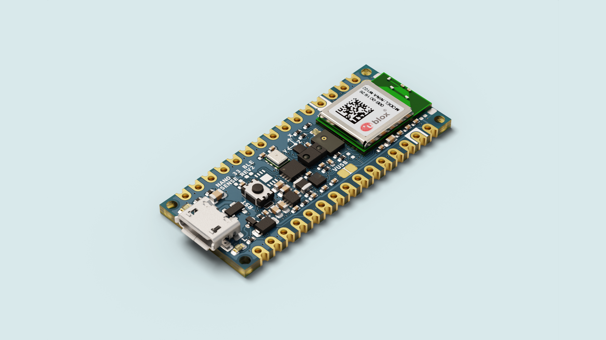
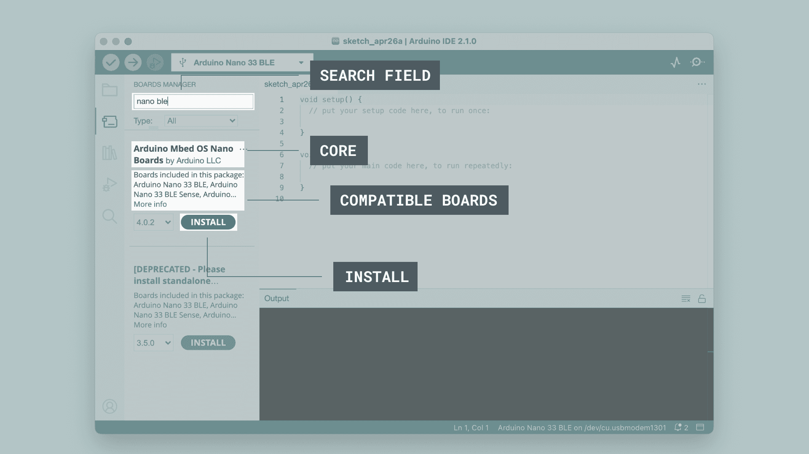
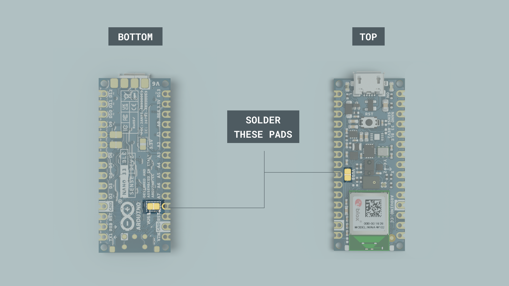

This user manual provides a comprehensive overview of the Nano 33 BLE Sense Rev2 board, highlighting its hardware and software elements. With it, you will learn how to set up, configure and use all the main features of the Nano 33 BLE Sense Rev2.



## Hardware and Software Requirements

### Hardware Requirements

- [Nano 33 BLE Sense Rev2](https://store.arduino.cc/products/nano-33-ble-sense-rev2-with-headers) (x1)
- [USB Micro cable](https://store.arduino.cc/products/usb-2-0-cable-type-a-micro) (x1)

### Software Requirements

- [Arduino IDE 2.0+](https://www.arduino.cc/en/software) or [Arduino Web Editor](https://create.arduino.cc/editor)
- [Arduino MBed OS Nano OS Boards core](https://github.com/arduino/ArduinoCore-mbed)

***The Nano 33 BLE Sense Rev2 is compatible with the complete Arduino ecosystem and can be programmed directly as a standalone device.***

## Nano 33 BLE Sense Rev2 Overview

The Nano 33 BLE Sense Rev2 board combines the microcontroller nRF52840 and a set of sensors with the compact and familiar Nano form factor. This board is designed to facilitate easy prototyping where movement and enviroment sensors are needed.


The Nano 33 BLE Sense Rev2 includes a high-performance 32-bit microcontroller (nRF52840), expanded connectivity with a powerful 2.4 GHz Bluetooth® 5 Low Energy module from u-blox, with an internal antenna. Can be used to transmit data between different devices. Its compact dimensions (18 mm x 45 mm) and robust construction make the Nano 33 BLE Sense Rev2 board an excellent choice for projects that demand sensor fusion capabilities and the computational power of modern microcontrollers.

### Nano 33 BLE Sense Rev2 Architecture Overview

The Arduino Nano 33 BLE Sense Rev2 combines a tiny form factor with multiple environment sensors and the ability to run AI using TinyML and TensorFlow™ Lite. Whether you are creating your first embedded ML application or using Bluetooth® Low Energy to connect your project to your phone, the Nano 33 BLE Sense Rev2 makes that journey simple and accessible.

Here is an overview of the board's main components shown in the images above:

- **Microcontroller**: At the heart of the Nano 33 BLE Sense Rev2 board there is a [Nordic nRF52480](https://docs-be.nordicsemi.com/bundle/ps_nrf52840/attach/nRF52840_PS_v1.11.pdf?_LANG=enus) microcontroller. This single-chip microcontroller is based on a 64 MHz Arm® Cortex®-M4 core with up to 1 MB of flash memory and 256 kB of RAM memory.
- **IMU**: The Arduino Nano 33 BLE Sense Rev2 Inertial Measurement Unit system is made up of two separate IMUs, a 6-axis BMI270 and a 3-axis BMM150, effectively giving you a 9-axis IMU system. This allows you to detect orientation, motion, or vibrations in your project.
- **Proximity and Gesture Detection**: The APDS9960 chip allows for measuring digital proximity and ambient light as well as for detecting RGB colors and gestures.
- **Temperature and Humidity Sensor**: The HS3003 capacitive digital sensor measures relative humidity and temperature. It has a temperature accuracy of ± 0.5 °C (between 15-40 °C) and is thereby perfectly suited to detect ambient temperature.
- **Pressure Sensor**: The LPS22HB picks up on barometric pressure and allows for a 24-bit pressure data output between 260 to 1260 hPa. This data can also be processed to calculate the height above sea level of the current location.
- **Microphone**: The MP34DT06JTR is a compact, low-power omnidirectional digital MEMS microphone with an IC interface. It has a 64 dB signal-to-noise ratio, is capable of sensing acoustic waves and can operate in temperatures of -40 °C to +85 °C.
- **Programmable RGB LED**: The Nano 33 BLE Sense Rev2 board has an onboard user-programmable RGB LED to provide visual feedback about different operating states.
- **User LED**: In addition to the onboard user-programmable RGB LED, the board also includes an additional onboard user-programmable orange LED for basic status indications.
- **Castellated pins**: The board's castellated pins allow surface mounting as a module, facilitating integration into custom hardware designs.
- **Bluetooth**: The Nano 33 BLE Sense Rev2 supports Bluetooth® through the u-blox NINA-B306 module.

### Board Core and Libraries

The **Arduino MBed OS Nano Boards** core contains the libraries and examples to work with the Arduino Nano 33 BLE Sense Rev2's peripherals and onboard components, such as its nRF52480 microcontroller and the onboard RGB LED. To install the core for the Nano 33 BLE Sense Rev2 board, navigate to **Tools > Board > Boards Manager** or click the **Boards Manager** icon in the left tab of the IDE. In the Boards Manager tab, search for `Nano 33 BLE Sense Rev2` and install the latest Arduino Mbed OS Nano Boards version.




The Arduino Nano 33 BLE Sense Rev2 Boards core provides support for the following:

- Board control and configuration (reset, pin configuration and power management)
- Communication interfaces (UART, I²C and SPI)
- Onboard LED control (RGB LED and orange LED)
- HID emulation capabilities (keyboard and mouse)
- Standard Arduino libraries compatibility

***__Important note:__ Since the Nano 33 BLE Sense Rev2 uses the same nRF52840 microcontroller as the Nano 33 BLE family, it shares complete code and library compatibility, making it easy to transition projects between these boards.***


### Pinout


The full pinout is available and downloadable as PDF from the link below:

- [Nano 33 BLE Sense Rev2 pinout](https://docs.arduino.cc/resources/pinouts/ABX00069-full-pinout.pdf)

### Datasheet

The complete datasheet is available and downloadable as PDF from the link below:

- [Nano 33 BLE Sense Rev2 datasheet](https://docs.arduino.cc/resources/datasheets/ABX00069-datasheet.pdf)

### Schematics

The complete schematics are available and downloadable as PDF from the link below:

- [Nano 33 BLE Sense Rev2 schematics](https://docs.arduino.cc/resources/schematics/ABX00069-schematics.pdf)

### CAD Files

The complete CAD files are available and downloadable from the link below:

- [Nano 33 BLE Sense Rev2 STEP files](https://docs.arduino.cc/static/505dd72b2343c79c2d0442e0b7469f3c/ABX00069-cad-files.zip)

## First Use

### Unboxing the Product

When opening the Nano 33 BLE Sense Rev2 box, you will find the board and its corresponding documentation. **The Nano 33 BLE Sense Rev2 does not include additional cables**, so you will need a USB-C cable ([available separately here](https://store.arduino.cc/products/usb-2-0-cable-type-a-micro)) to connect the board to your computer.
 
The Nano 33 BLE Sense Rev2 is a standalone device that can be programmed directly without requiring additional boards. However, for more complex projects, you can easily combine it with Arduino shields compatible with the Nano family.

### Connecting the Board

The Nano 33 BLE Sense Rev2 can be connected to your computer using its onboard micro USB connector. It can also be integrated into larger projects using the following:

- **Direct micro USB connection**: For programming, power supply and serial communication with the computer
- **Pin connection**: For integration into breadboards or custom PCBs
- **Bluetooth connection**: For wireless communication with externak devices
- **Module mounting**: Using the board's castellated pins for direct soldering to PCBs

***__Important note:__ The Nano 33 BLE Sense Rev2 operates at +3.3 VDC natively. When connecting sensors or modules that operate at +5 VDC, make sure to verify voltage compatibility to avoid component damage.***

### 5V Pin

The microcontroller on the Arduino Nano 33 BLE Sense Rev2 runs at 3.3V, which means that you must never apply more than 3.3V to its Digital and Analog pins. Care must be taken when connecting sensors and actuators to assure that this limit of 3.3V is never exceeded. Connecting higher voltage signals, like the 5V commonly used with the other Arduino boards, will damage the Arduino Nano 33 BLE Sense Rev2.

To avoid such risk with existing projects, where you should be able to pull out a Nano and replace it with the new Nano 33 BLE Sense, we have the 5V pin on the header, positioned between RST and A7 that is not connected as default factory setting. This means that if you have a design that takes 5V from that pin, it won't work immediately, as a precaution we put in place to draw your attention to the 3.3V compliance on digital and analog inputs.

5V on that pin is available only when two conditions are met: you make a solder bridge on the two pads marked as VUSB and you power the Nano 33 BLE Sense Rev2 through the USB port. There are two sets of VUSB pads on the Arduino Nano 33 BLE Sense Rev2, one set on the bottom and one set on top. To enable the 5V Pin, either one of these need to be connected. If you power the board from the VIN pin, you won't get any regulated 5V and therefore even if you do the solder bridge, nothing will come out of that 5V pin. The 3.3V, on the other hand, is always available and supports enough current to drive your sensors. Please make your designs so that sensors and actuators are driven with 3.3V and work with 3.3V digital IO levels. 5V is now an option for many modules and 3.3V is becoming the standard voltage for electronic ICs.



### Powering the Board

The Nano 33 BLE Sense Rev2 can be powered in several ways:

- **Via micro USB connector**: The most common method during development and programming
- **Via `VIN` pin**: Using an external +5-18 VDC power supply that will be internally regulated to +5 VDC
- **Via `5V` pin**: Directly connecting a regulated +5 VDC source (with caution)


***__Important note:__ The Nano 33 BLE Sense Rev2's `VIN` pin accepts a voltage range of +5-18 VDC. Do not connect voltages outside this range as you could permanently damage the board. Always verify all the connections before applying power.***

### Hello World Example

Let's program the Nano 33 BLE Sense Rev2 to reproduce the classic `Hello World` example used in the Arduino ecosystem: the `Blink` sketch. We will use this example to verify that the Nano 33 BLE Sense Rev2's connection to the computer works correctly, that the Arduino IDE is properly configured, and that both the board and development environment function as expected.

First, connect your Nano 33 BLE Sense Rev2 to your computer using a micro USB cable, open the Arduino IDE, and make sure that the board is connected correctly. If you are new to the Arduino IDE, please refer to the official Arduino documentation for more detailed information about initial setup. Copy and paste the following example sketch into a new Arduino IDE file:

```arduino
/*
  Blink

  Turns an LED on for one second, then off for one second, repeatedly.

  Most Arduinos have an on-board LED you can control. On the UNO, MEGA and ZERO
  it is attached to digital pin 13, on MKR1000 on pin 6. LED_BUILTIN is set to
  the correct LED pin independent of which board is used.
  If you want to know what pin the on-board LED is connected to on your Arduino
  model, check the Technical Specs of your board at:
  https://docs.arduino.cc/hardware/

  modified 8 May 2014
  by Scott Fitzgerald
  modified 2 Sep 2016
  by Arturo Guadalupi
  modified 8 Sep 2016
  by Colby Newman

  This example code is in the public domain.

  https://docs.arduino.cc/built-in-examples/basics/Blink/
*/

// the setup function runs once when you press reset or power the board
void setup() {
  // initialize digital pin LED_BUILTIN as an output.
  pinMode(LED_BUILTIN, OUTPUT);
}

// the loop function runs over and over again forever
void loop() {
  digitalWrite(LED_BUILTIN, HIGH);  // turn the LED on (HIGH is the voltage level)
  delay(1000);                      // wait for a second
  digitalWrite(LED_BUILTIN, LOW);   // turn the LED off by making the voltage LOW
  delay(1000);                      // wait for a second
}
```

To upload the sketch to the board, click the **Verify** button to compile the sketch and check for errors, then click the **Upload** button to program the device with the sketch.

You should see the built-in orange user LED of your Nano 33 BLE Sense Rev2 board turn on for one second, then turn off for one second, repeating this cycle continuously. 

## Support

If you encounter any issues or have questions while working with your Nano 33 BLE Sense Rev2 board, we provide various support resources to help you find answers and solutions.

### Help Center

Explore our Help Center, which offers a comprehensive collection of articles and guides for Nano family boards. The Help Center is designed to provide in-depth technical assistance and help you make the most of your device.

- [Nano family help center page](https://support.arduino.cc/hc/en-us/sections/360004605400-Nano-Family)

### Forum

Join our community forum to connect with other Nano family board users, share your experiences, and ask questions. The Forum is an excellent place to learn from others, discuss issues, and discover new ideas and projects related to the Nano 33 BLE Sense Rev2.

- [Nano category in the Arduino Forum](https://forum.arduino.cc/c/official-hardware/nano-family/87)

### Contact Us

Please get in touch with our support team if you need personalized assistance or have questions not covered by the help and support resources described before. We're happy to help you with any issues or inquiries about the Nano family boards.

- [Contact us page](https://www.arduino.cc/en/contact-us/)