This user manual provides a comprehensive overview of the Nano 33 BLE Sense Rev2 board, highlighting its hardware and software elements. With it, you will learn how to set up, configure and use all the main features of the Nano 33 BLE Sense Rev2 board.

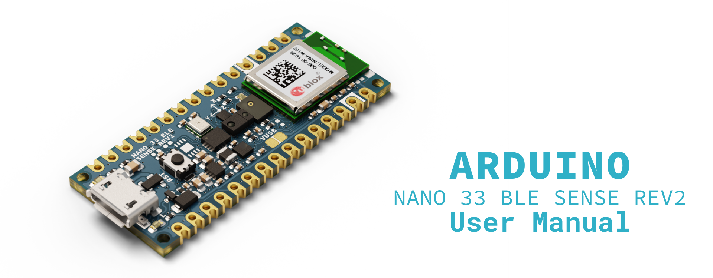

### Hardware Requirements

- [Nano 33 BLE Sense Rev2](https://store.arduino.cc/products/nano-33-ble-sense-rev2-with-headers) (x1)
- [USB Micro cable](https://store.arduino.cc/products/usb-2-0-cable-type-a-micro) (x1)
- [Breadboard](https://store.arduino.cc/products/breadboard-400-contacts) (x1) (recommended)
- [Male/male jumper wires](https://store.arduino.cc/products/jumper-wires) (recommended)

### Software Requirements

- [Arduino IDE 2.0+](https://www.arduino.cc/en/software) or [Arduino Web Editor](https://create.arduino.cc/editor)
- [Arduino Mbed OS Nano Boards core](https://github.com/arduino/ArduinoCore-mbed)

***The Nano 33 BLE Sense Rev2 is compatible with the complete Arduino ecosystem and can be programmed directly as a standalone device.***

## Nano 33 BLE Sense Rev2 Overview

The Nano 33 BLE Sense Rev2 board represents an evolution in the Nano family, combining the powerful nRF52840 microcontroller from Nordic Semiconductor with an extensive array of onboard sensors in the compact and familiar Nano form factor. This board is designed to facilitate rapid prototyping of IoT applications, machine learning projects, and sensor-based systems that require Bluetooth® Low Energy connectivity.

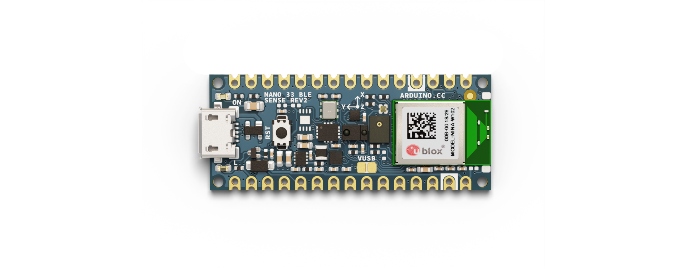

The Nano 33 BLE Sense Rev2 includes a high-performance 32-bit microcontroller (nRF52840), expanded connectivity through Bluetooth® 5 Low Energy, and an extensive sensor suite including a 9-axis IMU, environmental sensors, and a digital microphone. Its compact dimensions (18 mm x 45 mm) and robust construction make this board an excellent choice for wearable devices, environmental monitoring stations, and edge AI applications.

### Nano 33 BLE Sense Rev2 Architecture Overview

The Nano 33 BLE Sense Rev2 board features a secure, certified and feature-rich design that suits various applications, from environmental monitoring and motion detection to machine learning inference and wireless sensor networks.

The top view of the Nano 33 BLE Sense Rev2 board is shown in the image below:

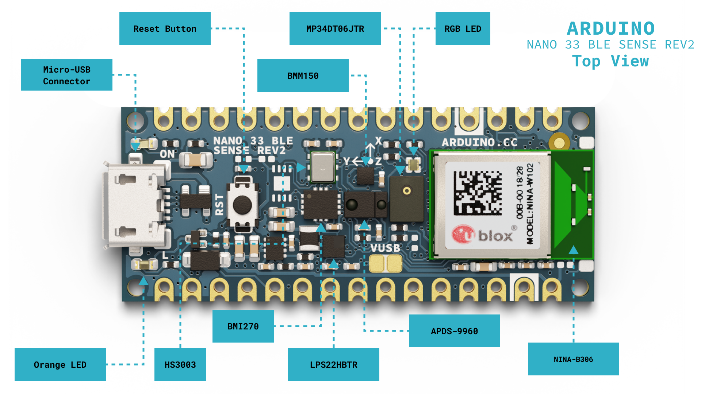

The bottom view of the Nano 33 BLE Sense Rev2 board is shown in the image below:

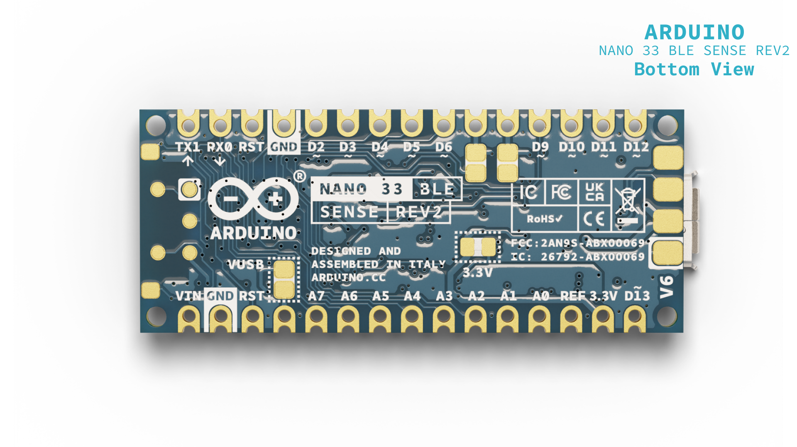

***The bottom side of the Nano 33 BLE Sense Rev2 board features the VUSB jumper pads for enabling the `5V` pin, along with the board's certification markings and identification information (board model and SKU).***

Here is an overview of the board's main components shown in the images above:

- **Microcontroller**: At the heart of the Nano 33 BLE Sense Rev2 board there is a Nordic Semiconductor nRF52840 ([nRF52840 datasheet](https://docs.nordicsemi.com/bundle/ps_nrf52840/page/keyfeatures_html5.html)). This single-chip microcontroller is based on a 64 MHz Arm® Cortex®-M4 core with FPU, featuring 1 MB of flash memory and 256 KB of SRAM memory.
- **Wireless Connectivity**: The board features integrated Bluetooth® 5 Low Energy connectivity through the [u-blox NINA-B306](https://content.u-blox.com/sites/default/files/NINA-B3_DataSheet_UBX-17052099.pdf?utm_content=UBX-17052099) module, enabling wireless communication with smartphones, tablets, and other Bluetooth-enabled devices with an effective range of up to 100 meters in open space.
- **9-axis IMU System**: The board integrates a sophisticated Inertial Measurement Unit consisting of the [BMI270](https://www.bosch-sensortec.com/media/boschsensortec/downloads/datasheets/bst-bmi270-ds000.pdf) 6-axis accelerometer/gyroscope and the [BMM150](https://www.bosch-sensortec.com/media/boschsensortec/downloads/datasheets/bst-bmm150-ds001.pdf) 3-axis magnetometer, providing precise motion tracking and orientation sensing capabilities.
- **Environmental Sensors**: The Nano 33 BLE Sense Rev2 includes multiple environmental sensors. The [HS3003](https://mm.digikey.com/Volume0/opasdata/d220001/medias/docus/2551/HS300x_4-9-21.pdf) provides temperature and humidity sensing with ±0.5°C and ±3.5% RH accuracy. The [LPS22HB](https://www.st.com/content/ccc/resource/technical/document/datasheet/bf/c1/4f/23/61/17/44/8a/DM00140895.pdf/files/DM00140895.pdf/jcr:content/translations/en.DM00140895.pdf) barometric pressure sensor enables altitude estimation and weather monitoring. The [APDS-9960](https://docs.broadcom.com/doc/AV02-4191EN) offers proximity, ambient light, RGB color, and gesture detection capabilities in a single package.
- **Digital Microphone**: The [MP34DT06JTR](https://www.st.com/resource/en/datasheet/mp34dt06j.pdf) omnidirectional MEMS microphone enables audio sensing applications with a 64 dB signal-to-noise ratio and -26 dBFS sensitivity.
- **USB Micro Connector**: The Nano 33 BLE Sense Rev2 features a USB Micro-B connector for programming, power supply, and serial communication with external devices.
- **Programmable RGB LED**: The board has an onboard user-programmable RGB LED to provide visual feedback about different operating states and sensor readings.
- **User LED**: In addition to the onboard user-programmable RGB LED, the board also includes an additional onboard user-programmable orange LED for basic status indications.
- **Castellated Pins**: The board's castellated pins allow surface mounting as a module, facilitating integration into custom PCB designs for production-ready applications.

### Board Core and Libraries

The **Arduino Mbed OS Nano Boards** core contains the libraries and examples to work with the Arduino Nano 33 BLE Sense Rev2's peripherals and onboard components. This comprehensive package includes support for the nRF52840 microcontroller, all onboard sensors, Bluetooth® Low Energy communication, and the programmable LEDs.

To install the core for the Nano 33 BLE Sense Rev2 board, navigate to **Tools > Board > Boards Manager** or click the **Boards Manager** icon in the left tab of the IDE. In the Boards Manager tab, search for `Arduino Mbed OS Nano` and install the latest version.

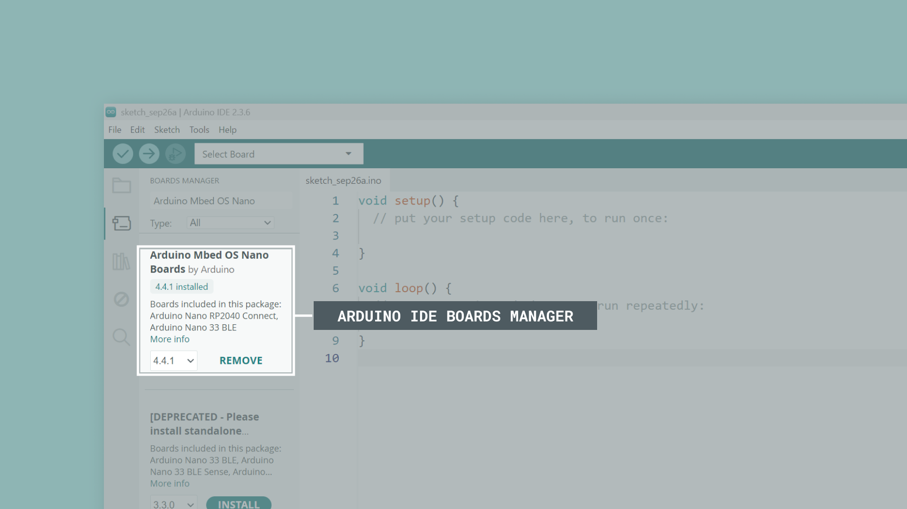

The Arduino Mbed OS Nano Boards core provides support for the following:

- **Board Control and Configuration**: Reset functionality, pin configuration, and power management through Mbed OS
- **Communication Interfaces**: UART, I²C, SPI, and PDM (Pulse Density Modulation) for microphone
- **Onboard LED Control**: RGB LED and orange LED control with PWM support
- **USB HID Capabilities**: Keyboard and mouse emulation through PluggableUSBHID library
- **Bluetooth® Low Energy**: Through the ArduinoBLE library (installed separately)
- **Real-Time Operating System**: Mbed OS RTOS features including threads and semaphores
- **Standard Arduino Libraries**: Full compatibility with Arduino API and functions

***__Important note:__ Sensor libraries for the onboard sensors (`BMI270_BMM150`, `Arduino_HS300x`, `Arduino_APDS9960`, `Arduino_LPS22HB`) must be installed separately through the Arduino IDE Library Manager. __They are not included in the core itself__.***

### Pinout

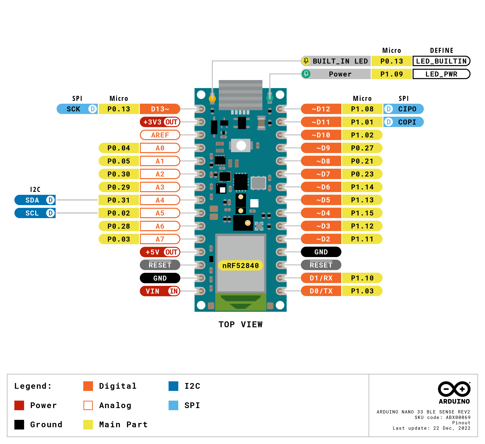

The full pinout is available and downloadable as PDF from the link below:

- [Nano 33 BLE Sense Rev2 pinout](https://docs.arduino.cc/resources/pinouts/ABX00069-full-pinout.pdf)

### Datasheet

The complete datasheet is available and downloadable as PDF from the link below:

- [Nano 33 BLE Sense Rev2 datasheet](https://docs.arduino.cc/resources/datasheets/ABX00069-datasheet.pdf)

### Schematics

The complete schematics are available and downloadable as PDF from the link below:

- [Nano 33 BLE Sense Rev2 schematics](https://docs.arduino.cc/resources/schematics/ABX00069-schematics.pdf)

### STEP Files

The complete STEP files are available and downloadable from the link below:

- [Nano 33 BLE Sense Rev2 STEP files](https://docs.arduino.cc/static/505dd72b2343c79c2d0442e0b7469f3c/ABX00069-step-files.zip)

## First Use

### Unboxing the Product

When opening the Nano 33 BLE Sense Rev2 box, you will find the board and its corresponding documentation. **The Nano 33 BLE Sense Rev2 does not include additional cables**, so you will need a USB Micro cable ([available separately here](https://store.arduino.cc/products/usb-2-0-cable-type-a-micro)) to connect the board to your computer.

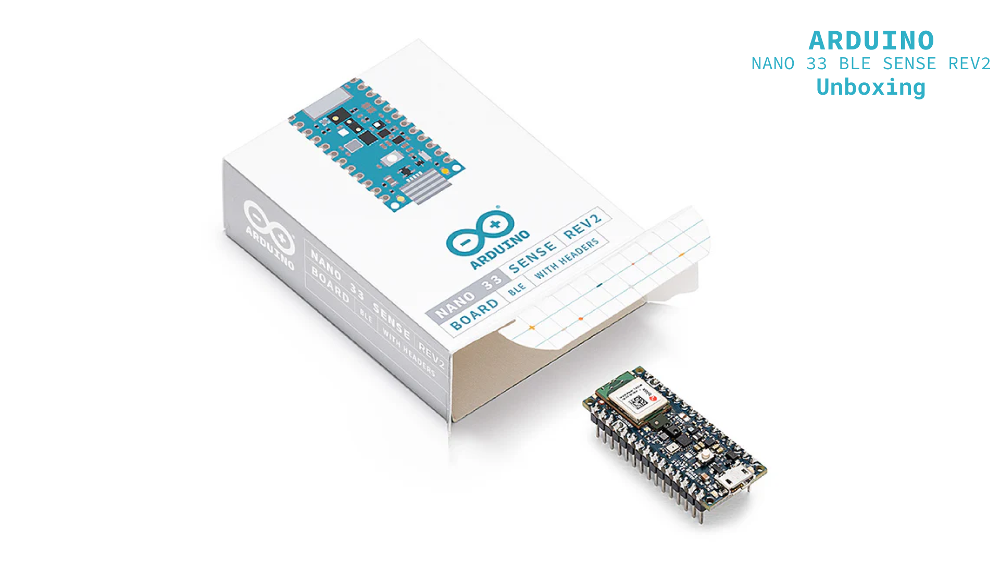

The Nano 33 BLE Sense Rev2 is a standalone device that can be programmed directly without requiring additional boards. However, for more complex projects, you can easily combine it with Arduino shields compatible with the Nano family or connect it wirelessly to other devices through its onboard Bluetooth® Low Energy capability.

### Connecting the Board

The Nano 33 BLE Sense Rev2 can be connected to your computer using its onboard USB Micro connector. It can also be integrated into larger projects using the following:

- **Direct USB Micro connection**: For programming, power supply and serial communication with a computer
- **Pin connection**: For integration into breadboards or custom PCBs
- **Bluetooth® Low Energy connection**: For wireless communication with smartphones, tablets, and other BLE-enabled devices
- **Module mounting**: Using the board's castellated pins for direct soldering to PCBs

***__Important note:__ The Nano 33 BLE Sense Rev2 operates at +3.3 VDC natively. __When connecting sensors or modules that operate at +5 VDC, you must use level shifters to avoid permanent damage to the board__. All digital and analog pins are NOT +5 VDC tolerant.***

### Powering the Board

The Nano 33 BLE Sense Rev2 board can be powered in several ways:

- **Via USB Micro connector**: The most common method during development and programming
- **Via `VIN` pin**: Using an external +5 - 21 VDC power supply that will be internally regulated to +3.3 VDC
- **Via `3V3` pin**: Directly connecting a regulated +3.3 VDC source (with caution)
- **Via `VUSB` pin**: Only when the `VUSB` jumper is soldered (see 5V Pin section)

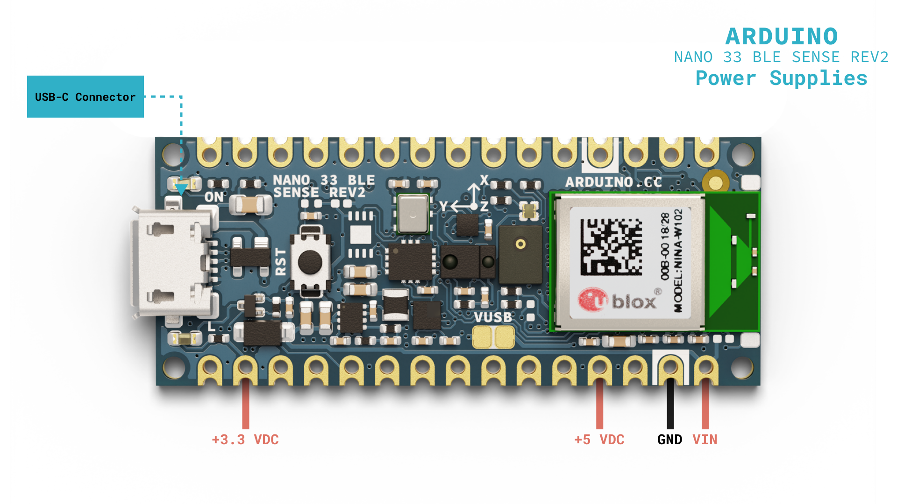

***__Important note:__ The Nano 33 BLE Sense Rev2's `VIN` pin accepts a voltage range of +5-21 VDC. Do not connect voltages outside this range as you could permanently damage the board. Always verify all connections before applying power.***

#### 5V Pin Configuration

**The Nano 33 BLE Sense Rev2 board operates at +3.3 VDC**, which means y**ou must never apply more than +3.3 VDC to its digital and analog pins**. To maintain compatibility with existing Nano projects while protecting the board, the `5V` pin (positioned between the `RST` and `A7` pins) is not connected by default.

To enable the `5V` pin, two conditions must be met:

1. **Solder the `VUSB` jumper pads**: Connect either the top or bottom pair of `VUSB` pads on the board
2. **Power via USB**: The board must be powered through the USB connector

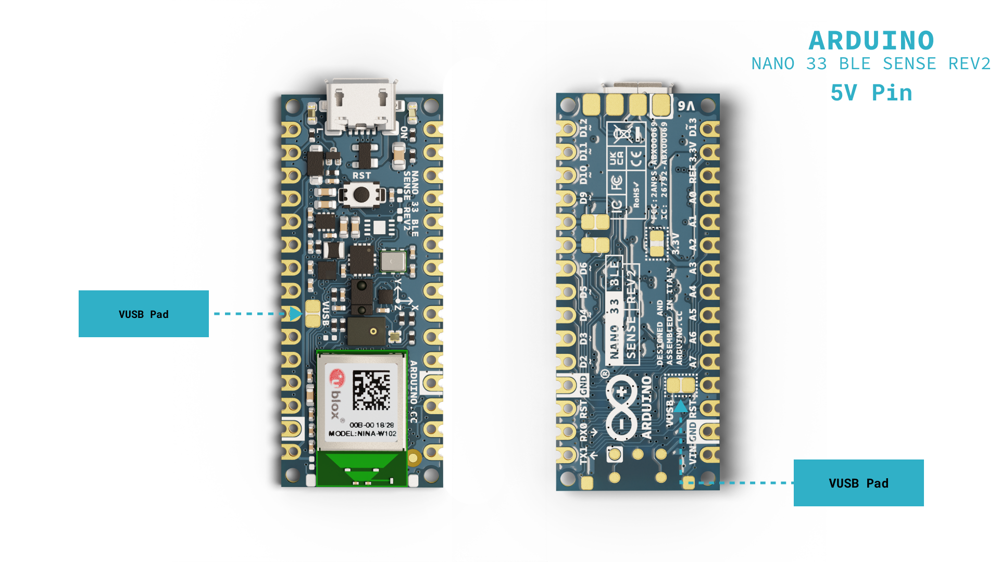

***__Important safety note:__ Even with the `5V` pin enabled, remember that all I/O pins still operate at +3.3 VDC and are NOT +5 VDC tolerant. The `5V` pin is only for powering external +5 VDC devices, not for input signals to the board.***

### Hello World Example

Let's program the Nano 33 BLE Sense Rev2 to reproduce the classic `Hello World` example used in the Arduino ecosystem: the `Blink` sketch. We will use this example to verify that the Nano 33 BLE Sense Rev2's connection to the computer works correctly, that the Arduino IDE is properly configured, and that both the board and development environment function as expected.

First, connect your Nano 33 BLE Sense Rev2 board to your computer using a USB Micro cable, open the Arduino IDE, and make sure that the board is connected correctly. If you are new to the Arduino IDE, please refer to the official Arduino documentation for more detailed information about initial setup. Copy and paste the following example sketch into a new Arduino IDE file:

```arduino
/**
Blink Example for the Arduino Nano 33 BLE Sense Rev2 Board
Name: nano_33_ble_sense_rev2_blink.ino
Purpose: This sketch demonstrates how to blink the built-in
user LED of the Arduino Nano 33 BLE Sense Rev2 board.

@author Arduino Product Experience Team
@version 1.0 01/06/25
*/

// Built-in LED pin
#define LED_PIN LED_BUILTIN

void setup() {
  // Initialize serial communication and wait up to 2.5 seconds for connection
  Serial.begin(115200);
  unsigned long startTime = millis();
  while (!Serial && millis() - startTime < 2500) {
    delay(100);
  }
  
  // Configure LED pin as output
  pinMode(LED_PIN, OUTPUT);
  
  // Startup message
  Serial.println("- Arduino Nano 33 BLE Sense Rev2 - Blink Example started...");
}

void loop() {
  // Turn on the LED, wait 1 second
  digitalWrite(LED_PIN, HIGH);
  Serial.println("- LED on!");
  delay(1000);
  
  // Turn off the LED, wait 1 second
  digitalWrite(LED_PIN, LOW);
  Serial.println("- LED off!");
  delay(1000);  
}
```

To upload the sketch to the board, click the **Verify** button to compile the sketch and check for errors, then click the **Upload** button to program the device with the sketch.

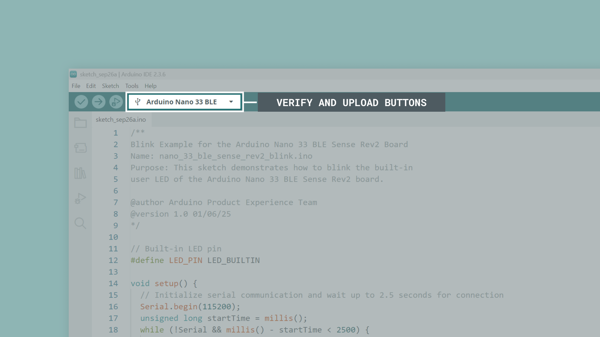

You should see the built-in orange user LED of your Nano 33 BLE Sense Rev2 board turn on for one second, then turn off for one second, repeating this cycle continuously. 

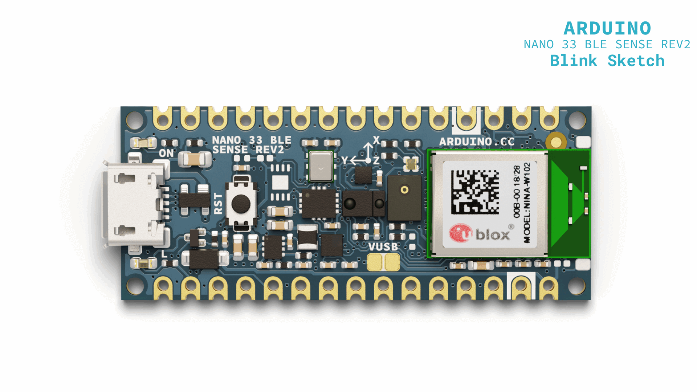

Additionally, you can open the Arduino IDE's Serial Monitor (Tools > Serial Monitor) to see the status messages that the example sketch sends each time the LED state changes.

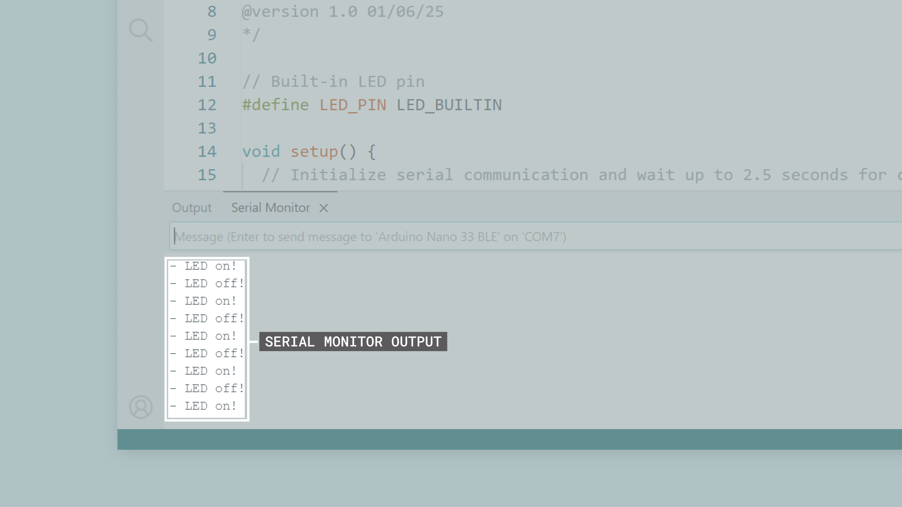

This example confirms the following:

- The Nano 33 BLE Sennse board is correctly connected
- The Arduino IDE is properly configured
- The board is functioning correctly
- USB communication is working
- Digital pins respond to commands

Congratulations! You have successfully completed your first program on the Nano 33 BLE Sense board. You are now ready to explore the more advanced features of this tiny but powerful board.

## LEDs

This user manual section covers the Nano 33 BLE Sense Rev2 built-in LEDs, showing their main hardware and software characteristics.

### RGB LED

The Nano 33 BLE Sense Rev2 features a built-in RGB LED that can be used as a visual feedback indicator for the user.

The built-in RGB LED can be accessed through the following macro definitions:

| **Built-in LED** | **Macro Definition** |
| :--------------: | :------------------: |
|     Red LED      |        `LEDR`        |
|    Green LED     |        `LEDG`        |
|     Blue LED     |        `LEDB`        |

The following example sketch each of the RGB LED colors at an interval of 500 ms:

```arduino
/**
RGB LED Example for the Arduino Nano 33 BLE Sense BLE Sense Rev2
Name: nano_33_ble_sense_rev2_rgb_led.ino
Purpose: This sketch demonstrates how to control the built-in
RGB LED of the Arduino Nano 33 BLE Sense Rev2 board.

*/

void setup() {
  // Initialize serial communication and wait up to 2.5 seconds for a connection
  Serial.begin(115200);
  for (auto startNow = millis() + 2500; !Serial && millis() < startNow; delay(500));
  
  // Initialize LEDR, LEDG and LEDB as outputs
  pinMode(LEDR, OUTPUT);
  pinMode(LEDG, OUTPUT);
  pinMode(LEDB, OUTPUT);
  
  // Turn off all LEDs initially
  digitalWrite(LEDR, LOW);
  digitalWrite(LEDG, LOW);
  digitalWrite(LEDB, LOW);
  
  Serial.println("- Arduino Nano 33 BLE Sense Rev2 - RGB LED Example started...");
}

void loop() {
  // Turn on the built-in red LED and turn off the rest
  digitalWrite(LEDR, HIGH);
  digitalWrite(LEDG, LOW);
  digitalWrite(LEDB, LOW);
  Serial.println("- Red LED on!");
  delay(500);
  
  // Turn on the built-in green LED and turn off the rest
  digitalWrite(LEDR, LOW);
  digitalWrite(LEDG, HIGH);
  digitalWrite(LEDB, LOW);
  Serial.println("- Green LED on!");
  delay(500);
  
  // Turn on the built-in blue LED and turn off the rest
  digitalWrite(LEDR, LOW);
  digitalWrite(LEDG, LOW);
  digitalWrite(LEDB, HIGH);
  Serial.println("- Blue LED on!");
  delay(500);
  
  // Turn off all LEDs
  digitalWrite(LEDR, LOW);
  digitalWrite(LEDG, LOW);
  digitalWrite(LEDB, LOW);
  Serial.println("- All LEDs off!");
  delay(500);
}
```

You should now see the built-in RGB LED cycling through red, green, and blue colors, followed by a brief moment with all LEDs off, repeating this pattern continuously.

Additionally, you can open the Arduino IDE's Serial Monitor (Tools > Serial Monitor) to see the status messages that the example sketch sends each time the RGB LEDs state changes.

### Orange LED

The Nano 33 BLE Sense Rev2 also features a built-in orange user LED that can be used for basic status indications and debugging purposes.

The built-in user LED can be accessed through the following macro definition:

| **Built-in LED** | **Macro Definition** | **Microcontroller Pin** |
| :--------------: | :------------------: | :---------------------: |
| Orange User LED  |    `LED_BUILTIN`     |         `P0.13`         |

## Pins

This user manual section provides comprehensive information about the Nano 33 BLE Sense Rev2's pin capabilities and functionality. Understanding the board's pins capabilities and configurations is important for making the most of your projects with the Nano 33 BLE Sense Rev2 board.

### Pins Overview

The Nano 33 BLE Sense Rev2 features a total of **20 accessible pins** arranged in the classic Nano form factor, maintaining compatibility with existing Nano shields and breadboard layouts. These pins provide various functionalities including digital I/O, analog input, PWM output and several communication protocols.


### Pins Specifications and Characteristics

The Nano 33 BLE Sense Rev2's pins are organized into the following categories:

|   **Pin Type**   | **Count** |      **Pin Numbers**      |           **Primary Functions**            |
| :--------------: | :-------: | :-----------------------: | :----------------------------------------: |
| **Digital Pins** |    14     |       `D0` - `D13`        |    Digital I/O, PWM (5 pins), SPI, UART    |
| **Analog Pins**  |     8     |        `A0` - `A7`        | Analog input, Digital I/O, I²C, DAC (`A0`) |
|  **Power Pins**  |     4     | `VIN`, `5V`, `3V3`, `GND` |          Power supply and ground           |
| **Special Pins** |     2     |          `RESET`          |               System control               |

The Nano 33 BLE Sense Rev2 offers several advanced pin capabilities including multi-function pins that can serve multiple purposes depending on your project needs.

The following table shows the electrical specifications and operating limits for all pins on the Nano 33 BLE Sense Rev2 board:

|    **Specification**    |  **Value**   |                    **Notes**                     |
| :---------------------: | :----------: | :----------------------------------------------: |
|  **Operating Voltage**  |   +3.3 VDC   |         Logic level for all digital pins         |
| **Input Voltage Range** | 0 - +3.3 VDC | Assure that this limit of 3.3V is never exceeded |
| **Max Current per Pin** |    10 mA     |            Source/sink current limit             |
|  **Max Total Current**  |    200 mA    |          Combined current for all pins           |

***__Important safety considerations when working with the Nano 33 BLE Sense Rev2 pins:__ The microcontroller on the Arduino Nano 33 BLE Sense Rev2 runs at 3.3V, which means that you must never apply more than 3.3V to its Digital and Analog pins. Care must be taken when connecting sensors and actuators to assure that this limit of 3.3V is never exceeded. Connecting higher voltage signals, like the 5V commonly used with the other Arduino boards, will damage the Arduino Nano 33 BLE Sense Rev2.***

**_To avoid such risk with existing projects, where you should be able to pull out a Nano and replace it with the new Nano 33 BLE Sense Rev2, we have the 5V pin on the header, positioned between RST and A7 that is not connected as default factory setting. This means that if you have a design that takes 5V from that pin, it won't work immediately, as a precaution we put in place to draw your attention to the 3.3V compliance on digital and analog inputs._**

**_5V on that pin is available only when two conditions are met: you make a solder bridge on the two pads marked as VUSB and you power the Nano 33 BLE Sense Rev2 through the USB port. If you power the board from the VIN pin, you won't get any regulated 5V and therefore even if you do the solder bridge, nothing will come out of that 5V pin. The 3.3V, on the other hand, is always available and supports enough current to drive your sensors. Please make your designs so that sensors and actuators are driven with 3.3V and work with 3.3V digital IO levels. 5V is now an option for many modules and 3.3V is becoming the standard voltage for electronic ICs._**

### Digital Pins

The Nano 33 BLE Sense Rev2 features 14 digital pins (`D0` to `D13`) that can be configured as either digital inputs or digital outputs. These pins operate at +3.3 VDC logic levels and can source or sink up to 10 mA of current per pin. Digital pins are the foundation of most Arduino projects, allowing you to control LEDs, read button states, interface with sensors and communicate with other devices.

The Nano 33 BLE Sense Rev2 digital pins provide the following functionality:

| **Arduino Pin** | **Microcontroller Pin** | **Additional Functions** | **Special Features** |
| :-------------: | :---------------------: | :----------------------: | :------------------: |
|      `D0`       |         `P1.03`         |         UART TX          | Serial communication |
|      `D1`       |         `P1.10`         |         UART RX          | Serial communication |
|      `D2`       |         `P1.11`         |           PWM            |  External interrupt  |
|      `D3`       |         `P1.12`         |           PWM            |  External interrupt  |
|      `D4`       |         `P1.15`         |           PWM            |  External interrupt  |
|      `D5`       |         `P1.13`         |           PWM            |  External interrupt  |
|      `D6`       |         `P1.14`         |           PWM            |  External interrupt  |
|      `D7`       |         `P1.23`         |           PWM            |  External interrupt  |
|      `D8`       |         `P1.21`         |           PWM            |  External interrupt  |
|      `D9`       |         `P1.27`         |           PWM            |  External interrupt  |
|      `D10`      |         `P1.02`         |       SPI CS, PWM        |  SPI communication   |
|      `D11`      |         `P1.01`         |      SPI MOSI, PWM       |  SPI communication   |
|      `D12`      |         `P1.08`         |      SPI MISO, PWM       |  SPI communication   |
|      `D13`      |         `P0.13`         |       SPI SCK, PWM       |  SPI communication   |

***__Important note:__ Pins `D0` and `D1` are used for serial communication (UART) and should be avoided for general digital I/O when using Serial communication. Pins `D10`, `D11`, `D12` and `D13` are used for SPI communication.***

The Nano 33 BLE Sense Rev2's digital pins offer the following specifications:

|  **Specification**   |   **Value**    |           **Notes**           |
| :------------------: | :------------: | :---------------------------: |
|    Logic Voltage     |    +3.3 VDC    | `HIGH` and `LOW` logic levels |
|    Input Voltage     | 0 to +3.3 VDC  |   +3.3 VDC tolerant inputs    |
| Max Current (Source) |     10 mA      |    Per pin source current     |
|  Max Current (Sink)  |     10 mA      |     Per pin sink current      |
|  Total Max Current   |     200 mA     |     Combined for all pins     |
|   Input Resistance   |    20-50 kΩ    |   Internal pull-up resistor   |
|    Digital `HIGH`    | +2 to +3.3 VDC |  Minimum voltage for `HIGH`   |
|    Digital `LOW`     | 0 to +1.5 VDC  |   Maximum voltage for `LOW`   |

Digital pins can be configured and controlled using the following basic Arduino functions.

You can configure a pin's mode using the `pinMode()` function:

```arduino
pinMode(pin, mode);
```

To write a digital value to an output pin, use the `digitalWrite()` function:

```arduino
digitalWrite(pin, value);
```

To read the state of a digital input pin, use the `digitalRead()` function:

```arduino
digitalRead(pin);
```

The available pin modes are `OUTPUT` for digital output, `INPUT` for digital input with high impedance, and `INPUT_PULLUP` for digital input with internal pull-up resistor enabled. Digital output values can be `HIGH` (+3.3 VDC) or `LOW` (0 VDC), and digital input readings will return `HIGH` or `LOW` based on the voltage level detected on the pin.

### Analog Pins

The Nano 33 BLE Sense Rev2 features **8 analog input pins** (`A0` to `A7`) that can be read using the `analogRead()` function. These pins allow you to measure continuously varying voltages, making them perfect for reading sensors like potentiometers, light sensors, temperature sensors and other analog components and devices. The analog-to-digital converter (ADC) built into the nRF52840 microcontroller of the Nano 33 BLE Sense Rev2 board converts the analog voltage into a digital value that your sketch can process.

The Nano 33 BLE Sense Rev2 analog pins provide the following functionality:

| **Arduino Pin** | **Microcontroller Pin** | **Additional Functions** | **Special Features** |
| :-------------: | :---------------------: | :----------------------: | :------------------: |
|      `A0`       |         `P0.04`         |           DAC            |  12-bit DAC output   |
|      `A1`       |         `P0.05`         |        Analog In         |  Analog input only   |
|      `A2`       |         `P0.30`         |        Analog In         |  Analog input only   |
|      `A3`       |         `P0.29`         |        Analog In         |  Analog input only   |
|      `A4`       |         `P0.31`         |        SDA (I²C)         |  I²C communication   |
|      `A5`       |         `P0.02`         |        SCL (I²C)         |  I²C communication   |
|      `A6`       |         `P0.28`         |        Analog In         |  Analog input only   |
|      `A7`       |         `P0.03`         |        Analog In         |  Analog input only   |

***__Important note:__ Pins `A4` and `A5` are primarily used for I²C communication (SDA and SCL respectively).***

The Nano 33 BLE Sense Rev2's analog pins offer the following specifications:

| **Specification**  |   **Value**   |          **Notes**           |
| :----------------: | :-----------: | :--------------------------: |
|   Input Voltage    | 0 to +3.3 VDC |  Maximum safe input voltage  |
| Default Resolution |    10-bit     |        Values 0-1023         |
| Maximum Resolution |    12-bit     |        Values 0-4095         |
| Default Reference  |   +3.3 VDC    |         AREF voltage         |
| Internal Reference |   +0.6 VDC    | Built-in precision reference |

You can read analog values using the `analogRead()` function:

```arduino
value = analogRead(pin);
``` 

The default reference voltage of these pins is +3.3 VDC, but this can be changed using the `analogReference()` function. You can use `analogReference(AR_VDD)` for the default reference of +3.3 VDC, `analogReference(AR_INTERNAL)` for the built-in reference of +0.6 VDC, `analogReference(AR_INTERNAL1V2)` for the built-in reference of +0.6 VDC with 2x gain, and `analogReference(AR_INTERNAL2V4)` for the built-in reference of +0.6 VDC with 4x gain.

The default resolution is set to 10-bit, but it can be updated to 12-bit resolution using the `analogReadResolution()` function in the `setup()` of your sketch. Available options are analogReadResolution(10) for default 10-bit and analogReadResolution(12) for 12-bit for maximum 14-bit resolution.

### PWM (Pulse Width Modulation)

The Nano 33 BLE Sense Rev2 board  features multiple pins with PWM capability that can be used to generate analog-like output signals. PWM works by rapidly switching a digital output between `HIGH` and `LOW` states, where the ratio of `HIGH` time to the total period determines the effective analog voltage output.

The Nano 33 BLE Sense Rev2 board provides PWM functionality on the following pins:

| **Arduino Pin** | **Microcontroller Pin** | **PWM Channel** | **Primary Function**  |
| :-------------: | :---------------------: | :-------------: | :-------------------: |
|      `D2`       |         `P1.11`         |   Channel 0B    |      Digital I/O      |
|      `D3`       |         `P1.12`         |   Channel 0B    |      Digital I/O      |
|      `D4`       |         `P1.15`         |   Channel 0B    |      Digital I/O      |
|      `D5`       |         `P1.13`         |   Channel 1B    |      Digital I/O      |
|      `D6`       |         `P1.14`         |   Channel 0A    |      Digital I/O      |
|      `D7`       |         `P0.23`         |   Channel 0B    |      Digital I/O      |
|      `D8`       |         `P0.21`         |   Channel 0B    |      Digital I/O      |
|      `D9`       |         `P0.27`         |   Channel 0B    |      Digital I/O      |
|      `D10`      |         `P1.02`         |   Channel 2A    |  Digital I/O, SPI CS  |
|      `D11`      |         `P1.01`         |   Channel 5A    | Digital I/O, SPI MOSI |
|      `D12`      |         `P1.08`         |   Channel 0B    |      Digital I/O      |
|      `D13`      |         `P0.13`         |   Channel 0B    |      Digital I/O      |

***__Important note:__ . The onboard LEDs (`LEDR`, `LEDG`, `LEDB`, `LED_BUILTIN`) also support PWM for brightness control.***

You can use PWM pins as analog output pins with the `analogWrite()` function:

```arduino
analogWrite(pin, value);
```

By default, the resolution is 8-bit (0 to 255). You can use analogWriteResolution() to change this, supporting up to 12-bit (0 to 4095) resolution: 

```arduino
analogWriteResolution(resolution);
```

***The following PWM examples use the built-in orange user LED (`LED_BUILTIN`) of the Nano 33 BLE Sense Rev2 board, which supports PWM for brightness control. This eliminates the need for external components and allows you to test PWM functionality immediately.***

The following example demonstrates how to control the brightness of the built-in orange user LED using PWM:

```arduino
/**
PWM Example for the Arduino Nano 33 BLE Sense Rev2 Board
Name: nano_33_ble_sense_rev2_pwm_led.ino
Purpose: This sketch demonstrates how to use PWM to control
the brightness of the built-in user LED of the Nano 33 BLE Sense Rev2 board.

@author Arduino Product Experience Team
@version 1.0 01/06/25
*/

// Built-in LED pin (supports PWM)
const int ledPin = LED_BUILTIN;

void setup() {
  // Initialize serial communication and wait up to 2.5 seconds for a connection
  Serial.begin(115200);
  for (auto startNow = millis() + 2500; !Serial && millis() < startNow; delay(500));
  
  // No need to set pinMode for PWM pins - analogWrite() handles this
  
  Serial.println("- Arduino Nano 33 BLE Sense Rev2 - PWM LED Example started...");
  Serial.println("- Built-in LED will fade in and out continuously");
}

void loop() {
  // Fade in (0 to 255)
  for (int brightness = 0; brightness <= 255; brightness++) {
    analogWrite(ledPin, brightness);
    delay(5);
  }
  
  Serial.println("- LED at maximum brightness");
  delay(500);
  
  // Fade out (255 to 0)
  for (int brightness = 255; brightness >= 0; brightness--) {
    analogWrite(ledPin, brightness);
    delay(5);
  }
  
  Serial.println("- LED turned off");
  delay(500);
}
```

You should now see the built-in orange user LED of your Nano 33 BLE Sense Rev2 board gradually fade in and out, creating a smooth breathing effect that repeats continuously.

Additionally, you can open the Arduino IDE's Serial Monitor (Tools > Serial Monitor) to see the status messages that the example sketch sends at key brightness levels.

The following example demonstrates how to use a 12-bit PWM resolution for more precise control of the built-in orange user LED:

```arduino
/**
High-Resolution PWM Example for the Arduino Nano 33 BLE Sense Rev2 Board
Name: nano_33_ble_sense_rev2_pwm_high_res.ino
Purpose: This sketch demonstrates how to use 12-bit PWM resolution
for precise control of the built-in orange user LED brightness.

@author Arduino Product Experience Team
@version 1.0 01/06/25
*/

// Built-in LED pin (supports PWM)
const int pwmPin = LED_BUILTIN;

void setup() {
  // Initialize serial communication and wait up to 2.5 seconds for a connection
  Serial.begin(115200);
  for (auto startNow = millis() + 2500; !Serial && millis() < startNow; delay(500));
  
  // Set PWM resolution to 12-bit (0-4095)
  analogWriteResolution(12);
  
  Serial.println("- Arduino Nano 33 BLE Sense Rev2 - High-Resolution PWM Example started...");
  Serial.println("- Using 12-bit resolution (0-4095) with built-in LED");
}

void loop() {
  // Generate a smooth sine wave using 12-bit PWM
  for (int i = 0; i < 360; i++) {
    // Calculate sine wave value and map to 12-bit range
    float sineValue = sin(i * PI / 180.0);
    int pwmValue = (int)((sineValue + 1.0) * 2047.5);  // Map -1 to 1 → 0 to 4095
    
    analogWrite(pwmPin, pwmValue);
    
    // Print current values every 30 degrees
    if (i % 30 == 0) {
      Serial.print("- Angle: ");
      Serial.print(i);
      Serial.print("°, PWM Value: ");
      Serial.println(pwmValue);
    }
    
    delay(10);
  }
  
  Serial.println("- Sine wave cycle completed");
  delay(1000);
}
```

This high-resolution example creates a smooth sine wave pattern with the built-in LED brightness, demonstrating the precision available with a 12-bit PWM resolution. You should see a very smooth transition in the LED brightness following a sine wave pattern. Additionally, you can open the Arduino IDE's Serial Monitor (Tools > Serial Monitor) to see the angle and PWM value outputs that demonstrate the precise 12-bit control values being used.

## Digital-to-Analog Converter (DAC)

The Nano 33 BLE Sense Rev2 features a built-in 12-bit Digital-to-Analog Converter (DAC) connected to pin `A0`. Unlike PWM pins that simulate analog output through rapid switching, the DAC provides true analog voltage output. This makes it ideal for applications requiring precise analog signals, such as audio generation, sensor calibration, control systems and waveform generation.

The Nano 33 BLE Sense Rev2 DAC provides the following functionality:

|  **Specification**   |     **Value**     |             **Notes**              |
| :------------------: | :---------------: | :--------------------------------: |
|      Resolution      |      12-bit       |    4096 discrete output levels     |
|      Output Pin      |       `A0`        |      Dedicated DAC output pin      |
| Output Voltage Range | +0.35 to +4.5 VDC | Typical range with +3.3 VDC supply |
|  Default Resolution  |       8-bit       |              0 to 255              |
|  Maximum Resolution  |      12-bit       |             0 to 4095              |
|   Output Impedance   |   5Ω (typical)    |        Low impedance output        |
|   Conversion Time    |     Max 30 μs     |   Time to update output voltage    |
|    Resistive Load    |     Min 30 kΩ     |      Minimum recommended load      |
|   Load Capacitance   |     Max 50 pF     |      Maximum capacitive load       |

***__Important note:__ When using the DAC on pin `A0`, this pin cannot simultaneously be used as an analog input. The DAC provides true analog output, making it superior to PWM for applications requiring smooth, continuous voltage levels.***

You can write analog values to the DAC using the `analogWrite()` function:

```arduino
analogWrite(DAC, value);
```

The default resolution is 8-bit (0 to 255), but this can be changed using the `analogWriteResolution()` function. You can use `analogWriteResolution(8)` for 8-bit resolution, `analogWriteResolution(10)` for 10-bit resolution or `analogWriteResolution(12)` for maximum 12-bit resolution.

The DAC reference voltage depends on the selected reference mode, and the output voltage is calculated as: `Output Voltage = (DAC_Value / 4095) × Reference_Voltage`.

***The following examples demonstrate basic DAC functionality that you can easily test with the Nano 33 BLE Sense Rev2 board.***

The following example demonstrates how to generate a simple voltage output using the DAC. **No external components are needed for this example**:

```arduino
/**
DAC Basic Output Example for the Arduino Nano 33 BLE Sense Rev2 Board
Name: nano_33_ble_sense_rev2_dac_basic.ino
Purpose: This sketch demonstrates how to use the DAC to generate
precise analog voltages on pin A0.

@author Arduino Product Experience Team
@version 1.0 01/06/25
*/

void setup() {
  // Initialize serial communication and wait up to 2.5 seconds for a connection
  Serial.begin(115200);
  for (auto startNow = millis() + 2500; !Serial && millis() < startNow; delay(500));
  
  // Set DAC resolution to 12-bit for maximum precision
  analogWriteResolution(12);
  
  Serial.println("- Arduino Nano 33 BLE Sense Rev2 - DAC Basic Output Example started...");
  Serial.println("- Generating precise voltages on pin A0");
  Serial.println("- Connect a multimeter to A0 to measure output");
}

void loop() {
  // Generate different voltage levels
  // 0, +0.825, +1.65, +2.475 and +3.3 VDC
  int dacValues[] = {0, 1024, 2048, 3072, 4095}; 
  float voltages[] = {0.0, 0.825, 1.65, 2.475, 3.3};
  
  for (int i = 0; i < 5; i++) {
    analogWrite(DAC, dacValues[i]);
    
    Serial.print("- DAC Value: ");
    Serial.print(dacValues[i]);
    Serial.print(" | Target Voltage: ");
    Serial.print(voltages[i], 2);
    Serial.println(" VDC");
    
    // Hold each voltage for 2 seconds
    delay(2000);  
  }
  
  Serial.println("- Cycle completed, repeating...");
  delay(1000);
}
```

To test this example, connect a digital multimeter between pin `A0` and `GND` to measure the output voltage. You should see the voltage change in precise steps every two seconds, showing the DAC's ability to generate exact analog voltages. For best results, connect an oscilloscope to pin `A0` to visualize the step output.

You can open the Arduino IDE's Serial Monitor (Tools > Serial Monitor) to see the DAC values and corresponding target voltages. The output should closely match the calculated voltages with high precision.

The following example demonstrates how to generate a smooth sine wave using the DAC. **No external components are needed for this example**:

```arduino
/**
DAC Sine Wave Generator for the Arduino Nano 33 BLE Sense Rev2 Board
Name: nano_33_ble_sense_rev2_dac_sine_wave.ino
Purpose: This sketch generates a smooth sine wave using the 12-bit DAC
for testing and signal generation applications.

@author Arduino Product Experience Team
@version 1.0 01/06/25
*/

void setup() {
  // Initialize serial communication and wait up to 2.5 seconds for a connection
  Serial.begin(115200);
  for (auto startNow = millis() + 2500; !Serial && millis() < startNow; delay(500));
  
  // Set DAC resolution to 12-bit for smooth waveform
  analogWriteResolution(12);
  
  Serial.println("- Arduino Nano 33 BLE Sense Rev2 - DAC Sine Wave Generator started...");
  Serial.println("- Generating sine wave on pin A0");
  Serial.println("- Connect an oscilloscope to A0 to view waveform");
}

void loop() {
  // Generate one complete sine wave cycle (360 degrees)
  for (int angle = 0; angle < 360; angle++) {
    // Calculate sine value (-1 to +1) and convert to DAC range (0 to 4095)
    float sineValue = sin(angle * PI / 180.0);
    int dacValue = (int)((sineValue + 1.0) * 2047.5);
    
    // Output the calculated value to DAC
    analogWrite(DAC, dacValue);
    
    // Print debug info every 30 degrees
    if (angle % 30 == 0) {
      float voltage = (dacValue / 4095.0) * 3.3;
      Serial.print("- Angle: ");
      Serial.print(angle);
      Serial.print("° | DAC: ");
      Serial.print(dacValue);
      Serial.print(" | Voltage: ");
      Serial.print(voltage, 2);
      Serial.println(" VDC");
    }
    
    // Control wave frequency (~28 Hz)
    delayMicroseconds(100);  
  }
}
```

You can open the Arduino IDE's Serial Monitor (Tools > Serial Monitor) to see the sine wave generation progress with angle, DAC values, and corresponding voltages. 

For best results, connect an oscilloscope to pin `A0` to visualize the smooth sine wave output.

## UART Communication

The Nano 33 BLE Sense Rev2 board features built-in UART (Universal Asynchronous Receiver-Transmitter) communication that allows your projects to communicate with other devices through serial data transmission. UART is implemented within the nRF52840 microcontroller and provides two separate hardware serial ports: one connected to the micro USB connector for computer communication, and another available on pins `D0` and `D1` for external device communication. This makes it perfect for projects that need to communicate with sensors, modules or other microcontrollers while maintaining USB connectivity for debugging.

UART is particularly useful when your project needs to communicate with devices that require simple, reliable serial communication, rather than the more complex protocols like SPI or I²C. While SPI excels at high-speed communication and I²C is ideal for multiple device networks, UART provides straightforward point-to-point communication that works well with GPS modules, Bluetooth® modules, Wi-Fi® modules and other serial devices. UART communication is asynchronous, meaning it doesn't require a shared clock signal, making it robust over longer distances.

The Nano 33 BLE Sense Rev2's UART interface offers the following technical specifications:

|   **Parameter**   |   **Value**    |      **Notes**       |
| :---------------: | :------------: | :------------------: |
|    Baud Rates     | 300 to 1000000 | Common: 9600, 115200 |
|     Data Bits     |     8-bit      | Standard data width  |
|   Communication   |  Full-duplex   |  Simultaneous TX/RX  |
|  Hardware Ports   |       2        | USB Serial + Serial1 |
|     UART Pins     |   `D0`, `D1`   | RX, TX respectively  |
| Operating Voltage |    +3.3 VDC    |   TTL logic levels   |
|   Flow Control    |    Software    |  XON/XOFF supported  |

The Nano 33 BLE Sense Rev2 board uses the following pins for UART communication:

| **Arduino Pin** | **Microcontroller Pin** | **UART Function** | **Description** |
| :-------------: | :---------------------: | :---------------: | :-------------: |
|      `D0`       |         `P1.03`         |        RX         |  Transmit Data  |
|      `D1`       |         `P1.10`         |        TX         |  Receive Data   |

You can communicate via UART using the built-in `Serial` and `Serial1` objects. The `Serial` object is connected to the micro USB port for computer communication, while `Serial1` is connected to pins `D0` and `D1` for external device communication.

The following example demonstrates basic UART communication patterns:

```arduino
/**
UART Basic Example for the Arduino Nano 33 BLE Sense Rev2 Board
Name: nano_33_ble_sense_rev2_uart_basic.ino
Purpose: This sketch demonstrates basic UART communication
using both USB Serial and hardware Serial1.

@author Arduino Product Experience Team
@version 1.0 01/06/25
*/

void setup() {
  // Initialize USB serial communication at 115200 baud
  Serial.begin(115200);
  for (auto startNow = millis() + 2500; !Serial && millis() < startNow; delay(500));
  
  // Initialize hardware serial on pins D0/D1 at 9600 baud
  Serial1.begin(9600);
  
  Serial.println("- Arduino Nano 33 BLE Sense Rev2 - UART Basic Example started...");
  Serial.println("- USB Serial (Serial): 115200 baud");
  Serial.println("- Hardware Serial (Serial1): 9600 baud on D0/D1");
  Serial.println("- Connect logic analyzer to D0 (TX) and D1 (RX)");
  Serial.println("- Type messages in Serial Monitor to send via Serial1");
  Serial.println();
}

void loop() {
  // Check for data from USB Serial (computer)
  if (Serial.available()) {
    String message = Serial.readString();

    // Remove newline characters
    message.trim(); 
    
    if (message.length() > 0) {
      Serial.print("- USB received: \"");
      Serial.print(message);
      Serial.println("\"");
      
      // Send the message via Serial1 (D0/D1)
      Serial1.print("- Message from USB: ");
      Serial1.println(message);
      
      Serial.println("- Message sent via Serial1 (D0/D1)!");
    }
  }
  
  // Check for data from Serial1 (external device on D0/D1)
  if (Serial1.available()) {
    String response = Serial1.readString();

    // Remove newline characters
    response.trim(); 
    
    if (response.length() > 0) {
      Serial.print("- Serial1 received: \"");
      Serial.print(response);
      Serial.println("\"");
    }
  }
  
  // Send periodic test data via Serial1
  static unsigned long lastSend = 0;
  if (millis() - lastSend > 3000) {
    lastSend = millis();
    
    // Send test data with timestamp
    Serial1.print("Test data: ");
    Serial1.print(millis());
    Serial1.println(" ms");
    
    Serial.println("- Periodic test data sent via Serial1!");
  }
  
  delay(10);
}
```

***To test this example, no external UART devices are required, the code will demonstrate UART communication patterns that can be observed with a logic analyzer. You can type messages in the Arduino IDE's Serial Monitor to see them transmitted via `Serial1` on pins `D0`/`D1`.***

You can open the Arduino IDE's Serial Monitor (Tools > Serial Monitor) to interact with the USB serial port and observe the communication patterns. Connect a logic analyzer to pins `D0` (TX) and `D1` (RX) to observe the actual UART protocol signals.

The image below shows how the UART communication from our example appears in the Digilent Waveforms logic analyzer software, with the decoded protocol showing the transmitted data bytes and timing.

The Nano 33 BLE Sense Rev2 board provides two distinct UART communication channels, giving you the flexibility to handle multiple communication tasks simultaneously. The first channel is the USB Serial (`Serial`), which is your primary interface for programming and debugging. This channel offers several key features:

- Connected to the onboard USB-C connector
- Used for programming and debugging
- Typically runs at 115200 baud
- Automatic baud rate detection
- No external connections required 

The second channel is the Hardware Serial (`Serial1`), which is dedicated to external device communication. This channel provides robust connectivity for your project peripherals:

- Connected to pins `D0` (TX) and `D1` (RX)
- Used for external device communication
- Configurable baud rate (300 to 1000000)
- TTL voltage levels (0 VDC/+3.3 VDC)
- Requires external device connection

Here is a practical example of how to use both UART channels simultaneously, such as when connecting a GPS module:

```arduino
// Example: Connecting a GPS module via Serial1
void setup() {
  Serial.begin(115200);   // USB debugging
  Serial1.begin(9600);    // GPS module communication
  
  Serial.println("GPS module communication started");
}

void loop() {
  // Forward GPS data to USB Serial for monitoring
  if (Serial1.available()) {
    String gpsData = Serial1.readString();
    Serial.print("GPS: ");
    Serial.print(gpsData);
  }
  
  // Send commands to GPS module from USB Serial
  if (Serial.available()) {
    String command = Serial.readString();
    Serial1.print(command);
    Serial.println("Command sent to GPS");
  }
}
```

When working with UART on the Nano 33 BLE Sense Rev2, there are several key points to keep in mind for successful implementation: 

- The dual UART design is different from the UNO R3 board that shared one UART between USB and pins D0/D1. This separation allows simultaneous USB debugging and external device communication. 
- Always ensure that both devices use the same baud rate, data bits (typically 8), and stop bits (typically 1) for successful communication.
- Keep in mind that UART communication uses TTL voltage levels (0 VDC for logic `LOW`, +3.3 VDC for logic `HIGH`). If you need to communicate over longer distances or with RS-232 devices, you'll need a level converter. 
- When connecting external devices, remember that TX connects to RX and RX connects to TX (crossover connection). 
- The Nano 33 BLE Sense Rev2's UART ports are full-duplex, meaning they can send and receive data simultaneously, making them perfect for interactive communication with modules like GPS, Bluetooth®, Wi-Fi®, or other microcontrollers.

## SPI Communication

The Nano 33 BLE Sense Rev2 board features built-in SPI (Serial Peripheral Interface) communication that allows your projects to communicate with external devices like sensors, displays, memory cards and other microcontrollers. SPI is implemented within the nRF52840 microcontroller and uses four dedicated pins to provide high-speed synchronous serial communication.

SPI is particularly useful when your project needs to communicate with external components at high speeds, rather than using slower protocols. While I²C is perfect for simple sensor communication and UART for basic serial data exchange, SPI excels at high-speed communication with devices like SD cards, TFT displays, wireless modules or external memory chips. SPI can achieve much faster data rates than I²C and can handle multiple devices on the same bus through individual chip select lines.

The Nano 33 BLE Sense Rev2's SPI interface offers the following technical specifications:

|   **Parameter**   |  **Value**   |          **Notes**          |
| :---------------: | :----------: | :-------------------------: |
|    Clock Speed    | Up to 8 MHz  |    Maximum SPI frequency    |
|   Data Transfer   |    8-bit     |     Standard data width     |
|   Communication   | Full-duplex  |  Simultaneous send/receive  |
|     SPI Pins      | `D10`-`D13`  | `CS`, `MOSI`, `MISO`, `SCK` |
| Multiple Devices  |  Supported   |   Via different `CS` pins   |
| Operating Voltage |   +3.3 VDC   |        Same as board        |
| Protocol Support  | Mode 0,1,2,3 |   All SPI modes available   |

The Nano 33 BLE Sense Rev2 board uses the following pins for SPI communication:

| **Arduino Pin** | **Microcontroller Pin** | **SPI Function** |   **Description**    |
| :-------------: | :---------------------: | :--------------: | :------------------: |
|      `D10`      |         `P1.02`         |       `CS`       |     Chip Select      |
|      `D11`      |         `P1.01`         |      `MOSI`      | Master Out, Slave In |
|      `D12`      |         `P1.08`         |      `MISO`      | Master In, Slave Out |
|      `D13`      |         `P0.13`         |      `SCK`       |     Serial Clock     |

You can communicate via SPI using the dedicated `SPI.h` library, which is included in the Arduino Nano Mbed OS Boards core. The library provides simple functions to initialize the bus, send and receive data and manage multiple devices.

The following example demonstrates how to use SPI communication to send and receive data:

```arduino
/**
SPI Basic Example for the Arduino Nano 33 BLE Sense Rev2 Board
Name: nano_33_ble_sense_rev2_spi_basic.ino
Purpose: This sketch demonstrates how to use SPI communication
to send and receive data.

@author Arduino Product Experience Team
@version 1.0 01/06/25
*/

#include <SPI.h>

// Chip Select pin for SPI device
const int CS_PIN = 10;

void setup() {
  // Initialize serial communication and wait up to 2.5 seconds for a connection
  Serial.begin(115200);
  for (auto startNow = millis() + 2500; !Serial && millis() < startNow; delay(500));
  
  Serial.println("- Arduino Nano 33 BLE Sense Rev2 - SPI Basic Example started...");
  
  // Set CS pin as output and set it HIGH (inactive)
  pinMode(CS_PIN, OUTPUT);
  digitalWrite(CS_PIN, HIGH);
  
  // Initialize SPI communication
  SPI.begin();
  
  // Configure SPI settings
  // - Clock speed: 1 MHz (1000000 Hz)
  // - Data order: Most Significant Bit first
  // - Data mode: Mode 0 (Clock polarity = 0, Clock phase = 0)
  SPI.beginTransaction(SPISettings(1000000, MSBFIRST, SPI_MODE0));
  
  Serial.println("- SPI initialized successfully");
  Serial.println("- Ready to communicate with SPI devices");
  
  // Example: Send some test data
  sendSPIData();
}

void loop() {
  // Send a counter value every 2 seconds
  static int counter = 0;
  
  // Select the device (CS LOW)
  digitalWrite(CS_PIN, LOW);
  
  // Send counter value
  byte response = SPI.transfer(counter);
  
  // Deselect the device (CS HIGH)
  digitalWrite(CS_PIN, HIGH);
  
  // Display results
  Serial.print("- Sent: ");
  Serial.print(counter);
  Serial.print(" | Received: ");
  Serial.println(response);
  
  // Increment counter and wrap around at 255
  counter++;
  if (counter > 255) {
    counter = 0;
  }
  
  delay(2000);
}

void sendSPIData() {
  Serial.println("- Sending test data...");
  
  // Select the device
  digitalWrite(CS_PIN, LOW);
  
  // Send a sequence of test bytes
  for (int i = 0; i < 5; i++) {
    byte testData = 0x10 + i;  // Send 0x10, 0x11, 0x12, 0x13, 0x14
    byte response = SPI.transfer(testData);
    
    Serial.print("  Sent: 0x");
    if (testData < 16) Serial.print("0");
    Serial.print(testData, HEX);
    Serial.print(" | Received: 0x");
    if (response < 16) Serial.print("0");
    Serial.println(response, HEX);
    
    delay(100);
  }
  
  // Deselect the device
  digitalWrite(CS_PIN, HIGH);
  
  Serial.println("- Test data transmission complete");
}
```

***To test this example, no external SPI device is required. The code will demonstrate SPI communication patterns, though without a connected device, the received data will typically be `0xFF`.***

You can open the Arduino IDE's Serial Monitor (Tools > Serial Monitor) to see the SPI communication in action. The example sketch shows how to properly select devices, send data and handle responses.

For connecting multiple SPI devices, you can use different digital pins as additional Chip Select (`CS`) lines while sharing the `MOSI`, `MISO` and `SCK` pins:

```arduino
// Multiple device example
const int DEVICE1_CS = 10;  // First SPI device
const int DEVICE2_CS = 9;   // Second SPI device
const int DEVICE3_CS = 8;   // Third SPI device

void setup() {
  SPI.begin();
  
  // Configure all CS pins
  pinMode(DEVICE1_CS, OUTPUT);
  pinMode(DEVICE2_CS, OUTPUT);
  pinMode(DEVICE3_CS, OUTPUT);
  
  // Set all CS pins HIGH (inactive)
  digitalWrite(DEVICE1_CS, HIGH);
  digitalWrite(DEVICE2_CS, HIGH);
  digitalWrite(DEVICE3_CS, HIGH);
}
```

When working with SPI on the Nano 33 BLE Sense Rev2, there are several key points to keep in mind for successful implementation:

- The SPI protocol requires careful attention to timing and device selection. Always ensure that only one device is selected (`CS LOW`) at a time, and remember to deselect devices (`CS HIGH`) after communication to avoid conflicts.
- Different SPI devices may require different clock speeds and modes, so check your device's datasheet for the correct `SPISettings()` parameters.
- Keep in mind that SPI is a synchronous protocol, meaning that data is transferred in both directions simultaneously with each clock pulse. Even if you only need to send data, you'll still receive data back, and vice versa.
- The Nano 33 BLE Sense Rev2 board can communicate with multiple SPI devices by using different Chip Select (`CS`) pins, making it perfect for complex projects that need to interface with various sensors, displays and storage devices.

## I²C Communication

The Nano 33 BLE Sense Rev2 board features built-in I²C (Inter-Integrated Circuit) communication that allows your projects to communicate with multiple devices using just two wires. I²C is implemented within the nRF52840 microcontroller and uses two dedicated pins to provide reliable serial communication with sensors, displays, memory modules and other microcontrollers. This makes it perfect for projects that need to connect several devices without using many pins.

I²C is particularly useful when your project needs to communicate with multiple sensors and devices in a simple way, rather than using complex wiring. While SPI is excellent for high-speed communication and UART for basic serial data exchange, I²C excels at connecting many devices with minimal wiring. Multiple I²C devices can share the same two-wire bus, each with its own unique address, making it ideal for sensor networks, display modules and expandable systems.

The Nano 33 BLE Sense Rev2's I²C interface offers the following technical specifications:

|   **Parameter**   |   **Value**   |         **Notes**          |
| :---------------: | :-----------: | :------------------------: |
|    Clock Speed    | Up to 400 kHz |     Standard/Fast mode     |
|   Data Transfer   |     8-bit     |    Standard data width     |
|   Communication   |  Half-duplex  |  One direction at a time   |
|     I²C Pins      |  `A4`, `A5`   |   SDA, SCL respectively    |
| Device Addressing | 7-bit/10-bit  | Up to 127 unique addresses |
| Operating Voltage |   +3.3 VDC    |       Same as board        |
| Pull-up Resistors |    4.7 kΩ     |     Internal pull-ups      |

The Nano 33 BLE Sense Rev2 uses the following pins for I²C communication:

| **Arduino Pin** | **Microcontroller Pin** | **I²C Function** |  **Description**  |
| :-------------: | :---------------------: | :--------------: | :---------------: |
|      `A4`       |         `P0.31`         |       SDA        | Serial Data Line  |
|      `A5`       |         `P0.02`         |       SCL        | Serial Clock Line |

You can communicate via I²C using the dedicated `Wire.h` library, which is included in the Arduino Nano Mbed OS Boards core. The library provides simple functions to initialize the bus, send and receive data and manage multiple devices.

The following example demonstrates basic I²C communication patterns:

```arduino
/**
I2C Basic Example for the Arduino Nano 33 BLE Sense Rev2 Board
Name: nano_33_ble_sense_rev2_i2c_basic.ino
Purpose: This sketch demonstrates basic I2C communication
patterns for protocol analysis.

@author Arduino Product Experience Team
@version 1.0 01/06/25
*/

#include <Wire.h>

// Example device address
const int DEVICE_ADDRESS = 0x48;

void setup() {
  // Initialize serial communication and wait up to 2.5 seconds for a connection
  Serial.begin(115200);
  for (auto startNow = millis() + 2500; !Serial && millis() < startNow; delay(500));
  
  Serial.println("- Arduino Nano 33 BLE Sense Rev2 - I2C Basic Example started...");
  
  // Initialize I2C communication as master
  Wire.begin();
  
  Serial.println("- I2C initialized successfully");
  Serial.println("- Connect protocol analyzer to A4 (SDA) and A5 (SCL)");
  Serial.println("- Starting I2C communication patterns...");
  
  delay(2000);
}

void loop() {
  // Write a single byte
  Serial.println("- Writing single byte (0xAA) to device 0x48...");
  Wire.beginTransmission(DEVICE_ADDRESS);
  Wire.write(0xAA);
  Wire.endTransmission();
  
  delay(1000);
  
  // Write multiple bytes
  Serial.println("- Writing multiple bytes (0x10, 0x20, 0x30) to device 0x48...");
  Wire.beginTransmission(DEVICE_ADDRESS);
  Wire.write(0x10);
  Wire.write(0x20);
  Wire.write(0x30);
  Wire.endTransmission();
  
  delay(1000);
  
  // Request data from device
  Serial.println("- Requesting 2 bytes from device 0x48...");
  Wire.requestFrom(DEVICE_ADDRESS, 2);
  
  // Read any available data
  while (Wire.available()) {
    int data = Wire.read();
    Serial.print("Received: 0x");
    if (data < 16) Serial.print("0");
    Serial.println(data, HEX);
  }
  
  delay(2000);
  Serial.println("---");
}
```
***To test this example, no external I²C devices are required. The code will generate I²C communication patterns that can be analyzed with a protocol analyzer. Without devices connected, read operations will typically return `0xFF`.***

You can open the Arduino IDE's Serial Monitor (Tools > Serial Monitor) to see the I²C operations being performed. Connect a protocol analyzer to pins `A4` (SDA) and `A5` (SCL) to observe the actual I²C protocol signals.

***The I²C protocol requires pull-up resistors on both SDA and SCL lines. __The Nano 33 BLE Sense Rev2 board does have internal pull-ups on `A4` and `A5` of 4.7kΩ +3.3 VDC required for proper I²C operation__.***

One of the main advantages of I²C is the ability to connect multiple devices to the same bus. Here is how to connect multiple I²C devices:

```arduino
// Example: Communicating with multiple I2C devices
void communicateWithMultipleDevices() {
  // Device addresses (examples)
  const int SENSOR_ADDRESS = 0x48;    // Temperature sensor
  const int DISPLAY_ADDRESS = 0x3C;   // OLED display
  const int EEPROM_ADDRESS = 0x50;    // External EEPROM
  
  // Read from temperature sensor
  Wire.beginTransmission(SENSOR_ADDRESS);
  Wire.write(0x00);  // Register to read
  Wire.endTransmission();
  
  Wire.requestFrom(SENSOR_ADDRESS, 2);
  if (Wire.available() >= 2) {
    int tempHigh = Wire.read();
    int tempLow = Wire.read();
    Serial.print("Temperature: ");
    Serial.println((tempHigh << 8) | tempLow);
  }
  
  // Send data to display
  Wire.beginTransmission(DISPLAY_ADDRESS);
  Wire.write(0x40);  // Data mode
  Wire.write(0xFF);  // Sample data
  Wire.endTransmission();
  
  // Write to EEPROM
  Wire.beginTransmission(EEPROM_ADDRESS);
  Wire.write(0x00);  // Memory address
  Wire.write(0x55);  // Data to write
  Wire.endTransmission();
}
```

When working with I²C on the Nano 33 BLE Sense Rev2 board, there are several key points to keep in mind for successful implementation:

- Each I²C device must have a unique address on the bus, so check device datasheets to avoid address conflicts.
- Sensors featured on your Nano 33 BLE Sense Rev2 works over I²C.
- Keep in mind that I²C is a half-duplex protocol, meaning data flows in only one direction at a time. The master device (your Nano 33 BLE Sense Rev2 board) controls the clock line and initiates all communication.
- When connecting multiple devices, simply connect all SDA pins together and all SCL pins together, along with power and ground connections.
- The Nano 33 BLE Sense Rev2 board can communicate with up to 127 different I²C devices on the same bus, including the onboard sensors, making it perfect for complex sensor networks and expandable systems.

## USB Keyboard

To use the board as a keyboard, you can refer to the [USBHID](https://github.com/arduino/ArduinoCore-mbed/tree/master/libraries/USBHID) library that can be found inside the Board Package.

You first need to include the libraries and create an object:

```arduino
#include "PluggableUSBHID.h"
#include "USBKeyboard.h"

USBKeyboard Keyboard;
```

Then use the following command to write something:

```arduino
Keyboard.printf("This is Nano 33 speaking!");
```

You can also use the board to act as a mouse creating the object:

```arduino
#include "PluggableUSBHID.h"
#include "USBKeyboard.h"

USBMouse Mouse;
```

Then use the following command to move the cursor on your screen:

```arduino
Mouse.move(100,100); //
```

The following example allows the board to act as a keyboard and write "Hello world" each second in a loop:

```arduino
#include "PluggableUSBHID.h"
#include "USBKeyboard.h"

USBKeyboard Keyboard;

void setup() {
  // put your setup code here, to run once:

}

void loop() {
  // put your main code here, to run repeatedly:
  delay(1000);
  Keyboard.printf("Hello world\n\r");
}
```

The following example allows the board to act as a mouse and move and return to its original position every two seconds:

```arduino
#include "PluggableUSBHID.h"
#include "USBMouse.h"

USBMouse Mouse;

void setup() {
  // put your setup code here, to run once:

}

void loop() {
  // put your main code here, to run repeatedly:
  delay(1000);
  Mouse.move(100,100);
  delay(1000);
  Mouse.move(-100,-100);
}
```

## Sensors

### IMU

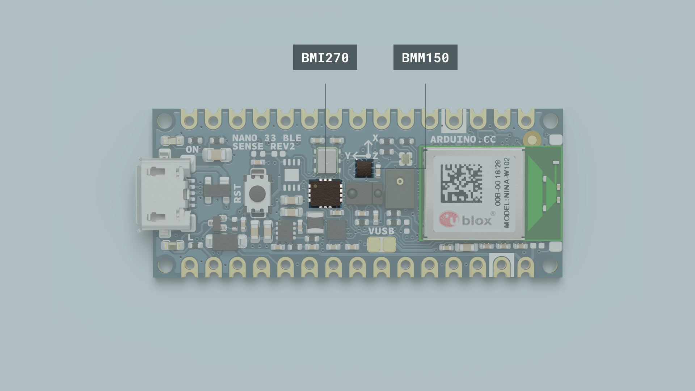

To access the data from the IMU system, you need to install the [BMI270_BMM150](https://github.com/arduino-libraries/Arduino_BMI270_BMM150) library, which comes with examples that can be used directly with the Nano 33 BLE Sense Rev2.

The Arduino BMI270_BMM150 library allows us to use the Arduino Nano 33 BLE Rev2 IMU system without having to go into complicated programming. The library takes care of the sensor initialization and sets its values as follows:

- Accelerometer range is set at [-4, +4]g -/+0.122 mg.
- Gyroscope range is set at [-2000, +2000] dps +/-70 mdps.
- Magnetometer range is set at [-400, +400] uT +/-0.014 uT.
- Accelerometer Output data rate is fixed at 104 Hz.
- Gyroscope Output data rate is fixed at 104 Hz.
- Magnetometer Output data rate is fixed at 20 Hz.

It can be installed directly from the library manager through the IDE of your choice. To use it, we need to include it at the top of the sketch:

```arduino
#include "Arduino_BMI270_BMM150.h"
```

And to initialize the library, we can use the following command inside `void setup()`.

```arduino
  if (!IMU.begin()) {
    Serial.println("Failed to initialize IMU!");
    while (1);
  }
```

#### Accelerometer

An accelerometer is an electromechanical device used to measure acceleration forces. Such forces may be static, like the continuous force of gravity or, as is the case with many mobile devices, dynamic to sense movement or vibrations.

The accelerometer data can be accessed through the following commands:

```arduino
  float x, y, z;

  if (IMU.accelerationAvailable()) {
    IMU.readAcceleration(x, y, z);
  }
```

The following example demonstrates basic access to the accelerometer:

```arduino
/*
  Arduino BMI270 - Simple Accelerometer

  This example reads the acceleration values from the BMI270
  sensor and continuously prints them to the Serial Monitor
  or Serial Plotter.

  The circuit:
  - Arduino Nano 33 BLE Sense Rev2

  created 10 Jul 2019
  by Riccardo Rizzo

  This example code is in the public domain.
*/

#include "Arduino_BMI270_BMM150.h"

void setup() {
  Serial.begin(9600);
  while (!Serial);
  Serial.println("Started");

  if (!IMU.begin()) {
    Serial.println("Failed to initialize IMU!");
    while (1);
  }

  Serial.print("Accelerometer sample rate = ");
  Serial.print(IMU.accelerationSampleRate());
  Serial.println(" Hz");
  Serial.println();
  Serial.println("Acceleration in G's");
  Serial.println("X\tY\tZ");
}

void loop() {
  float x, y, z;

  if (IMU.accelerationAvailable()) {
    IMU.readAcceleration(x, y, z);

    Serial.print(x);
    Serial.print('\t');
    Serial.print(y);
    Serial.print('\t');
    Serial.println(z);
  }
}
```

In order to get a correct reading of the board data, before uploading the sketch to the board hold the board in your hand, from the side of the USB port. The board should be facing up and "pointing" away from you. The image below illustrates the board's position and how it works:

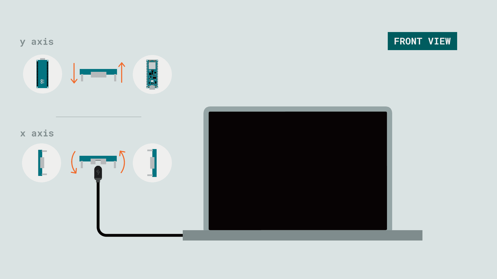

#### Gyroscope

A gyroscope sensor is a device that can measure and maintain the orientation and angular velocity of an object. Gyroscopes are more advanced than accelerometers, as they can measure the tilt and lateral orientation of an object, whereas an accelerometer can only measure its linear motion.

The gyroscope data can be accessed through the following commands:

```arduino
  float x, y, z;

  if (IMU.gyroscopeAvailable()) {
    IMU.readGyroscope(x, y, z);
  }
```

The following example demonstrates basic access to the gyroscope:

````arduino
/*
  Arduino BMI270 - Simple Gyroscope

  This example reads the gyroscope values from the BMI270
  sensor and continuously prints them to the Serial Monitor
  or Serial Plotter.

  The circuit:
  - Arduino Nano 33 BLE Sense Rev2

  created 10 Jul 2019
  by Riccardo Rizzo

  This example code is in the public domain.
*/

#include "Arduino_BMI270_BMM150.h"

void setup() {
  Serial.begin(9600);
  while (!Serial);
  Serial.println("Started");

  if (!IMU.begin()) {
    Serial.println("Failed to initialize IMU!");
    while (1);
  }
  Serial.print("Gyroscope sample rate = ");
  Serial.print(IMU.gyroscopeSampleRate());
  Serial.println(" Hz");
  Serial.println();
  Serial.println("Gyroscope in degrees/second");
  Serial.println("X\tY\tZ");
}

void loop() {
  float x, y, z;

  if (IMU.gyroscopeAvailable()) {
    IMU.readGyroscope(x, y, z);

    Serial.print(x);
    Serial.print('\t');
    Serial.print(y);
    Serial.print('\t');
    Serial.println(z);
  }
}
````

Now with the board parallel to the ground you can swiftly move it towards one direction: forward, backwards, right or left. According to the movement of your choice, the results will print every second to your monitor!

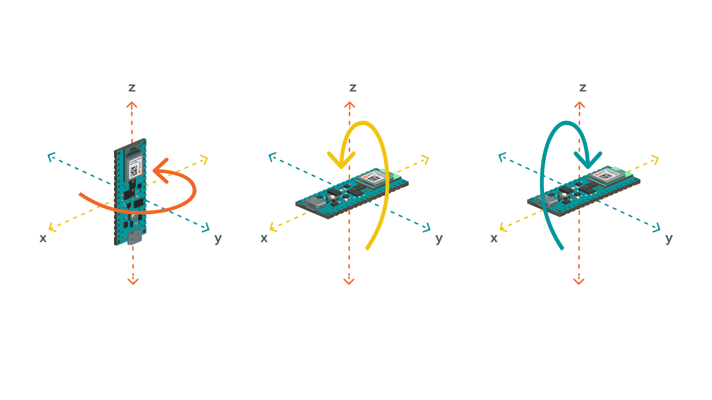

#### Magnetometer

A magnetometer is a device that measures magnetism, that is the direction, strength, or relative change of a magnetic field at a particular location.

The magnetometer data can be accessed through the following commands:

```arduino
  float x, y, z;

  IMU.readMagneticField(x, y, z);
```

The following example demonstrates basic access to the magnetometer:

```arduino
/*
  Arduino BMM150 - Simple Magnetometer

  This example reads the magnetic field values from the BMM150
  sensor and continuously prints them to the Serial Monitor
  or Serial Plotter.

  The circuit:
  - Arduino Nano 33 BLE Sense Rev2

  created 10 Jul 2019
  by Riccardo Rizzo

  This example code is in the public domain.
*/

#include "Arduino_BMI270_BMM150.h"

void setup() {
  Serial.begin(9600);
  while (!Serial);
  Serial.println("Started");

  if (!IMU.begin()) {
    Serial.println("Failed to initialize IMU!");
    while (1);
  }
  Serial.print("Magnetic field sample rate = ");
  Serial.print(IMU.magneticFieldSampleRate());
  Serial.println(" Hz");
  Serial.println();
  Serial.println("Magnetic Field in uT");
  Serial.println("X\tY\tZ");
}

void loop() {
  float x, y, z;

  if (IMU.magneticFieldAvailable()) {
    IMU.readMagneticField(x, y, z);

    Serial.print(x);
    Serial.print('\t');
    Serial.print(y);
    Serial.print('\t');
    Serial.println(z);
  }
}
```

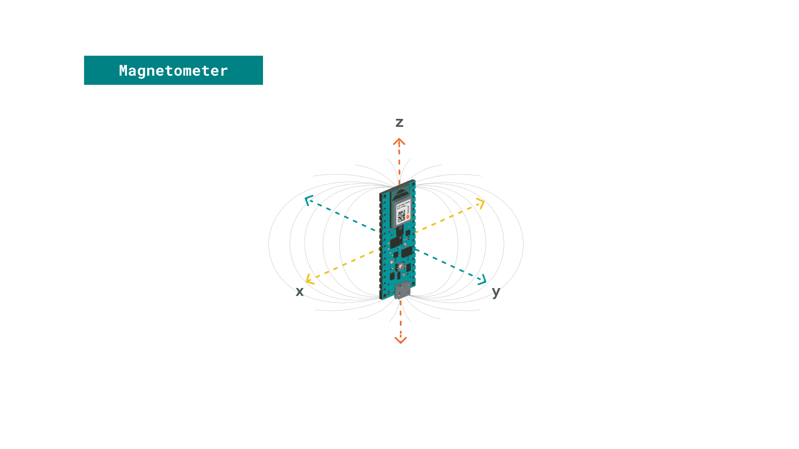

After you have successfully verified and uploaded the sketch to the board, it's time to put it to the test. You can choose an electric appliance at home or any object that runs with electrical current like a laptop charger to test it out.

If you want to learn more on how to use the IMU, please check out the tutorial below:

#### Tutorials 

- [Accessing IMU gyroscope data with Nano 33 BLE Sense Rev2](/tutorials/nano-33-ble-sense-rev2/imu-gyroscope)
- [Accessing IMU accelerometer data with Nano 33 BLE Sense Rev2](/tutorials/nano-33-ble-sense-rev2/imu-accelerometer)
- [Accessing IMU magnetometer data with Nano 33 BLE Sense Rev2](/tutorials/nano-33-ble-sense-rev2/imu-magnetometer)

### Proximity and Gesture Detection

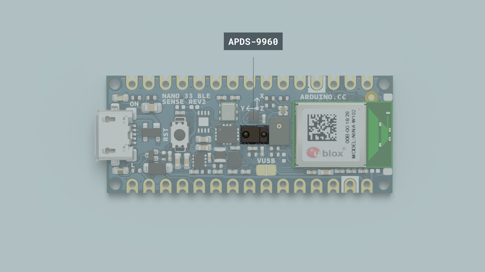

To access the data from the APDS9960 module, you need to install the [APDS9960](https://github.com/arduino-libraries/Arduino_APDS9960) library, which comes with examples that can be used directly with the Nano 33 BLE Sense Rev2.

It can be installed directly from the library manager through the IDE of your choice. To use it, we need to include it at the top of the sketch:

```arduino
#include <Arduino_APDS9960.h>
```

And to initialize the library, we can use the following command inside `void setup()`.

```arduino
if (!APDS.begin()) {
  Serial.println("Error initializing APDS9960 sensor!");
}
```

Then we check if there is data available from the proximity sensor. If there is we can print the value in the serial monitor. The value can range between 0-255, where 0 is close and 255 is far away. If it prints the value -1, it indicates an error.

```arduino
if (APDS.proximityAvailable()) {
  Serial.println(APDS.readProximity());
}
```

You can also check detect gestures with the same sensor, these gestures include UP, DOWN, LEFT and RIGHT gestures.

```arduino
if (APDS.gestureAvailable()) {
    int gesture = APDS.readGesture();
    switch (gesture) {
      case GESTURE_UP:
        Serial.println("Detected UP gesture");
        break;

      case GESTURE_DOWN:
        Serial.println("Detected DOWN gesture");
        break;

      case GESTURE_LEFT:
        Serial.println("Detected LEFT gesture");
        break;

      case GESTURE_RIGHT:
        Serial.println("Detected RIGHT gesture");
        break;

      default:
        // Ignore
        break;
    }
  }
```

Additionally to promiximity and gesture sensing, the sensor can detect colors.

```arduino
 if (APDS.colorAvailable()) {
    APDS.readColor(r, g, b);
  }
```

The following example demonstrates the full use of the proximity and gesture sensors, including RGB sensor:

```arduino
/*
  APDS-9960 - All sensor data from APDS-9960

  This example reads all data from the on-board APDS-9960 sensor of the
  Nano 33 BLE Sense:
   - color RGB (red, green, blue)
   - proximity
   - gesture
  and prints updates to the Serial Monitor every 100 ms.

  The circuit:
  - Arduino Nano 33 BLE Sense

  This example code is in the public domain.
*/

#include <Arduino_APDS9960.h>

void setup() {
  Serial.begin(9600);
  while (!Serial); // Wait for Serial Monitor to open

  if (!APDS.begin()) {
    Serial.println("Error initializing APDS-9960 sensor.");
    while (true); // Stop forever
  }
}

int proximity = 0;
int r = 0, g = 0, b = 0;
unsigned long lastUpdate = 0;

void loop() {

  // Check if a proximity reading is available.
  if (APDS.proximityAvailable()) {
    proximity = APDS.readProximity();
  }

  // Check if a gesture reading is available
  if (APDS.gestureAvailable()) {
    int gesture = APDS.readGesture();
    switch (gesture) {
      case GESTURE_UP:
        Serial.println("Detected UP gesture");
        break;

      case GESTURE_DOWN:
        Serial.println("Detected DOWN gesture");
        break;

      case GESTURE_LEFT:
        Serial.println("Detected LEFT gesture");
        break;

      case GESTURE_RIGHT:
        Serial.println("Detected RIGHT gesture");
        break;

      default:
        // Ignore
        break;
    }
  }

  // Check if a color reading is available
  if (APDS.colorAvailable()) {
    APDS.readColor(r, g, b);
  }

  // Print updates every 100 ms
  if (millis() - lastUpdate > 100) {
    lastUpdate = millis();
    Serial.print("PR=");
    Serial.print(proximity);
    Serial.print(" RGB=");
    Serial.print(r);
    Serial.print(",");
    Serial.print(g);
    Serial.print(",");
    Serial.println(b);
  }
}
```

#### Tutorials

If you want to learn more on how to use the proximity sensor, please check out the tutorial below:

- [Proximity Detection with the Nano 33 BLE Sense](https://docs.arduino.cc/tutorials/nano-33-ble-sense/proximity_sensor)
- [Gesture Recognition with the Nano 33 BLE Sense](https://docs.arduino.cc/tutorials/nano-33-ble-sense/gesture_sensor)

### Temperature and Humidity

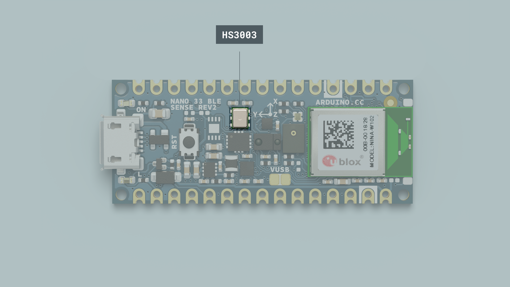

Temperature sensors are components that convert physical temperature into digital data. Likewise, humidity sensors are able to measure atmospheric moisture levels and translate that into electrical signal. As such, temperature and humidity sensors are essential for environmental monitoring especially in and around sensitive electronic equipment.

The HS3003 is an ultra-compact sensor for relative humidity and temperature. We will use the I2C protocol to communicate with the sensor and get data from it. The sensor's range of different values are the following:

- Humidity accuracy: ± 3.5% rH, 20 to +80% rH
- Humidity range: 0 to 100 %
- Temperature accuracy: ± 0.5 °C,15 to +40 °C
- Temperature range: -40 to 120°C

To access the data from the HS3003 module, we need to install the [Arduino_HS300x](https://github.com/arduino-libraries/Arduino_HS300x) library, which comes with examples that can be used directly with the Nano 33 BLE Sense Rev2.

It can be installed directly from the library manager through the IDE of your choice. To use it, you need to include it at the top of the sketch:

```arduino
#include <Arduino_HS300x.h>
```

And to initialize the library, we can use the following command inside `void setup()`.

```arduino
if (!HS300x.begin()) {
  Serial.println("Failed to initialize humidity temperature sensor!");
}
```

Then we can print our values in the serial monitor to check the temperature and humidity values.

```arduino
Serial.println(HS300x.readTemperature());
Serial.println(HS300x.readHumidity());
```

The following example allows you to read the temperature in degrees Celsius and the relative humidity:

```arduino
/*
  HS300x - Read Sensors

  This example reads data from the on-board HS300x sensor of the
  Nano 33 BLE Sense and prints the temperature and humidity sensor
  values to the Serial Monitor once a second.

  The circuit:
  - Arduino Nano 33 BLE Sense R2

  This example code is in the public domain.
*/

#include <Arduino_HS300x.h>

void setup() {
  Serial.begin(9600);
  while (!Serial);

  if (!HS300x.begin()) {
    Serial.println("Failed to initialize humidity temperature sensor!");
    while (1);
  }
}

void loop() {
  // read all the sensor values
  float temperature = HS300x.readTemperature();
  float humidity    = HS300x.readHumidity();

  // print each of the sensor values
  Serial.print("Temperature = ");
  Serial.print(temperature);
  Serial.println(" °C");

  Serial.print("Humidity    = ");
  Serial.print(humidity);
  Serial.println(" %");

  // print an empty line
  Serial.println();

  // wait 1 second to print again
  delay(1000);
}
```

After you have successfully verified and uploaded the sketch to the board, open the Serial Monitor. You will now see the new values printed. If you want to test out whether it is working, you could slightly breathe (exhale) on your board and watch new values when the humidity, as well as the temperature, levels rise or decrease.

#### Tutorial

If you want to learn more on how to use the temperature and humidity sensor, please check out the tutorial below:

- [Reading Temperature & Humidity on Nano 33 BLE Sense Rev2](/tutorials/nano-33-ble-sense-rev2/humidity-and-temperature-sensor)

### Pressure

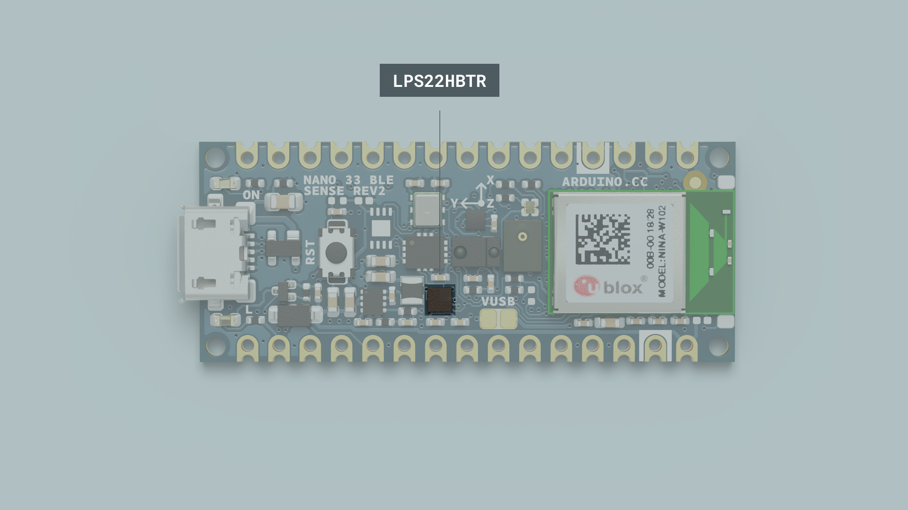

To access the data from the LPS22HB module, we need to install the [LPS22HB](https://github.com/arduino-libraries/Arduino_LPS22HB) library, which comes with examples that can be used directly with the Nano 33 BLE Sense Rev2.

It can be installed directly from the library manager through the IDE of your choice. To use it, we need to include it at the top of the sketch:

```arduino
#include <Arduino_LPS22HB.h>
```

And to initialize the library, we can use the following command inside `void setup()`.

```arduino
if (!BARO.begin()) {
  Serial.println("Failed to initialize pressure sensor!");
}
```

Then we can read the values from the sensor using the code below.

```arduino
BARO.readPressure();
```

The following example allows you to read the temperature in degrees Celsius and the pressure from the LPS22HB sensor:

```arduino
/*
  LPS22HB - Read Pressure

  This example reads data from the on-board LPS22HB sensor of the
  Nano 33 BLE Sense and prints the temperature and pressure sensor
  value to the Serial Monitor once a second.

  The circuit:
  - Arduino Nano 33 BLE Sense

  This example code is in the public domain.
*/

#include <Arduino_LPS22HB.h>

void setup() {
  Serial.begin(9600);
  while (!Serial);

  if (!BARO.begin()) {
    Serial.println("Failed to initialize pressure sensor!");
    while (1);
  }
}

void loop() {
  // read the sensor value
  float pressure = BARO.readPressure();

  // print the sensor value
  Serial.print("Pressure = ");
  Serial.print(pressure);
  Serial.println(" kPa");

  float temperature = BARO.readTemperature();

  // print the sensor value
  Serial.print("Temperature = ");
  Serial.print(temperature);
  Serial.println(" C");

  // print an empty line
  Serial.println();

  // wait 1 second to print again
  delay(1000);
}
```

After you have successfully verified and uploaded the sketch to the board, open the Serial Monitor. In order to test out the code, you could begin by stabilizing your board on a fixed position and observe the values returned through the Serial Monitor. If you are living in an apartment block, you could experiment further and move to different floors and notice the changes in altitude values.

#### Tutorial

If you want to learn more on how to use the temperature and humidity sensor, please check out the tutorial below:

- [Access Barometric Pressure Sensor Data on Nano 33 BLE Sense Rev2](/tutorials/nano-33-ble-sense-rev2/barometric-sensor)

### Microphone

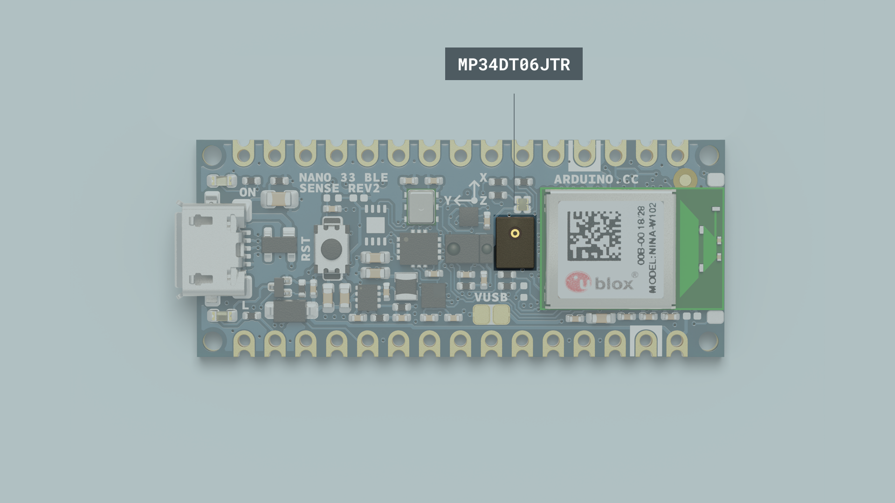

To access the data from the MP34DT06JTR, we need to use the [PDM](https://www.arduino.cc/en/Reference/PDM) library that is included in the **Arduino Mbed OS Nano Board package**. If the Board Package is installed, you will find an example that works by browsing **File > Examples > PDM > PDMSerialPlotter**. 

***Please note: The sampling frequency in the PDMSerialPlotter example is set to 16000 Hz. If the microphone appears to not be working (monitor is printing a value of -128), try to change this rate to 20000 Hz. You can change this at the top of the PDMSerialPlotter example sketch.***

```arduino
static const int frequency = 20000; //frequency at 20 KHz instead of 16 KHz
```

### Tutorial

If you want to learn more on how to use the Microphone, please check out the tutorial below:

- [Controlling the On-Board RGB LED with Microphone](https://docs.arduino.cc/tutorials/nano-33-ble-sense/microphone_sensor)

## Connectivity

The Nano 33 BLE Sense Rev2 supports Bluetooth® through the [u-blox NINA-B306](https://docs.arduino.cc/resources/datasheets/NINA-B3-series.pdf) module. To use this module, we can use the [ArduinoBLE](https://www.arduino.cc/en/Reference/ArduinoBLE) library. 

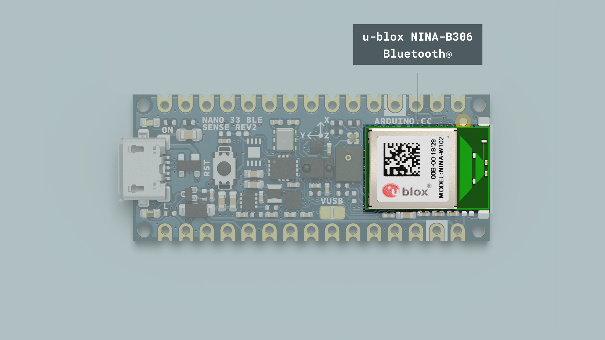

### Bluetooth®

To enable Bluetooth® on the Nano 33 BLE Sense Rev2, we can use the [ArduinoBLE](https://www.arduino.cc/en/Reference/ArduinoBLE) library, and include it at the top of our sketch:

```arduino
#include <ArduinoBLE.h>
```

Set the service and characteristic:

```arduino
BLEService ledService("180A"); // BLE LED Service
BLEByteCharacteristic switchCharacteristic("2A57", BLERead | BLEWrite);
```

Set advertised name and service:

```arduino
  BLE.setLocalName("Nano 33 BLE Sense Rev2");
  BLE.setAdvertisedService(ledService);
```

Start advertising:

```arduino
BLE.advertise();
```

Listen for Bluetooth® Low Energy peripherals to connect:

```arduino  
BLEDevice central = BLE.central();
```

### Tutorials

- [Controlling Nano 33 BLE Sense Rev2 RGB LED via Bluetooth®](/tutorials/nano-33-ble-sense/bluetooth)

## Support

If you encounter any issues or have questions while working with your Nano 33 BLE Sense Rev2 board, we provide various support resources to help you find answers and solutions.

### Help Center

Explore our Help Center, which offers a comprehensive collection of articles and guides for Nano family boards. The Help Center is designed to provide in-depth technical assistance and help you make the most of your device.

- [Nano family help center page](https://support.arduino.cc/hc/en-us/sections/360004605400-Nano-Family)

### Forum

Join our community forum to connect with other Nano family board users, share your experiences, and ask questions. The Forum is an excellent place to learn from others, discuss issues, and discover new ideas and projects related to the Nano 33 BLE Sense Rev2.

- [Nano category in the Arduino Forum](https://forum.arduino.cc/c/official-hardware/nano-family/87)

### Contact Us

Please get in touch with our support team if you need personalized assistance or have questions not covered by the help and support resources described before. We're happy to help you with any issues or inquiries about the Nano family boards.

- [Contact us page](https://www.arduino.cc/en/contact-us/)