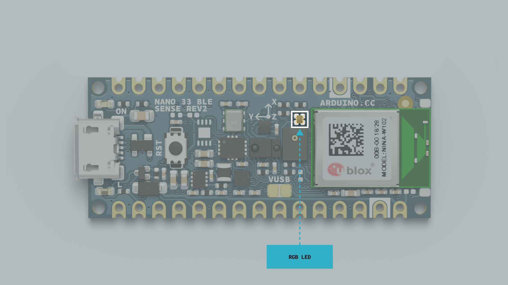
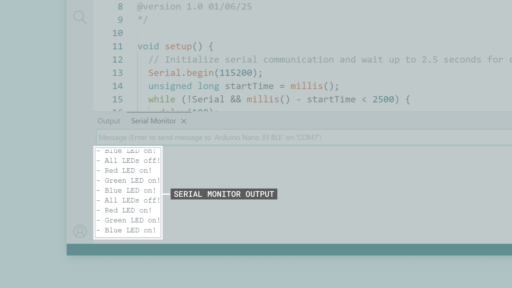
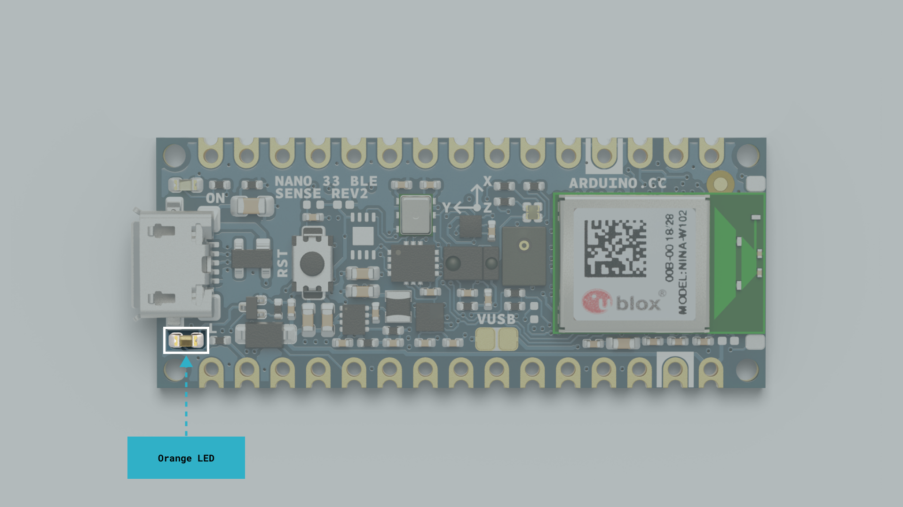
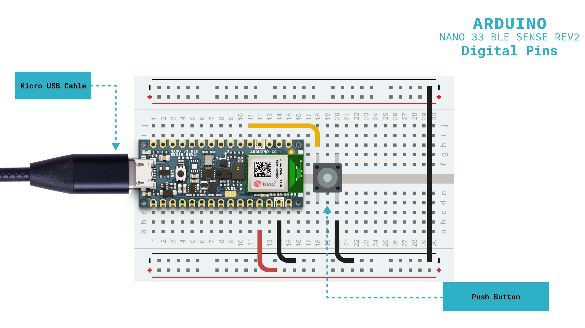

This user manual provides a comprehensive overview of the Nano 33 BLE Sense Rev2 board, highlighting its hardware and software elements. With it, you will learn how to set up, configure and use all the main features of the Nano 33 BLE Sense Rev2 board.


### Hardware Requirements

- [Nano 33 BLE Sense Rev2](https://store.arduino.cc/products/nano-33-ble-sense-rev2-with-headers) (x1)
- [Micro-USB cable](https://store.arduino.cc/products/usb-2-0-cable-type-a-micro) (x1)
- [Breadboard](https://store.arduino.cc/products/breadboard-400-contacts) (x1) (recommended)
- [Male/male jumper wires](https://store.arduino.cc/products/jumper-wires) (recommended)

### Software Requirements

- [Arduino IDE 2.0+](https://www.arduino.cc/en/software) or [Arduino Web Editor](https://create.arduino.cc/editor)
- [Arduino Mbed OS Nano Boards core](https://github.com/arduino/ArduinoCore-mbed)

***The Nano 33 BLE Sense Rev2 is compatible with the complete Arduino ecosystem and can be programmed directly as a standalone device.***

## Nano 33 BLE Sense Rev2 Overview

The Nano 33 BLE Sense Rev2 board represents an evolution in the Nano family, combining the powerful nRF52840 microcontroller from Nordic Semiconductor with an extensive array of onboard sensors in the compact and familiar Nano form factor. This board is designed to facilitate rapid prototyping of IoT applications, machine learning projects, and sensor-based systems that require Bluetooth® Low Energy connectivity.


The Nano 33 BLE Sense Rev2 includes a high-performance 32-bit microcontroller (nRF52840), expanded connectivity through Bluetooth® 5 Low Energy, and an extensive sensor suite including a 9-axis IMU, environmental sensors, and a digital microphone. Its compact dimensions (18 mm x 45 mm) and robust construction make this board an excellent choice for wearable devices, environmental monitoring stations, and edge AI applications.

### Nano 33 BLE Sense Rev2 Architecture Overview

The Nano 33 BLE Sense Rev2 board features a secure, certified and feature-rich design that suits various applications, from environmental monitoring and motion detection to machine learning inference and wireless sensor networks.

The top view of the Nano 33 BLE Sense Rev2 board is shown in the image below:


The bottom view of the Nano 33 BLE Sense Rev2 board is shown in the image below:


***The bottom side of the Nano 33 BLE Sense Rev2 board features the VUSB jumper pads for enabling the `5V` pin, along with the board's certification markings and identification information (board model and SKU).***

Here is an overview of the board's main components shown in the images above:

- **Microcontroller**: At the heart of the Nano 33 BLE Sense Rev2 board there is a Nordic Semiconductor nRF52840 ([nRF52840 datasheet](https://docs.nordicsemi.com/bundle/ps_nrf52840/page/keyfeatures_html5.html)). This single-chip microcontroller is based on a 64 MHz Arm® Cortex®-M4 core with FPU, featuring 1 MB of flash memory and 256 KB of SRAM memory.
- **Wireless Connectivity**: The board features integrated Bluetooth® 5 Low Energy connectivity through the [u-blox NINA-B306](https://content.u-blox.com/sites/default/files/NINA-B3_DataSheet_UBX-17052099.pdf?utm_content=UBX-17052099) module, enabling wireless communication with smartphones, tablets, and other Bluetooth-enabled devices with an effective range of up to 100 meters in open space.
- **9-axis IMU System**: The board integrates a sophisticated Inertial Measurement Unit consisting of the [BMI270](https://www.bosch-sensortec.com/media/boschsensortec/downloads/datasheets/bst-bmi270-ds000.pdf) 6-axis accelerometer/gyroscope and the [BMM150](https://www.bosch-sensortec.com/media/boschsensortec/downloads/datasheets/bst-bmm150-ds001.pdf) 3-axis magnetometer, providing precise motion tracking and orientation sensing capabilities.
- **Environmental Sensors**: The Nano 33 BLE Sense Rev2 includes multiple environmental sensors. The [HS3003](https://www.renesas.com/en/document/dst/hs3xxx-datasheet) provides temperature and humidity sensing with ±0.5°C and ±3.5% RH accuracy. The [LPS22HB](https://www.st.com/content/ccc/resource/technical/document/datasheet/bf/c1/4f/23/61/17/44/8a/DM00140895.pdf/files/DM00140895.pdf/jcr:content/translations/en.DM00140895.pdf) barometric pressure sensor enables altitude estimation and weather monitoring. The [APDS-9960](https://docs.broadcom.com/doc/AV02-4191EN) offers proximity, ambient light, RGB color, and gesture detection capabilities in a single package.
- **Digital Microphone**: The [MP34DT06JTR](https://www.st.com/resource/en/datasheet/mp34dt06j.pdf) omnidirectional MEMS microphone enables audio sensing applications with a 64 dB signal-to-noise ratio and -26 dBFS sensitivity.
- **Micro-USB Connector**: The Nano 33 BLE Sense Rev2 features a Micro-USB connector for programming, power supply, and serial communication with external devices.
- **Programmable RGB LED**: The board has an onboard user-programmable RGB LED to provide visual feedback about different operating states and sensor readings.
- **User LED**: In addition to the onboard user-programmable RGB LED, the board also includes an additional onboard user-programmable orange LED for basic status indications.
- **Castellated Pins**: The board's castellated pins allow surface mounting as a module, facilitating integration into custom PCB designs for production-ready applications.

### Board Core and Libraries

The **Arduino Mbed OS Nano Boards** core contains the libraries and examples to work with the Arduino Nano 33 BLE Sense Rev2's peripherals and onboard components. This comprehensive package includes support for the nRF52840 microcontroller, all onboard sensors, Bluetooth® Low Energy communication, and the programmable LEDs.

To install the core for the Nano 33 BLE Sense Rev2 board, navigate to **Tools > Board > Boards Manager** or click the **Boards Manager** icon in the left tab of the IDE. In the Boards Manager tab, search for `Arduino Mbed OS Nano` and install the latest version.


The Arduino Mbed OS Nano Boards core provides support for the following:

- **Board Control and Configuration**: Reset functionality, pin configuration, and power management through Mbed OS
- **Communication Interfaces**: UART, I²C, SPI, and PDM (Pulse Density Modulation) for microphone
- **Onboard LED Control**: RGB LED and orange LED control with PWM support
- **USB HID Capabilities**: Keyboard and mouse emulation through PluggableUSBHID library
- **Bluetooth® Low Energy**: Through the ArduinoBLE library (installed separately)
- **Real-Time Operating System**: Mbed OS RTOS features including threads and semaphores
- **Standard Arduino Libraries**: Full compatibility with Arduino API and functions

***__Important note:__ Sensor libraries for the onboard sensors (`BMI270_BMM150`, `Arduino_HS300x`, `Arduino_APDS9960`, `Arduino_LPS22HB`) must be installed separately through the Arduino IDE Library Manager. __They are not included in the core itself__.***

### Pinout


The full pinout is available and downloadable as PDF from the link below:

- [Nano 33 BLE Sense Rev2 pinout](https://docs.arduino.cc/resources/pinouts/ABX00069-full-pinout.pdf)

### Datasheet

The complete datasheet is available and downloadable as PDF from the link below:

- [Nano 33 BLE Sense Rev2 datasheet](https://docs.arduino.cc/resources/datasheets/ABX00069-datasheet.pdf)

### Schematics

The complete schematics are available and downloadable as PDF from the link below:

- [Nano 33 BLE Sense Rev2 schematics](https://docs.arduino.cc/resources/schematics/ABX00069-schematics.pdf)

### STEP Files

The complete STEP files are available and downloadable from the link below:

- [Nano 33 BLE Sense Rev2 STEP files](https://docs.arduino.cc/static/505dd72b2343c79c2d0442e0b7469f3c/ABX00069-step-files.zip)

## First Use

### Unboxing the Product

When opening the Nano 33 BLE Sense Rev2 box, you will find the board and its corresponding documentation. **The Nano 33 BLE Sense Rev2 does not include additional cables**, so you will need a USB Micro cable ([available separately here](https://store.arduino.cc/products/usb-2-0-cable-type-a-micro)) to connect the board to your computer.


The Nano 33 BLE Sense Rev2 is a standalone device that can be programmed directly without requiring additional boards. However, for more complex projects, you can easily combine it with Arduino shields compatible with the Nano family or connect it wirelessly to other devices through its onboard Bluetooth® Low Energy capability.

### Connecting the Board

The Nano 33 BLE Sense Rev2 can be connected to your computer using its onboard USB Micro connector. It can also be integrated into larger projects using the following:

- **Direct USB Micro connection**: For programming, power supply and serial communication with a computer
- **Pin connection**: For integration into breadboards or custom PCBs
- **Bluetooth® Low Energy connection**: For wireless communication with smartphones, tablets, and other BLE-enabled devices
- **Module mounting**: Using the board's castellated pins for direct soldering to PCBs

***__Important note:__ The Nano 33 BLE Sense Rev2 operates at +3.3 VDC natively. __When connecting sensors or modules that operate at +5 VDC, you must use level shifters to avoid permanent damage to the board__. All digital and analog pins are NOT +5 VDC tolerant.***

### Powering the Board

The Nano 33 BLE Sense Rev2 board can be powered in several ways:

- **Via USB Micro connector**: The most common method during development and programming
- **Via `VIN` pin**: Using an external +5 - 21 VDC power supply that will be internally regulated to +3.3 VDC
- **Via `3V3` pin**: Directly connecting a regulated +3.3 VDC source (with caution)
- **Via `VUSB` pin**: Only when the `VUSB` jumper is soldered (see 5V Pin section)


***__Important note:__ The Nano 33 BLE Sense Rev2's `VIN` pin accepts a voltage range of +5-21 VDC. Do not connect voltages outside this range as you could permanently damage the board. Always verify all connections before applying power.***

#### 5V Pin Configuration

**The Nano 33 BLE Sense Rev2 board operates at +3.3 VDC**, which means y**ou must never apply more than +3.3 VDC to its digital and analog pins**. To maintain compatibility with existing Nano projects while protecting the board, the `5V` pin (positioned between the `RST` and `A7` pins) is not connected by default.

To enable the `5V` pin, two conditions must be met:

1. **Solder the `VUSB` jumper pads**: Connect either the top or bottom pair of `VUSB` pads on the board
2. **Power via USB**: The board must be powered through the USB connector


***__Important safety note:__ Even with the `5V` pin enabled, remember that all I/O pins still operate at +3.3 VDC and are NOT +5 VDC tolerant. The `5V` pin is only for powering external +5 VDC devices, not for input signals to the board.***

### Hello World Example

Let's program the Nano 33 BLE Sense Rev2 to reproduce the classic `Hello World` example used in the Arduino ecosystem: the `Blink` sketch. We will use this example to verify that the Nano 33 BLE Sense Rev2's connection to the computer works correctly, that the Arduino IDE is properly configured, and that both the board and development environment function as expected.

First, connect your Nano 33 BLE Sense Rev2 board to your computer using a USB Micro cable, open the Arduino IDE, and make sure that the board is connected correctly. If you are new to the Arduino IDE, please refer to the official Arduino documentation for more detailed information about initial setup. Copy and paste the following example sketch into a new Arduino IDE file:

```arduino
/**
Blink Example for the Arduino Nano 33 BLE Sense Rev2 Board
Name: nano_33_ble_sense_rev2_blink.ino
Purpose: This sketch demonstrates how to blink the built-in
user LED of the Arduino Nano 33 BLE Sense Rev2 board.

@author Arduino Product Experience Team
@version 1.0 01/06/25
*/

// Built-in LED pin
#define LED_PIN LED_BUILTIN

void setup() {
  // Initialize serial communication and wait up to 2.5 seconds for connection
  Serial.begin(115200);
  unsigned long startTime = millis();
  while (!Serial && millis() - startTime < 2500) {
    delay(100);
  }
  
  // Configure LED pin as output
  pinMode(LED_PIN, OUTPUT);
  
  // Startup message
  Serial.println("- Arduino Nano 33 BLE Sense Rev2 - Blink Example started...");
}

void loop() {
  // Turn on the LED, wait 1 second
  digitalWrite(LED_PIN, HIGH);
  Serial.println("- LED on!");
  delay(1000);
  
  // Turn off the LED, wait 1 second
  digitalWrite(LED_PIN, LOW);
  Serial.println("- LED off!");
  delay(1000);  
}
```

To upload the sketch to the board, click the **Verify** button to compile the sketch and check for errors, then click the **Upload** button to program the device with the sketch.


You should see the built-in orange user LED of your Nano 33 BLE Sense Rev2 board turn on for one second, then turn off for one second, repeating this cycle continuously. 


Additionally, you can open the Arduino IDE's Serial Monitor (Tools > Serial Monitor) to see the status messages that the example sketch sends each time the LED state changes.


This example confirms the following:

- The Nano 33 BLE Sennse board is correctly connected
- The Arduino IDE is properly configured
- The board is functioning correctly
- USB communication is working
- Digital pins respond to commands

Congratulations! You have successfully completed your first program on the Nano 33 BLE Sense board. You are now ready to explore the more advanced features of this tiny but powerful board.

## LEDs

This user manual section covers the Nano 33 BLE Sense Rev2 board built-in LEDs, showing their main hardware and software characteristics.

### RGB LED

The Nano 33 BLE Sense Rev2 board features a built-in RGB LED that can be used as a visual feedback indicator for the user.



The built-in RGB LED can be accessed through the following macro definitions:

| **Built-in LED** | **Macro Definition** | **Microcontroller Pin** |
| :--------------: | :------------------: | :---------------------: |
|     Red LED      |        `LEDR`        |         `P0.24`         |
|    Green LED     |        `LEDG`        |         `P0.16`         |
|     Blue LED     |        `LEDB`        |         `P0.06`         |

***The built-in RGB LED on the Nano 33 BLE Sense Rev2 uses __inverted logic__. This means that a voltage level of `LOW` on each of their pins will turn the specific color of the LED on, and a voltage level of `HIGH` will turn them off.***

The following example sketch controls each of the RGB LED colors at an interval of 500 ms:

```arduino
/**
RGB LED Example for the Arduino Nano 33 BLE Sense Rev2 Board
Name: nano_33_ble_sense_rev2_rgb_led.ino
Purpose: This sketch demonstrates how to control the built-in
RGB LED of the Arduino Nano 33 BLE Sense Rev2 board.

@author Arduino Product Experience Team
@version 1.0 01/06/25
*/

void setup() {
  // Initialize serial communication and wait up to 2.5 seconds for connection
  Serial.begin(115200);
  unsigned long startTime = millis();
  while (!Serial && millis() - startTime < 2500) {
    delay(100);
  }
  
  // Initialize LEDR, LEDG and LEDB as outputs
  pinMode(LEDR, OUTPUT);
  pinMode(LEDG, OUTPUT);
  pinMode(LEDB, OUTPUT);
  
  // Turn off all LEDs initially (HIGH = OFF for inverted logic)
  digitalWrite(LEDR, HIGH);
  digitalWrite(LEDG, HIGH);
  digitalWrite(LEDB, HIGH);
  
  Serial.println("- Arduino Nano 33 BLE Sense Rev2 - RGB LED Example started...");
}

void loop() {
  // Turn on the built-in red LED and turn off the rest
  digitalWrite(LEDR, LOW);   // ON
  digitalWrite(LEDG, HIGH);  // OFF
  digitalWrite(LEDB, HIGH);  // OFF
  Serial.println("- Red LED on!");
  delay(500);
  
  // Turn on the built-in green LED and turn off the rest
  digitalWrite(LEDR, HIGH);  // OFF
  digitalWrite(LEDG, LOW);   // ON
  digitalWrite(LEDB, HIGH);  // OFF
  Serial.println("- Green LED on!");
  delay(500);
  
  // Turn on the built-in blue LED and turn off the rest
  digitalWrite(LEDR, HIGH);  // OFF
  digitalWrite(LEDG, HIGH);  // OFF
  digitalWrite(LEDB, LOW);   // ON
  Serial.println("- Blue LED on!");
  delay(500);
  
  // Turn off all LEDs
  digitalWrite(LEDR, HIGH);  // OFF
  digitalWrite(LEDG, HIGH);  // OFF
  digitalWrite(LEDB, HIGH);  // OFF
  Serial.println("- All LEDs off!");
  delay(500);
}
```

You should now see the built-in RGB LED cycling through red, green, and blue colors, followed by a brief moment with all LEDs off, repeating this pattern continuously.


Additionally, you can open the Arduino IDE's Serial Monitor (Tools > Serial Monitor) to see the status messages that the example sketch sends each time the RGB LEDs state changes.



### Orange LED

The Nano 33 BLE Sense Rev2 also features a built-in orange user LED that can be used for basic status indications and debugging purposes.



The built-in user LED can be accessed through the following macro definition:

| **Built-in LED** | **Macro Definition** | **Microcontroller Pin** |
| :--------------: | :------------------: | :---------------------: |
| Orange User LED  |    `LED_BUILTIN`     |         `P0.13`         |

***Unlike the RGB LED, the built-in orange user LED on the Nano 33 BLE Sense Rev2 operates with standard logic levels. This means that a voltage level of `HIGH` will turn the LED on, and a voltage level of `LOW` will turn it off.***

The following example sketch demonstrates how to control the built-in user LED:

```arduino
/**
User LED Example for the Arduino Nano 33 BLE Sense Rev2 Board
Name: nano_33_ble_sense_rev2_user_led.ino
Purpose: This sketch demonstrates how to control the built-in
orange user LED of the Arduino Nano 33 BLE Sense Rev2 board.

@author Arduino Product Experience Team
@version 1.0 01/06/25
*/

void setup() {
  // Initialize serial communication and wait up to 2.5 seconds for connection
  Serial.begin(115200);
  unsigned long startTime = millis();
  while (!Serial && millis() - startTime < 2500) {
    delay(100);
  }
  
  // Configure LED_BUILTIN pin as output
  pinMode(LED_BUILTIN, OUTPUT);
  
  // Turn off LED initially
  digitalWrite(LED_BUILTIN, LOW);
  
  Serial.println("- Arduino Nano 33 BLE Sense Rev2 - User LED Example started...");
}

void loop() {
  // Turn on the built-in user LED
  digitalWrite(LED_BUILTIN, HIGH);
  Serial.println("- User LED on!");
  delay(1000);
  
  // Turn off the built-in user LED
  digitalWrite(LED_BUILTIN, LOW);
  Serial.println("- User LED off!");
  delay(1000);
}
```

You should now see the built-in orange user LED blinking on and off at 1-second intervals, repeating this pattern continuously.


Additionally, you can open the Arduino IDE's Serial Monitor (Tools > Serial Monitor) to see the status messages that the example sketch sends each time the user LED state changes


## Pins

This user manual section provides comprehensive information about the Nano 33 BLE Sense Rev2's pin capabilities and functionality. Understanding the board's pins capabilities and configurations is important for making the most of your projects with the Nano 33 BLE Sense Rev2 board.

### Pins Overview

The Nano 33 BLE Sense Rev2 features a total of **20 accessible pins** arranged in the classic Nano form factor, maintaining compatibility with existing Nano shields and breadboard layouts. These pins provide various functionalities including digital I/O, analog input, PWM output and several communication protocols.


### Pins Specifications and Characteristics

The Nano 33 BLE Sense Rev2's pins are organized into the following categories:

|   **Pin Type**   | **Count** |      **Pin Numbers**      |           **Primary Functions**            |
| :--------------: | :-------: | :-----------------------: | :----------------------------------------: |
| **Digital Pins** |    14     |       `D0` - `D13`        |    Digital I/O, PWM (12 pins), SPI, UART    |
| **Analog Pins**  |     8     |        `A0` - `A7`        | Analog input, Digital I/O, I²C |
|  **Power Pins**  |     5     | `VIN`, `5V`, `3V3`, `GND`, `VUSB` |          Power supply and ground           |
| **Special Pins** |     2     |     `RESET`, `AREF`       |         System control and reference          |

The Nano 33 BLE Sense Rev2 board offers several advanced pin capabilities including multi-function pins that can serve multiple purposes depending on your project needs, native +3.3 VDC operation throughout all pins, internal pull-up resistors on all digital pins, and interrupt capability on all digital pins for event-driven programming.

The following table shows the electrical specifications and operating limits for all pins on the Nano 33 BLE Sense Rev2 board:

|    **Specification**    |  **Value**   |            **Notes**             |
| :---------------------: | :----------: | :------------------------------: |
|  **Operating Voltage**  |   +3.3 VDC   | Logic level for all digital pins |
| **Input Voltage Range** | 0 - +3.3 VDC |     **NOT** +5 VDC tolerant      |
| **Max Current per Pin** |     15 mA    |    Source/sink current limit     |
|  **Max Total Current**  |    200 mA    |  Combined current for all pins   |
|  **Analog Reference**   |   +3.3 VDC   |      Default `AREF` voltage      |

***__Critical safety warning:__ The Nano 33 BLE Sense Rev2 operates at +3.3 VDC and its pins are NOT +5 VDC tolerant. Applying voltages above +3.3 VDC to any I/O pin will permanently damage the board. Always use level shifters when interfacing with +5 VDC devices. This is a fundamental difference from the classic Arduino Nano which operates at +5 VDC.***

### Digital Pins

The Nano 33 BLE Sense Rev2 features 14 digital pins (`D0` to `D13`) that can be configured as either digital inputs or digital outputs. These pins operate at +3.3 VDC logic levels and can source or sink up to 15 mA of current per pin. Digital pins are the foundation of most Arduino projects, allowing you to control LEDs, read button states, interface with sensors and communicate with other devices.

The Nano 33 BLE Sense Rev2 digital pins provide the following functionality:

| **Arduino Pin** | **Microcontroller Pin** | **Additional Functions** | **Special Features** |
| :-------------: | :---------------------: | :----------------------: | :------------------: |
|      `D0`       |         `P1.03`         |         UART TX          | Serial communication |
|      `D1`       |         `P1.10`         |         UART RX          | Serial communication |
|      `D2`       |         `P1.11`         |           PWM            |  Interrupt capable   |
|      `D3`       |         `P1.12`         |           PWM            |  Interrupt capable   |
|      `D4`       |         `P1.15`         |           PWM            |  Interrupt capable   |
|      `D5`       |         `P1.13`         |           PWM            |  Interrupt capable   |
|      `D6`       |         `P1.14`         |           PWM            |  Interrupt capable   |
|      `D7`       |         `P0.23`         |           PWM            |  Interrupt capable   |
|      `D8`       |         `P0.21`         |           PWM            |  Interrupt capable   |
|      `D9`       |         `P0.27`         |           PWM            |  Interrupt capable   |
|      `D10`      |         `P1.02`         |       SPI CS, PWM        |  SPI communication   |
|      `D11`      |         `P1.01`         |      SPI MOSI, PWM       |  SPI communication   |
|      `D12`      |         `P1.08`         |      SPI MISO, PWM       |  SPI communication   |
|      `D13`      |         `P0.13`         |   SPI SCK, PWM, LED      |  SPI + Built-in LED  |

***__Important note:__ Pins `D0` and `D1` are used for serial communication (UART) and should be avoided for general digital I/O when using Serial communication. Pins `D10`, `D11`, `D12` and `D13` are used for SPI communication. Pin `D13` is also connected to the built-in orange LED.***

The Nano 33 BLE Sense Rev2's digital pins offer the following specifications:

|  **Specification**   |   **Value**    |           **Notes**           |
| :------------------: | :------------: | :---------------------------: |
|    Logic Voltage     |    +3.3 VDC    | `HIGH` and `LOW` logic levels |
|    Input Voltage     | 0 to +3.3 VDC  |   **NOT** +5V tolerant       |
| Max Current (Source) |     15 mA      |    Per pin source current     |
|  Max Current (Sink)  |     15 mA      |     Per pin sink current      |
|  Total Max Current   |     200 mA     |     Combined for all pins     |
|   Input Resistance   |    11-13 kΩ    |   Internal pull-up resistor   |
|    Digital `HIGH`    | +2.0 to +3.3 VDC |  Minimum voltage for `HIGH`   |
|    Digital `LOW`     | 0 to +0.8 VDC  |   Maximum voltage for `LOW`   |

Digital pins can be configured and controlled using the following basic Arduino functions.

You can configure a pin's mode using the `pinMode()` function:

```arduino
pinMode(pin, mode);
```

To write a digital value to an output pin, use the `digitalWrite()` function:

```arduino
digitalWrite(pin, value);
```

To read the state of a digital input pin, use the `digitalRead()` function:

```arduino
digitalRead(pin);
```

The available pin modes are `OUTPUT` for digital output, `INPUT` for digital input with high impedance, and `INPUT_PULLUP` for digital input with internal pull-up resistor enabled. Digital output values can be `HIGH` (+3.3 VDC) or `LOW` (0 VDC), and digital input readings will return `HIGH` or `LOW` based on the voltage level detected on the pin.

The following example demonstrates basic digital pin functionality using simple connections that you can easily test with the Nano 33 BLE Sense Rev2 board.

```arduino
/**
Combined Digital I/O Example for the Arduino Nano 33 BLE Sense Rev2 Board
Name: nano_33_ble_sense_rev2_digital_io_combined.ino
Purpose: This sketch demonstrates reading a button input and toggling
the built-in LED state each time the button is pressed.

@author Arduino Product Experience Team
@version 1.0 01/06/25
*/

// Pin definitions
const int buttonPin = 2;            // Button input on D2
const int ledPin = LED_BUILTIN;     // Built-in LED on D13

// Variables to store button and LED state
int buttonState = 0;
int lastButtonState = HIGH;
bool ledState = false;

void setup() {
  // Initialize serial communication and wait up to 2.5 seconds for connection
  Serial.begin(115200);
  unsigned long startTime = millis();
  while (!Serial && millis() - startTime < 2500) {
    delay(100);
  }
  
  // Configure pins
  pinMode(buttonPin, INPUT_PULLUP);
  pinMode(ledPin, OUTPUT);
  
  // Turn off LED initially
  digitalWrite(ledPin, LOW);
  
  Serial.println("- Arduino Nano 33 BLE Sense Rev2 - Combined Digital I/O Example started...");
  Serial.println("- Press button connected to D2 to toggle the built-in LED");
}

void loop() {
  // Read current button state
  buttonState = digitalRead(buttonPin);
  
  // Check if button was just pressed (state change from HIGH to LOW)
  if (buttonState == LOW && lastButtonState == HIGH) {
    // Button press detected - toggle LED state
    ledState = !ledState;
    digitalWrite(ledPin, ledState);
    
    Serial.print("- Button pressed! LED is now ");
    if (ledState) {
      Serial.println("ON");
    } else {
      Serial.println("OFF");
    }
    
    // Simple debounce delay
    delay(50);  
  }
  
  // Save current button state for next iteration
  lastButtonState = buttonState;
  
  // Small delay for stability
  delay(10);
}
```

To test this example, connect a push button to the Nano 33 BLE Sense Rev2 board as follows:

- Connect one leg of a push button to pin `D2`
- Connect the other leg of the push button to `GND`
- No external pull-up resistor needed (using internal pull-up)



***__Important reminder__: When connecting external components, ensure all signals are +3.3 VDC logic level. If using +5 VDC components, you must use a level shifter to prevent damage to the board.***

You should now see the built-in LED toggle on and off each time you press the button. The LED will stay in its current state until you press the button again. Additionally, you can open the Arduino IDE's Serial Monitor (Tools > Serial Monitor) to see messages indicating when the button is pressed and the current LED state.

### Analog Pins

The Nano 33 BLE Sense Rev2 features **8 analog input pins** (`A0` to `A7`) that can be read using the `analogRead()` function. These pins allow you to measure continuously varying voltages, making them perfect for reading sensors like potentiometers, light sensors, temperature sensors and other analog components and devices. The analog-to-digital converter (ADC) built into the nRF52840 microcontroller of the Nano 33 BLE Sense Rev2 board converts the analog voltage into a digital value that your sketch can process.

The Nano 33 BLE Sense Rev2 analog pins provide the following functionality:

| **Arduino Pin** | **Microcontroller Pin** | **Additional Functions** | **Special Features** |
| :-------------: | :---------------------: | :----------------------: | :------------------: |
|      `A0`       |         `P0.04`         |        Analog In         |  Analog input only   |
|      `A1`       |         `P0.05`         |        Analog In         |  Analog input only   |
|      `A2`       |         `P0.30`         |        Analog In         |  Analog input only   |
|      `A3`       |         `P0.29`         |        Analog In         |  Analog input only   |
|      `A4`       |         `P0.31`         |        SDA (I²C)         |  I²C communication   |
|      `A5`       |         `P0.02`         |        SCL (I²C)         |  I²C communication   |
|      `A6`       |         `P0.28`         |        Analog In         |  Analog input only   |
|      `A7`       |         `P0.03`         |        Analog In         |  Analog input only   |

***__Important note:__ Pins `A4` and `A5` are primarily used for I²C communication (SDA and SCL respectively). The Nano 33 BLE Sense Rev2 does not have a true DAC (Digital-to-Analog Converter). For analog output, use PWM on the digital pins.***

The Nano 33 BLE Sense Rev2's analog pins offer the following specifications:

| **Specification**  |   **Value**   |          **Notes**           |
| :----------------: | :-----------: | :--------------------------: |
|   Input Voltage    | 0 to +3.3 VDC |  Maximum safe input voltage  |
| Default Resolution |    10-bit     |        Values 0-1023         |
| Maximum Resolution |    12-bit     |        Values 0-4095         |
| Default Reference  |   +3.3 VDC    |         VDD reference        |
| Internal Reference |   +0.6 VDC    | Built-in precision reference |
|    Sample Rate     | Up to 200 kSPS|    Maximum sampling speed    |
|      Accuracy      |    ±2 LSB     | Typical conversion accuracy  |

You can read analog values using the `analogRead()` function:
```arduino
value = analogRead(pin);
``` 

The default reference voltage of these pins is +3.3 VDC, but this can be changed using the `analogReference()` function. You can use `analogReference(AR_VDD)` for the default reference of +3.3 VDC, `analogReference(AR_INTERNAL)` for the built-in reference of +0.6 VDC, `analogReference(AR_INTERNAL1V2)` for +1.2 VDC reference (+0.6 VDC with 2x gain), or analogReference(AR_INTERNAL2V4)` for +2.4 VDC reference (+0.6 VDC with 4x gain).

The default resolution is 10-bit (0 to 1023) for analog input. This can be changed using the `analogReadResolution()` function in the `setup()` of your sketch. Available options are:

- `analogReadResolution(8)` for 8-bit resolution (0 to 255)
- `analogReadResolution(10)` for 10-bit resolution (0 to 1023, **default**)
- `analogReadResolution(12)` for 12-bit resolution (0 to 4095)
- `analogReadResolution(14)` for maximum 14-bit resolution (0 to 16383)

The following example demonstrates how to read an analog value and display it on the IDE's Serial Monitor:

```arduino
/**
Analog Input Example for the Arduino Nano 33 BLE Sense Rev2 Board
Name: nano_33_ble_sense_rev2_analog_input.ino
Purpose: This sketch demonstrates how to read an analog input
and display the value on the Serial Monitor.

@author Arduino Product Experience Team
@version 1.0 01/06/25
*/

// Analog input pin
const int analogPin = A0;

void setup() {
  // Initialize serial communication and wait up to 2.5 seconds for connection
  Serial.begin(115200);
  unsigned long startTime = millis();
  while (!Serial && millis() - startTime < 2500) {
    delay(100);
  }
  
  Serial.println("- Arduino Nano 33 BLE Sense Rev2 - Analog Input Example started...");
  Serial.println("- Reading analog values from pin A0");
}

void loop() {
  // Read the analog value (0 - 1023 with 10-bit resolution)
  int analogValue = analogRead(analogPin);
  
  // Convert to voltage (0 to +3.3 VDC)
  float voltage = analogValue * (3.3 / 1023.0);
  
  // Display the results
  Serial.print("- Analog Value: ");
  Serial.print(analogValue);
  Serial.print(" | Voltage: ");
  Serial.print(voltage, 2);
  Serial.println(" VDC");
  
  // Wait half a second before next reading
  delay(500);  
}
```

To test this example, connect a potentiometer to the Nano 33 BLE Sense Rev2 board as follows:

- Connect the middle pin of a potentiometer to `A0`
- Connect one outer pin of the potentiometer to +3.3 VDC
- Connect the other outer pin of the potentiometer to `GND`

***__Important safety note__: Make sure to connect the potentiometer to +3.3 VDC, NOT to the `5V` pin (even if enabled). Connecting analog inputs to voltages above +3.3 VDC will damage the microcontroller.***

You can open the Arduino IDE's Serial Monitor (Tools > Serial Monitor) to see the real-time analog values and voltage measurements as you adjust the potentiometer. As you turn the potentiometer, the values will range from 0 to 1023, with corresponding voltage readings from 0 to +3.3 VDC.

### PWM (Pulse Width Modulation)

The Nano 33 BLE Sense Rev2 board features multiple pins with PWM capability that can be used to generate analog-like output signals. PWM works by rapidly switching a digital output between `HIGH` and `LOW` states, where the ratio of `HIGH` time to the total period determines the effective analog voltage output.

The Nano 33 BLE Sense Rev2 board provides PWM functionality on the following pins:

| **Arduino Pin** | **Microcontroller Pin** |      **Primary Function**      |
|:---------------:|:-----------------------:|:------------------------------:|
|       `D2`      |         `P1.11`         |        Digital I/O, PWM        |
|       `D3`      |         `P1.12`         |        Digital I/O, PWM        |
|       `D4`      |         `P1.15`         |        Digital I/O, PWM        |
|       `D5`      |         `P1.13`         |        Digital I/O, PWM        |
|       `D6`      |         `P1.14`         |        Digital I/O, PWM        |
|       `D7`      |         `P0.23`         |        Digital I/O, PWM        |
|       `D8`      |         `P0.21`         |        Digital I/O, PWM        |
|       `D9`      |         `P0.27`         |        Digital I/O, PWM        |
|      `D10`      |         `P1.02`         |    Digital I/O, PWM, SPI CS    |
|      `D11`      |         `P1.01`         |   Digital I/O, PWM, SPI MOSI   |
|      `D12`      |         `P1.08`         |   Digital I/O, PWM, SPI MISO   |
|      `D13`      |         `P0.13`         | Digital I/O, PWM, SPI SCK, LED |

***__Important note:__ Pin `D13` is connected to both the built-in orange LED and supports PWM functionality. The onboard RGB LED pins (`LEDR`, `LEDG`, `LEDB`) also support PWM for brightness control.***

The Nano 33 BLE Sense Rev2's PWM pins offer the following specifications:

|   **Specification**   |     **Value**     |          **Notes**         |
| :-------------------: | :---------------: | :------------------------: |
|     PWM Frequency     |   Default 500 Hz  |     Can be customized      |
|   Default Resolution  |      8-bit        |        Values 0-255        |
|  Maximum Resolution   |      16-bit       |       Values 0-65535       |
|    Output Voltage     |   0 to +3.3 VDC   | Filtered PWM average value |
|      Duty Cycle       |     0 to 100%     |    Proportional to value   |

You can use PWM pins as analog output pins with the `analogWrite()` function:

```arduino
analogWrite(pin, value);
```

By default, the PWM resolution is 8-bit (0 to 255). You can use `analogWriteResolution()` to change this, supporting up to 16-bit (0 to 65535) resolution:

```arduino
analogWriteResolution(resolution);
```

***The following PWM examples use the built-in orange user LED (`LED_BUILTIN`) of the Nano 33 BLE Sense Rev2 board, which supports PWM for brightness control. This eliminates the need for external components and allows you to test PWM functionality immediately.***

The following example demonstrates how to control the brightness of the built-in orange user LED using PWM:

```arduino
/**
PWM Example for the Arduino Nano 33 BLE Sense Rev2 Board
Name: nano_33_ble_sense_rev2_pwm_led.ino
Purpose: This sketch demonstrates how to use PWM to control
the brightness of the built-in user LED of the Nano 33 BLE Sense Rev2 board.

@author Arduino Product Experience Team
@version 1.0 01/06/25
*/

// Built-in LED pin (supports PWM)
const int ledPin = LED_BUILTIN;

void setup() {
  // Initialize serial communication and wait up to 2.5 seconds for a connection
  Serial.begin(115200);
  for (auto startNow = millis() + 2500; !Serial && millis() < startNow; delay(500));
  
  // No need to set pinMode for PWM pins - analogWrite() handles this
  
  Serial.println("- Arduino Nano 33 BLE Sense Rev2 - PWM LED Example started...");
  Serial.println("- Built-in LED will fade in and out continuously");
}

void loop() {
  // Fade in (0 to 255)
  for (int brightness = 0; brightness <= 255; brightness++) {
    analogWrite(ledPin, brightness);
    delay(5);
  }
  
  Serial.println("- LED at maximum brightness");
  delay(500);
  
  // Fade out (255 to 0)
  for (int brightness = 255; brightness >= 0; brightness--) {
    analogWrite(ledPin, brightness);
    delay(5);
  }
  
  Serial.println("- LED turned off");
  delay(500);
}
```

You should now see the built-in orange user LED of your Nano 33 BLE Sense Rev2 board gradually fade in and out, creating a smooth breathing effect that repeats continuously.

Additionally, you can open the Arduino IDE's Serial Monitor (Tools > Serial Monitor) to see the status messages that the example sketch sends at key brightness levels.

## UART Communication

The Nano 33 BLE Sense Rev2 board features built-in UART (Universal Asynchronous Receiver-Transmitter) communication that allows your projects to communicate with other devices through serial data transmission. UART is implemented within the nRF52840 microcontroller and provides two separate hardware serial ports: one connected to the Micro-USB connector for computer communication, and another available on pins `D0` and `D1` for external device communication. This makes it perfect for projects that need to communicate with sensors, modules or other microcontrollers while maintaining USB connectivity for debugging.

UART is particularly useful when your project needs to communicate with devices that require simple, reliable serial communication, rather than the more complex protocols like SPI or I²C. While SPI excels at high-speed communication and I²C is ideal for multiple device networks, UART provides straightforward point-to-point communication that works well with GPS modules, Bluetooth® modules, Wi-Fi® modules and other serial devices. **UART communication is asynchronous**, meaning it doesn't require a shared clock signal, making it robust over longer distances.

The Nano 33 BLE Sense Rev2 board's UART interface offers the following technical specifications:

|   **Parameter**   |    **Value**   |         **Notes**        |
|:-----------------:|:--------------:|:------------------------:|
|     Baud Rates    | 300 to 1000000 | Common: `9600`, `115200` |
|     Data Bits     |      8-bit     |    Standard data width   |
|   Communication   |   Full-duplex  |    Simultaneous TX/RX    |
|   Hardware Ports  |        2       |  USB Serial + `Serial1`  |
|     UART Pins     |   `D0`, `D1`   |    TX, RX respectively   |
| Operating Voltage |    +3.3 VDC    |     TTL logic levels     |
|    Flow Control   |    Software    |    XON/XOFF supported    |

The Nano 33 BLE Sense Rev2 board uses the following pins for UART communication:

| **Arduino Pin** | **Microcontroller Pin** | **UART Function** | **Description** |
|:---------------:|:-----------------------:|:-----------------:|:---------------:|
|       `D0`      |          `P1.03`        |         TX        |  Transmit Data  |
|       `D1`      |          `P1.10`        |         RX        |  Receive Data   |

***__Important voltage note:__ The Nano 33 BLE Sense Rev2's UART pins operate at +3.3 VDC logic levels. When connecting to +5 VDC UART devices, __you must use a level shifter__ to prevent damage to the board.***

You can communicate via UART using the built-in `Serial` and `Serial1` objects. The `Serial` object is connected to the Micro-USB port for computer communication, while `Serial1` is connected to pins `D0` and `D1` for external device communication.

The following example demonstrates basic UART communication patterns:

```arduino
/**
UART Basic Example for the Arduino Nano 33 BLE Sense Rev2 Board
Name: nano_33_ble_sense_rev2_uart_basic.ino
Purpose: This sketch demonstrates basic UART communication
using both USB Serial and hardware Serial1.

@author Arduino Product Experience Team
@version 1.0 01/06/25
*/

void setup() {
  // Initialize USB serial communication at 115200 baud
  Serial.begin(115200);
  unsigned long startTime = millis();
  while (!Serial && millis() - startTime < 2500) {
    delay(100);
  }
  
  // Initialize hardware serial on pins D0/D1 at 9600 baud
  Serial1.begin(9600);
  
  Serial.println("- Arduino Nano 33 BLE Sense Rev2 - UART Basic Example started...");
  Serial.println("- USB Serial (Serial): 115200 baud");
  Serial.println("- Hardware Serial (Serial1): 9600 baud on D0/D1");
  Serial.println("- Connect logic analyzer to D0 (TX) and D1 (RX)");
  Serial.println("- Type messages in Serial Monitor to send via Serial1");
  Serial.println();
}

void loop() {
  // Check for data from USB Serial (computer)
  if (Serial.available()) {
    String message = Serial.readString();

    // Remove newline characters
    message.trim(); 
    
    if (message.length() > 0) {
      Serial.print("- USB received: \"");
      Serial.print(message);
      Serial.println("\"");
      
      // Send the message via Serial1 (D0/D1)
      Serial1.print("- Message from USB: ");
      Serial1.println(message);
      
      Serial.println("- Message sent via Serial1 (D0/D1)!");
    }
  }
  
  // Check for data from Serial1 (external device on D0/D1)
  if (Serial1.available()) {
    String response = Serial1.readString();

    // Remove newline characters
    response.trim(); 
    
    if (response.length() > 0) {
      Serial.print("- Serial1 received: \"");
      Serial.print(response);
      Serial.println("\"");
    }
  }
  
  // Send periodic test data via Serial1
  static unsigned long lastSend = 0;
  if (millis() - lastSend > 3000) {
    lastSend = millis();
    
    // Send test data with timestamp
    Serial1.print("Test data: ");
    Serial1.print(millis());
    Serial1.println(" ms");
    
    Serial.println("- Periodic test data sent via Serial1!");
  }
  
  delay(10);
}
```

***To test this example, no external UART devices are required. The code will demonstrate UART communication patterns that can be observed with a logic analyzer. You can type messages in the Arduino IDE's Serial Monitor to see them transmitted via `Serial1` on pins `D0`/`D1`.***

You can open the Arduino IDE's Serial Monitor (Tools > Serial Monitor) to interact with the USB serial port and observe the communication patterns. Connect a logic analyzer to pins D0 (TX) and D1 (RX) to observe the actual UART protocol signals.

The image below shows how the UART communication from our example appears in a logic analyzer, with the decoded protocol showing the transmitted data bytes and timing.

When working with UART on the Nano 33 BLE Sense Rev2 board, there are several key points to keep in mind for successful implementation:

- The dual UART design allows simultaneous USB debugging and external device communication, unlike boards that share one UART between USB and pins.
- Always ensure that both devices use the same baud rate, data bits (typically 8), and stop bits (typically 1) for successful communication.
- Keep in mind that UART communication uses TTL voltage levels (0 VDC for logic `LOW`, +3.3 VDC for logic `HIGH`). If you need to communicate with +5 VDC devices or over longer distances with RS-232 devices, you'll need a level converter.
- When connecting external devices, remember that TX connects to RX and RX connects to TX (crossover connection).
- The Nano 33 BLE Sense Rev2's UART ports are full-duplex, meaning they can send and receive data simultaneously, making them perfect for interactive communication with modules like GPS, Bluetooth®, Wi-Fi®, or other microcontrollers.

***__Safety reminder__: Always verify the voltage levels of external UART devices before connecting. The Nano 33 BLE Sense Rev2 operates at +3.3 VDC and connecting +5 VDC signals directly will damage the board.***

## SPI Communication

The Nano 33 BLE Sense Rev2 board features built-in SPI (Serial Peripheral Interface) communication that allows your projects to communicate with external devices like sensors, displays, memory cards and other microcontrollers. SPI is implemented within the nRF52840 microcontroller and uses four dedicated pins to provide high-speed synchronous serial communication.

SPI is particularly useful when your project needs to communicate with external components at high speeds, rather than using slower protocols. While I²C is perfect for simple sensor communication and UART for basic serial data exchange, SPI excels at high-speed communication with devices like SD cards, TFT displays, wireless modules or external memory chips. SPI can achieve much faster data rates than I²C and can handle multiple devices on the same bus through individual chip select lines.

The Nano 33 BLE Sense Rev2's SPI interface offers the following technical specifications:

|   **Parameter**   |   **Value**  |          **Notes**          |
|:-----------------:|:------------:|:---------------------------:|
|    Clock Speed    | Up to 8 MHz  |    Maximum SPI frequency    |
|   Data Transfer   |     8-bit    |     Standard data width     |
|   Communication   |  Full-duplex |  Simultaneous send/receive  |
|      SPI Pins     |  `D10`-`D13` | `CS`, `MOSI`, `MISO`, `SCK` |
|  Multiple Devices |   Supported  |   Via different `CS` pins   |
| Operating Voltage |   +3.3 VDC   |        Same as board        |
|  Protocol Support | Mode 0,1,2,3 |   All SPI modes available   |

The Nano 33 BLE Sense Rev2 board uses the following pins for SPI communication:

| **Arduino Pin** | **Microcontroller Pin** | **SPI Function** |    **Description**   |
|:---------------:|:-----------------------:|:----------------:|:--------------------:|
|      `D10`      |          `P1.02`        |       `CS`       |      Chip Select     |
|      `D11`      |          `P1.01`        |      `MOSI`      | Master Out, Slave In |
|      `D12`      |          `P1.08`        |      `MISO`      | Master In, Slave Out |
|      `D13`      |          `P0.13`        |       `SCK`      |     Serial Clock     |

***__Important voltage note:__ The Nano 33 BLE Sense Rev2's SPI pins operate at +3.3 VDC logic levels. When connecting to +5 VDC SPI devices, __you must use a level shifter__ to prevent damage to the board. Always check your device's datasheet for voltage specifications.***

You can communicate via SPI using the dedicated `SPI.h` library, which is included in the `Arduino Mbed OS Nano Boards` core. The library provides simple functions to initialize the bus, send and receive data and manage multiple devices.

The following example demonstrates how to use SPI communication to send and receive data:

```arduino
/**
SPI Basic Example for the Arduino Nano 33 BLE Sense Rev2 Board
Name: nano_33_ble_sense_rev2_spi_basic.ino
Purpose: This sketch demonstrates how to use SPI communication
to send and receive data.

@author Arduino Product Experience Team
@version 1.0 01/06/25
*/

#include <SPI.h>

// Chip Select pin for SPI device
const int CS_PIN = 10;

void setup() {
  // Initialize serial communication and wait up to 2.5 seconds for connection
  Serial.begin(115200);
  unsigned long startTime = millis();
  while (!Serial && millis() - startTime < 2500) {
    delay(100);
  }
  
  Serial.println("- Arduino Nano 33 BLE Sense Rev2 - SPI Basic Example started...");
  
  // Set CS pin as output and set it HIGH (inactive)
  pinMode(CS_PIN, OUTPUT);
  digitalWrite(CS_PIN, HIGH);
  
  // Initialize SPI communication
  SPI.begin();
  
  // Configure SPI settings
  // - Clock speed: 1 MHz (1000000 Hz)
  // - Data order: Most Significant Bit first
  // - Data mode: Mode 0 (Clock polarity = 0, Clock phase = 0)
  SPI.beginTransaction(SPISettings(1000000, MSBFIRST, SPI_MODE0));
  
  Serial.println("- SPI initialized successfully");
  Serial.println("- Ready to communicate with SPI devices");
  Serial.println("- Remember: All devices must be +3.3 VDC compatible!");
  
  // Example: Send some test data
  sendSPIData();
}

void loop() {
  // Send a counter value every 2 seconds
  static int counter = 0;
  
  // Select the device (CS LOW)
  digitalWrite(CS_PIN, LOW);
  
  // Send counter value
  byte response = SPI.transfer(counter);
  
  // Deselect the device (CS HIGH)
  digitalWrite(CS_PIN, HIGH);
  
  // Display results
  Serial.print("- Sent: ");
  Serial.print(counter);
  Serial.print(" | Received: ");
  Serial.println(response);
  
  // Increment counter and wrap around at 255
  counter++;
  if (counter > 255) {
    counter = 0;
  }
  
  delay(2000);
}

void sendSPIData() {
  Serial.println("- Sending test data...");
  
  // Select the device
  digitalWrite(CS_PIN, LOW);
  
  // Send a sequence of test bytes
  for (int i = 0; i < 5; i++) {
    byte testData = 0x10 + i;  // Send 0x10, 0x11, 0x12, 0x13, 0x14
    byte response = SPI.transfer(testData);
    
    Serial.print("  Sent: 0x");
    if (testData < 16) Serial.print("0");
    Serial.print(testData, HEX);
    Serial.print(" | Received: 0x");
    if (response < 16) Serial.print("0");
    Serial.println(response, HEX);
    
    delay(100);
  }
  
  // Deselect the device
  digitalWrite(CS_PIN, HIGH);
  
  Serial.println("- Test data transmission complete");
}
```

***To test this example, no external SPI device is required. The code will demonstrate SPI communication patterns, though without a connected device, the received data will typically be `0xFF`.***

You can open the Arduino IDE's Serial Monitor (Tools > Serial Monitor) to see the SPI communication in action. The example sketch shows how to properly select devices, send data and handle responses.

The image below shows how the SPI communication from our example appears in a logic analyzer, with the decoded protocol showing the chip select, clock and data signals being transmitted.

When working with SPI on the Nano 33 BLE Sense Rev2, there are several key points to keep in mind for successful implementation:

- The SPI protocol requires careful attention to timing and device selection. Always ensure that only one device is selected (`CS` `LOW`) at a time, and remember to deselect devices (`CS` `HIGH`) after communication to avoid conflicts.
- Different SPI devices may require different clock speeds and modes, so check your device's datasheet for the correct `SPISettings()` parameters.
- Keep in mind that SPI is a synchronous protocol, meaning that data is transferred in both directions simultaneously with each clock pulse. Even if you only need to send data, you will still receive data back, and vice versa.
- The Nano 33 BLE Sense Rev2 board can communicate with multiple SPI devices by using different Chip Select (`CS`) pins, making it perfect for complex projects that need to interface with various sensors, displays and storage devices.
- Remember that pin `D13` is both the SPI clock (SCK) and the built-in LED pin. The LED may flicker during SPI communication, which is normal behavior.

***__Safety reminder__: The Nano 33 BLE Sense Rev2 operates at +3.3 VDC logic levels. Most SD card modules, many displays, and other common SPI devices are designed for +5 VDC operation. Always verify voltage compatibility and use appropriate level shifters when necessary to prevent permanent damage to your board.***

## I²C Communication

The Nano 33 BLE Sense Rev2 board features built-in I²C (Inter-Integrated Circuit) communication that allows your projects to communicate with multiple devices using just two wires. I²C is implemented within the nRF52840 microcontroller and uses two dedicated pins to provide reliable serial communication with sensors, displays, memory modules and other microcontrollers. This makes it perfect for projects that need to connect several devices without using many pins.

I²C is particularly useful when your project needs to communicate with multiple sensors and devices in a simple way, rather than using complex wiring. While SPI is excellent for high-speed communication and UART for basic serial data exchange, I²C excels at connecting many devices with minimal wiring. Multiple I²C devices can share the same two-wire bus, each with its own unique address, making it ideal for sensor networks, display modules and expandable systems.

***__Important note:__ The Nano 33 BLE Sense Rev2 has several onboard sensors that use the I²C bus. These sensors are already connected internally and share the same I²C bus with any external devices you connect to pins `A4` and `A5`.***

The Nano 33 BLE Sense Rev2's I²C interface offers the following technical specifications:

|   **Parameter**   |    **Value**    |          **Notes**         |
|:-----------------:|:---------------:|:--------------------------:|
|    Clock Speed    |  Up to 400 kHz  |     Standard/Fast mode     |
|   Data Transfer   |      8-bit      |     Standard data width    |
|   Communication   |   Half-duplex   |   One direction at a time  |
|      I²C Pins     |    `A4`, `A5`   |  `SDA`, `SCL` respectively |
| Device Addressing |   7-bit/10-bit  | Up to 127 unique addresses |
| Operating Voltage |     +3.3 VDC    |        Same as board       |
| Pull-up Resistors | Internal 4.7 kΩ |      Already installed     |

The Nano 33 BLE Sense Rev2 board uses the following pins for I²C communication:

| **Arduino Pin** | **Microcontroller Pin** | **I²C Function** |  **Description**  |
|:---------------:|:-----------------------:|:----------------:|:-----------------:|
|       `A4`      |         `P0.31`         |       `SDA`      |  Serial Data Line |
|       `A5`      |         `P0.02`         |       `SCL`      | Serial Clock Line |

***__Onboard I²C Devices:__ The Nano 33 BLE Sense Rev2 has several sensors already connected to the I²C bus internally: BMI270 (IMU) at address `0x68`, BMM150 (Magnetometer) at address `0x10`, LPS22HB (Pressure) at address `0x5C`, APDS-9960 (Proximity/Gesture) at address `0x39`, and HS3003 (Temperature/Humidity) at address `0x44`. Avoid using these addresses for external devices.***

You can communicate via I²C using the dedicated `Wire.h` library, which is included in the `Arduino Mbed OS Nano Boards` core. The library provides simple functions to initialize the bus, send and receive data and manage multiple devices.

The following example demonstrates basic I²C communication patterns:

```arduino
/**
I2C Basic Example for the Arduino Nano 33 BLE Sense Rev2 Board
Name: nano_33_ble_sense_rev2_i2c_basic.ino
Purpose: This sketch demonstrates basic I2C communication
patterns and how to scan for connected devices.

@author Arduino Product Experience Team
@version 1.0 01/06/25
*/

#include <Wire.h>

void setup() {
  // Initialize serial communication and wait up to 2.5 seconds for connection
  Serial.begin(115200);
  unsigned long startTime = millis();
  while (!Serial && millis() - startTime < 2500) {
    delay(100);
  }
  
  Serial.println("- Arduino Nano 33 BLE Sense Rev2 - I2C Basic Example started...");
  
  // Initialize I2C communication as master
  Wire.begin();
  
  Serial.println("- I2C initialized successfully");
  Serial.println("- Pins A4 (SDA) and A5 (SCL) are ready");
  Serial.println("- Internal pull-ups are already enabled");
  
  // Scan for I2C devices
  Serial.println("\n- Scanning for I2C devices...");
  scanI2CDevices();
  
  delay(2000);
}

void loop() {
  // Example: Communicate with an external I2C device
  // Using address 0x48 as example (common for temperature sensors)
  const int EXTERNAL_DEVICE_ADDRESS = 0x48;
  
  // Write a single byte
  Serial.println("\n- Writing single byte (0xAA) to device 0x48...");
  Wire.beginTransmission(EXTERNAL_DEVICE_ADDRESS);
  Wire.write(0xAA);
  byte error = Wire.endTransmission();
  
  if (error == 0) {
    Serial.println("  Success!");
  } else {
    Serial.println("  No device found at address 0x48");
  }
  
  delay(1000);
  
  // Request data from device
  Serial.println("- Requesting 2 bytes from device 0x48...");
  Wire.requestFrom(EXTERNAL_DEVICE_ADDRESS, 2);
  
  // Read any available data
  if (Wire.available()) {
    while (Wire.available()) {
      int data = Wire.read();
      Serial.print("  Received: 0x");
      if (data < 16) Serial.print("0");
      Serial.println(data, HEX);
    }
  } else {
    Serial.println("  No data received");
  }
  
  delay(3000);
}

void scanI2CDevices() {
  byte error, address;
  int devicesFound = 0;
  
  Serial.println("  Scanning addresses 0x01 to 0x7F...");
  
  for (address = 1; address < 127; address++) {
    Wire.beginTransmission(address);
    error = Wire.endTransmission();
    
    if (error == 0) {
      Serial.print("  I2C device found at address 0x");
      if (address < 16) Serial.print("0");
      Serial.print(address, HEX);
      
      // Identify onboard sensors
      switch (address) {
        case 0x10:
          Serial.print(" (BMM150 - Magnetometer)");
          break;
        case 0x39:
          Serial.print(" (APDS-9960 - Proximity/Gesture)");
          break;
        case 0x44:
          Serial.print(" (HS3003 - Temperature/Humidity)");
          break;
        case 0x5C:
          Serial.print(" (LPS22HB - Pressure)");
          break;
        case 0x68:
        case 0x69:
          Serial.print(" (BMI270 - IMU)");
          break;
        default:
          Serial.print(" (External device)");
          break;
      }
      Serial.println();
      devicesFound++;
    }
  }
  
  if (devicesFound == 0) {
    Serial.println("  No I2C devices found!");
  } else {
    Serial.print("  Total devices found: ");
    Serial.println(devicesFound);
  }
}
```

***To test this example, no external I²C devices are required. The code will scan and detect all onboard sensors that are connected to the I²C bus. You can also connect external I²C devices to pins `A4` (`SDA`) and `A5` (`SCL`) to see them detected.***

You can open the Arduino IDE's Serial Monitor (Tools > Serial Monitor) to see the I²C scan results and communication attempts. The scan will show all onboard sensors and any external devices you have connected.

The image below shows how the I²C communication from our example appears in a logic analyzer, with the decoded protocol showing the device address and data bytes being transmitted.

When working with I²C on the Nano 33 BLE Sense Rev2, there are several key points to keep in mind for successful implementation:

- Internal pull-up resistors are already installed on the board (4.7 kΩ to +3.3 VDC), so you don't need to add external pull-ups for most applications.
- Multiple onboard sensors share the I²C bus, so always check for address conflicts before connecting external devices. Use the I²C scanner example to identify all connected devices.
- The board operates at +3.3 VDC, so ensure all external I²C devices are +3.3 VDC compatible or use appropriate level shifters for +5 VDC devices.
- Keep in mind that I²C is a half-duplex protocol, meaning data flows in only one direction at a time. The master device (your Nano 33 BLE Sense Rev2 board) controls the clock line and initiates all communication.
- When connecting multiple external devices, simply connect all `SDA` pins together and all `SCL` pins together, along with power and ground connections.
- The Nano 33 BLE Sense Rev2 board can communicate with up to 127 different I²C devices on the same bus (including the onboard sensors), making it perfect for complex sensor networks.

***__Voltage compatibility reminder__: Unlike many Arduino boards that operate at +5 VDC, the Nano 33 BLE Sense Rev2 board operates at +3.3 VDC. Many common I²C modules (especially displays and sensors) are designed for +5 VDC operation. Always verify voltage compatibility and use level shifters when necessary to prevent damage to your board or devices.***

## USB Keyboard

## USB Keyboard (HID)

The Nano 33 BLE Sense Rev2 board features built-in HID (Human Interface Device) communication that allows your projects to emulate input devices like keyboards and mice. HID is implemented within the nRF52840 microcontroller and uses the Micro-USB connection to communicate directly with computers as standard input devices. This makes it perfect for automation projects, assistive technologies, gaming controllers and interactive installations that need to control computers or send keystrokes and mouse movements.

HID is particularly useful when your project needs to interact directly with computer software, rather than just sending data through serial communication. While serial communication requires special software on the computer to interpret data, HID devices are recognized automatically by any operating system as standard keyboards or mice. This allows your Nano 33 BLE Sense Rev2 board to trigger keyboard shortcuts, type text, move the mouse cursor, or click buttons, making it ideal for presentation controllers, accessibility devices and automation systems.

The Nano 33 BLE Sense Rev2's HID interface offers the following technical specifications:

|   **Parameter**  |     **Value**    |         **Notes**         |
|:----------------:|:----------------:|:-------------------------:|
|   Device Types   | Keyboard & Mouse |    Standard HID classes   |
|    Connection    |    USB Micro     |   Native USB connection   |
|   Compatibility  |  Cross-platform  |   Windows, macOS, Linux   |
|   Key Modifiers  |   All standard   | Ctrl, Alt, Shift, GUI/Cmd |
|   Mouse Buttons  |     3 buttons    |    Left, Right, Middle    |
|  Mouse Movement  |  Relative/Delta  |   Smooth cursor movement  |
|   Scroll Wheel   |     Supported    |    Vertical scroll only   |
| Multiple Devices |     Supported    | Keyboard + Mouse together |

The Nano 33 BLE Sense Rev2 uses the USB Micro connector for HID communication:

| **Connection** | **Function** |        **Description**       |
|:--------------:|:------------:|:----------------------------:|
|    Micro USB   |      HID     | Keyboard and Mouse emulation |

***__Important note:__ When HID functionality is active, the Nano 33 BLE Sense Rev2 board will be recognized by your computer as an input device. Be careful with your code to avoid sending unintended keystrokes or mouse movements that could interfere with normal computer operation.***

To use the board as a keyboard or mouse, you need to include the `PluggableUSBHID.h` library and create the appropriate objects:

```arduino
#include "PluggableUSBHID.h"
#include "USBKeyboard.h"
#include "USBMouse.h"

USBKeyboard Keyboard;
USBMouse Mouse;
```

The following example demonstrates basic keyboard emulation capabilities:

```arduino
/**
USB Keyboard Example for the Arduino Nano 33 BLE Sense Rev2 Board
Name: nano_33_ble_sense_rev2_usb_keyboard.ino
Purpose: This sketch demonstrates how to use the Nano 33 BLE Sense Rev2 as a 
USB keyboard to send keystrokes and text.

@author Arduino Product Experience Team
@version 1.0 01/06/25
*/

#include "PluggableUSBHID.h"
#include "USBKeyboard.h"

USBKeyboard Keyboard;

void setup() {
  // Initialize serial communication and wait up to 2.5 seconds for connection
  Serial.begin(115200);
  unsigned long startTime = millis();
  while (!Serial && millis() - startTime < 2500) {
    delay(100);
  }
  
  Serial.println("- Arduino Nano 33 BLE Sense Rev2 - USB Keyboard Example started...");
  Serial.println("- WARNING: This will send actual keystrokes to your computer!");
  
  // Wait 5 seconds before starting HID to give user time to read warning
  Serial.println("- Starting in 5 seconds...");
  for (int i = 5; i > 0; i--) {
    Serial.print(i);
    Serial.println(" seconds remaining");
    delay(1000);
  }
  
  Serial.println("- Keyboard HID initialized. Starting demonstration...");
  
  delay(1000);
  
  // Demonstrate basic text typing
  Serial.println("- Typing basic text...");
  Keyboard.printf("Hello from Nano 33 BLE Sense Rev2!\n");
  delay(1000);
  
  // Demonstrate typing sensor data
  Serial.println("- Typing with formatted data...");
  int sensorValue = 42;
  Keyboard.printf("Sensor reading: %d\n", sensorValue);
  delay(1000);
  
  Serial.println("- Keyboard demonstration completed!");
}

void loop() {
  // Send a timestamp every 10 seconds
  static unsigned long lastMessage = 0;
  if (millis() - lastMessage > 10000) {
    lastMessage = millis();
    
    Serial.println("- Sending periodic message...");
    
    // Send message with timestamp
    Keyboard.printf("Nano 33 BLE Sense Rev2 - Uptime: %lu seconds\n", millis() / 1000);
  }
  
  delay(100);
}
```

***To test this example, no external components are needed. The code will wait 5 seconds before activating HID functionality, then automatically demonstrate various keyboard functions.***

You can open the Arduino IDE's Serial Monitor (Tools > Serial Monitor) to see the status messages. After 5 seconds, the Nano 33 BLE Sense Rev2 board will type text directly into whatever application has focus on your computer.

The following example demonstrates mouse emulation capabilities:

```
/**
USB Mouse Example for the Arduino Nano 33 BLE Sense Rev2 Board
Name: nano_33_ble_sense_rev2_usb_mouse.ino
Purpose: This sketch demonstrates how to use the Nano 33 BLE Sense Rev2 as a 
USB mouse to control cursor movement and clicking.

@author Arduino Product Experience Team
@version 1.0 01/06/25
*/

#include "PluggableUSBHID.h"
#include "USBMouse.h"

USBMouse Mouse;

void setup() {
  // Initialize serial communication and wait up to 2.5 seconds for connection
  Serial.begin(115200);
  unsigned long startTime = millis();
  while (!Serial && millis() - startTime < 2500) {
    delay(100);
  }
  
  Serial.println("- Arduino Nano 33 BLE Sense Rev2 - USB Mouse Example started...");
  Serial.println("- WARNING: This will control your actual mouse cursor!");
  
  // Wait 5 seconds before starting HID
  Serial.println("- Starting in 5 seconds...");
  for (int i = 5; i > 0; i--) {
    Serial.print(i);
    Serial.println(" seconds remaining");
    delay(1000);
  }
  
  Serial.println("- Mouse HID initialized. Starting demonstration...");
  
  delay(1000);
  
  // Demonstrate basic mouse movement
  Serial.println("- Moving mouse in a square pattern...");
  Mouse.move(100, 0);    // Move right
  delay(500);
  Mouse.move(0, 100);    // Move down
  delay(500);
  Mouse.move(-100, 0);   // Move left
  delay(500);
  Mouse.move(0, -100);   // Move up
  delay(500);
  
  Serial.println("- Mouse demonstration completed!");
}

void loop() {
  // Create a gentle circular mouse movement every 15 seconds
  static unsigned long lastMovement = 0;
  if (millis() - lastMovement > 15000) {
    lastMovement = millis();
    
    Serial.println("- Creating circular mouse movement...");
    for (int angle = 0; angle < 360; angle += 30) {
      int x = (int)(10 * cos(angle * PI / 180));
      int y = (int)(10 * sin(angle * PI / 180));
      Mouse.move(x, y);
      delay(100);
    }
  }
  
  delay(100);
}
```

You can open the Arduino IDE's Serial Monitor (Tools > Serial Monitor) to see the status messages. The mouse cursor will move according to the programmed pattern.

When working with HID on the Nano 33 BLE Sense Rev2 board, there are several key points to keep in mind for successful implementation:

- HID functionality makes your board appear as a real keyboard and mouse to your computer, so always include safeguards and delays in your code to prevent unintended actions that could interfere with normal computer operation.
- Always include a delay or warning period before activating HID functionality to give yourself time to prepare or stop the program if needed.
- HID devices are automatically recognized by all modern operating systems without requiring special drivers, making your projects instantly compatible with Windows, macOS and Linux.
- For debugging HID projects, use `Serial.println()` statements to track what your code is doing, since you cannot rely on the Arduino IDE's Serial Monitor once HID actions start interfering with your computer.
- The board can function as both a keyboard and mouse simultaneously, allowing for complex automation sequences that combine typing, shortcuts and mouse control.
- Different operating systems may have slightly different keyboard layouts and shortcuts, so test your HID projects on your target platform to ensure compatibility.
- Combine with onboard sensors to create innovative input devices that use gestures, proximity, or environmental conditions to control computer interactions.

***__Safety tip__: When developing HID projects, consider adding a physical button or sensor input to enable/disable HID functionality. This gives you a hardware "kill switch" if your code starts sending unwanted inputs.***

## Sensors

### IMU


To access the data from the IMU system, you need to install the [BMI270_BMM150](https://github.com/arduino-libraries/Arduino_BMI270_BMM150) library, which comes with examples that can be used directly with the Nano 33 BLE Sense Rev2.

The Arduino BMI270_BMM150 library allows us to use the Arduino Nano 33 BLE Rev2 IMU system without having to go into complicated programming. The library takes care of the sensor initialization and sets its values as follows:

- Accelerometer range is set at [-4, +4]g -/+0.122 mg.
- Gyroscope range is set at [-2000, +2000] dps +/-70 mdps.
- Magnetometer range is set at [-400, +400] uT +/-0.014 uT.
- Accelerometer Output data rate is fixed at 104 Hz.
- Gyroscope Output data rate is fixed at 104 Hz.
- Magnetometer Output data rate is fixed at 20 Hz.

It can be installed directly from the library manager through the IDE of your choice. To use it, we need to include it at the top of the sketch:

```arduino
#include "Arduino_BMI270_BMM150.h"
```

And to initialize the library, we can use the following command inside `void setup()`.

```arduino
  if (!IMU.begin()) {
    Serial.println("Failed to initialize IMU!");
    while (1);
  }
```

#### Accelerometer

An accelerometer is an electromechanical device used to measure acceleration forces. Such forces may be static, like the continuous force of gravity or, as is the case with many mobile devices, dynamic to sense movement or vibrations.

The accelerometer data can be accessed through the following commands:

```arduino
  float x, y, z;

  if (IMU.accelerationAvailable()) {
    IMU.readAcceleration(x, y, z);
  }
```

The following example demonstrates basic access to the accelerometer:

```arduino
/*
  Arduino BMI270 - Simple Accelerometer

  This example reads the acceleration values from the BMI270
  sensor and continuously prints them to the Serial Monitor
  or Serial Plotter.

  The circuit:
  - Arduino Nano 33 BLE Sense Rev2

  created 10 Jul 2019
  by Riccardo Rizzo

  This example code is in the public domain.
*/

#include "Arduino_BMI270_BMM150.h"

void setup() {
  Serial.begin(9600);
  while (!Serial);
  Serial.println("Started");

  if (!IMU.begin()) {
    Serial.println("Failed to initialize IMU!");
    while (1);
  }

  Serial.print("Accelerometer sample rate = ");
  Serial.print(IMU.accelerationSampleRate());
  Serial.println(" Hz");
  Serial.println();
  Serial.println("Acceleration in G's");
  Serial.println("X\tY\tZ");
}

void loop() {
  float x, y, z;

  if (IMU.accelerationAvailable()) {
    IMU.readAcceleration(x, y, z);

    Serial.print(x);
    Serial.print('\t');
    Serial.print(y);
    Serial.print('\t');
    Serial.println(z);
  }
}
```

In order to get a correct reading of the board data, before uploading the sketch to the board hold the board in your hand, from the side of the USB port. The board should be facing up and "pointing" away from you. The image below illustrates the board's position and how it works:


#### Gyroscope

A gyroscope sensor is a device that can measure and maintain the orientation and angular velocity of an object. Gyroscopes are more advanced than accelerometers, as they can measure the tilt and lateral orientation of an object, whereas an accelerometer can only measure its linear motion.

The gyroscope data can be accessed through the following commands:

```arduino
  float x, y, z;

  if (IMU.gyroscopeAvailable()) {
    IMU.readGyroscope(x, y, z);
  }
```

The following example demonstrates basic access to the gyroscope:

````arduino
/*
  Arduino BMI270 - Simple Gyroscope

  This example reads the gyroscope values from the BMI270
  sensor and continuously prints them to the Serial Monitor
  or Serial Plotter.

  The circuit:
  - Arduino Nano 33 BLE Sense Rev2

  created 10 Jul 2019
  by Riccardo Rizzo

  This example code is in the public domain.
*/

#include "Arduino_BMI270_BMM150.h"

void setup() {
  Serial.begin(9600);
  while (!Serial);
  Serial.println("Started");

  if (!IMU.begin()) {
    Serial.println("Failed to initialize IMU!");
    while (1);
  }
  Serial.print("Gyroscope sample rate = ");
  Serial.print(IMU.gyroscopeSampleRate());
  Serial.println(" Hz");
  Serial.println();
  Serial.println("Gyroscope in degrees/second");
  Serial.println("X\tY\tZ");
}

void loop() {
  float x, y, z;

  if (IMU.gyroscopeAvailable()) {
    IMU.readGyroscope(x, y, z);

    Serial.print(x);
    Serial.print('\t');
    Serial.print(y);
    Serial.print('\t');
    Serial.println(z);
  }
}
````

Now with the board parallel to the ground you can swiftly move it towards one direction: forward, backwards, right or left. According to the movement of your choice, the results will print every second to your monitor!


#### Magnetometer

A magnetometer is a device that measures magnetism, that is the direction, strength, or relative change of a magnetic field at a particular location.

The magnetometer data can be accessed through the following commands:

```arduino
  float x, y, z;

  IMU.readMagneticField(x, y, z);
```

The following example demonstrates basic access to the magnetometer:

```arduino
/*
  Arduino BMM150 - Simple Magnetometer

  This example reads the magnetic field values from the BMM150
  sensor and continuously prints them to the Serial Monitor
  or Serial Plotter.

  The circuit:
  - Arduino Nano 33 BLE Sense Rev2

  created 10 Jul 2019
  by Riccardo Rizzo

  This example code is in the public domain.
*/

#include "Arduino_BMI270_BMM150.h"

void setup() {
  Serial.begin(9600);
  while (!Serial);
  Serial.println("Started");

  if (!IMU.begin()) {
    Serial.println("Failed to initialize IMU!");
    while (1);
  }
  Serial.print("Magnetic field sample rate = ");
  Serial.print(IMU.magneticFieldSampleRate());
  Serial.println(" Hz");
  Serial.println();
  Serial.println("Magnetic Field in uT");
  Serial.println("X\tY\tZ");
}

void loop() {
  float x, y, z;

  if (IMU.magneticFieldAvailable()) {
    IMU.readMagneticField(x, y, z);

    Serial.print(x);
    Serial.print('\t');
    Serial.print(y);
    Serial.print('\t');
    Serial.println(z);
  }
}
```


After you have successfully verified and uploaded the sketch to the board, it's time to put it to the test. You can choose an electric appliance at home or any object that runs with electrical current like a laptop charger to test it out.

If you want to learn more on how to use the IMU, please check out the tutorial below:

#### Tutorials 

- [Accessing IMU gyroscope data with Nano 33 BLE Sense Rev2](/tutorials/nano-33-ble-sense-rev2/imu-gyroscope)
- [Accessing IMU accelerometer data with Nano 33 BLE Sense Rev2](/tutorials/nano-33-ble-sense-rev2/imu-accelerometer)
- [Accessing IMU magnetometer data with Nano 33 BLE Sense Rev2](/tutorials/nano-33-ble-sense-rev2/imu-magnetometer)

### Proximity and Gesture Detection


To access the data from the APDS9960 module, you need to install the [APDS9960](https://github.com/arduino-libraries/Arduino_APDS9960) library, which comes with examples that can be used directly with the Nano 33 BLE Sense Rev2.

It can be installed directly from the library manager through the IDE of your choice. To use it, we need to include it at the top of the sketch:

```arduino
#include <Arduino_APDS9960.h>
```

And to initialize the library, we can use the following command inside `void setup()`.

```arduino
if (!APDS.begin()) {
  Serial.println("Error initializing APDS9960 sensor!");
}
```

Then we check if there is data available from the proximity sensor. If there is we can print the value in the serial monitor. The value can range between 0-255, where 0 is close and 255 is far away. If it prints the value -1, it indicates an error.

```arduino
if (APDS.proximityAvailable()) {
  Serial.println(APDS.readProximity());
}
```

You can also check detect gestures with the same sensor, these gestures include UP, DOWN, LEFT and RIGHT gestures.

```arduino
if (APDS.gestureAvailable()) {
    int gesture = APDS.readGesture();
    switch (gesture) {
      case GESTURE_UP:
        Serial.println("Detected UP gesture");
        break;

      case GESTURE_DOWN:
        Serial.println("Detected DOWN gesture");
        break;

      case GESTURE_LEFT:
        Serial.println("Detected LEFT gesture");
        break;

      case GESTURE_RIGHT:
        Serial.println("Detected RIGHT gesture");
        break;

      default:
        // Ignore
        break;
    }
  }
```

Additionally to promiximity and gesture sensing, the sensor can detect colors.

```arduino
 if (APDS.colorAvailable()) {
    APDS.readColor(r, g, b);
  }
```

The following example demonstrates the full use of the proximity and gesture sensors, including RGB sensor:

```arduino
/*
  APDS-9960 - All sensor data from APDS-9960

  This example reads all data from the on-board APDS-9960 sensor of the
  Nano 33 BLE Sense:
   - color RGB (red, green, blue)
   - proximity
   - gesture
  and prints updates to the Serial Monitor every 100 ms.

  The circuit:
  - Arduino Nano 33 BLE Sense

  This example code is in the public domain.
*/

#include <Arduino_APDS9960.h>

void setup() {
  Serial.begin(9600);
  while (!Serial); // Wait for Serial Monitor to open

  if (!APDS.begin()) {
    Serial.println("Error initializing APDS-9960 sensor.");
    while (true); // Stop forever
  }
}

int proximity = 0;
int r = 0, g = 0, b = 0;
unsigned long lastUpdate = 0;

void loop() {

  // Check if a proximity reading is available.
  if (APDS.proximityAvailable()) {
    proximity = APDS.readProximity();
  }

  // Check if a gesture reading is available
  if (APDS.gestureAvailable()) {
    int gesture = APDS.readGesture();
    switch (gesture) {
      case GESTURE_UP:
        Serial.println("Detected UP gesture");
        break;

      case GESTURE_DOWN:
        Serial.println("Detected DOWN gesture");
        break;

      case GESTURE_LEFT:
        Serial.println("Detected LEFT gesture");
        break;

      case GESTURE_RIGHT:
        Serial.println("Detected RIGHT gesture");
        break;

      default:
        // Ignore
        break;
    }
  }

  // Check if a color reading is available
  if (APDS.colorAvailable()) {
    APDS.readColor(r, g, b);
  }

  // Print updates every 100 ms
  if (millis() - lastUpdate > 100) {
    lastUpdate = millis();
    Serial.print("PR=");
    Serial.print(proximity);
    Serial.print(" RGB=");
    Serial.print(r);
    Serial.print(",");
    Serial.print(g);
    Serial.print(",");
    Serial.println(b);
  }
}
```

#### Tutorials

If you want to learn more on how to use the proximity sensor, please check out the tutorial below:

- [Proximity Detection with the Nano 33 BLE Sense](https://docs.arduino.cc/tutorials/nano-33-ble-sense/proximity_sensor)
- [Gesture Recognition with the Nano 33 BLE Sense](https://docs.arduino.cc/tutorials/nano-33-ble-sense/gesture_sensor)

### Temperature and Humidity


Temperature sensors are components that convert physical temperature into digital data. Likewise, humidity sensors are able to measure atmospheric moisture levels and translate that into electrical signal. As such, temperature and humidity sensors are essential for environmental monitoring especially in and around sensitive electronic equipment.

The HS3003 is an ultra-compact sensor for relative humidity and temperature. We will use the I2C protocol to communicate with the sensor and get data from it. The sensor's range of different values are the following:

- Humidity accuracy: ± 3.5% rH, 20 to +80% rH
- Humidity range: 0 to 100 %
- Temperature accuracy: ± 0.5 °C,15 to +40 °C
- Temperature range: -40 to 120°C

To access the data from the HS3003 module, we need to install the [Arduino_HS300x](https://github.com/arduino-libraries/Arduino_HS300x) library, which comes with examples that can be used directly with the Nano 33 BLE Sense Rev2.

It can be installed directly from the library manager through the IDE of your choice. To use it, you need to include it at the top of the sketch:

```arduino
#include <Arduino_HS300x.h>
```

And to initialize the library, we can use the following command inside `void setup()`.

```arduino
if (!HS300x.begin()) {
  Serial.println("Failed to initialize humidity temperature sensor!");
}
```

Then we can print our values in the serial monitor to check the temperature and humidity values.

```arduino
Serial.println(HS300x.readTemperature());
Serial.println(HS300x.readHumidity());
```

The following example allows you to read the temperature in degrees Celsius and the relative humidity:

```arduino
/*
  HS300x - Read Sensors

  This example reads data from the on-board HS300x sensor of the
  Nano 33 BLE Sense and prints the temperature and humidity sensor
  values to the Serial Monitor once a second.

  The circuit:
  - Arduino Nano 33 BLE Sense R2

  This example code is in the public domain.
*/

#include <Arduino_HS300x.h>

void setup() {
  Serial.begin(9600);
  while (!Serial);

  if (!HS300x.begin()) {
    Serial.println("Failed to initialize humidity temperature sensor!");
    while (1);
  }
}

void loop() {
  // read all the sensor values
  float temperature = HS300x.readTemperature();
  float humidity    = HS300x.readHumidity();

  // print each of the sensor values
  Serial.print("Temperature = ");
  Serial.print(temperature);
  Serial.println(" °C");

  Serial.print("Humidity    = ");
  Serial.print(humidity);
  Serial.println(" %");

  // print an empty line
  Serial.println();

  // wait 1 second to print again
  delay(1000);
}
```

After you have successfully verified and uploaded the sketch to the board, open the Serial Monitor. You will now see the new values printed. If you want to test out whether it is working, you could slightly breathe (exhale) on your board and watch new values when the humidity, as well as the temperature, levels rise or decrease.

#### Tutorial

If you want to learn more on how to use the temperature and humidity sensor, please check out the tutorial below:

- [Reading Temperature & Humidity on Nano 33 BLE Sense Rev2](/tutorials/nano-33-ble-sense-rev2/humidity-and-temperature-sensor)

### Pressure


To access the data from the LPS22HB module, we need to install the [LPS22HB](https://github.com/arduino-libraries/Arduino_LPS22HB) library, which comes with examples that can be used directly with the Nano 33 BLE Sense Rev2.

It can be installed directly from the library manager through the IDE of your choice. To use it, we need to include it at the top of the sketch:

```arduino
#include <Arduino_LPS22HB.h>
```

And to initialize the library, we can use the following command inside `void setup()`.

```arduino
if (!BARO.begin()) {
  Serial.println("Failed to initialize pressure sensor!");
}
```

Then we can read the values from the sensor using the code below.

```arduino
BARO.readPressure();
```

The following example allows you to read the temperature in degrees Celsius and the pressure from the LPS22HB sensor:

```arduino
/*
  LPS22HB - Read Pressure

  This example reads data from the on-board LPS22HB sensor of the
  Nano 33 BLE Sense and prints the temperature and pressure sensor
  value to the Serial Monitor once a second.

  The circuit:
  - Arduino Nano 33 BLE Sense

  This example code is in the public domain.
*/

#include <Arduino_LPS22HB.h>

void setup() {
  Serial.begin(9600);
  while (!Serial);

  if (!BARO.begin()) {
    Serial.println("Failed to initialize pressure sensor!");
    while (1);
  }
}

void loop() {
  // read the sensor value
  float pressure = BARO.readPressure();

  // print the sensor value
  Serial.print("Pressure = ");
  Serial.print(pressure);
  Serial.println(" kPa");

  float temperature = BARO.readTemperature();

  // print the sensor value
  Serial.print("Temperature = ");
  Serial.print(temperature);
  Serial.println(" C");

  // print an empty line
  Serial.println();

  // wait 1 second to print again
  delay(1000);
}
```

After you have successfully verified and uploaded the sketch to the board, open the Serial Monitor. In order to test out the code, you could begin by stabilizing your board on a fixed position and observe the values returned through the Serial Monitor. If you are living in an apartment block, you could experiment further and move to different floors and notice the changes in altitude values.

#### Tutorial

If you want to learn more on how to use the temperature and humidity sensor, please check out the tutorial below:

- [Access Barometric Pressure Sensor Data on Nano 33 BLE Sense Rev2](/tutorials/nano-33-ble-sense-rev2/barometric-sensor)

### Microphone


To access the data from the MP34DT06JTR, we need to use the [PDM](https://www.arduino.cc/en/Reference/PDM) library that is included in the **Arduino Mbed OS Nano Board package**. If the Board Package is installed, you will find an example that works by browsing **File > Examples > PDM > PDMSerialPlotter**. 

***Please note: The sampling frequency in the PDMSerialPlotter example is set to 16000 Hz. If the microphone appears to not be working (monitor is printing a value of -128), try to change this rate to 20000 Hz. You can change this at the top of the PDMSerialPlotter example sketch.***

```arduino
static const int frequency = 20000; //frequency at 20 KHz instead of 16 KHz
```

### Tutorial

If you want to learn more on how to use the Microphone, please check out the tutorial below:

- [Controlling the On-Board RGB LED with Microphone](https://docs.arduino.cc/tutorials/nano-33-ble-sense/microphone_sensor)

## Connectivity

The Nano 33 BLE Sense Rev2 supports Bluetooth® through the [u-blox NINA-B306](https://docs.arduino.cc/resources/datasheets/NINA-B3-series.pdf) module. To use this module, we can use the [ArduinoBLE](https://www.arduino.cc/en/Reference/ArduinoBLE) library. 


### Bluetooth®

To enable Bluetooth® on the Nano 33 BLE Sense Rev2, we can use the [ArduinoBLE](https://www.arduino.cc/en/Reference/ArduinoBLE) library, and include it at the top of our sketch:

```arduino
#include <ArduinoBLE.h>
```

Set the service and characteristic:

```arduino
BLEService ledService("180A"); // BLE LED Service
BLEByteCharacteristic switchCharacteristic("2A57", BLERead | BLEWrite);
```

Set advertised name and service:

```arduino
  BLE.setLocalName("Nano 33 BLE Sense Rev2");
  BLE.setAdvertisedService(ledService);
```

Start advertising:

```arduino
BLE.advertise();
```

Listen for Bluetooth® Low Energy peripherals to connect:

```arduino  
BLEDevice central = BLE.central();
```

### Tutorials

- [Controlling Nano 33 BLE Sense Rev2 RGB LED via Bluetooth®](/tutorials/nano-33-ble-sense/bluetooth)

## Support

If you encounter any issues or have questions while working with your Nano 33 BLE Sense Rev2 board, we provide various support resources to help you find answers and solutions.

### Help Center

Explore our Help Center, which offers a comprehensive collection of articles and guides for Nano family boards. The Help Center is designed to provide in-depth technical assistance and help you make the most of your device.

- [Nano family help center page](https://support.arduino.cc/hc/en-us/sections/360004605400-Nano-Family)

### Forum

Join our community forum to connect with other Nano family board users, share your experiences, and ask questions. The Forum is an excellent place to learn from others, discuss issues, and discover new ideas and projects related to the Nano 33 BLE Sense Rev2.

- [Nano category in the Arduino Forum](https://forum.arduino.cc/c/official-hardware/nano-family/87)

### Contact Us

Please get in touch with our support team if you need personalized assistance or have questions not covered by the help and support resources described before. We're happy to help you with any issues or inquiries about the Nano family boards.

- [Contact us page](https://www.arduino.cc/en/contact-us/)