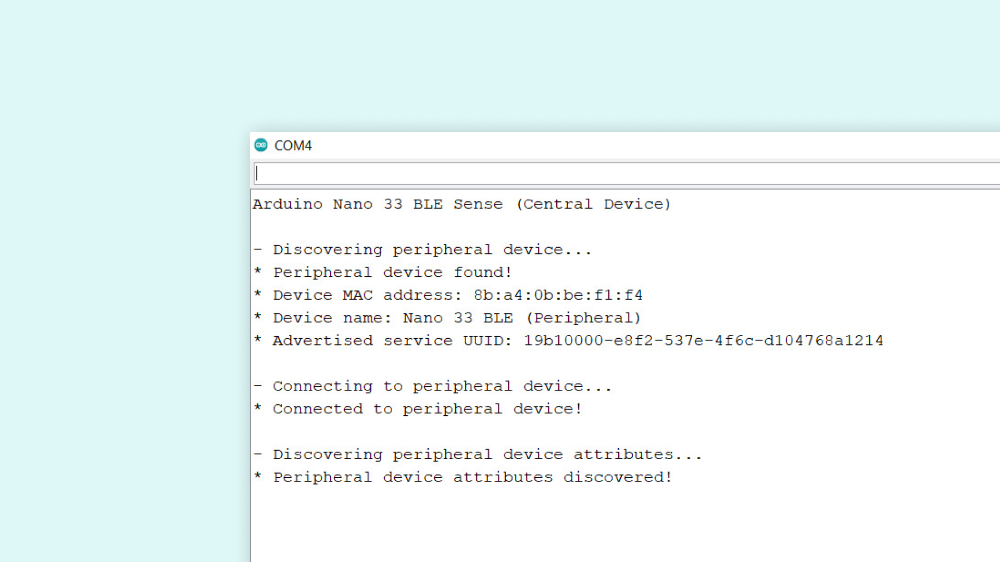
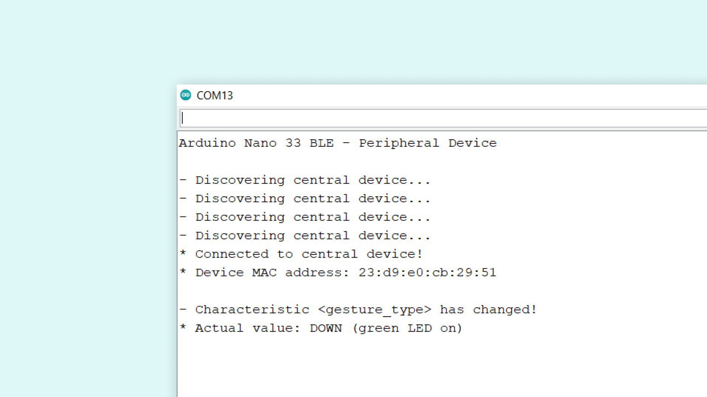

## Introduction

In this tutorial, we will learn how to exchange information between two Arduino boards, the Nano 33 BLE and the Nano 33 BLE Sense, through Bluetooth® Low Energy. For this, we will be using the [ArduinoBLE library](https://www.arduino.cc/en/Reference/ArduinoBLE).

## Goals

- Learn Bluetooth® Low Energy fundamentals.
- Use the [ArduinoBLE library](https://www.arduino.cc/en/Reference/ArduinoBLE).
- Exchange information between two Arduino boards through Bluetooth® Low Energy.

## Hardware & Software Needed

- Arduino IDE ([online](https://create.arduino.cc/), or [offline](https://www.arduino.cc/en/main/software)).
- [ArduinoBLE library](https://www.arduino.cc/en/Reference/ArduinoBLE).
- [Arduino Nano 33 BLE board](https://store.arduino.cc/arduino-nano-33-ble).
- [Arduino Nano 33 BLE Sense board](https://store.arduino.cc/arduino-nano-33-ble-sense).
- Micro USB cable (x2).

## History of Bluetooth®

The Bluetooth® standard was originally conceived by Dr. Jaarp Haartsen at Ericsson in 1994, more than 20 years ago. It was named after a [renowned Viking and king](https://en.wikipedia.org/wiki/Harald_Bluetooth) who united Denmark and Norway in the 10th century, King Harald Gormsson. Dr. Haartsen was appointed to develop a short-range wireless connection standard that could replace the [RS-232](https://en.wikipedia.org/wiki/RS-232) standard, a wired telecommunications standard that was conceived in the 60s and that is still used nowadays. 

Bluetooth® uses what is known as **short-link radio technology**. It operates at the **unlicensed** but **regulated**, 2.4 to 2.485GHz band and it uses radios to communicate and establish connections between two or more devices. Bluetooth® is based on the [**frequency-hopping spread spectrum**](https://en.wikipedia.org/wiki/Frequency-hopping_spread_spectrum) method, this method was first described in the 1940s by the actress [Hedy Lamarr](https://en.wikipedia.org/wiki/Hedy_Lamarr) and the composer [George Antheil](https://en.wikipedia.org/wiki/George_Antheil). Lamarr and Antheil wished to create a way to prevent torpedoes guided by radio to be jammed. Bluetooth® is, in essence, a short-range wireless network called a [piconet](https://en.wikipedia.org/wiki/Piconet). 

In 1994, besides Ericsson, companies like Intel, Nokia, IBM, and Toshiba also had the idea of a short-range wireless link between electronic devices. What these companies understood at that time was that to create a short-range wireless link that could be used across different electronic devices, a protocol had to be standardized so that it could be universally applied. In 1996, those companies formed the Bluetooth® Special Interest Group (SIG) and it was finally established in 1998. SIG started with just 5 members, by the end of its first year it reached 4,000 members and nowadays it has more than 30,000.

>**Bluetooth®'s goal is to unite devices just like King Harald Gormsson united the tribes of Denmark into a single kingdom.**

Bluetooth® **1.0** was released around 1999, version **2.0** in 2004, version **2.1** in 2007, version **3.0** in 2009, version **4.0** in 2010, version **4.1** in 2013, version **4.2** in 2014, version **5.0** in 2016 and version **5.1** on 2019 (that's a lot of work!). 

If you look up the Bluetooth® 3.0 specification, you will find that this specification includes three working modes: BR, EDR, and HS (AMP). These three working modes are what people usually, for convenience, call **classic** Bluetooth®. In 2010, SIG merged with Wibree, a wireless technology developed by Nokia, Nordic Semiconductor, and other companies whose objective was to find a low-power wireless communication technology for electronics devices. SIG renamed Wibree as Bluetooth® Low Energy. Bluetooth® Low Energy was designed to reduce, significantly, the power consumption by reducing the amount of time that the Bluetooth® radio is on. Classic Bluetooth® and Bluetooth® Low Energy are both included since the Bluetooth® 4.0 specification, but here's the thing: **Classic Bluetooth® and Bluetooth® Low Energy work differently, and they are not compatible.** 

Each mode, classic Bluetooth®, and Bluetooth® Low Energy have different physical layer modulation and demodulation methods. **This means that classic Bluetooth® and Bluetooth® Low Energy cannot work with each other**. Generally speaking, classic Bluetooth® is mainly used for audio applications (wireless headphones, for example) while Bluetooth® Low Energy is more often seen in power-constrained applications (such as wearables and IoT devices, for example).

## How Does Bluetooth® Low Energy Work?

To understand how does Bluetooth® Low Energy works, we need to talk about the **roles** and **responsibilities** of two devices that are connected through Bluetooth®. In any Bluetooth® connection, two roles that are being played: the **central** and **peripheral** roles. Devices with a central role are also call **servers** while devices with a peripheral role are also called **clients**.


When a Bluetooth® connection is established, one device, the peripheral, will advertise or broadcast information about itself to any near devices. At the same time, another device, the central, will be performing a scan and will be listening for any device or devices that are broadcasting information. As soon as the central device picks up the advertising information from the peripheral device, an attempt to connect the peripheral device will be made. Once a connection is established, the central device will interact with the available information that the peripheral device has. This information exchange is made using, what is known as, **services**. 

### Services and Characteristics

A **service** is a group of **capabilities**. For example, a smartwatch can measure your heart rate, track your physical activity through the day and track your sleep patterns. These three capabilities, for example, would exist in a service called **health service**. By grouping capabilities in services, central devices allow peripheral devices to quickly find, select and interact with the desired services they want. Any service has a unique identification code called **UUID**. This code can be 16-bit or 32-bit long for official Bluetooth® specification services while non-official Bluetooth® services (the ones we can develop) are 128-bit long, UUIDs can be created randomly. A **profile** is a group of services. 

Within each service will exist a list of **characteristics**. Each one of these characteristics represents a unique capability of the central device. In the previous example, the health service would have three characteristics (heart rate, physical activity, and sleep pattern). **Once the peripheral device discovers these characteristics, it can write information to, request information from, and subscribe to updates from these characteristics**. Any characteristic, like the services, have a 16 bit long or 128 bit long UUID. 


### Information Exchange in Bluetooth® Low Energy

There are three ways data can be exchanged between two connected devices: **reading**, **writing**, or **notifying**. **Reading** occurs when a peripheral device asks the central device for specific information, think about a smartphone asking a smartwatch for the physical activity information, this is an example of reading. **Writing** occurs when a peripheral device writes specific information in the central device, think about a smartphone changing the password of a smartwatch, this is an example of writing. **Notifying** occurs when a central device offers information to the peripheral device using a notification, think about a smartwatch notifying a smartphone its battery is low and needs to be recharged.  

Well, that's what we need to know about Bluetooth® Low Energy for now. Bluetooth® specifications are quite extensive but interesting to read and learn about. If you want to know more about Bluetooth® Low Energy, check out [**Getting Started with Bluetooth® Low Energy** by Kevin Townsend, Carles Cufí, Akiba, and Robert Davidson](https://www.oreilly.com/library/view/getting-started-with/9781491900550/).

## Using Bluetooth® Low Energy and Arduino

Now, let's use Bluetooth® Low Energy with Arduino. In this example, we are going to use two Arduino boards, the **Nano 33 BLE** and the **Nano 33 BLE Sense** to exchange information between them. One of the boards, the Nano 33 BLE Sense, is going to be set up as a central device while the other board, the Nano 33 BLE, is going to be set up as a peripheral device. The information that we are going to share between the boards will come from the embedded **gesture sensor** of the Nano 33 BLE Sense board. For this, we are going to create a service called **gestureService** that will have one characteristic called **gesture_type**.   


The central device, the Nano 33 BLE Sense, is going to connect to the peripheral device, the Nano 33 BLE, and will look for the service called **gestureService**. Once a connection is established between the central and the peripheral device, if the central device detects a gesture with its gesture sensor, it will write the type of the gesture detected in the **gesture_type** characteristic of the **gestureService**. Then, based on the value stored in the **gesture_type** characteristic, the built-in RGB LED of the peripheral device, the Nano 33 BLE, will turn on a specific color depending on the stored value in the **gesture_type** characteristic. 

## Programming the Boards

**1.** First, let's make sure we have the drivers for the Nano 33 BLE boards installed. If we are using the online IDE, there is no need to install anything, if you are using the offline IDE, we need to install it manually. This can be done by navigating to **Tools > Board > Board Manager...**, search for **Arduino Mbed OS Nano Boards**, and install it. 

**2.** Also, let's make sure we have all the libraries we need installed. If we are using the online IDE, there is no need to install anything. If we are using the offline IDE, this can be done by navigating to **Tools > Manage libraries...**, search for **ArduinoBLE** and **Arduino_APDS9960**, and install them both. 

### Programming the Central Device

The complete central device code can be found below:

```arduino
/*
  BLE_Central_Device.ino

  This program uses the ArduinoBLE library to set-up an Arduino Nano 33 BLE Sense 
  as a central device and looks for a specified service and characteristic in a 
  peripheral device. If the specified service and characteristic is found in a 
  peripheral device, the last detected value of the on-board gesture sensor of 
  the Nano 33 BLE Sense, the APDS9960, is written in the specified characteristic. 

  The circuit:
  - Arduino Nano 33 BLE Sense. 

  This example code is in the public domain.
*/

#include <ArduinoBLE.h>
#include <Arduino_APDS9960.h>

const char* deviceServiceUuid = "19b10000-e8f2-537e-4f6c-d104768a1214";
const char* deviceServiceCharacteristicUuid = "19b10001-e8f2-537e-4f6c-d104768a1214";

int gesture = -1;
int oldGestureValue = -1;   

void setup() {
  Serial.begin(9600);
  while (!Serial);
  
  if (!APDS.begin()) {
    Serial.println("* Error initializing APDS9960 sensor!");
  } 

  APDS.setGestureSensitivity(80); 
  
  if (!BLE.begin()) {
    Serial.println("* Starting Bluetooth® Low Energy module failed!");
    while (1);
  }
  
  BLE.setLocalName("Nano 33 BLE (Central)"); 
  BLE.advertise();

  Serial.println("Arduino Nano 33 BLE Sense (Central Device)");
  Serial.println(" ");
}

void loop() {
  connectToPeripheral();
}

void connectToPeripheral(){
  BLEDevice peripheral;
  
  Serial.println("- Discovering peripheral device...");

  do
  {
    BLE.scanForUuid(deviceServiceUuid);
    peripheral = BLE.available();
  } while (!peripheral);
  
  if (peripheral) {
    Serial.println("* Peripheral device found!");
    Serial.print("* Device MAC address: ");
    Serial.println(peripheral.address());
    Serial.print("* Device name: ");
    Serial.println(peripheral.localName());
    Serial.print("* Advertised service UUID: ");
    Serial.println(peripheral.advertisedServiceUuid());
    Serial.println(" ");
    BLE.stopScan();
    controlPeripheral(peripheral);
  }
}

void controlPeripheral(BLEDevice peripheral) {
  Serial.println("- Connecting to peripheral device...");

  if (peripheral.connect()) {
    Serial.println("* Connected to peripheral device!");
    Serial.println(" ");
  } else {
    Serial.println("* Connection to peripheral device failed!");
    Serial.println(" ");
    return;
  }

  Serial.println("- Discovering peripheral device attributes...");
  if (peripheral.discoverAttributes()) {
    Serial.println("* Peripheral device attributes discovered!");
    Serial.println(" ");
  } else {
    Serial.println("* Peripheral device attributes discovery failed!");
    Serial.println(" ");
    peripheral.disconnect();
    return;
  }

  BLECharacteristic gestureCharacteristic = peripheral.characteristic(deviceServiceCharacteristicUuid);
    
  if (!gestureCharacteristic) {
    Serial.println("* Peripheral device does not have gesture_type characteristic!");
    peripheral.disconnect();
    return;
  } else if (!gestureCharacteristic.canWrite()) {
    Serial.println("* Peripheral does not have a writable gesture_type characteristic!");
    peripheral.disconnect();
    return;
  }
  
  while (peripheral.connected()) {
    gesture = gestureDetectection();

    if (oldGestureValue != gesture) {  
      oldGestureValue = gesture;
      Serial.print("* Writing value to gesture_type characteristic: ");
      Serial.println(gesture);
      gestureCharacteristic.writeValue((byte)gesture);
      Serial.println("* Writing value to gesture_type characteristic done!");
      Serial.println(" ");
    }
  
  }
  Serial.println("- Peripheral device disconnected!");
}
  
int gestureDetectection() {
  if (APDS.gestureAvailable()) {
    gesture = APDS.readGesture();

    switch (gesture) {
      case GESTURE_UP:
        Serial.println("- UP gesture detected");
        break;
      case GESTURE_DOWN:
        Serial.println("- DOWN gesture detected");
        break;
      case GESTURE_LEFT:
        Serial.println("- LEFT gesture detected");
        break;
      case GESTURE_RIGHT:
        Serial.println("- RIGHT gesture detected");
        break;
      default:
        Serial.println("- No gesture detected");
        break;
      }
    }
    return gesture;
}
```

### Programming the Peripheral Device

The complete peripheral device code can be found below:

```arduino
/*
  BLE_Peripheral.ino

  This program uses the ArduinoBLE library to set-up an Arduino Nano 33 BLE 
  as a peripheral device and specifies a service and a characteristic. Depending 
  of the value of the specified characteristic, an on-board LED gets on. 

  The circuit:
  - Arduino Nano 33 BLE. 

  This example code is in the public domain.
*/

#include <ArduinoBLE.h>
      
enum {
  GESTURE_NONE  = -1,
  GESTURE_UP    = 0,
  GESTURE_DOWN  = 1,
  GESTURE_LEFT  = 2,
  GESTURE_RIGHT = 3
};

const char* deviceServiceUuid = "19b10000-e8f2-537e-4f6c-d104768a1214";
const char* deviceServiceCharacteristicUuid = "19b10001-e8f2-537e-4f6c-d104768a1214";

int gesture = -1;

BLEService gestureService(deviceServiceUuid); 
BLEByteCharacteristic gestureCharacteristic(deviceServiceCharacteristicUuid, BLERead | BLEWrite);


void setup() {
  Serial.begin(9600);
  while (!Serial);  
  
  pinMode(LEDR, OUTPUT);
  pinMode(LEDG, OUTPUT);
  pinMode(LEDB, OUTPUT);
  pinMode(LED_BUILTIN, OUTPUT);
  
  digitalWrite(LEDR, HIGH);
  digitalWrite(LEDG, HIGH);
  digitalWrite(LEDB, HIGH);
  digitalWrite(LED_BUILTIN, LOW);

  
  if (!BLE.begin()) {
    Serial.println("- Starting Bluetooth® Low Energy module failed!");
    while (1);
  }

  BLE.setLocalName("Arduino Nano 33 BLE (Peripheral)");
  BLE.setAdvertisedService(gestureService);
  gestureService.addCharacteristic(gestureCharacteristic);
  BLE.addService(gestureService);
  gestureCharacteristic.writeValue(-1);
  BLE.advertise();

  Serial.println("Nano 33 BLE (Peripheral Device)");
  Serial.println(" ");
}

void loop() {
  BLEDevice central = BLE.central();
  Serial.println("- Discovering central device...");
  delay(500);

  if (central) {
    Serial.println("* Connected to central device!");
    Serial.print("* Device MAC address: ");
    Serial.println(central.address());
    Serial.println(" ");

    while (central.connected()) {
      if (gestureCharacteristic.written()) {
         gesture = gestureCharacteristic.value();
         writeGesture(gesture);
       }
    }
    
    Serial.println("* Disconnected to central device!");
  }
}

void writeGesture(int gesture) {
  Serial.println("- Characteristic <gesture_type> has changed!");
  
   switch (gesture) {
      case GESTURE_UP:
        Serial.println("* Actual value: UP (red LED on)");
        Serial.println(" ");
        digitalWrite(LEDR, LOW);
        digitalWrite(LEDG, HIGH);
        digitalWrite(LEDB, HIGH);
        digitalWrite(LED_BUILTIN, LOW);
        break;
      case GESTURE_DOWN:
        Serial.println("* Actual value: DOWN (green LED on)");
        Serial.println(" ");
        digitalWrite(LEDR, HIGH);
        digitalWrite(LEDG, LOW);
        digitalWrite(LEDB, HIGH);
        digitalWrite(LED_BUILTIN, LOW);
        break;
      case GESTURE_LEFT:
        Serial.println("* Actual value: LEFT (blue LED on)");
        Serial.println(" ");
        digitalWrite(LEDR, HIGH);
        digitalWrite(LEDG, HIGH);
        digitalWrite(LEDB, LOW);
        digitalWrite(LED_BUILTIN, LOW);
        break;
      case GESTURE_RIGHT:
        Serial.println("* Actual value: RIGHT (built-in LED on)");
        Serial.println(" ");
        digitalWrite(LEDR, HIGH);
        digitalWrite(LEDG, HIGH);
        digitalWrite(LEDB, HIGH);
        digitalWrite(LED_BUILTIN, HIGH);
        break;
      default:
        digitalWrite(LEDR, HIGH);
        digitalWrite(LEDG, HIGH);
        digitalWrite(LEDB, HIGH);
        digitalWrite(LED_BUILTIN, LOW);
        break;
    }      
}
```

## Testing the Code

Once we finished with the coding, we can upload both sketches to our boards. We can verify first that the central device (Arduino Nano 33 BLE Sense) is working as expected by selecting the right port of the central device and opening the Serial Monitor. In the Serial Monitor, we should see the following:


After turning on, the central device starts looking for a peripheral device with a specified service and characteristic. Once the peripheral device with the specified service and characteristic is found, in the Serial Monitor we should see the following:



The central device gives you feedback about:

- The peripheral device MAC address.
- The peripheral device local name.
- The peripheral device advertised service UUID. 

Then, the central device tries to establish a connection with the peripheral device and also tries to discover the service and the characteristic we specified before. If both things are made with success, then we can start triggering the onboard gesture sensor of the Nano 33 BLE Sense board. We begin by stabilizing our Nano 33 BLE Sense board on a standing position in our front with the USB port of the board facing down. Then, we carry on by making directional UP-DOWN-RIGHT-LEFT hand gestures. When a gesture is detected by the gesture sensor, in the Serial Monitor we should see the following:


The central device gives us feedback about:

- The type of gesture detected (UP, DOWN, RIGHT, or LEFT).
- The value written to the **gesture_type** characteristic of the **gesture** service in the peripheral device.

We should see also that an on-board LED in the peripheral device gets on depending on the detected gesture:

- UP gesture detected: red LED on.
- DOWN gesture detected: green LED on.
- RIGHT gesture detected: built-in LED on.
- LEFT gesture detected: blue LED on.

The peripheral device can also give us feedback through the serial port. We can verify with that feedback that the peripheral device (Arduino Nano 33 BLE) is working as expected by selecting the right port of the peripheral device and opening the Serial Monitor. In the Serial Monitor, we should see the following:



The peripheral device gives us feedback about:

- The central device's MAC address.
- The central device's local name.
- The **gesture_type** characteristic actual value and the onboard LED that is on.

### Troubleshoot

Sometimes errors occur, if one of the codes is not working there are some common issues we can troubleshoot:

- Missing a bracket or a semicolon.
- Arduino board connected to the wrong port.
- Accidental interruption of cable connection.
- We haven't opened the Serial Monitor to initialize the program.

## Conclusion

In this tutorial, we have learned how to exchange information between two Arduino boards, the Nano 33 BLE and the Nano 33 BLE Sense, through Bluetooth® Low Energy. We also learned the basics of Bluetooth® Low Energy, how does it works, what are services and characteristics, and how information is exchanged in Bluetooth® Low Energy. Lastly, we turn on different colors of the on-board RGB LED of the Nano 33 BLE board based on the values sent from the Nano 33 BLE Sense, those values were defined using its onboard gesture sensor. 