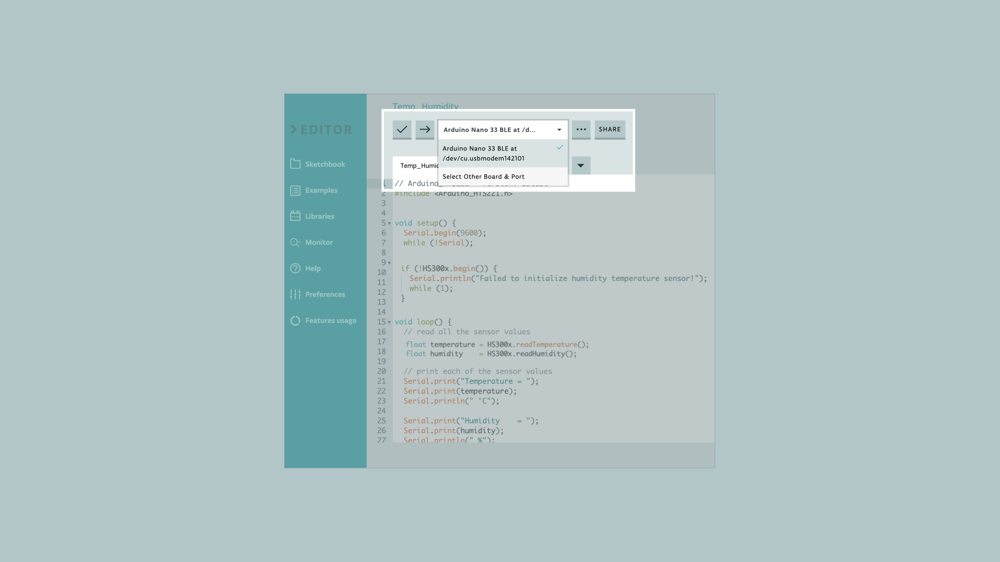
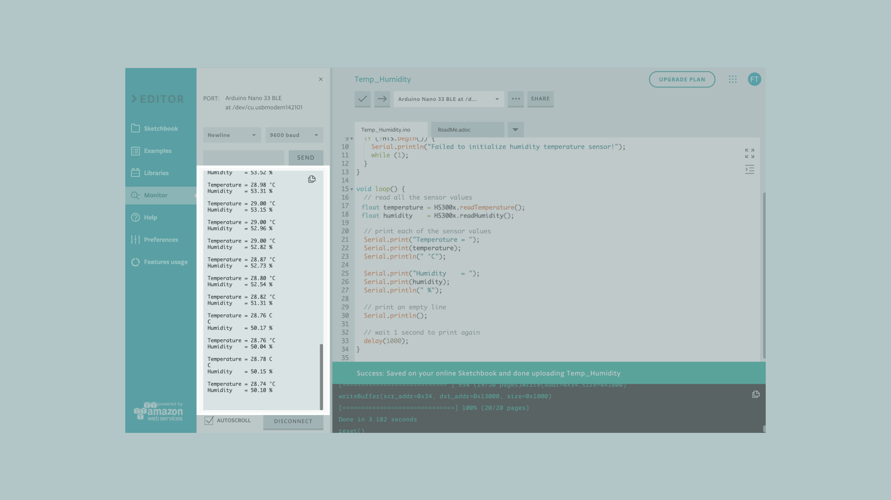

In this tutorial we will use an **Arduino Nano 33 BLE Sense Rev2** board to measure and print out the humidity and temperature values of your surroundings, made possible by the embedded **HS3003** sensor. 


## Goals
The goals of this project are:
- Learn how to output raw sensor data from the Arduino Nano 33 BLE Sense Rev2.
- Use the HS300x library.
- Print temperature and humidity values in the Serial Monitor when they are within a certain range. 
- Create your own temperature and humidity monitor.


## Hardware & Software Needed
* Arduino Nano 33 BLE Sense Rev2.
* This project uses no external sensors or components. 
* [IDE 2](https://www.arduino.cc/en/software#future-version-of-the-arduino-ide)


## The HS3003 Sensor 


Temperature sensors are components that convert physical temperature into digital data. Likewise, humidity sensors are able to measure atmospheric moisture levels and translate that into electrical signal. As such, temperature and humidity sensors are essential for environmental monitoring especially in and around sensitive electronic equipment.

The HS3003 is an ultra-compact sensor for relative humidity and temperature. We will use the I2C protocol to communicate with the sensor and get data from it. The sensor's range of different values are the following:

- Humidity accuracy: ± 3.5% rH, 20 to +80% rH
- Humidity range: 0 to 100 %
- Temperature accuracy: ± 0.5 °C,15 to +40 °C
- Temperature range: -40 to 120°C

These types of sensors are used more than you would think and are found in various everyday objects! 

Some of the useful ways they are used are seen in the following applications:
- Air conditioning, heating and ventilation.
- Air humidifiers.
- Refrigerators.
- Wearable devices.
- Smart home automation.
- Industrial automation.
- Respiratory equipment.
- Asset and goods tracking.


If you want to read more about the HS3003 sensor you can take a look at the [datasheet](/resources/datasheets/REN_HS300x-Datasheet_DST.pdf)


## Creating the Program 

**1. Setting up**

Let's start by opening the [Arduino Web Editor](https://create.arduino.cc/editor), click on the **Libraries** tab, search for the **HS300x** library, then in **Examples**, open the **ReadSensors** example. Once the sketch is open, rename it as **Temp_Humidity**. 

**2. Connecting the board**

Now, connect the Arduino Nano 33 BLE Sense Rev2 to the computer to check that the Web Editor recognises it, if so, the  board and port should appear as shown in the image. If they don't appear, follow the [instructions](https://create.arduino.cc/getting-started/plugin/welcome) to install the plugin that will allow the Editor to recognise your board.




**3. Printing temperature and humidity values **

Now we will need to modify the code of the example in order to print the temperature and humidity values only when 0,5ºC degree has changed or the humidity has changed at least 1%. To do so, let's initialize the following variables before the `setup()` function.

```arduino
float old_temp = 0;
float old_hum = 0; 
```

In the `setup()`, the  `HS300x.begin()` function inside an `if` statement will print a message, as a string, in case the sensor has not been properly initialized. 

Then, in the `loop()`, let's modify the example code by adding the following portion of code after the `HTS.readTemperature()` and `HTS.readHumidity()` functions respectively.

```arduino
 // check if the range values in temperature are bigger than 0,5 ºC
  // and if the range values in humidity are bigger than 1%
  if (abs(old_temp - temperature) >= 0.5 || abs(old_hum - humidity) >= 1 )
  {
    old_temp = temperature;
    old_hum = humidity; 
    // print each of the sensor values
    Serial.print("Temperature = ");
    Serial.print(temperature);
    Serial.println(" °C");
    Serial.print("Humidity    = ");
    Serial.print(humidity);
    Serial.println(" %");
    Serial.println();
  }
```

With this part of the code, we will print out the temperature and humidity values when the temperature increases or decreases more than 0,5ºC , or, when the humidity values change up or down more than 1%.

**4. Complete code**

If you choose to skip the code building section, the complete code can be found below:

```arduino
/*
  HS300x - Read Sensors

  This example reads data from the on-board HS300x sensor of the
  Nano 33 BLE Sense Rev2 and prints the temperature and humidity sensor
  values to the Serial Monitor once a second.

  The circuit:
  - Arduino Nano 33 BLE Sense Rev2

  This example code is in the public domain.
*/

#include <Arduino_HS300x.h>

float old_temp = 0;
float old_hum = 0;

void setup() {
  Serial.begin(9600);
  while (!Serial);

  if (!HS300x.begin()) {
    Serial.println("Failed to initialize humidity temperature sensor!");
    while (1);
  }
}

void loop() {
  // read all the sensor values
  float temperature = HS300x.readTemperature();
  float humidity    = HS300x.readHumidity();
if (abs(old_temp - temperature) >= 0.5 || abs(old_hum - humidity) >= 1 )
  {
  // print each of the sensor values
  Serial.print("Temperature = ");
  Serial.print(temperature);
  Serial.println(" °C");

  Serial.print("Humidity    = ");
  Serial.print(humidity);
  Serial.println(" %");

  // print an empty line
  Serial.println();

  // wait 1 second to print again
  delay(1000);
   }
}

```


## Testing It Out

After you have successfully verified and uploaded the sketch to the board, open the Serial Monitor from the menu on the left. You will now see the new values printed. If you want to test out whether it is working, you could slightly breathe (exhale) on your board and watch new values when the humidity, as well as the temperature, levels rise or decrease. The following image shows how the data should be displayed.




### Troubleshoot 

Sometimes errors occur, if the project is not working as intended there are some common issues we can troubleshoot:
- Missing a bracket or a semicolon.
- If your Arduino board is not recognised, check that the Create plugin is running properly on your computer
- Accidental interruption of cable connection.


## Conclusion

In this simple tutorial we learned how to read temperature and humidity values from the  **HS3003** sensor using the [HS300x library](https://reference.arduino.cc/reference/en/libraries/arduino_hs300x/), and how to use the sensor embedded in the Arduino Nano 33 BLE Sense Rev2 board, to measure and print out humidity and temperature values from the environment.

