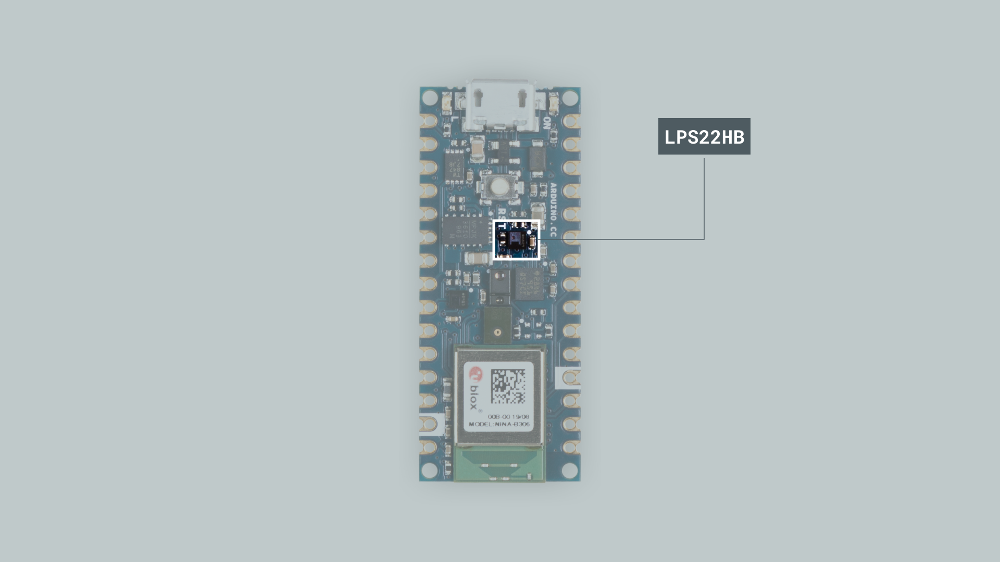
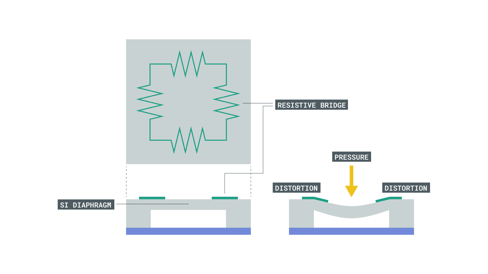
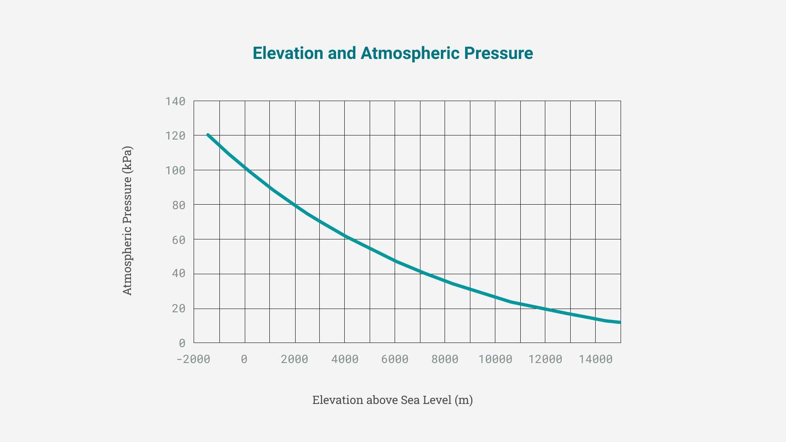
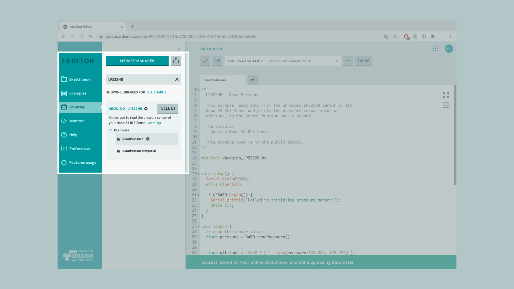
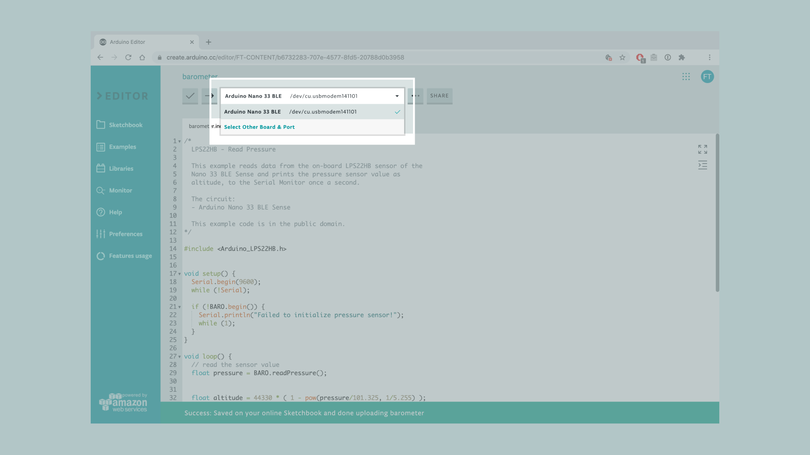
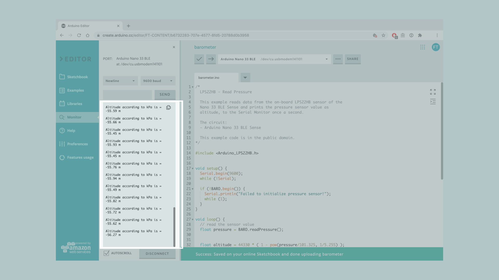

This tutorial will use an Arduino NANO 33 BLE Sense, to calculate the approximate altitude above sea level through the measurement of the atmospheric pressure, made possible by the embedded **LPS22HB** sensor. 

A popular application of a barometric sensor, apart from GPS and forecasting short term changes in the weather, is the altitude detection according to the atmospheric pressure. This tutorial will focus on the conversion of the atmospheric pressure data, in order to approximately identify the altitude values of the user's surrounding environment.


## Goals
The goals of this project are:
 - Learn what a LPS22HB sensor is.
 - Use the [LPS22HB library](https://www.arduino.cc/en/Reference/ArduinoLPS22HB).
 - Learn how to output raw sensor data from the Arduino NANO 33 BLE Sense.
 - Learn how to convert the kPa unit to altitude values (meters).
 - Print the data using Serial Monitor.
 - Create your own barometer that reveals your location's altitude.


## Hardware & Software Needed
* This project uses no external sensors or components. 
* In this tutorial we will use the [Arduino Create Cloud Editor](https://create.arduino.cc/editor) to program the board. 


## LPS22HB Sensor
The LPS22HB is an ultra-compact piezoresistive absolute pressure sensor which functions as a digital output barometer. The device comprises a sensing element and an IC interface which communicates through I2C or SPI, from the sensing element to the application. 



The sensing element, which detects absolute pressure, consists of a suspended silicon membrane and it operates over a temperature range extending from -40 °C to +85 °C. The functionality of the sensor will be explained further on later on the tutorial.

If you want to read more about the LPS22HB sensor module see <a href="https://content.arduino.cc/assets/Nano_BLE_Sense_lps22hb.pdf" target="_blank">here</a>. 


### The Library
The Arduino LPS22HB library allows us to read the pressure sensor of the Nano 33 BLE Sense, without having to go into complicated programming. The library also takes care of the sensor initialization with the function `BARO.begin()` as well as de-initializes the sensor with the function `BARO.end()`. 


## Atmospheric Pressure and Altitude
Modern day barometers, known as barometric pressure sensors contain a diaphragm that’s formed through a resistive plate that’s in contact with the atmosphere as seen in the image below.



The atmospheric pressure is detected according to how much the diaphragm has deformed, due to resulting pressure. The higher the pressure is, the more the diaphragm moves, which result in a higher barometer reading. 

Once we retrieve the sensor values of the atmospheric pressure in kPa (unit of measurement), we can use the following mathematical formula to calculate the environment's approximate altitude in meters:

` H = 44330 * [1 - (P/p0)^(1/5.255) ] `

Where, "**H**" stands for altitude, "**P**" the measured pressure (kPa) from the sensor and "**p0**" is the reference pressure at sea level (101.325 kPa).

This graph shows the mathematical relationship between atmospheric pressure and elevation above sea level. 




## Creating the Program

**1. Setting up**

Let's start by opening the [Arduino Cloud Editor](https://create.arduino.cc/editor), click on the **Libraries** tab and search for the **LPS22HB** library. Then in **> Examples**, open the **ReadPressure** sketch and once it opens, rename it as **Barometer**.




**2. Connecting the board**

Now, connect the Arduino Nano 33 BLE Sense to the computer and make sure that the Cloud Editor recognizes it, if so, the board and port should appear as shown in the image below. If they don't appear, follow the [instructions](https://create.arduino.cc/getting-started/plugin/welcome) to install the plugin that will allow the Editor to recognize your board.





**3. Calculating the approximate altitude**

Now we will need to modify the code on the example, in order to print the board's approximate altitude in meters, through the measurement of the barometric sensor.

After including the `Arduino_LPS22HB.h` library the `setup()` section will remain the same. Here, the function initializes the Serial communication at a standard rate of 9600 bauds, as well as the sensor. In case the sensor has failed to initiate, an error message will be printed.

In the `loop()` the function `BARO.readPressure()` retrieves the live data from the sensor and stores them inside `float pressure`. Here, we need to tweak and add the aforementioned mathematical formula to convert the pressure sensor data into altitude: 

`float altitude = 44330 * ( 1 - pow(pressure/101.325, 1/5.255) );`

In this formula we simply change the formatting and converted the equations into code. 

>**Note:** The pow() function computes a base number raised to the power of exponent number.

Lastly, we adapt the `serial.println()` functions to the data we want to print, which is altitude in meters:

```arduino
Serial.print("Altitude according to kPa is = ");
Serial.print(altitude);
Serial.println(" m");

```

**4. Complete code**

If you choose to skip the code building section, the complete code can be found below:

```arduino
/*
  LPS22HB - Read Pressure

  This example reads data from the on-board LPS22HB sensor of the Nano 33 BLE Sense, 
  converts the atmospheric pressure sensor values to altitude above sea level,
  and prints them to the Serial Monitor every second.

  The circuit:
  - Arduino Nano 33 BLE Sense

  This example code is in the public domain.
*/

#include <Arduino_LPS22HB.h>


void setup() {
  Serial.begin(9600);
  while (!Serial);

  if (!BARO.begin()) {
    Serial.println("Failed to initialize pressure sensor!");
    while (1);
  }
}

void loop() {
  // read the sensor value
  float pressure = BARO.readPressure();
  
 
  float altitude = 44330 * ( 1 - pow(pressure/101.325, 1/5.255) );
  

  // print the sensor value
  Serial.print("Altitude according to kPa is = ");
  Serial.print(altitude);
  Serial.println(" m");

  // print an empty line
  Serial.println();

  // wait 1 second to print again
  delay(1000);
}
```


## Testing It Out

After you have successfully verified and uploaded the sketch to the board, open the Serial Monitor from the menu on the left. In order to test out the code, you could begin by stabilizing your board on a fixed position and observe the values returned through the Serial Monitor. If you are living in an apartment block, you could experiment further and move to different floors and notice the changes in altitude values.

Here is a screenshot example of the sketch returning values.




### Troubleshoot

Sometimes errors occur, if the code is not working there are some common issues we can troubleshoot:
- Missing a bracket or a semicolon.
- Arduino board connected to the wrong port. 
- Accidental interruption of cable connection.


## Conclusion
In this tutorial we learned what a **LPS22HB** sensor is, how to use the one embedded in the Arduino NANO 33 BLE Sense board and the LPS22HB library, in order to create our own barometer and measure the altitude in meters by retrieving and calculating the atmospheric pressure.


