## Introduction

In this tutorial we will use Edge Impulse through the Arduino Cloud with an Arduino Nano 33 BLE Sense to run a simple Artificial Neural Network that can recognize keywords in speech. We will use the embedded digital microphone on the Nano 33 BLE Sense, the MP34DT05, to listen to our surroundings and we will light the built-in RGB LED of the board when a keyword is detected. 

## Goals

The goals of this tutorial are:

 - Learn Machine Learning fundamentals. 
 - Use Edge Impulse with an Arduino Nano 33 BLE Sense board.
 - Run a simple Artificial Neural Network that can recognize keywords in speech.

## Hardware and Software Needed

- [Nano 33 BLE Sense](https://store.arduino.cc/arduino-nano-33-ble-sense).
- [Arduino Cloud](cloud.arduino.cc/home) to train simple Artificial Neural Network.
- Arduino IDE

## Machine Learning Fundamentals

When we talk about Machine Learning there are **three key concepts** that we must differentiate and understand how they relate. These concepts are: **Artificial Intelligence**, **Machine Learning** and **Deep Learning**. Let's take a closer look at these concepts.

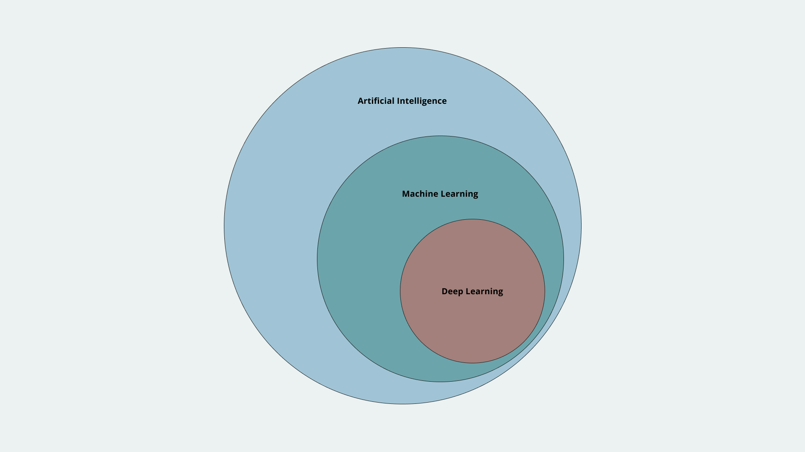

### What Is Artificial Intelligence?

**Artificial Intelligence (AI)** can be defined as the science of making things "smart". It is a broad term for getting computers to perform human tasks or, in simple terms, **human intelligence exhibited by machines**. AI has been around since the 1950's, but how does it look today? The answer is: **Machine Learning**.

### What Is Machine Learning?

**Machine Learning (ML)** is **one of the approaches to achieve AI**. It's a field of Computer Science that uses statistical techniques to give a computer the ability to **"learn"**. This learning is based on **data** that are not explicitly programmed, in any way, into the computer. With this learning, based on data, a computer can be trained to **predict** "things" based on **past observations**. 

In traditional programming, the outputs of a computer are generated as a result of the interaction of programs with data. In ML, a program is generated because of the interaction of data with the computer outputs. 

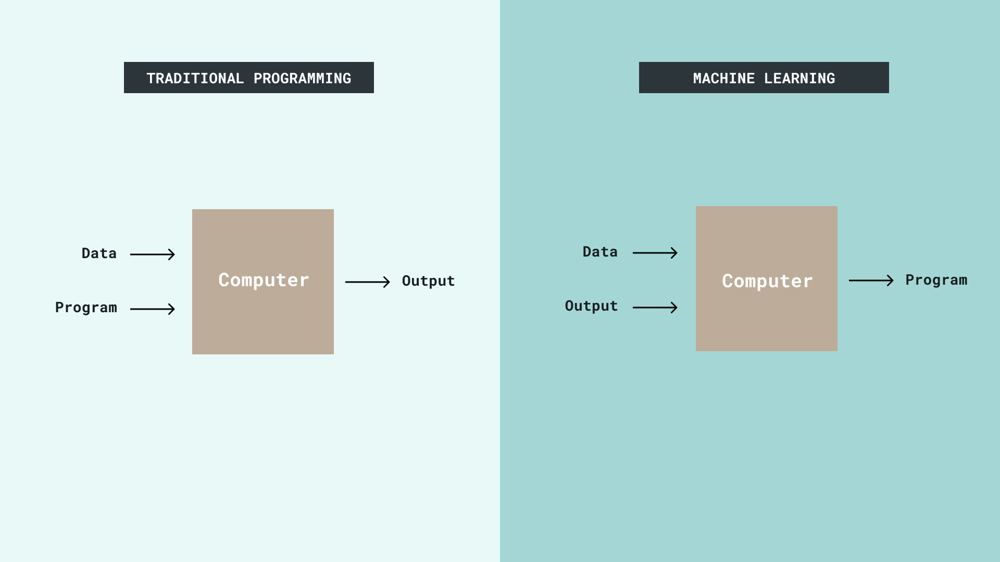

### What Is Deep Learning?

**Deep Learning (DL)** is a **technique for implementing ML**. DL uses the so-called **Artificial Neural Networks** to learn from data. **Artificial Neural Networks (ANN)** are algorithms, inspired by the human brain, that uses mathematical models for information processing. 

In a nutshell, ML is about **computers learning from data** to generate mathematical models that represent a real-world process. In ML,  learning is the key, but, **how a computer can learn from data and generate a model?** Lets talk now about **ML systems learning styles**.

### ML Systems Learning Styles

There are **two main types** of ML system's learning styles: **supervised** and **unsupervised** learning. Let's see the differences between both styles:

- **Supervised learning**: 
In this type of learning, **training data is labeled**. It consists of mapping input data to known labels we have provided. An example of this type of learning is the classification of radiology images for early detection of cancer. 

- **Unsupervised learning**: 
In this type of learning, **training data is not labeled**. It consists in finding inherent patterns in data. An example of this type of learning is anomaly detection such as flagging unusual credit card transactions to prevent fraud. 

In this tutorial, we are going to use the supervised learning style to generate a ML system or model. Now that we have talked about how a ML system can learn, let's talk about the possible outputs they can have.  

### Types of ML Outputs

ML systems are typically used for generating the following outputs:
- **Regression**: 
This kind of output is used to **predict continuous values**. For example, predicting the price of stock.

- **Classification**: 
This kind of output is used to **assign a class or label**. For example, assigning the label "cat" or "dog" to an image. 

- **Clustering**: 
This kind of output is used to **discover the composition and structure of data**, its basically a collection of objects on the bass of similarity and dissimilarity between them. For example, classification among different species of plants and animals.

- **Sequence prediction**: 
This kind of output is used to **predict the next symbol based on the previously observed sequence of symbols** of something. For example, a sequence of products bought by a customer. 

Now that we learned the basics of ML, let's use the Arduino Nano 33 BLE Sense board to run a simple ANN that can recognize keywords in speech. For this, we are going to use **Edge Impulse**.

## Setting up Edge Impulse 

An **edge device** is any kind of hardware that controls data flow at the boundary between two networks. Edge devices work, essentially, as entry or exit points in networks. **Edge Impulse** is one of the leading development platforms for ML on edge devices, their mission is to enable developers and device makers from all over the world to solve real world problems using ML models on edge devices. Let's use [Arduino Cloud](cloud.arduino.cc/home) to create a ML system or model and deploy it on your Nano 33 BLE Sense board.

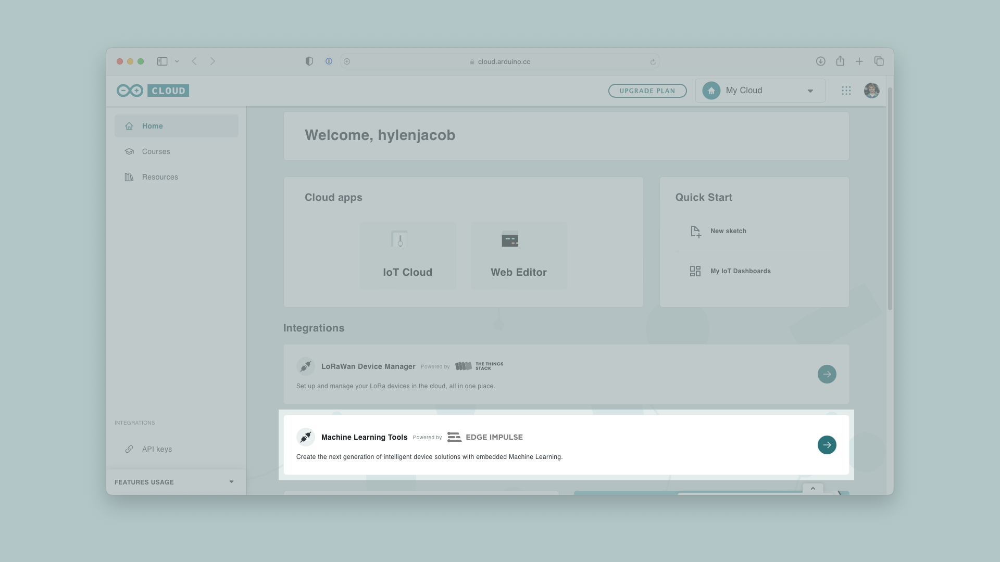

First, create an [Edge Impulse account](https://mltools.arduino.cc/studio/144605) through the Arduino platform, and create a new project called **speech_recognition**. 

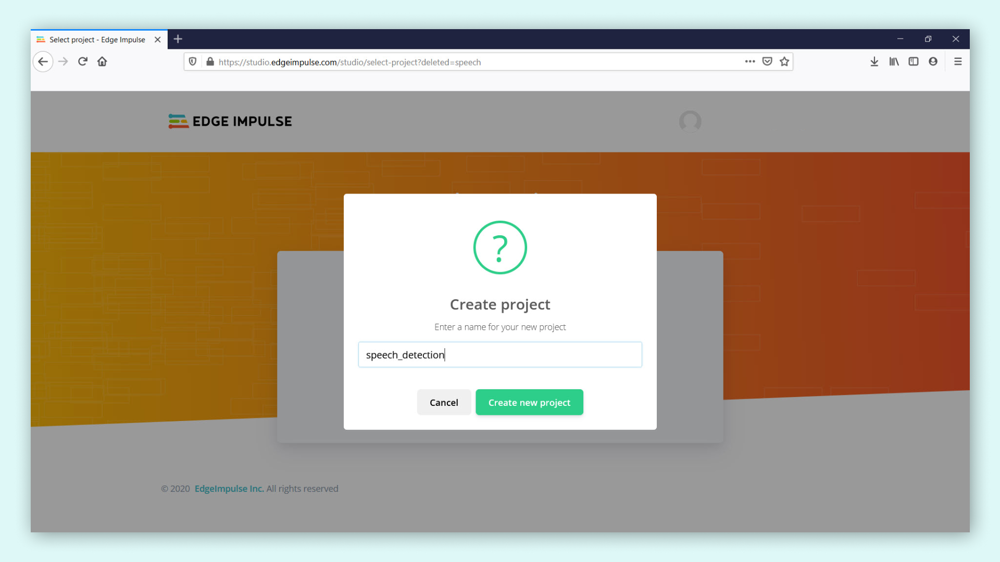

Now, you have to setup up your Nano 33 BLE Sense board in your Edge Impulse account, that we will use for acquiring the data required to train the ML model for speech detection. You need to install the following software in your computer:

- [Edge Impulse CLI](https://docs.edgeimpulse.com/docs/cli-installation).
- [Arduino CLI](https://arduino.github.io/arduino-cli/latest/).

With this software installed and running correctly in your computer, it's time to connect your Nano 33 BLE Sense board in Edge Impulse. Your board does not come with the right firmware that enables that connection. In order to connect your board with Edge Impulse, a firmware update is required:

**1.** Download the latest [Nano 33 BLE Sense board Edge Impulse firmware](https://cdn.edgeimpulse.com/firmware/arduino-nano-33-ble-sense.zip). Unzip the file in a known location in your computer.

**2.** Open the Flash script for your computer's operating system (`flash_windows.bat`, `flash_mac.command` or `flash_linux.sh`).

**3.** Wait until the firmware flashing is complete and press the RESET button of your board once to launch it. 

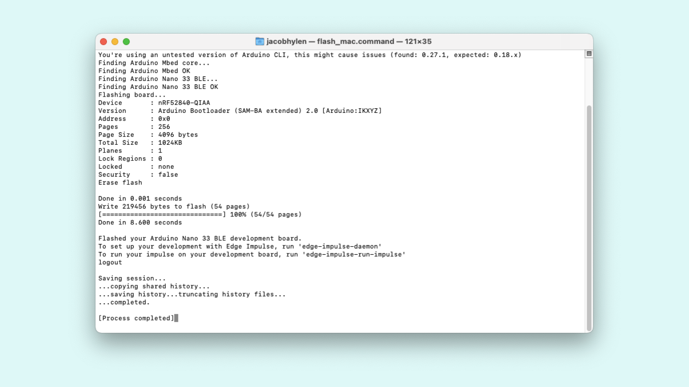

Now, open a command prompt or terminal and run:

```
$ edge-impulse-daemon
```

This will start a wizard that will ask you to log in into your Edge Impulse account and choose a project. 

>**Note:** If you created your Edge Impulse account by logging in with another service such as Google, this step may give you an error as your account technically does not have a password. To fix this, reset the password of your account by clicking "Forgot your password?" and following the instructions.

If you have several projects in your account, and you want to switch between them, run:

```
$ edge-impulse-daemon --clean
```

If you didn't already create a project, a new project will be automatically created for you in another platform, and you may not be able to find it. So make sure that you did create the speech_recognition project.

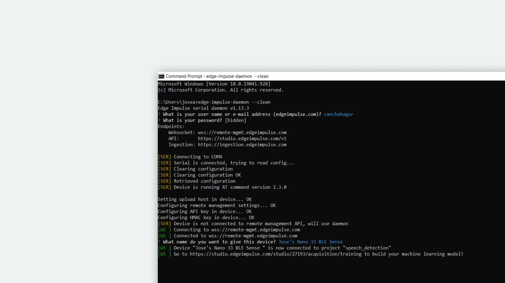

Now, in your Edge Impulse account, navigate to **Devices** on the left menu. You should see now your Nano 33 BLE Sense board name with its ID. A green dot should also appear if the board is connected to Edge Impulse correctly. 

>**Note:**  Be mindful, if the command prompt or terminal is closed, the connection between the board and your Edge Impulse account would be lost. 


## Creating and Curating a Dataset 

We are ready to start acquiring data for our model! Let's train a ML model that would let you identify keywords in speech, with the keywords: **red**, **green** and **yellow**. 

The first step is to create a representative dataset of the selected keywords that the ML model is supposed to identify. On Edge Impulse, navigate to **Data acquisition** on the left menu and then go to **Record new data**. On the **Device** option select the device you just have set up, on the **Sensor** option select the **built-in microphone**. Set the **sample length** (in milliseconds) to 2,500 and leave the **Frequency** (in Hz) as 16,000.

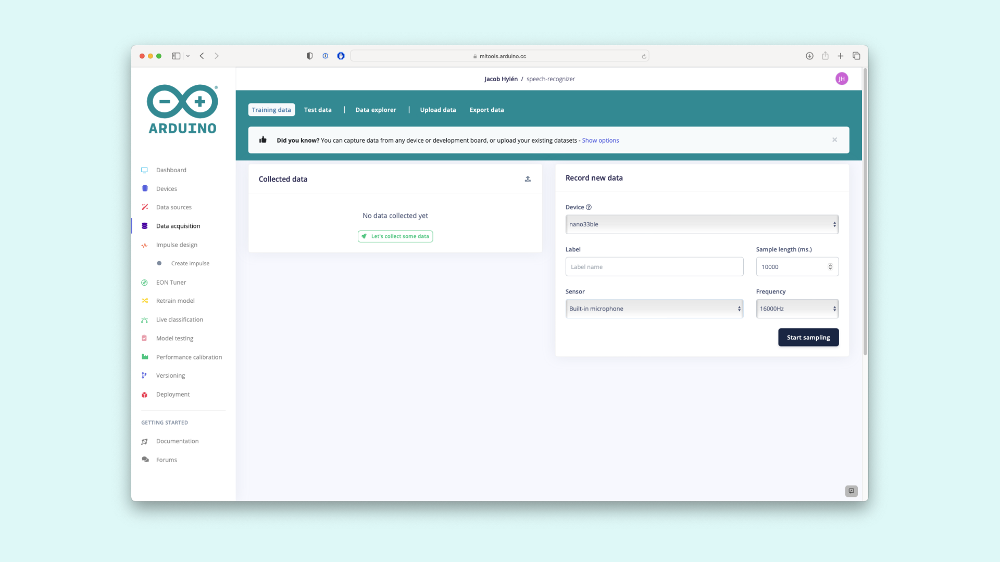

Now, in the **Label** write **red** and click on the **Start sampling** button. This will start sampling your Nano 33 BLE Sense board built-in microphone for 2500 milliseconds. In this period of time say the keyword **red**, but remember to have the microphone close to you. Record at least 50 samples and repeat this also for the other keywords, **green** and **yellow**. You should now start seeing the collected data (each recorded sample) and a graph of each recorded sample on Edge Impulse. 

After recording your first sample you can listen back to it to make sure the recording is clear and there is no disturbing background noise.

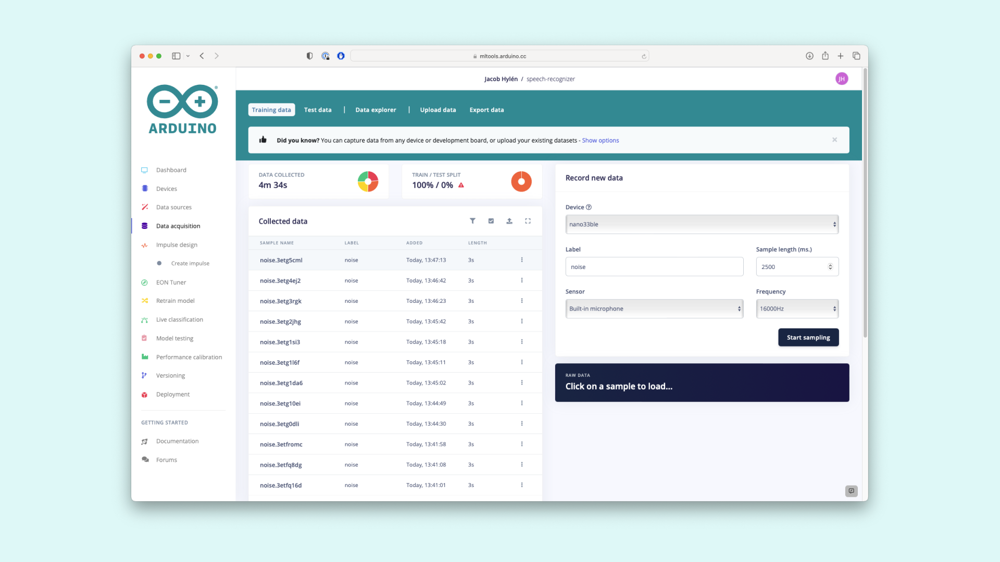

Also, in complete silence and without saying anything, record 50 more samples with the label **noise**. This samples are going to help the ML model identify when no keywords are being spoken. In total, you should get around 8 minutes of collected data with 4 different labels.

This is a very basic example of data collection with Edge Impulse. If you want to train a more robust model follow the recommendations below:

**1.** Recorded samples should be one to three seconds long.

**2.** Each sample should contain only one utterance of the keyword.

**3.** Try to get at least 50 samples. 100 samples is better, over 1000 samples is best. The more samples the better. 

**4.** Samples should contain a variety of pronunciations, accents, inflections, etc. 


## Creating an Impulse 

Now that we have all the data samples, it's time to design an **impulse**. An impulse, in a nutshell, is how your ML model is being trained, is where you define the actions that are going to be performed on your input data to make them better suited for ML and a learning block that defines the algorithm for the data classification. Navigate to **Impulse design** on the left menu and then select **Add a processing block** and add **Audio (MFCC)**, then select **Add learning block** and add **Classification (Keras)**. Keep all of the settings at their defaults for each block. Click on the **Save impulse** button.

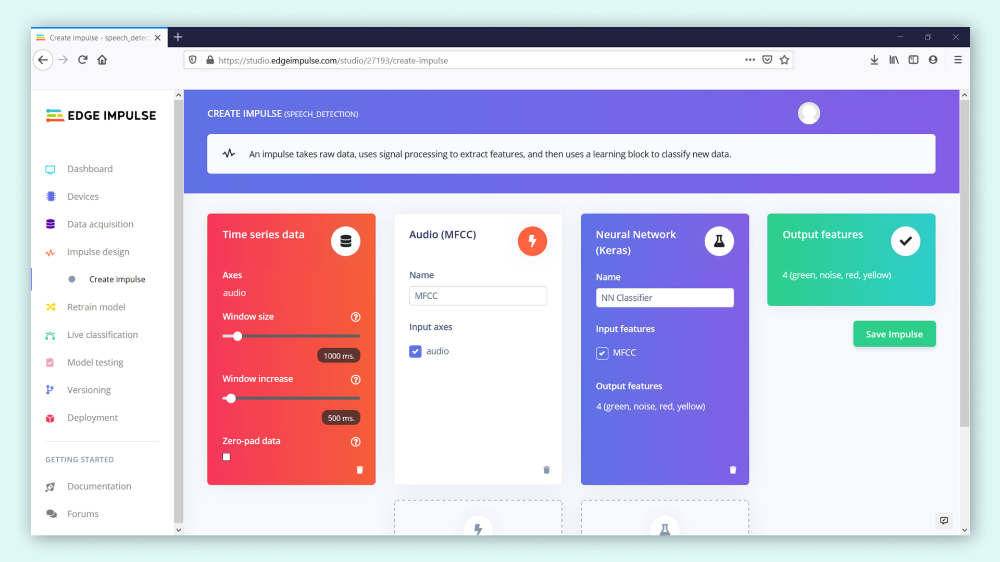

## Generating the Impulse Features

Now, let's generate the features from the input data. With **features** we are referring to the unique properties of our collected data that will be used by the classification algorithm, to detect keywords in speech. For now, do not change the default settings and parameters. 

Click on the **Save parameters** button and then go to the **Generate features** tab and click on the **Generate features** button. This process might take some time to complete depending on the size of your dataset. When the process is done you can inspect the obtained results. 

On the right side you can see a representation of your dataset features.

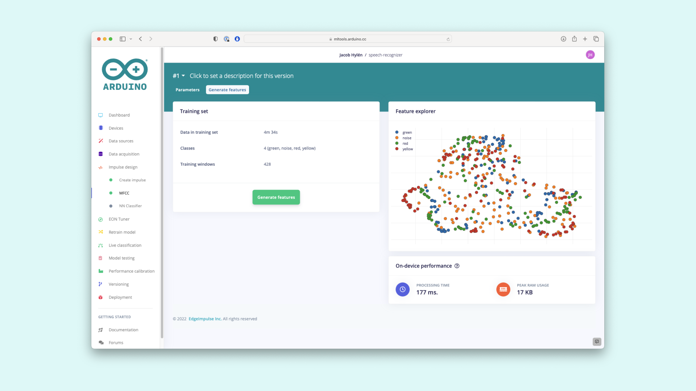

## Training the ML Model

Now that you have your dataset features ready to be used, navigate to **NN Classifier** on the left menu. Keep the settings at their defaults. 

Next, click on **Start training** to train the ML model, this might take some time to complete depending on the size of your dataset. Once it's done, you will see some statistical parameters that tell you how good the model performed during the validation process. You should see a high accuracy for each parameter, something near to 100%. If the statistical parameters results are poor, something far from 100%, you should take a look into your dataset and cure it by removing the not representative recordings.

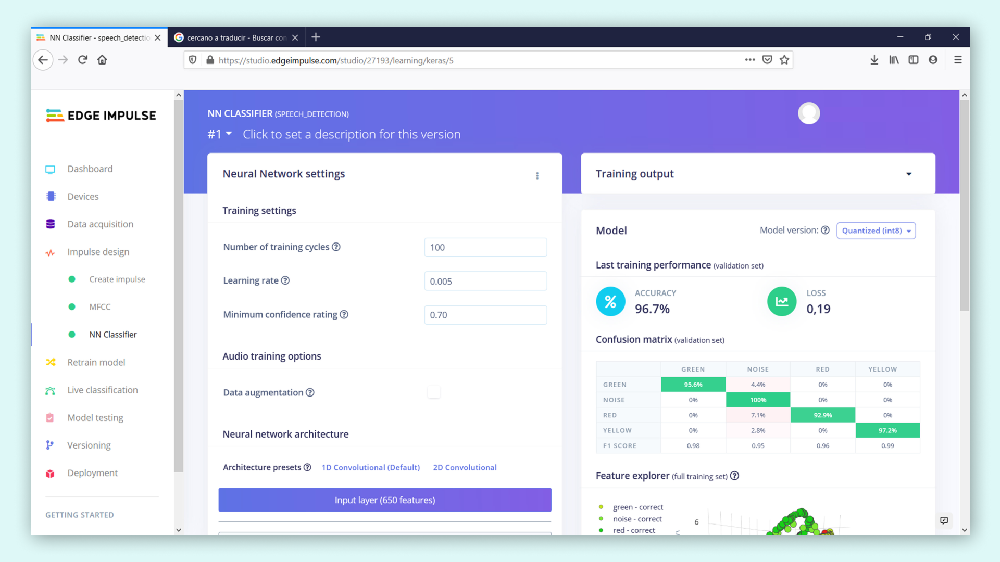

## Using the ML Model

Now that you have your ML model, its time to test it with an edge device. The ML you trained is already optimized for its use with embedded hardware such as microcontrollers. Deploying the ML model to your Nano 33 BLE Sense board is really simple, just navigate to **Deployment** on the left menu. 

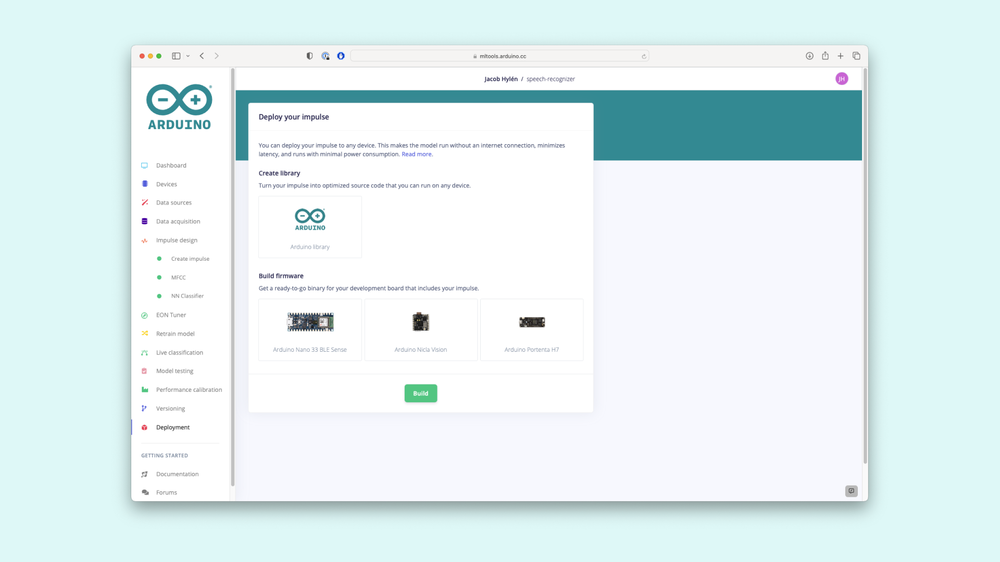

In the **Create library** section, click on **Arduino library** and then, on the bottom, click on the **Build** button. This will start a process where Edge Impulse creates a library for your Arduino board that has the ML model you have trained. When the building process is done, your browser should start downloading the generated library. 

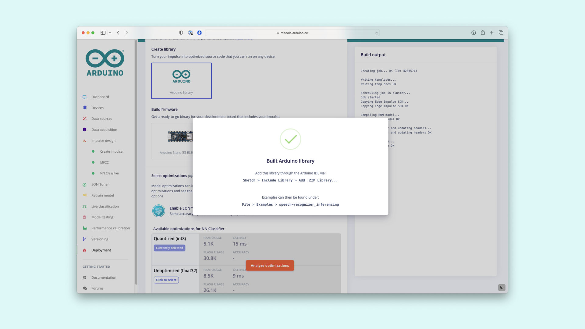

Now, open the Arduino library you just created with Edge Impulse. Remember to disconnect your board from Edge Impulse by closing the command prompt or terminal. Open your Arduino IDE and navigate to **Sketch**, select **Include library** and click on **Add .ZIP Library...**. Go to your Downloads folder and select the .ZIP file generated by Edge Impulse. Click on **Open**. The library should be installed and ready to be used and tested.

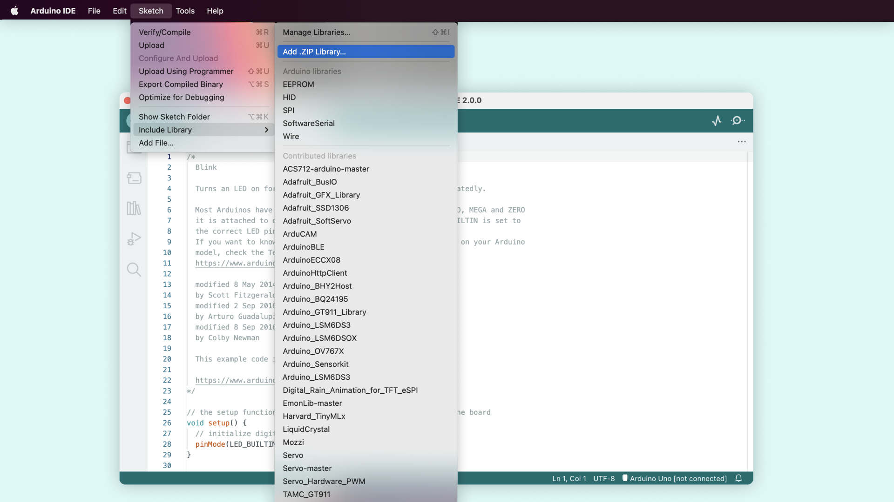

Navigate to **File**, select **Examples** and navigate to **Examples from Custom Libraries**. Here you should see an example named **"speech_detection Inferencing"**. Select the **nano_ble_33_sense_microphone_continuous**. This should open a sketch with the code that will let you test the ML model you trained before with Edge Impulse. Compile it and upload it to your Nano 33 BLE Sense board. Remember to select the **Arduino Nano 33 BLE Sense** as your board and associated serial port.  

Open the **Serial Monitor**, you should now see the ML model working. In order to make sure its working properly, after the keyword labels (green, noise, red and yellow) you should see the predictions being printed to the screen. When the ML model detects the keywords green, red or yellow on speech, one of the predictions output, or probability, should go up and get closer to one.

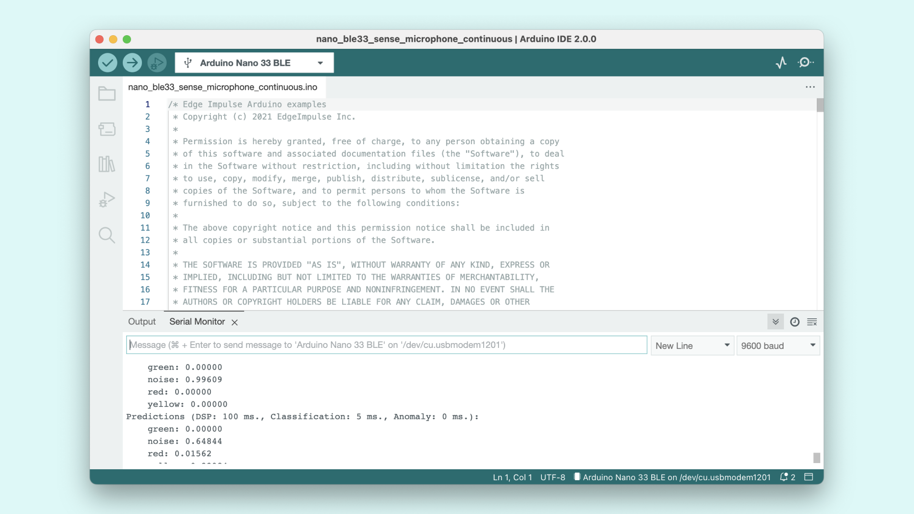

## Modifying the Program and Using the Built-In RGB LED

How can you flash the built-in RGB LED of your Nano 33 BLE Sense board if a keyword is detected on speech? For example, if you want to light red the built-in RGB LED of your board when the keyword **red** is detected through speech, you have to look for the **red** class (second index) to produce a probability of 0.8 or above. In the image below you can see an example of this implementation on the program. Try to do the same for the rest of the keywords. Don't forget to setup the RGB LED of your board in the `setup()` function.

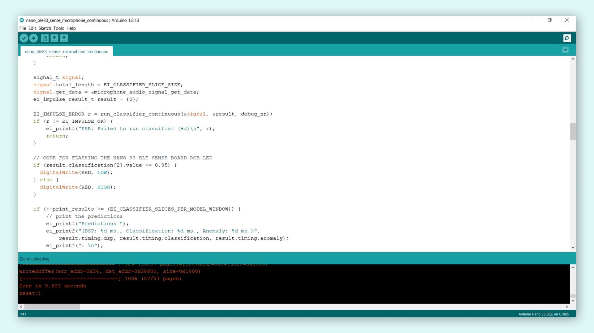

Congratulations! You just have implemented a simple ANN that can recognize speech keywords in your Arduino Nano 33 BLE Sense using Edge Impulse.

### Troubleshoot 

If you are working on Windows, you may run into the following error:

```
fork/exec C:\Users\MYUSER\AppData\Local\Arduino15\packages\arduino\tools\arm-none-eabi-gcc\7-2017q4/bin/arm-none-eabi-g++.exe: The filename or extension is too long.
```
This error is related with the nested libraries that may create paths that are too long for Windows. See this [article](https://docs.edgeimpulse.com/docs/running-your-impulse-arduino#code-compiling-fails-under-windows-os) for the fix. 

## Conclusion 

You have learned about the basics of Machine Learning. You also learned how to create a simple ANN that can recognize keywords in speech using Edge Impulse and deploy it on a Arduino Nano 33 BLE Sense board. This simple ANN allows you to detect the keywords red, green and yellow on speech and light the built-in LED of the Arduino Nano 33 BLE Sense board when this happens.

Nowadays, ML is all around us in the world. From social media to maps for navigation, ML finds its application in almost every aspect of our lives. If you wish to read more about it, check out the links below:

- [TinyML: Machine Learning with TensorFlow on Arduino and Ultra-Low Power Microcontrollers](https://www.amazon.com/-/es/Pete-Warden/dp/1492052043) - A book written by Pete Warden and Daniel Situnayake that gives you a comprehensive background on TinyML and a lot of example applications.

- [TensorFlow Lite for Microcontrollers](https://www.tensorflow.org/lite/microcontrollers) - Documentation site of TensorFlow Lite for Microcontrollers where you'll find user guides, tutorials and API documentation.

- [Edge Impulse](https://docs.edgeimpulse.com/docs/getting-started) - Documentation site of Edge Impulse where you'll find user guides, tutorials and API documentation.

- [Introduction to Embedded Machine Learning](https://www.coursera.org/learn/introduction-to-embedded-machine-learning) - Online course from Coursera where Shawn Hymel and Alexander Fred-Ojala teaches you about the basics of a ML system, how to use ML to take decisions and predictions in a embedded system and how to deploy a ML model into a microcontroller. This tutorial was based on Shawn's work with Edge Impulse and Arduino.

- [The Future of ML is Tiny and Bright](https://www.edx.org/professional-certificate/harvardx-tiny-machine-learning) - In this exciting Professional Certificate program offered by Harvard University and Google TensorFlow, you will learn about the emerging field of Tiny Machine Learning (TinyML), its real-world applications, and the future possibilities of this transformative technology.

- [Training a Custom Machine Learning Model for Portenta H7](/tutorials/portenta-vision-shield/custom-machine-learning-model) - Sebastian Romero teaches you how to train a custom machine learning model with Edge Impulse and to run it using the Portenta Vision Shield. This tutorial was based on Sebastian's work with Edge Impulse and the Portenta H7. 
