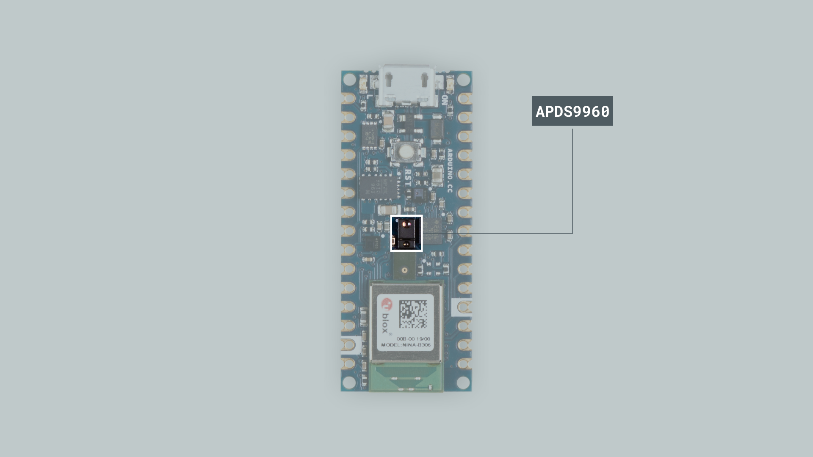
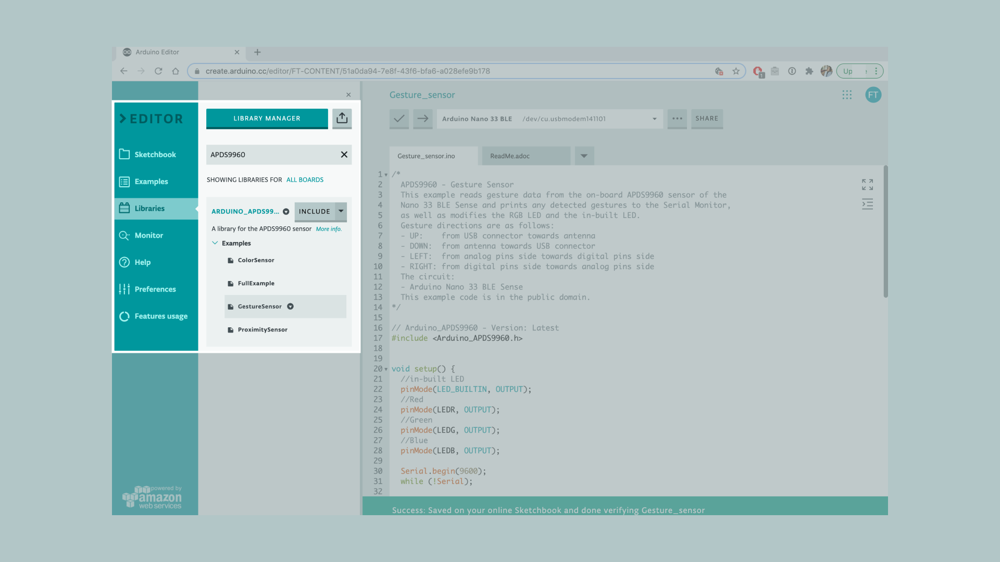
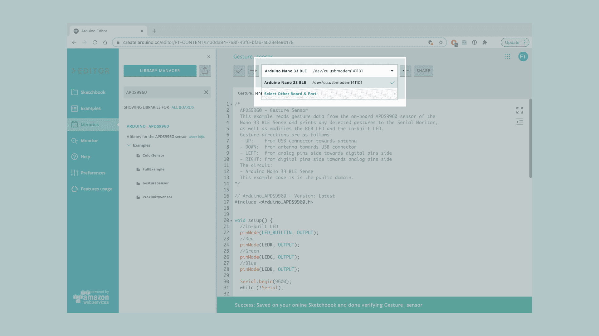
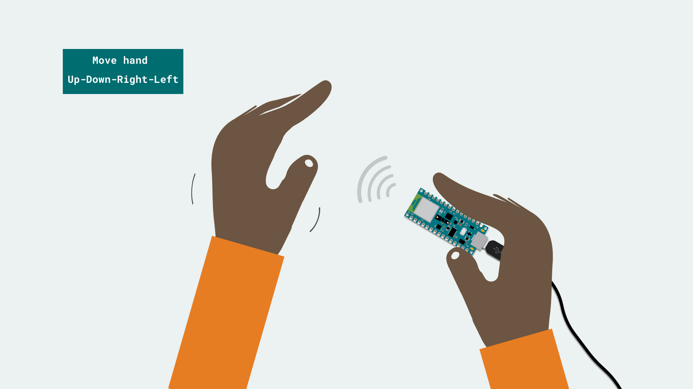
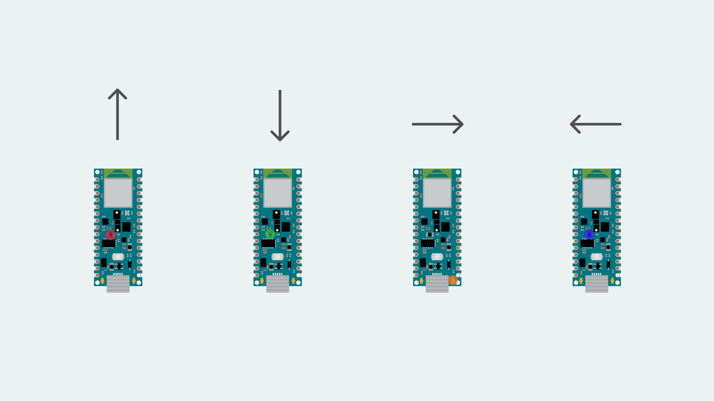
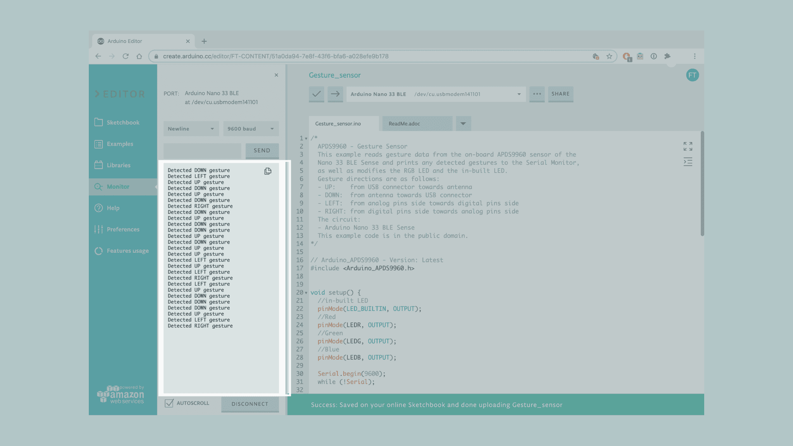

In this tutorial we will use an Arduino Nano 33 BLE Sense for gesture recognition, made possible by the embedded **APDS9960** sensor. 

We will use the sensor to print out simple hand gesture directions and control the board's RGB LED accordingly. In addition, we will program our board to blink the built-in LED and change colors to the RGB LED. according to the direction of the set gestures. The code will read simple **Up-Down-Right-Left** hand motions.

## Goals
The goals of this project are:
 - Learn what a APDS9960 sensor is.
 - Use the APDS9960 library.
 - Learn how to output raw sensor data from the Arduino Nano 33 BLE Sense.
 - Create your own gesture detection monitor.
 - Learn how to control the built-in LED and RGB LED, through hand gestures.


## Hardware & Software Needed
* This project uses no external sensors or components. 
* In this tutorial we will use the [Arduino Create Web Editor](https://create.arduino.cc/editor) to program the board. 


## APDS9960 Sensor
The APDS9960 sensor is a multipurpose device that features advanced gesture detection, proximity detection, Digital Ambient Light Sense (ALS) and Color Sense (RGBC). 



The sensor's gesture detection utilizes four directional photodiodes to sense reflected IR energy (sourced by the integrated LED) to convert physical motion information (i.e. velocity, direction and distance) into digital information. 

It features:
- Four separate diodes sensitive to different directions.
- Ambient light rejection.
- Offset compensation.
- Programmable driver for IR LED current.
- 32 dataset storage FIFO.
- Interrupt driven I2C-bus communication.


If you want to read more about the APDS9960 sensor module see <a href="https://content.arduino.cc/assets/Nano_BLE_Sense_av02-4191en_ds_apds-9960.pdf" target="_blank">here</a>. 


### The Library
The APDS9960 library allows us to use the sensor available on the board, to read gestures, color, light intensity and proximity. The library includes some of the following functions:

```arduino
begin()
end()
gestureAvailable()
readGesture()
colorAvailable()
readColor()
proximityAvailable()
readProximity()
setGestureSensitivity()
setInterruptPin()
setLEDBoost()
```

If you want a deeper knowledge on any of the functions of the library, you can check the Arduino [reference](https://www.arduino.cc/en/Reference/ArduinoAPDS9960) for this library.

For the purposes of this tutorial we will only focus on the gesture readings, which are based on the detection of the movement of the hand over four photodiodes inside the sensor. 


## Creating the Program

**1. Setting up** 

Let's start by opening the Arduino Web Editor, click on the **Libraries** tab and search for the **APDS9960** library. Then in **> Examples**, open the **GestureSensor** sketch and once it opens, you could rename it as Gesture&LEDs.



**2. Connecting the board**

Now, connect the Arduino Nano 33 BLE Sense to the computer and make sure that the Web Editor recognizes it, if so, the board and port should appear as shown in the image below. If they don't appear, follow the [instructions](https://create.arduino.cc/getting-started/plugin/welcome) to install the plugin that will allow the Editor to recognize your board.



**3. Blink patterns according to hand gestures**

Now we will need to modify the code on the example, in order to change the color of the RGB LED and the built-in LED respectively according to the direction of our hand gesture.

After including the `Arduino_APDS9960.h` library, we will need to configure the specified pins (22, 23, 24, LED_BUILTIN) at the beginning of the `setup()` section, to behave as output:

```arduino
//in-built LED
pinMode(LED_BUILTIN, OUTPUT);
//Red 
pinMode(LEDR, OUTPUT);
//Green 
pinMode(LEDG, OUTPUT);
//Blue
pinMode(LEDB, OUTPUT);
```

and then at the end, we need to turn all the LEDs OFF by adding the following statements

```arduino
  // Turining OFF the RGB LEDs
  digitalWrite(LEDR, HIGH);
  digitalWrite(LEDG, HIGH);
  digitalWrite(LEDB, HIGH);
```

In the `loop()` section the `if()` statement is checking that the gesture sensor is available and if it is, it reads for any incoming gesture detection. 

Next, in the `switch()` statement we will add different actions to be performed according to conditions, in this case the direction of the hand gesture will define those conditions.

If the sensor detects motions (up, down, left or right) we can add the following code snippets between the **Serial.println()** and the **break;** in each switch case, to activate the red, blue and green colors of the RGB LED and the orange on the built-in LED.

In the `GESTURE_UP` case, the RGB LED will glow **red** for a second: 
```arduino
digitalWrite(LEDR, LOW);  
delay(1000);
digitalWrite(LEDR, HIGH);  
```

In the `GESTURE_DOWN` case, the RGB LED will glow **green** for one second:
```arduino
digitalWrite(LEDG, LOW);  
delay(1000);
digitalWrite(LEDG, HIGH); 
```

In the `GESTURE_LEFT` case, the RGB LED will glow **blue** for one second: 
```arduino
digitalWrite(LEDB, LOW);  
delay(1000);
digitalWrite(LEDB, HIGH);  
```

Lastly, in the `GESTURE_RIGHT` case, the small built-in LED will glow **orange** for one second:
```arduino
digitalWrite(LED_BUILTIN, HIGH);  
delay(1000);
digitalWrite(LED_BUILTIN, LOW);  
```

Now the code is complete!


**4. Complete code**


```arduino
/*
  APDS9960 - Gesture Sensor
  This example reads gesture data from the on-board APDS9960 sensor of the
  Nano 33 BLE Sense and prints any detected gestures to the Serial Monitor.
  Gesture directions are as follows:
  - UP:    from USB connector towards antenna
  - DOWN:  from antenna towards USB connector
  - LEFT:  from analog pins side towards digital pins side
  - RIGHT: from digital pins side towards analog pins side
  The circuit:
  - Arduino Nano 33 BLE Sense
  This example code is in the public domain.
*/

#include <Arduino_APDS9960.h>

void setup() {
  Serial.begin(9600);
  //in-built LED
  pinMode(LED_BUILTIN, OUTPUT);
  //Red
  pinMode(LEDR, OUTPUT);
  //Green
  pinMode(LEDG, OUTPUT);
  //Blue
  pinMode(LEDB, OUTPUT);
  
  while (!Serial);
  if (!APDS.begin()) {
    Serial.println("Error initializing APDS9960 sensor!");
  }
  // for setGestureSensitivity(..) a value between 1 and 100 is required.
  // Higher values makes the gesture recognition more sensible but less accurate
  // (a wrong gesture may be detected). Lower values makes the gesture recognition
  // more accurate but less sensible (some gestures may be missed).
  // Default is 80
  //APDS.setGestureSensitivity(80);
  Serial.println("Detecting gestures ...");
  // Turining OFF the RGB LEDs
  digitalWrite(LEDR, HIGH);
  digitalWrite(LEDG, HIGH);
  digitalWrite(LEDB, HIGH);
}
void loop() {
  if (APDS.gestureAvailable()) {
    // a gesture was detected, read and print to serial monitor
    int gesture = APDS.readGesture();
    switch (gesture) {
      case GESTURE_UP:
        Serial.println("Detected UP gesture");
        digitalWrite(LEDR, LOW);
        delay(1000);
        digitalWrite(LEDR, HIGH);
        break;
      case GESTURE_DOWN:
        Serial.println("Detected DOWN gesture");
        digitalWrite(LEDG, LOW);
        delay(1000);
        digitalWrite(LEDG, HIGH);
        break;
      case GESTURE_LEFT:
        Serial.println("Detected LEFT gesture");
        digitalWrite(LEDB, LOW);
        delay(1000);
        digitalWrite(LEDB, HIGH);
        break;
      case GESTURE_RIGHT:
        Serial.println("Detected RIGHT gesture");
        digitalWrite(LED_BUILTIN, HIGH);
        delay(1000);
        digitalWrite(LED_BUILTIN, LOW);
        break;
      default:
        break;
    }
  }
}
```

## Testing It Out




After you have successfully verified and uploaded the sketch to the board, open the Serial Monitor from the menu on the left. 

In order to test out the code, you could begin by stabilizing your board on a standing position in front of you (USB port facing down) and carry on by making directional UP-DOWN-RIGHT-LEFT hand gestures. Try to make your movement as clear as possible, yet subtle enough for the sensor to pick it up. 




Here is a screenshot example of the sketch returning values.




### Troubleshoot
Sometimes errors occur, if the code is not working there are some common issues we can troubleshoot:
- Missing a bracket or a semicolon
- Arduino board connected to the wrong port 
- Accidental interruption of cable connection


## Conclusion
In this tutorial we learned what a **APDS9960** sensor is, how to use the one embedded in the Arduino Nano 33 BLE Sense board and the APDS9960 library, as well as how to create your own gesture detection monitor which can operate the RGB and built-in LED in various color patterns.
