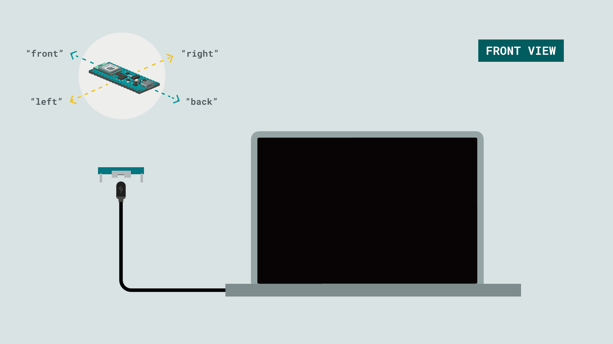
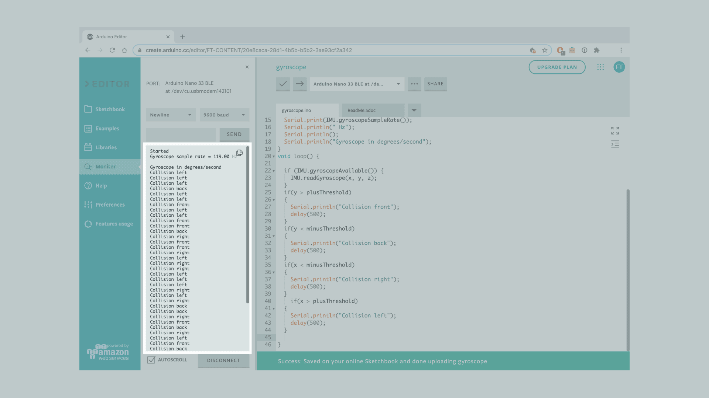

This tutorial will focus on the 3-axis gyroscope sensor of the **LSM9DS1** module, on the Arduino Nano 33 BLE Sense, in order to measure the direction of force on the board to emulate an object's crash. This will be achieved by utilizing the values of the gyroscope's axes and later print the return values through the Arduino IDE Serial Monitor.


## Goals

The goals of this project are:
- Understand what an LSM9DS1 module is.
- Use the LSM9DS1 library.
- Read data from the gyroscope's sensor.
- Convert the raw data into direction of force.
- Print out live data through the Serial Monitor.


## Hardware & Software Needed

* This project uses no external sensors or components.
* In this tutorial we will use the Arduino Create Cloud Editor to program the board.


## The LSM9DS1 Inertial Module

IMU stands for: inertial measurement unit. It is an electronic device that measures and reports a body's specific force, angular rate and the orientation of the body, using a combination of accelerometers, gyroscopes, and oftentimes magnetometers. In this tutorial we will learn a bit more of the LSM9DS1 IMU module, which is included in the Arduino Nano 33 BLE Sense Board.


The LSM9DS1 is a system-in-package featuring a 3D digital linear acceleration sensor, a 3D digital angular rate sensor, and a 3D digital magnetic sensor. 


### The Library
The Arduino LSM9DS1 library allows us to use the Arduino Nano 33 BLE Sense IMU module without having to go into complicated programming. The library takes care of the sensor initialization and sets its values as follows:

- **Accelerometer** range is set at [-4, +4]g -/+0.122 mg.
- **Gyroscope** range is set at [-2000, +2000] dps +/-70 mdps.
- **Magnetometer** range is set at [-400, +400] uT +/-0.014 uT.
- **Accelerometer** output data rate is fixed at 104 Hz.
- **Gyroscope** output data rate is fixed at 104 Hz.
- **Magnetometer** output data rate is fixed at 20 Hz.


If you want to read more about the LSM9DS1 sensor module see <a href="https://www.st.com/resource/en/datasheet/lsm9ds1.pdf" target="_blank">here</a>. 


### Gyroscope
A gyroscope sensor is a device that can measure and maintain the orientation and angular velocity of an object. Gyroscopes are more advanced than accelerometers, as they can measure the tilt and lateral orientation of an object, whereas an accelerometer can only measure its linear motion. 


Gyroscope sensors are also called "Angular Rate Sensors" or "Angular Velocity Sensors". Measured in degrees per second, angular velocity is the change in the rotational angle of the object per unit of time. 

In this example, we will use the gyroscope as an indicator for the direction of the force that is applied to the board. This will be achieved by swiftly moving the board for an instant in four directions: forward, backward, to the left and to the right. The results will be visible through the Serial Monitor.


## Creating the Program

**1. Setting up**

Let's start by opening the [Arduino Cloud Editor](https://create.arduino.cc/editor), click on the **Libraries** tab and search for the **LSM9DS1** library. Then in **> Examples**, open the **SimpleGyroscope** sketch and once it opens, rename it as **Gyroscope**.


**2. Connecting the board**

Now, connect the Arduino Nano 33 BLE Sense to the computer and make sure that the Cloud Editor recognizes it, if so, the board and port should appear as shown in the image below. If they don't appear, follow the [instructions](https://create.arduino.cc/getting-started/plugin/welcome) to install the plugin that will allow the Editor to recognize your board.


**3. Printing the board's direction of force**

Now we will need to modify the code on the example, in order to print the board's direction of force as we move it in different angles.

Let's start by initializing the the x, y, z axes as `float` data types, and the `int plusThreshold = 30;` and `int minusThreshold = -30;` value threshold variables before the `setup()`.

In the `setup()` we should **remove** the last line of code, as we won't print the raw values of the axes:

```arduino
Serial.println("X\tY\tZ");
```

Next, in the `loop()` we can **remove** the following, since we initialized in the beginning,

```arduino
float x, y, z;
```

as well as the following lines that won't be required: 

```arduino
Serial.print(x);
Serial.print('\t');
Serial.print(y);
Serial.print('\t');
Serial.println(z);
```

Instead, we will add four `if` statements, following the already existing one that checks if the sensor is available and then reads the 3 axes.

Here is the code we will add:

```arduino
if(y > plusThreshold)
{
Serial.println("Collision front");
delay(500);
}
if(y < minusThreshold)
{
Serial.println("Collision back");
delay(500);
}
if(x < minusThreshold)
{
Serial.println("Collision right");
delay(500);
}
if(x > plusThreshold)
{
Serial.println("Collision left");
delay(500);
}
```

These `if` statements will check the x and y values of `plusThreshold` and `minusThreshold` that we defined in the beginning. According to these values the direction of the force that we move our board towards, will be printed. 


**4. Complete code**

If you choose to skip the code building section, the complete code can be found below:

```arduino
/*
  Arduino LSM9DS1 - Gyroscope Application

  This example reads the gyroscope values from the LSM9DS1 sensor 
  and prints them to the Serial Monitor or Serial Plotter, as a directional detection of 
  an axis' angular velocity.

  The circuit:
  - Arduino Nano 33 BLE Sense

  Created by Riccardo Rizzo

  Modified by Benjamin Dannegård
  30 Nov 2020

  This example code is in the public domain.
*/

#include <Arduino_LSM9DS1.h>

float x, y, z;
int plusThreshold = 30, minusThreshold = -30;

void setup() {
  Serial.begin(9600);
  while (!Serial);
  Serial.println("Started");

  if (!IMU.begin()) {
    Serial.println("Failed to initialize IMU!");
    while (1);
  }
  Serial.print("Gyroscope sample rate = ");
  Serial.print(IMU.gyroscopeSampleRate());
  Serial.println(" Hz");
  Serial.println();
  Serial.println("Gyroscope in degrees/second");
}
void loop() {
  
  if (IMU.gyroscopeAvailable()) {
    IMU.readGyroscope(x, y, z);
  }
  if(y > plusThreshold)
  {
    Serial.println("Collision front");
    delay(500);
  }
  if(y < minusThreshold)
  {
    Serial.println("Collision back");
    delay(500);
  }
  if(x < minusThreshold)
  {
    Serial.println("Collision right");
    delay(500);
  }
    if(x > plusThreshold)
  {
    Serial.println("Collision left");
    delay(500);
  }
  
}
```


## Testing It Out
In order to get a correct reading of the board data, before uploading the sketch to the board hold the board in your hand, from the side of the USB port. The board should be facing up and "pointing" away from you. The image below illustrates the board's position and how it works:



Next, you can verify and upload the sketch to the board and open the Monitor from the menu on the left.  

Now with the board parallel to the ground you can swiftly move it towards one direction: forward, backwards, right or left. According to the movement of your choice, the results will print every second to your monitor!


Here is a screenshot of the sketch returning these values:




### Troubleshoot

Sometimes errors occur, if the code is not working there are some common issues we can troubleshoot:
- Missing a bracket or a semicolon.
- Arduino board connected to the wrong port. 
- Accidental interruption of cable connection.


## Conclusion

In this simple tutorial we learned what an IMU sensor module is, how to use the **LSM9DS1** library, and how to use an Arduino Nano 33 BLE Sense microcontroller, to measure and print out values from a gyroscope sensor. Furthermore, we created an application that detects the direction of force that we can apply to the board.

