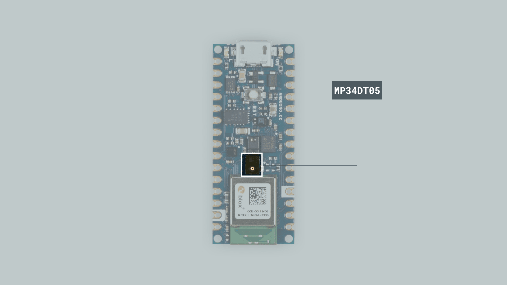
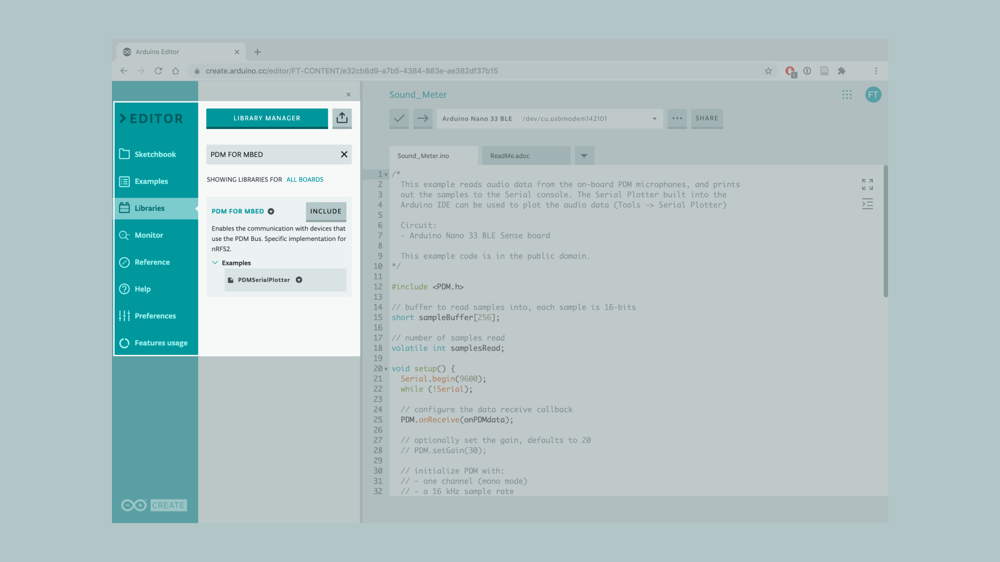
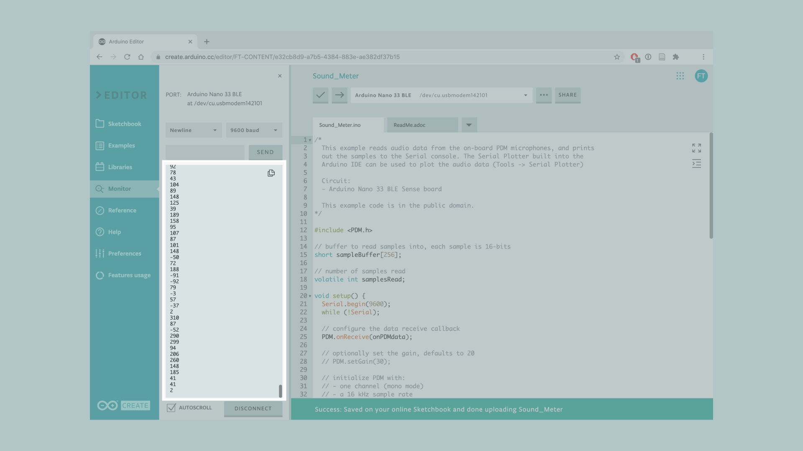

In this tutorial we will use an **Arduino Nano 33 BLE Sense** board to measure and display the sound values of your surroundings, made possible by the embedded **MP34DT05** sensor.

> **Warning:** A very small percentage of people may experience a seizure when exposed to flashing lights or patterns. Even people who have no history of seizures or epilepsy may have an undiagnosed condition that can cause these “photosensitive epileptic seizures” while watching lights blinking fast. **Immediately stop and consult a doctor if you experience any symptoms.**


## Goals

The goals of this project are:

- Learn how to output raw sensor data from the Arduino Nano 33 BLE Sense.
- Use the PDM(Pulse-density modulation) library.
- Print sound values in the Serial Monitor.
- Create your own RGB sound meter.


## Hardware & Software Needed
* Arduino Nano 33 BLE Sense.
* This project uses no external sensors or components.
* In this tutorial we will use the [Arduino Cloud Editor](https://create.arduino.cc/editor) to program the board.


## The MP34DT05 Sensor



Microphones are components that convert physical sound into digital data. Microphones are commonly used in mobile terminals, speech recognition systems or even gaming and virtual reality input devices.

The MP34DT05 sensor is a ultra-compact microphone that use PDM (Pulse-Density Modulation) to represent an analog signal with a binary signal. The sensor's range of different values are the following:

- Signal-to-noise ratio: 64dB
- Sensitivity: -26dBFS ±3dB
- Temperature range: -40 to 85°C

If you want to read more about the MP34DT05 sensor you can take a look at the <a href="https://content.arduino.cc/assets/Nano_BLE_Sense_mp34dt05-a.pdf" target="_blank">datasheet</a>.


## Creating the Program

**1. Setting up**

Let's start by opening the [Arduino Cloud Editor](https://create.arduino.cc/editor), click on the **Libraries** tab, search for the **PDM FOR MBED** library, then in **Examples**, open the **PDMSerialPlotter** example. Once the sketch is open, rename it as **Sound_Meter**.



**2. Connecting the board**

Now, connect the Arduino Nano 33 BLE Sense to the computer to check that the Cloud Editor recognizes it, if so, the  board and port should appear as shown in the image. If they don't appear, follow the [instructions](https://create.arduino.cc/getting-started/plugin/welcome) to install the plugin that will allow the Editor to recognize your board.


**3. Printing and displaying sound values**

Now we will need to modify the code of the example, in order to print the sound values and turn on a different LED based how noisy is the sound.

Before the `setup()` there are two types of variables initialized. One is a `short` variable and the other is a `volatile int` variable. We use the `short` type variable to store 16-bit data-types as the `sampleBuffer[256]`. The other, `volatile`, is a keyword known as a variable qualifier. It is usually used before the datatype of a variable, in order to modify the way in which the compiler and subsequent program treat the variable. In this case, it directs the compiler to load the variable `samplesRead` from RAM and not from a storage register.

```arduino
#include <PDM.h>

// buffer to read samples into, each sample is 16-bits
short sampleBuffer[256];

// number of samples read
volatile int samplesRead;
```

In the `setup()`, we use the `PDM.conReceive()` function to configure the data receive callback. Lastly, the `PDM.begin()` sets the sensor to read data from just one channel and a sample rate of 16 kHz, this statement is inside an `if()` that will print a message, as a string, in case the sensor has not been properly initialized.

```arduino
void setup() {
  Serial.begin(9600);
  while (!Serial);

  // configure the data receive callback
  PDM.onReceive(onPDMdata);

  // optionally set the gain, defaults to 20
  // PDM.setGain(30);

  // initialize PDM with:
  // - one channel (mono mode)
  // - a 16 kHz sample rate
  if (!PDM.begin(1, 16000)) {
    Serial.println("Failed to start PDM!");
    while (1);
  }
}
```

Then, in the `loop()`, let's modify the example code by adding the following portion of code inside the `for()` loop, after the `Serial.println()` function.

```arduino
// check if the sound value is higher than 500
     if (sampleBuffer[i]>=500){
       digitalWrite(LEDR,LOW);
       digitalWrite(LEDG,HIGH);
       digitalWrite(LEDB,HIGH);
     }
     // check if the sound value is higher than 250 and lower than 500
     if (sampleBuffer[i]>=250 && sampleBuffer[i] < 500){
       digitalWrite(LEDB,LOW);
       digitalWrite(LEDR,HIGH);
       digitalWrite(LEDG,HIGH);
     }
     //check if the sound value is higher than 0 and lower than 250
     if (sampleBuffer[i]>=0 && sampleBuffer[i] < 250){
       digitalWrite(LEDG,LOW);
       digitalWrite(LEDR,HIGH);
       digitalWrite(LEDB,HIGH);
     }
```

With this portion of the code, we will turn on the RGB LED based on the amount of sound that the microphones is receiving.

**4. Complete code**

If you choose to skip the code building section, the complete code can be found below:

```arduino
/*
  This example reads audio data from the on-board PDM microphones, and prints
  out the samples to the Serial console. The Serial Plotter built into the
  Arduino IDE can be used to plot the audio data (Tools -> Serial Plotter)

  Circuit:
  - Arduino Nano 33 BLE Sense board

  This example code is in the public domain.
*/

#include <PDM.h>

// buffer to read samples into, each sample is 16-bits
short sampleBuffer[256];

// number of samples read
volatile int samplesRead;

void setup() {
  Serial.begin(9600);
  while (!Serial);

  // configure the data receive callback
  PDM.onReceive(onPDMdata);

  // optionally set the gain, defaults to 20
  // PDM.setGain(30);

  // initialize PDM with:
  // - one channel (mono mode)
  // - a 16 kHz sample rate
  if (!PDM.begin(1, 16000)) {
    Serial.println("Failed to start PDM!");
    while (1);
  }
}

void loop() {
  // wait for samples to be read
  if (samplesRead) {

    // print samples to the serial monitor or plotter
    for (int i = 0; i < samplesRead; i++) {
      Serial.println(sampleBuffer[i]);
      // check if the sound value is higher than 500
      if (sampleBuffer[i]>=500){
        digitalWrite(LEDR,LOW);
        digitalWrite(LEDG,HIGH);
        digitalWrite(LEDB,HIGH);
      }
      // check if the sound value is higher than 250 and lower than 500
      if (sampleBuffer[i]>=250 && sampleBuffer[i] < 500){
        digitalWrite(LEDB,LOW);
        digitalWrite(LEDR,HIGH);
        digitalWrite(LEDG,HIGH);
      }
      //check if the sound value is higher than 0 and lower than 250
      if (sampleBuffer[i]>=0 && sampleBuffer[i] < 250){
        digitalWrite(LEDG,LOW);
        digitalWrite(LEDR,HIGH);
        digitalWrite(LEDB,HIGH);
      }
    }

    // clear the read count
    samplesRead = 0;
  }
}

void onPDMdata() {
  // query the number of bytes available
  int bytesAvailable = PDM.available();

  // read into the sample buffer
  PDM.read(sampleBuffer, bytesAvailable);

  // 16-bit, 2 bytes per sample
  samplesRead = bytesAvailable / 2;
}
```


## Testing It Out

After you have successfully verified and uploaded the sketch to the board, open the Serial Monitor from the menu on the left. You will now see the new values printed.



If you want to test it, the only thing you need to do is to place the board next to a speaker and play some music to see how the colors of the RGB LED change based on the music.


**Warning:** Remember that depending of the music, lights might blink too fast. **Immediately stop playing and consult a doctor if you experience any symptoms of “photosensitive epileptic seizures”.**


### Troubleshoot

Sometimes errors occur, if the project is not working as intended there are some common issues we can troubleshoot:
- Missing a bracket or a semicolon.
- If your Arduino board is not recognized, check that the Create plugin is running properly on your computer.
- Accidental interruption of cable connection.
- The sound of the music is too low or the board is too far from the speaker.


## Conclusion

In this simple tutorial we learned how to read sound values from the **MP34DT05** sensor using the [PDM library](https://github.com/arduino/ArduinoCore-nRF528x-mbedos/tree/master/libraries/PDM), and how to use the sensor embedded in the Arduino Nano 33 BLE Sense board in order to print out sound values from the environment and visualize them through the RGB LED.

