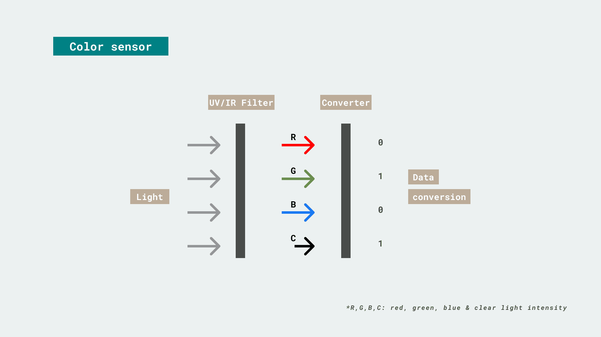
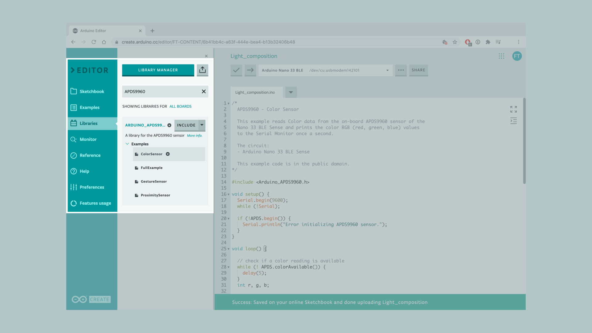
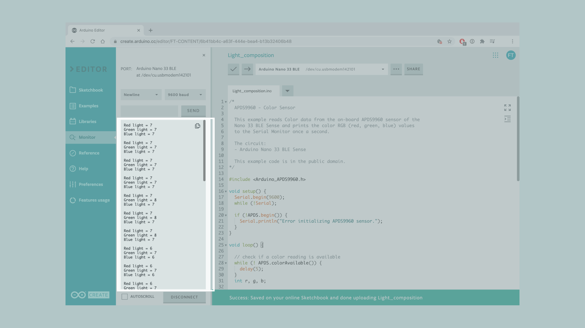
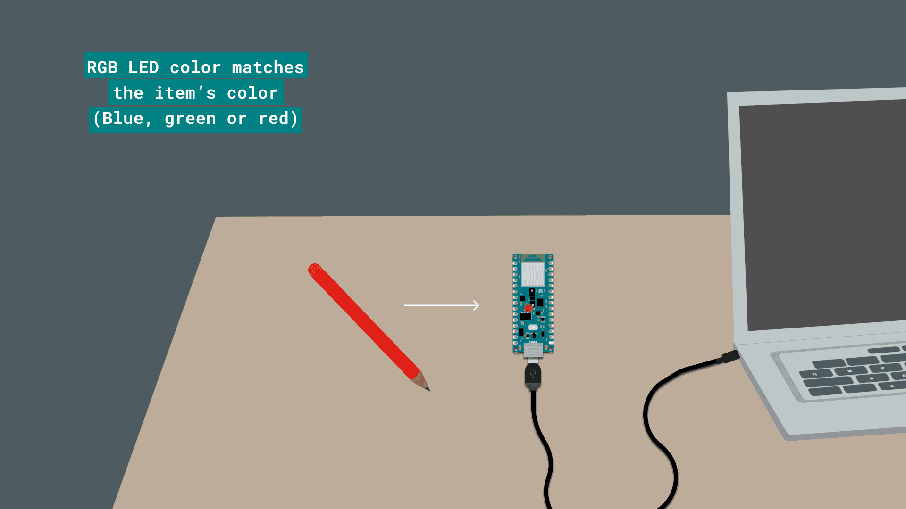

In this tutorial we will use an **Arduino Nano 33 BLE Sense** board to measure the main component of the light projected from an item in our environment, using the on-board [**APDS9960**](https://docs.broadcom.com/doc/AV02-4191EN) sensor. This will turn on the red, green or blue on-board LEDs depending on what color the item close to the sensor is.. 

## Goals
The goals of this project are:
- Learn how the APDS9960 light sensor works.
- Learn how to use the APDS9960 library.
- Learn how to read specific colors and simulate them with the RGB LED embedded on the Nano 33 BLE Sense board.
- Learn how to control the on-board RGB LED by using the data collected from a sensor.


## Hardware & Software Needed
* Arduino Nano 33 BLE Sense.
* This project uses no external sensors or components.
* In this tutorial we will use the [Arduino Cloud Editor](https://create.arduino.cc/editor) to program the board.


## The APDS9960 Sensor


The APDS9960 sensor is a multipurpose device that features advanced Gesture detection, Proximity detection, Digital Ambient Light Sense (ALS) and Color Sense (RGBC). A vastly popular application of the APDS9960 sensor is in smartphones, where it is used to disable the screen when the user places the phone on their ear.

If you want to read more about the APDS9960 sensor module see [here](https://content.arduino.cc/assets/Nano_BLE_Sense_av02-4191en_ds_apds-9960.pdf).

### Color Sensor



White light is actually made of all of the colours of the rainbow because it contains all wavelengths, and it is described as polychromatic light. The color sensor is separated in four different channels (Red, Green, Blue and Clear light intensity). Each of them have a UV and IR blocking filter and a dedicated data converter to read the data simultaneously.

It features:
- Four different channels to different color data
- Ability to produce 16-bit data simultaneously
- Accurate measurement of the ambient light and sense color

## Creating the Program

**1.** Setting up

Let's start by opening the [Arduino Cloud Editor](https://create.arduino.cc/editor), click on the **Libraries** tab, search for the **APDS9960** library, then in **Examples**, open the **ColorSensor** example. Once the sketch is open, rename it as **Light_composition**.



**2.** Connecting the board

Now, connect the Arduino Nano 33 BLE Sense to the computer to check that the Cloud Editor recognizes it, if so, the  board and port should appear as shown in the image. If they don't appear, follow the [instructions](https://create.arduino.cc/getting-started/plugin/welcome) to install the plugin that will allow the Editor to recognize your board.


**3.** Code walkthrough

First, we need to include the APDS9960 library that will allow us to control the sensor. To do so, we need to add the following portion of code before the `setup()` function.

```arduino
#include <Arduino_APDS9960.h>
```

We will keep the `setup()` section as it is, on it we have the `ADPS.begin()` within an `if` statement. This initializes the color sensor and will print a message in the Serial Monitor in case the sensor has not been successfully initialized. This string can be any message of your choice.

```arduino
void setup() {
  Serial.begin(9600);
  while (!Serial);

  if (!APDS.begin()) {
    Serial.println("Error initializing APDS9960 sensor.");
  }
}
```

In the `loop()`, we use the `colorAvailable()` function that checks if the sensor has detected any color data to read. Then, we will store the color data in the `r`, `g` and `b` variables using the `APDS.readColor()` function. After the `ADPS.readColor()` function, we need to add some `if...else` statements to know what is the dominant primary color and `digitalWrite()` functions to turn on the RGB LED based on it.

```arduino
if (r > g & r > b)
  {
    digitalWrite(LEDR, LOW);
    digitalWrite(LEDG, HIGH);
    digitalWrite(LEDB, HIGH);
  }
  else if (g > r & g > b)
  {
    digitalWrite(LEDG, LOW);
    digitalWrite(LEDR, HIGH);
    digitalWrite(LEDB, HIGH);
  }
  else if (b > g & b > r)
  {
    digitalWrite(LEDB, LOW);
    digitalWrite(LEDR, HIGH);
    digitalWrite(LEDG, HIGH);
  }
  else
  {
    digitalWrite(LEDR, HIGH);
    digitalWrite(LEDG, HIGH);
    digitalWrite(LEDB, HIGH);
  }
```

Lastly, we use the `Serial.print()` and `Serial.println` functions to print out the color measured to the Serial Monitor.

**4.** Complete code

If you choose to skip the code building section, the complete code can be found below:

```arduino
/*
  APDS9960 - Color Sensor

  This example reads Color data from the on-board APDS9960 sensor of the
  Nano 33 BLE Sense and prints the color RGB (red, green, blue) values
  to the Serial Monitor once a second.

  The circuit:
  - Arduino Nano 33 BLE Sense

  This example code is in the public domain.
*/

#include <Arduino_APDS9960.h>

void setup() {
  Serial.begin(9600);
  while (!Serial);

  if (!APDS.begin()) {
    Serial.println("Error initializing APDS9960 sensor.");
  }
}

void loop() {

  // check if a color reading is available
  while (! APDS.colorAvailable()) {
    delay(5);
  }
  int r, g, b;

  // read the color
  APDS.readColor(r, g, b);

  if (r > g & r > b)
  {
    digitalWrite(LEDR, LOW);
    digitalWrite(LEDG, HIGH);
    digitalWrite(LEDB, HIGH);
  }
  else if (g > r & g > b)
  {
    digitalWrite(LEDG, LOW);
    digitalWrite(LEDR, HIGH);
    digitalWrite(LEDB, HIGH);
  }
  else if (b > g & b > r)
  {
    digitalWrite(LEDB, LOW);
    digitalWrite(LEDR, HIGH);
    digitalWrite(LEDG, HIGH);
  }
  else
  {
    digitalWrite(LEDR, HIGH);
    digitalWrite(LEDG, HIGH);
    digitalWrite(LEDB, HIGH);
  }


  // print the values
  Serial.print("Red light = ");
  Serial.println(r);
  Serial.print("Green light = ");
  Serial.println(g);
  Serial.print("Blue light = ");
  Serial.println(b);
  Serial.println();

  // wait a bit before reading again
  delay(500);
}
```


## Testing It Out

After you have successfully verified and uploaded the sketch to the board, open the Serial Monitor from the menu on the left. You will now see the new values printed as shown in the image below. 



If you want to test out whether it is working, you could point the board to different objects of different colors to see the variables increase or decrease and the color of the RGB LED changing.




### Troubleshoot

Sometimes errors occur, if the project is not working as intended there are some common issues we can troubleshoot:
- Missing a bracket or a semicolon.
- If your Arduino board is not recognized, check that the Create plugin is running properly on your computer.
- The room is too dark 


## Conclusion

In this simple tutorial we learned how to read color values from the **APDS9960** sensor using the [APDS9960 library](https://github.com/arduino-libraries/Arduino_APDS9960), and how to use the sensor embedded in the Arduino Nano 33 BLE Sense board, to measure and print out color values from the environment to the Serial Monitor and transfer those values to the RGB LED to display the dominant primary color.
